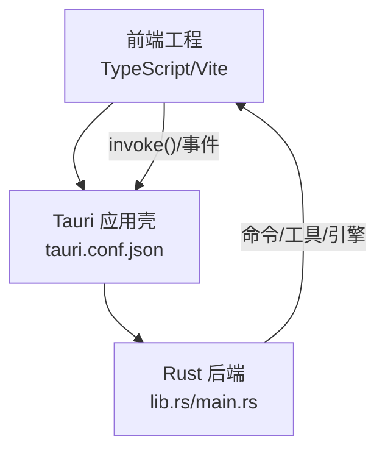
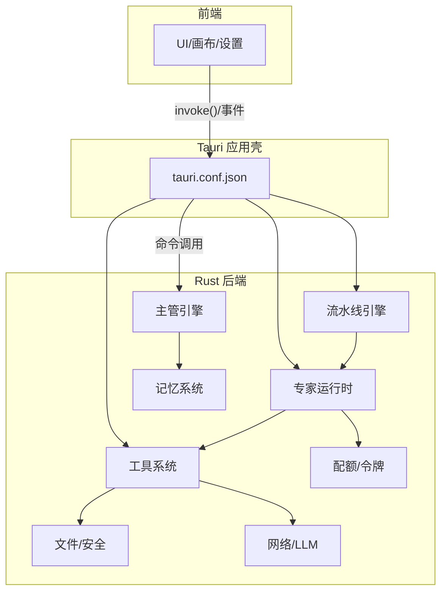
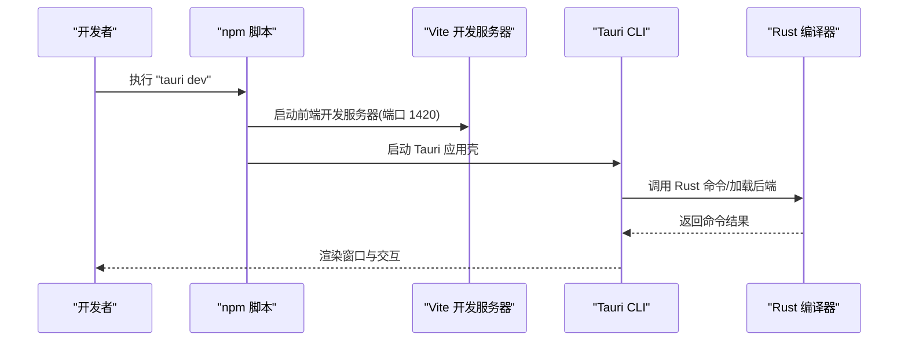
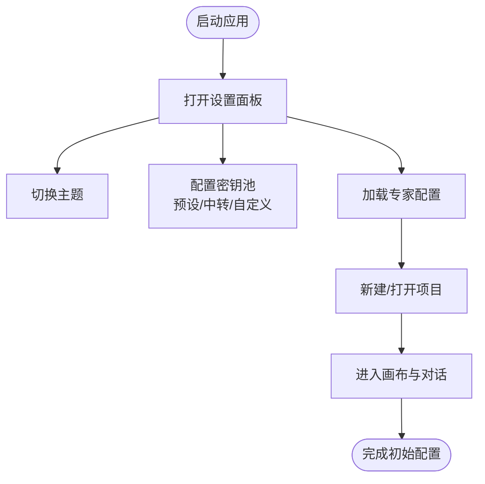
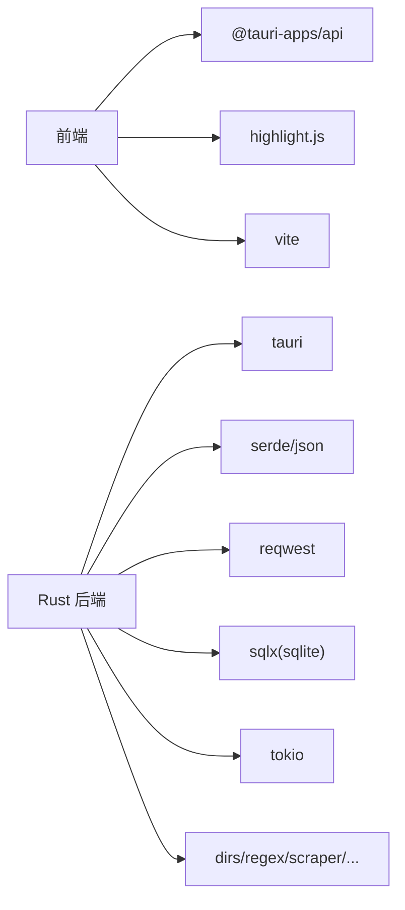

# 快速开始

<cite>
**本文引用的文件**
- [README.md](file://ai-experts/README.md)
- [package.json](file://ai-experts/package.json)
- [vite.config.ts](file://ai-experts/vite.config.ts)
- [tauri.conf.json](file://ai-experts/src-tauri/tauri.conf.json)
- [Cargo.toml](file://ai-experts/src-tauri/Cargo.toml)
- [main.rs](file://ai-experts/src-tauri/src/main.rs)
- [lib.rs](file://ai-experts/src-tauri/src/lib.rs)
- [main.ts](file://ai-experts/src/main.ts)
- [config-cascade.ts](file://ai-experts/src/config-cascade.ts)
- [shell_executor.rs](file://ai-experts/src-tauri/src/shell_executor.rs)
- [desktop-schema.json](file://ai-experts/src-tauri/gen/schemas/desktop-schema.json)
- [windows-schema.json](file://ai-experts/src-tauri/gen/schemas/windows-schema.json)
</cite>

## 目录
1. [简介](#简介)
2. [项目结构](#项目结构)
3. [核心组件](#核心组件)
4. [架构概览](#架构概览)
5. [详细组件分析](#详细组件分析)
6. [依赖分析](#依赖分析)
7. [性能考虑](#性能考虑)
8. [故障排除指南](#故障排除指南)
9. [结论](#结论)
10. [附录](#附录)

## 简介
本指南面向首次接触“星图专家团工作台（社区版）”的开发者与用户，帮助你在 Windows、macOS、Linux 三大平台上快速完成环境准备、依赖安装、编译与运行，并掌握首次运行时的初始配置与基本使用方法。项目采用前端 TypeScript + Tauri 框架，后端 Rust 提供高性能工作流引擎与工具系统，支持本地化运行与多模态输入。

## 项目结构
项目采用“前端 + Tauri 应用壳 + Rust 后端”的分层架构：
- ai-experts/frontend：TypeScript/Vite 前端工程，负责 UI、对话、画布与设置面板
- ai-experts/src-tauri：Rust 工程，提供 Tauri 命令、工作流引擎、工具系统、文件与网络能力
- ai-experts/src-tauri/gen/schemas：Tauri 能力与权限的 JSON Schema，用于安全与权限控制

图表来源
- [tauri.conf.json:1-38](file://ai-experts/src-tauri/tauri.conf.json#L1-L38)
- [vite.config.ts:1-31](file://ai-experts/vite.config.ts#L1-L31)
- [lib.rs:1-52](file://ai-experts/src-tauri/src/lib.rs#L1-L52)

章节来源
- [tauri.conf.json:1-38](file://ai-experts/src-tauri/tauri.conf.json#L1-L38)
- [vite.config.ts:1-31](file://ai-experts/vite.config.ts#L1-L31)
- [Cargo.toml:1-46](file://ai-experts/src-tauri/Cargo.toml#L1-L46)

## 核心组件
- 前端入口与窗口控制：main.ts 负责窗口最小化/最大化/关闭、拖拽、主题切换、设置面板、密钥池与专家配置加载等
- Tauri 配置：tauri.conf.json 定义应用名、窗口尺寸、开发/构建钩子、打包图标与安全策略
- Vite 配置：固定端口 1420，严格端口占用，HMR 主机可选，忽略 src-tauri 目录
- Rust 后端：lib.rs 暴露大量 Tauri 命令（主管分析、流水线执行、专家运行时、工具执行、交付分析、配额与令牌统计等）

章节来源
- [main.ts:1-258](file://ai-experts/src/main.ts#L1-L258)
- [tauri.conf.json:1-38](file://ai-experts/src-tauri/tauri.conf.json#L1-L38)
- [vite.config.ts:7-29](file://ai-experts/vite.config.ts#L7-L29)
- [lib.rs:707-800](file://ai-experts/src-tauri/src/lib.rs#L707-L800)

## 架构概览
前端通过 Tauri 命令与 Rust 后端交互，后端提供工作流引擎、专家运行时、工具系统、感知索引与记忆系统、文件与网络能力，以及配额与令牌管理。

图表来源
- [lib.rs:1-52](file://ai-experts/src-tauri/src/lib.rs#L1-L52)
- [tauri.conf.json:1-38](file://ai-experts/src-tauri/tauri.conf.json#L1-L38)

## 详细组件分析

### 环境与依赖要求
- Node.js：18 或以上
- Rust：最新稳定版
- Tauri CLI：随项目配置安装
- 平台工具链：Windows（MSVC 或 GNU 工具链）、macOS（Xcode 命令行工具）、Linux（GCC/Clang、pkg-config 等）

章节来源
- [README.md:363-367](file://ai-experts/README.md#L363-L367)
- [package.json:21-26](file://ai-experts/package.json#L21-L26)
- [Cargo.toml:1-46](file://ai-experts/src-tauri/Cargo.toml#L1-L46)

### 安装与运行（Windows）
- 步骤
  1) 安装 Node.js 18+ 与 Rust 稳定版
  2) 在项目根目录安装依赖：npm install
  3) 启动开发模式：npm run tauri dev
  4) 如需构建：npm run tauri build
- 注意事项
  - 若 Windows 使用 MSVC，确保已安装 Visual Studio Build Tools 或 Visual Studio
  - 若使用 GNU 工具链，确保已安装 MinGW-w64 或同等工具链
  - 端口 1420 需保持空闲，否则 Vite 将启动失败

章节来源
- [README.md:368-384](file://ai-experts/README.md#L368-L384)
- [vite.config.ts:14-18](file://ai-experts/vite.config.ts#L14-L18)
- [tauri.conf.json:6-11](file://ai-experts/src-tauri/tauri.conf.json#L6-L11)

### 安装与运行（macOS）
- 步骤
  1) 安装 Node.js 18+ 与 Rust 稳定版
  2) 安装 Xcode 命令行工具（xcode-select --install）
  3) 在项目根目录安装依赖：npm install
  4) 启动开发模式：npm run tauri dev
  5) 如需构建：npm run tauri build
- 注意事项
  - 若遇到链接错误，确认已安装 Xcode 命令行工具
  - 若需要签名与打包，可在 tauri.conf.json 中配置签名参数

章节来源
- [README.md:368-384](file://ai-experts/README.md#L368-L384)
- [tauri.conf.json:26-36](file://ai-experts/src-tauri/tauri.conf.json#L26-L36)

### 安装与运行（Linux）
- 步骤
  1) 安装 Node.js 18+ 与 Rust 稳定版
  2) 安装系统依赖（以 Debian/Ubuntu 为例：build-essential pkg-config libgtk-3-dev libwebkit2gtk-4.0-dev libappindicator3-dev librsvg2-dev）
  3) 在项目根目录安装依赖：npm install
  4) 启动开发模式：npm run tauri dev
  5) 如需构建：npm run tauri build
- 注意事项
  - 若缺少 GTK/WebKit2 库，将导致构建失败
  - 若需要打包 AppImage/Deb/RPM，可在 tauri.conf.json 中启用相应打包目标

章节来源
- [README.md:368-384](file://ai-experts/README.md#L368-L384)
- [tauri.conf.json:26-36](file://ai-experts/src-tauri/tauri.conf.json#L26-L36)

### 编译与构建流程
- 开发模式：Vite 监听前端变化，Tauri 在启动前执行 npm run dev，前端监听 1420 端口
- 生产构建：先执行 TypeScript/Vite 构建，再由 Tauri CLI 调用 Rust 编译生成原生应用包

图表来源
- [tauri.conf.json:6-11](file://ai-experts/src-tauri/tauri.conf.json#L6-L11)
- [vite.config.ts:7-29](file://ai-experts/vite.config.ts#L7-L29)
- [package.json:6-14](file://ai-experts/package.json#L6-L14)

章节来源
- [tauri.conf.json:6-11](file://ai-experts/src-tauri/tauri.conf.json#L6-L11)
- [vite.config.ts:7-29](file://ai-experts/vite.config.ts#L7-L29)
- [package.json:6-14](file://ai-experts/package.json#L6-L14)

### 第一次运行与初始配置
- 启动应用后，进入设置面板（顶部设置按钮）
- 配置主题：支持明暗主题切换
- 配置密钥池：支持预设提供商与中转密钥，用于专家调用 LLM
- 配置专家：加载专家列表与专家-工具权限映射
- 项目初始化：拖拽本地项目文件夹至窗口，或通过菜单新建/打开项目

图表来源
- [main.ts:378-434](file://ai-experts/src/main.ts#L378-L434)
- [main.ts:532-605](file://ai-experts/src/main.ts#L532-L605)

章节来源
- [main.ts:378-434](file://ai-experts/src/main.ts#L378-L434)
- [main.ts:532-605](file://ai-experts/src/main.ts#L532-L605)

### 基本使用示例
- 发送消息：在输入区输入文本，支持“按计划进行/按目标进行”两种执行模式
- 附件上传：支持图片、文本、CSV、代码等多模态附件
- 画布操作：在无限画布上进行思维导图、流程图与结构化展示
- 专家协作：主管分析意图后，按流水线动态调度专家执行任务

章节来源
- [main.ts:697-757](file://ai-experts/src/main.ts#L697-L757)

## 依赖分析
- 前端依赖
  - @tauri-apps/api：与后端命令交互
  - highlight.js：代码高亮
  - vite：开发与构建工具
- Rust 依赖
  - tauri、tauri-plugin-*：应用壳与插件
  - serde、serde_json：序列化
  - reqwest、tokio：HTTP 与异步
  - sqlx：SQLite 数据库
  - dirs、regex、scraper、calamine、docx-rs 等：文件与文档处理

图表来源
- [package.json:15-26](file://ai-experts/package.json#L15-L26)
- [Cargo.toml:20-46](file://ai-experts/src-tauri/Cargo.toml#L20-L46)

章节来源
- [package.json:15-26](file://ai-experts/package.json#L15-L26)
- [Cargo.toml:20-46](file://ai-experts/src-tauri/Cargo.toml#L20-L46)

## 性能考虑
- 前端开发服务器固定端口与严格端口占用，避免端口冲突导致的反复重启
- Rust 后端使用 tokio 多线程运行时与异步 I/O，适合高并发与长耗时任务
- 工具系统与文件补丁采用结构化容错与增量落盘，减少无效请求与磁盘写入
- 配额与令牌管理在调用前进行校验，避免无效请求造成资源浪费

章节来源
- [vite.config.ts:12-18](file://ai-experts/vite.config.ts#L12-L18)
- [Cargo.toml:27-28](file://ai-experts/src-tauri/Cargo.toml#L27-L28)
- [lib.rs:321-338](file://ai-experts/src-tauri/src/lib.rs#L321-L338)

## 故障排除指南
- 端口占用（1420/1421）
  - 现象：开发模式启动失败，提示端口被占用
  - 处理：释放端口或在 vite.config.ts 中修改端口
- Windows 构建失败（MSVC/GNU）
  - 现象：链接错误或找不到工具链
  - 处理：安装 Visual Studio Build Tools（MSVC）或 MinGW-w64（GNU）
- Linux 构建失败（缺少系统库）
  - 现象：链接 GTK/Webkit2 库失败
  - 处理：安装 libgtk-3-dev、libwebkit2gtk-4.0-dev 等系统依赖
- macOS 构建失败（Xcode 工具链）
  - 现象：找不到 clang 或链接器
  - 处理：执行 xcode-select --install 安装命令行工具
- 命令执行异常（Windows PowerShell/命令）
  - 现象：某些命令在 Windows 下执行失败
  - 处理：Rust 层已对 Windows 命令进行识别与规范化，确保命令符合平台语法
- 权限与能力（Tauri 能力）
  - 现象：文件系统/对话框等命令被拒绝
  - 处理：检查 tauri.conf.json 中的能力配置与 desktop-schema.json/windows-schema.json 的权限定义

章节来源
- [vite.config.ts:14-24](file://ai-experts/vite.config.ts#L14-L24)
- [shell_executor.rs:15-46](file://ai-experts/src-tauri/src/shell_executor.rs#L15-L46)
- [desktop-schema.json:42-67](file://ai-experts/src-tauri/gen/schemas/desktop-schema.json#L42-L67)
- [windows-schema.json:42-67](file://ai-experts/src-tauri/gen/schemas/windows-schema.json#L42-L67)

## 结论
通过本指南，你可以在三大主流平台上完成环境准备、依赖安装与项目运行，并在首次启动时完成主题、密钥池与专家配置的初始化。随后即可体验多模态输入、无限画布与专家协作的完整工作流。若遇到平台特定问题，可参考“故障排除指南”中的具体步骤逐一排查。

## 附录
- 开发推荐：VS Code + Tauri 扩展 + rust-analyzer
- 常用脚本
  - 开发：npm run tauri dev
  - 构建：npm run tauri build
  - 前端构建：npm run build
  - 回归测试：npm run build && npm run cli:test

章节来源
- [README.md:399-402](file://ai-experts/README.md#L399-L402)
- [package.json:6-14](file://ai-experts/package.json#L6-L14)