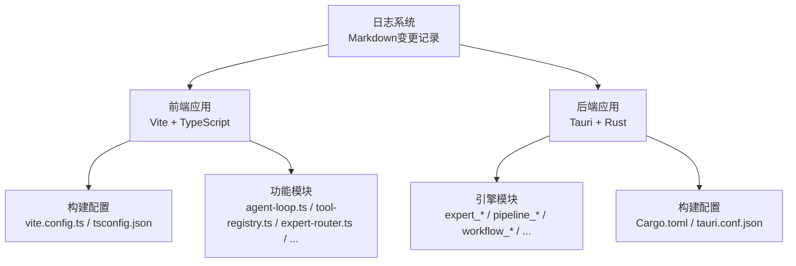
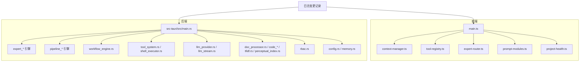
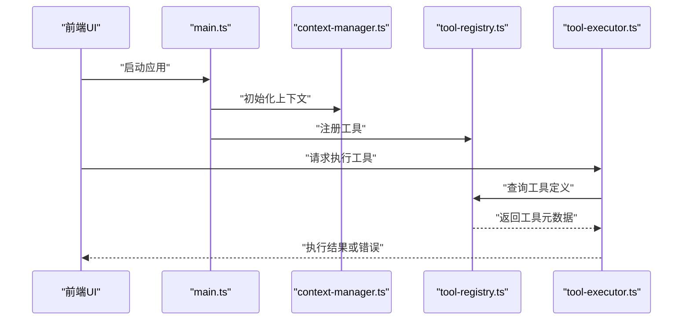
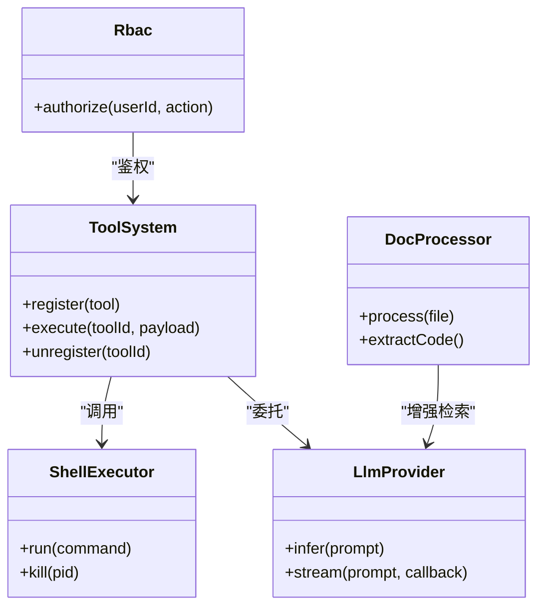
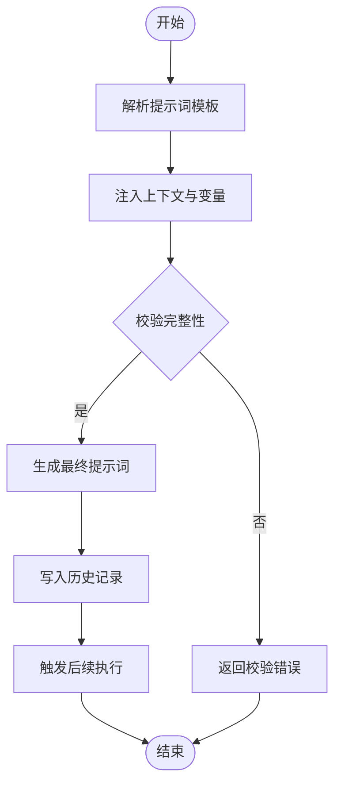
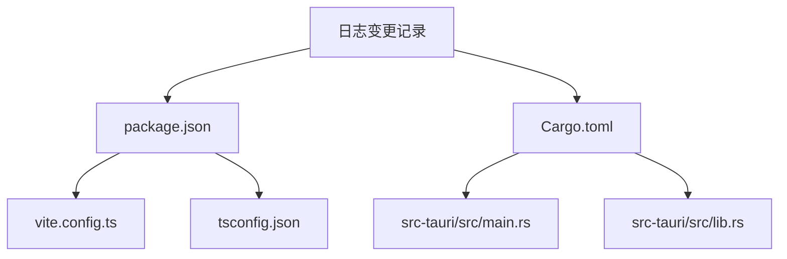
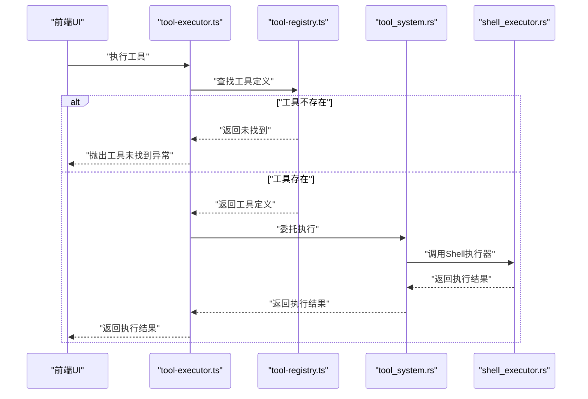

# 故障排除

<cite>
**本文引用的文件**
- [package.json](file://package.json)
- [vite.config.ts](file://vite.config.ts)
- [tsconfig.json](file://tsconfig.json)
- [src/main.ts](file://src/main.ts)
- [src/context-manager.ts](file://src/context-manager.ts)
- [src/tool-registry.ts](file://src/tool-registry.ts)
- [src/memory-store.ts](file://src/memory-store.ts)
- [src/project-health.ts](file://src/project-health.ts)
- [src-tauri/src/main.rs](file://src-tauri/src/main.rs)
- [src-tauri/Cargo.toml](file://src-tauri/Cargo.toml)
- [日志/2026-06-05-v0.1.1.md](file://日志/2026-06-05-v0.1.1.md)
- [日志/2026-06-06-v0.1.1-settings-split.md](file://日志/2026-06-06-v0.1.1-settings-split.md)
- [scripts/cli-workbench.md](file://scripts/cli-workbench.md)
- [scripts/cli-workbench.mjs](file://scripts/cli-workbench.mjs)
- [scripts/prompt-module-replay.ts](file://scripts/prompt-module-replay.ts)
- [src/agent-loop.ts](file://src/agent-loop.ts)
- [src/data-analysis.ts](file://src/data-analysis.ts)
- [src/expert-catalog.ts](file://src/expert-catalog.ts)
- [src/expert-router.ts](file://src/expert-router.ts)
- [src/task-tracker.ts](file://src/task-tracker.ts)
- [src/tool-executor.ts](file://src/tool-executor.ts)
- [src/provider-registry.ts](file://src/provider-registry.ts)
- [src/config-cascade.ts](file://src/config-cascade.ts)
- [src/draft.ts](file://src/draft.ts)
- [src/prompt-modules.ts](file://src/prompt-modules.ts)
- [src/prompt-module-history.ts](file://src/prompt-module-history.ts)
- [src-tauri/src/lib.rs](file://src-tauri/src/lib.rs)
- [src-tauri/src/hooks.rs](file://src-tauri/src/hooks.rs)
- [src-tauri/src/blackboard_engine.rs](file://src-tauri/src/blackboard_engine.rs)
- [src-tauri/src/collaboration_engine.rs](file://src-tauri/src/collaboration_engine.rs)
- [src-tauri/src/pipeline_engine.rs](file://src-tauri/src/pipeline_engine.rs)
- [src-tauri/src/workflow_engine.rs](file://src-tauri/src/workflow_engine.rs)
- [src-tauri/src/expert_runtime_engine.rs](file://src-tauri/src/expert_runtime_engine.rs)
- [src-tauri/src/expert_tool_engine.rs](file://src-tauri/src/expert_tool_engine.rs)
- [src-tauri/src/expert_tool_runtime_engine.rs](file://src-tauri/src/expert_tool_runtime_engine.rs)
- [src-tauri/src/pipeline_runtime_engine.rs](file://src-tauri/src/pipeline_runtime_engine.rs)
- [src-tauri/src/pipeline_session_engine.rs](file://src-tauri/src/pipeline_session_engine.rs)
- [src-tauri/src/pipeline_step_engine.rs](file://src-tauri/src/pipeline_step_engine.rs)
- [src-tauri/src/prompt_module_engine.rs](file://src-tauri/src/prompt_module_engine.rs)
- [src-tauri/src/supervisor_engine.rs](file://src-tauri/src/supervisor_engine.rs)
- [src-tauri/src/token_runtime_engine.rs](file://src-tauri/src/token_runtime_engine.rs)
- [src-tauri/src/web_search.rs](file://src-tauri/src/web_search.rs)
- [src-tauri/src/doc_processor.rs](file://src-tauri/src/doc_processor.rs)
- [src-tauri/src/code_chunker.rs](file://src-tauri/src/code_chunker.rs)
- [src-tauri/src/code_graph.rs](file://src-tauri/src/code_graph.rs)
- [src-tauri/src/code_retention.rs](file://src-tauri/src/code_retention.rs)
- [src-tauri/src/tfidf.rs](file://src-tauri/src/tfidf.rs)
- [src-tauri/src/perceptual_index.rs](file://src-tauri/src/perceptual_index.rs)
- [src-tauri/src/llm_provider.rs](file://src-tauri/src/llm_provider.rs)
- [src-tauri/src/llm_stream.rs](file://src-tauri/src/llm_stream.rs)
- [src-tauri/src/shell_executor.rs](file://src-tauri/src/shell_executor.rs)
- [src-tauri/src/tool_system.rs](file://src-tauri/src/tool_system.rs)
- [src-tauri/src/rbac.rs](file://src-tauri/src/rbac.rs)
- [src-tauri/src/repo_wiki.rs](file://src-tauri/src/repo_wiki.rs)
- [src-tauri/src/approval_store.rs](file://src-tauri/src/approval_store.rs)
- [src-tauri/src/deliverables.rs](file://src-tauri/src/deliverables.rs)
- [src-tauri/src/experience.rs](file://src-tauri/src/experience.rs)
- [src-tauri/src/health_score.rs](file://src-tauri/src/health_score.rs)
- [src-tauri/src/memory.rs](file://src-tauri/src/memory.rs)
- [src-tauri/src/config.rs](file://src-tauri/src/config.rs)
- [src-tauri/src/expert_context_engine.rs](file://src-tauri/src/expert_context_engine.rs)
- [src-tauri/src/expert_identity.rs](file://src-tauri/src/expert_identity.rs)
- [src-tauri/src/expert_postprocess_engine.rs](file://src-tauri/src/expert_postprocess_engine.rs)
- [src-tauri/src/expert_session_engine.rs](file://src-tauri/src/expert_session_engine.rs)
- [src-tauri/src/web_search.rs](file://src-tauri/src/web_search.rs)
- [src-tauri/src/doc_processor.rs](file://src-tauri/src/doc_processor.rs)
- [src-tauri/src/code_chunker.rs](file://src-tauri/src/code_chunker.rs)
- [src-tauri/src/code_graph.rs](file://src-tauri/src/code_graph.rs)
- [src-tauri/src/code_retention.rs](file://src-tauri/src/code_retention.rs)
- [src-tauri/src/tfidf.rs](file://src-tauri/src/tfidf.rs)
- [src-tauri/src/perceptual_index.rs](file://src-tauri/src/perceptual_index.rs)
- [src-tauri/src/llm_provider.rs](file://src-tauri/src/llm_provider.rs)
- [src-tauri/src/llm_stream.rs](file://src-tauri/src/llm_stream.rs)
- [src-tauri/src/shell_executor.rs](file://src-tauri/src/shell_executor.rs)
- [src-tauri/src/tool_system.rs](file://src-tauri/src/tool_system.rs)
- [src-tauri/src/rbac.rs](file://src-tauri/src/rbac.rs)
- [src-tauri/src/repo_wiki.rs](file://src-tauri/src/repo_wiki.rs)
- [src-tauri/src/approval_store.rs](file://src-tauri/src/approval_store.rs)
- [src-tauri/src/deliverables.rs](file://src-tauri/src/deliverables.rs)
- [src-tauri/src/experience.rs](file://src-tauri/src/experience.rs)
- [src-tauri/src/health_score.rs](file://src-tauri/src/health_score.rs)
- [src-tauri/src/memory.rs](file://src-tauri/src/memory.rs)
- [src-tauri/src/config.rs](file://src-tauri/src/config.rs)
- [src-tauri/src/expert_context_engine.rs](file://src-tauri/src/expert_context_engine.rs)
- [src-tauri/src/expert_identity.rs](file://src-tauri/src/expert_identity.rs)
- [src-tauri/src/expert_postprocess_engine.rs](file://src-tauri/src/expert_postprocess_engine.rs)
- [src-tauri/src/expert_session_engine.rs](file://src-tauri/src/expert_session_engine.rs)
</cite>

## 目录
1. [简介](#简介)
2. [项目结构](#项目结构)
3. [核心组件](#核心组件)
4. [架构总览](#架构总览)
5. [详细组件分析](#详细组件分析)
6. [依赖分析](#依赖分析)
7. [性能考虑](#性能考虑)
8. [故障排除指南](#故障排除指南)
9. [结论](#结论)
10. [附录](#附录)

## 简介
本指南面向AI专家工作台的开发者与运维人员，提供系统化的故障排除流程与实践方法。内容覆盖环境与依赖检查、前端与后端编译与运行时问题、性能问题定位（内存、CPU、I/O）、日志系统使用与分析、调试技巧与工具、以及社区支持与问题反馈流程。文档中所有技术细节均基于仓库内实际文件与代码结构进行梳理与总结。

## 项目结构
项目采用前后端分离架构：前端基于Vite与TypeScript，后端基于Tauri与Rust。日志以Markdown形式分布在多个目录，便于版本化追踪与回溯。关键目录与职责如下：
- 前端源码：src/ 下的TS模块、Canvas渲染、工具注册与执行、上下文管理、任务跟踪等
- 后端源码：src-tauri/src/ 下的Rust引擎模块（专家引擎、流水线引擎、工作流引擎等）
- 配置与构建：package.json、vite.config.ts、tsconfig.json、Cargo.toml、tauri.conf.json
- 日志：根目录与src-tauri下均存在按日期命名的变更记录，用于问题复现与回归验证

**章节来源**
- [package.json](file://package.json)
- [vite.config.ts](file://vite.config.ts)
- [tsconfig.json](file://tsconfig.json)
- [src-tauri/Cargo.toml](file://src-tauri/Cargo.toml)
- [日志/2026-06-05-v0.1.1.md](file://日志/2026-06-05-v0.1.1.md)

## 核心组件
- 前端入口与上下文
  - 入口：src/main.ts 负责初始化UI与全局状态
  - 上下文：src/context-manager.ts 提供会话与配置上下文
  - 工具注册：src/tool-registry.ts 统一注册与分发工具
  - 内存存储：src/memory-store.ts 提供内存级缓存与状态持久化
  - 项目健康：src/project-health.ts 提供健康度指标与告警
- 引擎与业务逻辑
  - 专家引擎：src/agent-loop.ts、src/expert-* 模块
  - 流水线引擎：src/pipeline_* 模块
  - 工作流引擎：src/workflow_engine.ts
  - 数据分析：src/data-analysis.ts
  - 任务跟踪：src/task-tracker.ts
  - 提示词模块：src/prompt-modules.ts、src/prompt-module-history.ts
- 后端入口与能力
  - 入口：src-tauri/src/main.rs
  - 引擎：src-tauri/src/expert_*、pipeline_*、workflow_* 等
  - 工具系统：src-tauri/src/tool_system.rs、shell_executor.rs
  - LLM：src-tauri/src/llm_provider.rs、llm_stream.rs
  - 文档处理：src-tauri/src/doc_processor.rs、code_chunker.rs、code_graph.rs、code_retention.rs
  - 搜索与索引：src-tauri/src/web_search.rs、tfidf.rs、perceptual_index.rs
  - 安全与权限：src-tauri/src/rbac.rs
  - 配置与记忆：src-tauri/src/config.rs、memory.rs
  - 辅助：hooks.rs、lib.rs 等

**章节来源**
- [src/main.ts](file://src/main.ts)
- [src/context-manager.ts](file://src/context-manager.ts)
- [src/tool-registry.ts](file://src/tool-registry.ts)
- [src/memory-store.ts](file://src/memory-store.ts)
- [src/project-health.ts](file://src/project-health.ts)
- [src/agent-loop.ts](file://src/agent-loop.ts)
- [src/expert-catalog.ts](file://src/expert-catalog.ts)
- [src/expert-router.ts](file://src/expert-router.ts)
- [src/task-tracker.ts](file://src/task-tracker.ts)
- [src/tool-executor.ts](file://src/tool-executor.ts)
- [src/provider-registry.ts](file://src/provider-registry.ts)
- [src/config-cascade.ts](file://src/config-cascade.ts)
- [src/draft.ts](file://src/draft.ts)
- [src/prompt-modules.ts](file://src/prompt-modules.ts)
- [src/prompt-module-history.ts](file://src/prompt-module-history.ts)
- [src-tauri/src/main.rs](file://src-tauri/src/main.rs)
- [src-tauri/src/lib.rs](file://src-tauri/src/lib.rs)
- [src-tauri/src/hooks.rs](file://src-tauri/src/hooks.rs)

## 架构总览
前端通过Vite构建，加载TS模块；后端通过Tauri桥接到Rust引擎，实现专家、流水线、工作流等核心能力。日志系统以变更记录形式沉淀，便于问题回溯。

**图表来源**
- [src/main.ts](file://src/main.ts)
- [src/context-manager.ts](file://src/context-manager.ts)
- [src/tool-registry.ts](file://src/tool-registry.ts)
- [src/expert-router.ts](file://src/expert-router.ts)
- [src/prompt-modules.ts](file://src/prompt-modules.ts)
- [src/project-health.ts](file://src/project-health.ts)
- [src-tauri/src/main.rs](file://src-tauri/src/main.rs)
- [src-tauri/src/expert_runtime_engine.rs](file://src-tauri/src/expert_runtime_engine.rs)
- [src-tauri/src/pipeline_engine.rs](file://src-tauri/src/pipeline_engine.rs)
- [src-tauri/src/workflow_engine.rs](file://src-tauri/src/workflow_engine.rs)
- [src-tauri/src/tool_system.rs](file://src-tauri/src/tool_system.rs)
- [src-tauri/src/shell_executor.rs](file://src-tauri/src/shell_executor.rs)
- [src-tauri/src/llm_provider.rs](file://src-tauri/src/llm_provider.rs)
- [src-tauri/src/llm_stream.rs](file://src-tauri/src/llm_stream.rs)
- [src-tauri/src/doc_processor.rs](file://src-tauri/src/doc_processor.rs)
- [src-tauri/src/code_chunker.rs](file://src-tauri/src/code_chunker.rs)
- [src-tauri/src/code_graph.rs](file://src-tauri/src/code_graph.rs)
- [src-tauri/src/code_retention.rs](file://src-tauri/src/code_retention.rs)
- [src-tauri/src/tfidf.rs](file://src-tauri/src/tfidf.rs)
- [src-tauri/src/perceptual_index.rs](file://src-tauri/src/perceptual_index.rs)
- [src-tauri/src/rbac.rs](file://src-tauri/src/rbac.rs)
- [src-tauri/src/config.rs](file://src-tauri/src/config.rs)
- [src-tauri/src/memory.rs](file://src-tauri/src/memory.rs)

## 详细组件分析

### 前端模块与运行时交互
- 入口与上下文
  - 初始化UI与全局上下文，确保路由、工具注册、提示词模块在启动阶段可用
- 工具注册与执行
  - 工具注册表负责统一管理工具元数据与调用协议
  - 执行器根据工具类型选择合适策略，避免“工具未找到”类错误
- 专家路由与会话
  - 专家路由控制专家选择与切换，结合上下文管理保证会话一致性
- 提示词模块与历史
  - 提示词模块与历史模块协同，保障对话与任务的可追溯性

**图表来源**
- [src/main.ts](file://src/main.ts)
- [src/context-manager.ts](file://src/context-manager.ts)
- [src/tool-registry.ts](file://src/tool-registry.ts)
- [src/tool-executor.ts](file://src/tool-executor.ts)

**章节来源**
- [src/main.ts](file://src/main.ts)
- [src/context-manager.ts](file://src/context-manager.ts)
- [src/tool-registry.ts](file://src/tool-registry.ts)
- [src/tool-executor.ts](file://src/tool-executor.ts)
- [src/expert-router.ts](file://src/expert-router.ts)
- [src/prompt-modules.ts](file://src/prompt-modules.ts)
- [src/prompt-module-history.ts](file://src/prompt-module-history.ts)

### 后端引擎与工具系统
- 引擎模块
  - 专家引擎、流水线引擎、工作流引擎、令牌引擎等模块分别承担不同职责，通过统一接口进行编排
- 工具系统
  - 工具系统与Shell执行器配合，实现外部命令与脚本的执行与安全隔离
- LLM与文档处理
  - LLM提供推理与流式输出能力；文档处理器与代码分析模块支撑知识抽取与检索
- 安全与权限
  - RBAC模块提供细粒度权限控制，降低越权风险

**图表来源**
- [src-tauri/src/tool_system.rs](file://src-tauri/src/tool_system.rs)
- [src-tauri/src/shell_executor.rs](file://src-tauri/src/shell_executor.rs)
- [src-tauri/src/llm_provider.rs](file://src-tauri/src/llm_provider.rs)
- [src-tauri/src/llm_stream.rs](file://src-tauri/src/llm_stream.rs)
- [src-tauri/src/doc_processor.rs](file://src-tauri/src/doc_processor.rs)
- [src-tauri/src/rbac.rs](file://src-tauri/src/rbac.rs)

**章节来源**
- [src-tauri/src/tool_system.rs](file://src-tauri/src/tool_system.rs)
- [src-tauri/src/shell_executor.rs](file://src-tauri/src/shell_executor.rs)
- [src-tauri/src/llm_provider.rs](file://src-tauri/src/llm_provider.rs)
- [src-tauri/src/llm_stream.rs](file://src-tauri/src/llm_stream.rs)
- [src-tauri/src/doc_processor.rs](file://src-tauri/src/doc_processor.rs)
- [src-tauri/src/rbac.rs](file://src-tauri/src/rbac.rs)

### 复杂逻辑组件：提示词模块与历史
提示词模块与历史模块协同，确保对话与任务的可追溯性与一致性。典型流程包括：接收输入、解析模板、注入上下文、生成最终提示词、写入历史、触发执行。

**图表来源**
- [src/prompt-modules.ts](file://src/prompt-modules.ts)
- [src/prompt-module-history.ts](file://src/prompt-module-history.ts)

**章节来源**
- [src/prompt-modules.ts](file://src/prompt-modules.ts)
- [src/prompt-module-history.ts](file://src/prompt-module-history.ts)

## 依赖分析
- 前端依赖与构建
  - package.json 定义了运行时与开发依赖，vite.config.ts 与 tsconfig.json 控制构建行为与类型检查
- 后端依赖与构建
  - Cargo.toml 管理Rust crate依赖，src-tauri/src/main.rs 作为入口，lib.rs 暴露能力
- 日志与变更追踪
  - 日志目录下的Markdown文件记录了UI、布局、响应式、路由、设置等方面的修复与优化，便于问题回溯

**图表来源**
- [package.json](file://package.json)
- [vite.config.ts](file://vite.config.ts)
- [tsconfig.json](file://tsconfig.json)
- [src-tauri/Cargo.toml](file://src-tauri/Cargo.toml)
- [src-tauri/src/main.rs](file://src-tauri/src/main.rs)
- [src-tauri/src/lib.rs](file://src-tauri/src/lib.rs)

**章节来源**
- [package.json](file://package.json)
- [vite.config.ts](file://vite.config.ts)
- [tsconfig.json](file://tsconfig.json)
- [src-tauri/Cargo.toml](file://src-tauri/Cargo.toml)
- [src-tauri/src/main.rs](file://src-tauri/src/main.rs)
- [src-tauri/src/lib.rs](file://src-tauri/src/lib.rs)
- [日志/2026-06-06-v0.1.1-settings-split.md](file://日志/2026-06-06-v0.1.1-settings-split.md)

## 性能考虑
- 内存与缓存
  - 使用内存存储模块进行热点数据缓存，减少重复计算与I/O
  - 结合项目健康度模块监控内存占用与GC频率
- CPU与LLM推理
  - 对长文本与复杂提示词进行分片与批处理，避免单次推理超时
  - 利用流式输出模块降低首字延迟
- I/O与文件处理
  - 文档处理与代码分析模块应限制并发与文件大小，避免阻塞
  - 使用工具系统与Shell执行器时，设置超时与资源上限
- 并发与锁
  - 引擎模块间避免共享可变状态，必要时使用无锁队列或消息传递

[本节为通用性能建议，不直接分析具体文件]

## 故障排除指南

### 一、环境与依赖检查
- Node与包管理
  - 确认Node版本满足package.json要求，清理node_modules后重新安装依赖
- Rust与Tauri
  - 安装Rust工具链与目标组件，确认Cargo.toml与tauri.conf.json配置正确
- 构建配置
  - 检查vite.config.ts与tsconfig.json是否启用严格模式与所需插件
- 日志与变更
  - 参考日志目录中的变更记录，确认当前版本对应的功能与修复点

**章节来源**
- [package.json](file://package.json)
- [vite.config.ts](file://vite.config.ts)
- [tsconfig.json](file://tsconfig.json)
- [src-tauri/Cargo.toml](file://src-tauri/Cargo.toml)
- [日志/2026-06-05-v0.1.1.md](file://日志/2026-06-05-v0.1.1.md)

### 二、编译错误排查
- 前端编译失败
  - 关注类型错误与导入路径，逐步缩小到具体模块（如提示词模块、工具注册表）
  - 清理构建缓存后重试
- 后端编译失败
  - 检查Rust依赖版本与平台兼容性，逐个启用/禁用特性进行二分定位
  - 关注引擎模块间的依赖关系与循环引用

**章节来源**
- [vite.config.ts](file://vite.config.ts)
- [tsconfig.json](file://tsconfig.json)
- [src-tauri/Cargo.toml](file://src-tauri/Cargo.toml)
- [src-tauri/src/lib.rs](file://src-tauri/src/lib.rs)

### 三、运行时异常定位
- 工具未找到
  - 检查工具注册表是否正确注册，执行器是否正确解析工具ID
  - 对照日志记录，确认工具变更与回滚范围
- LLM推理异常
  - 检查提示词模板与上下文注入，确认流式输出回调是否被正确调用
- 权限与安全
  - 核对RBAC授权策略，确保操作主体具备相应权限

**图表来源**
- [src/tool-executor.ts](file://src/tool-executor.ts)
- [src/tool-registry.ts](file://src/tool-registry.ts)
- [src-tauri/src/tool_system.rs](file://src-tauri/src/tool_system.rs)
- [src-tauri/src/shell_executor.rs](file://src-tauri/src/shell_executor.rs)

**章节来源**
- [src/tool-executor.ts](file://src/tool-executor.ts)
- [src/tool-registry.ts](file://src/tool-registry.ts)
- [src-tauri/src/tool_system.rs](file://src-tauri/src/tool_system.rs)
- [src-tauri/src/shell_executor.rs](file://src-tauri/src/shell_executor.rs)

### 四、性能问题分析
- 内存泄漏检测
  - 使用内存存储模块记录热点对象生命周期，结合项目健康度指标观察内存曲线
- CPU使用率分析
  - 对长文本处理与LLM推理进行分段与批处理，利用流式输出降低峰值CPU占用
- I/O瓶颈识别
  - 限制文档处理与代码分析的并发度，设置文件大小阈值，避免磁盘与网络成为瓶颈

**章节来源**
- [src/memory-store.ts](file://src/memory-store.ts)
- [src/project-health.ts](file://src/project-health.ts)
- [src-tauri/src/doc_processor.rs](file://src-tauri/src/doc_processor.rs)
- [src-tauri/src/code_chunker.rs](file://src-tauri/src/code_chunker.rs)
- [src-tauri/src/llm_stream.rs](file://src-tauri/src/llm_stream.rs)

### 五、日志系统使用与分析
- 日志级别与收集
  - 前端可通过上下文配置日志级别，后端通过引擎模块内部日志输出
  - 将关键事件（工具执行、LLM推理、权限拒绝）纳入日志
- 分析工具
  - 使用日志目录中的变更记录进行回溯，定位问题引入版本
- 建议
  - 在开发阶段开启详细日志，在生产阶段适度降级，避免噪声干扰

**章节来源**
- [src/context-manager.ts](file://src/context-manager.ts)
- [src-tauri/src/expert_runtime_engine.rs](file://src-tauri/src/expert_runtime_engine.rs)
- [src-tauri/src/pipeline_runtime_engine.rs](file://src-tauri/src/pipeline_runtime_engine.rs)
- [日志/2026-06-06-v0.1.1-settings-split.md](file://日志/2026-06-06-v0.1.1-settings-split.md)

### 六、调试技巧与开发工具
- 前端调试
  - 使用浏览器开发者工具断点与网络面板，关注工具执行与LLM流式响应
- 后端调试
  - 使用Rust调试器与日志，结合引擎模块的单元测试与集成测试
- 脚本辅助
  - 使用脚本目录中的CLI与重放脚本进行离线验证与回归测试

**章节来源**
- [scripts/cli-workbench.md](file://scripts/cli-workbench.md)
- [scripts/cli-workbench.mjs](file://scripts/cli-workbench.mjs)
- [scripts/prompt-module-replay.ts](file://scripts/prompt-module-replay.ts)

### 七、社区支持与问题报告流程
- 版本与变更
  - 参考日志目录中的变更记录，确认当前版本与已知问题
- 报告流程
  - 准备最小可复现步骤、环境信息、日志片段与期望/实际结果
  - 提交至社区渠道（仓库Issue或社区论坛），附上相关文件路径与行号

**章节来源**
- [日志/2026-06-05-v0.1.1.md](file://日志/2026-06-05-v0.1.1.md)
- [日志/2026-06-06-v0.1.1-settings-split.md](file://日志/2026-06-06-v0.1.1-settings-split.md)

## 结论
本指南提供了从环境检查到问题定位、从性能分析到日志使用的完整流程。建议在日常开发中遵循“先日志、再回溯、后修复”的原则，并结合脚本与变更记录进行快速验证与回归测试。

## 附录
- 常见问题速查
  - 工具未找到：检查工具注册与ID一致性
  - LLM推理异常：检查提示词模板与上下文注入
  - 权限拒绝：核对RBAC策略与用户角色
- 快速定位清单
  - 确认构建配置与依赖版本
  - 查看日志目录中的变更记录
  - 使用脚本进行离线验证
  - 结合项目健康度指标观察资源占用