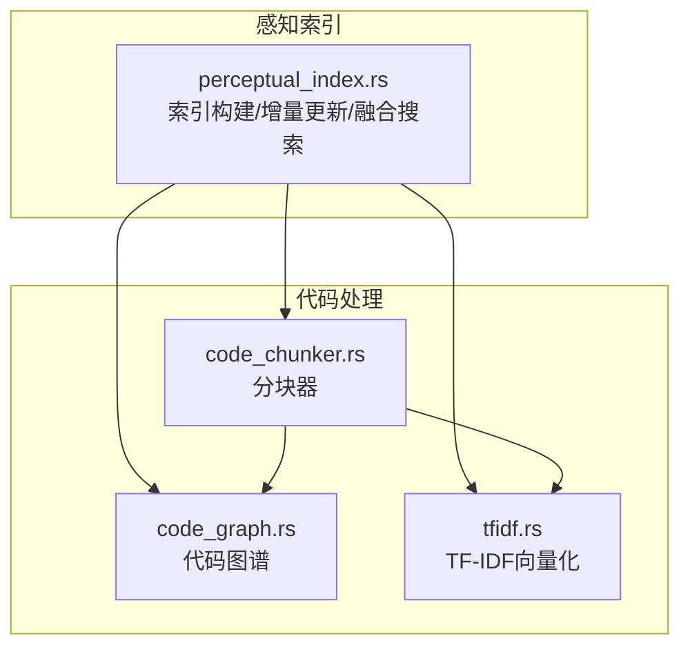
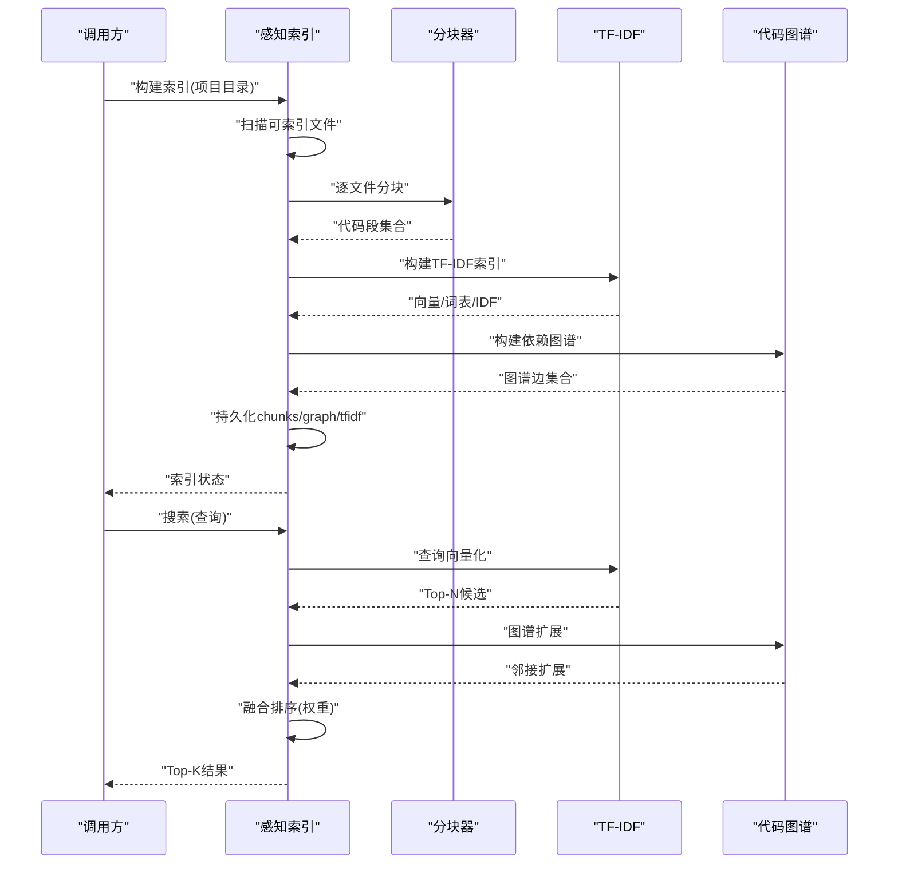
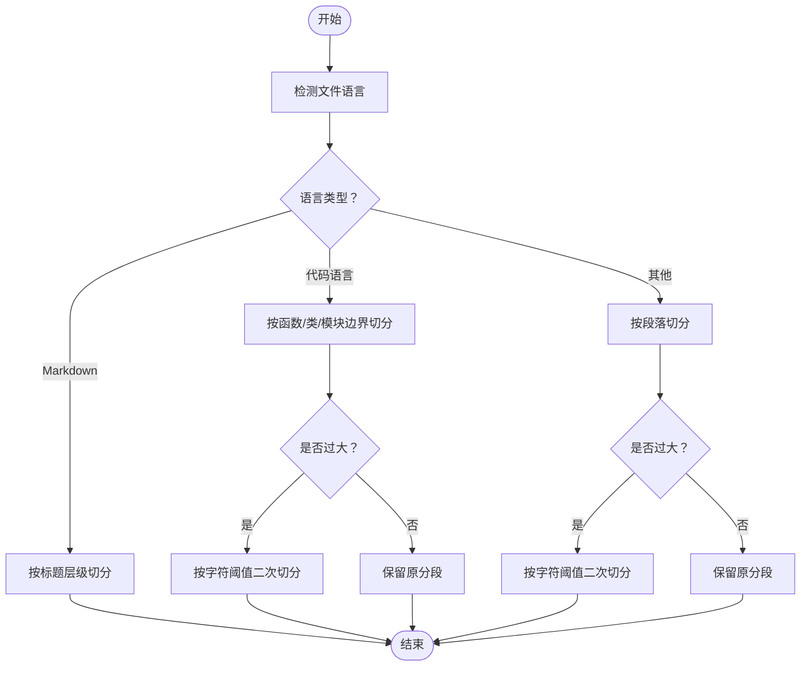
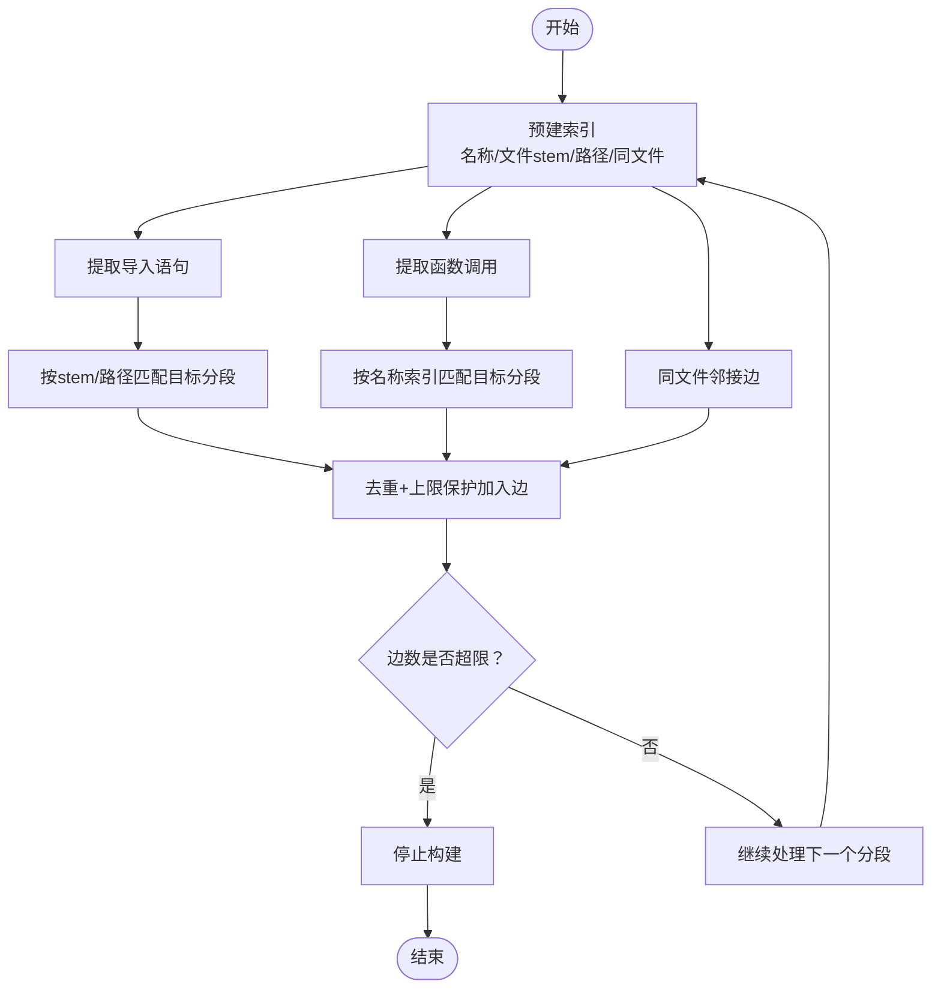
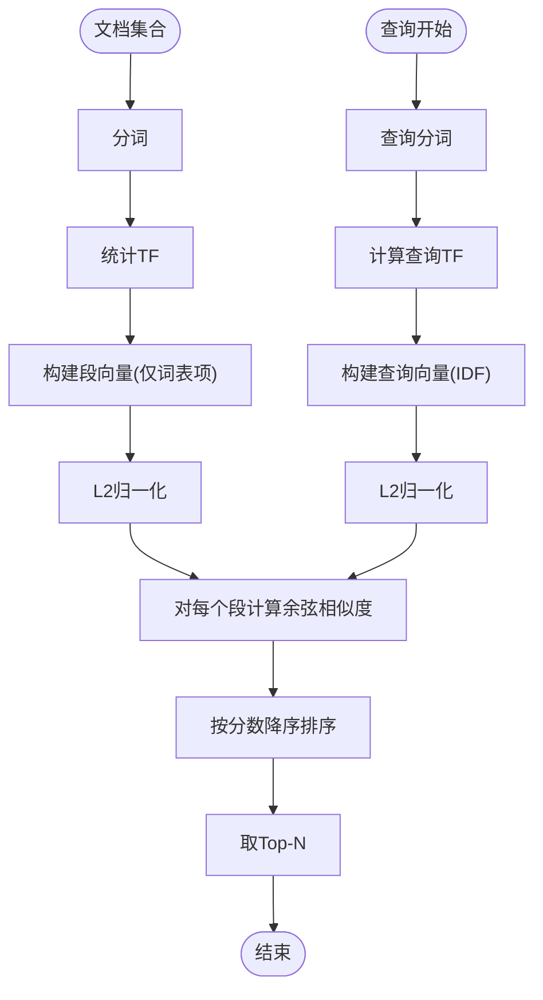
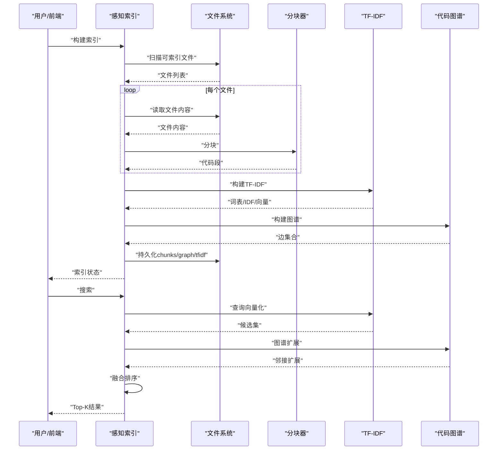
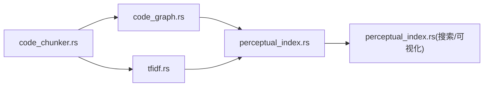

# 代码处理模块

<cite>
**本文档引用的文件**
- [code_chunker.rs](file://src-tauri/src/code_chunker.rs)
- [code_graph.rs](file://src-tauri/src/code_graph.rs)
- [tfidf.rs](file://src-tauri/src/tfidf.rs)
- [perceptual_index.rs](file://src-tauri/src/perceptual_index.rs)
- [lib.rs](file://src-tauri/src/lib.rs)
- [main.rs](file://src-tauri/src/main.rs)
</cite>

## 目录
1. [简介](#简介)
2. [项目结构](#项目结构)
3. [核心组件](#核心组件)
4. [架构总览](#架构总览)
5. [详细组件分析](#详细组件分析)
6. [依赖关系分析](#依赖关系分析)
7. [性能考虑](#性能考虑)
8. [故障排查指南](#故障排查指南)
9. [结论](#结论)
10. [附录](#附录)

## 简介
本文件面向“代码处理模块”，系统性阐述以下能力与实现细节：
- 代码分块器：语言感知的智能切分策略，涵盖语法边界识别、语义边界提取与大段落二次切分。
- 代码图构建：基于抽象语法与导入/调用关系的依赖图谱，含索引优化与边数上限控制。
- TF-IDF 向量化与相似度匹配：分词、词频统计、逆文档频率计算与余弦相似度排序。
- 感知索引：全量与增量构建、持久化、融合搜索与可视化输出。
- 性能优化：并行处理思路、增量更新、内存与IO优化策略。
- 应用示例与集成：在AI专家系统中如何高效利用上述能力。

## 项目结构
代码处理模块位于 Rust 后端（Tauri）工程中，核心文件如下：
- 代码分块器：负责将源码按语义/语法边界切分为可检索的“代码段”
- 代码图谱：从代码段提取导入/调用/引用关系，构建依赖图
- TF-IDF：对代码段进行向量化与相似度匹配
- 感知索引：统一编排分块、建图、向量化与持久化，并提供融合搜索与可视化

**图表来源**
- [perceptual_index.rs:143-275](file://src-tauri/src/perceptual_index.rs#L143-L275)
- [code_chunker.rs:5-14](file://src-tauri/src/code_chunker.rs#L5-L14)
- [code_graph.rs:8-176](file://src-tauri/src/code_graph.rs#L8-L176)
- [tfidf.rs:18-63](file://src-tauri/src/tfidf.rs#L18-L63)

**章节来源**
- [perceptual_index.rs:143-275](file://src-tauri/src/perceptual_index.rs#L143-L275)

## 核心组件
- 代码分块器（code_chunker.rs）
  - 语言检测与多语言规则适配
  - Markdown 按标题层级切分
  - 代码文件按函数/类/结构体等边界切分
  - 通用文本按段落切分与大段落二次切分
- 代码图谱（code_graph.rs）
  - 定义名提取、导入/调用/引用关系抽取
  - 多级索引（名称、文件stem、路径、同文件邻接）加速匹配
  - 边数上限保护与去重
- TF-IDF（tfidf.rs）
  - 分词器：支持中英混合、保留代码常见符号
  - 词表构建、IDF计算、向量归一化
  - 查询向量化与余弦相似度排序
- 感知索引（perceptual_index.rs）
  - 全量构建：扫描文件→分块→TF-IDF→建图→持久化
  - 增量更新：仅重建受影响的代码段
  - 融合搜索：TF-IDF + 图谱扩展 + 权重融合
  - 可视化：项目/文件级逻辑画布

**章节来源**
- [code_chunker.rs:5-334](file://src-tauri/src/code_chunker.rs#L5-L334)
- [code_graph.rs:8-451](file://src-tauri/src/code_graph.rs#L8-L451)
- [tfidf.rs:18-281](file://src-tauri/src/tfidf.rs#L18-L281)
- [perceptual_index.rs:143-417](file://src-tauri/src/perceptual_index.rs#L143-L417)

## 架构总览
感知索引模块串联“扫描→分块→向量化→建图→持久化→搜索”的完整流水线，既保证召回质量，又通过索引与上限策略控制规模。

**图表来源**
- [perceptual_index.rs:143-275](file://src-tauri/src/perceptual_index.rs#L143-L275)
- [perceptual_index.rs:334-417](file://src-tauri/src/perceptual_index.rs#L334-L417)
- [code_chunker.rs:5-14](file://src-tauri/src/code_chunker.rs#L5-L14)
- [code_graph.rs:8-176](file://src-tauri/src/code_graph.rs#L8-L176)
- [tfidf.rs:65-122](file://src-tauri/src/tfidf.rs#L65-L122)

## 详细组件分析

### 代码分块器（语法解析与语义分析）
- 语言检测：根据扩展名判定语言，支持 markdown、rust、ts/js、python、go、java/kotlin、swift、c/cpp 等
- Markdown：按标题层级切分，确保每段至少有最小长度阈值
- 代码文件：基于语言特定的“块起始”关键字（如函数、类、结构体、模块等）与缩进判断，仅在顶层或近顶层处切分
- 通用文本：按空行分段，过滤过短段；若单段过大，按字符长度阈值进一步切分
- 输出：统一的代码段结构，包含唯一ID、文件路径、行列范围、内容与语言

**图表来源**
- [code_chunker.rs:5-334](file://src-tauri/src/code_chunker.rs#L5-L334)

**章节来源**
- [code_chunker.rs:5-334](file://src-tauri/src/code_chunker.rs#L5-L334)

### 代码图构建（依赖关系识别与图结构优化）
- 名称索引：提取各代码段中定义的标识符（函数、类、模块等），过滤关键字与短名，建立“名称→分段ID列表”
- 导入匹配：构建“文件stem→分段ID列表”和“路径→分段ID列表”，按精确匹配与后缀匹配策略查找目标分段
- 调用关系：扫描调用模式，结合名称索引建立“调用→被调用”边
- 同文件邻接：对同一文件内的分段建立“相邻引用”边，限制每段最多三条
- 边去重与上限：使用对称键去重并设置最大边数，防止图爆炸
- 输出：边集合，包含关系类型（imports/calls/references）

**图表来源**
- [code_graph.rs:8-176](file://src-tauri/src/code_graph.rs#L8-L176)
- [code_graph.rs:291-451](file://src-tauri/src/code_graph.rs#L291-L451)

**章节来源**
- [code_graph.rs:8-176](file://src-tauri/src/code_graph.rs#L8-L176)
- [code_graph.rs:178-451](file://src-tauri/src/code_graph.rs#L178-L451)

### TF-IDF 计算（词频统计、逆文档频率与相似度）
- 分词：支持中英混合，保留代码常见符号；过滤纯数字与过短词条；大小写规范化
- 词表：统计词的文档频率，取前若干高频词作为词表
- TF：统计词频并采用对数缩放
- IDF：基于文档频率计算，使用对数公式
- 向量：对每个代码段构建稀疏向量，仅保留词表中的项
- 归一化：L2归一化，使向量单位化
- 查询：对查询同样分词、TF-IDF化并归一化
- 相似度：计算查询向量与各段向量的余弦相似度，按分数排序，返回Top-N

**图表来源**
- [tfidf.rs:18-122](file://src-tauri/src/tfidf.rs#L18-L122)
- [tfidf.rs:125-190](file://src-tauri/src/tfidf.rs#L125-L190)
- [tfidf.rs:194-281](file://src-tauri/src/tfidf.rs#L194-L281)

**章节来源**
- [tfidf.rs:18-281](file://src-tauri/src/tfidf.rs#L18-L281)

### 感知索引（构建机制、特征向量化、距离度量与查询优化）
- 全量构建：扫描项目→分块→TF-IDF→建图→持久化（chunks.json、tfidf.json、graph.json）
- 增量更新：仅对变更文件重新分块，替换旧分段，重建TF-IDF与图谱并持久化
- 融合搜索：TF-IDF得分权重更高，图谱扩展提供跨文件关联，最终按融合分数排序
- 可视化：项目级与文件级逻辑画布，聚合文件出入度、关系权重，限制节点/边数量
- Fuzzy文件搜索：基于子序列匹配与连续匹配加权，支持文件名模糊检索

**图表来源**
- [perceptual_index.rs:143-275](file://src-tauri/src/perceptual_index.rs#L143-L275)
- [perceptual_index.rs:334-417](file://src-tauri/src/perceptual_index.rs#L334-L417)
- [perceptual_index.rs:1291-1368](file://src-tauri/src/perceptual_index.rs#L1291-L1368)
- [perceptual_index.rs:1370-1441](file://src-tauri/src/perceptual_index.rs#L1370-L1441)

**章节来源**
- [perceptual_index.rs:143-417](file://src-tauri/src/perceptual_index.rs#L143-L417)
- [perceptual_index.rs:1291-1441](file://src-tauri/src/perceptual_index.rs#L1291-L1441)

## 依赖关系分析
- 模块耦合
  - perceptual_index.rs 依赖 code_chunker.rs、code_graph.rs、tfidf.rs
  - code_graph.rs 依赖 perceptual_index.rs 的 CodeChunk、GraphEdge 类型
  - tfidf.rs 依赖 perceptual_index.rs 的 CodeChunk、SearchResult 类型
- 数据结构
  - CodeChunk：分段元信息与内容
  - GraphEdge：依赖关系边
  - SearchResult：搜索结果（TF-IDF/图谱来源）
- 关键依赖链
  - 分块器 → TF-IDF：分块结果作为TF-IDF训练与检索对象
  - 分块器 → 代码图谱：分块结果作为图谱节点
  - 代码图谱 → 融合搜索：图谱扩展提供跨文件关联

**图表来源**
- [perceptual_index.rs:8-11](file://src-tauri/src/perceptual_index.rs#L8-L11)
- [code_chunker.rs](file://src-tauri/src/code_chunker.rs#L2)
- [code_graph.rs](file://src-tauri/src/code_graph.rs#L2)
- [tfidf.rs](file://src-tauri/src/tfidf.rs#L5)

**章节来源**
- [perceptual_index.rs:8-11](file://src-tauri/src/perceptual_index.rs#L8-L11)
- [code_chunker.rs](file://src-tauri/src/code_chunker.rs#L2)
- [code_graph.rs](file://src-tauri/src/code_graph.rs#L2)
- [tfidf.rs](file://src-tauri/src/tfidf.rs#L5)

## 性能考虑
- 时间复杂度
  - 分块：O(N)（逐行扫描，按语言规则匹配）
  - 图谱：预建索引后，导入/调用匹配近似 O(n)；整体受分段数与语言规则影响
  - TF-IDF：词表大小与向量稀疏性决定计算成本；查询时遍历较短向量提升效率
- 内存与IO
  - 分块阶段：逐文件读取并分块，避免一次性加载全部内容
  - TF-IDF：词表大小限制、向量稀疏存储、L2归一化减少存储开销
  - 持久化：紧凑JSON与流式写入，降低峰值内存占用
- 保护与上限
  - 分段总数、单文件分段数、图谱边数上限，防止资源耗尽
  - 文件大小与数量上限，过滤无关文件
- 并行与增量
  - 并行：分块与TF-IDF可并行化（需注意共享状态与锁）
  - 增量：仅对变更文件重建分段与索引，显著缩短更新时间

[本节为通用性能指导，无需具体文件分析]

## 故障排查指南
- 索引未构建
  - 现象：搜索报错“索引未构建，请先构建索引”
  - 排查：确认索引目录存在且包含 chunks.json、graph.json、tfidf.json
- 文件读取失败
  - 现象：构建过程中跳过某些文件
  - 排查：检查文件编码、权限与大小限制
- 搜索结果为空
  - 现象：返回空结果或覆盖率低
  - 排查：扩大查询范围、检查文件是否被过滤（隐藏目录、扩展名、大小）
- 图谱边数过多
  - 现象：构建缓慢或内存压力
  - 排查：检查 MAX_EDGES 是否触发；优化语言规则或过滤条件
- 增量更新异常
  - 现象：更新后搜索不一致
  - 排查：确认变更文件路径标准化、重新构建TF-IDF与图谱

**章节来源**
- [perceptual_index.rs:314-330](file://src-tauri/src/perceptual_index.rs#L314-L330)
- [perceptual_index.rs:1291-1368](file://src-tauri/src/perceptual_index.rs#L1291-L1368)

## 结论
代码处理模块通过“分块→向量化→建图→融合搜索”的流水线，实现了对大型项目的高召回与高效率检索。其关键优势在于：
- 多语言规则与语义边界切分，提升分段质量
- 多级索引与边数上限，保障图谱规模可控
- TF-IDF与图谱扩展融合，兼顾语义与结构信息
- 全量与增量构建、可视化输出，便于工程落地与运维

[本节为总结性内容，无需具体文件分析]

## 附录

### 实际应用示例与集成指南
- 在AI专家系统中集成步骤
  - 构建索引：在项目根目录触发全量构建，生成 .xt/perceptual_index 下的三类文件
  - 搜索接口：传入查询文本，返回Top-K代码段及融合评分
  - 可视化：生成项目/文件级逻辑画布，辅助定位上下游文件
  - 增量更新：监听文件变更，仅重建受影响分段并刷新TF-IDF与图谱
- 关键API路径
  - 全量构建：[perceptual_index.rs:143-275](file://src-tauri/src/perceptual_index.rs#L143-L275)
  - 搜索：[perceptual_index.rs:334-417](file://src-tauri/src/perceptual_index.rs#L334-L417)
  - 增量更新：[perceptual_index.rs:1291-1368](file://src-tauri/src/perceptual_index.rs#L1291-L1368)
  - 分块器：[code_chunker.rs:5-14](file://src-tauri/src/code_chunker.rs#L5-L14)
  - 代码图谱：[code_graph.rs:8-176](file://src-tauri/src/code_graph.rs#L8-L176)
  - TF-IDF：[tfidf.rs:18-122](file://src-tauri/src/tfidf.rs#L18-L122)

**章节来源**
- [perceptual_index.rs:143-417](file://src-tauri/src/perceptual_index.rs#L143-L417)
- [code_chunker.rs:5-14](file://src-tauri/src/code_chunker.rs#L5-L14)
- [code_graph.rs:8-176](file://src-tauri/src/code_graph.rs#L8-L176)
- [tfidf.rs:18-122](file://src-tauri/src/tfidf.rs#L18-L122)