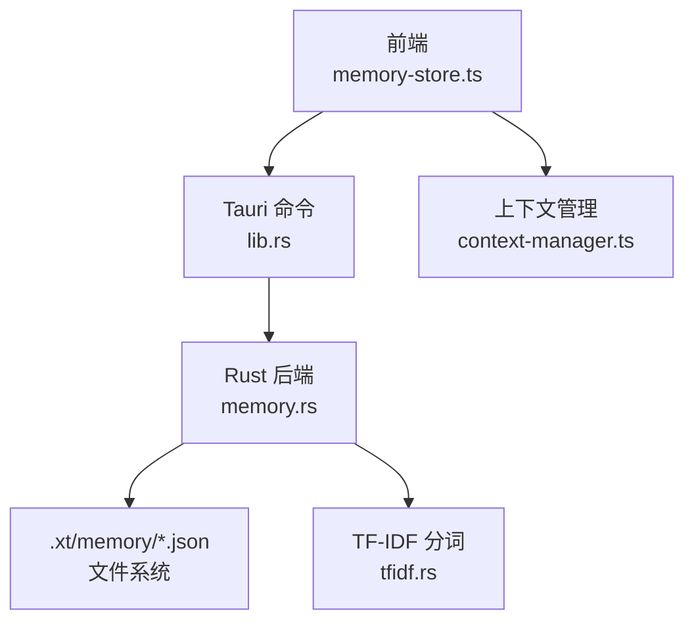
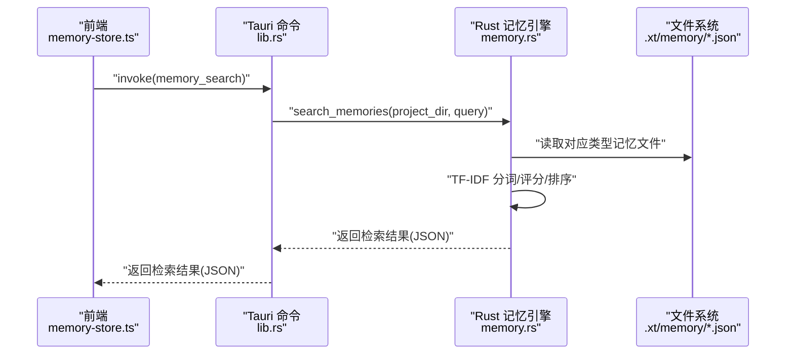

# 内存存储系统

<cite>
**本文引用的文件**
- [memory-store.ts](file://src/memory-store.ts)
- [memory.rs](file://src-tauri/src/memory.rs)
- [lib.rs](file://src-tauri/src/lib.rs)
- [context-manager.ts](file://src/context-manager.ts)
- [tfidf.rs](file://src-tauri/src/tfidf.rs)
- [Cargo.lock](file://src-tauri/Cargo.lock)
- [token_runtime_engine.rs](file://src-tauri/src/token_runtime_engine.rs)
- [config.rs](file://src-tauri/src/config.rs)
- [config-cascade.ts](file://src/config-cascade.ts)
</cite>

## 目录
1. [简介](#简介)
2. [项目结构](#项目结构)
3. [核心组件](#核心组件)
4. [架构总览](#架构总览)
5. [详细组件分析](#详细组件分析)
6. [依赖分析](#依赖分析)
7. [性能考量](#性能考量)
8. [故障排查指南](#故障排查指南)
9. [结论](#结论)
10. [附录](#附录)

## 简介
本文件面向“内存存储系统”的技术文档，聚焦于前端与后端协同实现的记忆（Memory）子系统。系统采用“前端调用 + Rust 后端持久化”的架构，通过 Tauri 命令桥接，实现基于 JSON 文件的本地持久化、关键词检索与生命周期管理。文档涵盖数据结构、缓存策略、失效机制、并发控制、内存管理、配置与调优、使用示例与最佳实践。

## 项目结构
- 前端接口层：提供记忆的保存、检索、删除、清空、生命周期运行与统计查询等 API，并内置关键词提取与 Token 预算感知检索增强。
- 后端持久化层：基于项目目录下的专用子目录，将不同类型的记忆分别序列化为 JSON 文件，支持 CRUD、检索与生命周期管理。
- 检索与评分：采用 TF-IDF 分词与关键词重叠度、内容词频、时间衰减、访问频率与记忆类型权重综合评分。
- 上下文管理：前端提供 Token 预算与自动压缩机制，确保对话上下文在 Token 限额内高效利用。

图表来源
- [memory-store.ts:1-337](file://src/memory-store.ts#L1-L337)
- [lib.rs:5529-5570](file://src-tauri/src/lib.rs#L5529-L5570)
- [memory.rs:1-843](file://src-tauri/src/memory.rs#L1-L843)
- [tfidf.rs:1-281](file://src-tauri/src/tfidf.rs#L1-L281)
- [context-manager.ts:1-276](file://src/context-manager.ts#L1-L276)

章节来源
- [memory-store.ts:1-337](file://src/memory-store.ts#L1-L337)
- [lib.rs:5529-5570](file://src-tauri/src/lib.rs#L5529-L5570)
- [memory.rs:1-843](file://src-tauri/src/memory.rs#L1-L843)
- [context-manager.ts:1-276](file://src/context-manager.ts#L1-L276)
- [tfidf.rs:1-281](file://src-tauri/src/tfidf.rs#L1-L281)

## 核心组件
- 前端记忆 API：提供保存、检索、删除、清空、生命周期运行、统计查询与便捷函数（如保存专家输出、用户意图、组装上下文文本等）。
- Rust 记忆引擎：负责 CRUD、检索、生命周期管理（Ephemeral→Working→LongTerm）、访问统计更新与文件持久化。
- TF-IDF 分词与检索：提供分词、IDF 计算、向量归一化与相似度计算，支撑关键词匹配与语义近似检索。
- 上下文管理：估算 Token 数、预算检查、自动压缩与片段管理，保障对话上下文在 Token 限额内高效组织。

章节来源
- [memory-store.ts:40-100](file://src/memory-store.ts#L40-L100)
- [memory.rs:87-130](file://src-tauri/src/memory.rs#L87-L130)
- [memory.rs:168-305](file://src-tauri/src/memory.rs#L168-L305)
- [memory.rs:307-392](file://src-tauri/src/memory.rs#L307-L392)
- [tfidf.rs:18-122](file://src-tauri/src/tfidf.rs#L18-L122)
- [context-manager.ts:29-49](file://src/context-manager.ts#L29-L49)

## 架构总览
系统通过 Tauri 命令桥接前后端：
- 前端调用 invoke 发起命令，传递项目名与请求参数。
- 后端解析项目路径，执行相应业务逻辑（加载/保存/检索/生命周期）。
- 检索阶段结合 TF-IDF 与关键词匹配，计算综合得分并返回 Top-N 结果。
- 生命周期阶段自动提升与凝练，维持记忆的时效性与价值密度。

图表来源
- [memory-store.ts:50-68](file://src/memory-store.ts#L50-L68)
- [lib.rs:5535-5540](file://src-tauri/src/lib.rs#L5535-L5540)
- [memory.rs:168-305](file://src-tauri/src/memory.rs#L168-L305)

章节来源
- [memory-store.ts:50-68](file://src/memory-store.ts#L50-L68)
- [lib.rs:5535-5540](file://src-tauri/src/lib.rs#L5535-L5540)
- [memory.rs:168-305](file://src-tauri/src/memory.rs#L168-L305)

## 详细组件分析

### 数据结构与序列化
- 记忆条目（MemoryEntry）包含：标识、项目 ID、专家 ID、类型（短期/工作/长期）、内容、关键词、上下文摘要、创建时间、访问次数、最后访问时间。
- 检索请求（MemoryQuery）包含：项目 ID、专家 ID、查询文本、类型过滤、限制条数。
- 检索结果（MemorySearchResult）包含：条目与得分。
- 统计（MemoryStats）包含：各类别计数与总数。

持久化策略：
- 每个记忆类型独立一个 JSON 文件，文件位于项目目录下的 .xt/memory/{type}.json。
- 写入采用 serde_json 的美化序列化，便于人工查看与调试。
- 读取失败或解析失败均返回错误信息，确保前端可感知异常。

章节来源
- [memory-store.ts:5-36](file://src/memory-store.ts#L5-L36)
- [memory.rs:11-41](file://src-tauri/src/memory.rs#L11-L41)
- [memory.rs:45-73](file://src-tauri/src/memory.rs#L45-L73)

### 缓存策略与失效机制
- 缓存策略：以文件为缓存单位，按类型分片存储，避免跨类型竞争与锁争用。
- 失效机制：
  - Ephemeral→Working：访问次数≥2 或内容长度≥200。
  - Working→LongTerm：访问次数≥5 且创建时间早于14天。
  - 定期清理：Ephemeral 保留最近7天，Working 保留最近30天。
- 访问统计：每次命中检索会更新访问次数与最后访问时间，用于评分与清理。

章节来源
- [memory.rs:309-343](file://src-tauri/src/memory.rs#L309-L343)
- [memory.rs:345-382](file://src-tauri/src/memory.rs#L345-L382)
- [memory.rs:75-83](file://src-tauri/src/memory.rs#L75-L83)

### 检索与评分算法
- 关键词重叠度：查询词集合与记忆关键词集合的交集占比。
- 内容匹配度：查询词集合与记忆内容词集合的交集占比。
- 时间衰减：基于创建时间的指数衰减，半衰期30天。
- 访问频率加成：访问次数带来的权重提升，上限0.5。
- 类型权重：长期>工作>短期。
- 综合得分：加权乘积后阈值过滤，Top-N 返回。

增强检索：
- 共现词加权：查询中多个词在同一记忆出现时额外加分。
- 专家维度过滤：若指定专家 ID，则对该记忆额外加分。
- Token 预算截断：按估算 Token 数累加，超过预算即停止。

章节来源
- [memory.rs:240-285](file://src-tauri/src/memory.rs#L240-L285)
- [memory.rs:621-681](file://src-tauri/src/memory.rs#L621-L681)
- [memory-store.ts:310-335](file://src/memory-store.ts#L310-L335)

### 并发访问控制与一致性
- 并发模型：Rust 后端以单文件为粒度进行读写，未引入跨进程锁；前端通过 Tauri 命令串行调用，避免竞态。
- 一致性保障：
  - 读取/写入均在单次命令中完成，减少中间态。
  - 检索命中后立即更新访问统计，确保统计一致性。
  - 生命周期阶段按规则批量处理并原子性写回。

章节来源
- [memory.rs:115-130](file://src-tauri/src/memory.rs#L115-L130)
- [memory.rs:75-83](file://src-tauri/src/memory.rs#L75-L83)
- [memory.rs:384-392](file://src-tauri/src/memory.rs#L384-L392)

### 内存管理策略
- 前端内存管理：上下文管理器负责 Token 估算与自动压缩，避免前端侧内存膨胀。
- 后端内存管理：以 JSON 文件为载体，按类型分片，定期清理过期与低价值记忆，控制文件大小与数量。
- 垃圾回收与泄漏检测：系统未实现专门的 GC；通过生命周期规则与上限保护（每类最多500条）降低泄漏风险。
- 性能监控：未提供专门的内存指标采集；可通过统计 API 与日志观察使用情况。

章节来源
- [context-manager.ts:55-68](file://src/context-manager.ts#L55-L68)
- [context-manager.ts:115-156](file://src/context-manager.ts#L115-L156)
- [memory.rs:102-113](file://src-tauri/src/memory.rs#L102-L113)

### 配置选项与调优参数
- 前端配置（上下文管理）：
  - 总 Token 预算、压缩阈值、预留比例、保留最近轮数、单片段最大 Token。
- 后端配置（检索与生命周期）：
  - 每类记忆上限（默认500条）。
  - 生命周期规则（访问次数、内容长度、时间窗口）。
  - 检索限制（默认limit 3~1000）。
- 全局配置（层叠合并）：
  - LLM、Shell、审批、Agent、Pipeline、UI 等配置项，支持用户全局、项目级与运行时覆盖。

章节来源
- [context-manager.ts:29-49](file://src/context-manager.ts#L29-L49)
- [memory.rs:102-108](file://src-tauri/src/memory.rs#L102-L108)
- [config.rs:48-198](file://src-tauri/src/config.rs#L48-L198)
- [config-cascade.ts:64-103](file://src/config-cascade.ts#L64-L103)

### 使用示例与最佳实践
- 保存专家输出为 Working 记忆：提取关键内容与关键词，设置类型为 working，自动记录时间戳与访问统计。
- 保存用户意图到 Ephemeral 记忆：用于短期意图捕捉，便于后续检索与上下文组装。
- 组装上下文文本：按任务描述检索 Top-N 历史记忆，拼接为上下文字符串，供专家提示使用。
- Token 预算感知检索：在增强检索中传入专家 ID 与最大 Token 数，系统自动截断结果，避免超出预算。
- 最佳实践：
  - 合理设置检索 limit 与 Token 预算，避免一次性返回过多内容。
  - 利用生命周期规则，将有价值的记忆从 Ephemeral 提升到 Working，再从 Working 凝练到 LongTerm。
  - 定期运行生命周期管理，清理过期与低价值记忆，保持存储整洁。

章节来源
- [memory-store.ts:104-157](file://src/memory-store.ts#L104-L157)
- [memory-store.ts:159-213](file://src/memory-store.ts#L159-L213)
- [memory-store.ts:310-335](file://src/memory-store.ts#L310-L335)

## 依赖分析
- Rust 依赖：serde、serde_json、fs、path、collections、time、regex 等，用于序列化、文件系统操作与时间戳生成。
- 前端依赖：@tauri-apps/api/core 用于命令调用，上下文管理器提供 Token 估算与压缩。

章节来源
- [Cargo.lock:294-2706](file://src-tauri/Cargo.lock#L294-L2706)
- [context-manager.ts:1-276](file://src/context-manager.ts#L1-L276)

## 性能考量
- 检索复杂度：对候选集遍历计算得分，时间复杂度 O(N)，N 为候选记忆条目数；通过 limit 与阈值过滤控制规模。
- 序列化开销：JSON 美化写入，适合小规模数据；大规模数据建议评估压缩或分片策略。
- Token 估算：前端提供估算函数，建议在对话构建阶段提前评估，避免超限。
- 生命周期成本：定期运行生命周期管理，批量处理与写回，建议在空闲时段执行。

## 故障排查指南
- 检索为空：
  - 检查查询文本是否为空，空查询会按访问时间与创建时间排序返回。
  - 确认项目 ID、专家 ID 与类型过滤是否正确。
- 文件读写失败：
  - 检查项目目录权限与磁盘空间。
  - 查看错误信息中的具体失败原因（创建目录、读取文件、解析 JSON、写入文件）。
- 生命周期未生效：
  - 确认访问次数、内容长度与时间窗口是否满足提升/凝练规则。
  - 检查是否定期运行生命周期管理命令。

章节来源
- [memory.rs:178-229](file://src-tauri/src/memory.rs#L178-L229)
- [memory.rs:53-73](file://src-tauri/src/memory.rs#L53-L73)
- [memory.rs:309-343](file://src-tauri/src/memory.rs#L309-L343)

## 结论
该内存存储系统通过前后端协作，实现了轻量、可读、可维护的记忆持久化与检索。Rust 后端以 JSON 文件为存储介质，结合 TF-IDF 与综合评分策略，提供灵活的检索能力；前端通过上下文管理器与 Token 预算感知检索，确保在有限资源下高效利用记忆。生命周期管理与上限保护机制有效控制存储规模与价值密度，适合中小规模项目的记忆管理需求。

## 附录
- 前端 API 一览
  - 保存记忆：saveMemory(projectName, entry)
  - 检索记忆：searchMemory(projectName, query)
  - 删除记忆：deleteMemory(projectName, memoryType, id)
  - 清空类型：clearMemoryType(projectName, memoryType)
  - 生命周期：runMemoryLifecycle(projectName)
  - 统计：getMemoryStats(projectName)
  - 便捷函数：saveExpertMemory、saveUserIntentMemory、buildMemoryContext、buildGeneralMemoryContext、searchMemoryWithBudget
- 后端命令映射
  - memory_search、memory_delete、memory_clear_type、memory_run_lifecycle、memory_get_stats

章节来源
- [memory-store.ts:40-100](file://src/memory-store.ts#L40-L100)
- [lib.rs:5535-5570](file://src-tauri/src/lib.rs#L5535-L5570)