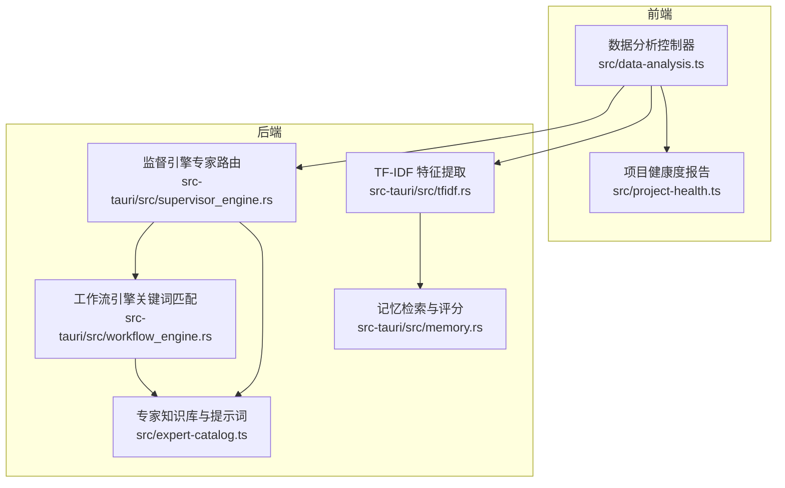
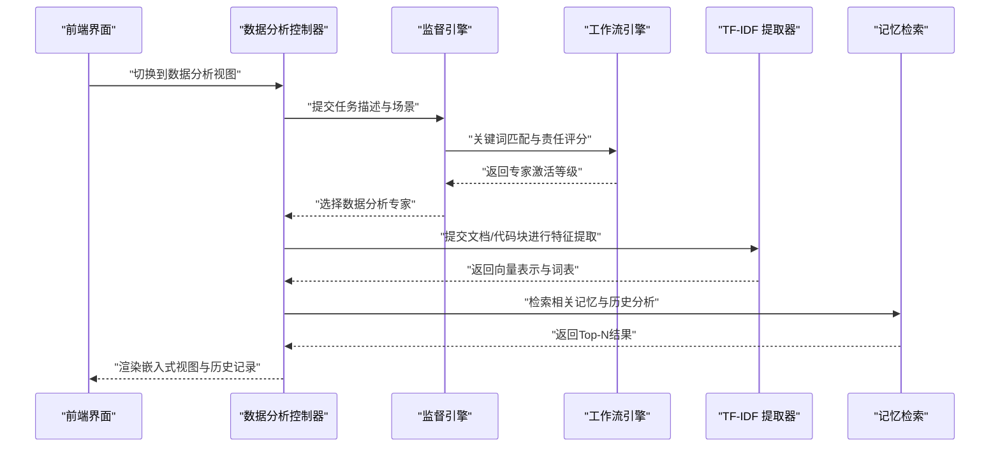
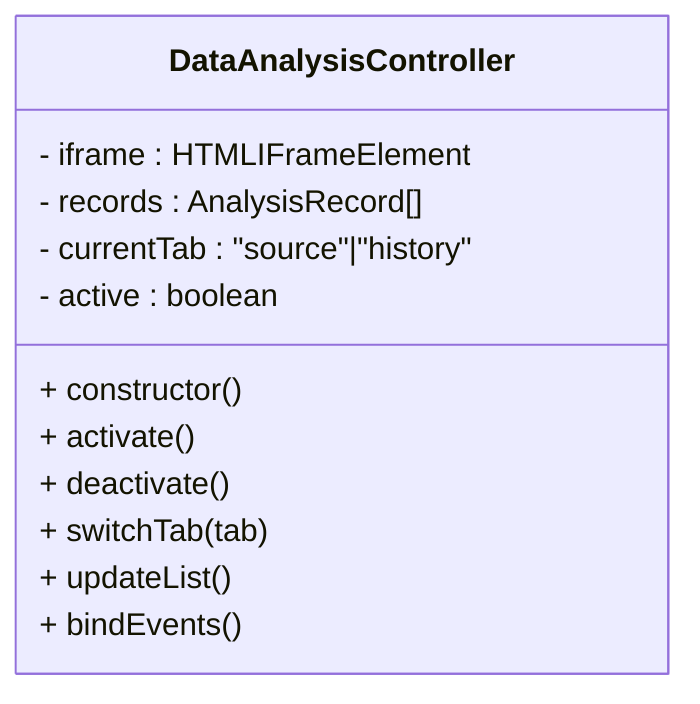
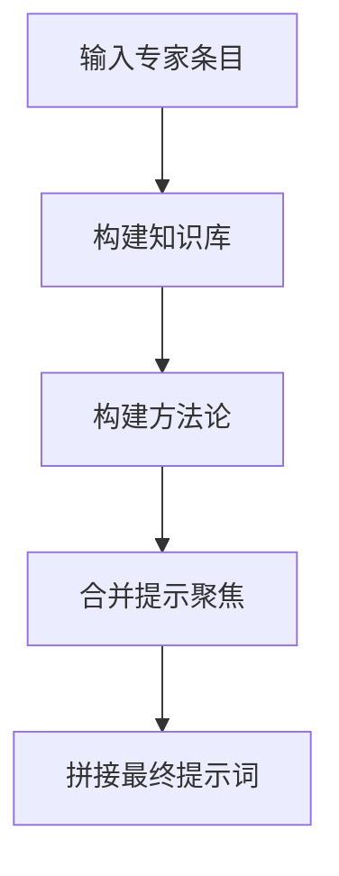
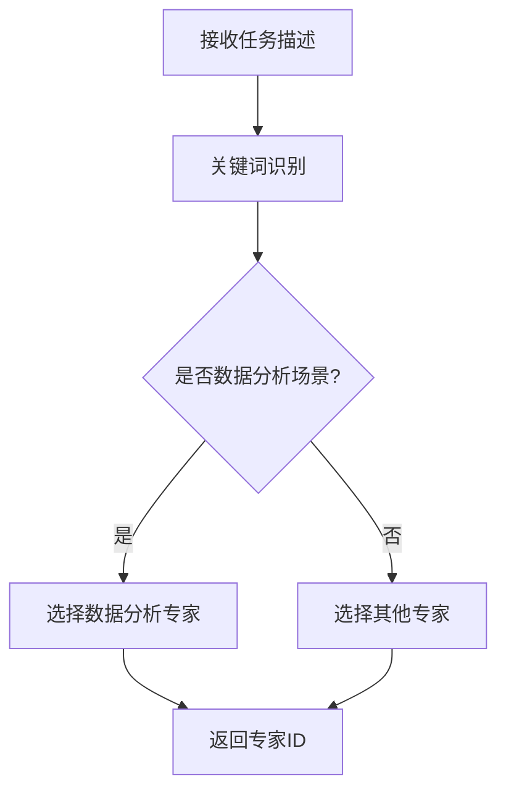
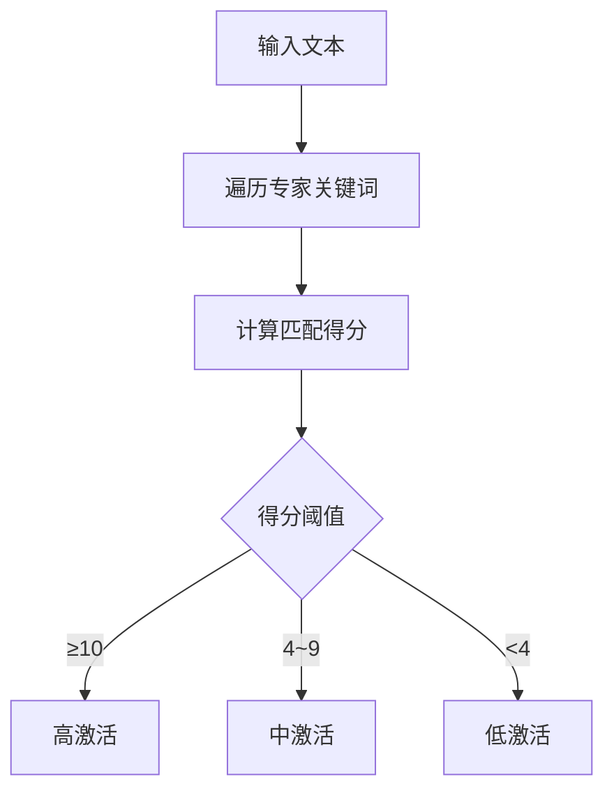
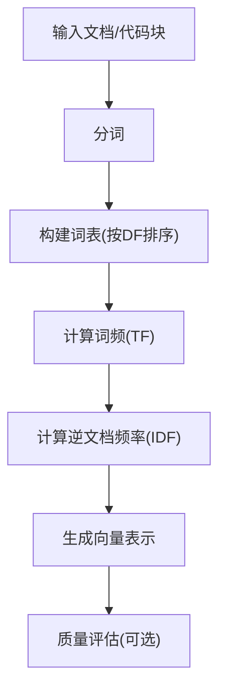
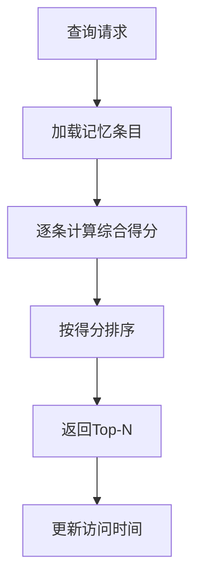
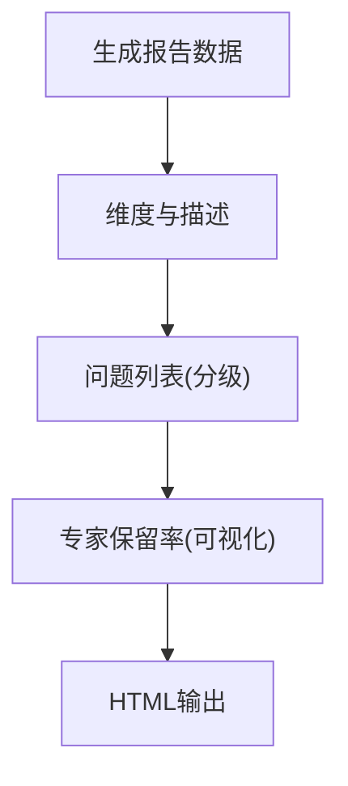
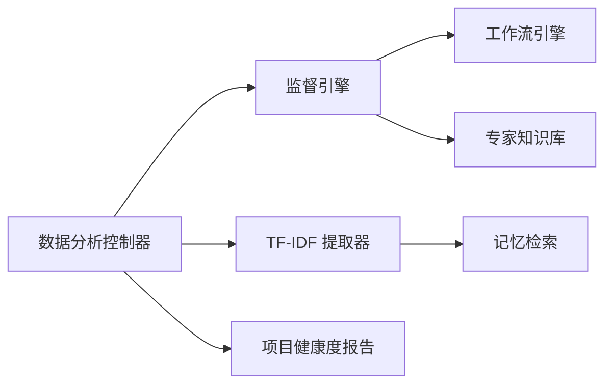

# 数据分析引擎

<cite>
**本文引用的文件**
- [src/data-analysis.ts](file://src/data-analysis.ts)
- [src/expert-catalog.ts](file://src/expert-catalog.ts)
- [src-tauri/src/supervisor_engine.rs](file://src-tauri/src/supervisor_engine.rs)
- [src-tauri/src/workflow_engine.rs](file://src-tauri/src/workflow_engine.rs)
- [src-tauri/src/tfidf.rs](file://src-tauri/src/tfidf.rs)
- [src-tauri/src/memory.rs](file://src-tauri/src/memory.rs)
- [src/project-health.ts](file://src/project-health.ts)
</cite>

## 目录
1. [引言](#引言)
2. [项目结构](#项目结构)
3. [核心组件](#核心组件)
4. [架构总览](#架构总览)
5. [详细组件分析](#详细组件分析)
6. [依赖分析](#依赖分析)
7. [性能考虑](#性能考虑)
8. [故障排查指南](#故障排查指南)
9. [结论](#结论)
10. [附录](#附录)

## 引言
本技术文档围绕“数据分析引擎”的实现与使用展开，重点覆盖以下方面：
- 数据预处理流程：清洗、格式转换、质量评估
- 特征提取方法：基于关键词与语义的特征映射
- 统计分析模型：TF-IDF 文档表示与相似度计算
- 可视化支持与图表生成机制：嵌入式视图与历史记录
- 性能优化策略：批处理、并行计算、内存管理
- 实际使用场景与扩展建议：如何集成与扩展分析功能

## 项目结构
该仓库采用前端与后端混合架构，数据分析引擎主要由前端嵌入式视图与后端专家路由、工作流与记忆系统协同完成。核心文件分布如下：
- 前端嵌入式视图与历史记录：src/data-analysis.ts
- 专家知识库与提示词构建：src/expert-catalog.ts
- 专家路由与任务分配：src-tauri/src/supervisor_engine.rs
- 关键词匹配与责任激活：src-tauri/src/workflow_engine.rs
- 文本特征提取（TF-IDF）：src-tauri/src/tfidf.rs
- 记忆检索与评分：src-tauri/src/memory.rs
- 项目健康度报告（可视化展示）：src/project-health.ts

**图表来源**
- [src/data-analysis.ts:1-53](file://src/data-analysis.ts#L1-L53)
- [src-tauri/src/supervisor_engine.rs:712-739](file://src-tauri/src/supervisor_engine.rs#L712-L739)
- [src-tauri/src/workflow_engine.rs:216-258](file://src-tauri/src/workflow_engine.rs#L216-L258)
- [src-tauri/src/tfidf.rs:185-232](file://src-tauri/src/tfidf.rs#L185-L232)
- [src-tauri/src/memory.rs:278-313](file://src-tauri/src/memory.rs#L278-L313)
- [src/expert-catalog.ts:428-579](file://src/expert-catalog.ts#L428-L579)

**章节来源**
- [src/data-analysis.ts:1-53](file://src/data-analysis.ts#L1-L53)
- [src-tauri/src/supervisor_engine.rs:712-739](file://src-tauri/src/supervisor_engine.rs#L712-L739)
- [src-tauri/src/workflow_engine.rs:216-258](file://src-tauri/src/workflow_engine.rs#L216-L258)
- [src-tauri/src/tfidf.rs:185-232](file://src-tauri/src/tfidf.rs#L185-L232)
- [src-tauri/src/memory.rs:278-313](file://src-tauri/src/memory.rs#L278-L313)
- [src/expert-catalog.ts:428-579](file://src/expert-catalog.ts#L428-L579)

## 核心组件
- 数据分析控制器：负责嵌入式视图的激活、切换标签页、加载历史记录与内容渲染。
- 专家知识库与提示词：定义不同学科的知识基、方法论与关注焦点，用于指导分析任务。
- 监督引擎：根据任务描述与场景关键字，选择合适专家（含数据分析专家）。
- 工作流引擎：通过关键词匹配计算责任激活等级，辅助专家路由决策。
- TF-IDF 特征提取：对代码块/文档进行分词、构建词表、计算词频与逆文档频率。
- 记忆检索与评分：对记忆条目进行综合评分与排序，支持 Top-N 返回与生命周期管理。
- 项目健康度报告：以可视化方式呈现项目问题与指标，便于快速评估。

**章节来源**
- [src/data-analysis.ts:12-53](file://src/data-analysis.ts#L12-L53)
- [src/expert-catalog.ts:428-579](file://src/expert-catalog.ts#L428-L579)
- [src-tauri/src/supervisor_engine.rs:712-739](file://src-tauri/src/supervisor_engine.rs#L712-L739)
- [src-tauri/src/workflow_engine.rs:216-258](file://src-tauri/src/workflow_engine.rs#L216-L258)
- [src-tauri/src/tfidf.rs:185-232](file://src-tauri/src/tfidf.rs#L185-L232)
- [src-tauri/src/memory.rs:278-313](file://src-tauri/src/memory.rs#L278-L313)
- [src/project-health.ts:92-219](file://src/project-health.ts#L92-L219)

## 架构总览
数据分析引擎的整体流程如下：
- 前端激活数据分析视图，加载历史记录与嵌入内容。
- 后端监督引擎根据任务关键字与场景，选择数据分析专家。
- 工作流引擎对专家责任进行评分，决定是否触发数据分析。
- TF-IDF 对输入文档/代码块进行特征提取，生成向量表示。
- 记忆系统对过往分析结果与知识进行检索与评分，辅助决策。
- 项目健康度报告以可视化形式呈现分析结果与问题清单。

**图表来源**
- [src/data-analysis.ts:12-53](file://src/data-analysis.ts#L12-L53)
- [src-tauri/src/supervisor_engine.rs:712-739](file://src-tauri/src/supervisor_engine.rs#L712-L739)
- [src-tauri/src/workflow_engine.rs:216-258](file://src-tauri/src/workflow_engine.rs#L216-L258)
- [src-tauri/src/tfidf.rs:185-232](file://src-tauri/src/tfidf.rs#L185-L232)
- [src-tauri/src/memory.rs:278-313](file://src-tauri/src/memory.rs#L278-L313)

## 详细组件分析

### 数据分析控制器（前端）
- 功能职责
  - 管理嵌入式 iframe 的激活与停用。
  - 维护分析记录列表与历史标签页切换。
  - 在视图切换事件中自动更新列表与内容。
- 关键交互
  - 监听视图变更事件，按需激活/停用。
  - 处理右侧面板的“源数据/历史”标签切换。
- 扩展建议
  - 支持多标签页并行分析会话。
  - 集成实时刷新与增量更新机制。

**图表来源**
- [src/data-analysis.ts:12-53](file://src/data-analysis.ts#L12-L53)

**章节来源**
- [src/data-analysis.ts:12-53](file://src/data-analysis.ts#L12-L53)

### 专家知识库与提示词构建
- 知识基与方法论
  - 不同学科（如分析、工程、文档、创意）提供核心对象、关键概念与常用评价指标。
  - 方法论强调证据导向、结构化结论与风险控制。
- 提示词聚焦
  - 高频关注点与工具属性（如工程专家的工程约束、分析专家的分析框架）。
- 应用场景
  - 为数据分析任务提供专业视角与判断口径，避免片面归因。

**图表来源**
- [src/expert-catalog.ts:428-579](file://src/expert-catalog.ts#L428-L579)

**章节来源**
- [src/expert-catalog.ts:428-579](file://src/expert-catalog.ts#L428-L579)

### 监督引擎（专家路由）
- 任务类型识别
  - 依据任务描述中的关键词识别“数据分析”“合规”“信息科学”等场景。
- 专家选择策略
  - 优先选择与任务高度匹配的专家；若未命中，则按顺序选择默认专家。
- 与工作流引擎协作
  - 结合工作流引擎的责任激活等级，提高路由准确性。

**图表来源**
- [src-tauri/src/supervisor_engine.rs:712-739](file://src-tauri/src/supervisor_engine.rs#L712-L739)

**章节来源**
- [src-tauri/src/supervisor_engine.rs:712-739](file://src-tauri/src/supervisor_engine.rs#L712-L739)

### 工作流引擎（关键词匹配与责任激活）
- 匹配规则
  - 针对不同专家 ID 设置关键词集合，计算匹配得分。
- 激活等级
  - 根据得分划分高、中、低三个等级，作为专家路由的参考。
- 与专家知识库联动
  - 专家条目中的方法论与知识基影响最终提示词质量。

**图表来源**
- [src-tauri/src/workflow_engine.rs:216-258](file://src-tauri/src/workflow_engine.rs#L216-L258)

**章节来源**
- [src-tauri/src/workflow_engine.rs:216-258](file://src-tauri/src/workflow_engine.rs#L216-L258)

### TF-IDF 特征提取（文本向量化）
- 分词与词表
  - 对输入文档进行分词，构建词表并按文档频率排序，选取高频词。
- 词频与逆文档频率
  - 计算每个文档的词频（TF），以及全局逆文档频率（IDF）。
- 向量表示
  - 将文档映射为稠密向量，用于相似度计算与聚类分析。
- 质量评估
  - 通过词表大小、稀疏性与代表性词汇评估特征质量。

**图表来源**
- [src-tauri/src/tfidf.rs:185-232](file://src-tauri/src/tfidf.rs#L185-L232)

**章节来源**
- [src-tauri/src/tfidf.rs:185-232](file://src-tauri/src/tfidf.rs#L185-L232)

### 记忆检索与评分（后端）
- 综合评分公式
  - 结合关键词得分、内容得分、时间衰减、访问增强与类型权重，计算综合分数。
- 排序与返回
  - 按分数降序排序，返回 Top-N 结果，并更新访问时间。
- 生命周期管理
  - 将高价值的临时记忆提升至工作记忆，延长可用周期。

**图表来源**
- [src-tauri/src/memory.rs:278-313](file://src-tauri/src/memory.rs#L278-L313)

**章节来源**
- [src-tauri/src/memory.rs:278-313](file://src-tauri/src/memory.rs#L278-L313)

### 项目健康度报告（可视化）
- 报告组成
  - 维度描述、问题列表（严重/警告/建议）、专家保留率等。
- 可视化要点
  - 使用进度条与颜色标识问题严重程度，便于快速定位。
- 集成建议
  - 将分析结果与健康度报告联动，形成闭环反馈。

**图表来源**
- [src/project-health.ts:92-219](file://src/project-health.ts#L92-L219)

**章节来源**
- [src/project-health.ts:92-219](file://src/project-health.ts#L92-L219)

## 依赖分析
- 前端与后端耦合
  - 前端通过 iframe 与后端服务交互；后端通过专家路由与工作流引擎协调。
- 组件内聚与解耦
  - TF-IDF 与记忆系统相对独立，可作为通用能力复用。
- 外部依赖
  - 无特定第三方库依赖，核心逻辑自实现，便于移植与扩展。

**图表来源**
- [src/data-analysis.ts:12-53](file://src/data-analysis.ts#L12-L53)
- [src-tauri/src/supervisor_engine.rs:712-739](file://src-tauri/src/supervisor_engine.rs#L712-L739)
- [src-tauri/src/workflow_engine.rs:216-258](file://src-tauri/src/workflow_engine.rs#L216-L258)
- [src-tauri/src/tfidf.rs:185-232](file://src-tauri/src/tfidf.rs#L185-L232)
- [src-tauri/src/memory.rs:278-313](file://src-tauri/src/memory.rs#L278-L313)
- [src/expert-catalog.ts:428-579](file://src/expert-catalog.ts#L428-L579)
- [src/project-health.ts:92-219](file://src/project-health.ts#L92-L219)

**章节来源**
- [src/data-analysis.ts:12-53](file://src/data-analysis.ts#L12-L53)
- [src-tauri/src/supervisor_engine.rs:712-739](file://src-tauri/src/supervisor_engine.rs#L712-L739)
- [src-tauri/src/workflow_engine.rs:216-258](file://src-tauri/src/workflow_engine.rs#L216-L258)
- [src-tauri/src/tfidf.rs:185-232](file://src-tauri/src/tfidf.rs#L185-L232)
- [src-tauri/src/memory.rs:278-313](file://src-tauri/src/memory.rs#L278-L313)
- [src/expert-catalog.ts:428-579](file://src/expert-catalog.ts#L428-L579)
- [src/project-health.ts:92-219](file://src/project-health.ts#L92-L219)

## 性能考虑
- 批处理与并行计算
  - TF-IDF 提取可对多个文档并行处理，利用多线程/异步队列提升吞吐。
  - 记忆检索支持批量评分与排序，减少重复 IO。
- 内存管理
  - 控制词表规模与向量维度，避免内存峰值过高。
  - 对临时记忆进行定期清理与提升，降低存储压力。
- 缓存与索引
  - 对高频查询结果进行缓存，减少重复计算。
  - 为文档/代码块建立倒排索引，加速关键词匹配。
- 前端渲染优化
  - 嵌入式视图采用懒加载与虚拟滚动，减少 DOM 压力。
  - 历史记录分页加载，避免一次性渲染过多内容。

[本节为通用性能建议，无需具体文件分析]

## 故障排查指南
- 专家路由不生效
  - 检查任务描述是否包含数据分析相关关键词，确认场景识别逻辑。
  - 核对专家 ID 是否正确，以及工作流引擎的匹配规则。
- TF-IDF 结果异常
  - 确认分词与词表构建是否正常，检查文档频率与词表大小。
  - 验证 TF/IDF 计算过程，确保向量维度一致。
- 记忆检索无结果
  - 检查记忆条目的访问次数与内容长度阈值，确认是否满足提升条件。
  - 核对综合评分公式参数，调整权重以改善召回。
- 健康度报告显示异常
  - 检查问题分级与严重程度映射，确保 HTML 输出正确。

**章节来源**
- [src-tauri/src/supervisor_engine.rs:712-739](file://src-tauri/src/supervisor_engine.rs#L712-L739)
- [src-tauri/src/workflow_engine.rs:216-258](file://src-tauri/src/workflow_engine.rs#L216-L258)
- [src-tauri/src/tfidf.rs:185-232](file://src-tauri/src/tfidf.rs#L185-L232)
- [src-tauri/src/memory.rs:278-313](file://src-tauri/src/memory.rs#L278-L313)
- [src/project-health.ts:92-219](file://src/project-health.ts#L92-L219)

## 结论
本数据分析引擎以“专家知识库+关键词匹配+TF-IDF特征+记忆检索”为核心，实现了从任务路由到特征提取再到结果可视化的完整闭环。通过合理的组件划分与性能优化策略，可在保证准确性的同时提升整体吞吐与用户体验。建议在实际部署中结合业务场景持续迭代关键词规则与特征工程，进一步提升分析效果。

[本节为总结性内容，无需具体文件分析]

## 附录
- 使用场景示例
  - 数据质量评估：利用 TF-IDF 对数据字段进行相似度比对，识别异常与重复。
  - 专家咨询引导：根据任务描述自动选择数据分析专家，生成结构化提示词。
  - 健康度监控：将分析结果与项目健康度报告联动，形成持续改进闭环。
- 扩展建议
  - 引入更多统计模型（如回归、聚类、关联规则）以丰富分析能力。
  - 增加可视化图表生成接口，支持直方图、散点图、热力图等。
  - 提供插件化接口，允许第三方扩展新的特征提取与分析算法。

[本节为概念性内容，无需具体文件分析]