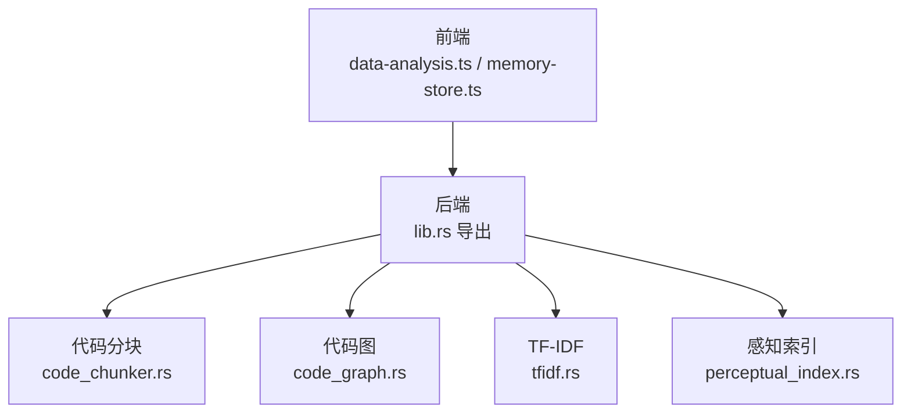
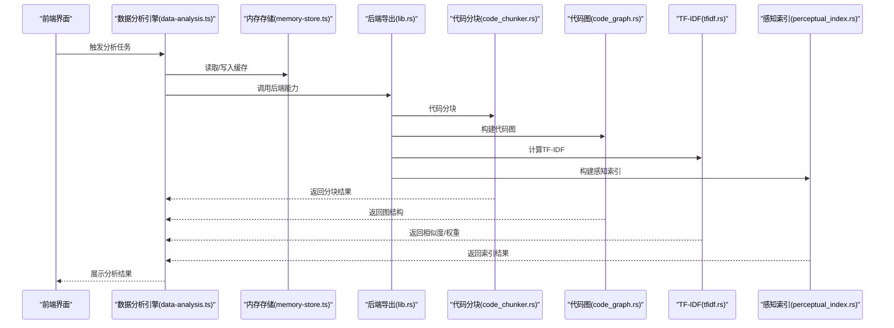
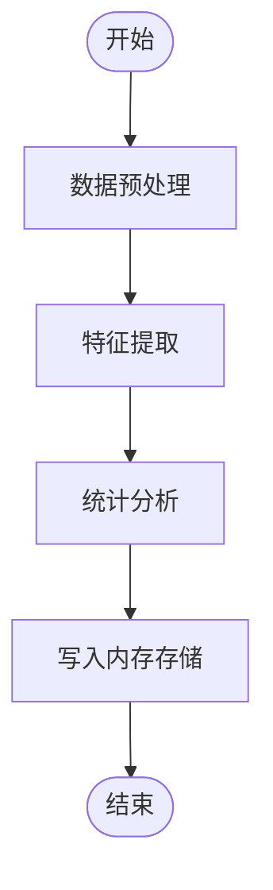
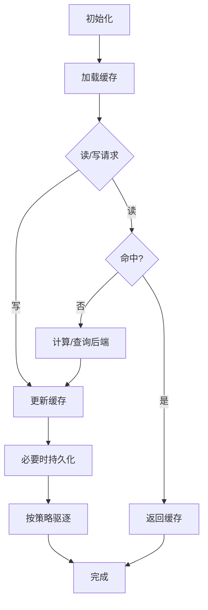
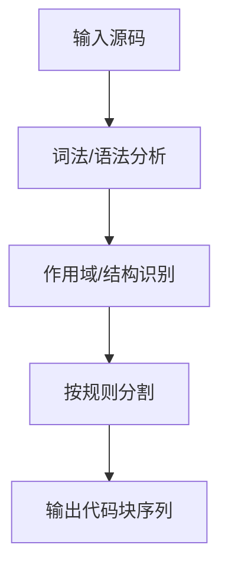
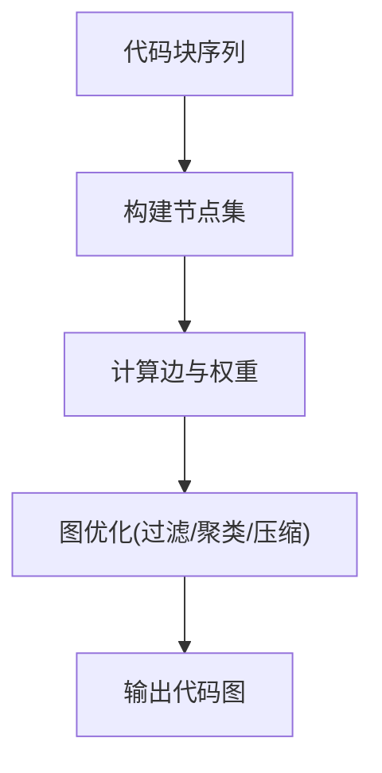
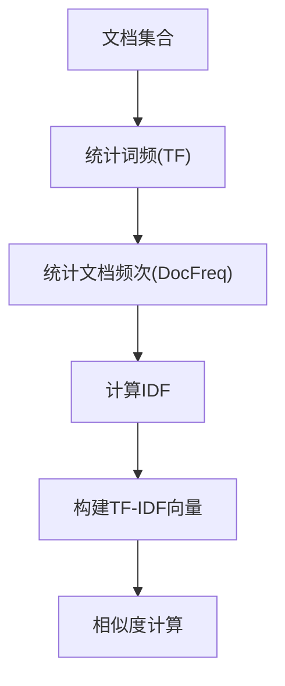
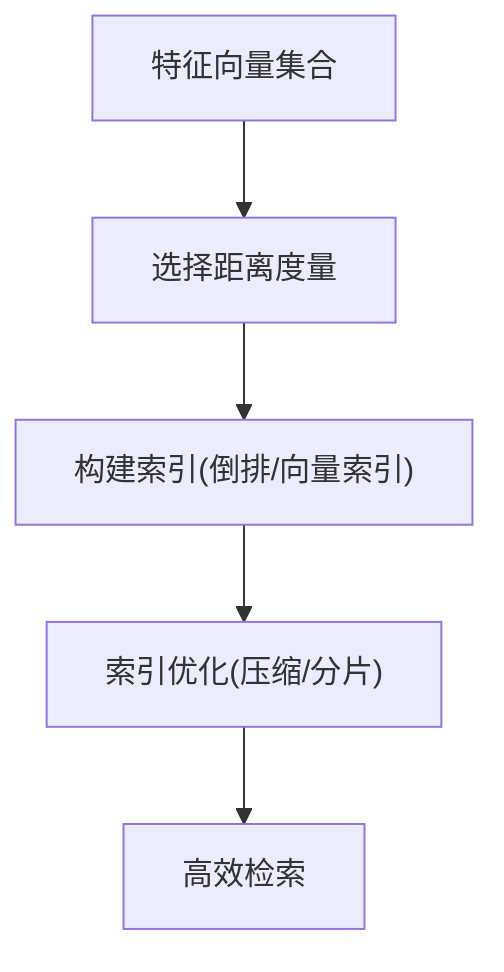
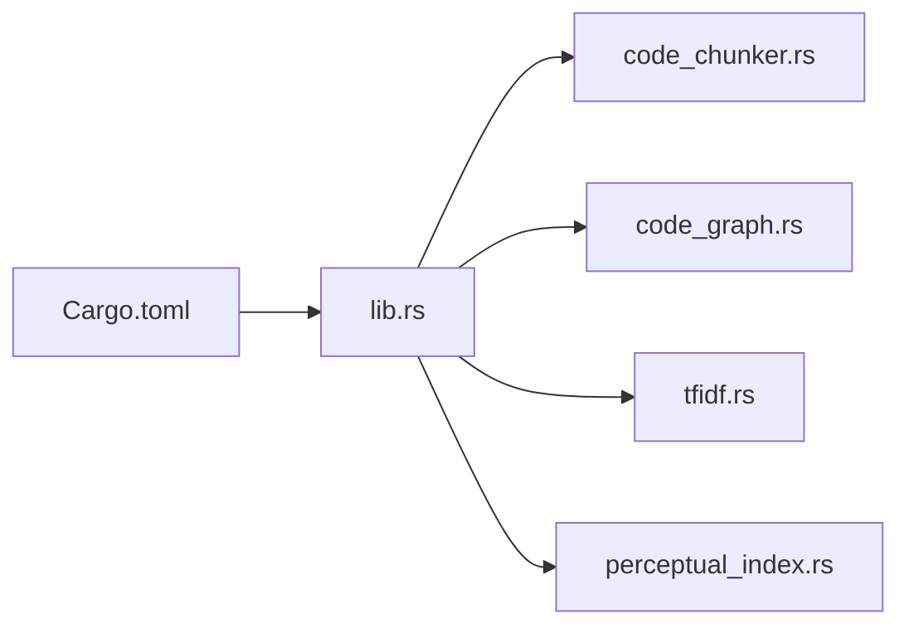

# 数据处理系统

<cite>
**本文引用的文件**
- [data-analysis.ts](file://src/data-analysis.ts)
- [memory-store.ts](file://src/memory-store.ts)
- [code_chunker.rs](file://src-tauri/src/code_chunker.rs)
- [code_graph.rs](file://src-tauri/src/code_graph.rs)
- [tfidf.rs](file://src-tauri/src/tfidf.rs)
- [perceptual_index.rs](file://src-tauri/src/perceptual_index.rs)
- [lib.rs](file://src-tauri/src/lib.rs)
- [Cargo.toml](file://src-tauri/Cargo.toml)
</cite>

## 目录
1. [简介](#简介)
2. [项目结构](#项目结构)
3. [核心组件](#核心组件)
4. [架构总览](#架构总览)
5. [详细组件分析](#详细组件分析)
6. [依赖分析](#依赖分析)
7. [性能考虑](#性能考虑)
8. [故障排查指南](#故障排查指南)
9. [结论](#结论)
10. [附录：使用示例与最佳实践](#附录使用示例与最佳实践)

## 简介
本文件面向“数据处理系统”的技术文档，聚焦以下能力域：
- 数据分析引擎：涵盖数据预处理、特征提取与统计分析
- 内存存储：数据缓存、持久化策略与访问模式
- 代码分块器：代码分割、语义分析与块生成
- 代码图构建：节点关系、边权重与图优化
- TF-IDF 计算：词频统计、逆文档频率与相似度
- 感知索引：特征向量、距离度量与索引优化
- 性能优化：内存管理与并发控制
- 使用示例与最佳实践

系统采用前端 TypeScript 与后端 Rust 的混合架构，Rust 模块通过 Tauri 暴露给前端调用。

## 项目结构
前端模块负责用户交互与调用后端能力；后端 Rust 模块提供高性能的数据处理与索引能力。关键文件如下：
- 前端数据处理入口：src/data-analysis.ts
- 前端内存存储：src/memory-store.ts
- 后端代码分块：src-tauri/src/code_chunker.rs
- 后端代码图：src-tauri/src/code_graph.rs
- 后端 TF-IDF：src-tauri/src/tfidf.rs
- 后端感知索引：src-tauri/src/perceptual_index.rs
- 后端导出入口：src-tauri/src/lib.rs
- 后端依赖清单：src-tauri/Cargo.toml

图表来源
- [lib.rs:1-200](file://src-tauri/src/lib.rs#L1-L200)
- [code_chunker.rs:1-200](file://src-tauri/src/code_chunker.rs#L1-L200)
- [code_graph.rs:1-200](file://src-tauri/src/code_graph.rs#L1-L200)
- [tfidf.rs:1-200](file://src-tauri/src/tfidf.rs#L1-L200)
- [perceptual_index.rs:1-200](file://src-tauri/src/perceptual_index.rs#L1-L200)

章节来源
- [data-analysis.ts:1-200](file://src/data-analysis.ts#L1-L200)
- [memory-store.ts:1-200](file://src/memory-store.ts#L1-L200)
- [lib.rs:1-200](file://src-tauri/src/lib.rs#L1-L200)

## 核心组件
- 数据分析引擎（前端）：封装数据预处理、特征提取与统计分析的流程，统一调度后端能力。
- 内存存储（前端）：提供数据缓存、会话状态与持久化接口，支持快速访问与跨页面共享。
- 代码分块器（后端）：对源码进行语义解析与分块，输出可检索的代码块序列。
- 代码图（后端）：基于代码块构建图结构，定义节点与边，支持权重计算与图优化。
- TF-IDF（后端）：实现词频统计、逆文档频率与相似度计算，支撑检索与聚类。
- 感知索引（后端）：以特征向量为基础的距离度量与索引优化，提升检索效率。

章节来源
- [data-analysis.ts:1-200](file://src/data-analysis.ts#L1-L200)
- [memory-store.ts:1-200](file://src/memory-store.ts#L1-L200)
- [code_chunker.rs:1-200](file://src-tauri/src/code_chunker.rs#L1-L200)
- [code_graph.rs:1-200](file://src-tauri/src/code_graph.rs#L1-L200)
- [tfidf.rs:1-200](file://src-tauri/src/tfidf.rs#L1-L200)
- [perceptual_index.rs:1-200](file://src-tauri/src/perceptual_index.rs#L1-L200)

## 架构总览
前端通过 Tauri 调用后端 Rust 模块，形成“前端编排 + 后端加速”的架构。数据流从前端发起，经由后端模块完成高性能计算，再返回前端展示或写入内存存储。

图表来源
- [data-analysis.ts:1-200](file://src/data-analysis.ts#L1-L200)
- [memory-store.ts:1-200](file://src/memory-store.ts#L1-L200)
- [lib.rs:1-200](file://src-tauri/src/lib.rs#L1-L200)
- [code_chunker.rs:1-200](file://src-tauri/src/code_chunker.rs#L1-L200)
- [code_graph.rs:1-200](file://src-tauri/src/code_graph.rs#L1-L200)
- [tfidf.rs:1-200](file://src-tauri/src/tfidf.rs#L1-L200)
- [perceptual_index.rs:1-200](file://src-tauri/src/perceptual_index.rs#L1-L200)

## 详细组件分析

### 数据分析引擎（前端）
职责与流程
- 数据预处理：清洗、归一化、缺失值处理等
- 特征提取：从原始数据中抽取可分析特征
- 统计分析：描述性统计、相关性分析、趋势识别
- 结果聚合：将后端返回的多维结果整合为可视化输入

关键交互点
- 调用后端能力：通过 Tauri 接口触发代码分块、图构建、TF-IDF 与感知索引
- 缓存管理：优先命中内存存储，避免重复计算
- 错误处理：捕获后端异常并回退到安全策略

图表来源
- [data-analysis.ts:1-200](file://src/data-analysis.ts#L1-L200)

章节来源
- [data-analysis.ts:1-200](file://src/data-analysis.ts#L1-L200)

### 内存存储（前端）
设计要点
- 缓存策略：LRU 或 TTL 驱逐，热点数据优先保留
- 持久化：在会话结束或满足条件时写入本地存储
- 访问模式：键空间分区、命名空间隔离、并发读写保护
- 生命周期：初始化加载、增量更新、失效清理

图表来源
- [memory-store.ts:1-200](file://src/memory-store.ts#L1-L200)

章节来源
- [memory-store.ts:1-200](file://src/memory-store.ts#L1-L200)

### 代码分块器（后端）
工作机制
- 输入：源码文本与语言标识
- 语义分析：识别函数、类、注释、字符串等结构单元
- 分割策略：按作用域、逻辑块或固定大小进行切分
- 输出：有序的代码块序列，附带元信息（位置、类型、摘要）

图表来源
- [code_chunker.rs:1-200](file://src-tauri/src/code_chunker.rs#L1-L200)

章节来源
- [code_chunker.rs:1-200](file://src-tauri/src/code_chunker.rs#L1-L200)

### 代码图构建（后端）
节点与边
- 节点：代码块（含语义标签、上下文指纹）
- 边：基于调用关系、引用关系、相似度阈值的连接
- 权重：语义相似度、调用频次、时间衰减因子

图优化
- 过滤噪声：移除低质量或孤立节点
- 聚类合并：将高相似节点合并为超节点
- 路径压缩：缩短关键链路，提升查询效率

图表来源
- [code_graph.rs:1-200](file://src-tauri/src/code_graph.rs#L1-L200)

章节来源
- [code_graph.rs:1-200](file://src-tauri/src/code_graph.rs#L1-L200)

### TF-IDF 计算（后端）
实现细节
- 词频统计：对每个文档的词项计数，归一化
- 逆文档频率：统计包含该词项的文档数量，计算 IDF
- 文档向量：TF-IDF 加权后的稀疏向量
- 相似度：余弦相似度或内积，用于检索与聚类

图表来源
- [tfidf.rs:1-200](file://src-tauri/src/tfidf.rs#L1-L200)

章节来源
- [tfidf.rs:1-200](file://src-tauri/src/tfidf.rs#L1-L200)

### 感知索引（后端）
构建原理
- 特征向量：从代码块中抽取语义特征，形成稠密向量
- 距离度量：欧氏距离、余弦距离或专用度量
- 索引优化：倒排索引、向量索引（如 IVFPQ/IVFSQ）、量化压缩

图表来源
- [perceptual_index.rs:1-200](file://src-tauri/src/perceptual_index.rs#L1-L200)

章节来源
- [perceptual_index.rs:1-200](file://src-tauri/src/perceptual_index.rs#L1-L200)

## 依赖分析
后端模块通过 lib.rs 对外暴露能力，Cargo.toml 管理第三方依赖。模块间耦合度低，职责清晰，便于扩展与替换。

图表来源
- [lib.rs:1-200](file://src-tauri/src/lib.rs#L1-L200)
- [Cargo.toml:1-200](file://src-tauri/Cargo.toml#L1-L200)

章节来源
- [lib.rs:1-200](file://src-tauri/src/lib.rs#L1-L200)
- [Cargo.toml:1-200](file://src-tauri/Cargo.toml#L1-L200)

## 性能考虑
- 内存管理
  - 前端：合理设置缓存容量与过期策略，避免内存泄漏
  - 后端：使用无锁数据结构或细粒度锁，减少竞争
- 并发控制
  - 多线程批处理：将独立文档并行处理，完成后合并
  - 异步 I/O：非阻塞读写，提高吞吐
- 计算优化
  - 向量化：利用 SIMD 或 BLAS 库加速矩阵运算
  - 近似最近邻：ANN 算法降低相似度计算复杂度
- 存储优化
  - 压缩编码：对向量与倒排表进行压缩
  - 分层存储：热数据驻留内存，冷数据落盘

## 故障排查指南
- 后端能力调用失败
  - 检查 Tauri 权限配置与能力声明
  - 查看后端日志与错误码映射
- 性能异常
  - 关注内存峰值与 GC 抖动
  - 分析热点路径与锁争用
- 结果不一致
  - 对比前后版本的分词与特征抽取策略
  - 校验 TF-IDF 归一化与相似度阈值

章节来源
- [lib.rs:1-200](file://src-tauri/src/lib.rs#L1-L200)

## 结论
本系统通过“前端编排 + 后端加速”的架构，实现了从数据预处理到感知索引的完整链路。代码分块器、代码图、TF-IDF 与感知索引四大能力相互配合，既保证了准确性，也兼顾了性能与可扩展性。建议在生产环境中结合业务场景持续迭代特征工程与索引策略。

## 附录：使用示例与最佳实践
- 使用示例
  - 在前端触发数据分析任务，传入源码路径与语言标识
  - 获取后端返回的代码块、图结构与相似度结果
  - 将结果写入内存存储，供后续可视化与检索使用
- 最佳实践
  - 先缓存后计算：优先命中内存存储，减少后端压力
  - 分批处理：大文档拆分为小批次，避免单次内存峰值
  - 动态阈值：根据领域调整 TF-IDF 与相似度阈值
  - 定期优化：周期性执行图优化与索引重建