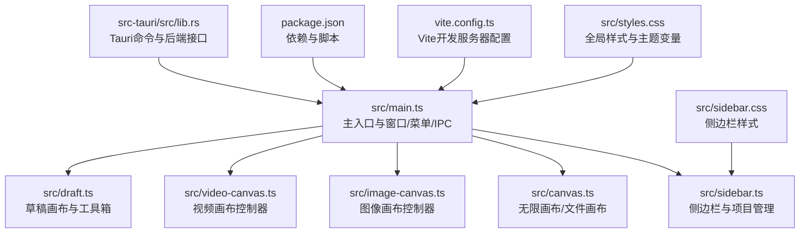
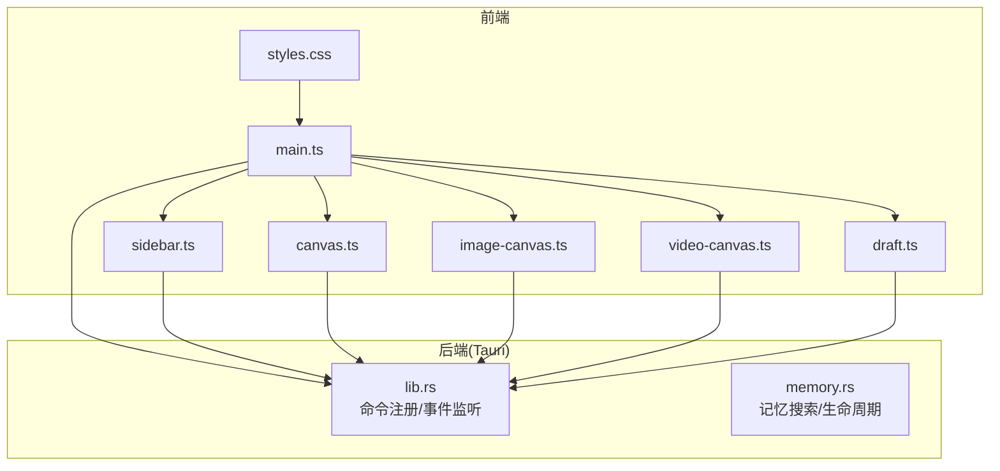
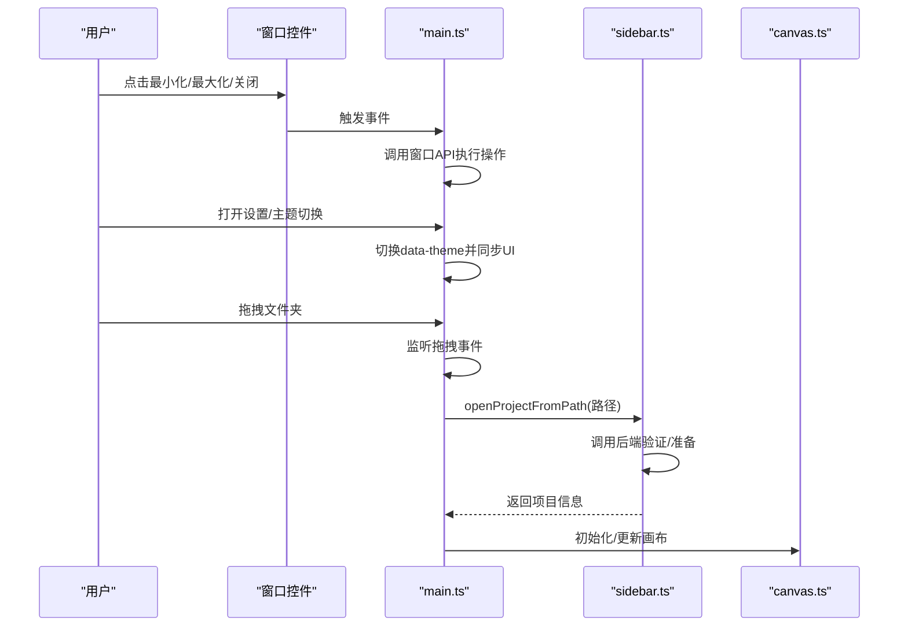
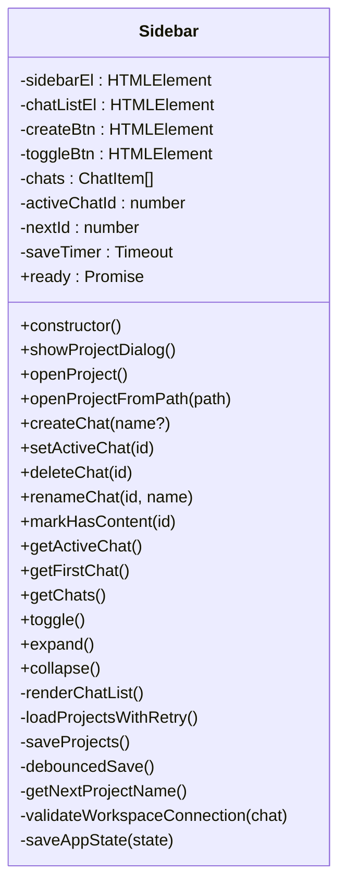
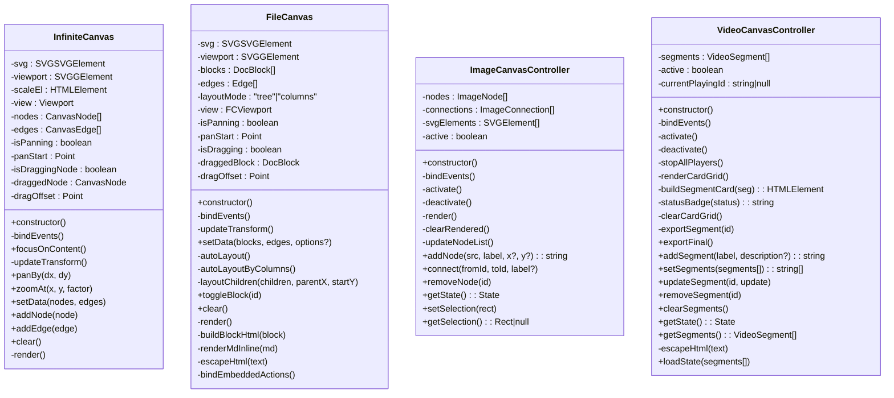
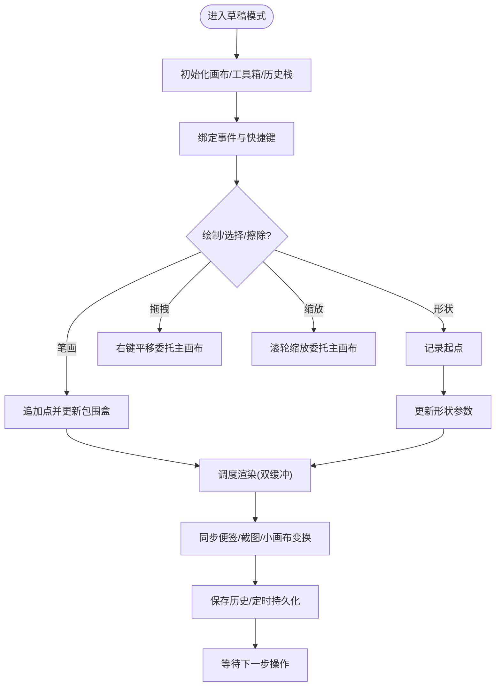
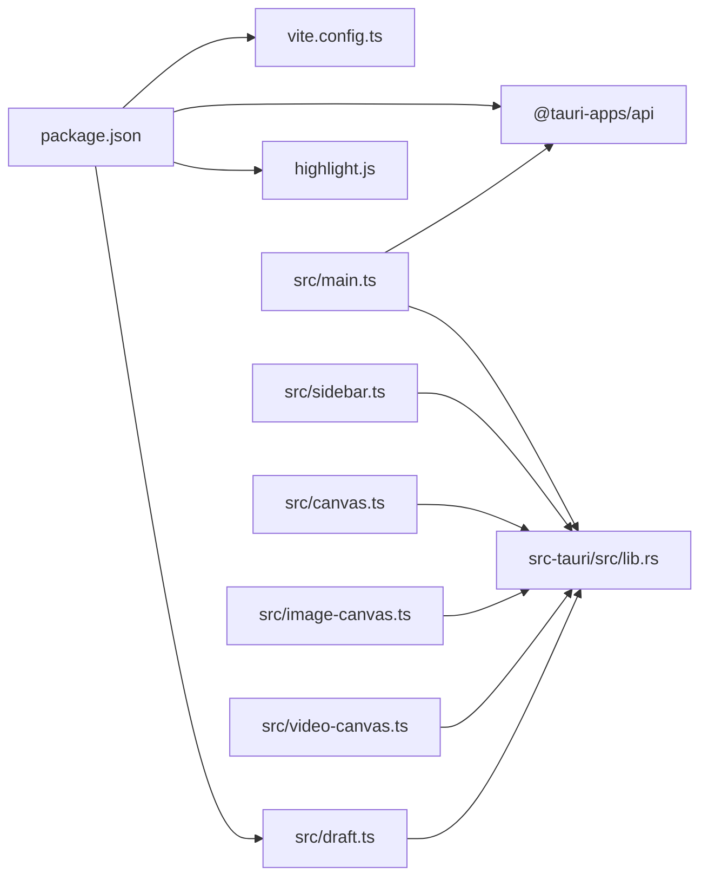

# 前端架构

<cite>
**本文档引用的文件**
- [src/main.ts](file://src/main.ts)
- [src/sidebar.ts](file://src/sidebar.ts)
- [src/canvas.ts](file://src/canvas.ts)
- [src/image-canvas.ts](file://src/image-canvas.ts)
- [src/video-canvas.ts](file://src/video-canvas.ts)
- [src/draft.ts](file://src/draft.ts)
- [src/styles.css](file://src/styles.css)
- [src/sidebar.css](file://src/sidebar.css)
- [package.json](file://package.json)
- [vite.config.ts](file://vite.config.ts)
- [src-tauri/src/lib.rs](file://src-tauri/src/lib.rs)
- [src-tauri/src/memory.rs](file://src-tauri/src/memory.rs)
</cite>

## 目录
1. [简介](#简介)
2. [项目结构](#项目结构)
3. [核心组件](#核心组件)
4. [架构总览](#架构总览)
5. [详细组件分析](#详细组件分析)
6. [依赖关系分析](#依赖关系分析)
7. [性能考量](#性能考量)
8. [故障排查指南](#故障排查指南)
9. [结论](#结论)
10. [附录](#附录)

## 简介
本文件面向AI专家工作台前端，系统性梳理基于TypeScript与现代Web技术的前端架构设计。重点覆盖主入口初始化、侧边栏组件系统、样式与响应式布局、画布渲染体系（图像/视频/草稿/文件内容画布）、前后端通信接口（IPC）、状态管理策略、性能优化与内存管理、错误处理机制以及组件生命周期与用户交互流程。文档旨在帮助开发者快速理解并高效扩展前端能力。

## 项目结构
前端采用模块化组织，核心入口负责窗口控制、菜单交互、画布初始化与设置页管理；侧边栏负责项目管理与持久化；画布系统包含无限画布、文件内容画布、图像画布与视频画布；草稿系统提供高性能手绘与标注能力；样式系统通过CSS变量与媒体查询实现深浅主题与响应式布局；构建与运行依托Vite与Tauri CLI。

**图表来源**
- [src/main.ts:1-264](file://src/main.ts#L1-L264)
- [src/sidebar.ts:1-629](file://src/sidebar.ts#L1-L629)
- [src/canvas.ts:1-664](file://src/canvas.ts#L1-L664)
- [src/image-canvas.ts:1-218](file://src/image-canvas.ts#L1-L218)
- [src/video-canvas.ts:1-273](file://src/video-canvas.ts#L1-L273)
- [src/draft.ts:1-800](file://src/draft.ts#L1-L800)
- [src/styles.css:1-200](file://src/styles.css#L1-L200)
- [src/sidebar.css:1-200](file://src/sidebar.css#L1-L200)
- [vite.config.ts:1-31](file://vite.config.ts#L1-L31)
- [package.json:1-28](file://package.json#L1-L28)
- [src-tauri/src/lib.rs:5529-5570](file://src-tauri/src/lib.rs#L5529-L5570)

**章节来源**
- [src/main.ts:1-264](file://src/main.ts#L1-L264)
- [src/sidebar.ts:1-629](file://src/sidebar.ts#L1-L629)
- [src/canvas.ts:1-664](file://src/canvas.ts#L1-L664)
- [src/image-canvas.ts:1-218](file://src/image-canvas.ts#L1-L218)
- [src/video-canvas.ts:1-273](file://src/video-canvas.ts#L1-L273)
- [src/draft.ts:1-800](file://src/draft.ts#L1-L800)
- [src/styles.css:1-200](file://src/styles.css#L1-L200)
- [src/sidebar.css:1-200](file://src/sidebar.css#L1-L200)
- [vite.config.ts:1-31](file://vite.config.ts#L1-L31)
- [package.json:1-28](file://package.json#L1-L28)
- [src-tauri/src/lib.rs:5529-5570](file://src-tauri/src/lib.rs#L5529-L5570)

## 核心组件
- 主入口与窗口控制：初始化应用窗口、标题栏拖拽、最小化/最大化/关闭、主题切换、设置页与菜单交互、拖拽打开项目、画布初始化。
- 侧边栏：项目列表管理、创建/打开/删除/重命名、持久化与状态恢复、工作区连接校验。
- 画布系统：无限画布（节点/连线/拖拽/缩放/聚焦）、文件内容画布（树状/列布局、折叠/展开、点击预览）、图像画布控制器、视频画布控制器（卡片网格、播放器、导出）。
- 草稿系统：高性能手绘（双缓冲、视口同步、撤销/重做、选区、键盘快捷键、橡皮擦模式）、工具箱（刷子/形状/便签/截图/清空画布）。
- 样式与响应式：CSS变量主题、媒体查询断点、布局栅格与间距、侧边栏展开/收起动画。
- 构建与运行：Vite开发服务器固定端口与HMR、忽略src-tauri监听、脚本命令。

**章节来源**
- [src/main.ts:152-288](file://src/main.ts#L152-L288)
- [src/sidebar.ts:26-629](file://src/sidebar.ts#L26-L629)
- [src/canvas.ts:30-302](file://src/canvas.ts#L30-L302)
- [src/canvas.ts:351-664](file://src/canvas.ts#L351-L664)
- [src/image-canvas.ts:24-218](file://src/image-canvas.ts#L24-L218)
- [src/video-canvas.ts:16-273](file://src/video-canvas.ts#L16-L273)
- [src/draft.ts:140-800](file://src/draft.ts#L140-L800)
- [src/styles.css:1-200](file://src/styles.css#L1-L200)
- [vite.config.ts:1-31](file://vite.config.ts#L1-L31)

## 架构总览
前端采用“模块化分层 + IPC通信”的架构：主入口负责协调各模块与后端交互；侧边栏负责项目生命周期；画布系统负责可视化呈现；草稿系统负责创作与标注；样式系统统一视觉与响应式；Vite提供开发体验，Tauri提供原生能力与安全沙箱。

**图表来源**
- [src/main.ts:1-264](file://src/main.ts#L1-L264)
- [src/sidebar.ts:1-629](file://src/sidebar.ts#L1-L629)
- [src/canvas.ts:1-664](file://src/canvas.ts#L1-L664)
- [src/image-canvas.ts:1-218](file://src/image-canvas.ts#L1-L218)
- [src/video-canvas.ts:1-273](file://src/video-canvas.ts#L1-L273)
- [src/draft.ts:1-800](file://src/draft.ts#L1-L800)
- [src/styles.css:1-200](file://src/styles.css#L1-L200)
- [src-tauri/src/lib.rs:5529-5570](file://src-tauri/src/lib.rs#L5529-L5570)
- [src-tauri/src/memory.rs:278-842](file://src-tauri/src/memory.rs#L278-L842)

## 详细组件分析

### 主入口与窗口控制
- 窗口控制：最小化/最大化/关闭按钮绑定；标题栏拖拽；错误日志。
- 菜单与设置：下拉菜单切换、设置页打开/关闭、主题切换（深浅）、返回按钮。
- 画布初始化：DOMContentLoaded后初始化无限画布；拖拽文件夹打开项目；IPC调用后端验证与准备。
- 全局工具函数：错误Toast、附件类型检测、消息载荷构建与解析、运行模式转换、密钥池加载/保存/渲染。

**图表来源**
- [src/main.ts:152-288](file://src/main.ts#L152-L288)
- [src/main.ts:244-262](file://src/main.ts#L244-L262)
- [src/sidebar.ts:319-369](file://src/sidebar.ts#L319-L369)
- [src/canvas.ts:307-316](file://src/canvas.ts#L307-L316)

**章节来源**
- [src/main.ts:152-288](file://src/main.ts#L152-L288)
- [src/main.ts:244-262](file://src/main.ts#L244-L262)
- [src/main.ts:746-771](file://src/main.ts#L746-L771)

### 侧边栏组件系统
- 数据模型：ChatItem、ICON_COLORS、nextId、activeChatId。
- 生命周期：构造函数注入sidebar实例、加载项目列表（带重试）、保存项目（防抖）、持久化到数据库与projects.json。
- 用户交互：创建/打开项目对话框、重命名（双击输入）、删除（确认）、展开/收起、点击切换活跃项目、自动收起侧边栏。
- 工作区连接：调用后端验证工作区路径有效性，异常延迟提示。

**图表来源**
- [src/sidebar.ts:26-629](file://src/sidebar.ts#L26-L629)

**章节来源**
- [src/sidebar.ts:26-629](file://src/sidebar.ts#L26-L629)

### 画布渲染系统
- 无限画布（InfiniteCanvas）：SVG视口变换（平移/缩放）、节点拖拽、连线渲染、自动聚焦到内容区域、同步草稿画布视口。
- 文件内容画布（FileCanvas）：DocBlock布局（树状/列布局）、折叠/展开、点击打开文件预览、内嵌HTML渲染与事件绑定。
- 图像画布控制器（ImageCanvasController）：复用主画布SVG节点，渲染图片节点与连线，支持添加/连接/删除节点与列表更新。
- 视频画布控制器（VideoCanvasController）：卡片网格渲染、播放器控制、导出片段、状态徽章、空状态提示。

**图表来源**
- [src/canvas.ts:30-302](file://src/canvas.ts#L30-L302)
- [src/canvas.ts:351-664](file://src/canvas.ts#L351-L664)
- [src/image-canvas.ts:24-218](file://src/image-canvas.ts#L24-L218)
- [src/video-canvas.ts:16-273](file://src/video-canvas.ts#L16-L273)

**章节来源**
- [src/canvas.ts:30-302](file://src/canvas.ts#L30-L302)
- [src/canvas.ts:351-664](file://src/canvas.ts#L351-L664)
- [src/image-canvas.ts:24-218](file://src/image-canvas.ts#L24-L218)
- [src/video-canvas.ts:16-273](file://src/video-canvas.ts#L16-L273)

### 草稿系统（高性能手绘与标注）
- 数据模型：Stroke/Shape/Note/Screenshot/MiniCanvas/DraftLayer/DraftData/HistoryState/Selection/Tool。
- 工具箱：工具切换（笔刷/形状/便签/截图/清空）、颜色选择、橡皮擦模式（部分/整条）、快捷键、清除确认。
- 草稿画布：双缓冲离屏Canvas、视口同步、事件处理（mousedown/mousemove/mouseup/wheel/resize）、撤销/重做、选区、键盘快捷键、右键平移与滚轮缩放委托主画布。
- DOM元素同步：便签/截图/小画布位置与尺寸跟随视口变换。

**图表来源**
- [src/draft.ts:140-800](file://src/draft.ts#L140-L800)

**章节来源**
- [src/draft.ts:140-800](file://src/draft.ts#L140-L800)

### 样式管理与响应式布局
- CSS变量：主题色板、表面层、阴影、圆角、栅格尺寸、头部高度、左右边距等。
- 深浅主题：:root与[data-theme="dark"]切换，动态应用到组件。
- 响应式断点：针对不同宽度调整聊天卡宽度、右侧栏宽度、草稿工具箱高度、图例显示等。
- 侧边栏：展开/收起动画、图标与文本切换、悬停菜单显示。

**章节来源**
- [src/styles.css:1-200](file://src/styles.css#L1-L200)
- [src/styles.css:7743-7798](file://src/styles.css#L7743-L7798)
- [src/sidebar.css:1-200](file://src/sidebar.css#L1-L200)

## 依赖关系分析
- 前端依赖：@tauri-apps/api、@tauri-apps/plugin-dialog、highlight.js、typescript、vite。
- 构建配置：Vite固定端口与HMR，忽略src-tauri监听，开发主机可选。
- 后端接口：Tauri命令注册（如memory_search、memory_delete、memory_run_lifecycle等），前端通过invoke调用。

**图表来源**
- [package.json:1-28](file://package.json#L1-L28)
- [vite.config.ts:1-31](file://vite.config.ts#L1-L31)
- [src/main.ts:1-29](file://src/main.ts#L1-L29)
- [src-tauri/src/lib.rs:5529-5570](file://src-tauri/src/lib.rs#L5529-L5570)

**章节来源**
- [package.json:1-28](file://package.json#L1-L28)
- [vite.config.ts:1-31](file://vite.config.ts#L1-L31)
- [src-tauri/src/lib.rs:5529-5570](file://src-tauri/src/lib.rs#L5529-L5570)

## 性能考量
- 画布渲染优化
  - 无限画布与文件画布均采用SVG渲染，节点/连线分离绘制，避免DOM爆炸。
  - 草稿画布使用双缓冲离屏Canvas，减少主线程重排与闪烁，按需调度渲染。
  - 视口变换统一通过transform传递，避免逐元素重算布局。
- 输入与事件
  - 草稿系统对mousemove进行距离阈值节流，降低高频点采集带来的计算压力。
  - 右键平移与滚轮缩放委托主画布，保持一致的视口状态，避免重复计算。
- 内存管理
  - 草稿系统提供撤销/重做历史栈，限制最大历史数量，定期清理。
  - 图像/视频画布在视图切换时按需激活/停用，避免常驻DOM与资源占用。
  - 侧边栏与画布在设置页打开时隐藏相关UI，减少渲染负担。
- 样式与布局
  - 使用CSS变量与媒体查询，减少重复样式与重排。
  - 侧边栏展开/收起使用过渡动画，避免频繁DOM变更。

[本节为通用指导，无需特定文件引用]

## 故障排查指南
- 窗口控制不可用
  - 现象：最小化/最大化/关闭按钮无效。
  - 排查：检查当前运行环境是否支持窗口API；查看日志输出。
  - 参考：[src/main.ts:152-162](file://src/main.ts#L152-L162)
- 画布初始化失败
  - 现象：画布空白或无法交互。
  - 排查：确认DOMContentLoaded事件已触发；检查initCanvas调用；查看拖拽事件监听是否注册。
  - 参考：[src/main.ts:244-262](file://src/main.ts#L244-L262)、[src/canvas.ts:307-316](file://src/canvas.ts#L307-L316)
- 侧边栏项目管理异常
  - 现象：创建/打开/删除项目失败或状态不一致。
  - 排查：检查后端命令调用（如db_save_project、db_delete_project）；确认projects.json同步；查看重试逻辑。
  - 参考：[src/sidebar.ts:113-137](file://src/sidebar.ts#L113-L137)、[src/sidebar.ts:424-462](file://src/sidebar.ts#L424-L462)
- 草稿画布无响应
  - 现象：无法绘制/选择/撤销。
  - 排查：确认草稿画布处于激活状态；检查事件绑定与快捷键冲突；查看视口同步与双缓冲状态。
  - 参考：[src/draft.ts:429-563](file://src/draft.ts#L429-L563)、[src/draft.ts:565-656](file://src/draft.ts#L565-L656)
- 设置页遮挡UI
  - 现象：打开设置后部分UI不可见。
  - 排查：检查设置页打开时的display状态保存与恢复逻辑。
  - 参考：[src/main.ts:321-357](file://src/main.ts#L321-L357)
- 后端命令调用失败
  - 现象：调用invoke报错或返回异常。
  - 排查：核对命令签名与参数；检查后端命令注册；查看错误Toast提示。
  - 参考：[src-tauri/src/lib.rs:5529-5570](file://src-tauri/src/lib.rs#L5529-L5570)、[src/main.ts:568-573](file://src/main.ts#L568-L573)

**章节来源**
- [src/main.ts:152-162](file://src/main.ts#L152-L162)
- [src/main.ts:244-262](file://src/main.ts#L244-L262)
- [src/canvas.ts:307-316](file://src/canvas.ts#L307-L316)
- [src/sidebar.ts:113-137](file://src/sidebar.ts#L113-L137)
- [src/sidebar.ts:424-462](file://src/sidebar.ts#L424-L462)
- [src/draft.ts:429-563](file://src/draft.ts#L429-L563)
- [src/draft.ts:565-656](file://src/draft.ts#L565-L656)
- [src/main.ts:321-357](file://src/main.ts#L321-L357)
- [src-tauri/src/lib.rs:5529-5570](file://src-tauri/src/lib.rs#L5529-L5570)
- [src/main.ts:568-573](file://src/main.ts#L568-L573)

## 结论
该前端架构以模块化与IPC为核心，结合高性能画布与响应式样式，实现了从项目管理到创作标注再到可视化呈现的完整工作流。通过双缓冲、视口同步、事件节流与历史栈等手段，兼顾了交互流畅性与资源占用控制。建议在后续迭代中进一步完善状态持久化策略、增强错误边界与可观测性，并持续优化大体量数据场景下的渲染性能。

[本节为总结性内容，无需特定文件引用]

## 附录
- 开发与构建
  - 开发：vite dev（固定端口1420，可配置HMR主机）。
  - 构建：tsc + vite build。
  - 脚本：prompt:check、tauri、cli:test、restore:test-baseline。
- 后端命令参考
  - 记忆搜索/删除/清理/生命周期：memory_search、memory_delete、memory_clear_type、memory_run_lifecycle。
- 最佳实践
  - 事件委托与被动监听，避免滚动默认行为。
  - 使用CustomEvent在模块间解耦通信。
  - 严格区分视口坐标与屏幕坐标，统一通过视口变换。
  - 对高频DOM操作采用批量更新与双缓冲策略。

**章节来源**
- [package.json:6-14](file://package.json#L6-L14)
- [vite.config.ts:7-30](file://vite.config.ts#L7-L30)
- [src-tauri/src/lib.rs:5529-5570](file://src-tauri/src/lib.rs#L5529-L5570)