# 后端架构

<cite>
**本文档引用的文件**
- [Cargo.toml](file://src-tauri/Cargo.toml)
- [main.rs](file://src-tauri/src/main.rs)
- [lib.rs](file://src-tauri/src/lib.rs)
- [tauri.conf.json](file://src-tauri/tauri.conf.json)
- [package.json](file://package.json)
- [config.rs](file://src-tauri/src/config.rs)
- [hooks.rs](file://src-tauri/src/hooks.rs)
- [blackboard_engine.rs](file://src-tauri/src/blackboard_engine.rs)
- [expert_session_engine.rs](file://src-tauri/src/expert_session_engine.rs)
- [tool_system.rs](file://src-tauri/src/tool_system.rs)
- [shell_executor.rs](file://src-tauri/src/shell_executor.rs)
- [memory.rs](file://src-tauri/src/memory.rs)
- [token_runtime_engine.rs](file://src-tauri/src/token_runtime_engine.rs)
- [supervisor_engine.rs](file://src-tauri/src/supervisor_engine.rs)
- [workflow_engine.rs](file://src-tauri/src/workflow_engine.rs)
</cite>

## 目录
1. [简介](#简介)
2. [项目结构](#项目结构)
3. [核心组件](#核心组件)
4. [架构总览](#架构总览)
5. [详细组件分析](#详细组件分析)
6. [依赖关系分析](#依赖关系分析)
7. [性能考量](#性能考量)
8. [故障排查指南](#故障排查指南)
9. [结论](#结论)
10. [附录](#附录)

## 简介
本文件面向AI专家工作台后端，基于Rust与Tauri框架构建，提供专家调度、工具执行、工作流治理、记忆与配额管理等能力。后端采用模块化设计，通过Tauri的IPC机制与前端进行交互，结合能力配置与安全模型，确保在本地环境中安全高效地执行专家任务与工具调用。

## 项目结构
后端位于src-tauri目录，采用Rust标准库与Tokio异步运行时，通过Tauri暴露命令接口给前端。前端通过Vite构建，Tauri负责打包与运行时安全控制。

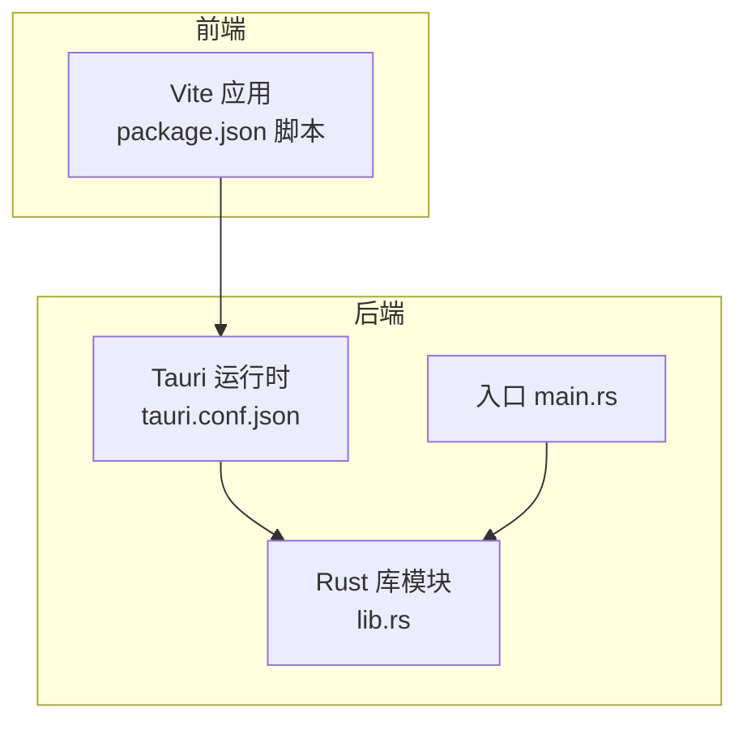

**图表来源**
- [tauri.conf.json:6-11](file://src-tauri/tauri.conf.json#L6-L11)
- [package.json:6-14](file://package.json#L6-L14)
- [main.rs:1-6](file://src-tauri/src/main.rs#L1-L6)
- [lib.rs:1-50](file://src-tauri/src/lib.rs#L1-L50)

**章节来源**
- [tauri.conf.json:1-38](file://src-tauri/tauri.conf.json#L1-L38)
- [package.json:1-28](file://package.json#L1-L28)
- [main.rs:1-6](file://src-tauri/src/main.rs#L1-L6)
- [lib.rs:1-80](file://src-tauri/src/lib.rs#L1-L80)

## 核心组件
- 配置管理：集中式配置结构与层叠合并，支持全局与项目级配置。
- 钩子系统：可扩展的前后置钩子，统一处理工具与专家执行的横切逻辑。
- 黑板引擎：专家协作的共享上下文，追踪证据、变更提案、测试与审查。
- 专家会话：专家任务的启动、延续与收尾，承载令牌配额与使用统计。
- 工具系统：工具注册表与路由器，统一抽象工具执行器，内置多种工具。
- Shell执行器：跨平台命令执行与输出截断、超时控制、沙箱保护。
- 记忆系统：基于TF-IDF的本地记忆检索与生命周期管理。
- 令牌配额：专家与项目级令牌用量统计、配额检查与仪表盘。
- 主管引擎：专家派发、跟进与中期检查的LLM驱动决策。
- 工作流引擎：交付物验证、专家回复守卫与工作区一致性检查。

**章节来源**
- [config.rs:1-260](file://src-tauri/src/config.rs#L1-L260)
- [hooks.rs:1-190](file://src-tauri/src/hooks.rs#L1-L190)
- [blackboard_engine.rs:1-670](file://src-tauri/src/blackboard_engine.rs#L1-L670)
- [expert_session_engine.rs:1-38](file://src-tauri/src/expert_session_engine.rs#L1-L38)
- [tool_system.rs:1-841](file://src-tauri/src/tool_system.rs#L1-L841)
- [shell_executor.rs:1-656](file://src-tauri/src/shell_executor.rs#L1-L656)
- [memory.rs:1-843](file://src-tauri/src/memory.rs#L1-L843)
- [token_runtime_engine.rs:1-744](file://src-tauri/src/token_runtime_engine.rs#L1-L744)
- [supervisor_engine.rs:1-982](file://src-tauri/src/supervisor_engine.rs#L1-L982)
- [workflow_engine.rs:1-1676](file://src-tauri/src/workflow_engine.rs#L1-L1676)

## 架构总览
后端通过Tauri命令暴露API，前端通过IPC调用。核心数据流包括：前端请求 -> Tauri命令 -> Rust处理 -> 数据库/文件系统/外部服务 -> 返回结果。

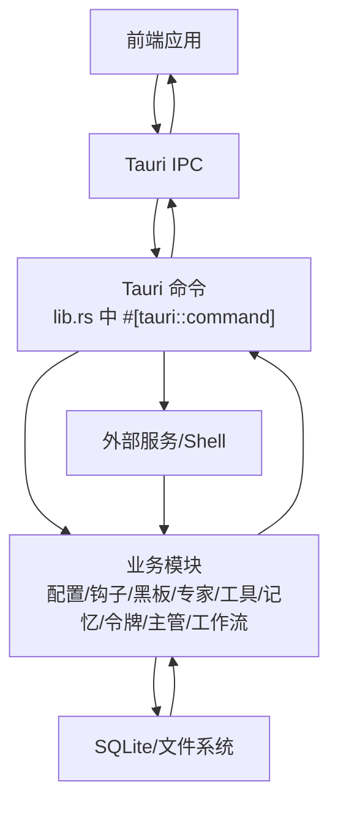

**图表来源**
- [lib.rs:707-800](file://src-tauri/src/lib.rs#L707-L800)
- [tauri.conf.json:1-38](file://src-tauri/tauri.conf.json#L1-L38)

**章节来源**
- [lib.rs:707-800](file://src-tauri/src/lib.rs#L707-L800)
- [tauri.conf.json:1-38](file://src-tauri/tauri.conf.json#L1-L38)

## 详细组件分析

### 配置管理系统
- 配置结构：包含LLM、Shell、审批、代理、流水线、UI等配置段。
- 层叠合并：全局配置 -> 项目级配置 -> 运行时覆盖，深度合并策略。
- 保存与默认：提供默认配置JSON与保存到指定路径的能力。

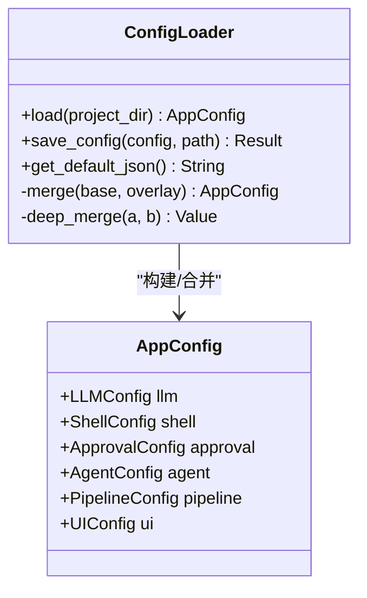

**图表来源**
- [config.rs:4-168](file://src-tauri/src/config.rs#L4-L168)
- [config.rs:170-259](file://src-tauri/src/config.rs#L170-L259)

**章节来源**
- [config.rs:1-260](file://src-tauri/src/config.rs#L1-L260)

### 钩子系统
- 阶段与决策：PreTool、PostTool、PreExpert、PostExpert，支持Continue、ModifyInput、Skip、InjectContext、Retry等决策。
- 内置钩子：检查退出码、注入黑板摘要、检测无进展、检查审批状态。
- 管理器：注册、排序、执行钩子，懒初始化。

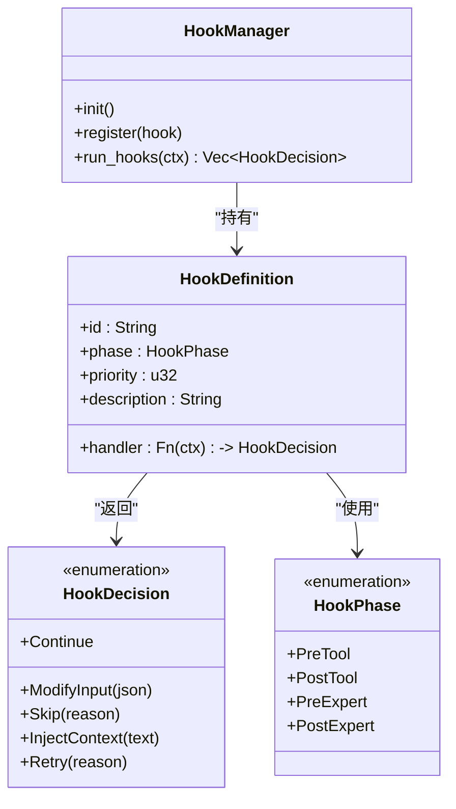

**图表来源**
- [hooks.rs:5-44](file://src-tauri/src/hooks.rs#L5-L44)
- [hooks.rs:46-80](file://src-tauri/src/hooks.rs#L46-L80)
- [hooks.rs:171-190](file://src-tauri/src/hooks.rs#L171-L190)

**章节来源**
- [hooks.rs:1-190](file://src-tauri/src/hooks.rs#L1-L190)

### 黑板引擎
- 数据结构：证据、所需文件集、补丁提案、验证运行、审查决策、阻断项等。
- 生命周期：创建、从专家任务更新、推进进度、渲染上下文。
- 进度判定：基于签名变化与连续无进展轮次的阻断逻辑。

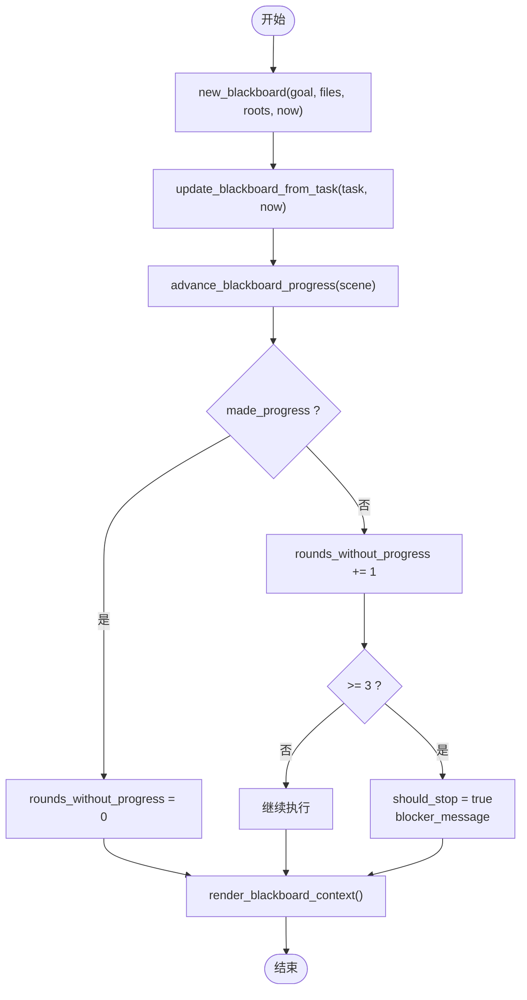

**图表来源**
- [blackboard_engine.rs:87-130](file://src-tauri/src/blackboard_engine.rs#L87-L130)
- [blackboard_engine.rs:132-280](file://src-tauri/src/blackboard_engine.rs#L132-L280)
- [blackboard_engine.rs:282-333](file://src-tauri/src/blackboard_engine.rs#L282-L333)
- [blackboard_engine.rs:335-447](file://src-tauri/src/blackboard_engine.rs#L335-L447)

**章节来源**
- [blackboard_engine.rs:1-670](file://src-tauri/src/blackboard_engine.rs#L1-L670)

### 专家会话引擎
- 启动请求：包含专家身份、基础提示、场景、任务描述、历史结果、API密钥与模型、项目信息与模块ID。
- 响应：返回状态、提示字符数、模块ID列表与历史提示模块ID。

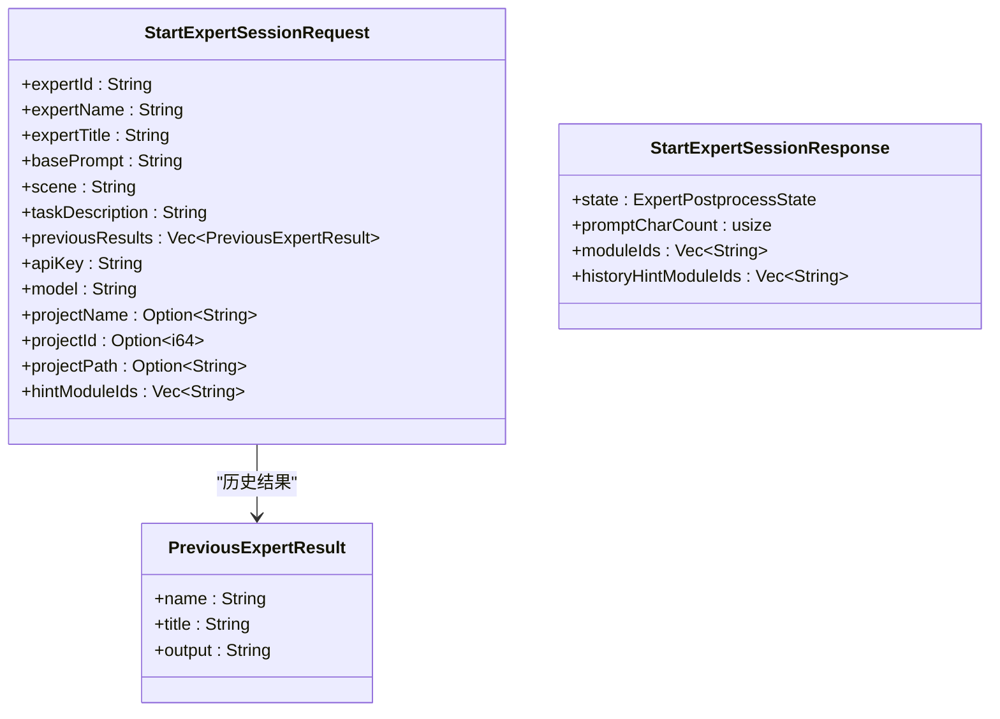

**图表来源**
- [expert_session_engine.rs:4-37](file://src-tauri/src/expert_session_engine.rs#L4-L37)

**章节来源**
- [expert_session_engine.rs:1-38](file://src-tauri/src/expert_session_engine.rs#L1-L38)

### 工具系统
- 抽象：ToolExecutor trait，统一定义工具定义与执行。
- 注册表：ToolRegistry，注册与查询工具。
- 路由器：ToolRouter，分发工具调用。
- 内置工具：Shell执行、文件读写、结构化补丁、文件列表、网络搜索、记忆查询、索引搜索。

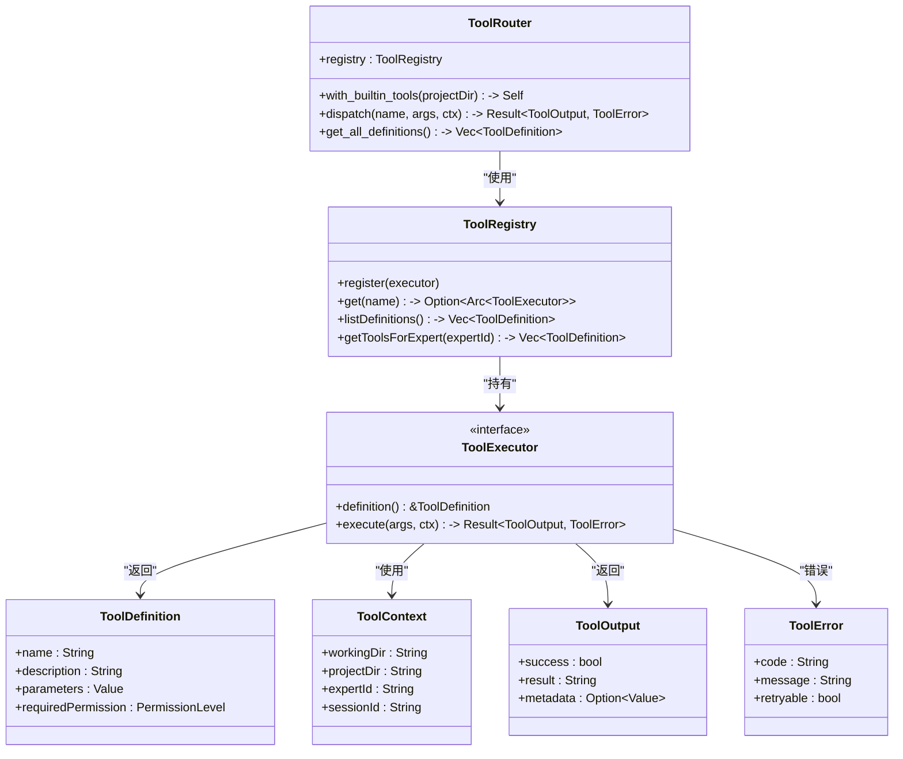

**图表来源**
- [tool_system.rs:17-60](file://src-tauri/src/tool_system.rs#L17-L60)
- [tool_system.rs:62-95](file://src-tauri/src/tool_system.rs#L62-L95)
- [tool_system.rs:97-142](file://src-tauri/src/tool_system.rs#L97-L142)

**章节来源**
- [tool_system.rs:1-841](file://src-tauri/src/tool_system.rs#L1-L841)

### Shell执行器
- 增强执行：超时、输出截断、工作目录沙箱、环境变量覆盖、并发读取stdout/stderr。
- 安全检查：危险模式与管理员命令识别。
- 兼容接口：同步与异步执行封装。

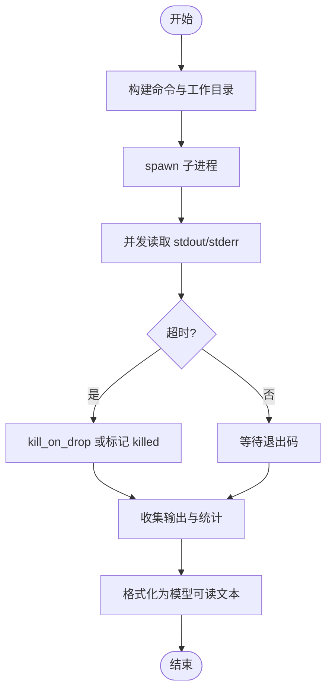

**图表来源**
- [shell_executor.rs:497-633](file://src-tauri/src/shell_executor.rs#L497-L633)

**章节来源**
- [shell_executor.rs:1-656](file://src-tauri/src/shell_executor.rs#L1-L656)

### 记忆系统
- 数据结构：记忆条目、查询、搜索结果。
- 存储：项目级.json文件，上限保护与访问统计。
- 检索：TF-IDF关键词匹配、时间衰减、访问频率加成、类型权重。
- 生命周期：Ephemeral -> Working -> LongTerm 的自动凝练与清理。

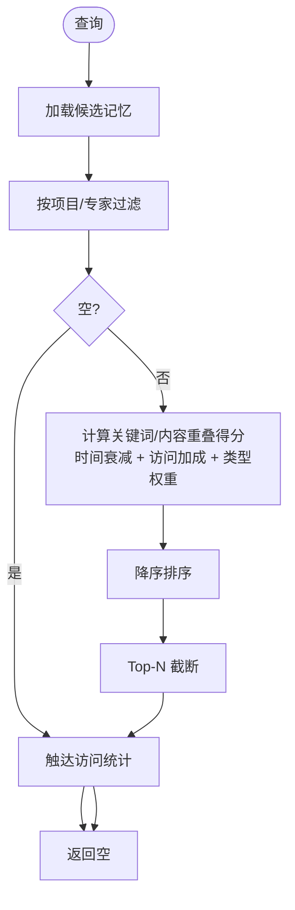

**图表来源**
- [memory.rs:167-305](file://src-tauri/src/memory.rs#L167-L305)

**章节来源**
- [memory.rs:1-843](file://src-tauri/src/memory.rs#L1-L843)

### 令牌配额与仪表盘
- 数据结构：使用记录、分配、专家元数据、仪表盘快照。
- 配额检查：按日/月/年限制，豁免专家ID，时间窗口计算。
- 用量追加：同时更新项目与用户数据集。
- 仪表盘：今日/月/总用量、专家分布、模型统计、配额状态、趋势。

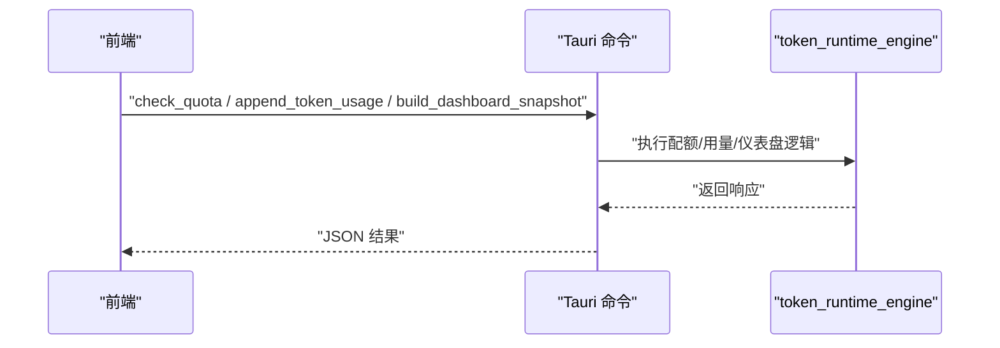

**图表来源**
- [token_runtime_engine.rs:181-267](file://src-tauri/src/token_runtime_engine.rs#L181-L267)
- [token_runtime_engine.rs:269-295](file://src-tauri/src/token_runtime_engine.rs#L269-L295)
- [token_runtime_engine.rs:297-429](file://src-tauri/src/token_runtime_engine.rs#L297-L429)

**章节来源**
- [token_runtime_engine.rs:1-744](file://src-tauri/src/token_runtime_engine.rs#L1-L744)

### 主管引擎
- 专家信息：ID、姓名、头衔、描述、代码、分类、工具画像、系统角色、激活分数/概率/等级。
- 派发计划：场景、任务描述、专家ID列表、是否需要设计、提示模块建议。
- 跟进意图：根据用户中途消息决定追加、替换、直接回复或组合动作。
- 中期检查：继续、重试、跳过下一步或终止。

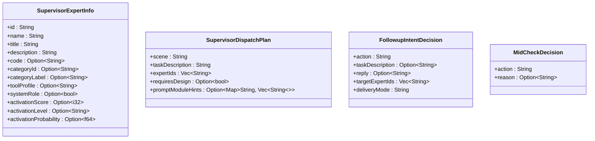

**图表来源**
- [supervisor_engine.rs:30-65](file://src-tauri/src/supervisor_engine.rs#L30-L65)
- [supervisor_engine.rs:47-55](file://src-tauri/src/supervisor_engine.rs#L47-L55)
- [supervisor_engine.rs:80-88](file://src-tauri/src/supervisor_engine.rs#L80-L88)
- [supervisor_engine.rs:101-106](file://src-tauri/src/supervisor_engine.rs#L101-L106)

**章节来源**
- [supervisor_engine.rs:1-982](file://src-tauri/src/supervisor_engine.rs#L1-L982)

### 工作流引擎
- 输入源与变更集：结构化变更、可执行变异路径、交付分析。
- 交付物守卫：设计/实现步骤的交付物真实性与精确性校验。
- 专家回复守卫：职责激活评分、跨职责越责、工作区为空时的引导、近似/非可执行/差异补丁/源码文件遗漏等阻断。
- 动作解析：ACTION标签、结构化JSON、代码块包裹的搜索/替换/内容。

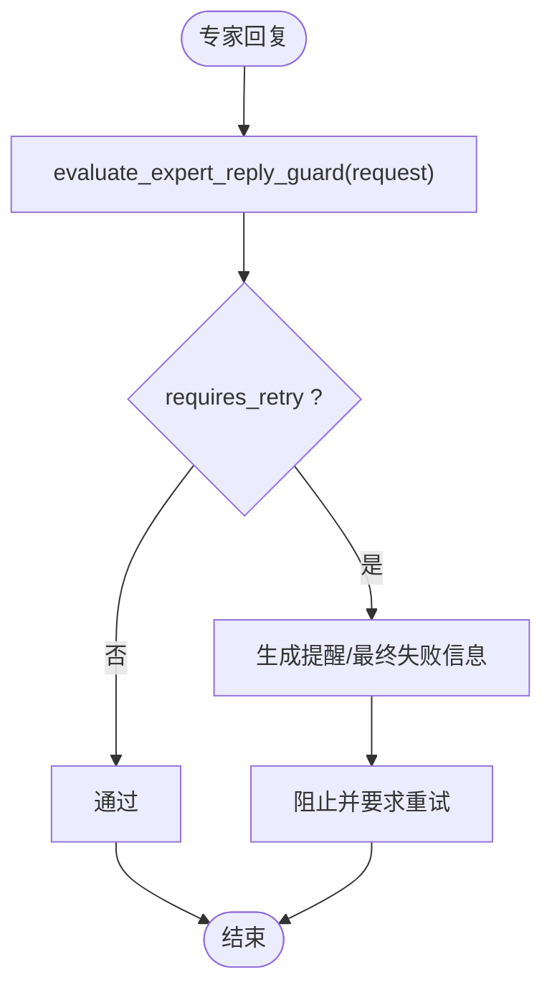

**图表来源**
- [workflow_engine.rs:496-582](file://src-tauri/src/workflow_engine.rs#L496-L582)

**章节来源**
- [workflow_engine.rs:1-1676](file://src-tauri/src/workflow_engine.rs#L1-L1676)

## 依赖关系分析
- 依赖管理：Cargo.toml定义了Tauri、Tokio、SQLx、Reqwest、Serde、Base64、Regex、UUID、Dirs、Scalpel、Calamine、LOPDF、CSV等依赖。
- 运行时：Tokio多线程运行时，支持异步IO、进程与定时器。
- 数据库：SQLx SQLite连接池，应用级共享。
- 插件：FS、Dialog、Opener等Tauri插件。

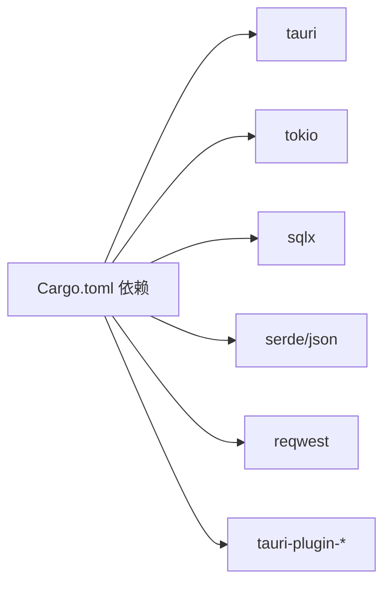

**图表来源**
- [Cargo.toml:20-46](file://src-tauri/Cargo.toml#L20-L46)

**章节来源**
- [Cargo.toml:1-46](file://src-tauri/Cargo.toml#L1-L46)

## 性能考量
- 异步与并发：Tokio运行时与异步IO，Shell执行器并发读取stdout/stderr，Head+Tail缓冲减少内存占用。
- 输出截断：按字节与行数限制，避免大输出导致内存压力。
- 超时控制：可配置超时与可选杀进程，防止长时间阻塞。
- 数据库连接池：应用级共享连接池，减少连接开销。
- 配额与仪表盘：按日/月/年窗口统计，避免无限增长的数据量。

[本节为通用指导，无需特定文件引用]

## 故障排查指南
- Shell执行失败：检查退出码、超时、截断标记；确认工作目录沙箱与路径合法性。
- 工具调用阻断：查看审批状态、权限级别与钩子决策（Skip/Retry）。
- 记忆检索无结果：确认查询文本非空、类型过滤与上限保护；检查关键词提取与停用词过滤。
- 令牌配额告警：检查专家ID、分配限额与时间窗口；查看豁免ID列表。
- 专家回复阻断：根据职责激活评分、工作区为空、近似补丁、差异补丁、源码文件遗漏等守卫规则定位问题。

**章节来源**
- [shell_executor.rs:497-633](file://src-tauri/src/shell_executor.rs#L497-L633)
- [hooks.rs:72-80](file://src-tauri/src/hooks.rs#L72-L80)
- [memory.rs:167-305](file://src-tauri/src/memory.rs#L167-L305)
- [token_runtime_engine.rs:181-267](file://src-tauri/src/token_runtime_engine.rs#L181-L267)
- [workflow_engine.rs:496-582](file://src-tauri/src/workflow_engine.rs#L496-L582)

## 结论
该后端以模块化为核心，通过配置、钩子、黑板、专家会话、工具系统、Shell执行、记忆与令牌配额、主管与工作流引擎形成完整的专家协作闭环。借助Tauri的IPC与安全模型，实现了与前端的稳定交互与本地执行的安全隔离。性能方面通过异步、并发与输出截断得到保障，运维层面提供仪表盘与守卫机制以提升可靠性。

[本节为总结性内容，无需特定文件引用]

## 附录
- 开发环境：安装Rust、Node.js与Tauri CLI，使用package.json脚本启动开发服务器与构建。
- 构建流程：前端构建 -> Tauri打包 -> 生成可执行文件。
- 部署指南：根据目标平台生成安装包，注意图标与安全策略配置。

**章节来源**
- [package.json:6-14](file://package.json#L6-L14)
- [tauri.conf.json:6-11](file://src-tauri/tauri.conf.json#L6-L11)