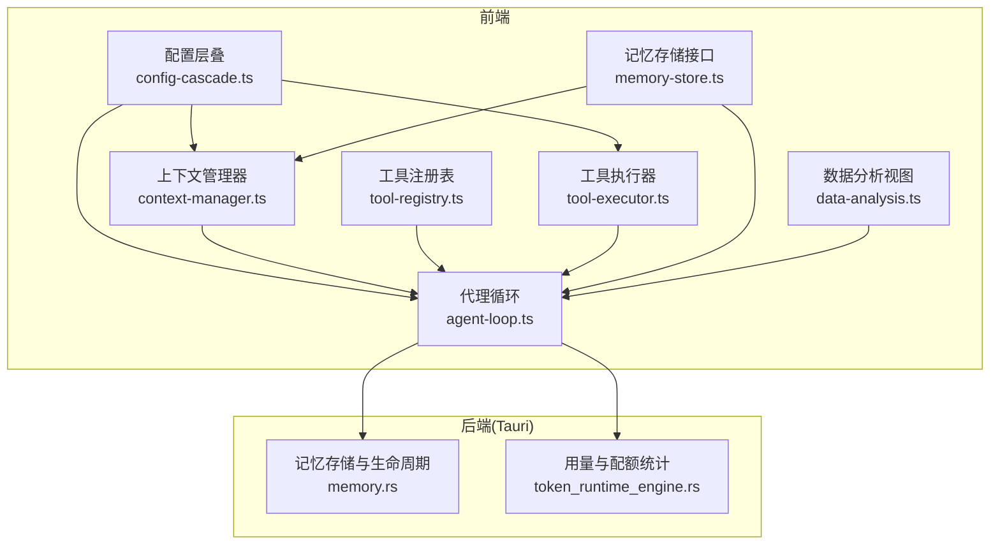
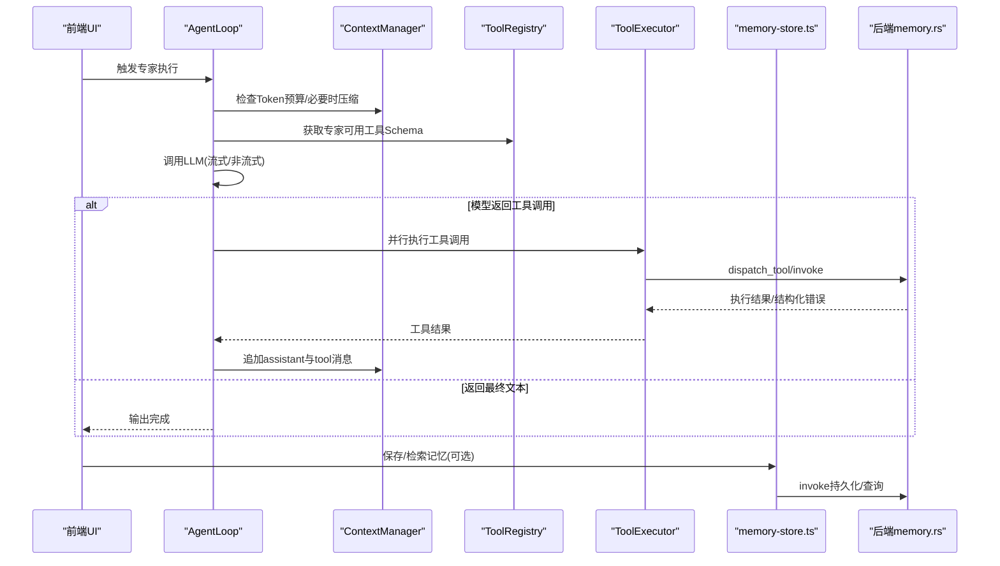
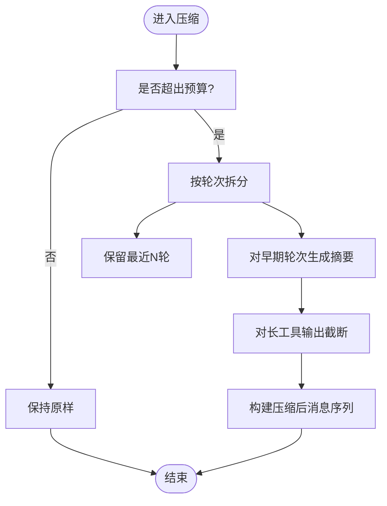
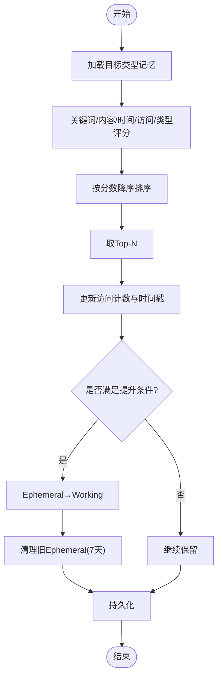
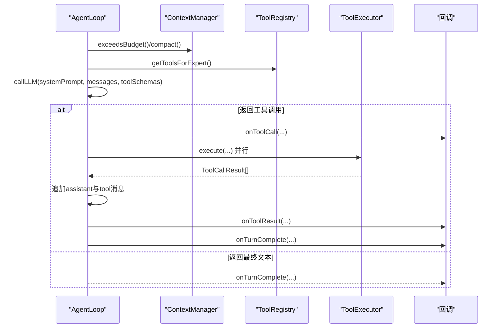
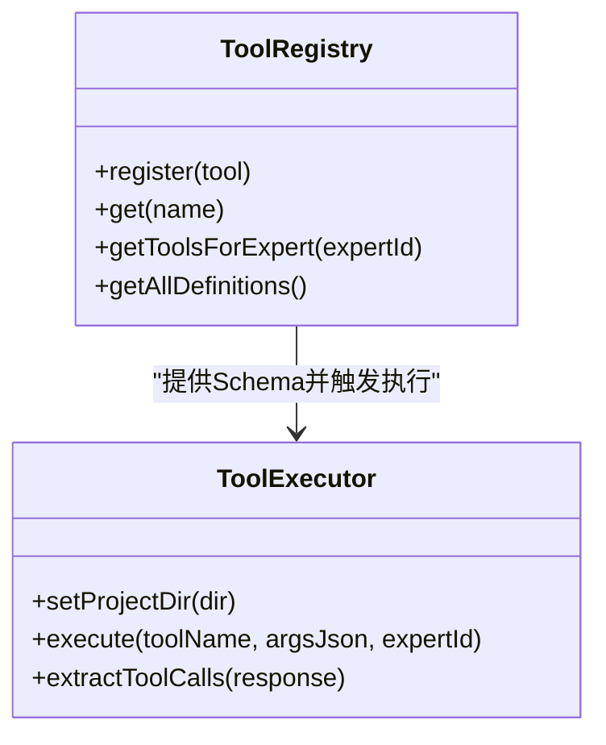
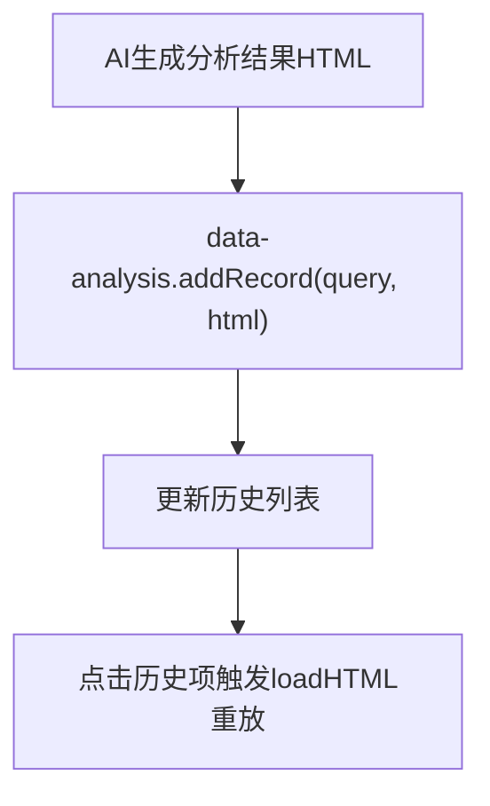
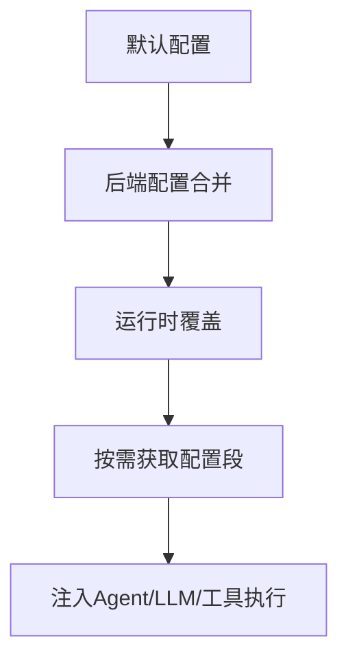
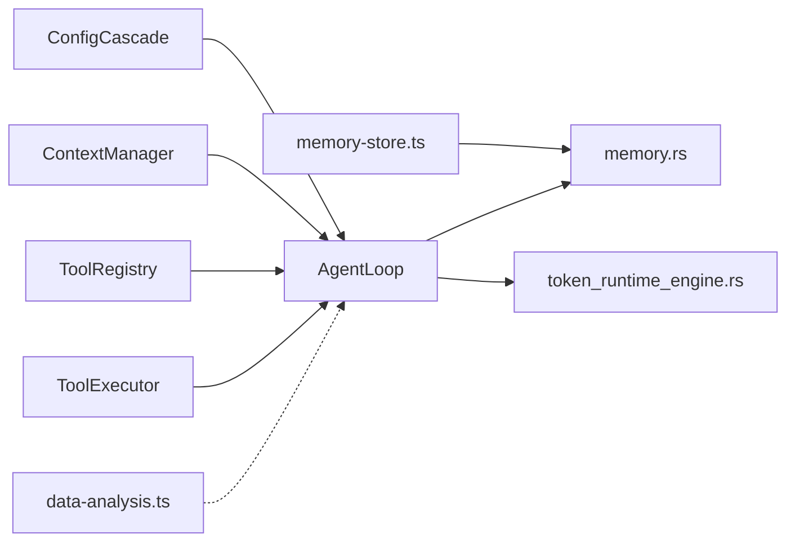

# 数据流管理

<cite>
**本文引用的文件**
- [context-manager.ts](file://src/context-manager.ts)
- [memory-store.ts](file://src/memory-store.ts)
- [agent-loop.ts](file://src/agent-loop.ts)
- [data-analysis.ts](file://src/data-analysis.ts)
- [tool-registry.ts](file://src/tool-registry.ts)
- [tool-executor.ts](file://src/tool-executor.ts)
- [config-cascade.ts](file://src/config-cascade.ts)
- [memory.rs](file://src-tauri/src/memory.rs)
- [token_runtime_engine.rs](file://src-tauri/src/token_runtime_engine.rs)
</cite>

## 目录
1. [简介](#简介)
2. [项目结构](#项目结构)
3. [核心组件](#核心组件)
4. [架构总览](#架构总览)
5. [详细组件分析](#详细组件分析)
6. [依赖关系分析](#依赖关系分析)
7. [性能考量](#性能考量)
8. [故障排查指南](#故障排查指南)
9. [结论](#结论)
10. [附录](#附录)

## 简介
本文件面向AI专家工作台的数据流管理，系统性阐述数据在前端与后端之间的流转机制，涵盖上下文管理器的数据生命周期、内存存储的缓存策略与生命周期、代理循环的数据处理流程、数据分析模块的可视化与记录机制，以及数据持久化、缓存失效、一致性与并发控制、事务处理、监控与性能分析等主题。文档同时提供可视化图示与实操建议，帮助开发者与使用者理解并优化数据流。

## 项目结构
前端采用TypeScript模块化组织，围绕“配置层叠”“上下文管理”“工具注册与执行”“代理循环”“内存存储接口”“数据分析视图”六大主线展开；后端以Tauri桥接，提供记忆存储、生命周期管理、配额与用量统计等能力。

图表来源
- [config-cascade.ts:108-239](file://src/config-cascade.ts#L108-L239)
- [context-manager.ts:37-276](file://src/context-manager.ts#L37-L276)
- [tool-registry.ts:20-192](file://src/tool-registry.ts#L20-L192)
- [tool-executor.ts:13-231](file://src/tool-executor.ts#L13-L231)
- [agent-loop.ts:47-404](file://src/agent-loop.ts#L47-L404)
- [memory-store.ts:40-337](file://src/memory-store.ts#L40-L337)
- [data-analysis.ts:12-138](file://src/data-analysis.ts#L12-L138)
- [memory.rs:92-343](file://src-tauri/src/memory.rs#L92-L343)
- [token_runtime_engine.rs:193-566](file://src-tauri/src/token_runtime_engine.rs#L193-L566)

章节来源
- [config-cascade.ts:108-239](file://src/config-cascade.ts#L108-L239)
- [context-manager.ts:37-276](file://src/context-manager.ts#L37-L276)
- [tool-registry.ts:20-192](file://src/tool-registry.ts#L20-L192)
- [tool-executor.ts:13-231](file://src/tool-executor.ts#L13-L231)
- [agent-loop.ts:47-404](file://src/agent-loop.ts#L47-L404)
- [memory-store.ts:40-337](file://src/memory-store.ts#L40-L337)
- [data-analysis.ts:12-138](file://src/data-analysis.ts#L12-L138)
- [memory.rs:92-343](file://src-tauri/src/memory.rs#L92-L343)
- [token_runtime_engine.rs:193-566](file://src-tauri/src/token_runtime_engine.rs#L193-L566)

## 核心组件
- 配置层叠(ConfigCascade)：提供“内置默认→用户全局→项目级→运行时覆盖”的四层合并机制，贯穿LLM、Shell、审批、Agent、Pipeline、UI等配置域。
- 上下文管理器(ContextManager)：负责消息与片段的Token预算估算、压缩与构建，保障对话上下文在预算内高效传递。
- 工具注册与执行：工具Schema注入、权限控制、前后端桥接与错误结构化反馈。
- 代理循环(AgentLoop)：驱动一次专家交互的多轮对话，集成LLM调用、工具并行执行、死循环检测、超时控制与压缩回调。
- 内存存储接口(memory-store.ts)：前端记忆API（保存、检索、删除、生命周期、统计），并提供Token感知检索增强。
- 后端记忆与生命周期(memory.rs)：Ephemeral/Working/Longterm三类记忆的持久化、评分与提升/凝练规则、访问计数与时间衰减。
- 数据分析视图(data-analysis.ts)：嵌入式iframe承载分析结果，维护历史记录与切换逻辑。
- 用量与配额(token_runtime_engine.rs)：按专家维度统计Token使用趋势、专家分布与配额校验。

章节来源
- [config-cascade.ts:108-239](file://src/config-cascade.ts#L108-L239)
- [context-manager.ts:37-276](file://src/context-manager.ts#L37-L276)
- [tool-registry.ts:20-192](file://src/tool-registry.ts#L20-L192)
- [tool-executor.ts:13-231](file://src/tool-executor.ts#L13-L231)
- [agent-loop.ts:47-404](file://src/agent-loop.ts#L47-L404)
- [memory-store.ts:40-337](file://src/memory-store.ts#L40-L337)
- [memory.rs:92-343](file://src-tauri/src/memory.rs#L92-L343)
- [data-analysis.ts:12-138](file://src/data-analysis.ts#L12-L138)
- [token_runtime_engine.rs:193-566](file://src-tauri/src/token_runtime_engine.rs#L193-L566)

## 架构总览
数据流自上而下分为三层：
- 配置层：统一注入LLM与执行参数，决定Agent循环行为与工具权限。
- 执行层：AgentLoop协调上下文、LLM与工具，形成“消息→工具调用→工具结果→消息”的闭环。
- 存储层：memory-store.ts通过invoke桥接到后端，后端实现记忆持久化、生命周期管理与统计。

图表来源
- [agent-loop.ts:76-211](file://src/agent-loop.ts#L76-L211)
- [context-manager.ts:101-156](file://src/context-manager.ts#L101-L156)
- [tool-registry.ts:155-174](file://src/tool-registry.ts#L155-L174)
- [tool-executor.ts:24-53](file://src/tool-executor.ts#L24-L53)
- [memory-store.ts:40-100](file://src/memory-store.ts#L40-L100)
- [memory.rs:92-113](file://src-tauri/src/memory.rs#L92-L113)

## 详细组件分析

### 上下文管理器：数据生命周期与压缩策略
- 生命周期
  - 片段注册(addFragment)：按优先级排序，受maxTokens粗略截断。
  - 构建上下文(buildFragmentsContext)：按预算从高优先级到低优先级拼接。
  - 清空与配置更新：clearFragments/updateConfig。
- 消息压缩(compact)
  - 保留system与最近N轮完整对话。
  - 早期轮次压缩为摘要；工具输出超长时截断；assistant消息要点化。
- Token估算
  - 文本/消息/工具调用的估算策略，结合保留比例与阈值判断是否压缩。

图表来源
- [context-manager.ts:115-156](file://src/context-manager.ts#L115-L156)
- [context-manager.ts:178-203](file://src/context-manager.ts#L178-L203)
- [context-manager.ts:231-244](file://src/context-manager.ts#L231-L244)

章节来源
- [context-manager.ts:37-276](file://src/context-manager.ts#L37-L276)

### 内存存储：缓存策略与生命周期
- 缓存策略
  - 三类记忆：Ephemeral（临时）、Working（工作）、Longterm（长期）。
  - 评分与检索：关键词匹配、内容相似度、时间衰减、访问次数、类型权重综合打分，Top-N返回。
  - Token感知检索：searchMemoryWithBudget根据剩余预算截断结果，避免再次超预算。
- 生命周期
  - Ephemeral→Working：access_count≥2或内容长度≥200时提升。
  - Working→Longterm：access_count≥5且创建时间>14天时凝练。
  - 清理：Ephemeral保留最近7天，总数上限每类500条。
- 前端API
  - 保存/检索/删除/清空/统计/生命周期运行；构建记忆上下文供专家prompt使用。

图表来源
- [memory-store.ts:310-335](file://src/memory-store.ts#L310-L335)
- [memory.rs:278-305](file://src-tauri/src/memory.rs#L278-L305)
- [memory.rs:311-343](file://src-tauri/src/memory.rs#L311-L343)
- [memory.rs:347-370](file://src-tauri/src/memory.rs#L347-L370)

章节来源
- [memory-store.ts:40-337](file://src/memory-store.ts#L40-L337)
- [memory.rs:92-343](file://src-tauri/src/memory.rs#L92-L343)

### 代理循环：数据处理与事件传播
- 关键流程
  - 超时控制：AbortController+setTimeout，防止长时间占用。
  - Token预算检查与压缩回调：onCompact。
  - 工具调用：并行执行，记录历史，注入assistant与tool消息。
  - 死循环检测：最近N次调用签名相同则注入提示终止。
  - LLM调用：支持流式监听与非流式阻塞。
- 事件传播
  - onToken/onToolCall/onToolResult/onTurnComplete/onError/onCompact等回调，便于UI与监控层感知。

图表来源
- [agent-loop.ts:76-211](file://src/agent-loop.ts#L76-L211)
- [agent-loop.ts:223-268](file://src/agent-loop.ts#L223-L268)
- [agent-loop.ts:273-331](file://src/agent-loop.ts#L273-L331)

章节来源
- [agent-loop.ts:47-404](file://src/agent-loop.ts#L47-L404)

### 工具注册与执行：权限与错误结构化
- 工具注册：内置工具Schema（shell_exec、file_read、file_write、file_patch、file_list、web_search、memory_query、index_search），并按专家映射权限。
- 执行桥接：dispatch_tool调用后端实现，file_patch失败时构造结构化错误反馈，指导模型修正补丁。
- 双轨解析：优先function calling，兼容ACTION标记格式，向后兼容。

图表来源
- [tool-registry.ts:20-192](file://src/tool-registry.ts#L20-L192)
- [tool-executor.ts:13-231](file://src/tool-executor.ts#L13-L231)

章节来源
- [tool-registry.ts:20-192](file://src/tool-registry.ts#L20-L192)
- [tool-executor.ts:13-231](file://src/tool-executor.ts#L13-L231)

### 数据分析模块：聚合、统计与洞察生成
- 视图职责：嵌入式iframe承载HTML分析结果，维护“数据源/历史”两个标签页，支持点击历史重放。
- 记录管理：addRecord维护历史列表，loadHTML动态加载内容。
- 与Agent协同：通过全局暴露的API供Agent在分析完成后注入可视化结果。

图表来源
- [data-analysis.ts:95-126](file://src/data-analysis.ts#L95-L126)

章节来源
- [data-analysis.ts:12-138](file://src/data-analysis.ts#L12-L138)

### 配置层叠：状态同步与参数下发
- 合并策略：默认配置与后端返回的项目级配置深度合并，再叠加运行时覆盖。
- 分段获取：按需获取LLM、Shell、审批、Agent、Pipeline、UI等配置段。
- 持久化：save支持global/project作用域，reset恢复默认。

图表来源
- [config-cascade.ts:120-144](file://src/config-cascade.ts#L120-L144)
- [config-cascade.ts:166-183](file://src/config-cascade.ts#L166-L183)

章节来源
- [config-cascade.ts:108-239](file://src/config-cascade.ts#L108-L239)

## 依赖关系分析
- 前端耦合
  - AgentLoop依赖ConfigCascade、ContextManager、ToolRegistry、ToolExecutor。
  - memory-store.ts依赖Tauri invoke与后端memory.rs。
  - data-analysis.ts与AgentLoop解耦，通过全局API交互。
- 后端耦合
  - memory.rs提供保存、加载、搜索、生命周期、统计等原子能力。
  - token_runtime_engine.rs消费usage记录，产出专家分布与趋势。

图表来源
- [agent-loop.ts:58-71](file://src/agent-loop.ts#L58-L71)
- [memory-store.ts:40-100](file://src/memory-store.ts#L40-L100)
- [memory.rs:92-113](file://src-tauri/src/memory.rs#L92-L113)
- [token_runtime_engine.rs:307-566](file://src-tauri/src/token_runtime_engine.rs#L307-L566)

章节来源
- [agent-loop.ts:58-71](file://src/agent-loop.ts#L58-L71)
- [memory-store.ts:40-100](file://src/memory-store.ts#L40-L100)
- [memory.rs:92-113](file://src-tauri/src/memory.rs#L92-L113)
- [token_runtime_engine.rs:307-566](file://src-tauri/src/token_runtime_engine.rs#L307-L566)

## 性能考量
- Token预算与压缩
  - 通过紧凑阈值与保留比例控制上下文大小，避免LLM输入超限。
  - 早期对话摘要与工具输出截断降低冗余。
- 工具并行执行
  - 并行调用多个工具，缩短端到端时延；对file_patch失败进行结构化反馈，减少无效重试。
- 检索与评分
  - Token感知检索避免超预算；Top-N与时间衰减兼顾时效性与相关性。
- 生命周期与容量控制
  - 每类记忆上限与清理策略，防止无限增长导致IO与内存压力。

[本节为通用性能建议，无需特定文件引用]

## 故障排查指南
- 代理循环超时
  - 现象：finishReason为timeout。
  - 排查：检查expertTimeout配置、工具执行耗时、是否存在死循环。
  - 参考：[agent-loop.ts:90-98](file://src/agent-loop.ts#L90-L98)、[agent-loop.ts:134-152](file://src/agent-loop.ts#L134-L152)
- Token不足
  - 现象：finishReason为token_exhausted。
  - 排查：确认compact阈值与保留轮次设置；检查工具输出是否过大。
  - 参考：[context-manager.ts:101-105](file://src/context-manager.ts#L101-L105)、[context-manager.ts:115-116](file://src/context-manager.ts#L115-L116)
- 工具执行失败
  - 现象：onToolResult携带错误信息。
  - 排查：file_patch结构化错误反馈；检查后端日志与文件路径。
  - 参考：[tool-executor.ts:59-94](file://src/tool-executor.ts#L59-L94)、[tool-executor.ts:300-327](file://src/tool-executor.ts#L300-L327)
- 记忆检索为空或超预算
  - 现象：buildMemoryContext/buildGeneralMemoryContext返回空串。
  - 排查：确认query_text与limit；使用searchMemoryWithBudget按预算检索。
  - 参考：[memory-store.ts:160-186](file://src/memory-store.ts#L160-L186)、[memory-store.ts:189-213](file://src/memory-store.ts#L189-L213)、[memory-store.ts:310-335](file://src/memory-store.ts#L310-L335)
- 配额与用量异常
  - 现象：专家Token使用过高或配额告急。
  - 排查：查看token_runtime_engine.rs统计与趋势，核对专家分配与周期起点。
  - 参考：[token_runtime_engine.rs:193-500](file://src-tauri/src/token_runtime_engine.rs#L193-L500)

章节来源
- [agent-loop.ts:90-98](file://src/agent-loop.ts#L90-L98)
- [agent-loop.ts:134-152](file://src/agent-loop.ts#L134-L152)
- [context-manager.ts:101-105](file://src/context-manager.ts#L101-L105)
- [context-manager.ts:115-116](file://src/context-manager.ts#L115-L116)
- [tool-executor.ts:59-94](file://src/tool-executor.ts#L59-L94)
- [tool-executor.ts:300-327](file://src/tool-executor.ts#L300-L327)
- [memory-store.ts:160-186](file://src/memory-store.ts#L160-L186)
- [memory-store.ts:189-213](file://src/memory-store.ts#L189-L213)
- [memory-store.ts:310-335](file://src/memory-store.ts#L310-L335)
- [token_runtime_engine.rs:193-500](file://src-tauri/src/token_runtime_engine.rs#L193-L500)

## 结论
本系统通过“配置层叠→上下文管理→代理循环→工具执行→记忆存储→后端生命周期”的完整链路，实现了可控、可观测、可扩展的数据流管理。前端以回调与事件驱动状态同步，后端以评分与生命周期保障知识沉淀与质量。配合Token感知检索与并行工具执行，系统在性能与稳定性之间取得平衡。建议在生产环境中持续监控Token使用趋势与工具执行时延，并定期审视记忆生命周期策略以优化成本与效果。

[本节为总结性内容，无需特定文件引用]

## 附录
- 数据一致性与并发控制
  - 记忆保存采用id唯一性与追加/更新策略，上限保护与时间戳更新确保一致性。
  - 并发访问通过Tauri invoke串行化后端操作，避免竞态。
- 事务处理
  - 记忆保存与生命周期提升/凝练在单次invoke内完成，失败回滚至前一状态。
- 监控与性能分析
  - 使用token_runtime_engine.rs生成专家Token分布与趋势，结合AgentLoop回调统计turn数与工具耗时。

章节来源
- [memory.rs:92-113](file://src-tauri/src/memory.rs#L92-L113)
- [memory.rs:311-343](file://src-tauri/src/memory.rs#L311-L343)
- [token_runtime_engine.rs:307-566](file://src-tauri/src/token_runtime_engine.rs#L307-L566)