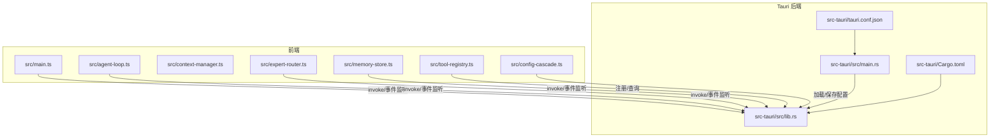
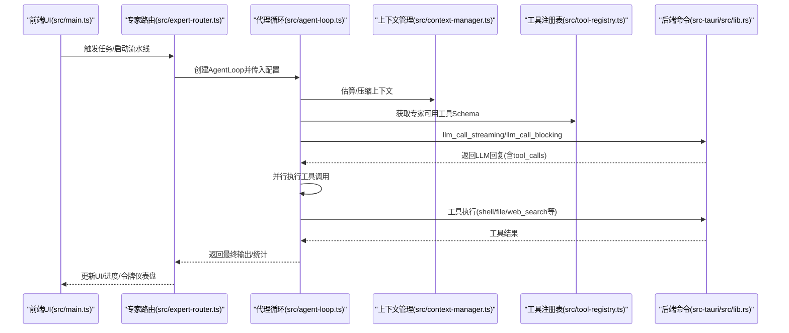
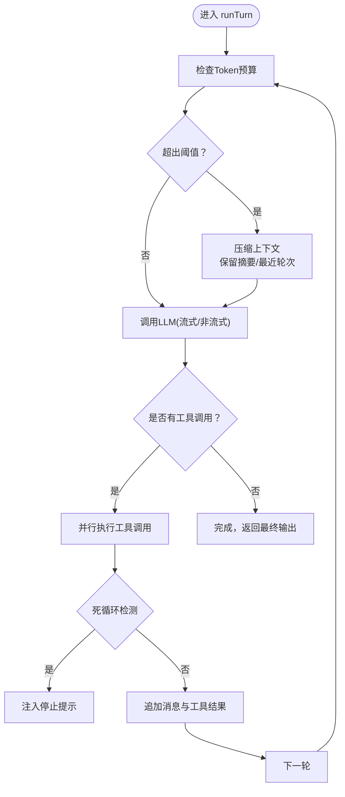
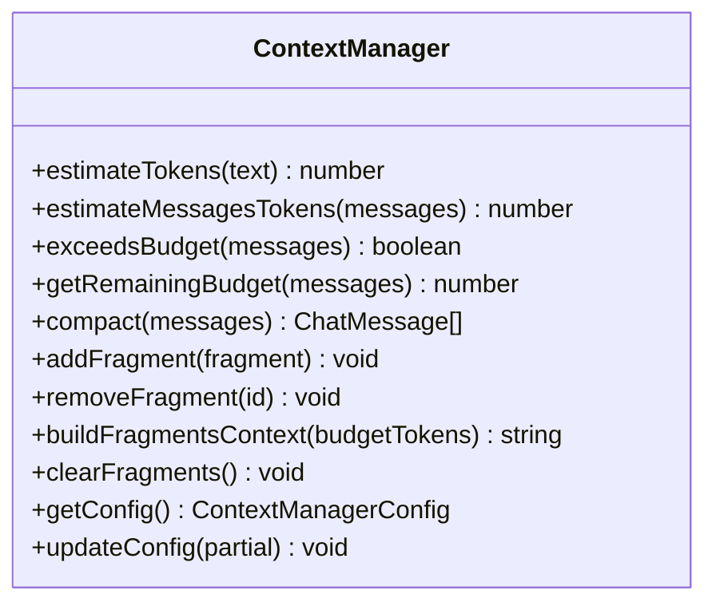
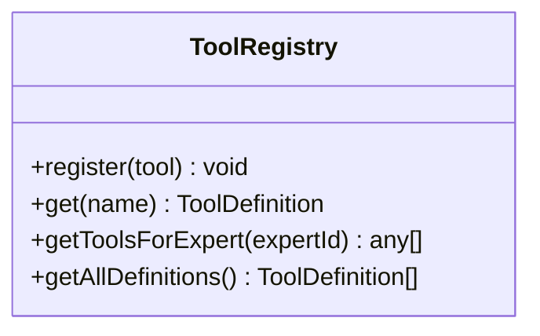
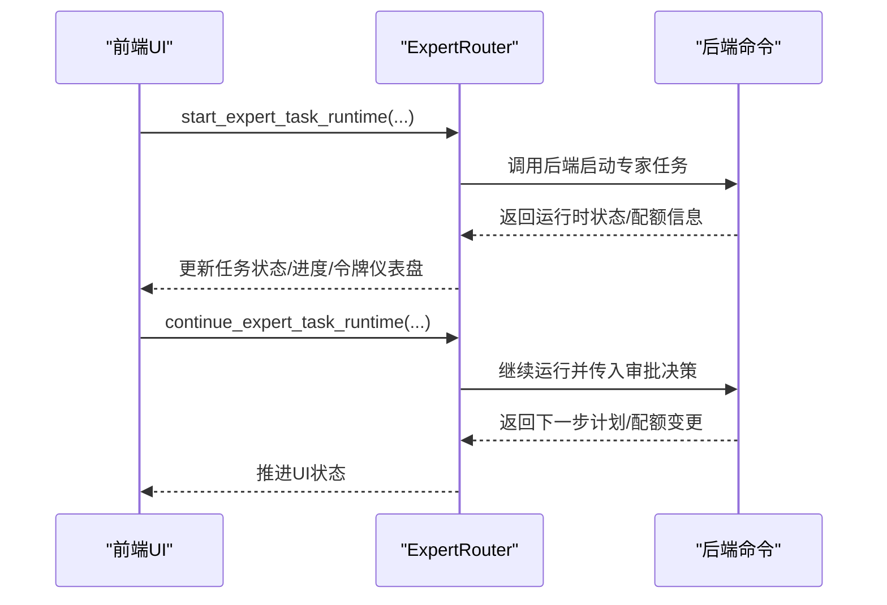
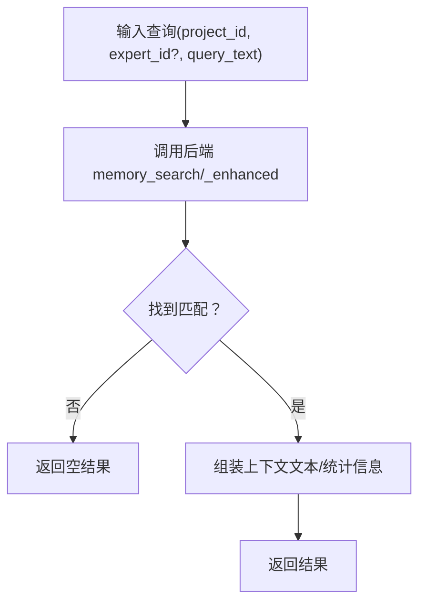
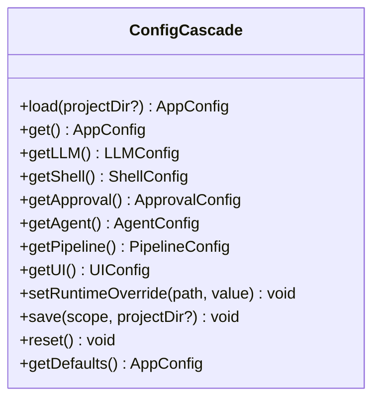
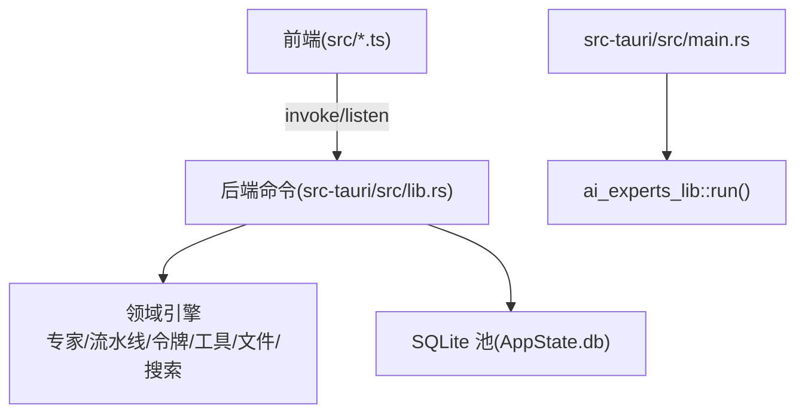
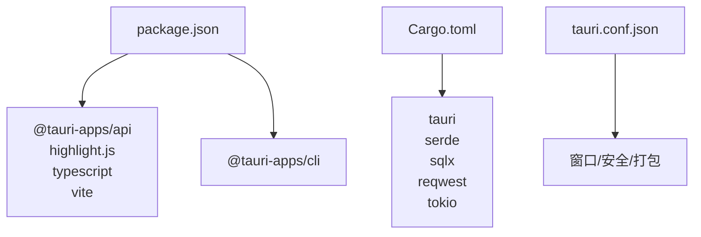

# 核心架构

<cite>
**本文档引用的文件**
- [package.json](file://package.json)
- [vite.config.ts](file://vite.config.ts)
- [tsconfig.json](file://tsconfig.json)
- [src/main.ts](file://src/main.ts)
- [src/agent-loop.ts](file://src/agent-loop.ts)
- [src/context-manager.ts](file://src/context-manager.ts)
- [src/memory-store.ts](file://src/memory-store.ts)
- [src/expert-router.ts](file://src/expert-router.ts)
- [src/tool-registry.ts](file://src/tool-registry.ts)
- [src/config-cascade.ts](file://src/config-cascade.ts)
- [src-tauri/Cargo.toml](file://src-tauri/Cargo.toml)
- [src-tauri/tauri.conf.json](file://src-tauri/tauri.conf.json)
- [src-tauri/src/lib.rs](file://src-tauri/src/lib.rs)
- [src-tauri/src/main.rs](file://src-tauri/src/main.rs)
</cite>

## 目录
1. [简介](#简介)
2. [项目结构](#项目结构)
3. [核心组件](#核心组件)
4. [架构总览](#架构总览)
5. [详细组件分析](#详细组件分析)
6. [依赖分析](#依赖分析)
7. [性能考量](#性能考量)
8. [故障排查指南](#故障排查指南)
9. [结论](#结论)
10. [附录](#附录)

## 简介
本项目是一个基于 Tauri 的桌面应用，面向“AI 专家工作台”，通过前端 TypeScript/Vue 生态与 Rust 后端协同，提供专家调度、上下文管理、工具执行、记忆检索与流水线推进等能力。系统采用前后端分层架构：前端负责 UI、事件与 IPC 通信；后端负责业务引擎、持久化与安全控制。核心交互围绕“代理循环（Agent Loop）—上下文管理（Context Manager）—工具注册表（Tool Registry）—专家路由（Expert Router）—内存存储（Memory Store）”展开。

## 项目结构
项目采用“前端 + Tauri 后端”的双层结构：
- 前端（src/*）：TypeScript/HTML/CSS，负责窗口控制、菜单交互、IPC 调用、主题切换、密钥池管理、画布与聊天 UI 等。
- 后端（src-tauri/*）：Rust crate，暴露 Tauri 命令，承载专家调度、流水线引擎、LLM 调用、工具执行、内存与令牌配额管理、SQLite 持久化等。

图表来源
- [src/main.ts](file://src/main.ts)
- [src/agent-loop.ts](file://src/agent-loop.ts)
- [src/context-manager.ts](file://src/context-manager.ts)
- [src/memory-store.ts](file://src/memory-store.ts)
- [src/expert-router.ts](file://src/expert-router.ts)
- [src/tool-registry.ts](file://src/tool-registry.ts)
- [src/config-cascade.ts](file://src/config-cascade.ts)
- [src-tauri/src/lib.rs](file://src-tauri/src/lib.rs)
- [src-tauri/src/main.rs](file://src-tauri/src/main.rs)
- [src-tauri/Cargo.toml](file://src-tauri/Cargo.toml)
- [src-tauri/tauri.conf.json](file://src-tauri/tauri.conf.json)

章节来源
- [package.json](file://package.json)
- [vite.config.ts](file://vite.config.ts)
- [tsconfig.json](file://tsconfig.json)
- [src-tauri/tauri.conf.json](file://src-tauri/tauri.conf.json)

## 核心组件
- 代理循环（AgentLoop）：封装一次专家交互的完整流程，支持流式/非流式 LLM 调用、工具并行执行、Token 预算压缩、死循环检测与重试策略。
- 上下文管理（ContextManager）：估算与压缩对话上下文，保留关键片段，保障 Token 预算不超支。
- 工具注册表（ToolRegistry）：集中定义工具 Schema 与权限，按专家角色动态注入可用工具。
- 专家路由（ExpertRouter）：负责任务分派、流水线推进、令牌配额与仪表盘快照、运行时状态管理。
- 内存存储（MemoryStore）：提供记忆的保存、检索、清理与生命周期管理，支持 Token 感知检索。
- 配置层叠（ConfigCascade）：内置默认配置 + 用户全局 + 项目级 + 运行时覆盖，统一管理 LLM、Shell、审批、Agent、流水线与 UI 配置。
- Tauri 命令与后端引擎：暴露 IPC 命令，承载专家会话、流水线、令牌、工具执行、文件系统、网络搜索、文档处理等业务逻辑。

章节来源
- [src/agent-loop.ts](file://src/agent-loop.ts)
- [src/context-manager.ts](file://src/context-manager.ts)
- [src/tool-registry.ts](file://src/tool-registry.ts)
- [src/expert-router.ts](file://src/expert-router.ts)
- [src/memory-store.ts](file://src/memory-store.ts)
- [src/config-cascade.ts](file://src/config-cascade.ts)
- [src-tauri/src/lib.rs](file://src-tauri/src/lib.rs)

## 架构总览
系统采用“前端驱动 + 后端命令”的 IPC 模式：
- 前端通过 @tauri-apps/api 的 invoke 与 listen 发起命令与订阅事件。
- 后端在 src-tauri/src/lib.rs 中以 #[tauri::command] 暴露命令，承接前端请求，调用各领域引擎。
- 配置与持久化通过后端统一管理，前端仅负责 UI 与交互。

图表来源
- [src/main.ts](file://src/main.ts)
- [src/expert-router.ts](file://src/expert-router.ts)
- [src/agent-loop.ts](file://src/agent-loop.ts)
- [src/context-manager.ts](file://src/context-manager.ts)
- [src/tool-registry.ts](file://src/tool-registry.ts)
- [src-tauri/src/lib.rs](file://src-tauri/src/lib.rs)

## 详细组件分析

### 代理循环（AgentLoop）
- 职责：单次专家交互的主循环，负责 LLM 调用、工具调度、Token 压缩、死循环检测与超时控制。
- 关键特性：
  - 支持流式/非流式 LLM 调用，通过事件通道传输 token。
  - 并行执行工具调用，记录工具调用历史与耗时。
  - Token 预算超支时自动压缩上下文，保留最近轮次与摘要。
  - 死循环检测：连续 N 次相同工具调用将被拦截并提示模型收敛。
  - 文件补丁失败重试上限，超过阈值提示改用覆盖写入。

图表来源
- [src/agent-loop.ts](file://src/agent-loop.ts)

章节来源
- [src/agent-loop.ts](file://src/agent-loop.ts)

### 上下文管理（ContextManager）
- 职责：估算消息 Token 数、判断预算、压缩上下文、构建 Fragment 上下文。
- 关键特性：
  - 估算策略：中文字符、英文单词、换行与特殊 token 统计。
  - 压缩策略：保留 system 消息、最近 N 轮完整对话、工具输出截断、早期 assistant 消息要点化。
  - Fragment 管理：按优先级与最大 Token 限制构建上下文字符串。

图表来源
- [src/context-manager.ts](file://src/context-manager.ts)

章节来源
- [src/context-manager.ts](file://src/context-manager.ts)

### 工具注册表（ToolRegistry）
- 职责：集中定义工具 Schema（名称、描述、参数、权限），按专家角色动态过滤可用工具。
- 工具类别：shell_exec、file_read、file_write、file_patch、file_list、web_search、memory_query、index_search。
- 权限控制：auto/confirm/block，结合前端审批与后端安全策略。

图表来源
- [src/tool-registry.ts](file://src/tool-registry.ts)

章节来源
- [src/tool-registry.ts](file://src/tool-registry.ts)

### 专家路由（ExpertRouter）
- 职责：任务分派、流水线推进、令牌配额与仪表盘快照、运行时状态管理。
- 关键接口：启动/继续专家任务运行时、构建流水线进度快照、执行回合计划、最终交付结算。
- 令牌管理：支持项目级与用户级 TokenData，提供持久化与加载、配额豁免与阻断提示。

图表来源
- [src/expert-router.ts](file://src/expert-router.ts)
- [src-tauri/src/lib.rs](file://src-tauri/src/lib.rs)

章节来源
- [src/expert-router.ts](file://src/expert-router.ts)

### 内存存储（MemoryStore）
- 职责：记忆的保存、检索、删除、清空、生命周期管理与统计。
- Token 感知检索：根据剩余预算截断返回结果，保证上下文不超限。
- 关键接口：saveMemory、searchMemory、deleteMemory、clearMemoryType、runMemoryLifecycle、getMemoryStats、buildMemoryContext、buildGeneralMemoryContext。

图表来源
- [src/memory-store.ts](file://src/memory-store.ts)
- [src-tauri/src/lib.rs](file://src-tauri/src/lib.rs)

章节来源
- [src/memory-store.ts](file://src/memory-store.ts)

### 配置层叠（ConfigCascade）
- 职责：内置默认配置 + 用户全局 + 项目级 + 运行时覆盖，统一管理 LLM、Shell、审批、Agent、流水线与 UI 配置。
- 关键接口：load、get、getLLM/getShell/getApproval/getAgent/getPipeline/getUI、setRuntimeOverride、save、reset。

图表来源
- [src/config-cascade.ts](file://src/config-cascade.ts)

章节来源
- [src/config-cascade.ts](file://src/config-cascade.ts)

### Tauri 命令与后端引擎
- 命令入口：src-tauri/src/lib.rs 暴露大量 #[tauri::command]，涵盖专家会话、流水线、令牌、工具执行、文件系统、网络搜索、文档处理等。
- 启动入口：src-tauri/src/main.rs 调用 ai_experts_lib::run()。
- 配置与打包：Cargo.toml 定义依赖与构建产物；tauri.conf.json 定义窗口、安全策略与打包图标。

图表来源
- [src-tauri/src/lib.rs](file://src-tauri/src/lib.rs)
- [src-tauri/src/main.rs](file://src-tauri/src/main.rs)
- [src-tauri/Cargo.toml](file://src-tauri/Cargo.toml)
- [src-tauri/tauri.conf.json](file://src-tauri/tauri.conf.json)

章节来源
- [src-tauri/src/lib.rs](file://src-tauri/src/lib.rs)
- [src-tauri/src/main.rs](file://src-tauri/src/main.rs)
- [src-tauri/Cargo.toml](file://src-tauri/Cargo.toml)
- [src-tauri/tauri.conf.json](file://src-tauri/tauri.conf.json)

## 依赖分析
- 前端依赖：@tauri-apps/api、@tauri-apps/cli、highlight.js、typescript、vite。
- 后端依赖：tauri、serde、serde_json、sqlx(sqlite)、reqwest、tokio、futures-util、tauri-plugin-*、dirs、regex、scraper、calamine、docx-rs、lopdf、csv、async-trait、uuid、chrono、base64、dunce、rand、mime_guess、once_cell。
- 构建与脚本：Vite 开发服务器、TypeScript 编译、Tauri CLI、提示词检查脚本。

图表来源
- [package.json](file://package.json)
- [src-tauri/Cargo.toml](file://src-tauri/Cargo.toml)
- [src-tauri/tauri.conf.json](file://src-tauri/tauri.conf.json)

章节来源
- [package.json](file://package.json)
- [src-tauri/Cargo.toml](file://src-tauri/Cargo.toml)
- [src-tauri/tauri.conf.json](file://src-tauri/tauri.conf.json)

## 性能考量
- Token 预算与压缩：通过 ContextManager 的估算与压缩策略，避免上下文超限导致的调用失败与延迟。
- 工具并行执行：AgentLoop 对工具调用采用并行执行，缩短整体时延，同时记录耗时便于优化。
- 流式输出：LLM 流式调用降低首屏延迟，提升交互体验。
- SQLite 连接池：后端使用 sqlx 的 SQLite 连接池，减少 IO 抖动，提高并发访问稳定性。
- 配置层叠：统一配置管理，避免重复计算与冗余初始化。

## 故障排查指南
- IPC 调用失败：检查前端 invoke 调用与后端 #[tauri::command] 是否匹配，确认命令名与参数结构一致。
- 令牌配额阻断：查看 ExpertRouter 的配额阻断提示与 UI 展示，必要时调整专家配额或清理历史用量。
- 工具执行异常：关注 AgentLoop 的工具调用历史记录与错误输出，结合后端日志定位具体失败原因。
- 上下文超限：增大 Token 预算或优化 Prompt，利用 ContextManager 的压缩策略减少冗余信息。
- 记忆检索异常：确认项目名与查询参数，检查后端 memory_search/_enhanced 的返回与 Token 截断逻辑。

章节来源
- [src/expert-router.ts](file://src/expert-router.ts)
- [src/agent-loop.ts](file://src/agent-loop.ts)
- [src/context-manager.ts](file://src/context-manager.ts)
- [src/memory-store.ts](file://src/memory-store.ts)

## 结论
本系统通过“前端驱动 + 后端命令”的架构，实现了专家调度、上下文管理、工具执行与记忆检索的有机整合。前端负责交互与 IPC，后端承载复杂业务与持久化，二者通过清晰的命令契约协作。系统具备良好的可扩展性与可维护性，适合在桌面环境中提供强大的 AI 专家工作能力。

## 附录
- 基础设施需求
  - 桌面操作系统：Windows/macOS/Linux（Tauri 支持平台）。
  - 运行时：Node.js（Vite 开发）、Rust 工具链（Tauri CLI）。
  - 存储：SQLite（本地持久化），支持项目级与用户级配置与记忆。
- 可扩展性考虑
  - 新增专家：通过专家目录与工具映射扩展，无需修改前端 UI。
  - 新增工具：在 ToolRegistry 注册新工具 Schema，按专家权限开放。
  - 新增引擎：在 src-tauri/src/lib.rs 中新增 #[tauri::command]，前后端对接即可。
- 部署拓扑
  - 单机桌面应用，打包为多平台可执行文件，包含前端资源与后端二进制。
- 安全性、监控与灾难恢复
  - 安全性：工具执行权限控制（auto/confirm/block），命令授权与审批缓存。
  - 监控：令牌使用统计与仪表盘快照，工具调用事件汇总。
  - 灾难恢复：配置与记忆持久化，令牌数据可恢复，工作区预检与空目录检测辅助恢复。