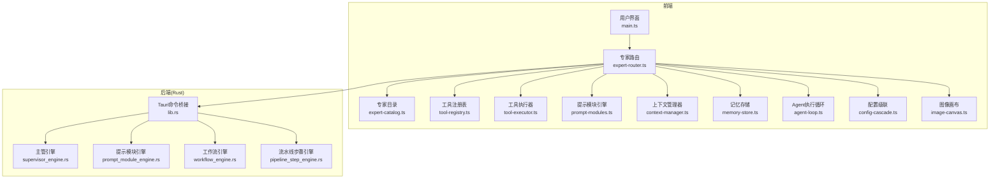
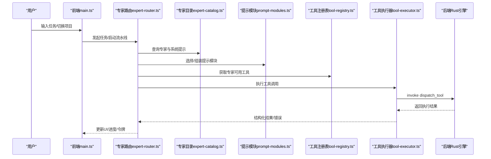
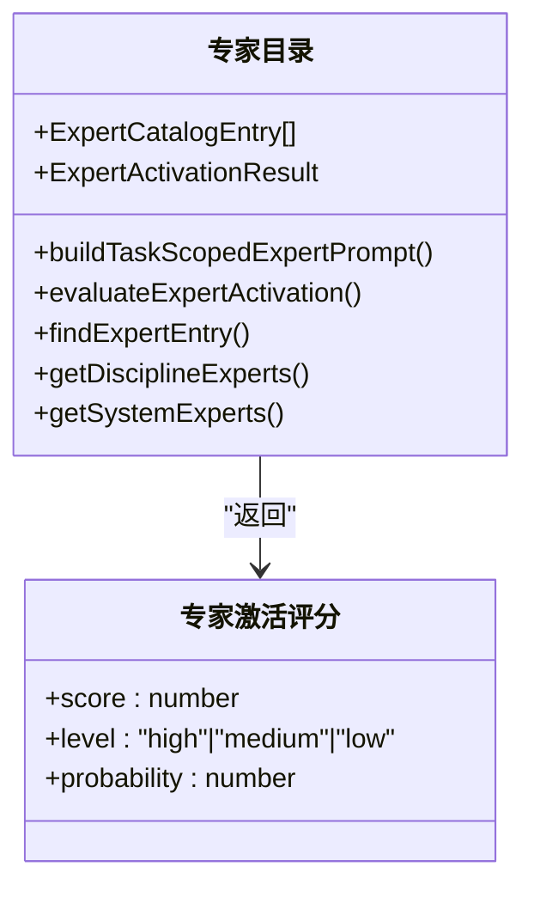
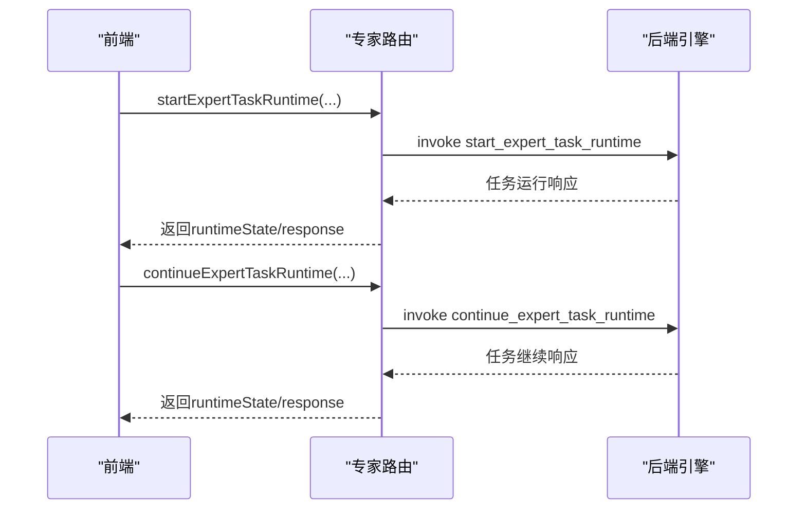
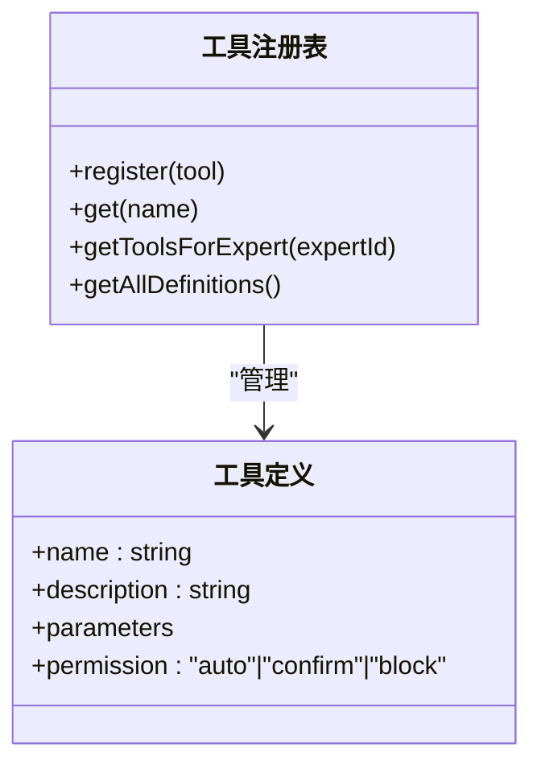
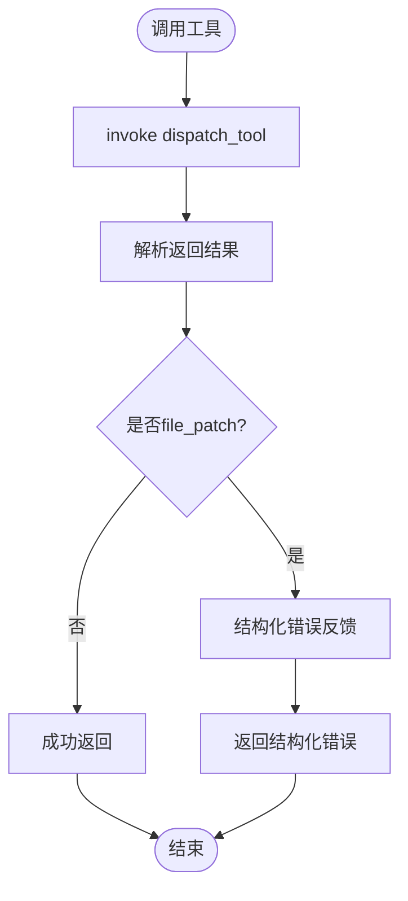
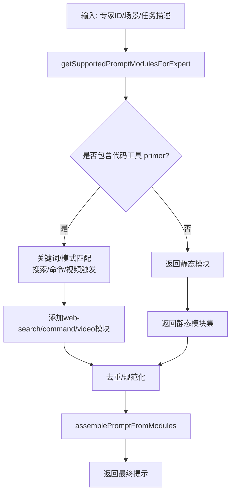
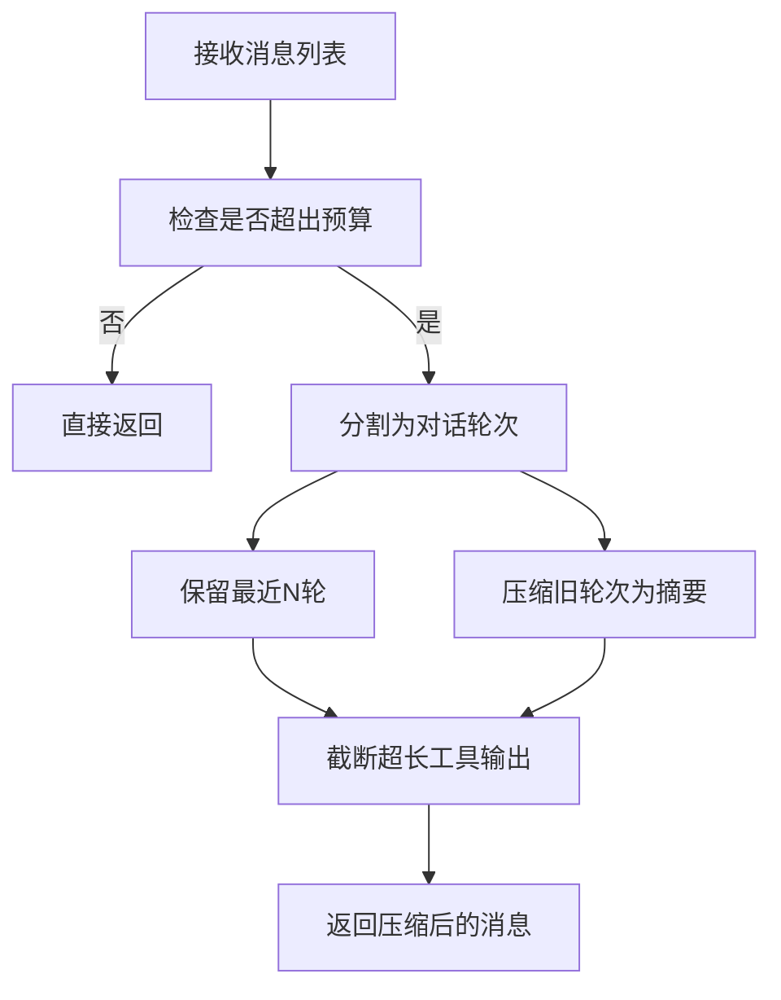
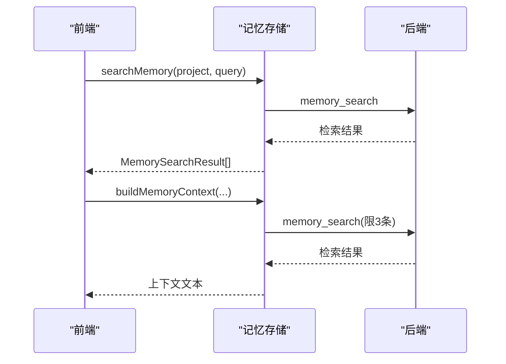
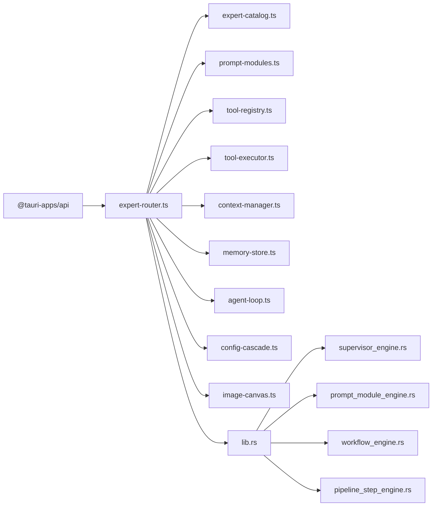

# 组件交互

<cite>
**本文档引用的文件**
- [expert-catalog.ts](file://src/expert-catalog.ts)
- [expert-router.ts](file://src/expert-router.ts)
- [tool-executor.ts](file://src/tool-executor.ts)
- [tool-registry.ts](file://src/tool-registry.ts)
- [prompt-modules.ts](file://src/prompt-modules.ts)
- [context-manager.ts](file://src/context-manager.ts)
- [memory-store.ts](file://src/memory-store.ts)
- [main.ts](file://src/main.ts)
- [agent-loop.ts](file://src/agent-loop.ts)
- [config-cascade.ts](file://src/config-cascade.ts)
- [image-canvas.ts](file://src/image-canvas.ts)
- [supervisor_engine.rs](file://src-tauri/src/supervisor_engine.rs)
- [prompt_module_engine.rs](file://src-tauri/src/prompt_module_engine.rs)
- [workflow_engine.rs](file://src-tauri/src/workflow_engine.rs)
- [pipeline_step_engine.rs](file://src-tauri/src/pipeline_step_engine.rs)
- [lib.rs](file://src-tauri/src/lib.rs)
- [Cargo.lock](file://src-tauri/Cargo.lock)
- [package.json](file://package.json)
- [tsconfig.json](file://tsconfig.json)
</cite>

## 目录
1. [简介](#简介)
2. [项目结构](#项目结构)
3. [核心组件](#核心组件)
4. [架构总览](#架构总览)
5. [详细组件分析](#详细组件分析)
6. [依赖分析](#依赖分析)
7. [性能考量](#性能考量)
8. [故障排查指南](#故障排查指南)
9. [结论](#结论)
10. [附录](#附录)

## 简介
本文件面向AI专家工作台的组件交互，系统性阐述专家目录、路由管理与工具执行器之间的协作模式，涵盖组件注册机制、依赖注入与生命周期管理、消息传递与事件驱动架构、回调机制、职责分离与接口定义、扩展点设计、测试策略与模拟环境、集成测试方法、开发指南与最佳实践，以及热插拔、动态加载与版本兼容性处理。

## 项目结构
前端采用TypeScript + Tauri架构，后端以Rust实现核心引擎与工作流。前端通过Tauri命令桥接到后端，形成前后端协同的专家工作台。

**图表来源**
- [main.ts:1-120](file://src/main.ts#L1-L120)
- [expert-router.ts:1-120](file://src/expert-router.ts#L1-L120)
- [expert-catalog.ts:1-120](file://src/expert-catalog.ts#L1-L120)
- [prompt-modules.ts:1-120](file://src/prompt-modules.ts#L1-L120)
- [tool-registry.ts:1-120](file://src/tool-registry.ts#L1-L120)
- [tool-executor.ts:1-120](file://src/tool-executor.ts#L1-L120)
- [context-manager.ts:1-120](file://src/context-manager.ts#L1-L120)
- [memory-store.ts:1-120](file://src/memory-store.ts#L1-L120)
- [agent-loop.ts:1-120](file://src/agent-loop.ts#L1-L120)
- [config-cascade.ts:1-120](file://src/config-cascade.ts#L1-L120)
- [image-canvas.ts:1-120](file://src/image-canvas.ts#L1-L120)
- [supervisor_engine.rs:1-120](file://src-tauri/src/supervisor_engine.rs#L1-L120)
- [prompt_module_engine.rs:1-120](file://src-tauri/src/prompt_module_engine.rs#L1-L120)
- [workflow_engine.rs:1-120](file://src-tauri/src/workflow_engine.rs#L1-L120)
- [pipeline_step_engine.rs:1-120](file://src-tauri/src/pipeline_step_engine.rs#L1-L120)
- [lib.rs:1-120](file://src-tauri/src/lib.rs#L1-L120)

**章节来源**
- [main.ts:1-265](file://src/main.ts#L1-L265)
- [expert-router.ts:1-120](file://src/expert-router.ts#L1-L120)

## 核心组件
- 专家目录（expert-catalog.ts）：定义专家类型、激活评分、系统专家与学科专家清单、专家专业化摘要、场景默认专家映射、工具权限映射等。
- 专家路由（expert-router.ts）：专家注册、令牌预算与配额、任务状态管理、流水线布局与执行、进度快照、工具事件与授权请求、前后端桥接invoke调用。
- 工具注册表（tool-registry.ts）：工具Schema定义、权限控制、按专家角色过滤可用工具、全局单例。
- 工具执行器（tool-executor.ts）：统一工具调用入口、错误结构化反馈、ACTION标记解析、file_patch专用错误处理。
- 提示模块（prompt-modules.ts）：场景类型与模块ID、模块注入、模块选择与拼接、历史轨迹提取、工具Schema动态注入。
- 上下文管理器（context-manager.ts）：Token预算、自动压缩、Fragment管理、消息转存摘要。
- 记忆存储（memory-store.ts）：记忆条目、检索、清理、生命周期、关键词提取、Token感知检索。
- Agent执行循环（agent-loop.ts）：每专家执行核心引擎、回调钩子、流式输出、死循环检测。
- 配置级联（config-cascade.ts）：全局配置单例、深度合并、运行时覆盖。
- 图像画布（image-canvas.ts）：节点/连线渲染、公共API供ACTION系统调用。
- 后端引擎（Rust）：主管引擎、提示模块引擎、工作流引擎、流水线步骤引擎、Tauri命令桥接。

**章节来源**
- [expert-catalog.ts:1-200](file://src/expert-catalog.ts#L1-L200)
- [expert-router.ts:647-750](file://src/expert-router.ts#L647-L750)
- [tool-registry.ts:1-120](file://src/tool-registry.ts#L1-L120)
- [tool-executor.ts:1-120](file://src/tool-executor.ts#L1-L120)
- [prompt-modules.ts:1-120](file://src/prompt-modules.ts#L1-L120)
- [context-manager.ts:1-120](file://src/context-manager.ts#L1-L120)
- [memory-store.ts:1-120](file://src/memory-store.ts#L1-L120)
- [agent-loop.ts:1-120](file://src/agent-loop.ts#L1-L120)
- [config-cascade.ts:1-120](file://src/config-cascade.ts#L1-L120)
- [image-canvas.ts:1-120](file://src/image-canvas.ts#L1-L120)

## 架构总览
系统采用“前端专家路由 + 后端引擎”的分层架构。前端负责UI、专家目录、工具注册与执行、上下文与记忆管理、Agent循环与配置；后端负责调度、流水线、提示模块、工作流与持久化。

**图表来源**
- [main.ts:1-120](file://src/main.ts#L1-L120)
- [expert-router.ts:506-560](file://src/expert-router.ts#L506-L560)
- [expert-catalog.ts:549-596](file://src/expert-catalog.ts#L549-L596)
- [prompt-modules.ts:428-446](file://src/prompt-modules.ts#L428-L446)
- [tool-registry.ts:155-182](file://src/tool-registry.ts#L155-L182)
- [tool-executor.ts:24-53](file://src/tool-executor.ts#L24-L53)

## 详细组件分析

### 专家目录（expert-catalog.ts）
- 职责：定义专家类型、工具画像、激活评分、系统专家与学科专家清单、场景默认专家映射、专业化摘要、系统提示构建。
- 关键接口：
  - 专家激活评分与概率：evaluateExpertActivation、scoreToActivationProbability
  - 任务作用域提示：buildTaskScopedExpertPrompt
  - 专家查询：findExpertEntry、getDisciplineExperts、getSystemExperts
  - 工具权限映射：buildExpertToolMap（来自注册表）
- 设计要点：职责单一、纯函数化提示构建、可扩展的工具画像与专业化摘要。

**图表来源**
- [expert-catalog.ts:27-696](file://src/expert-catalog.ts#L27-L696)

**章节来源**
- [expert-catalog.ts:1-200](file://src/expert-catalog.ts#L1-L200)
- [expert-catalog.ts:549-696](file://src/expert-catalog.ts#L549-L696)

### 专家路由（expert-router.ts）
- 职责：专家注册、令牌预算与配额、任务状态管理、流水线布局与执行、前后端桥接invoke调用。
- 关键接口：
  - 专家注册：ROUTER_EXPERTS（基于专家目录）
  - 令牌预算：TokenDashboardSnapshot、save/loadTokenData
  - 任务运行：start/continueExpertTaskRuntime
  - 流水线：getCurrentPipelineExecutionRound、settlePipelineExecutionRound
  - 工具事件：ExpertToolEvent、ExpertCommandAuthorizationRequest
- 生命周期：setExpertsRef注入专家引用，构建RouterExpert集合，管理activeExpertTasks与pipeline状态。

**图表来源**
- [expert-router.ts:506-560](file://src/expert-router.ts#L506-L560)
- [expert-router.ts:547-559](file://src/expert-router.ts#L547-L559)

**章节来源**
- [expert-router.ts:1-200](file://src/expert-router.ts#L1-L200)
- [expert-router.ts:506-800](file://src/expert-router.ts#L506-L800)

### 工具注册表（tool-registry.ts）
- 职责：定义工具Schema、权限控制、按专家角色过滤可用工具、全局单例。
- 关键接口：
  - register/get：注册与获取工具定义
  - getToolsForExpert：按专家角色返回OpenAI function calling格式
  - getAllDefinitions：用于prompt注入
- 设计要点：集中式工具定义、权限与专家角色解耦、可扩展Schema。

**图表来源**
- [tool-registry.ts:1-192](file://src/tool-registry.ts#L1-L192)

**章节来源**
- [tool-registry.ts:1-192](file://src/tool-registry.ts#L1-L192)

### 工具执行器（tool-executor.ts）
- 职责：统一工具调用入口、错误结构化反馈、ACTION标记解析、file_patch专用错误处理。
- 关键接口：
  - execute：dispatch_tool invoke
  - extractToolCalls：双轨协议解析（function_calling/ACTION标记）
  - handlePatchResult/buildPatchErrorFromString：file_patch错误结构化
- 设计要点：前后端桥接、错误可诊断、向后兼容ACTION标记。

**图表来源**
- [tool-executor.ts:24-104](file://src/tool-executor.ts#L24-L104)

**章节来源**
- [tool-executor.ts:1-231](file://src/tool-executor.ts#L1-L231)

### 提示模块（prompt-modules.ts）
- 职责：场景类型与模块ID、模块注入、模块选择与拼接、历史轨迹提取、工具Schema动态注入。
- 关键接口：
  - selectPromptModules：基于任务文本与场景选择模块
  - assemblePromptFromModules：拼接基础提示与模块
  - buildExpertPromptPlan：生成专家提示计划
  - extractPromptModuleTracesFromSessions：从历史会话提取轨迹
  - buildToolSchemaModule：动态生成工具Schema模块
- 设计要点：模块化提示、可组合、可回溯、动态注入。

**图表来源**
- [prompt-modules.ts:388-446](file://src/prompt-modules.ts#L388-L446)
- [prompt-modules.ts:423-426](file://src/prompt-modules.ts#L423-L426)

**章节来源**
- [prompt-modules.ts:1-200](file://src/prompt-modules.ts#L1-L200)
- [prompt-modules.ts:388-501](file://src/prompt-modules.ts#L388-L501)
- [prompt-modules.ts:747-775](file://src/prompt-modules.ts#L747-L775)

### 上下文管理器（context-manager.ts）
- 职责：Token预算管理、自动压缩、Fragment管理、消息转存摘要。
- 关键接口：
  - estimateTokens/estimateMessagesTokens：估算Token
  - exceedsBudget/getRemainingBudget：预算检查
  - compact：自动压缩（保留system/最近轮次、压缩工具输出、摘要早期对话）
  - buildFragmentsContext：按优先级构建Fragment上下文
- 设计要点：Fragment优先级、保留最近轮次、工具输出截断。

**图表来源**
- [context-manager.ts:115-156](file://src/context-manager.ts#L115-L156)

**章节来源**
- [context-manager.ts:1-276](file://src/context-manager.ts#L1-L276)

### 记忆存储（memory-store.ts）
- 职责：记忆条目、检索、清理、生命周期、关键词提取、Token感知检索。
- 关键接口：
  - saveMemory/searchMemory/deleteMemory/clearMemoryType/runMemoryLifecycle/getMemoryStats
  - saveExpertMemory/saveUserIntentMemory/buildMemoryContext/buildGeneralMemoryContext
  - searchMemoryWithBudget：Token感知检索
- 设计要点：类型化记忆（ephemeral/working/longterm）、关键词提取、去停用词。

**图表来源**
- [memory-store.ts:50-100](file://src/memory-store.ts#L50-L100)
- [memory-store.ts:159-213](file://src/memory-store.ts#L159-L213)

**章节来源**
- [memory-store.ts:1-337](file://src/memory-store.ts#L1-L337)

### Agent执行循环（agent-loop.ts）
- 职责：每专家执行核心引擎、回调钩子、流式输出、死循环检测、最大轮次限制。
- 关键接口：
  - AgentLoopConfig：maxTurns/tokenBudget/compactThreshold/deadLoopDetection/streamingEnabled/expertTimeout
  - AgentCallbacks：onToken/onToolCall/onToolResult/onTurnComplete/onError/onCompact
  - AgentResult：finalOutput/usage/...
- 设计要点：可配置、可回调、可流式、可超时。

**章节来源**
- [agent-loop.ts:1-120](file://src/agent-loop.ts#L1-L120)

### 配置级联（config-cascade.ts）
- 职责：全局配置单例、深度合并、运行时覆盖、默认配置导出。
- 关键接口：
  - deepMerge：深度合并对象
  - getDefaults/reset：默认配置与重置
- 设计要点：结构化配置、可覆盖、可回滚。

**章节来源**
- [config-cascade.ts:191-238](file://src/config-cascade.ts#L191-L238)

### 图像画布（image-canvas.ts）
- 职责：节点/连线渲染、公共API供ACTION系统调用。
- 关键接口：
  - addNode/connect/removeNode/getState/setSelection
- 设计要点：SVG渲染、节点/连线管理、公共API。

**章节来源**
- [image-canvas.ts:53-196](file://src/image-canvas.ts#L53-L196)

### 后端引擎（Rust）
- 主管引擎（supervisor_engine.rs）：分析跟进意图、中检决策、回退派发计划。
- 提示模块引擎（prompt_module_engine.rs）：专家模块映射、静态/动态模块选择。
- 工作流引擎（workflow_engine.rs）：工作流验证与问题收集。
- 流水线步骤引擎（pipeline_step_engine.rs）：黑板进度推进与阻断。
- Tauri命令桥接（lib.rs）：前端invoke命令实现（前端E2E控制、状态写入等）。

**章节来源**
- [supervisor_engine.rs:67-364](file://src-tauri/src/supervisor_engine.rs#L67-L364)
- [prompt_module_engine.rs:398-416](file://src-tauri/src/prompt_module_engine.rs#L398-L416)
- [workflow_engine.rs:290-320](file://src-tauri/src/workflow_engine.rs#L290-L320)
- [pipeline_step_engine.rs:120-144](file://src-tauri/src/pipeline_step_engine.rs#L120-L144)
- [lib.rs:3168-3205](file://src-tauri/src/lib.rs#L3168-L3205)

## 依赖分析
- 前端依赖：@tauri-apps/api（invoke监听与事件）、highlight.js（代码高亮）、自研模块（expert-catalog、expert-router、tool-registry、tool-executor、prompt-modules、context-manager、memory-store、agent-loop、config-cascade、image-canvas）。
- 后端依赖：Rust生态（serde、tokio、regex、fs等），通过Tauri命令桥接前后端。

**图表来源**
- [main.ts:1-40](file://src/main.ts#L1-L40)
- [expert-router.ts:1-30](file://src/expert-router.ts#L1-L30)
- [lib.rs:1-120](file://src-tauri/src/lib.rs#L1-L120)

**章节来源**
- [package.json:1-200](file://package.json#L1-L200)
- [tsconfig.json:1-23](file://tsconfig.json#L1-L23)
- [Cargo.lock:1227-1240](file://src-tauri/Cargo.lock#L1227-L1240)

## 性能考量
- Token预算与压缩：上下文管理器按阈值触发压缩，保留system与最近轮次，压缩工具输出与早期对话摘要，避免LLM上下文溢出。
- 工具调用批量化：工具执行器统一入口，减少invoke往返次数；ACTION标记解析支持批量工具调用。
- 记忆检索优化：关键词提取与去停用词，Token感知检索避免超预算；记忆生命周期管理定期清理。
- 配置级联：深度合并与运行时覆盖，避免频繁重建对象，提升配置读取性能。
- 后端引擎：流水线与工作流并行推进，阻断与中检机制减少无效轮次。

[本节为通用指导，无需特定文件引用]

## 故障排查指南
- 工具执行错误：检查ToolExecutor.execute返回的success与result，file_patch错误通过handlePatchResult结构化反馈，包含错误、文件、行号、片段与修正建议。
- 令牌配额阻断：displayQuotaBlockMessage在对话区显示阻断原因；检查getExpertTokenRuntimeContext与getSupervisorTokenRuntimeContext。
- 记忆检索异常：searchMemoryWithBudget回退到普通searchMemory，确保前端不阻断后续流程。
- 前端E2E：通过save_frontend_e2e_status与read_frontend_e2e_control实现轮询与状态写入，便于自动化测试与调试。

**章节来源**
- [tool-executor.ts:24-104](file://src/tool-executor.ts#L24-L104)
- [expert-router.ts:86-105](file://src/expert-router.ts#L86-L105)
- [memory-store.ts:310-335](file://src/memory-store.ts#L310-L335)
- [lib.rs:3168-3205](file://src-tauri/src/lib.rs#L3168-L3205)

## 结论
本系统通过“专家目录 + 专家路由 + 工具执行器”的协作，结合提示模块、上下文管理、记忆存储与Agent循环，实现了可扩展、可配置、可监控的专家工作台。前后端通过Tauri命令桥接，既保证了前端交互的灵活性，又利用后端引擎实现高效的任务调度与工作流编排。模块化设计与事件驱动架构使得组件职责清晰、扩展点丰富，适合持续演进与版本兼容。

[本节为总结，无需特定文件引用]

## 附录

### 组件测试策略与模拟环境
- 前端E2E：通过save_frontend_e2e_status与read_frontend_e2e_control实现轮询与状态写入，支持CLI场景执行与验证。
- CLI工作台：runTurnWithValidation支持多次尝试与修复提示，结合validators进行结果验证。
- 后端测试：通过Tauri命令桥接，前端可触发后端状态写入与控制文件读取，便于端到端验证。

**章节来源**
- [lib.rs:3168-3205](file://src-tauri/src/lib.rs#L3168-L3205)
- [main.ts:8858-9044](file://src/main.ts#L8858-L9044)
- [scripts/cli-workbench.mjs:639-684](file://scripts/cli-workbench.mjs#L639-L684)

### 组件开发指南与最佳实践
- 职责分离：专家目录专注专家与提示；路由管理专注任务与令牌；工具注册表专注Schema与权限；执行器专注调用与错误。
- 接口定义：统一invoke签名、标准化错误结构、规范化模块ID与场景类型。
- 扩展点：提示模块可插拔、工具Schema可扩展、上下文Fragment可定制。
- 最佳实践：使用ContextManager控制Token预算，使用MemoryStore进行上下文增强，使用AgentLoop进行可配置的执行循环，使用ConfigCascade进行全局配置管理。

**章节来源**
- [prompt-modules.ts:1-120](file://src/prompt-modules.ts#L1-L120)
- [tool-registry.ts:1-120](file://src/tool-registry.ts#L1-L120)
- [context-manager.ts:1-120](file://src/context-manager.ts#L1-L120)
- [memory-store.ts:1-120](file://src/memory-store.ts#L1-L120)
- [agent-loop.ts:1-120](file://src/agent-loop.ts#L1-L120)
- [config-cascade.ts:1-120](file://src/config-cascade.ts#L1-L120)

### 热插拔、动态加载与版本兼容
- 热插拔：工具注册表支持动态注册与获取；提示模块可按专家角色动态注入；图像画布API供ACTION系统调用。
- 动态加载：前端通过invoke桥接到后端，后端引擎按需加载与执行；提示模块引擎支持静态/动态模块映射。
- 版本兼容：ACTION标记解析向后兼容；工具Schema动态注入；配置级联支持运行时覆盖与回退。

**章节来源**
- [tool-registry.ts:143-192](file://src/tool-registry.ts#L143-L192)
- [prompt-modules.ts:747-775](file://src/prompt-modules.ts#L747-L775)
- [image-canvas.ts:157-196](file://src/image-canvas.ts#L157-L196)
- [prompt_module_engine.rs:398-416](file://src-tauri/src/prompt_module_engine.rs#L398-L416)
- [config-cascade.ts:208-221](file://src/config-cascade.ts#L208-L221)