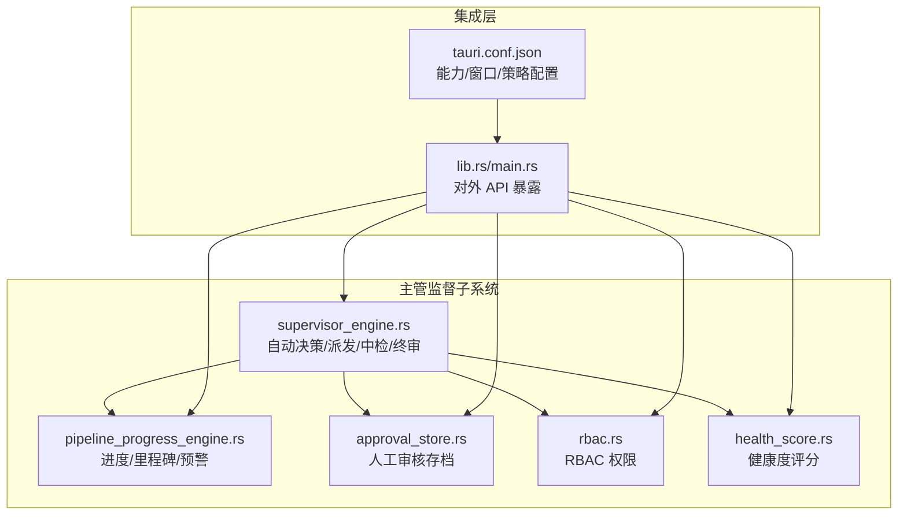
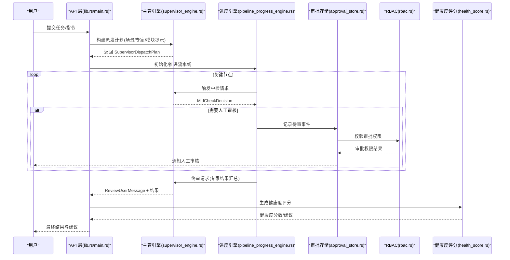
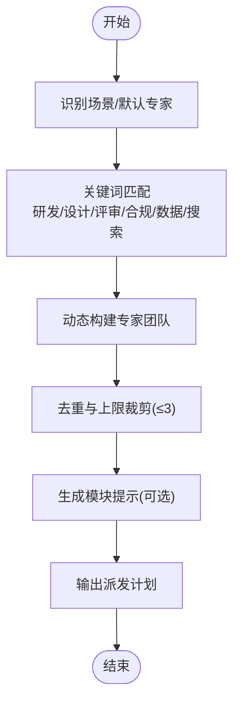
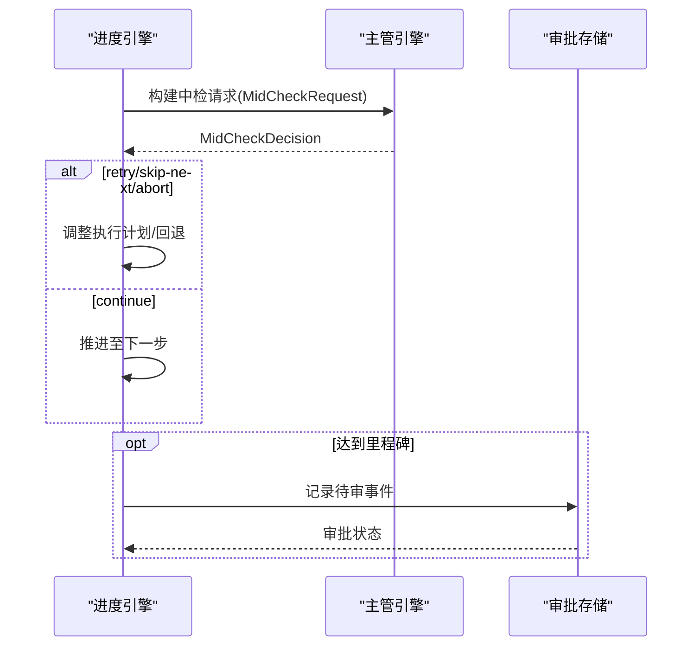
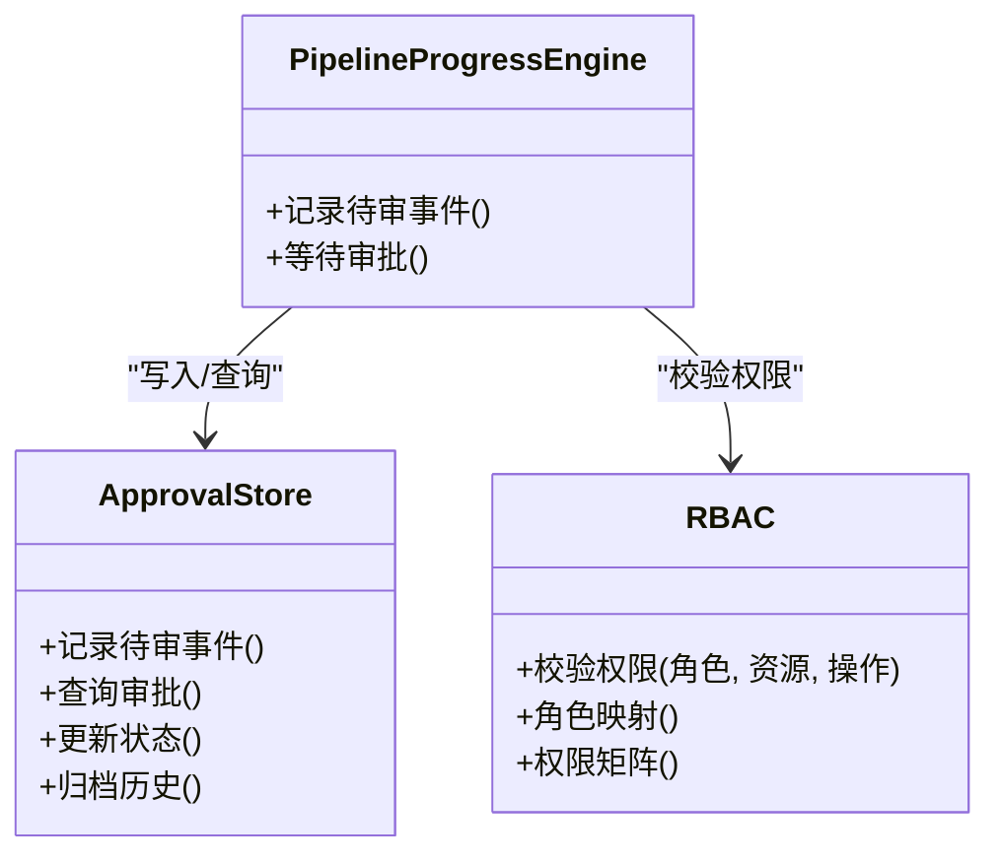
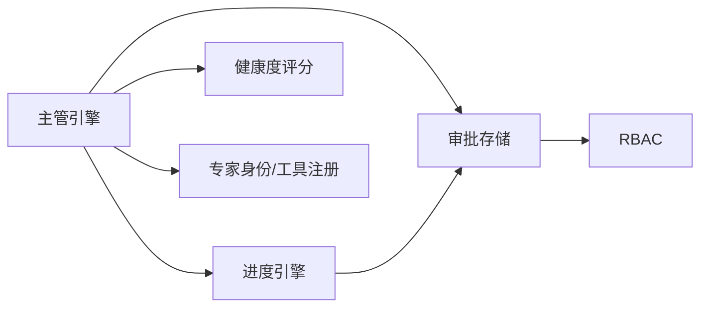

# 主管监督

<cite>
**本文引用的文件**
- [supervisor_engine.rs](file://ai-experts/src-tauri/src/supervisor_engine.rs)
- [pipeline_progress_engine.rs](file://ai-experts/src-tauri/src/pipeline_progress_engine.rs)
- [approval_store.rs](file://ai-experts/src-tauri/src/approval_store.rs)
- [rbac.rs](file://ai-experts/src-tauri/src/rbac.rs)
- [health_score.rs](file://ai-experts/src-tauri/src/health_score.rs)
- [lib.rs](file://ai-experts/src-tauri/src/lib.rs)
- [main.rs](file://ai-experts/src-tauri/src/main.rs)
- [tauri.conf.json](file://ai-experts/src-tauri/tauri.conf.json)
</cite>

## 目录
1. [引言](#引言)
2. [项目结构](#项目结构)
3. [核心组件](#核心组件)
4. [架构总览](#架构总览)
5. [详细组件分析](#详细组件分析)
6. [依赖关系分析](#依赖关系分析)
7. [性能与可扩展性](#性能与可扩展性)
8. [故障排查指南](#故障排查指南)
9. [结论](#结论)
10. [附录](#附录)

## 引言
本文件面向“星图专家团工作台”的主管监督模块，系统化解析其自动决策机制、风险评估与质量保证体系、人工审核触发与权限控制、流水线进度引擎的工作原理，以及配置项、自定义规则与扩展接口。文档以代码为依据，结合可视化图示，帮助开发者在复杂的专家协作环境中实现高效的质量管理与风险控制。

## 项目结构
主管监督模块位于 Rust 后端（Tauri）侧，核心文件包括：
- supervisor_engine.rs：主管自动决策、派发计划、中检与终审提示词构建与解析、意图识别与动作决策
- pipeline_progress_engine.rs：流水线进度跟踪、里程碑管理与异常预警
- approval_store.rs：人工审核与审批状态持久化
- rbac.rs：基于角色的访问控制，支撑审批权限与操作边界
- health_score.rs：健康度评分与质量基线评估
- lib.rs/main.rs：对外暴露 API 与集成入口
- tauri.conf.json：应用配置与能力声明

图表来源
- [supervisor_engine.rs](file://ai-experts/src-tauri/src/supervisor_engine.rs)
- [pipeline_progress_engine.rs](file://ai-experts/src-tauri/src/pipeline_progress_engine.rs)
- [approval_store.rs](file://ai-experts/src-tauri/src/approval_store.rs)
- [rbac.rs](file://ai-experts/src-tauri/src/rbac.rs)
- [health_score.rs](file://ai-experts/src-tauri/src/health_score.rs)
- [lib.rs](file://ai-experts/src-tauri/src/lib.rs)
- [main.rs](file://ai-experts/src-tauri/src/main.rs)
- [tauri.conf.json](file://ai-experts/src-tauri/tauri.conf.json)

章节来源
- [supervisor_engine.rs](file://ai-experts/src-tauri/src/supervisor_engine.rs)
- [pipeline_progress_engine.rs](file://ai-experts/src-tauri/src/pipeline_progress_engine.rs)
- [approval_store.rs](file://ai-experts/src-tauri/src/approval_store.rs)
- [rbac.rs](file://ai-experts/src-tauri/src/rbac.rs)
- [health_score.rs](file://ai-experts/src-tauri/src/health_score.rs)
- [lib.rs](file://ai-experts/src-tauri/src/lib.rs)
- [main.rs](file://ai-experts/src-tauri/src/main.rs)
- [tauri.conf.json](file://ai-experts/src-tauri/tauri.conf.json)

## 核心组件
- 自动决策与派发引擎：根据任务场景、关键词与专家类型动态生成最小必要专家团队，支持快速问答、研发、评审、研究、设计、翻译、写作、办公、数据分析、文档处理、媒体创作、视频生产等场景。
- 中期检查与终审：在关键节点进行质量判定，决定继续、重试、跳过或终止；对最终结果进行事实校验，确保落盘变更与用户表述一致。
- 流水线进度引擎：跟踪执行进度、里程碑达成与异常预警，支持阶段化交付与回溯。
- 人工审核与权限：通过审批存储与 RBAC 控制审批权限，支持多级审批与策略开关。
- 健康度评分：对专家输出与项目状态进行评分，作为质量基线与风险阈值参考。

章节来源
- [supervisor_engine.rs](file://ai-experts/src-tauri/src/supervisor_engine.rs)
- [pipeline_progress_engine.rs](file://ai-experts/src-tauri/src/pipeline_progress_engine.rs)
- [approval_store.rs](file://ai-experts/src-tauri/src/approval_store.rs)
- [rbac.rs](file://ai-experts/src-tauri/src/rbac.rs)
- [health_score.rs](file://ai-experts/src-tauri/src/health_score.rs)

## 架构总览
主管监督模块采用“策略驱动 + 场景化派发 + 质量闭环”的架构。前端输入经由主管引擎解析为标准化的派发计划，随后进入流水线执行；在关键节点进行中检与终审，结合健康度评分与人工审核，形成完整的质量保障链路。

图表来源
- [supervisor_engine.rs](file://ai-experts/src-tauri/src/supervisor_engine.rs)
- [pipeline_progress_engine.rs](file://ai-experts/src-tauri/src/pipeline_progress_engine.rs)
- [approval_store.rs](file://ai-experts/src-tauri/src/approval_store.rs)
- [rbac.rs](file://ai-experts/src-tauri/src/rbac.rs)
- [health_score.rs](file://ai-experts/src-tauri/src/health_score.rs)
- [lib.rs](file://ai-experts/src-tauri/src/lib.rs)
- [main.rs](file://ai-experts/src-tauri/src/main.rs)

## 详细组件分析

### 自动决策与派发引擎（supervisor_engine.rs）
- 设计原则
  - 专家派发克制：默认不超过 3 位，优先高触发概率主责专家
  - 场景化派发：针对研发、评审、研究、设计、翻译、写作、办公、数据分析、文档处理、媒体创作、视频生产等场景提供默认专家组合
  - 动态团队构建：根据用户输入关键词与显式请求，动态拼装最小必要专家团队
- 关键数据结构
  - SupervisorExpertInfo：专家元信息（含激活分/概率/等级）
  - SupervisorDispatchPlan：派发计划（场景、任务描述、专家列表、是否需要设计、模块提示）
  - FollowupIntentRequest/FollowupIntentDecision：中途意图识别与动作决策
  - MidCheckRequest/MidCheckDecision：中期检查决策
- 决策流程
  - 场景识别与默认专家：根据场景返回默认专家集合
  - 关键词匹配：对用户输入与任务描述进行关键词匹配，决定是否加入架构、信息科学、设计、质量/合规评审、数据分析师等专家
  - 专家去重与上限：去重并限制最多 3 人
  - 模块提示：为专家加载能力模块（如代码工具、网络搜索、命令指导、文档工具、媒体工具、视频工作流）
- 终审与事实校验
  - 构建自然语言终审摘要，避免专家名称与技术细节泄露
  - 对未落盘变更进行严格约束，禁止使用“已完成/已交付/已保存”等表述

图表来源
- [supervisor_engine.rs](file://ai-experts/src-tauri/src/supervisor_engine.rs)

章节来源
- [supervisor_engine.rs](file://ai-experts/src-tauri/src/supervisor_engine.rs)

### 流水线进度引擎（pipeline_progress_engine.rs）
- 职责
  - 进度跟踪：记录每一步执行状态、耗时与产出
  - 里程碑管理：定义关键节点，达成即触发中检或人工审核
  - 异常预警：检测超时、失败、偏离目标等情况并告警
- 关键能力
  - 阶段化推进：支持当前步骤、相关下一步、全部剩余三种投递模式
  - 回溯与重试：在中检阶段允许重试或跳过，避免无效循环
  - 与主管引擎联动：在关键节点调用中检提示词，接收决策并据此调整后续步骤

图表来源
- [pipeline_progress_engine.rs](file://ai-experts/src-tauri/src/pipeline_progress_engine.rs)
- [supervisor_engine.rs](file://ai-experts/src-tauri/src/supervisor_engine.rs)
- [approval_store.rs](file://ai-experts/src-tauri/src/approval_store.rs)

章节来源
- [pipeline_progress_engine.rs](file://ai-experts/src-tauri/src/pipeline_progress_engine.rs)

### 人工审核与审批权限（approval_store.rs / rbac.rs）
- 审批存储
  - 记录待审事件、状态、关联流水线与专家
  - 支持查询、更新与归档
- RBAC 权限
  - 定义角色与权限矩阵，控制审批可见性与操作范围
  - 在审批环节校验当前用户是否具备相应权限
- 触发条件
  - 中检决策为“retry/skip-next/abort”且涉及重大变更
  - 任务类型或风险阈值超过预设值
  - 用户明确要求人工复核

图表来源
- [approval_store.rs](file://ai-experts/src-tauri/src/approval_store.rs)
- [rbac.rs](file://ai-experts/src-tauri/src/rbac.rs)
- [pipeline_progress_engine.rs](file://ai-experts/src-tauri/src/pipeline_progress_engine.rs)

章节来源
- [approval_store.rs](file://ai-experts/src-tauri/src/approval_store.rs)
- [rbac.rs](file://ai-experts/src-tauri/src/rbac.rs)

### 健康度评分（health_score.rs）
- 评分维度
  - 专家输出质量、变更落盘情况、任务完成度、风险标记
- 应用场景
  - 作为中检与终审的辅助信号
  - 为人工审核提供风险提示
  - 与进度引擎联动，触发预警或暂停

章节来源
- [health_score.rs](file://ai-experts/src-tauri/src/health_score.rs)

### API 暴露与集成（lib.rs / main.rs / tauri.conf.json）
- API 暴露
  - 提供主管派发、中检、终审、进度推进、审批查询等接口
- 集成点
  - 与前端工作台对接，传递任务上下文与专家结果
  - 与 Tauri 能力配置结合，启用/禁用特定能力模块
- 配置
  - 通过 tauri.conf.json 声明窗口、菜单、权限与能力，确保审批与进度界面可用

章节来源
- [lib.rs](file://ai-experts/src-tauri/src/lib.rs)
- [main.rs](file://ai-experts/src-tauri/src/main.rs)
- [tauri.conf.json](file://ai-experts/src-tauri/tauri.conf.json)

## 依赖关系分析
- 内部耦合
  - 主管引擎依赖专家身份与工具注册信息，用于动态派发与模块提示
  - 进度引擎依赖主管引擎的中检与终审决策，形成闭环
  - 审批存储与 RBAC 共同保障人工审核的权限与合规
  - 健康度评分作为质量信号贯穿全流程
- 外部依赖
  - Tauri 能力与窗口配置
  - 前端工作台的上下文与结果展示

图表来源
- [supervisor_engine.rs](file://ai-experts/src-tauri/src/supervisor_engine.rs)
- [pipeline_progress_engine.rs](file://ai-experts/src-tauri/src/pipeline_progress_engine.rs)
- [approval_store.rs](file://ai-experts/src-tauri/src/approval_store.rs)
- [rbac.rs](file://ai-experts/src-tauri/src/rbac.rs)
- [health_score.rs](file://ai-experts/src-tauri/src/health_score.rs)

章节来源
- [supervisor_engine.rs](file://ai-experts/src-tauri/src/supervisor_engine.rs)
- [pipeline_progress_engine.rs](file://ai-experts/src-tauri/src/pipeline_progress_engine.rs)
- [approval_store.rs](file://ai-experts/src-tauri/src/approval_store.rs)
- [rbac.rs](file://ai-experts/src-tauri/src/rbac.rs)
- [health_score.rs](file://ai-experts/src-tauri/src/health_score.rs)

## 性能与可扩展性
- 性能特性
  - 派发与中检均基于关键词匹配与预设规则，时间复杂度较低
  - 专家团队上限为 3，减少并发与资源竞争
- 扩展点
  - 新增场景：在场景默认专家与动态构建逻辑中添加新分支
  - 新增专家：在专家常量与类型判断处注册
  - 新增能力模块：在模块提示支持列表中加入新模块 ID
  - 新增风险阈值：在健康度评分与中检规则中扩展

[本节为通用建议，无需引用具体文件]

## 故障排查指南
- 派发计划为空
  - 检查场景是否被正确识别，或用户输入是否包含有效关键词
  - 确认默认专家映射与动态构建逻辑
- 中检决策异常
  - 核对中检提示词输出格式，确保返回合法 JSON
  - 检查决策动作是否在允许范围内（continue/retry/skip-next/abort）
- 终审结果不符合预期
  - 确认专家结果汇总是否包含文件动作标记
  - 检查事实校验逻辑是否阻止了未落盘的完成表述
- 人工审核未触发
  - 核对审批存储记录与 RBAC 权限
  - 检查里程碑与风险阈值设置

章节来源
- [supervisor_engine.rs](file://ai-experts/src-tauri/src/supervisor_engine.rs)
- [pipeline_progress_engine.rs](file://ai-experts/src-tauri/src/pipeline_progress_engine.rs)
- [approval_store.rs](file://ai-experts/src-tauri/src/approval_store.rs)
- [rbac.rs](file://ai-experts/src-tauri/src/rbac.rs)

## 结论
主管监督模块通过“策略化派发 + 节点中检 + 人工审核 + 健康度评分”的闭环设计，在复杂专家协作场景中实现了自动化与可控性的平衡。依托清晰的场景化规则、严格的权限控制与可扩展的模块提示，既能提升效率，又能保障质量与合规。

[本节为总结，无需引用具体文件]

## 附录

### 配置选项与扩展接口
- 场景与默认专家
  - 支持场景：研发、评审、研究、设计、翻译、写作、办公、数据分析、文档处理、媒体创作、视频生产、带搜索的研究
  - 默认专家映射：可在场景默认专家函数中扩展
- 专家类型与职责
  - 工程类、信息科学、设计、质量/合规评审、数据分析师等
  - 通过专家 ID 常量与类型判断函数注册
- 能力模块提示
  - 支持模块：代码工具、网络搜索、命令指导、文档工具、媒体工具、视频工作流
  - 仅对派发计划中专家生效
- 审批与权限
  - 通过 RBAC 控制审批可见性与操作范围
  - 审批状态与历史记录由审批存储维护

章节来源
- [supervisor_engine.rs](file://ai-experts/src-tauri/src/supervisor_engine.rs)
- [rbac.rs](file://ai-experts/src-tauri/src/rbac.rs)
- [approval_store.rs](file://ai-experts/src-tauri/src/approval_store.rs)

### 实际监督案例与质量控制示例
- 案例一：小范围代码优化
  - 场景：研发（小改/润色）
  - 决策：仅派发通用工程专家，避免过度派发
  - 质量控制：健康度评分关注变更粒度与落盘情况
- 案例二：跨学科分析
  - 场景：研究/带搜索的研究
  - 决策：优先信息科学专家，辅以数据分析师或合规专家
  - 质量控制：中检阶段对结论与证据链进行评估
- 案例三：高风险重构
  - 场景：研发（重构/架构/数据库/迁移）
  - 决策：强制加入质量评审与合规审查专家
  - 质量控制：中检/终审严格把关，必要时触发人工审核

章节来源
- [supervisor_engine.rs](file://ai-experts/src-tauri/src/supervisor_engine.rs)
- [pipeline_progress_engine.rs](file://ai-experts/src-tauri/src/pipeline_progress_engine.rs)
- [health_score.rs](file://ai-experts/src-tauri/src/health_score.rs)