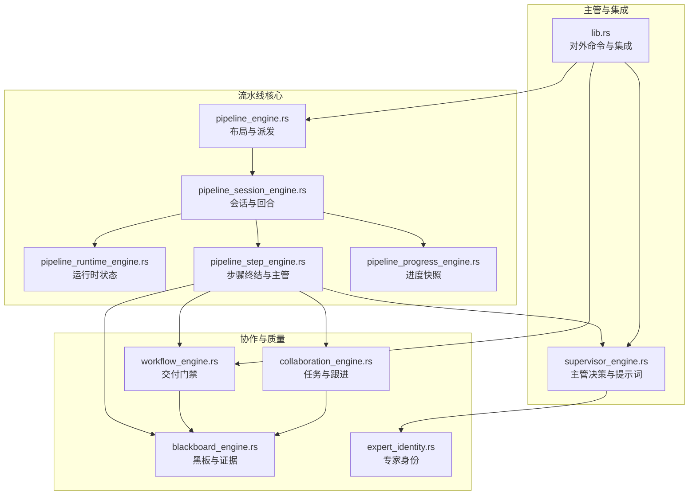
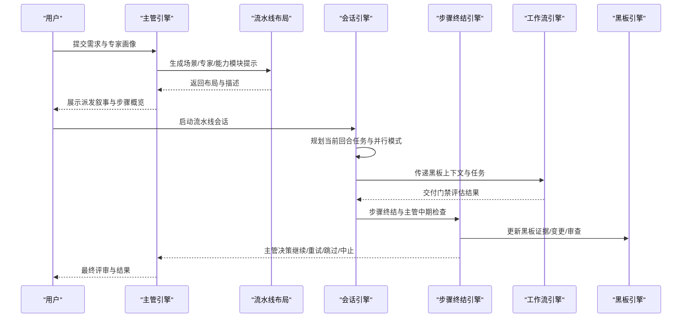
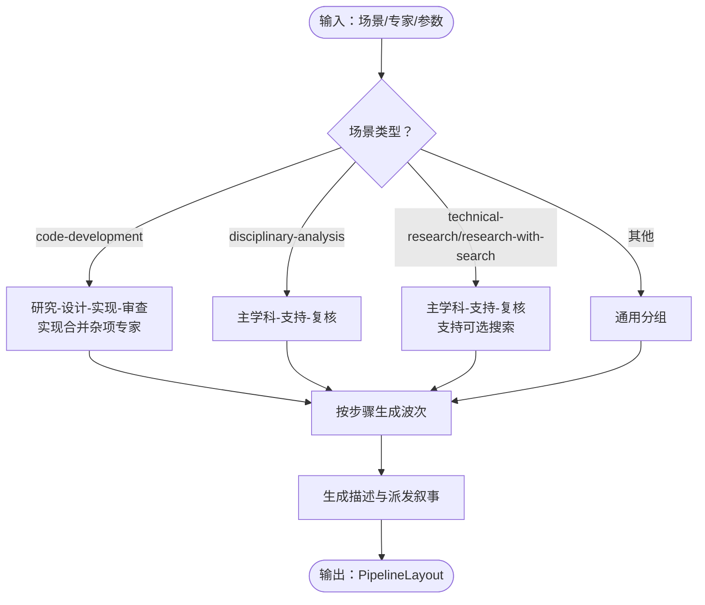
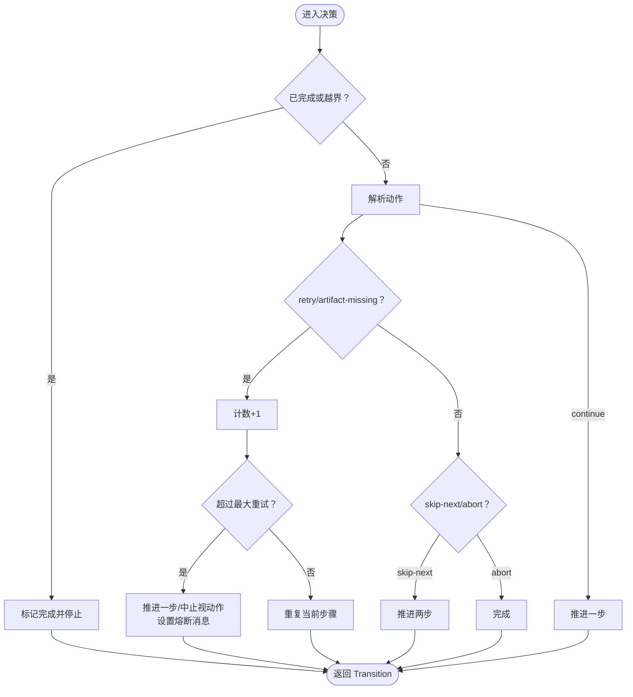
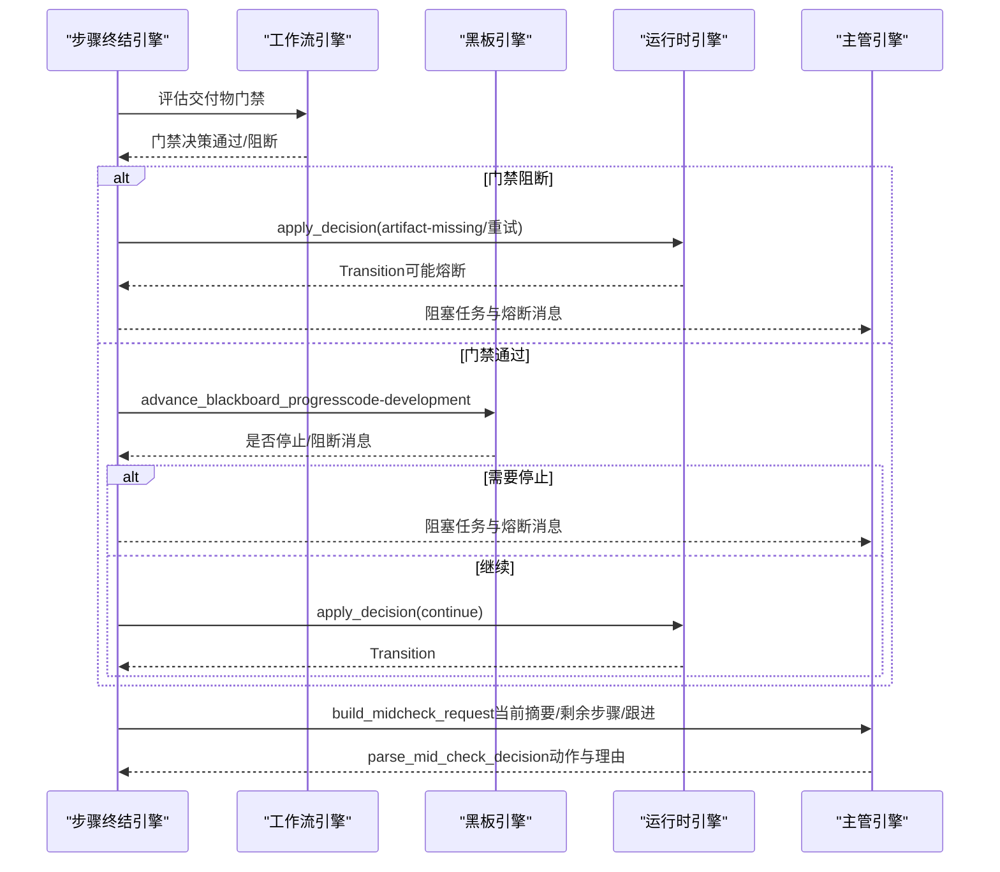
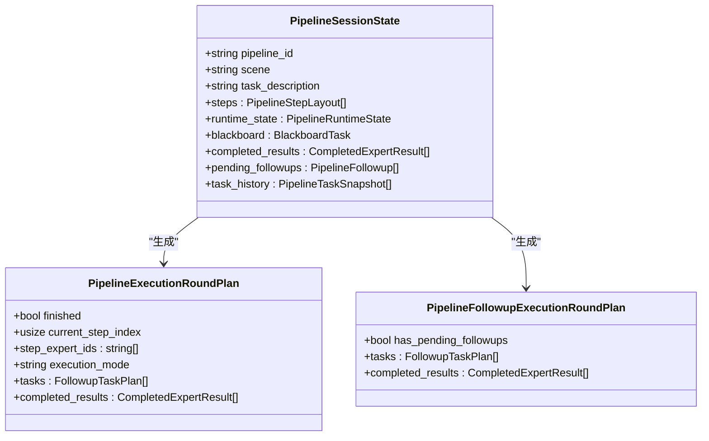
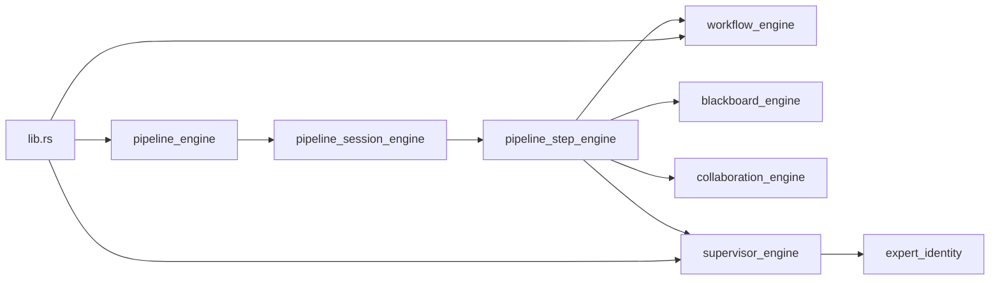

# 流水线引擎

<cite>
**本文档引用的文件**
- [pipeline_engine.rs](file://ai-experts/src-tauri/src/pipeline_engine.rs)
- [pipeline_runtime_engine.rs](file://ai-experts/src-tauri/src/pipeline_runtime_engine.rs)
- [pipeline_step_engine.rs](file://ai-experts/src-tauri/src/pipeline_step_engine.rs)
- [pipeline_session_engine.rs](file://ai-experts/src-tauri/src/pipeline_session_engine.rs)
- [supervisor_engine.rs](file://ai-experts/src-tauri/src/supervisor_engine.rs)
- [workflow_engine.rs](file://ai-experts/src-tauri/src/workflow_engine.rs)
- [blackboard_engine.rs](file://ai-experts/src-tauri/src/blackboard_engine.rs)
- [collaboration_engine.rs](file://ai-experts/src-tauri/src/collaboration_engine.rs)
- [expert_identity.rs](file://ai-experts/src-tauri/src/expert_identity.rs)
- [pipeline_progress_engine.rs](file://ai-experts/src-tauri/src/pipeline_progress_engine.rs)
- [lib.rs](file://ai-experts/src-tauri/src/lib.rs)
</cite>

## 目录
1. [引言](#引言)
2. [项目结构](#项目结构)
3. [核心组件](#核心组件)
4. [架构总览](#架构总览)
5. [详细组件分析](#详细组件分析)
6. [依赖分析](#依赖分析)
7. [性能考量](#性能考量)
8. [故障排查指南](#故障排查指南)
9. [结论](#结论)
10. [附录](#附录)

## 引言
本文件面向“星图专家团工作台”的流水线引擎，系统性阐述流水线设计、执行与主管监督机制，包括流水线布局定义、步骤依赖与并行执行、调度算法、状态转换与异常处理、主管自动决策与人工审核、质量保证体系、扩展接口与自定义流程、性能监控方案，以及实际案例与最佳实践。文档同时解释流水线引擎与工作流引擎、AI集成模块的协同机制。

## 项目结构
流水线引擎位于 Rust 后端模块中，采用模块化设计，核心模块包括：
- 流水线布局与派发：pipeline_engine.rs
- 运行时状态与决策：pipeline_runtime_engine.rs
- 步骤终结与主管监督：pipeline_step_engine.rs
- 会话与回合计划：pipeline_session_engine.rs
- 主管自动决策与提示词：supervisor_engine.rs
- 工作流与交付门禁：workflow_engine.rs
- 黑板与协作追踪：blackboard_engine.rs
- 协作与跟进计划：collaboration_engine.rs
- 专家身份与职责：expert_identity.rs
- 进度快照与可视化：pipeline_progress_engine.rs
- 对外命令与集成：lib.rs

图表来源
- [pipeline_engine.rs:1-600](file://ai-experts/src-tauri/src/pipeline_engine.rs#L1-L600)
- [pipeline_runtime_engine.rs:1-214](file://ai-experts/src-tauri/src/pipeline_runtime_engine.rs#L1-L214)
- [pipeline_session_engine.rs:1-593](file://ai-experts/src-tauri/src/pipeline_session_engine.rs#L1-L593)
- [pipeline_step_engine.rs:1-488](file://ai-experts/src-tauri/src/pipeline_step_engine.rs#L1-L488)
- [pipeline_progress_engine.rs:1-213](file://ai-experts/src-tauri/src/pipeline_progress_engine.rs#L1-L213)
- [workflow_engine.rs:1-800](file://ai-experts/src-tauri/src/workflow_engine.rs#L1-L800)
- [blackboard_engine.rs:1-670](file://ai-experts/src-tauri/src/blackboard_engine.rs#L1-L670)
- [collaboration_engine.rs:1-435](file://ai-experts/src-tauri/src/collaboration_engine.rs#L1-L435)
- [expert_identity.rs:1-64](file://ai-experts/src-tauri/src/expert_identity.rs#L1-L64)
- [lib.rs:1-800](file://ai-experts/src-tauri/src/lib.rs#L1-L800)

章节来源
- [lib.rs:1-800](file://ai-experts/src-tauri/src/lib.rs#L1-L800)

## 核心组件
- 流水线布局与派发：根据场景与专家集合生成步骤序列与波次，支持研究、设计、实现、审查等阶段的自动拆分与顺序约束。
- 运行时状态与决策：维护当前步骤索引、最大重试次数、重试计数、完成标志；提供“重试/跳过/中止/继续”等动作的决策与推进逻辑。
- 步骤终结与主管监督：在步骤完成后评估交付物与黑板进展，决定是否推进、熔断或触发主管介入；构建主管中期检查请求。
- 会话与回合计划：初始化流水线会话，规划当前回合的专家任务与跟进任务，支持串行/并行模式。
- 主管自动决策：基于提示词与专家画像，动态选择场景、任务描述、专家与能力模块提示，解析专家意图与中期检查决策。
- 工作流与交付门禁：对专家输出进行结构化解析与质量校验，确保实现/设计阶段的真实落盘动作与精确变更。
- 黑板与协作追踪：统一记录证据、变更提案、测试验证、审查决策与阻塞项，形成跨专家协作的知识基座。
- 协作与跟进：将用户中途消息转化为“跟进任务”，按专家与交付模式分发到当前回合或后续回合。
- 专家身份与职责：标准化专家 ID、识别实现/设计/审查/创作/文档等职责类别，支撑动态团队构建。
- 进度快照与可视化：聚合活跃任务、当前步骤专家与剩余专家，生成进度报告与摘要。

章节来源
- [pipeline_engine.rs:1-600](file://ai-experts/src-tauri/src/pipeline_engine.rs#L1-L600)
- [pipeline_runtime_engine.rs:1-214](file://ai-experts/src-tauri/src/pipeline_runtime_engine.rs#L1-L214)
- [pipeline_step_engine.rs:1-488](file://ai-experts/src-tauri/src/pipeline_step_engine.rs#L1-L488)
- [pipeline_session_engine.rs:1-593](file://ai-experts/src-tauri/src/pipeline_session_engine.rs#L1-L593)
- [supervisor_engine.rs:1-982](file://ai-experts/src-tauri/src/supervisor_engine.rs#L1-L982)
- [workflow_engine.rs:1-800](file://ai-experts/src-tauri/src/workflow_engine.rs#L1-L800)
- [blackboard_engine.rs:1-670](file://ai-experts/src-tauri/src/blackboard_engine.rs#L1-L670)
- [collaboration_engine.rs:1-435](file://ai-experts/src-tauri/src/collaboration_engine.rs#L1-L435)
- [expert_identity.rs:1-64](file://ai-experts/src-tauri/src/expert_identity.rs#L1-L64)
- [pipeline_progress_engine.rs:1-213](file://ai-experts/src-tauri/src/pipeline_progress_engine.rs#L1-L213)

## 架构总览
流水线引擎以“布局-会话-步骤-主管-工作流-黑板”为主线，贯穿从任务拆解到交付验收的全过程。主管在关键节点进行自动决策与人工审核衔接，工作流引擎负责交付物质量门禁，黑板作为知识中枢保障协作一致性。

图表来源
- [supervisor_engine.rs:108-204](file://ai-experts/src-tauri/src/supervisor_engine.rs#L108-L204)
- [pipeline_engine.rs:359-383](file://ai-experts/src-tauri/src/pipeline_engine.rs#L359-L383)
- [pipeline_session_engine.rs:149-185](file://ai-experts/src-tauri/src/pipeline_session_engine.rs#L149-L185)
- [pipeline_step_engine.rs:173-218](file://ai-experts/src-tauri/src/pipeline_step_engine.rs#L173-L218)
- [workflow_engine.rs:448-494](file://ai-experts/src-tauri/src/workflow_engine.rs#L448-L494)
- [blackboard_engine.rs:132-280](file://ai-experts/src-tauri/src/blackboard_engine.rs#L132-L280)

## 详细组件分析

### 流水线布局与派发（pipeline_engine.rs）
- 数据结构
  - PipelinePlanInput：输入场景、任务描述、专家集合、是否需要设计等。
  - PipelineStepLayout：单步专家集合与可选标记。
  - DispatchWaveLayout：波次编号与专家集合。
  - PipelineLayout：场景、描述、步骤序列、波次序列。
  - PipelineExpertInfo：专家标识、姓名、头衔。
- 关键能力
  - 专家类型识别：研究、设计、工程、审查专家分类与去重。
  - 场景化布局生成：
    - code-development：按研究-设计-实现-审查顺序拆分，实现阶段合并杂项专家。
    - disciplinary-analysis：主学科专家优先，辅以支持与复核。
    - technical-research/research-with-search：主学科专家摸底，支持专家交叉，复核可选。
    - 其他场景：通用分组。
  - 描述生成：根据步骤集合生成自然语言描述，指导主管与专家。
  - 派发叙事与剩余步骤描述：生成主管对专家的说明与后续步骤概览。
- 复杂度与优化
  - 布局生成为 O(N) 级别（N 为专家数量），分类与去重使用哈希集合，整体高效。
  - 支持可选标记（optional）用于区分支持专家与复核专家，便于主管中期检查。

图表来源
- [pipeline_engine.rs:107-383](file://ai-experts/src-tauri/src/pipeline_engine.rs#L107-L383)

章节来源
- [pipeline_engine.rs:1-600](file://ai-experts/src-tauri/src/pipeline_engine.rs#L1-L600)

### 运行时状态与决策（pipeline_runtime_engine.rs）
- 数据结构
  - PipelineRuntimeState：当前步骤索引、总步骤数、最大重试次数、重试计数映射、完成标志。
  - PipelineRuntimeInitRequest：初始化请求。
  - PipelineRuntimeDecisionRequest：决策请求（动作、当前步骤专家集合）。
  - PipelineRuntimeTransition：决策结果（新状态、是否重复步骤、推进步数、是否停止、熔断消息）。
- 决策逻辑
  - 动作解析：retry/artifact-missing/skip-next/abort/continue。
  - 重试控制：累计重试次数与最大重试阈值比较，超过阈值自动推进并生成熔断消息。
  - 跳过与中止：skip-next 推进两步；abort 直接结束。
  - 完成判定：当前步骤索引达到总步骤数即完成。
- 异常处理
  - 超阈值重试触发熔断消息，提示主管推进以避免空转。
  - artifact-missing 超阈值直接停止流水线。

图表来源
- [pipeline_runtime_engine.rs:39-153](file://ai-experts/src-tauri/src/pipeline_runtime_engine.rs#L39-L153)

章节来源
- [pipeline_runtime_engine.rs:1-214](file://ai-experts/src-tauri/src/pipeline_runtime_engine.rs#L1-L214)

### 步骤终结与主管监督（pipeline_step_engine.rs）
- 数据结构
  - PipelineTaskSnapshot：专家任务快照（输出/错误）。
  - SupervisorStepResult：主管视角的专家结果。
  - PipelineStepFinalizeRequest：步骤终结请求（场景、任务描述、步骤索引、专家集合、上下文、黑板、已完成结果、剩余步骤描述、跟进上下文）。
  - PipelineStepFinalizeDecision：步骤终结决策（黑板、运行时转换、阻塞任务、主管动作、是否停止）。
- 终结流程
  - 交付物门禁：评估是否需要真实交付物，若缺失则熔断并推进重试或中止。
  - 黑板进展：在 code-development 场景下推进黑板进展，若连续无进展则熔断。
  - 自动推进：通过运行时决策进入下一步。
  - 主管中期检查：构建 MidCheckRequest，包含当前任务摘要、剩余专家、进度与跟进上下文。
- 与主管协作
  - parse_mid_check_decision 解析主管动作（continue/retry/skip-next/abort）。
  - enforce_review_fact 保证评审回复不空口白话，特别是未落盘时的限制。

图表来源
- [pipeline_step_engine.rs:73-171](file://ai-experts/src-tauri/src/pipeline_step_engine.rs#L73-L171)
- [workflow_engine.rs:448-494](file://ai-experts/src-tauri/src/workflow_engine.rs#L448-L494)
- [blackboard_engine.rs:282-333](file://ai-experts/src-tauri/src/blackboard_engine.rs#L282-L333)
- [pipeline_runtime_engine.rs:39-153](file://ai-experts/src-tauri/src/pipeline_runtime_engine.rs#L39-L153)
- [supervisor_engine.rs:194-204](file://ai-experts/src-tauri/src/supervisor_engine.rs#L194-L204)

章节来源
- [pipeline_step_engine.rs:1-488](file://ai-experts/src-tauri/src/pipeline_step_engine.rs#L1-L488)

### 会话与回合计划（pipeline_session_engine.rs）
- 数据结构
  - PipelineSessionState：流水线会话状态（ID、场景、任务描述、步骤、运行时状态、黑板、已完成结果、待跟进、任务历史）。
  - PipelineExecutionRoundPlan：当前回合计划（是否完成、当前步骤索引、专家集合、执行模式、任务列表、已完成结果）。
  - PipelineFollowupExecutionRoundPlan：跟进回合计划（是否有待跟进、任务列表、已完成结果）。
- 能力
  - 初始化会话：根据布局与黑板初始化运行时状态。
  - 当前回合计划：依据步骤布局与专家集合生成任务，串行/并行模式自动判定。
  - 跟进回合计划：将用户中途消息转化为专家任务，按模式分发。
  - 任务结果应用：更新黑板、完成结果与任务历史，消费待跟进。

图表来源
- [pipeline_session_engine.rs:15-77](file://ai-experts/src-tauri/src/pipeline_session_engine.rs#L15-L77)

章节来源
- [pipeline_session_engine.rs:1-593](file://ai-experts/src-tauri/src/pipeline_session_engine.rs#L1-L593)

### 主管自动决策与提示词（supervisor_engine.rs）
- 能力模块提示：支持 code-tool-primer、web-search-guidance、command-guidance、document-tool-primer、media-tool-primer、video-workflow 等。
- 场景化专家团队构建：
  - code-development：根据关键词与专家类型动态选择主责与辅助专家，必要时加入审查专家。
  - code-review：优先质量/合规审查专家，必要时叠加代码专家。
  - technical-research/research-with-search：主学科专家主导，支持专家交叉，强调搜索与数据专家。
  - discipline-analysis：主学科专家定主，辅以交叉学科与复核。
  - 其他场景：按默认专家集或用户指定专家构建。
- 提示词与解析
  - build_supervisor_prompt：构建主管派发提示词，包含专家画像与场景说明。
  - build_mid_check_prompt：构建中期检查提示词，驱动主管动作决策。
  - parse_dispatch_plan/parse_mid_check_decision：解析 LLM 输出为结构化决策。
- 事实校验：评审回复中若未落盘，强制限制“已完成/已交付/已保存”等表述。

章节来源
- [supervisor_engine.rs:1-982](file://ai-experts/src-tauri/src/supervisor_engine.rs#L1-L982)

### 工作流与交付门禁（workflow_engine.rs）
- 交付物门禁
  - evaluate_step_deliverable_guard：根据场景与专家类型判断是否需要真实交付物，检测是否为精确可执行变更。
  - evaluate_expert_reply_guard：对专家回复进行质量校验，防止近似/未执行/未落盘等无效输出。
- 文件动作解析
  - 支持 ACTION/结构化 changes 等多种格式，提取精确变更主体与路径。
  - 对未执行声明、近似补丁、未结构化 diff 等进行拦截与提醒。
- 工作区预检：针对特定任务（如函数计算器、表情替换）进行工作区完整性检查。

章节来源
- [workflow_engine.rs:1-800](file://ai-experts/src-tauri/src/workflow_engine.rs#L1-L800)

### 黑板与协作追踪（blackboard_engine.rs）
- 数据结构：证据、假设、问题、变更提案、验证运行、审查决策、阻塞项、无进展轮次等。
- 能力
  - update_blackboard_from_task：从专家输出抽取变更文件、证据、测试与审查信息，更新黑板。
  - advance_blackboard_progress：code-development 场景下检测连续无进展并熔断。
  - render_blackboard_context：渲染黑板上下文，指导专家协作与落盘。

章节来源
- [blackboard_engine.rs:1-670](file://ai-experts/src-tauri/src/blackboard_engine.rs#L1-L670)

### 协作与跟进（collaboration_engine.rs）
- 专家任务构建：将用户中途消息与黑板上下文拼接到专家任务输入。
- 任务完成状态：更新已完成结果与消费待跟进。
- 回合计划：按当前步骤专家集合生成任务与跟随任务，支持 current-step 与 next-relevant 模式。

章节来源
- [collaboration_engine.rs:1-435](file://ai-experts/src-tauri/src/collaboration_engine.rs#L1-L435)

### 专家身份与职责（expert_identity.rs）
- 专家 ID 归一化与类型识别：实现/设计/审查/创作/文档等职责类别，支持源码读写/重写能力判断。

章节来源
- [expert_identity.rs:1-64](file://ai-experts/src-tauri/src/expert_identity.rs#L1-L64)

### 进度快照与可视化（pipeline_progress_engine.rs）
- 聚合活跃任务、当前步骤专家与剩余专家，生成进度报告、当前步骤摘要、剩余专家摘要与活跃任务摘要。
- 用于主管中期检查与 UI 展示。

章节来源
- [pipeline_progress_engine.rs:1-213](file://ai-experts/src-tauri/src/pipeline_progress_engine.rs#L1-L213)

## 依赖分析
- 模块耦合
  - pipeline_engine 与 pipeline_session_engine：布局驱动会话初始化与回合计划。
  - pipeline_session_engine 与 pipeline_step_engine：回合计划与步骤终结衔接。
  - pipeline_step_engine 与 workflow_engine/blackboard_engine/collaboration_engine/supervisor_engine：交付门禁、黑板更新、协作与主管决策。
  - supervisor_engine 与 expert_identity：专家画像与职责触发概率。
  - lib.rs：对外命令封装，桥接前端与各引擎。
- 外部依赖
  - LLM 调用与令牌配额：lib.rs 中的令牌用量记录与配额检查。
  - 文件系统与路径解析：workflow_engine 与 blackboard_engine 使用路径规范化与读取。

图表来源
- [lib.rs:1-800](file://ai-experts/src-tauri/src/lib.rs#L1-L800)
- [pipeline_engine.rs:1-600](file://ai-experts/src-tauri/src/pipeline_engine.rs#L1-L600)
- [pipeline_session_engine.rs:1-593](file://ai-experts/src-tauri/src/pipeline_session_engine.rs#L1-L593)
- [pipeline_step_engine.rs:1-488](file://ai-experts/src-tauri/src/pipeline_step_engine.rs#L1-L488)
- [workflow_engine.rs:1-800](file://ai-experts/src-tauri/src/workflow_engine.rs#L1-L800)
- [blackboard_engine.rs:1-670](file://ai-experts/src-tauri/src/blackboard_engine.rs#L1-L670)
- [collaboration_engine.rs:1-435](file://ai-experts/src-tauri/src/collaboration_engine.rs#L1-L435)
- [expert_identity.rs:1-64](file://ai-experts/src-tauri/src/expert_identity.rs#L1-L64)
- [supervisor_engine.rs:1-982](file://ai-experts/src-tauri/src/supervisor_engine.rs#L1-L982)

## 性能考量
- 布局生成与专家去重：O(N) 级别，使用哈希集合降低重复与查找成本。
- 决策推进：纯状态机，O(1) 时间复杂度，适合高频调用。
- 交付门禁与文件解析：正则与路径解析开销可控，建议在批量任务时合并处理以减少重复扫描。
- 黑板进展检测：基于签名对比，避免重复计算，连续无进展熔断可显著减少无效执行。
- 并行执行：当步骤专家数大于 1 时自动并行，提升吞吐；注意资源竞争与锁争用，建议在专家任务间尽量无状态或弱状态。

## 故障排查指南
- 交付物缺失
  - 现象：步骤终结返回阻塞任务，熔断消息提示缺少真实交付物。
  - 排查：确认专家输出是否包含精确可执行文件动作（ACTION/结构化 changes），避免近似/未执行/未落盘。
  - 处理：根据提醒补充精确变更或重新执行。
- 连续无进展
  - 现象：code-development 场景下黑板连续三轮无进展，自动熔断。
  - 排查：检查证据、变更提案、测试与审查进展是否更新。
  - 处理：补充证据或调整策略，打破僵局。
- 重试超阈值
  - 现象：重试次数超过最大阈值，自动推进并提示熔断。
  - 排查：确认专家是否陷入无效循环或缺少必要上下文。
  - 处理：调整任务描述、提供更明确的文件路径或启用主管介入。
- 评审回复空口白话
  - 现象：评审回复包含“已完成/已交付/已保存”等表述但未落盘。
  - 处理：遵循 enforce_review_fact 限制，避免误导用户。

章节来源
- [workflow_engine.rs:496-582](file://ai-experts/src-tauri/src/workflow_engine.rs#L496-L582)
- [blackboard_engine.rs:282-333](file://ai-experts/src-tauri/src/blackboard_engine.rs#L282-L333)
- [pipeline_runtime_engine.rs:62-107](file://ai-experts/src-tauri/src/pipeline_runtime_engine.rs#L62-L107)
- [supervisor_engine.rs:257-268](file://ai-experts/src-tauri/src/supervisor_engine.rs#L257-L268)

## 结论
流水线引擎通过“布局-会话-步骤-主管-工作流-黑板”的闭环设计，实现了从任务拆解到交付验收的自动化与质量保障。主管在关键节点进行自动决策与人工审核衔接，工作流引擎确保交付物真实可执行，黑板作为协作中枢保障一致性。该架构既支持高并发并行执行，也具备完善的熔断与回退机制，适用于复杂多学科的专家协作场景。

## 附录

### 实际流水线设计案例
- 案例一：代码实现流水线
  - 场景：code-development
  - 步骤：研究现状 → 设计方案（可选） → 实现修改 → 审查复核
  - 关键点：实现阶段合并杂项专家；必要时加入审查专家；黑板连续无进展自动熔断。
- 案例二：跨学科分析流水线
  - 场景：disciplinary-analysis
  - 步骤：主学科专家定主 → 辅助学科交叉论证 → 风险复核
  - 关键点：主学科专家优先，辅以复核专家；支持可选搜索的调研场景。
- 案例三：中期跟进流水线
  - 场景：任意
  - 步骤：当前回合任务 → 用户中途消息跟进 → 下一轮任务
  - 关键点：current-step 与 next-relevant 模式区分；主管中期检查驱动动作。

章节来源
- [pipeline_engine.rs:107-383](file://ai-experts/src-tauri/src/pipeline_engine.rs#L107-L383)
- [pipeline_session_engine.rs:149-210](file://ai-experts/src-tauri/src/pipeline_session_engine.rs#L149-L210)
- [collaboration_engine.rs:216-295](file://ai-experts/src-tauri/src/collaboration_engine.rs#L216-L295)

### 最佳实践指南
- 专家选择
  - 优先选择职责触发概率高的主责专家，避免低概率专家越责主导。
  - 代码/系统重构优先考虑工程实现类专家，必要时叠加架构与信息科学专家。
- 交付物质量
  - 实现/设计阶段必须输出精确可执行文件动作，避免近似/未执行/未落盘。
  - 使用 ACTION/结构化 changes，避免 diff/省略等不可靠格式。
- 会话管理
  - 合理设置最大重试次数，避免空转；利用熔断机制及时止损。
  - 在黑板中明确证据与候选文件，避免专家凭空猜测。
- 主管介入
  - 中期检查基于黑板上下文与专家摘要，确保主管决策有据可依。
  - 评审回复需诚实，未落盘时避免使用“已完成/已交付”等表述。

### 扩展接口与自定义流程
- 自定义场景
  - 在 supervisor_engine 中扩展场景与默认专家集，结合关键词识别动态构建团队。
- 自定义布局
  - 在 pipeline_engine 中扩展场景化布局生成逻辑，支持更多领域与流程。
- 能力模块提示
  - 通过 promptModuleHints 为专家加载特定能力模块，提升任务针对性。
- 对外命令
  - 通过 lib.rs 的命令接口暴露引擎能力，便于前端与外部系统集成。

章节来源
- [supervisor_engine.rs:9-16](file://ai-experts/src-tauri/src/supervisor_engine.rs#L9-L16)
- [pipeline_engine.rs:1-600](file://ai-experts/src-tauri/src/pipeline_engine.rs#L1-L600)
- [lib.rs:1-800](file://ai-experts/src-tauri/src/lib.rs#L1-L800)