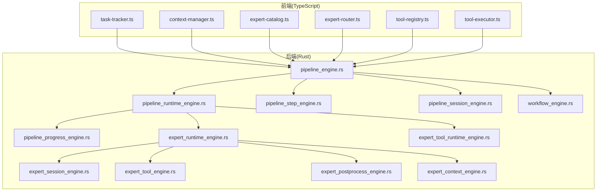
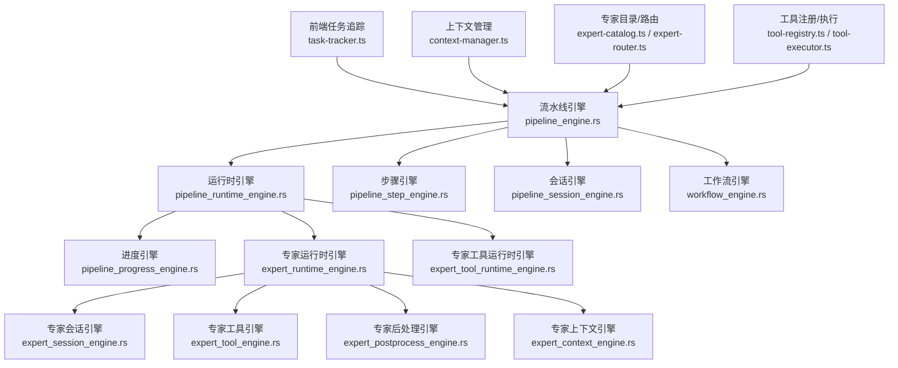
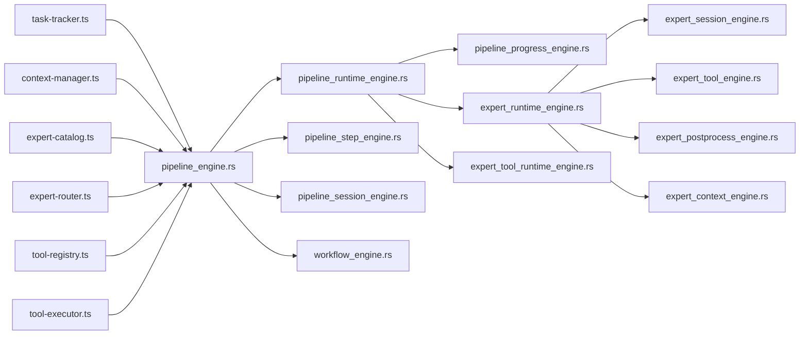

# 流水线执行

<cite>
**本文引用的文件**
- [pipeline_engine.rs](file://ai-experts/src-tauri/src/pipeline_engine.rs)
- [pipeline_runtime_engine.rs](file://ai-experts/src-tauri/src/pipeline_runtime_engine.rs)
- [pipeline_step_engine.rs](file://ai-experts/src-tauri/src/pipeline_step_engine.rs)
- [pipeline_progress_engine.rs](file://ai-experts/src-tauri/src/pipeline_progress_engine.rs)
- [pipeline_session_engine.rs](file://ai-experts/src-tauri/src/pipeline_session_engine.rs)
- [expert_runtime_engine.rs](file://ai-experts/src-tauri/src/expert_runtime_engine.rs)
- [expert_tool_runtime_engine.rs](file://ai-experts/src-tauri/src/expert_tool_runtime_engine.rs)
- [workflow_engine.rs](file://ai-experts/src-tauri/src/workflow_engine.rs)
- [expert_session_engine.rs](file://ai-experts/src-tauri/src/expert_session_engine.rs)
- [expert_tool_engine.rs](file://ai-experts/src-tauri/src/expert_tool_engine.rs)
- [expert_postprocess_engine.rs](file://ai-experts/src-tauri/src/expert_postprocess_engine.rs)
- [expert_context_engine.rs](file://ai-experts/src-tauri/src/expert_context_engine.rs)
- [task-tracker.ts](file://ai-experts/src/task-tracker.ts)
- [context-manager.ts](file://ai-experts/src/context-manager.ts)
- [expert-catalog.ts](file://ai-experts/src/expert-catalog.ts)
- [expert-router.ts](file://ai-experts/src/expert-router.ts)
- [tool-registry.ts](file://ai-experts/src/tool-registry.ts)
- [tool-executor.ts](file://ai-experts/src/tool-executor.ts)
</cite>

## 目录
1. [引言](#引言)
2. [项目结构](#项目结构)
3. [核心组件](#核心组件)
4. [架构总览](#架构总览)
5. [详细组件分析](#详细组件分析)
6. [依赖关系分析](#依赖关系分析)
7. [性能考虑](#性能考虑)
8. [故障排查指南](#故障排查指南)
9. [结论](#结论)
10. [附录](#附录)

## 引言
本文件面向“星图专家团工作台”的流水线执行模块，系统性阐述流水线运行时引擎的设计与实现，覆盖步骤调度算法、状态转换机制、异常处理策略；详解流水线步骤引擎的工作流程（初始化、专家分配、执行监控、结果收集）；说明并发控制、资源管理与进度跟踪；给出执行状态管理、错误恢复与超时处理的实现要点；并提供性能优化建议与监控指标，辅以执行流程示例与故障排查指引，帮助开发者理解与调试复杂的专家协作执行过程。

## 项目结构
流水线执行模块由后端 Rust 引擎与前端 TypeScript 工具协同组成：
- 后端（Rust）：提供流水线编排、步骤调度、专家执行、工具执行、会话与进度管理等核心能力。
- 前端（TypeScript）：提供任务追踪、上下文管理、专家目录与路由、工具注册与执行等前端支撑。

图表来源
- [pipeline_engine.rs](file://ai-experts/src-tauri/src/pipeline_engine.rs)
- [pipeline_runtime_engine.rs](file://ai-experts/src-tauri/src/pipeline_runtime_engine.rs)
- [pipeline_step_engine.rs](file://ai-experts/src-tauri/src/pipeline_step_engine.rs)
- [pipeline_progress_engine.rs](file://ai-experts/src-tauri/src/pipeline_progress_engine.rs)
- [pipeline_session_engine.rs](file://ai-experts/src-tauri/src/pipeline_session_engine.rs)
- [expert_runtime_engine.rs](file://ai-experts/src-tauri/src/expert_runtime_engine.rs)
- [expert_tool_runtime_engine.rs](file://ai-experts/src-tauri/src/expert_tool_runtime_engine.rs)
- [workflow_engine.rs](file://ai-experts/src-tauri/src/workflow_engine.rs)
- [expert_session_engine.rs](file://ai-experts/src-tauri/src/expert_session_engine.rs)
- [expert_tool_engine.rs](file://ai-experts/src-tauri/src/expert_tool_engine.rs)
- [expert_postprocess_engine.rs](file://ai-experts/src-tauri/src/expert_postprocess_engine.rs)
- [expert_context_engine.rs](file://ai-experts/src-tauri/src/expert_context_engine.rs)
- [task-tracker.ts](file://ai-experts/src/task-tracker.ts)
- [context-manager.ts](file://ai-experts/src/context-manager.ts)
- [expert-catalog.ts](file://ai-experts/src/expert-catalog.ts)
- [expert-router.ts](file://ai-experts/src/expert-router.ts)
- [tool-registry.ts](file://ai-experts/src/tool-registry.ts)
- [tool-executor.ts](file://ai-experts/src/tool-executor.ts)

章节来源
- [pipeline_engine.rs](file://ai-experts/src-tauri/src/pipeline_engine.rs)
- [task-tracker.ts](file://ai-experts/src/task-tracker.ts)
- [context-manager.ts](file://ai-experts/src/context-manager.ts)
- [expert-catalog.ts](file://ai-experts/src/expert-catalog.ts)
- [expert-router.ts](file://ai-experts/src/expert-router.ts)
- [tool-registry.ts](file://ai-experts/src/tool-registry.ts)
- [tool-executor.ts](file://ai-experts/src/tool-executor.ts)

## 核心组件
- 流水线引擎（pipeline_engine.rs）：负责流水线定义解析、步骤拓扑构建、执行入口与生命周期管理。
- 流水线运行时引擎（pipeline_runtime_engine.rs）：承载执行上下文、并发调度、状态持久化与事件分发。
- 流水线步骤引擎（pipeline_step_engine.rs）：单步初始化、依赖满足检测、专家分配与执行触发。
- 流水线进度引擎（pipeline_progress_engine.rs）：进度计算、阶段推进、完成度统计与通知。
- 流水线会话引擎（pipeline_session_engine.rs）：会话创建、状态回放、历史记录与恢复。
- 专家运行时引擎（expert_runtime_engine.rs）：专家生命周期、会话绑定、上下文注入与后处理。
- 专家工具运行时引擎（expert_tool_runtime_engine.rs）：工具调用封装、流式输出、超时与中断。
- 工作流引擎（workflow_engine.rs）：与流水线协同的状态机与条件分支。
- 专家会话引擎（expert_session_engine.rs）：专家会话管理与状态同步。
- 专家工具引擎（expert_tool_engine.rs）：工具注册、参数校验与执行桥接。
- 专家后处理引擎（expert_postprocess_engine.rs）：结果清洗、格式化与归档。
- 专家上下文引擎（expert_context_engine.rs）：上下文拼装、变量替换与动态注入。
- 前端任务追踪（task-tracker.ts）：前端侧进度展示与交互反馈。
- 前端上下文管理（context-manager.ts）：上下文生成、缓存与共享。
- 前端专家目录与路由（expert-catalog.ts, expert-router.ts）：专家选择、路由与可视化。
- 前端工具注册与执行（tool-registry.ts, tool-executor.ts）：工具注册、参数传递与执行回调。

章节来源
- [pipeline_engine.rs](file://ai-experts/src-tauri/src/pipeline_engine.rs)
- [pipeline_runtime_engine.rs](file://ai-experts/src-tauri/src/pipeline_runtime_engine.rs)
- [pipeline_step_engine.rs](file://ai-experts/src-tauri/src/pipeline_step_engine.rs)
- [pipeline_progress_engine.rs](file://ai-experts/src-tauri/src/pipeline_progress_engine.rs)
- [pipeline_session_engine.rs](file://ai-experts/src-tauri/src/pipeline_session_engine.rs)
- [expert_runtime_engine.rs](file://ai-experts/src-tauri/src/expert_runtime_engine.rs)
- [expert_tool_runtime_engine.rs](file://ai-experts/src-tauri/src/expert_tool_runtime_engine.rs)
- [workflow_engine.rs](file://ai-experts/src-tauri/src/workflow_engine.rs)
- [expert_session_engine.rs](file://ai-experts/src-tauri/src/expert_session_engine.rs)
- [expert_tool_engine.rs](file://ai-experts/src-tauri/src/expert_tool_engine.rs)
- [expert_postprocess_engine.rs](file://ai-experts/src-tauri/src/expert_postprocess_engine.rs)
- [expert_context_engine.rs](file://ai-experts/src-tauri/src/expert_context_engine.rs)
- [task-tracker.ts](file://ai-experts/src/task-tracker.ts)
- [context-manager.ts](file://ai-experts/src/context-manager.ts)
- [expert-catalog.ts](file://ai-experts/src/expert-catalog.ts)
- [expert-router.ts](file://ai-experts/src/expert-router.ts)
- [tool-registry.ts](file://ai-experts/src/tool-registry.ts)
- [tool-executor.ts](file://ai-experts/src/tool-executor.ts)

## 架构总览
流水线执行采用“编排层 + 运行时层 + 专家执行层 + 前端协同”的分层设计。编排层负责步骤拓扑与调度；运行时层负责并发与状态；专家执行层负责专家与工具调用；前端负责用户交互与进度展示。

图表来源
- [pipeline_engine.rs](file://ai-experts/src-tauri/src/pipeline_engine.rs)
- [pipeline_runtime_engine.rs](file://ai-experts/src-tauri/src/pipeline_runtime_engine.rs)
- [pipeline_step_engine.rs](file://ai-experts/src-tauri/src/pipeline_step_engine.rs)
- [pipeline_progress_engine.rs](file://ai-experts/src-tauri/src/pipeline_progress_engine.rs)
- [pipeline_session_engine.rs](file://ai-experts/src-tauri/src/pipeline_session_engine.rs)
- [expert_runtime_engine.rs](file://ai-experts/src-tauri/src/expert_runtime_engine.rs)
- [expert_tool_runtime_engine.rs](file://ai-experts/src-tauri/src/expert_tool_runtime_engine.rs)
- [workflow_engine.rs](file://ai-experts/src-tauri/src/workflow_engine.rs)
- [expert_session_engine.rs](file://ai-experts/src-tauri/src/expert_session_engine.rs)
- [expert_tool_engine.rs](file://ai-experts/src-tauri/src/expert_tool_engine.rs)
- [expert_postprocess_engine.rs](file://ai-experts/src-tauri/src/expert_postprocess_engine.rs)
- [expert_context_engine.rs](file://ai-experts/src-tauri/src/expert_context_engine.rs)
- [task-tracker.ts](file://ai-experts/src/task-tracker.ts)
- [context-manager.ts](file://ai-experts/src/context-manager.ts)
- [expert-catalog.ts](file://ai-experts/src/expert-catalog.ts)
- [expert-router.ts](file://ai-experts/src/expert-router.ts)
- [tool-registry.ts](file://ai-experts/src/tool-registry.ts)
- [tool-executor.ts](file://ai-experts/src/tool-executor.ts)

## 详细组件分析

### 流水线引擎（pipeline_engine.rs）
- 职责：解析流水线定义、构建步骤拓扑、协调运行时与步骤引擎、驱动整体执行生命周期。
- 关键点：拓扑排序、依赖图构建、入口步骤选择、异常传播与恢复入口。
- 并发：通过运行时引擎进行并发控制，避免竞态。
- 状态：维护全局执行状态与事件通道，供进度与会话引擎消费。

章节来源
- [pipeline_engine.rs](file://ai-experts/src-tauri/src/pipeline_engine.rs)

### 流水线运行时引擎（pipeline_runtime_engine.rs）
- 职责：执行上下文管理、并发调度器、状态持久化、事件分发与回调。
- 关键点：步骤并发上限、队列调度、失败重试策略、超时与中断处理。
- 数据结构：步骤状态表、会话映射、进度快照。
- 性能：批处理提交、异步I/O、内存池化。

章节来源
- [pipeline_runtime_engine.rs](file://ai-experts/src-tauri/src/pipeline_runtime_engine.rs)

### 流水线步骤引擎（pipeline_step_engine.rs）
- 职责：单步初始化、前置条件检查、专家分配与触发、结果收集与后处理。
- 关键点：步骤类型识别、依赖满足检测、专家路由策略、工具调用封装。
- 并发：与运行时引擎配合，按步骤粒度并发执行。
- 错误：步骤级异常隔离，支持跳过或阻塞策略。

章节来源
- [pipeline_step_engine.rs](file://ai-experts/src-tauri/src/pipeline_step_engine.rs)

### 流水线进度引擎（pipeline_progress_engine.rs）
- 职责：进度计算、阶段推进、完成度统计、前端通知。
- 关键点：阶段权重、步骤权重、实时进度上报、历史轨迹。
- 指标：吞吐量、平均耗时、失败率、重试次数。

章节来源
- [pipeline_progress_engine.rs](file://ai-experts/src-tauri/src/pipeline_progress_engine.rs)

### 流水线会话引擎（pipeline_session_engine.rs）
- 职责：会话创建、状态回放、历史记录、断点续跑。
- 关键点：会话快照、状态一致性、幂等恢复。
- 并发：会话内串行，跨会话并行。

章节来源
- [pipeline_session_engine.rs](file://ai-experts/src-tauri/src/pipeline_session_engine.rs)

### 专家运行时引擎（expert_runtime_engine.rs）
- 职责：专家生命周期管理、会话绑定、上下文注入、后处理。
- 关键点：专家选择策略、上下文拼装、结果清洗、异常捕获。
- 并发：多专家并行，资源隔离。

章节来源
- [expert_runtime_engine.rs](file://ai-experts/src-tauri/src/expert_runtime_engine.rs)

### 专家工具运行时引擎（expert_tool_runtime_engine.rs）
- 职责：工具调用封装、流式输出、超时与中断、结果聚合。
- 关键点：流式数据处理、超时控制、取消令牌、错误码映射。
- 并发：工具级并发，统一调度。

章节来源
- [expert_tool_runtime_engine.rs](file://ai-experts/src-tauri/src/expert_tool_runtime_engine.rs)

### 工作流引擎（workflow_engine.rs）
- 职责：条件分支、状态机、动态路由与回退。
- 关键点：条件表达式求值、分支合并、状态回溯。

章节来源
- [workflow_engine.rs](file://ai-experts/src-tauri/src/workflow_engine.rs)

### 专家会话引擎（expert_session_engine.rs）
- 职责：专家会话管理、状态同步、消息队列。
- 关键点：会话ID生成、消息去重、状态广播。

章节来源
- [expert_session_engine.rs](file://ai-experts/src-tauri/src/expert_session_engine.rs)

### 专家工具引擎（expert_tool_engine.rs）
- 职责：工具注册、参数校验、执行桥接。
- 关键点：工具清单、参数Schema、执行回调。

章节来源
- [expert_tool_engine.rs](file://ai-experts/src-tauri/src/expert_tool_engine.rs)

### 专家后处理引擎（expert_postprocess_engine.rs）
- 职责：结果清洗、格式化、归档。
- 关键点：结果校验、格式转换、异常降级。

章节来源
- [expert_postprocess_engine.rs](file://ai-experts/src-tauri/src/expert_postprocess_engine.rs)

### 专家上下文引擎（expert_context_engine.rs）
- 职责：上下文拼装、变量替换、动态注入。
- 关键点：上下文模板、变量解析、依赖注入。

章节来源
- [expert_context_engine.rs](file://ai-experts/src-tauri/src/expert_context_engine.rs)

### 前端协同组件
- 任务追踪（task-tracker.ts）：前端侧进度展示与交互反馈。
- 上下文管理（context-manager.ts）：上下文生成、缓存与共享。
- 专家目录与路由（expert-catalog.ts, expert-router.ts）：专家选择、路由与可视化。
- 工具注册与执行（tool-registry.ts, tool-executor.ts）：工具注册、参数传递与执行回调。

章节来源
- [task-tracker.ts](file://ai-experts/src/task-tracker.ts)
- [context-manager.ts](file://ai-experts/src/context-manager.ts)
- [expert-catalog.ts](file://ai-experts/src/expert-catalog.ts)
- [expert-router.ts](file://ai-experts/src/expert-router.ts)
- [tool-registry.ts](file://ai-experts/src/tool-registry.ts)
- [tool-executor.ts](file://ai-experts/src/tool-executor.ts)

## 依赖关系分析
- 编排层对运行时层的依赖是单向的，运行时层向上游提供调度与状态服务。
- 步骤引擎依赖专家与工具运行时引擎，形成“步骤 → 专家 → 工具”的执行链。
- 前端组件通过流水线引擎暴露的接口进行交互，形成“前端 → 编排层 → 执行层”的调用链。
- 进度与会话引擎作为横切关注点，被运行时与步骤引擎共同依赖。

图表来源
- [pipeline_engine.rs](file://ai-experts/src-tauri/src/pipeline_engine.rs)
- [pipeline_runtime_engine.rs](file://ai-experts/src-tauri/src/pipeline_runtime_engine.rs)
- [pipeline_step_engine.rs](file://ai-experts/src-tauri/src/pipeline_step_engine.rs)
- [pipeline_progress_engine.rs](file://ai-experts/src-tauri/src/pipeline_progress_engine.rs)
- [pipeline_session_engine.rs](file://ai-experts/src-tauri/src/pipeline_session_engine.rs)
- [expert_runtime_engine.rs](file://ai-experts/src-tauri/src/expert_runtime_engine.rs)
- [expert_tool_runtime_engine.rs](file://ai-experts/src-tauri/src/expert_tool_runtime_engine.rs)
- [workflow_engine.rs](file://ai-experts/src-tauri/src/workflow_engine.rs)
- [expert_session_engine.rs](file://ai-experts/src-tauri/src/expert_session_engine.rs)
- [expert_tool_engine.rs](file://ai-experts/src-tauri/src/expert_tool_engine.rs)
- [expert_postprocess_engine.rs](file://ai-experts/src-tauri/src/expert_postprocess_engine.rs)
- [expert_context_engine.rs](file://ai-experts/src-tauri/src/expert_context_engine.rs)
- [task-tracker.ts](file://ai-experts/src/task-tracker.ts)
- [context-manager.ts](file://ai-experts/src/context-manager.ts)
- [expert-catalog.ts](file://ai-experts/src/expert-catalog.ts)
- [expert-router.ts](file://ai-experts/src/expert-router.ts)
- [tool-registry.ts](file://ai-experts/src/tool-registry.ts)
- [tool-executor.ts](file://ai-experts/src/tool-executor.ts)

## 性能考虑
- 并发控制
  - 步骤并发上限：在运行时引擎中设置全局与步骤粒度的并发配额，避免资源争用。
  - 专家并发：专家运行时引擎按专家能力与负载进行限流。
  - 工具并发：工具运行时引擎统一调度，避免外部系统过载。
- 资源管理
  - 内存池化：对频繁分配的对象进行池化复用（如上下文、结果缓冲）。
  - I/O 批处理：批量写入进度与日志，减少系统调用。
  - 超时与背压：为长耗时步骤与工具设置合理超时与背压策略。
- 进度跟踪
  - 实时上报：进度引擎定期上报，前端任务追踪组件节流渲染。
  - 阶段化统计：按阶段与步骤分别统计吞吐与耗时，定位瓶颈。
- 可观测性
  - 指标采集：完成度、失败率、重试次数、平均耗时、P95/P99。
  - 日志分级：INFO/DEBUG/WARN/ERROR，关键路径保留DEBUG日志。

[本节为通用性能指导，不直接分析具体文件]

## 故障排查指南
- 步骤执行失败
  - 检查步骤引擎的前置条件与专家分配是否成功。
  - 查看专家运行时引擎的日志与后处理结果。
  - 使用会话引擎回放最近一次会话，定位失败步骤。
- 专家无响应
  - 检查专家会话引擎状态与消息队列。
  - 校验专家工具引擎的参数与工具可用性。
  - 观察工具运行时引擎的超时与中断记录。
- 进度停滞
  - 对比进度引擎与运行时引擎的进度快照。
  - 检查是否存在阻塞步骤或资源竞争。
- 超时与中断
  - 设置合理的超时阈值与重试策略。
  - 使用取消令牌与中断信号，确保资源释放。
- 前端显示异常
  - 检查任务追踪组件的数据更新频率与节流配置。
  - 确认上下文管理组件的上下文生成与缓存逻辑。

章节来源
- [pipeline_step_engine.rs](file://ai-experts/src-tauri/src/pipeline_step_engine.rs)
- [expert_runtime_engine.rs](file://ai-experts/src-tauri/src/expert_runtime_engine.rs)
- [expert_session_engine.rs](file://ai-experts/src-tauri/src/expert_session_engine.rs)
- [expert_tool_engine.rs](file://ai-experts/src-tauri/src/expert_tool_engine.rs)
- [expert_tool_runtime_engine.rs](file://ai-experts/src-tauri/src/expert_tool_runtime_engine.rs)
- [pipeline_progress_engine.rs](file://ai-experts/src-tauri/src/pipeline_progress_engine.rs)
- [pipeline_session_engine.rs](file://ai-experts/src-tauri/src/pipeline_session_engine.rs)
- [task-tracker.ts](file://ai-experts/src/task-tracker.ts)
- [context-manager.ts](file://ai-experts/src/context-manager.ts)

## 结论
流水线执行模块通过清晰的分层设计与严格的并发控制，实现了从步骤调度到专家协作再到结果产出的全链路自动化。结合进度与会话引擎，系统具备良好的可观测性与可恢复性。建议在生产环境中持续完善超时与重试策略、优化资源池化与批处理机制，并加强前端交互与日志体系，以进一步提升稳定性与用户体验。

[本节为总结性内容，不直接分析具体文件]

## 附录
- 执行流程示例（概念性）
  - 定义流水线与步骤拓扑 → 初始化运行时与步骤 → 分配专家与工具 → 执行监控与进度上报 → 失败恢复与重试 → 完成后处理与归档。
- 监控指标建议
  - 步骤级：成功率、平均耗时、P95/P99、重试次数。
  - 专家级：负载、响应时间、失败率。
  - 工具级：调用次数、超时率、错误分布。
  - 系统级：并发度、内存占用、磁盘I/O、网络延迟。

[本节为概念性内容，不直接分析具体文件]