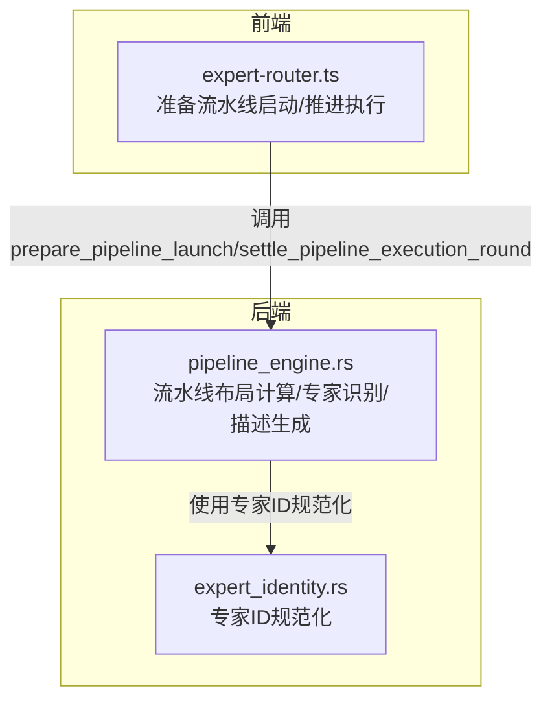
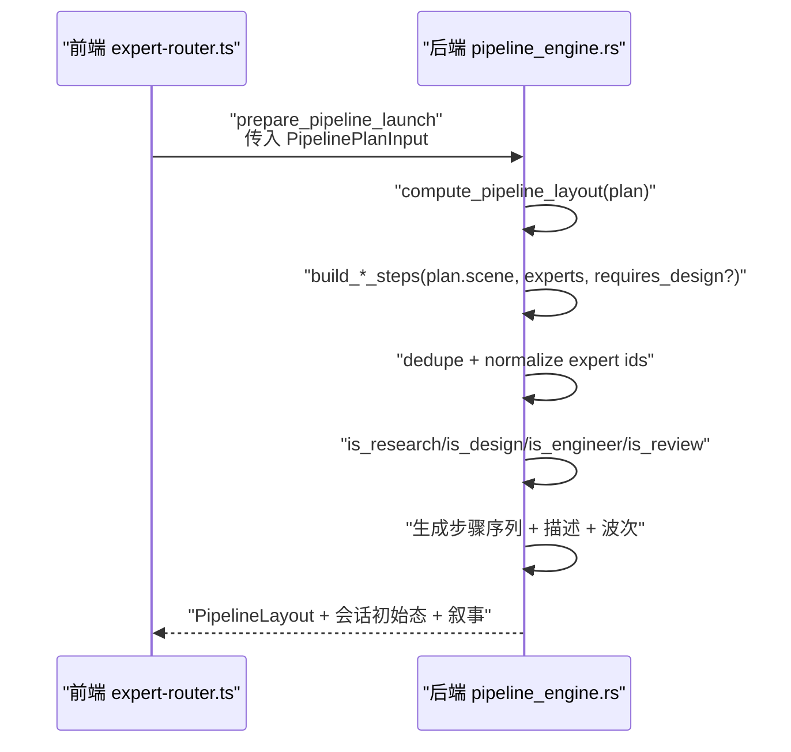
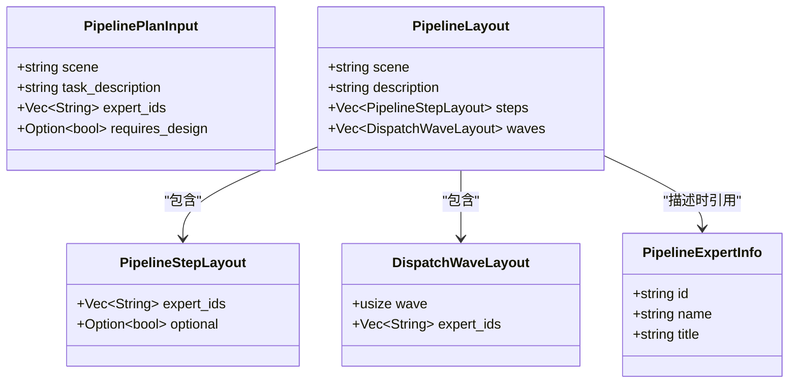
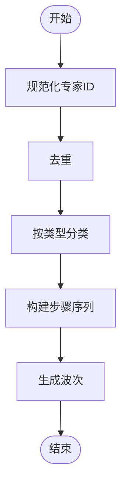
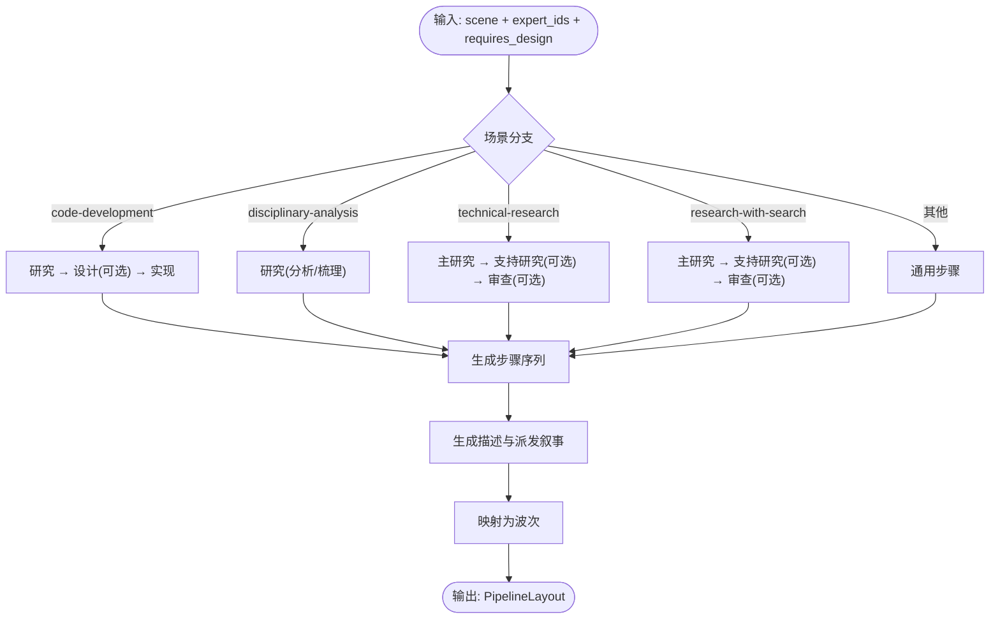
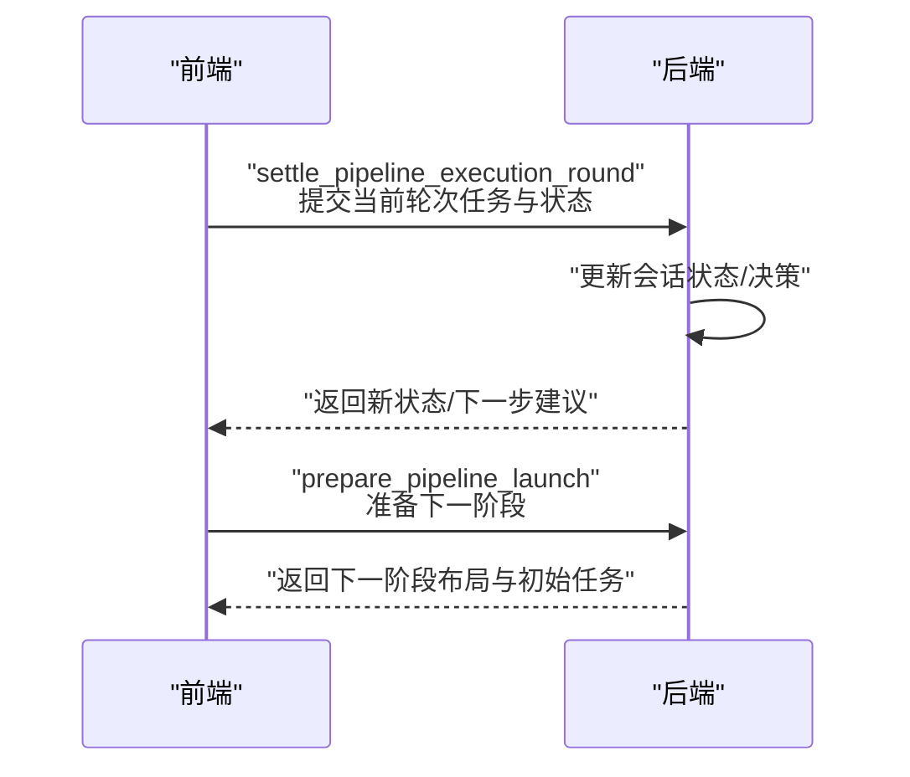
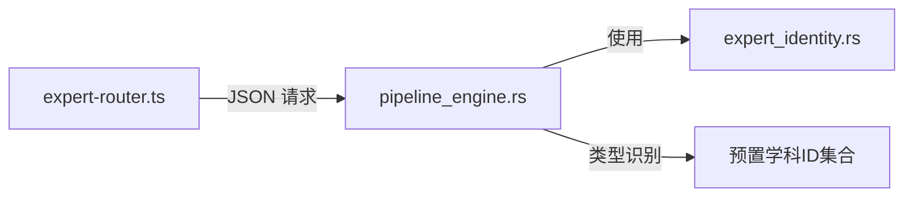
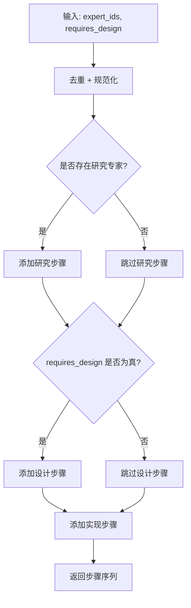
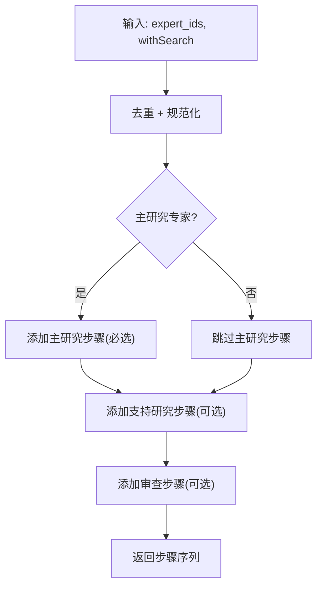

# 流水线设计

<cite>
**本文引用的文件**
- [pipeline_engine.rs](file://ai-experts/src-tauri/src/pipeline_engine.rs)
- [expert-router.ts](file://ai-experts/src/expert-router.ts)
- [expert_identity.rs](file://ai-experts/src-tauri/src/expert_identity.rs)
</cite>

## 目录
1. [简介](#简介)
2. [项目结构](#项目结构)
3. [核心组件](#核心组件)
4. [架构总览](#架构总览)
5. [详细组件分析](#详细组件分析)
6. [依赖分析](#依赖分析)
7. [性能考虑](#性能考虑)
8. [故障排查指南](#故障排查指南)
9. [结论](#结论)
10. [附录](#附录)

## 简介
本文件面向“星图专家团工作台”的流水线设计模块，系统化阐述流水线布局定义、步骤依赖关系与并行执行支持的核心算法；详解 PipelinePlanInput、PipelineStepLayout、DispatchWaveLayout 等关键数据结构的设计与用法；给出代码开发、学科分析、技术调研等场景的流水线构建策略；说明专家类型识别（研究、设计、工程、审查）的实现要点；并提供流水线描述生成、专家标签映射与去重处理的技术方案，辅以实际设计案例与最佳实践，帮助开发者在不同业务场景下设计最优的专家协作流程。

## 项目结构
流水线设计主要由 Rust 后端引擎与前端路由协同完成：
- 后端引擎负责流水线布局计算、专家类型识别、描述生成与并行波次编排；
- 前端路由负责将计划输入转换为后端请求，接收布局与会话状态，并驱动下一步执行。

图表来源
- [expert-router.ts:917-967](file://ai-experts/src/expert-router.ts#L917-L967)
- [pipeline_engine.rs:1-42](file://ai-experts/src-tauri/src/pipeline_engine.rs#L1-L42)
- [expert_identity.rs:1-200](file://ai-experts/src-tauri/src/expert_identity.rs#L1-L200)

章节来源
- [expert-router.ts:917-967](file://ai-experts/src/expert-router.ts#L917-L967)
- [pipeline_engine.rs:1-42](file://ai-experts/src-tauri/src/pipeline_engine.rs#L1-L42)

## 核心组件
- 数据结构
  - PipelinePlanInput：流水线计划输入，包含场景、任务描述、专家ID集合与是否需要设计阶段的可选标记。
  - PipelineStepLayout：单步布局，包含该步专家集合与可选标记。
  - DispatchWaveLayout：派发波次布局，按顺序编号的波次及其对应专家集合。
  - PipelineLayout：完整流水线布局，包含场景、描述、步骤序列与波次序列。
  - PipelineExpertInfo：专家元信息（ID、名称、头衔），用于描述生成与展示。
- 关键算法
  - 专家类型识别：基于预置学科ID集合判断研究/设计/工程/审查专家。
  - 去重与规范化：对专家ID进行去重与标准化，确保后续分组与匹配稳定。
  - 场景化流水线构建：根据不同场景选择步骤组合与顺序。
  - 并行波次编排：将步骤映射为连续波次，便于前端并行派发与进度管理。
  - 描述生成：根据场景与步骤生成人类可读的流水线描述与派发叙事。

章节来源
- [pipeline_engine.rs:4-42](file://ai-experts/src-tauri/src/pipeline_engine.rs#L4-L42)
- [pipeline_engine.rs:44-67](file://ai-experts/src-tauri/src/pipeline_engine.rs#L44-L67)
- [pipeline_engine.rs:107-160](file://ai-experts/src-tauri/src/pipeline_engine.rs#L107-L160)
- [pipeline_engine.rs:359-383](file://ai-experts/src-tauri/src/pipeline_engine.rs#L359-L383)
- [pipeline_engine.rs:385-438](file://ai-experts/src-tauri/src/pipeline_engine.rs#L385-L438)

## 架构总览
流水线从“计划输入”到“布局输出”的端到端流程如下：

图表来源
- [expert-router.ts:917-967](file://ai-experts/src/expert-router.ts#L917-L967)
- [pipeline_engine.rs:359-383](file://ai-experts/src-tauri/src/pipeline_engine.rs#L359-L383)
- [pipeline_engine.rs:107-160](file://ai-experts/src-tauri/src/pipeline_engine.rs#L107-L160)
- [pipeline_engine.rs:44-67](file://ai-experts/src-tauri/src/pipeline_engine.rs#L44-L67)

## 详细组件分析

### 数据结构与职责
- PipelinePlanInput
  - 字段：scene、task_description、expert_ids、requires_design
  - 作用：作为流水线构建的输入参数，决定场景化分支与设计阶段可选项
- PipelineStepLayout
  - 字段：expert_ids、optional
  - 作用：定义单步的专家集合与可选性（影响后续描述与容错策略）
- DispatchWaveLayout
  - 字段：wave、expert_ids
  - 作用：将步骤映射为连续波次，便于并行派发与进度可视化
- PipelineLayout
  - 字段：scene、description、steps、waves
  - 作用：最终输出的流水线蓝图，包含步骤与波次的完整视图
- PipelineExpertInfo
  - 字段：id、name、title
  - 作用：专家元信息，用于描述生成与UI展示

图表来源
- [pipeline_engine.rs:4-42](file://ai-experts/src-tauri/src/pipeline_engine.rs#L4-L42)

章节来源
- [pipeline_engine.rs:4-42](file://ai-experts/src-tauri/src/pipeline_engine.rs#L4-L42)

### 专家类型识别与去重
- 专家ID规范化
  - 使用专家身份模块对ID进行标准化，避免大小写、格式差异导致的重复或不一致
- 专家类型判定
  - 研究专家：基于预置研究学科ID集合判断
  - 设计专家：基于预置设计学科ID集合判断
  - 工程专家：基于预置工程学科ID集合判断
  - 审查专家：基于预置审查学科ID集合判断
- 去重策略
  - 在构建步骤前对专家ID进行去重，保证每名专家仅参与一次分组

图表来源
- [pipeline_engine.rs:44-67](file://ai-experts/src-tauri/src/pipeline_engine.rs#L44-L67)
- [pipeline_engine.rs:107-160](file://ai-experts/src-tauri/src/pipeline_engine.rs#L107-L160)
- [expert_identity.rs:1-200](file://ai-experts/src-tauri/src/expert_identity.rs#L1-L200)

章节来源
- [pipeline_engine.rs:44-67](file://ai-experts/src-tauri/src/pipeline_engine.rs#L44-L67)
- [pipeline_engine.rs:107-160](file://ai-experts/src-tauri/src/pipeline_engine.rs#L107-L160)
- [expert_identity.rs:1-200](file://ai-experts/src-tauri/src/expert_identity.rs#L1-L200)

### 场景化流水线构建策略
- 代码开发流水线（code-development）
  - 规则：优先安排研究专家（分析/梳理），其次设计专家（如需要），最后工程专家（实现）
  - 可选设计：requires_design 为 true 时才加入设计步骤
  - 示例断言：当 requires_design=false 时，实现阶段不插入设计步骤
- 学科分析流水线（disciplinary-analysis）
  - 规则：以研究专家为主，强调分析与梳理
- 技术调研流水线（technical-research / research-with-search）
  - 规则：主学科专家（研究）+ 支持专家（研究）+ 审查专家（可选）
  - 可选审查：optional=true 表示审查可选，便于在资源紧张时跳过
- 其他场景（generic）
  - 规则：通用步骤组合，作为兜底策略

图表来源
- [pipeline_engine.rs:359-383](file://ai-experts/src-tauri/src/pipeline_engine.rs#L359-L383)
- [pipeline_engine.rs:107-160](file://ai-experts/src-tauri/src/pipeline_engine.rs#L107-L160)
- [pipeline_engine.rs:44-67](file://ai-experts/src-tauri/src/pipeline_engine.rs#L44-L67)

章节来源
- [pipeline_engine.rs:359-383](file://ai-experts/src-tauri/src/pipeline_engine.rs#L359-L383)
- [pipeline_engine.rs:107-160](file://ai-experts/src-tauri/src/pipeline_engine.rs#L107-L160)
- [pipeline_engine.rs:44-67](file://ai-experts/src-tauri/src/pipeline_engine.rs#L44-L67)

### 并行执行支持与波次编排
- 步骤到波次映射
  - 将每个步骤映射为顺序递增的波次，波次号与步骤索引一致
  - 每个波次包含该步骤对应的专家集合，便于前端并行派发
- 前端推进机制
  - 前端通过“推进执行回合”接口提交当前轮次的任务结果与后续任务，后端据此更新会话状态与决策

图表来源
- [expert-router.ts:740-770](file://ai-experts/src/expert-router.ts#L740-L770)
- [expert-router.ts:917-967](file://ai-experts/src/expert-router.ts#L917-L967)
- [pipeline_engine.rs:359-383](file://ai-experts/src-tauri/src/pipeline_engine.rs#L359-L383)

章节来源
- [expert-router.ts:740-770](file://ai-experts/src/expert-router.ts#L740-L770)
- [expert-router.ts:917-967](file://ai-experts/src/expert-router.ts#L917-L967)
- [pipeline_engine.rs:359-383](file://ai-experts/src-tauri/src/pipeline_engine.rs#L359-L383)

### 流水线描述生成与专家标签映射
- 描述生成
  - 根据场景与步骤序列生成人类可读的流水线描述，体现主学科专家、支持专家、审查专家等角色定位
- 专家标签映射
  - 使用专家元信息（名称、头衔）在描述中进行映射，提升可读性与专业感
- 去重处理
  - 在描述生成前确保专家ID已去重，避免重复提及

章节来源
- [pipeline_engine.rs:385-438](file://ai-experts/src-tauri/src/pipeline_engine.rs#L385-L438)
- [pipeline_engine.rs:4-42](file://ai-experts/src-tauri/src/pipeline_engine.rs#L4-L42)

## 依赖分析
- 组件耦合
  - 前端仅依赖后端暴露的流水线接口，通过 JSON 序列化传递数据，降低耦合度
  - 后端内部通过专家类型识别与去重逻辑解耦场景分支，提高内聚性
- 外部依赖
  - 专家ID规范化依赖专家身份模块
  - 测试覆盖了典型场景与边界条件，保障行为一致性

图表来源
- [expert-router.ts:917-967](file://ai-experts/src/expert-router.ts#L917-L967)
- [pipeline_engine.rs:44-67](file://ai-experts/src-tauri/src/pipeline_engine.rs#L44-L67)
- [expert_identity.rs:1-200](file://ai-experts/src-tauri/src/expert_identity.rs#L1-L200)

章节来源
- [expert-router.ts:917-967](file://ai-experts/src/expert-router.ts#L917-L967)
- [pipeline_engine.rs:44-67](file://ai-experts/src-tauri/src/pipeline_engine.rs#L44-L67)
- [expert_identity.rs:1-200](file://ai-experts/src-tauri/src/expert_identity.rs#L1-L200)

## 性能考虑
- ID 规范化与去重
  - 在构建步骤前统一处理专家ID，减少后续匹配成本
- 类型判定
  - 使用预置ID集合进行 O(k) 判定（k 为学科类别数量），时间复杂度低
- 步骤与波次映射
  - 线性映射步骤到波次，开销极小
- 建议
  - 对大规模专家集合，可考虑建立哈希表加速类型判定
  - 对长链路场景，前端应缓存已生成的描述与波次，避免重复计算

## 故障排查指南
- 常见问题
  - 专家ID不一致导致重复或无法识别：确认是否经过规范化与去重
  - 设计阶段缺失：检查 requires_design 参数是否为 false
  - 审查专家未出现：确认场景是否支持审查，且审查专家是否在专家集合中
- 排查步骤
  - 核对 PipelinePlanInput 的字段值
  - 检查 compute_pipeline_layout 的场景分支与返回的步骤序列
  - 验证 build_dispatch_narrative 的描述生成逻辑
- 单元测试参考
  - 代码开发场景的最小阶段展开
  - 分析与文档类专家被排除在实现阶段之外
  - 技术调研场景的主/支持/审查顺序与可选性
  - 无步骤时的派发叙事默认值

章节来源
- [pipeline_engine.rs:438-599](file://ai-experts/src-tauri/src/pipeline_engine.rs#L438-L599)

## 结论
流水线设计模块通过明确的数据结构、清晰的场景分支与稳定的专家类型识别，实现了从“计划输入”到“布局输出”的自动化编排。结合并行波次与前端推进机制，能够高效支撑多场景专家协作。建议在实际落地中遵循“先分析/研究，再设计，最后工程实现”的通用范式，并根据具体场景灵活启用审查与搜索能力，以获得更优的协作效果。

## 附录

### 实际设计案例与最佳实践
- 代码开发流水线
  - 适用：前端修复、后端重构、功能迭代
  - 建议：requires_design=false 时仅保留研究与实现两步，缩短链路
  - 最佳实践：将分析/文档类专家前置，避免实现阶段反复返工
- 学科分析流水线
  - 适用：跨学科融合、技术路线评估
  - 建议：以主学科专家为核心，引入支持专家进行交叉验证
- 技术调研流水线
  - 适用：新技术选型、竞品分析、架构对比
  - 建议：开启“带搜索”的调研场景，扩大信息覆盖面；审查阶段按需启用

### 关键流程图（算法实现映射）
- 代码开发步骤构建

图表来源
- [pipeline_engine.rs:107-160](file://ai-experts/src-tauri/src/pipeline_engine.rs#L107-L160)

- 技术调研步骤构建

图表来源
- [pipeline_engine.rs:107-160](file://ai-experts/src-tauri/src/pipeline_engine.rs#L107-L160)