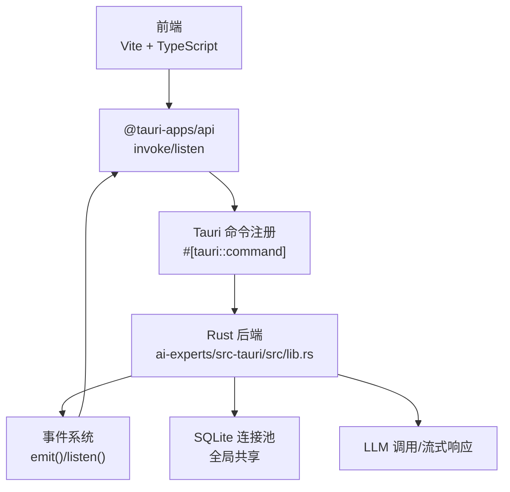
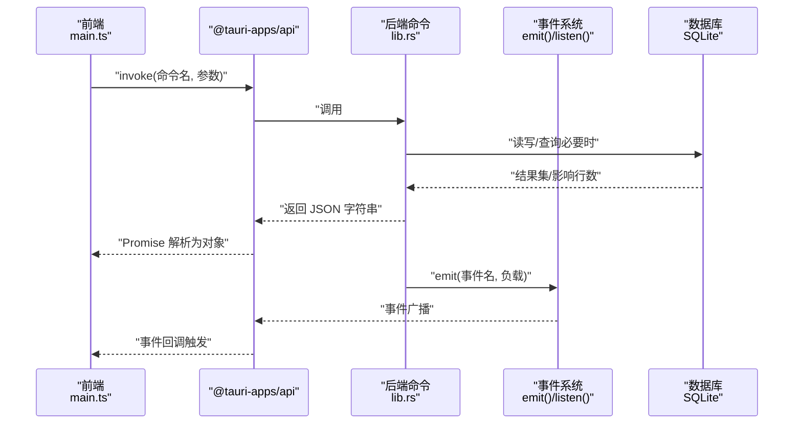
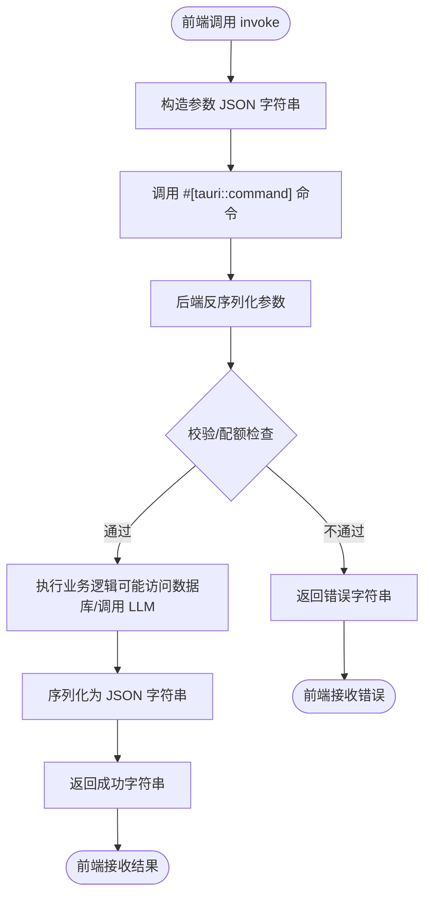
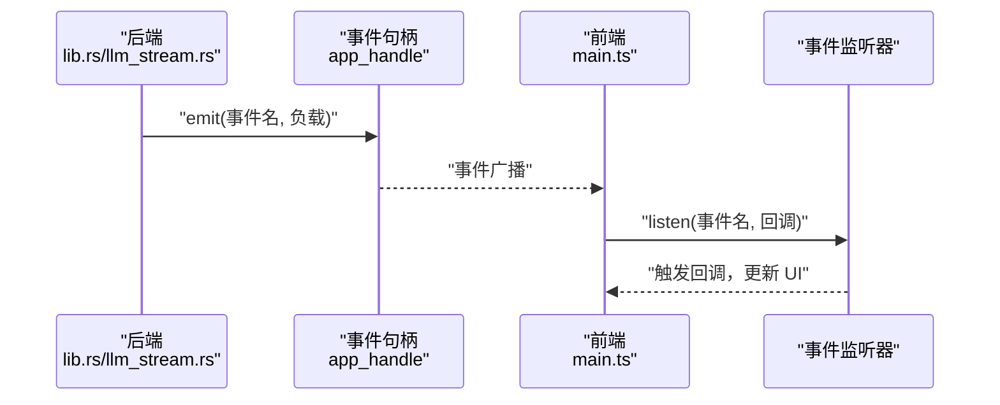
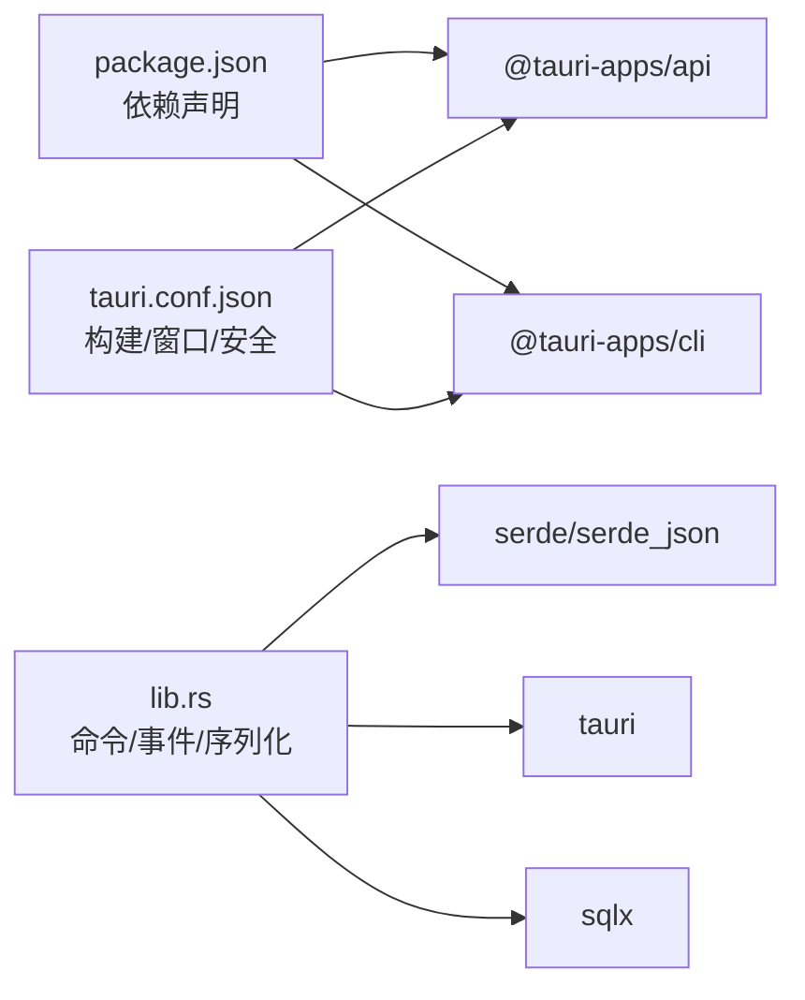

# 前后端通信机制

<cite>
**本文引用的文件**
- [ai-experts/src-tauri/tauri.conf.json](file://ai-experts/src-tauri/tauri.conf.json)
- [ai-experts/src-tauri/src/main.rs](file://ai-experts/src-tauri/src/main.rs)
- [ai-experts/src-tauri/src/lib.rs](file://ai-experts/src-tauri/src/lib.rs)
- [ai-experts/src-tauri/src/llm_stream.rs](file://ai-experts/src-tauri/src/llm_stream.rs)
- [ai-experts/package.json](file://ai-experts/package.json)
- [ai-experts/src/main.ts](file://ai-experts/src/main.ts)
</cite>

## 目录
1. [引言](#引言)
2. [项目结构](#项目结构)
3. [核心组件](#核心组件)
4. [架构总览](#架构总览)
5. [详细组件分析](#详细组件分析)
6. [依赖关系分析](#依赖关系分析)
7. [性能考量](#性能考量)
8. [故障排查指南](#故障排查指南)
9. [结论](#结论)
10. [附录](#附录)

## 引言
本文件面向“星图专家团工作台（社区版）”项目的前后端通信机制，围绕 Tauri 命令接口与 IPC（进程间通信）协议展开，系统性说明命令注册、参数传递、返回值处理、错误处理、事件推送、消息格式与序列化、以及典型业务场景（专家任务执行、工具调用、记忆查询）的实现策略。文档同时覆盖异步通信、批量操作与实时更新的实践方法，帮助开发者快速理解并扩展通信能力。

## 项目结构
该工程采用 Tauri + Vite 的混合架构：
- 前端位于 ai-experts/src，使用 TypeScript/Vite 构建，通过 @tauri-apps/api 提供的 invoke 与事件监听能力与后端通信。
- 后端位于 ai-experts/src-tauri，使用 Rust 实现，通过 #[tauri::command] 注册命令，通过 emit 推送事件。
- 配置文件 tauri.conf.json 控制窗口、构建流程与安全策略。

图表来源
- [ai-experts/src-tauri/tauri.conf.json:1-38](file://ai-experts/src-tauri/tauri.conf.json#L1-L38)
- [ai-experts/src-tauri/src/main.rs:1-6](file://ai-experts/src-tauri/src/main.rs#L1-L6)
- [ai-experts/src-tauri/src/lib.rs:1-800](file://ai-experts/src-tauri/src/lib.rs#L1-L800)
- [ai-experts/src/main.ts:1-800](file://ai-experts/src/main.ts#L1-L800)

章节来源
- [ai-experts/src-tauri/tauri.conf.json:1-38](file://ai-experts/src-tauri/tauri.conf.json#L1-L38)
- [ai-experts/src-tauri/src/main.rs:1-6](file://ai-experts/src-tauri/src/main.rs#L1-L6)
- [ai-experts/src-tauri/src/lib.rs:1-800](file://ai-experts/src-tauri/src/lib.rs#L1-L800)
- [ai-experts/src/main.ts:1-800](file://ai-experts/src/main.ts#L1-L800)

## 核心组件
- 前端通信入口
  - invoke：用于同步/异步调用后端命令，参数与返回值均以 JSON 字符串形式传递。
  - listen：订阅后端通过 emit 推送的事件，实现状态更新的实时推送。
- 后端命令注册
  - 使用 #[tauri::command] 宏注册命令，支持同步与异步函数，返回 Result<String, String> 以统一错误处理。
  - 参数与返回值通过 serde_json 序列化为字符串，便于跨语言传输。
- 事件系统
  - 后端通过 app_handle.emit 发送事件，前端通过 listen 订阅，实现双向实时通信。
- 数据与上下文
  - 全局数据库连接池（应用级共享），用于持久化与查询。
  - 令牌用量追踪上下文（项目/用户级别），用于配额与计费统计。

章节来源
- [ai-experts/src/main.ts:1-800](file://ai-experts/src/main.ts#L1-L800)
- [ai-experts/src-tauri/src/lib.rs:1-800](file://ai-experts/src-tauri/src/lib.rs#L1-L800)

## 架构总览
下图展示从前端到后端再到事件系统的整体交互：

图表来源
- [ai-experts/src/main.ts:1-800](file://ai-experts/src/main.ts#L1-L800)
- [ai-experts/src-tauri/src/lib.rs:1-800](file://ai-experts/src-tauri/src/lib.rs#L1-L800)

## 详细组件分析

### 命令接口与注册机制
- 命令注册
  - 后端在 lib.rs 中使用 #[tauri::command] 宏声明命令函数，例如 supervisor_analyze_dispatch、supervisor_review_delivery 等。
  - 命令函数签名支持 async 与同步两种，返回 Result<String, String>，内部通过 serde_json 将结构体序列化为字符串返回给前端。
- 参数传递
  - 前端通过 invoke 传入 JSON 字符串，后端将其反序列化为强类型结构体（如 Vec、结构体等）。
  - 对于大文本或复杂对象，推荐以 JSON 字符串传递，避免二进制或大对象直接跨边界带来的性能与稳定性问题。
- 返回值处理
  - 后端统一返回 JSON 字符串，前端收到后自行解析为对象，便于 UI 层消费。
- 错误处理
  - 后端使用 Result<String, String> 表达错误，前端捕获异常并展示或重试。
  - 对于解析失败、权限不足、配额限制等情况，后端在命令内部进行校验并返回明确错误信息。

图表来源
- [ai-experts/src-tauri/src/lib.rs:707-800](file://ai-experts/src-tauri/src/lib.rs#L707-L800)
- [ai-experts/src/main.ts:1-800](file://ai-experts/src/main.ts#L1-L800)

章节来源
- [ai-experts/src-tauri/src/lib.rs:707-800](file://ai-experts/src-tauri/src/lib.rs#L707-L800)
- [ai-experts/src/main.ts:1-800](file://ai-experts/src/main.ts#L1-L800)

### IPC 协议与消息格式
- 消息格式
  - 前后端之间以 JSON 字符串作为消息载体，参数与返回值均遵循该约定。
  - 结构体字段采用 camelCase，确保与前端一致。
- 序列化方式
  - 后端使用 serde_json::to_string 进行序列化，前端使用 JSON.parse 解析。
- 数据传输优化
  - 大对象建议分片或延迟加载，避免一次性传输造成卡顿。
  - 对频繁更新的数据采用事件推送（见事件系统），减少轮询成本。

章节来源
- [ai-experts/src-tauri/src/lib.rs:1-800](file://ai-experts/src-tauri/src/lib.rs#L1-L800)
- [ai-experts/src/main.ts:1-800](file://ai-experts/src/main.ts#L1-L800)

### 事件系统与实时更新
- 事件推送
  - 后端通过 app_handle.emit 发送事件，前端通过 listen 订阅，实现状态变更的实时通知。
  - 示例：在 LLM 流式响应中，后端多次 emit 事件，前端逐步渲染输出。
- 事件负载
  - 事件负载通常为 JSON 字符串或结构化对象，前端解析后更新 UI 或状态管理。
- 事件命名
  - 建议采用语义化命名，如“pipeline-progress”、“expert-tool-event”等，便于前端统一处理。

图表来源
- [ai-experts/src-tauri/src/llm_stream.rs:95-332](file://ai-experts/src-tauri/src/llm_stream.rs#L95-L332)
- [ai-experts/src/main.ts:1-800](file://ai-experts/src/main.ts#L1-L800)

章节来源
- [ai-experts/src-tauri/src/llm_stream.rs:95-332](file://ai-experts/src-tauri/src/llm_stream.rs#L95-L332)
- [ai-experts/src/main.ts:1-800](file://ai-experts/src/main.ts#L1-L800)

### 典型业务场景实现方案

#### 专家任务执行
- 前端
  - 通过 invoke 调用专家任务启动/继续/结束相关命令，传递会话请求与令牌上下文。
  - 订阅任务进度事件，实时更新 UI。
- 后端
  - 在 lib.rs 中实现专家任务生命周期命令，访问数据库与 LLM，最终 emit 任务状态事件。
- 数据流
  - 前端 -> invoke -> 后端命令 -> 数据库/LLM -> emit 事件 -> 前端更新。

章节来源
- [ai-experts/src-tauri/src/lib.rs:274-302](file://ai-experts/src-tauri/src/lib.rs#L274-L302)
- [ai-experts/src/main.ts:1-800](file://ai-experts/src/main.ts#L1-L800)

#### 工具调用
- 前端
  - 触发工具调用命令，传递调用参数与授权上下文。
  - 订阅工具事件，展示调用结果与状态。
- 后端
  - 在工具引擎模块中执行命令，通过事件系统上报调用过程与结果。
- 实时反馈
  - 通过 emit 推送工具事件，前端即时呈现。

章节来源
- [ai-experts/src-tauri/src/lib.rs:243-245](file://ai-experts/src-tauri/src/lib.rs#L243-L245)
- [ai-experts/src-tauri/src/llm_stream.rs:95-332](file://ai-experts/src-tauri/src/llm_stream.rs#L95-L332)

#### 记忆查询
- 前端
  - 调用记忆查询命令，传入项目标识与查询文本。
  - 解析返回的记忆结果并展示。
- 后端
  - 在内存模块中执行查询，返回结构化结果，前端解析渲染。

章节来源
- [ai-experts/src-tauri/src/lib.rs:378-392](file://ai-experts/src-tauri/src/lib.rs#L378-L392)
- [ai-experts/src/main.ts:1-800](file://ai-experts/src/main.ts#L1-L800)

### 异步通信、批量操作与实时更新策略
- 异步通信
  - 后端命令支持 async，前端通过 Promise/await 获取结果，避免阻塞 UI。
- 批量操作
  - 将多个小命令合并为一次 invoke，或通过事件批量推送，减少往返次数。
- 实时更新
  - 使用事件系统推送增量状态，前端局部更新，降低全量刷新成本。

章节来源
- [ai-experts/src-tauri/src/lib.rs:733-788](file://ai-experts/src-tauri/src/lib.rs#L733-L788)
- [ai-experts/src-tauri/src/llm_stream.rs:95-332](file://ai-experts/src-tauri/src/llm_stream.rs#L95-L332)

## 依赖关系分析
- 前端依赖
  - @tauri-apps/api：提供 invoke 与事件监听能力。
  - @tauri-apps/cli：构建与打包 Tauri 应用。
- 后端依赖
  - tauri：命令注册与事件系统。
  - serde/serde_json：序列化与反序列化。
  - sqlx：SQLite 连接池与查询。
  - regex/base64：通用工具与编码。
- 配置依赖
  - tauri.conf.json：开发/构建 URL、窗口属性、图标与安全策略。

图表来源
- [ai-experts/package.json:1-28](file://ai-experts/package.json#L1-L28)
- [ai-experts/src-tauri/tauri.conf.json:1-38](file://ai-experts/src-tauri/tauri.conf.json#L1-L38)
- [ai-experts/src-tauri/src/lib.rs:1-800](file://ai-experts/src-tauri/src/lib.rs#L1-L800)

章节来源
- [ai-experts/package.json:1-28](file://ai-experts/package.json#L1-L28)
- [ai-experts/src-tauri/tauri.conf.json:1-38](file://ai-experts/src-tauri/tauri.conf.json#L1-L38)
- [ai-experts/src-tauri/src/lib.rs:1-800](file://ai-experts/src-tauri/src/lib.rs#L1-L800)

## 性能考量
- 序列化与反序列化
  - 保持参数与返回值结构简单，避免深层嵌套与超大对象。
- 事件频率控制
  - 对高频事件采用节流/去抖策略，避免 UI 抖动与主线程压力。
- 数据库访问
  - 合理使用连接池，避免长事务与重复查询；对热点数据做缓存。
- LLM 调用
  - 对长文本进行分段处理，必要时采用流式响应并通过事件逐步推送。

## 故障排查指南
- 常见错误
  - 参数解析失败：检查前端传参是否为合法 JSON 字符串，后端是否正确反序列化。
  - 权限/配额限制：后端会在命令中进行配额检查，返回明确原因。
  - 事件未到达：确认事件名一致且前端已正确 listen。
- 排查步骤
  - 前端：打印 invoke 的参数与返回值，定位序列化问题。
  - 后端：在命令入口与关键节点增加日志，检查数据库/LLM 调用链路。
  - 事件：确认 app_handle.emit 的事件名与负载格式，前端监听是否生效。

章节来源
- [ai-experts/src-tauri/src/lib.rs:321-338](file://ai-experts/src-tauri/src/lib.rs#L321-L338)
- [ai-experts/src-tauri/src/llm_stream.rs:95-332](file://ai-experts/src-tauri/src/llm_stream.rs#L95-L332)
- [ai-experts/src/main.ts:1-800](file://ai-experts/src/main.ts#L1-L800)

## 结论
本项目通过 Tauri 命令与事件系统实现了稳定高效的前后端通信：命令接口统一了参数与返回值格式，事件系统保障了实时状态更新。配合 serde_json 的序列化与 sqlite 连接池，满足了专家任务、工具调用与记忆查询等核心场景。建议在实际扩展中遵循本文的格式规范与性能策略，确保通信的可靠性与可维护性。

## 附录
- 命令定义示例（路径）
  - 专家任务启动请求：[ai-experts/src-tauri/src/lib.rs:274-278](file://ai-experts/src-tauri/src/lib.rs#L274-L278)
  - 专家任务继续请求：[ai-experts/src-tauri/src/lib.rs:282-286](file://ai-experts/src-tauri/src/lib.rs#L282-L286)
  - 专家任务结束请求：[ai-experts/src-tauri/src/lib.rs:290-302](file://ai-experts/src-tauri/src/lib.rs#L290-L302)
  - 主管分析派发命令：[ai-experts/src-tauri/src/lib.rs:733-788](file://ai-experts/src-tauri/src/lib.rs#L733-L788)
- 事件推送示例（路径）
  - LLM 流式事件推送：[ai-experts/src-tauri/src/llm_stream.rs:95-332](file://ai-experts/src-tauri/src/llm_stream.rs#L95-L332)
- 前端调用示例（路径）
  - invoke 与 listen 使用：[ai-experts/src/main.ts:1-800](file://ai-experts/src/main.ts#L1-L800)