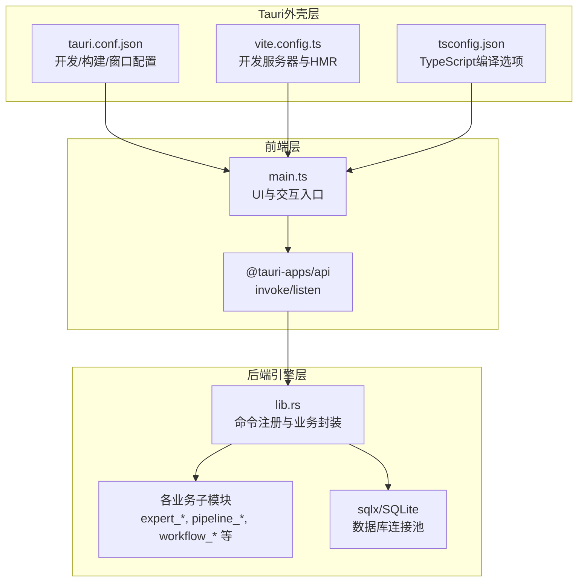
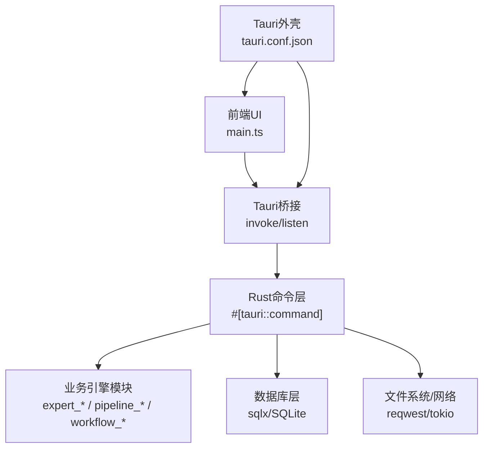
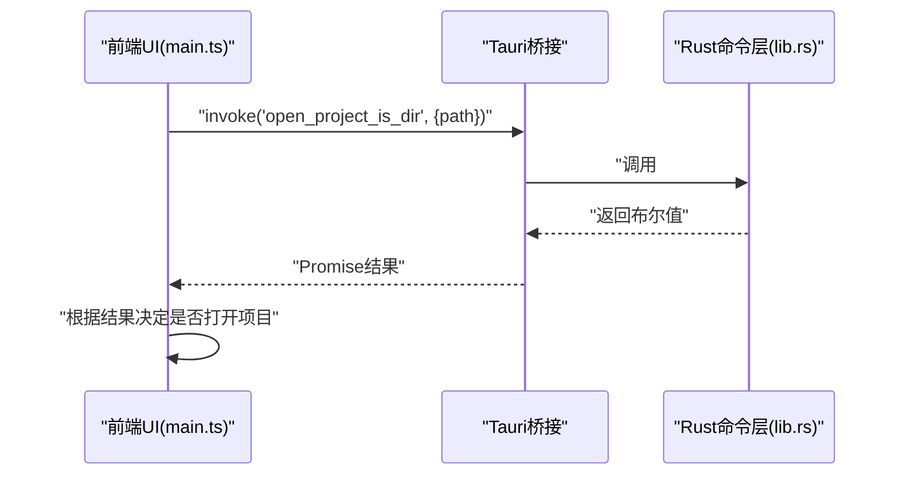
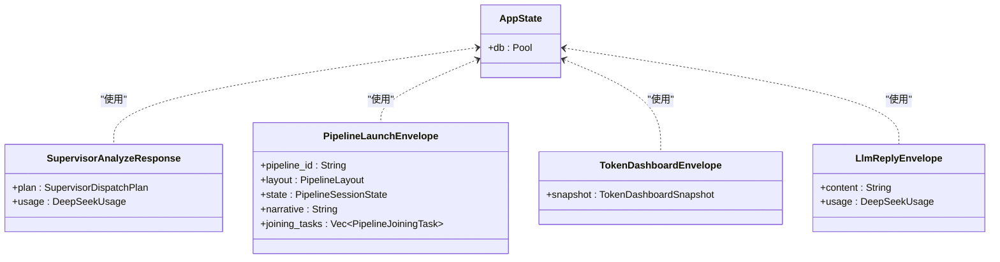
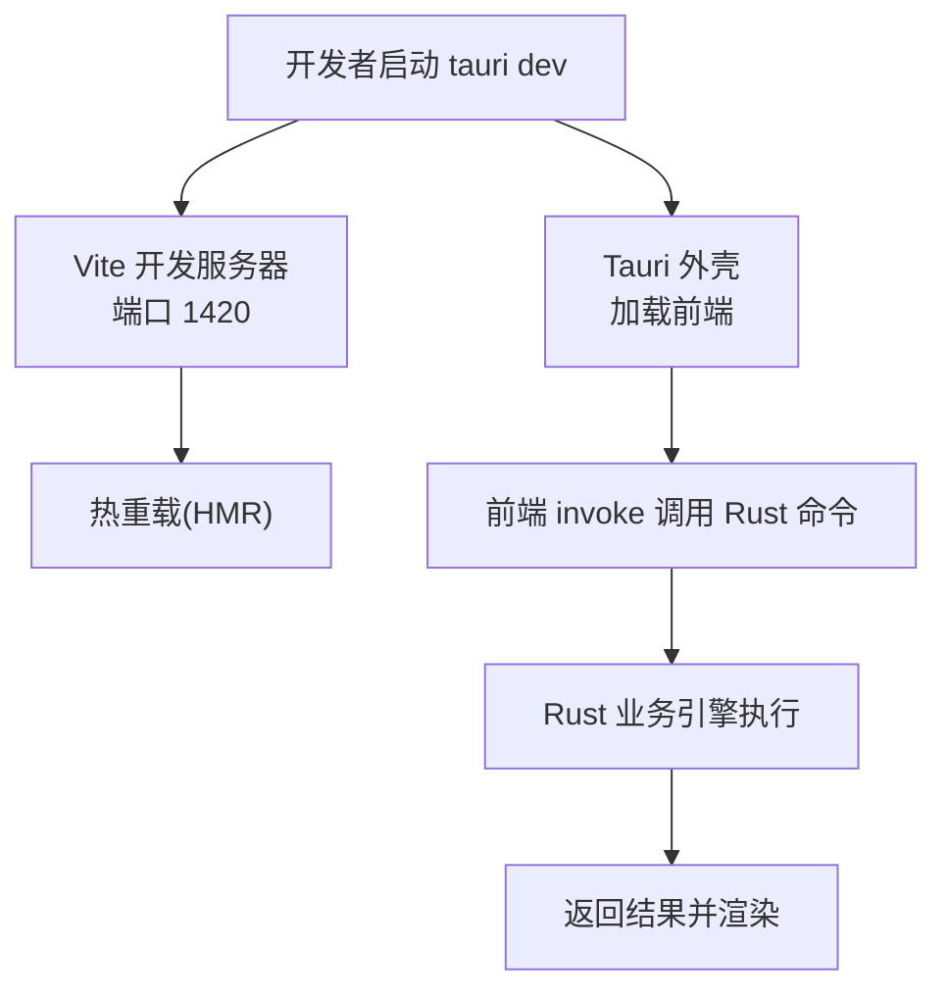
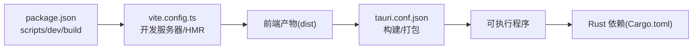

# 整体架构模式

<cite>
**本文引用的文件**
- [package.json](file://ai-experts/package.json)
- [vite.config.ts](file://ai-experts/vite.config.ts)
- [tsconfig.json](file://ai-experts/tsconfig.json)
- [tauri.conf.json](file://ai-experts/src-tauri/tauri.conf.json)
- [Cargo.toml](file://ai-experts/src-tauri/Cargo.toml)
- [main.rs](file://ai-experts/src-tauri/src/main.rs)
- [lib.rs](file://ai-experts/src-tauri/src/lib.rs)
- [main.ts](file://ai-experts/src/main.ts)
</cite>

## 目录
1. [引言](#引言)
2. [项目结构](#项目结构)
3. [核心组件](#核心组件)
4. [架构总览](#架构总览)
5. [详细组件分析](#详细组件分析)
6. [依赖分析](#依赖分析)
7. [性能考虑](#性能考虑)
8. [故障排查指南](#故障排查指南)
9. [结论](#结论)
10. [附录](#附录)

## 引言
本文件面向“星图专家团工作台”的整体架构模式，系统性阐述三层混合架构的设计与实现：前端 Web 技术栈（TypeScript/JavaScript）、Rust 后端引擎与 Tauri 外壳。文档重点解释：
- 前端 UI 组件与交互层如何通过 Tauri 桥接调用 Rust 命令；
- Rust 层如何承载业务逻辑、数据持久化与系统集成；
- Tauri 如何作为跨平台外壳，统一窗口、系统权限与资源管理；
- 微服务化模块化设计在引擎子系统中的落地；
- 事件驱动与分层架构在代码组织中的体现；
- 架构决策的技术考量、性能优化策略与扩展性设计原则。

## 项目结构
项目采用“前端 + Tauri 外壳 + Rust 引擎”的三层分离结构：
- 前端层：Vite + TypeScript，负责 UI、事件与交互，通过 @tauri-apps/api 调用后端命令；
- Tauri 外壳层：tauri.conf.json 配置开发/构建流程、窗口与安全策略，桥接前端与 Rust；
- 后端引擎层：Rust crate，提供命令接口、业务引擎与数据访问，模块化分布在多个子模块。

图表来源
- [main.ts:1-258](file://ai-experts/src/main.ts#L1-L258)
- [tauri.conf.json:1-38](file://ai-experts/src-tauri/tauri.conf.json#L1-L38)
- [vite.config.ts:1-31](file://ai-experts/vite.config.ts#L1-L31)
- [tsconfig.json:1-24](file://ai-experts/tsconfig.json#L1-L24)
- [lib.rs:1-52](file://ai-experts/src-tauri/src/lib.rs#L1-L52)
- [Cargo.toml:1-46](file://ai-experts/src-tauri/Cargo.toml#L1-L46)

章节来源
- [package.json:1-28](file://ai-experts/package.json#L1-L28)
- [vite.config.ts:1-31](file://ai-experts/vite.config.ts#L1-L31)
- [tsconfig.json:1-24](file://ai-experts/tsconfig.json#L1-L24)
- [tauri.conf.json:1-38](file://ai-experts/src-tauri/tauri.conf.json#L1-L38)
- [Cargo.toml:1-46](file://ai-experts/src-tauri/Cargo.toml#L1-L46)
- [main.rs:1-6](file://ai-experts/src-tauri/src/main.rs#L1-L6)
- [lib.rs:1-52](file://ai-experts/src-tauri/src/lib.rs#L1-L52)
- [main.ts:1-258](file://ai-experts/src/main.ts#L1-L258)

## 核心组件
- 前端主入口与交互
  - 负责窗口控制、菜单与视图切换、主题切换、设置页与密钥池管理、拖拽打开项目、事件监听与 UI 渲染等。
  - 通过 invoke 调用后端命令，通过 listen 接收后端事件推送。
- Tauri 配置与开发环境
  - tauri.conf.json 定义开发前置命令、前端构建产物位置、窗口尺寸与装饰、安全策略与打包图标。
  - vite.config.ts 固定开发端口、禁用清屏、屏蔽 src-tauri 监视、启用 HMR（可选主机）。
  - tsconfig.json 使用 bundler 模式，启用严格模式与 JSON 模块解析。
- Rust 引擎与命令层
  - lib.rs 注册大量 #[tauri::command]，封装业务逻辑（如 supervisor 分析、专家任务执行、流水线推进、令牌用量统计等），并定义跨层数据结构。
  - main.rs 作为二进制入口，委托 ai_experts_lib::run() 启动 Tauri 应用。
  - Cargo.toml 声明依赖（tauri、sqlx、reqwest、tokio 等），支持 sqlite、HTTP、异步运行时与插件生态。

章节来源
- [main.ts:1-258](file://ai-experts/src/main.ts#L1-L258)
- [tauri.conf.json:1-38](file://ai-experts/src-tauri/tauri.conf.json#L1-L38)
- [vite.config.ts:1-31](file://ai-experts/vite.config.ts#L1-L31)
- [tsconfig.json:1-24](file://ai-experts/tsconfig.json#L1-L24)
- [main.rs:1-6](file://ai-experts/src-tauri/src/main.rs#L1-L6)
- [lib.rs:1-52](file://ai-experts/src-tauri/src/lib.rs#L1-L52)
- [Cargo.toml:1-46](file://ai-experts/src-tauri/Cargo.toml#L1-L46)

## 架构总览
混合架构优势与实现原理：
- 前端 UI 与交互：快速迭代、组件化与跨平台渲染，通过 Tauri 桥接调用 Rust 命令，获得系统级能力与高性能计算。
- Rust 后端引擎：强类型、内存安全、并发友好，承载复杂业务逻辑、数据持久化与外部系统集成。
- Tauri 外壳：统一跨平台窗口、菜单、对话框、文件系统与系统权限，提供安全沙箱与最小暴露面。

图表来源
- [main.ts:1-258](file://ai-experts/src/main.ts#L1-L258)
- [lib.rs:707-800](file://ai-experts/src-tauri/src/lib.rs#L707-L800)
- [tauri.conf.json:1-38](file://ai-experts/src-tauri/tauri.conf.json#L1-L38)
- [Cargo.toml:20-46](file://ai-experts/src-tauri/Cargo.toml#L20-L46)

## 详细组件分析

### 前端组件与交互（main.ts）
- 窗口控制与拖拽：最小化、最大化、关闭与拖拽区域，提升原生体验。
- 菜单与视图：下拉菜单、视图切换、设置页打开/关闭与状态保存。
- 项目打开：拖拽文件夹触发 invoke("open_project_is_dir") 并交由后端判断是否为项目根。
- 主题切换：动态更新 CSS 变量与元素样式，支持深色/浅色模式。
- 设置页：密钥池加载与渲染、专家数据加载、主题开关同步。
- 事件与日志：统一日志输出，便于调试与问题定位。

图表来源
- [main.ts:230-248](file://ai-experts/src/main.ts#L230-L248)
- [lib.rs:707-714](file://ai-experts/src-tauri/src/lib.rs#L707-L714)

章节来源
- [main.ts:150-258](file://ai-experts/src/main.ts#L150-L258)

### Rust 命令层与业务封装（lib.rs）
- 命令注册：大量 #[tauri::command] 将 Rust 函数暴露给前端调用，涵盖 supervisor 分析、专家任务执行、流水线推进、令牌用量统计、工具执行、网页搜索等。
- 数据结构：围绕 Supervisor、Pipeline、Expert、TokenRuntime 等领域对象定义序列化结构，确保前后端契约稳定。
- 上下文拼装：构建当前项目上下文、通用记忆上下文、工作区预检上下文，辅助 LLM 决策。
- 令牌与配额：提供配额检查、用量追加与仪表盘快照，支撑成本控制与可视化。

图表来源
- [lib.rs:54-122](file://ai-experts/src-tauri/src/lib.rs#L54-L122)

章节来源
- [lib.rs:54-122](file://ai-experts/src-tauri/src/lib.rs#L54-L122)

### Tauri 外壳与开发配置（tauri.conf.json、vite.config.ts、tsconfig.json）
- 开发流程：beforeDevCommand 指向前端 dev，devUrl 固定到 1420；构建产物指向 ../dist。
- 窗口与装饰：标题、尺寸、去装饰窗口以适配自绘 UI。
- 安全策略：CSP 置空（开发期），生产期可根据需要收紧。
- Vite 配置：固定端口、严格端口、HMR（可选主机）、忽略 src-tauri 监视。
- TypeScript：bundler 模式、严格模式、JSON 模块解析。

图表来源
- [tauri.conf.json:6-11](file://ai-experts/src-tauri/tauri.conf.json#L6-L11)
- [vite.config.ts:14-29](file://ai-experts/vite.config.ts#L14-L29)
- [main.ts:1-20](file://ai-experts/src/main.ts#L1-L20)

章节来源
- [tauri.conf.json:1-38](file://ai-experts/src-tauri/tauri.conf.json#L1-L38)
- [vite.config.ts:1-31](file://ai-experts/vite.config.ts#L1-L31)
- [tsconfig.json:1-24](file://ai-experts/tsconfig.json#L1-L24)

### 微服务化模块化设计
- 模块划分：expert_*、pipeline_*、workflow_*、tool_*、memory、token_runtime_engine 等子模块分别承担专家调度、流水线、工作流、工具系统、记忆与令牌运行时等职责。
- 职责边界：每个模块聚焦单一领域，通过 lib.rs 的命令层进行编排与数据传递，降低耦合度。
- 可替换性：模块间通过清晰的数据契约（结构体与枚举）交互，便于替换实现或扩展新模块。

章节来源
- [lib.rs:14-52](file://ai-experts/src-tauri/src/lib.rs#L14-L52)
- [Cargo.toml:20-46](file://ai-experts/src-tauri/Cargo.toml#L20-L46)

### 事件驱动架构与组件通信
- 前端事件：通过 @tauri-apps/api 的 listen 订阅后端推送事件，实现 UI 与业务状态的解耦。
- 后端事件：引擎模块在执行过程中产生中间状态与结果，通过封装结构体（如 ExpertToolPlanEnvelope、PipelineProgressEnvelope 等）回传前端。
- 通信模式：命令调用（request/response）与事件推送（push）相结合，满足实时反馈与长耗时任务场景。

章节来源
- [main.ts:1-40](file://ai-experts/src/main.ts#L1-L40)
- [lib.rs:223-245](file://ai-experts/src-tauri/src/lib.rs#L223-L245)

### 分层架构在代码组织中的体现
- 表现层（前端）：UI 组件、交互逻辑、主题与设置。
- 协调层（Tauri）：开发配置、窗口与安全策略、命令桥接。
- 业务层（Rust）：命令注册、领域模型、业务引擎与数据访问。
- 基础设施层（系统）：文件系统、网络、数据库、异步运行时。

章节来源
- [main.ts:1-258](file://ai-experts/src/main.ts#L1-L258)
- [lib.rs:1-52](file://ai-experts/src-tauri/src/lib.rs#L1-L52)
- [tauri.conf.json:1-38](file://ai-experts/src-tauri/tauri.conf.json#L1-L38)
- [Cargo.toml:1-46](file://ai-experts/src-tauri/Cargo.toml#L1-L46)

## 依赖分析
- 前端依赖：@tauri-apps/api、@tauri-apps 插件（dialog、opener）、highlight.js。
- Rust 依赖：tauri、sqlx（sqlite+tokio）、reqwest（json/stream）、tokio（多线程/时间/进程/io-util）、serde/serde_json、uuid、dirs、regex、scraper、calamine/docx-rs/lopdf/csv 等。
- 构建链路：package.json 中 scripts 指向 Vite 与 Tauri CLI；vite.config.ts 固定开发端口；tauri.conf.json 指定前端构建产物目录。

图表来源
- [package.json:6-13](file://ai-experts/package.json#L6-L13)
- [vite.config.ts:1-31](file://ai-experts/vite.config.ts#L1-L31)
- [tauri.conf.json:6-11](file://ai-experts/src-tauri/tauri.conf.json#L6-L11)
- [Cargo.toml:20-46](file://ai-experts/src-tauri/Cargo.toml#L20-L46)

章节来源
- [package.json:1-28](file://ai-experts/package.json#L1-L28)
- [Cargo.toml:1-46](file://ai-experts/src-tauri/Cargo.toml#L1-L46)

## 性能考虑
- 前端性能
  - 使用 Vite 的 HMR 与严格端口，减少开发时的资源浪费与端口冲突。
  - TypeScript 编译器选项启用严格模式，提前发现潜在性能与类型问题。
- 后端性能
  - 使用 tokio 多线程运行时与 futures-util，提升并发与 I/O 吞吐。
  - sqlx 提供类型安全的 SQLite 访问，配合连接池降低数据库开销。
  - reqwest 支持流式与 multipart，适合大文件上传与响应处理。
- 架构性能
  - 命令调用与事件推送分离，避免阻塞 UI 线程。
  - 模块化设计便于缓存与懒加载，降低冷启动成本。

章节来源
- [vite.config.ts:12-29](file://ai-experts/vite.config.ts#L12-L29)
- [tsconfig.json:17-21](file://ai-experts/tsconfig.json#L17-L21)
- [Cargo.toml:27-29](file://ai-experts/src-tauri/Cargo.toml#L27-L29)

## 故障排查指南
- 开发端口占用
  - 确认 vite.config.ts 中 server.port=1420 且 strictPort=true，避免端口漂移导致的 HMR 失败。
- 前端构建产物路径
  - tauri.conf.json 中 frontendDist 指向 ../dist，需确保构建脚本输出到该目录。
- 命令调用失败
  - 检查 main.ts 中 invoke 调用与 lib.rs 中 #[tauri::command] 名称一致，参数与返回类型匹配。
- 数据库连接
  - AppState 持有全局数据库连接池，确认初始化与异常处理逻辑覆盖。
- 权限与安全
  - tauri.conf.json 中 CSP 置空用于开发，生产期建议按需收紧；插件（dialog、opener）按需启用。

章节来源
- [vite.config.ts:14-29](file://ai-experts/vite.config.ts#L14-L29)
- [tauri.conf.json:6-11](file://ai-experts/src-tauri/tauri.conf.json#L6-L11)
- [lib.rs:54-57](file://ai-experts/src-tauri/src/lib.rs#L54-L57)

## 结论
本项目通过“前端 + Tauri + Rust 引擎”的混合架构，实现了高性能、可维护与可扩展的工作台系统。前端负责用户体验与交互，Rust 提供强健的业务能力与系统集成，Tauri 作为外壳统一跨平台体验。模块化与事件驱动进一步提升了系统的灵活性与可演进性。建议在生产环境中完善 CSP、插件权限与监控埋点，持续优化数据库索引与网络超时策略，以保障稳定性与可观测性。

## 附录
- 架构决策要点
  - 选择 Tauri 作为外壳，兼顾原生体验与跨平台部署。
  - Rust 命令层集中暴露能力，前端通过 invoke/listen 与之通信，降低耦合。
  - 模块化拆分业务域，命令层统一编排，便于测试与替换。
- 扩展性设计原则
  - 明确模块边界与数据契约，新增模块遵循现有结构体命名与序列化规范。
  - 事件推送与命令调用双通道并行，满足不同场景的实时性要求。
  - 数据库与网络访问抽象化，便于替换实现与压测。