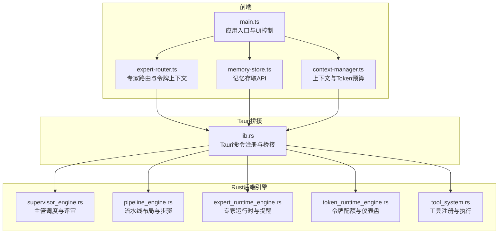
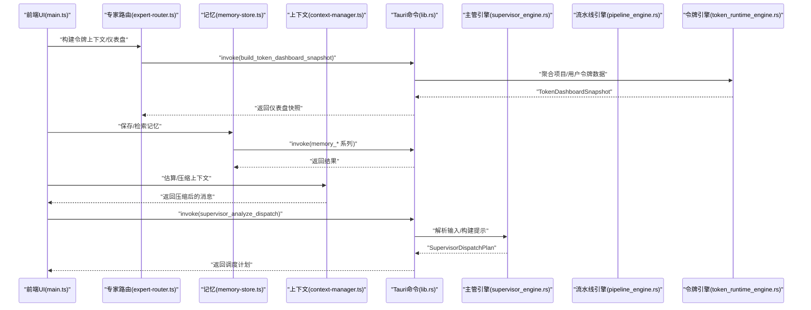
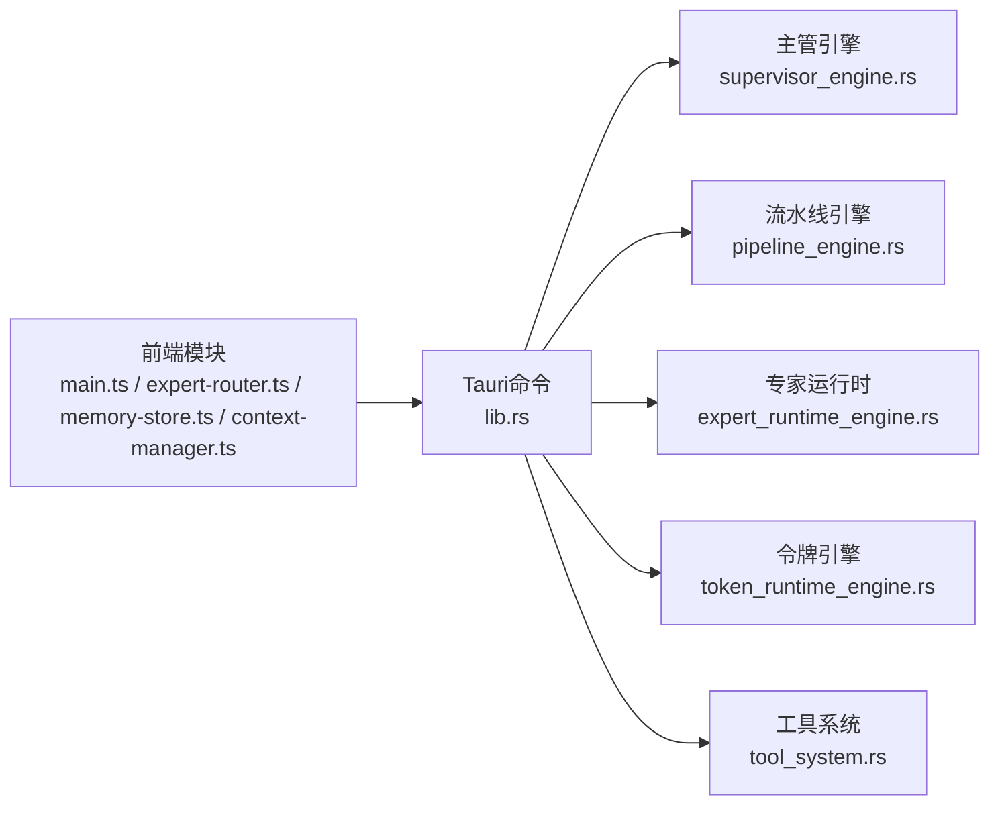

# 模块化设计与依赖关系

<cite>
**本文档引用的文件**
- [main.ts](file://ai-experts/src/main.ts)
- [expert-router.ts](file://ai-experts/src/expert-router.ts)
- [memory-store.ts](file://ai-experts/src/memory-store.ts)
- [context-manager.ts](file://ai-experts/src/context-manager.ts)
- [lib.rs](file://ai-experts/src-tauri/src/lib.rs)
- [Cargo.toml](file://ai-experts/src-tauri/Cargo.toml)
- [supervisor_engine.rs](file://ai-experts/src-tauri/src/supervisor_engine.rs)
- [pipeline_engine.rs](file://ai-experts/src-tauri/src/pipeline_engine.rs)
- [expert_runtime_engine.rs](file://ai-experts/src-tauri/src/expert_runtime_engine.rs)
- [token_runtime_engine.rs](file://ai-experts/src-tauri/src/token_runtime_engine.rs)
- [tool_system.rs](file://ai-experts/src-tauri/src/tool_system.rs)
- [package.json](file://ai-experts/package.json)
- [vite.config.ts](file://ai-experts/vite.config.ts)
</cite>

## 目录
1. [引言](#引言)
2. [项目结构](#项目结构)
3. [核心组件](#核心组件)
4. [架构总览](#架构总览)
5. [详细组件分析](#详细组件分析)
6. [依赖分析](#依赖分析)
7. [性能考量](#性能考量)
8. [故障排查指南](#故障排查指南)
9. [结论](#结论)
10. [附录](#附录)

## 引言
本文件面向“星图专家团工作台（社区版）”项目，系统化梳理前后端模块化设计与依赖关系，重点覆盖：
- Rust后端模块组织与职责边界
- 前端模块的导入导出机制、组件通信与状态共享
- 依赖注入模式的应用与接口抽象
- 模块间接口契约、数据流转与错误传播
- 模块依赖图、接口定义规范与最佳实践
- 模块扩展与插件化方案
- 单元测试、集成测试与模块间测试策略

## 项目结构
项目采用“前端（Vite + Tauri）+ 后端（Rust）”双栈架构，前端通过 Tauri 命令桥接调用后端能力，Rust 模块以领域引擎为核心，围绕“主管引擎、流水线引擎、专家运行时、令牌配额、工具系统”等形成清晰的职责分层。

图表来源
- [main.ts:1-258](file://ai-experts/src/main.ts#L1-L258)
- [expert-router.ts:1-200](file://ai-experts/src/expert-router.ts#L1-L200)
- [memory-store.ts:1-200](file://ai-experts/src/memory-store.ts#L1-L200)
- [context-manager.ts:1-200](file://ai-experts/src/context-manager.ts#L1-L200)
- [lib.rs:1-120](file://ai-experts/src-tauri/src/lib.rs#L1-L120)

章节来源
- [main.ts:1-258](file://ai-experts/src/main.ts#L1-L258)
- [package.json:1-28](file://ai-experts/package.json#L1-L28)
- [vite.config.ts:1-31](file://ai-experts/vite.config.ts#L1-L31)

## 核心组件
- 前端应用入口与UI控制：负责窗口控制、主题切换、设置页、拖拽打开项目、画布初始化等。
- 专家路由与令牌上下文：封装专家选择、令牌配额上下文构建、令牌仪表盘快照、持久化与加载。
- 记忆存取API：提供记忆保存、检索、删除、清理、生命周期管理与统计查询。
- 上下文管理器：估算Token预算、自动压缩上下文、轮次分割与摘要生成。
- Tauri命令桥接：统一注册后端命令，承载前端调用与后端响应的数据交换。
- 主管引擎：构建专家列表提示、派发计划、评审与跟进意图决策。
- 流水线引擎：根据场景与专家集合生成步骤布局、波次派发与去重。
- 专家运行时：工具提醒检测、工具跟进消息组装、意图识别与重试策略。
- 令牌运行时：配额检查、用量追加、仪表盘快照聚合。
- 工具系统：工具定义抽象、注册表、路由分发与内置工具实现。

章节来源
- [expert-router.ts:1-200](file://ai-experts/src/expert-router.ts#L1-L200)
- [memory-store.ts:1-200](file://ai-experts/src/memory-store.ts#L1-L200)
- [context-manager.ts:1-200](file://ai-experts/src/context-manager.ts#L1-L200)
- [lib.rs:1-120](file://ai-experts/src-tauri/src/lib.rs#L1-L120)

## 架构总览
前端通过 Tauri invoke 调用后端命令，后端以模块化引擎处理业务逻辑并通过结构化数据返回。整体遵循“前端UI/状态 + 桥接命令 + 后端引擎”的分层。

图表来源
- [main.ts:1-258](file://ai-experts/src/main.ts#L1-L258)
- [expert-router.ts:120-158](file://ai-experts/src/expert-router.ts#L120-L158)
- [memory-store.ts:40-100](file://ai-experts/src/memory-store.ts#L40-L100)
- [context-manager.ts:50-105](file://ai-experts/src/context-manager.ts#L50-L105)
- [lib.rs:732-788](file://ai-experts/src-tauri/src/lib.rs#L732-L788)
- [supervisor_engine.rs:118-175](file://ai-experts/src-tauri/src/supervisor_engine.rs#L118-L175)
- [token_runtime_engine.rs:181-200](file://ai-experts/src-tauri/src/token_runtime_engine.rs#L181-L200)

## 详细组件分析

### 前端模块：应用入口与UI控制
- 职责：窗口控制、主题切换、菜单交互、拖拽打开项目、画布初始化、设置页管理。
- 依赖：Tauri window/event API、invoke、事件监听、样式资源。
- 通信：通过 invoke 调用后端命令，如打开项目、加载/保存密钥池、令牌数据持久化等。

章节来源
- [main.ts:1-258](file://ai-experts/src/main.ts#L1-L258)

### 前端模块：专家路由与令牌上下文
- 职责：构建主管/专家令牌运行时上下文、仪表盘快照、保存/加载令牌数据、配额阻断消息展示。
- 依赖：前端全局 tokenData、专家目录、Tauri invoke。
- 通信：invoke 后端 build_token_dashboard_snapshot、save/load_token_data 等命令。

章节来源
- [expert-router.ts:1-200](file://ai-experts/src/expert-router.ts#L1-L200)

### 前端模块：记忆存取API
- 职责：记忆条目保存、检索、删除、清理、生命周期管理、统计查询。
- 依赖：Tauri invoke。
- 通信：invoke memory_save/search/delete/clear/run_lifecycle/get_stats 等命令。

章节来源
- [memory-store.ts:1-200](file://ai-experts/src/memory-store.ts#L1-L200)

### 前端模块：上下文管理器
- 职责：估算消息Token、预算检查、自动压缩、轮次摘要、工具输出截断。
- 依赖：无外部依赖，纯算法。
- 通信：直接在前端调用，不涉及 invoke。

章节来源
- [context-manager.ts:1-200](file://ai-experts/src/context-manager.ts#L1-L200)

### 后端模块：Tauri命令桥接
- 职责：集中注册命令、序列化/反序列化数据、调用各引擎模块、错误包装。
- 依赖：各领域引擎模块、Tauri框架。
- 示例命令：supervisor_analyze_dispatch、build_token_dashboard_snapshot、memory_* 系列、verify_workspace_delivery 等。

章节来源
- [lib.rs:707-788](file://ai-experts/src-tauri/src/lib.rs#L707-L788)
- [lib.rs:1-120](file://ai-experts/src-tauri/src/lib.rs#L1-L120)

### 后端模块：主管引擎
- 职责：构建专家提示、派发计划、评审与跟进意图决策、提示词模板。
- 依赖：专家身份与分类、正则匹配、JSON解析。
- 输出：SupervisorDispatchPlan、FollowupIntentDecision、MidCheckDecision 等。

章节来源
- [supervisor_engine.rs:118-175](file://ai-experts/src-tauri/src/supervisor_engine.rs#L118-L175)
- [supervisor_engine.rs:181-192](file://ai-experts/src-tauri/src/supervisor_engine.rs#L181-L192)
- [supervisor_engine.rs:194-200](file://ai-experts/src-tauri/src/supervisor_engine.rs#L194-L200)

### 后端模块：流水线引擎
- 职责：根据场景与专家集合生成步骤布局、波次派发、去重与类型判定。
- 依赖：专家身份分类常量、去重与标签函数。
- 输出：PipelineLayout、PipelineStepLayout、DispatchWaveLayout 等。

章节来源
- [pipeline_engine.rs:107-188](file://ai-experts/src-tauri/src/pipeline_engine.rs#L107-L188)

### 后端模块：专家运行时
- 职责：工具提醒检测、意图识别（搜索/命令/视频）、工具跟进消息组装。
- 依赖：正则表达式、工具上下文。
- 输出：ToolReminderDecision、ToolFollowupMessage。

章节来源
- [expert_runtime_engine.rs:59-114](file://ai-experts/src-tauri/src/expert_runtime_engine.rs#L59-L114)
- [expert_runtime_engine.rs:116-123](file://ai-experts/src-tauri/src/expert_runtime_engine.rs#L116-L123)

### 后端模块：令牌运行时
- 职责：配额检查、用量追加、仪表盘快照聚合。
- 依赖：时间与时序、限额配置、用量汇总。
- 输出：TokenData、TokenDashboardSnapshot、QuotaCheckResponse。

章节来源
- [token_runtime_engine.rs:181-200](file://ai-experts/src-tauri/src/token_runtime_engine.rs#L181-L200)
- [token_runtime_engine.rs:168-179](file://ai-experts/src-tauri/src/token_runtime_engine.rs#L168-L179)

### 后端模块：工具系统
- 职责：工具定义抽象、注册表、路由分发、内置工具实现（Shell、文件、搜索、内存、索引等）。
- 依赖：异步trait、并发安全容器、子模块（如 shell_executor、file_patch）。
- 输出：ToolOutput、ToolError、ToolDefinition。

章节来源
- [tool_system.rs:51-60](file://ai-experts/src-tauri/src/tool_system.rs#L51-L60)
- [tool_system.rs:62-95](file://ai-experts/src-tauri/src/tool_system.rs#L62-L95)
- [tool_system.rs:97-142](file://ai-experts/src-tauri/src/tool_system.rs#L97-L142)

## 依赖分析
- 前端对后端的依赖通过 Tauri invoke 命令实现，命令名与后端注册一一对应，确保调用一致性。
- 后端模块之间通过内部函数与结构体耦合，命令层作为唯一对外接口，降低跨模块耦合。
- 工具系统采用接口抽象与注册表模式，便于扩展新工具而无需改动上层调用方。
- 令牌引擎独立于专家引擎，通过上下文传递实现配额控制与数据聚合。

图表来源
- [lib.rs:1-120](file://ai-experts/src-tauri/src/lib.rs#L1-L120)
- [supervisor_engine.rs:1-50](file://ai-experts/src-tauri/src/supervisor_engine.rs#L1-L50)
- [pipeline_engine.rs:1-50](file://ai-experts/src-tauri/src/pipeline_engine.rs#L1-L50)
- [expert_runtime_engine.rs:1-50](file://ai-experts/src-tauri/src/expert_runtime_engine.rs#L1-L50)
- [token_runtime_engine.rs:1-50](file://ai-experts/src-tauri/src/token_runtime_engine.rs#L1-L50)
- [tool_system.rs:1-50](file://ai-experts/src-tauri/src/tool_system.rs#L1-L50)

章节来源
- [Cargo.toml:20-46](file://ai-experts/src-tauri/Cargo.toml#L20-L46)

## 性能考量
- 前端上下文压缩：通过估算Token预算与自动压缩减少LLM输入规模，提升响应速度与成本控制。
- 后端命令幂等与缓存：对高频查询（如记忆检索、令牌快照）可在命令层引入轻量缓存，避免重复计算。
- 工具执行超时与重试：工具系统支持超时配置与可重试错误，建议在前端统一收敛错误与重试策略。
- 数据序列化：命令参数与返回值采用JSON，注意字段大小与层级，避免过大负载导致序列化开销。

## 故障排查指南
- 前端调用失败：检查 invoke 命令是否在后端注册、参数序列化是否正确、错误是否被包裹为字符串。
- 令牌配额阻断：查看前端 displayQuotaBlockMessage 是否被触发，核对 tokenData 与专家配额配置。
- 记忆检索异常：确认项目名与查询参数，检查 memory_search 返回的JSON格式。
- 上下文溢出：启用 ContextManager 的预算检查与压缩，必要时减少历史轮次或截断工具输出。
- 工具执行失败：根据 ToolError 的 retryable 标记决定是否重试，检查工作目录与权限配置。

章节来源
- [expert-router.ts:84-104](file://ai-experts/src/expert-router.ts#L84-L104)
- [memory-store.ts:50-68](file://ai-experts/src/memory-store.ts#L50-L68)
- [context-manager.ts:92-105](file://ai-experts/src/context-manager.ts#L92-L105)
- [tool_system.rs:43-49](file://ai-experts/src-tauri/src/tool_system.rs#L43-L49)

## 结论
本项目通过“前端UI + Tauri命令桥接 + Rust领域引擎”的模块化架构，实现了清晰的职责分离与良好的扩展性。前端以命令调用后端能力，后端以引擎模块承载复杂业务，工具系统采用接口抽象与注册表模式，令牌引擎独立于专家引擎，便于配额控制与数据聚合。建议在保持现有分层的前提下，进一步完善命令层的错误传播与日志追踪、增强工具系统的权限与审计能力，并在前端引入统一的错误处理与重试策略。

## 附录

### 接口定义规范（建议）
- 命令参数与返回值：统一使用 JSON 对象，字段命名采用 camelCase，必要时提供 JSON Schema。
- 错误约定：后端命令返回字符串错误，前端统一捕获并转换为用户可读提示。
- 状态共享：前端通过全局对象（如 tokenData）与 invoke 持久化，后端通过 AppState 共享数据库连接池。
- 工具接口：ToolExecutor 抽象定义 execute 方法，ToolDefinition 描述参数与权限级别。

章节来源
- [lib.rs:54-57](file://ai-experts/src-tauri/src/lib.rs#L54-L57)
- [tool_system.rs:51-60](file://ai-experts/src-tauri/src/tool_system.rs#L51-L60)

### 模块扩展与插件化方案
- 新增后端引擎：在 lib.rs 中注册新命令，在对应引擎模块实现业务逻辑，保持命令签名稳定。
- 新增前端模块：通过 expert-router.ts 或 memory-store.ts 扩展 API，新增 invoke 命令并与后端对接。
- 工具系统扩展：实现 ToolExecutor trait 并注册到 ToolRegistry，前端通过 get_all_definitions 注入提示词。
- 配额与仪表盘：在 token_runtime_engine.rs 扩展配额类型与聚合逻辑，前端通过 buildTokenDashboardSnapshot 调用。

章节来源
- [lib.rs:707-788](file://ai-experts/src-tauri/src/lib.rs#L707-L788)
- [tool_system.rs:97-142](file://ai-experts/src-tauri/src/tool_system.rs#L97-L142)
- [expert-router.ts:122-158](file://ai-experts/src/expert-router.ts#L122-L158)

### 测试策略
- 单元测试：Rust 模块（如 token_runtime_engine.rs、expert_runtime_engine.rs）使用 #[cfg(test)] 子模块进行断言。
- 集成测试：通过 Tauri CLI 启动应用，调用 invoke 命令验证端到端流程（如 supervisor_analyze_dispatch）。
- 模块间测试：构造前后端命令契约，模拟 invoke 调用与返回值，验证数据流转与错误传播。

章节来源
- [lib.rs:579-601](file://ai-experts/src-tauri/src/lib.rs#L579-L601)
- [expert_runtime_engine.rs:125-175](file://ai-experts/src-tauri/src/expert_runtime_engine.rs#L125-L175)
- [package.json:6-14](file://ai-experts/package.json#L6-L14)