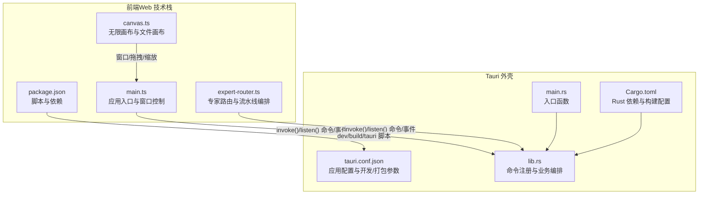
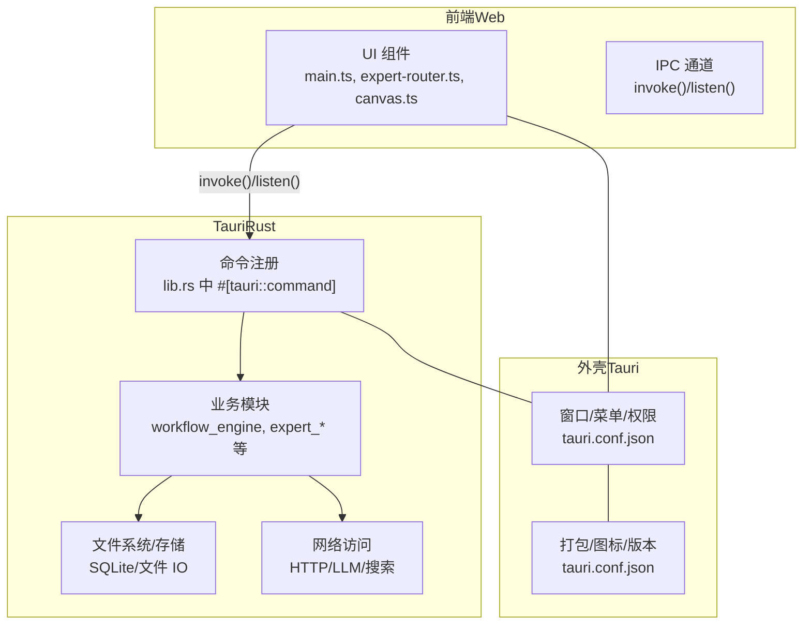
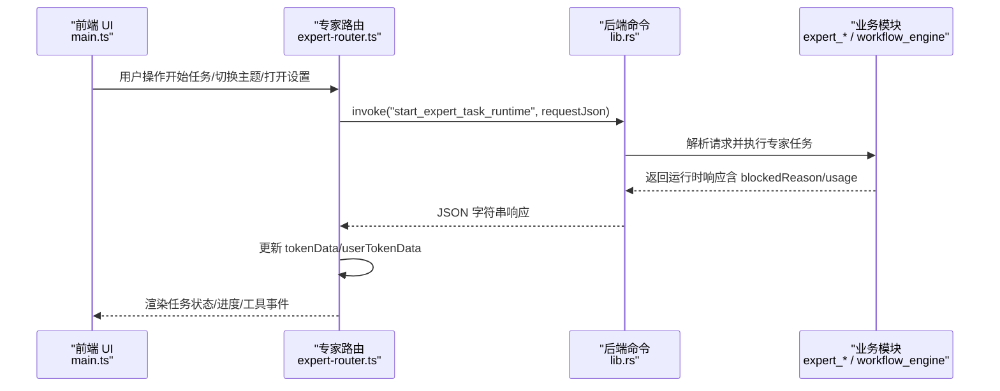
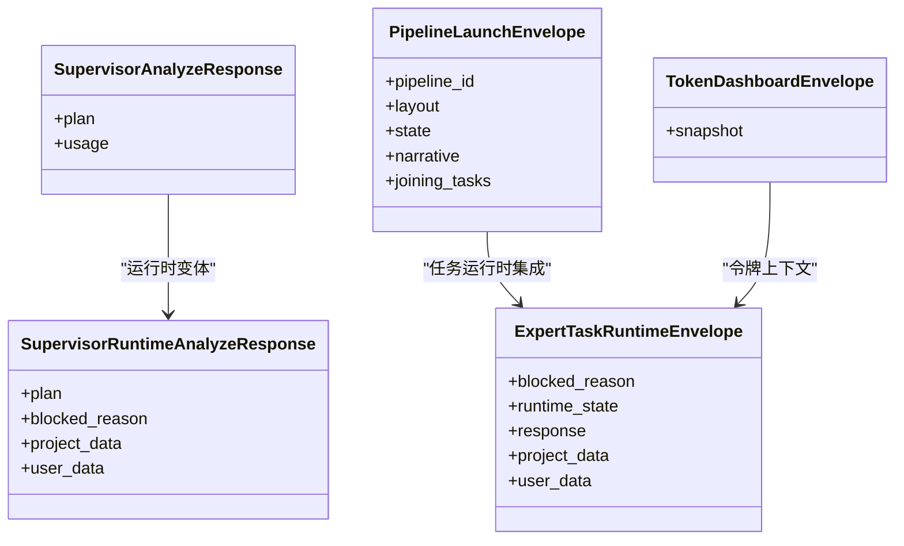
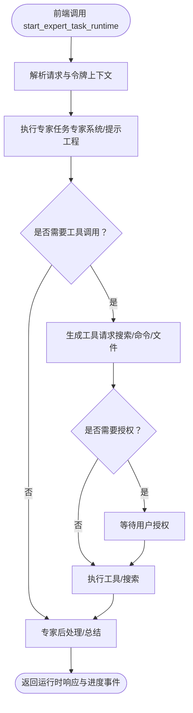
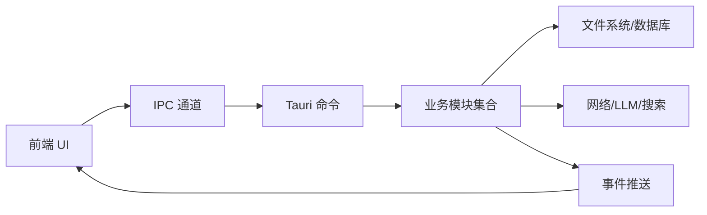
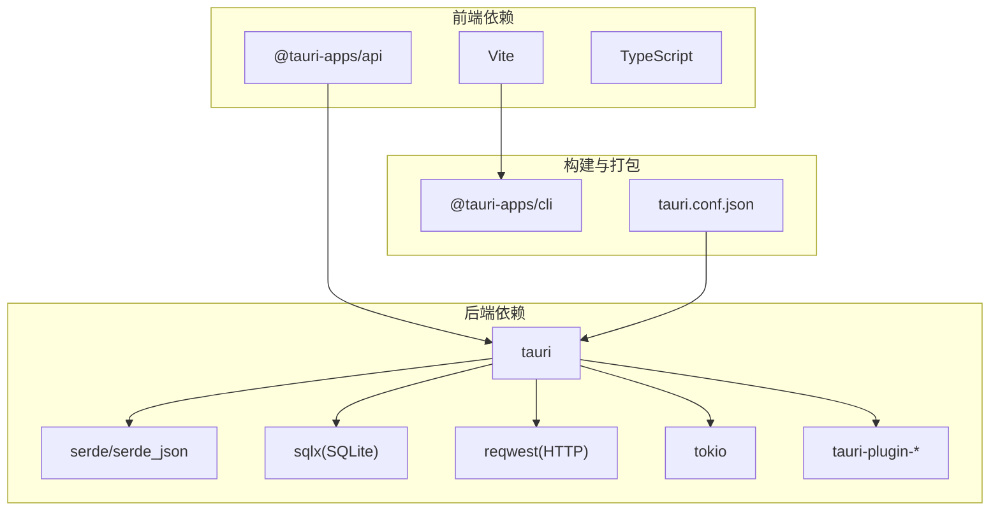

# 系统架构设计

<cite>
**本文档引用的文件**
- [tauri.conf.json](file://ai-experts/src-tauri/tauri.conf.json)
- [Cargo.toml](file://ai-experts/src-tauri/Cargo.toml)
- [main.rs](file://ai-experts/src-tauri/src/main.rs)
- [lib.rs](file://ai-experts/src-tauri/src/lib.rs)
- [package.json](file://ai-experts/package.json)
- [main.ts](file://ai-experts/src/main.ts)
- [expert-router.ts](file://ai-experts/src/expert-router.ts)
- [canvas.ts](file://ai-experts/src/canvas.ts)
</cite>

## 目录
1. [引言](#引言)
2. [项目结构](#项目结构)
3. [核心组件](#核心组件)
4. [架构总览](#架构总览)
5. [详细组件分析](#详细组件分析)
6. [依赖分析](#依赖分析)
7. [性能考虑](#性能考虑)
8. [故障排查指南](#故障排查指南)
9. [结论](#结论)
10. [附录](#附录)

## 引言
本文件面向“星图专家团工作台（社区版）”，提供系统架构设计文档。该系统采用三层架构：前端 Web 技术栈（Vite + TypeScript）、Rust 后端引擎（Tauri 应用库）、以及 Tauri 外壳（桌面应用运行时）。系统通过 Tauri 命令接口与 IPC 通信协议实现前后端协同，围绕“专家系统 + 工作流引擎 + 知识与工具编排”的目标，构建可扩展、可观测、可演进的桌面应用平台。

## 项目结构
项目采用“前端 + Tauri 后端”的双层结构，前端负责 UI 与交互，后端负责业务引擎与系统能力（文件系统、LLM 调用、工作流、令牌配额、工具执行等），二者通过 Tauri 的命令与事件机制进行通信。

图表来源
- [tauri.conf.json:1-38](file://ai-experts/src-tauri/tauri.conf.json#L1-L38)
- [Cargo.toml:1-46](file://ai-experts/src-tauri/Cargo.toml#L1-L46)
- [main.rs:1-6](file://ai-experts/src-tauri/src/main.rs#L1-L6)
- [lib.rs:1-52](file://ai-experts/src-tauri/src/lib.rs#L1-L52)
- [package.json:1-28](file://ai-experts/package.json#L1-L28)
- [main.ts:1-258](file://ai-experts/src/main.ts#L1-L258)
- [expert-router.ts:1-800](file://ai-experts/src/expert-router.ts#L1-L800)
- [canvas.ts:1-302](file://ai-experts/src/canvas.ts#L1-L302)

章节来源
- [tauri.conf.json:1-38](file://ai-experts/src-tauri/tauri.conf.json#L1-L38)
- [Cargo.toml:1-46](file://ai-experts/src-tauri/Cargo.toml#L1-L46)
- [main.rs:1-6](file://ai-experts/src-tauri/src/main.rs#L1-L6)
- [lib.rs:1-52](file://ai-experts/src-tauri/src/lib.rs#L1-L52)
- [package.json:1-28](file://ai-experts/package.json#L1-L28)
- [main.ts:1-258](file://ai-experts/src/main.ts#L1-L258)
- [expert-router.ts:1-800](file://ai-experts/src/expert-router.ts#L1-L800)
- [canvas.ts:1-302](file://ai-experts/src/canvas.ts#L1-L302)

## 核心组件
- 前端应用入口与窗口控制：负责窗口最小化/最大化/关闭、拖拽、菜单、设置页、主题切换、拖拽打开项目等。
- 专家路由与流水线编排：负责专家选择、令牌配额上下文、任务运行时状态、流水线进度与回合推进、专家工具事件与授权请求等。
- 无限画布与文件画布：负责项目树可视化、文件块布局与交互、拖拽平移/缩放、节点点击打开文件预览等。
- Tauri 命令与事件：前端通过 invoke 调用后端命令，后端通过事件向前端推送状态变化；后端提供工作区验证、专家任务运行、令牌仪表盘、流水线推进等命令。
- Rust 引擎模块：包含工作流引擎、专家上下文/运行时/后处理、工具系统、令牌运行时、代码图谱/保留、感知索引、协作引擎等模块化功能。

章节来源
- [main.ts:141-258](file://ai-experts/src/main.ts#L141-L258)
- [expert-router.ts:1-800](file://ai-experts/src/expert-router.ts#L1-L800)
- [canvas.ts:1-302](file://ai-experts/src/canvas.ts#L1-L302)
- [lib.rs:707-800](file://ai-experts/src-tauri/src/lib.rs#L707-L800)

## 架构总览
系统采用三层架构与模块化设计：
- 前端层：Vite + TypeScript，负责 UI、交互、状态管理与与后端通信。
- Tauri 层：Rust 应用库，注册命令、处理业务逻辑、访问文件系统、调用 LLM、维护令牌配额、执行工具与搜索等。
- 外壳层：Tauri 运行时，提供窗口、菜单、安全策略、打包与分发。

图表来源
- [main.ts:1-258](file://ai-experts/src/main.ts#L1-L258)
- [expert-router.ts:1-800](file://ai-experts/src/expert-router.ts#L1-L800)
- [canvas.ts:1-302](file://ai-experts/src/canvas.ts#L1-L302)
- [lib.rs:707-800](file://ai-experts/src-tauri/src/lib.rs#L707-L800)
- [tauri.conf.json:1-38](file://ai-experts/src-tauri/tauri.conf.json#L1-L38)

## 详细组件分析

### 前端组件分析
- 应用入口与窗口控制：初始化窗口、绑定拖拽、最小化/最大化/关闭、菜单与设置页、主题切换、拖拽打开项目等。
- 专家路由与令牌：构建专家令牌运行时上下文、持久化/加载令牌数据、构建令牌仪表盘快照、专家任务运行时启动与继续、流水线回合推进与终止决策。
- 无限画布：SVG 无限画布、节点/连线渲染、滚轮缩放、平移、节点拖拽、自动定位到内容区域、文件点击预览。

图表来源
- [main.ts:1-258](file://ai-experts/src/main.ts#L1-L258)
- [expert-router.ts:505-544](file://ai-experts/src/expert-router.ts#L505-L544)
- [lib.rs:732-788](file://ai-experts/src-tauri/src/lib.rs#L732-L788)

章节来源
- [main.ts:141-258](file://ai-experts/src/main.ts#L141-L258)
- [expert-router.ts:1-800](file://ai-experts/src/expert-router.ts#L1-L800)
- [canvas.ts:1-302](file://ai-experts/src/canvas.ts#L1-L302)

### 后端命令与数据模型
- 命令注册：通过 #[tauri::command] 注册命令，如 supervisor_analyze_dispatch、start_expert_task_runtime、build_token_dashboard_snapshot、verify_workspace_delivery 等。
- 数据模型：定义 Supervisor/*Response、Pipeline/*Envelope、Token/*Envelope、ExpertTaskRuntimeEnvelope 等结构体，统一前后端数据契约。
- 令牌配额：提供配额检查、用量追加、豁免专家 ID、项目/用户级令牌数据持久化与快照构建。

图表来源
- [lib.rs:66-131](file://ai-experts/src-tauri/src/lib.rs#L66-L131)
- [lib.rs:172-270](file://ai-experts/src-tauri/src/lib.rs#L172-L270)

章节来源
- [lib.rs:707-800](file://ai-experts/src-tauri/src/lib.rs#L707-L800)
- [lib.rs:66-131](file://ai-experts/src-tauri/src/lib.rs#L66-L131)
- [lib.rs:172-270](file://ai-experts/src-tauri/src/lib.rs#L172-L270)

### 专家任务运行时流程
专家任务运行时通过前端调用后端命令启动，后端根据专家配置与上下文执行任务，期间可能触发工具调用、网络搜索、授权请求等事件，最终返回运行时状态与进度事件。

图表来源
- [expert-router.ts:505-544](file://ai-experts/src/expert-router.ts#L505-L544)
- [expert-router.ts:546-558](file://ai-experts/src/expert-router.ts#L546-L558)
- [lib.rs:732-788](file://ai-experts/src-tauri/src/lib.rs#L732-L788)

章节来源
- [expert-router.ts:505-558](file://ai-experts/src/expert-router.ts#L505-L558)
- [lib.rs:732-788](file://ai-experts/src-tauri/src/lib.rs#L732-L788)

### 系统边界与组件关系
- 系统边界：前端 UI 与交互、Tauri 命令与事件、Rust 引擎模块、文件系统与网络访问。
- 组件关系：前端通过 invoke/listen 与后端交互；后端命令聚合多个业务模块；业务模块依赖文件系统与网络能力；外壳负责窗口与打包。

图表来源
- [main.ts:1-258](file://ai-experts/src/main.ts#L1-L258)
- [expert-router.ts:1-800](file://ai-experts/src/expert-router.ts#L1-L800)
- [lib.rs:707-800](file://ai-experts/src-tauri/src/lib.rs#L707-L800)

章节来源
- [main.ts:1-258](file://ai-experts/src/main.ts#L1-L258)
- [expert-router.ts:1-800](file://ai-experts/src/expert-router.ts#L1-L800)
- [lib.rs:707-800](file://ai-experts/src-tauri/src/lib.rs#L707-L800)

## 依赖分析
- 前端依赖：@tauri-apps/api、@tauri-apps/cli、Vite、TypeScript 等，提供命令调用、对话框、文件打开等能力。
- 后端依赖：tauri、serde、serde_json、sqlx、reqwest、tokio、futures-util、tauri-plugin-* 等，提供命令框架、序列化、SQLite、HTTP、异步运行时与插件生态。
- 构建与打包：Vite 负责前端构建，Tauri CLI 负责 Rust 构建与打包，tauri.conf.json 配置开发/生产 URL、窗口属性、图标与安全策略。

图表来源
- [package.json:15-26](file://ai-experts/package.json#L15-L26)
- [Cargo.toml:20-46](file://ai-experts/src-tauri/Cargo.toml#L20-L46)
- [tauri.conf.json:6-11](file://ai-experts/src-tauri/tauri.conf.json#L6-L11)

章节来源
- [package.json:1-28](file://ai-experts/package.json#L1-L28)
- [Cargo.toml:1-46](file://ai-experts/src-tauri/Cargo.toml#L1-L46)
- [tauri.conf.json:1-38](file://ai-experts/src-tauri/tauri.conf.json#L1-L38)

## 性能考虑
- 前端性能
  - 画布渲染：SVG 渲染节点/连线，支持滚轮缩放与平移，自动定位到内容区域，减少重绘与布局抖动。
  - 事件与状态：通过 invoke 与事件推送降低不必要的 UI 刷新，令牌数据异步持久化与批量保存。
- 后端性能
  - 异步运行时：Tokio 多线程运行时、流式处理与并发工具执行，提升 I/O 与网络吞吐。
  - 数据库：SQLx 连接池与 SQLite，减少连接开销，事务批处理。
  - 序列化：Serde/JSON 轻量序列化，避免大对象频繁拷贝。
- 架构优化
  - 模块化：业务模块独立，命令层聚合，便于并行扩展与测试。
  - 缓存与摘要：令牌用量与专家任务摘要，减少重复计算与冗余传输。

## 故障排查指南
- 前端调用后端命令失败
  - 检查命令名称与参数 JSON 结构是否匹配；确认 invoke 调用与后端 #[tauri::command] 名称一致。
  - 查看控制台日志与错误提示 Toast，定位解析失败或网络异常。
- 令牌配额阻断
  - 检查 getSupervisorTokenRuntimeContext/getExpertTokenRuntimeContext 构造的上下文；查看 displayQuotaBlockMessage 提示原因。
- 画布交互异常
  - 检查 SVG 事件绑定与 updateTransform 调用；确认 focusOnContent 计算逻辑与可视区域尺寸。
- 开发/打包问题
  - 确认 tauri.conf.json 中 devUrl 与 frontendDist；检查 package.json 脚本与 @tauri-apps/cli 版本。

章节来源
- [main.ts:608-617](file://ai-experts/src/main.ts#L608-L617)
- [expert-router.ts:84-104](file://ai-experts/src/expert-router.ts#L84-L104)
- [canvas.ts:134-184](file://ai-experts/src/canvas.ts#L134-L184)
- [tauri.conf.json:6-11](file://ai-experts/src-tauri/tauri.conf.json#L6-L11)
- [package.json:6-14](file://ai-experts/package.json#L6-L14)

## 结论
本系统以 Tauri 为核心，结合前端 Web 技术栈与 Rust 后端引擎，形成清晰的三层架构与模块化设计。通过命令与事件的 IPC 协议，前后端高效协同，覆盖专家编排、工作流推进、令牌配额、工具与网络访问等核心能力。系统具备良好的扩展性与可观测性，适合持续演进与企业级落地。

## 附录
- 架构决策要点
  - 选择 Tauri 作为外壳，兼顾原生体验与跨平台分发。
  - 前端采用 Vite + TypeScript，快速迭代与强类型保障。
  - 后端以模块化 Rust 引擎为主，命令层统一入口，便于测试与扩展。
- 微服务/事件驱动/分层架构的应用
  - 微服务：业务模块相对独立，命令层聚合，模块间通过命令与事件交互。
  - 事件驱动：后端通过事件向前端推送状态变化，前端按需刷新 UI。
  - 分层架构：表现层（前端）、协议层（IPC）、业务层（Rust 模块）、基础设施层（FS/DB/网络）。