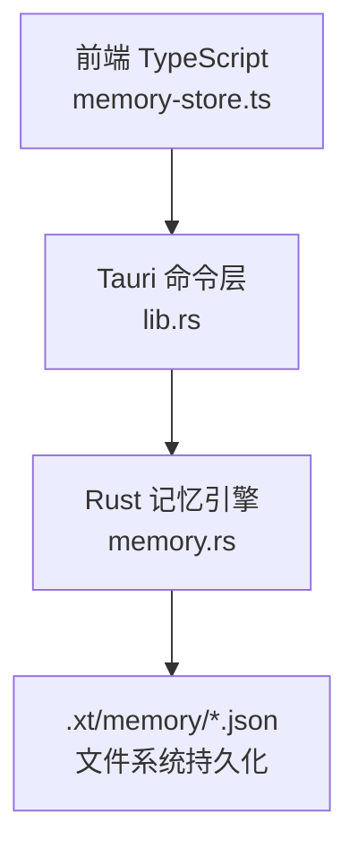
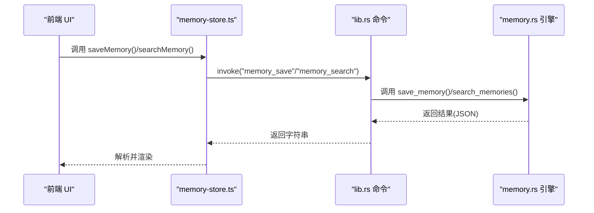
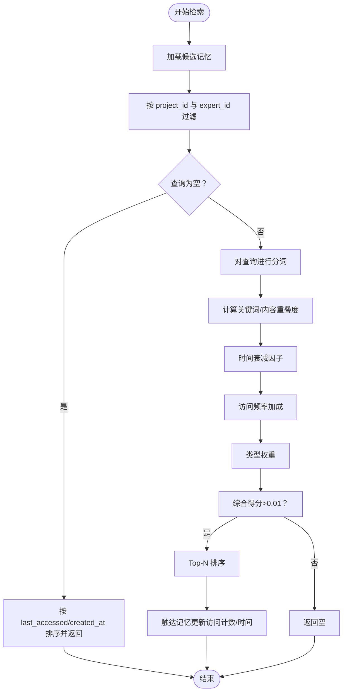
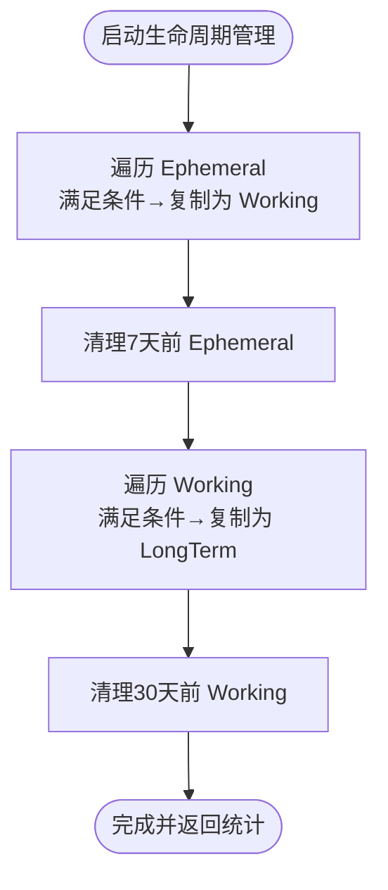
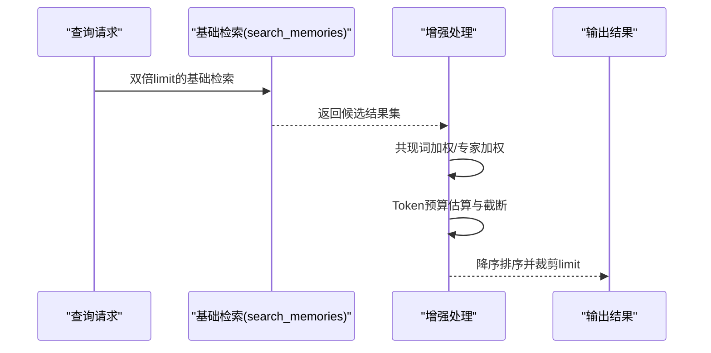
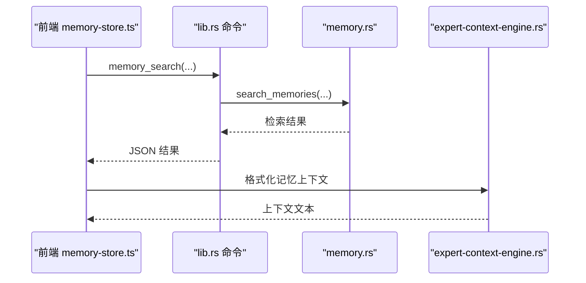

# 三级记忆架构

<cite>
**本文引用的文件**
- [memory-store.ts](file://ai-experts/src/memory-store.ts)
- [memory.rs](file://ai-experts/src-tauri/src/memory.rs)
- [lib.rs](file://ai-experts/src-tauri/src/lib.rs)
- [expert-context-engine.rs](file://ai-experts/src-tauri/src/expert_context_engine.rs)
- [styles.css](file://ai-experts/src/styles.css)
</cite>

## 目录
1. [简介](#简介)
2. [项目结构](#项目结构)
3. [核心组件](#核心组件)
4. [架构总览](#架构总览)
5. [详细组件分析](#详细组件分析)
6. [依赖关系分析](#依赖关系分析)
7. [性能考量](#性能考量)
8. [故障排查指南](#故障排查指南)
9. [结论](#结论)
10. [附录](#附录)

## 简介
本技术文档围绕“星图专家团工作台”的三级记忆架构展开，系统性阐述瞬时记忆（Ephemeral）、工作记忆（Working）与长期记忆（LongTerm）的设计理念、实现原理与运行机制。文档重点覆盖以下方面：
- 三种记忆类型的存储特点与生命周期管理策略
- 记忆检索算法（TF-IDF关键词匹配、时间衰减、访问加成、类型权重）与增强检索（共现词加权、专家维度、Token预算）
- 记忆类型间的自动转换规则与手动干预接口
- 记忆在专家系统中的作用与对专家选择/决策的影响
- 配置选项、性能影响分析与最佳实践
- 代码级使用示例（通过API路径引用）

## 项目结构
前端通过 Tauri 命令调用后端 Rust 实现的记忆能力，形成“前端 TypeScript + 后端 Rust + 文件系统持久化”的三层架构。

图表来源
- [memory-store.ts:1-100](file://ai-experts/src/memory-store.ts#L1-L100)
- [lib.rs:5535-5570](file://ai-experts/src-tauri/src/lib.rs#L5535-L5570)
- [memory.rs:45-51](file://ai-experts/src-tauri/src/memory.rs#L45-L51)

章节来源
- [memory-store.ts:1-100](file://ai-experts/src/memory-store.ts#L1-L100)
- [lib.rs:5535-5570](file://ai-experts/src-tauri/src/lib.rs#L5535-L5570)
- [memory.rs:45-51](file://ai-experts/src-tauri/src/memory.rs#L45-L51)

## 核心组件
- 记忆条目模型与查询模型：统一定义记忆字段、查询参数与检索结果评分。
- 记忆 CRUD：保存、加载、删除、清空类型。
- 记忆检索：基于 TF-IDF 的关键词匹配，结合时间衰减、访问频率加成与类型权重；支持增强检索（共现词加权、专家过滤、Token预算）。
- 生命周期管理：Ephemeral → Working（访问计数≥2或内容长度≥200）；Working → LongTerm（访问计数≥5且创建时间早于14天）。
- 前端记忆工具：便捷函数封装专家记忆、用户意图记忆、上下文组装、Token感知检索等。

章节来源
- [memory-store.ts:5-36](file://ai-experts/src/memory-store.ts#L5-L36)
- [memory.rs:12-41](file://ai-experts/src-tauri/src/memory.rs#L12-L41)
- [memory.rs:87-163](file://ai-experts/src-tauri/src/memory.rs#L87-L163)
- [memory.rs:168-305](file://ai-experts/src-tauri/src/memory.rs#L168-L305)
- [memory.rs:309-392](file://ai-experts/src-tauri/src/memory.rs#L309-L392)
- [memory-store.ts:104-213](file://ai-experts/src/memory-store.ts#L104-L213)
- [memory-store.ts:310-335](file://ai-experts/src/memory-store.ts#L310-L335)

## 架构总览
前端通过 Tauri 命令调用后端记忆 API，后端以 JSON 文件形式按类型持久化，检索时进行 TF-IDF 匹配与综合评分，生命周期管理定期执行自动转换。

图表来源
- [memory-store.ts:40-68](file://ai-experts/src/memory-store.ts#L40-L68)
- [lib.rs:5535-5540](file://ai-experts/src-tauri/src/lib.rs#L5535-L5540)
- [memory.rs:87-130](file://ai-experts/src-tauri/src/memory.rs#L87-L130)

## 详细组件分析

### 数据模型与检索评分
- 数据模型
  - 记忆条目包含：id、project_id、expert_id、memory_type、content、keywords、context_summary、created_at、access_count、last_accessed。
  - 查询模型包含：project_id、expert_id、query_text、memory_type、limit。
  - 检索结果包含：entry、score。
- 检索评分公式
  - 关键词重叠度与内容重叠度加权求和；
  - 时间衰减因子：(-age_days / 30) 的指数衰减；
  - 访问频率加成：1.0 + (access_count * 0.05)，上限0.5；
  - 类型权重：longterm=1.2、working=1.0、ephemeral=0.7；
  - 最终 score > 0.01 才纳入 Top-N 结果。

图表来源
- [memory.rs:168-305](file://ai-experts/src-tauri/src/memory.rs#L168-L305)

章节来源
- [memory.rs:12-41](file://ai-experts/src-tauri/src/memory.rs#L12-L41)
- [memory.rs:168-305](file://ai-experts/src-tauri/src/memory.rs#L168-L305)

### 生命周期管理与自动转换
- Ephemeral → Working
  - 触发条件：access_count ≥ 2 或 content 长度 ≥ 200；
  - 行为：复制条目并修改 memory_type 为 working，ID 前缀“working-”，随后清理7天前的旧 Ephemeral。
- Working → LongTerm
  - 触发条件：access_count ≥ 5 且 created_at ≤ 14天前；
  - 行为：复制条目并修改 memory_type 为 longterm，ID 前缀“longterm-”，长内容压缩，清理30天前的旧 Working。
- 运行入口：run_memory_lifecycle，返回统计摘要。

图表来源
- [memory.rs:309-392](file://ai-experts/src-tauri/src/memory.rs#L309-L392)

章节来源
- [memory.rs:309-392](file://ai-experts/src-tauri/src/memory.rs#L309-L392)

### 增强检索：共现词加权、专家维度与Token预算
- 共现词加权：若查询词在记忆内容中多词共现（≥2），对分数乘以 1.0 + 共现词数×0.15；
- 专家维度：若指定 expert_id，对该记忆分数乘以 1.3；
- Token预算：按估算的中文字符与英文词数折算，累计不超过 max_tokens；
- 最终按 score 降序并截断至 limit。

图表来源
- [memory.rs:622-681](file://ai-experts/src-tauri/src/memory.rs#L622-L681)

章节来源
- [memory.rs:622-681](file://ai-experts/src-tauri/src/memory.rs#L622-L681)

### 前端记忆工具与专家上下文集成
- 便捷函数
  - saveExpertMemory：从专家输出提取关键结论并保存为 Working；
  - saveUserIntentMemory：将用户意图保存为 Ephemeral；
  - buildMemoryContext/buildGeneralMemoryContext：组装专家/通用历史记忆上下文；
  - searchMemoryWithBudget：Token感知检索，回退到普通检索。
- 专家上下文构建
  - 在专家上下文构建流程中，分别检索“专家相关记忆”和“共享项目记忆”，并整合到检索上下文中。

图表来源
- [memory-store.ts:160-213](file://ai-experts/src/memory-store.ts#L160-L213)
- [lib.rs:1559-1661](file://ai-experts/src-tauri/src/lib.rs#L1559-L1661)
- [expert-context-engine.rs:103-138](file://ai-experts/src-tauri/src/expert_context_engine.rs#L103-L138)

章节来源
- [memory-store.ts:104-213](file://ai-experts/src/memory-store.ts#L104-L213)
- [lib.rs:1559-1661](file://ai-experts/src-tauri/src/lib.rs#L1559-L1661)
- [expert-context-engine.rs:103-138](file://ai-experts/src-tauri/src/expert_context_engine.rs#L103-L138)

### 记忆类型在专家系统中的作用
- 专家选择与决策
  - Working/LongTerm 记忆权重更高（类型权重），更易被检索命中；
  - 高访问计数的记忆获得访问加成，提升其在检索中的相对重要性；
  - 增强检索可突出专家维度与共现词，帮助专家快速聚焦相关经验。
- 上下文注入
  - 专家上下文构建阶段将历史记忆注入提示词，辅助专家做出更稳健的判断。

章节来源
- [memory.rs:270-280](file://ai-experts/src-tauri/src/memory.rs#L270-L280)
- [lib.rs:1605-1641](file://ai-experts/src-tauri/src/lib.rs#L1605-L1641)

## 依赖关系分析
- 前端依赖 Tauri 命令层，命令层依赖 Rust 记忆引擎，引擎依赖文件系统持久化；
- 检索模块与生命周期模块相互独立，均可由前端直接调用；
- 增强检索在现有关键词匹配基础上叠加权重与预算控制，不改变基本数据结构。

图表来源
- [memory-store.ts:1-100](file://ai-experts/src/memory-store.ts#L1-L100)
- [lib.rs:5535-5570](file://ai-experts/src-tauri/src/lib.rs#L5535-L5570)
- [memory.rs:45-51](file://ai-experts/src-tauri/src/memory.rs#L45-L51)

章节来源
- [memory-store.ts:1-100](file://ai-experts/src/memory-store.ts#L1-L100)
- [lib.rs:5535-5570](file://ai-experts/src-tauri/src/lib.rs#L5535-L5570)
- [memory.rs:45-51](file://ai-experts/src-tauri/src/memory.rs#L45-L51)

## 性能考量
- 检索复杂度
  - 候选集过滤与排序：O(n log n)，n 为候选记忆条目数；
  - 关键词/内容重叠度计算：对每条候选进行集合运算，整体 O(n·k)，k 为查询词数；
  - 时间衰减与访问加成为常数开销。
- 存储与容量
  - 每类记忆最多 500 条，超出按 last_accessed 截断，避免无限增长；
  - 文件系统 JSON 存储，I/O 成本与条目数量线性相关。
- 增强检索
  - 共现词加权与专家加权为 O(n) 额外扫描；
  - Token预算估算与截断确保上下文长度可控，避免超限。
- 建议
  - 控制查询词数量与长度，减少重叠度计算成本；
  - 合理设置 limit，避免返回过多结果；
  - 定期运行生命周期管理，保持 Working/LongTerm 的质量与规模。

章节来源
- [memory.rs:102-108](file://ai-experts/src-tauri/src/memory.rs#L102-L108)
- [memory.rs:622-681](file://ai-experts/src-tauri/src/memory.rs#L622-L681)

## 故障排查指南
- 记忆检索为空
  - 检查 project_id 是否匹配；
  - 若 expert_id 指定，确认是否存在同专家记忆；
  - 查询文本为空时按访问/创建时间排序，确认是否已有记忆。
- 访问统计未更新
  - 检索结果返回后会触达记忆（更新 access_count/last_accessed），确认调用链路是否成功。
- 生命周期管理未生效
  - 确认 Ephemeral/Working 条目满足转换条件；
  - 检查运行入口 run_memory_lifecycle 是否被调用。
- 增强检索异常
  - 当增强检索失败时会回退到普通检索，检查错误日志并确认输入参数。

章节来源
- [memory.rs:205-229](file://ai-experts/src-tauri/src/memory.rs#L205-L229)
- [memory.rs:300-302](file://ai-experts/src-tauri/src/memory.rs#L300-L302)
- [memory-store.ts:315-335](file://ai-experts/src/memory-store.ts#L315-L335)

## 结论
三级记忆架构通过明确的存储边界、评分与转换规则，实现了从“瞬时意图”到“跨会话稳定知识”的自然演化。前端提供简洁易用的 API，后端以文件系统持久化与 TF-IDF 检索为核心，配合生命周期管理与增强检索，在保证性能的同时提升了专家决策的质量与一致性。建议在实际使用中结合业务场景合理配置 limit、定期运行生命周期管理，并利用增强检索与上下文组装提升专家系统的经验复用效率。

## 附录

### 记忆类型配置与最佳实践
- 配置项
  - limit：检索返回条数上限（默认 5~10，增强检索默认 10）；
  - memory_type：可限定仅检索某类型（ephemeral/working/longterm）；
  - expert_id：限定专家维度，提升相关性。
- 最佳实践
  - 专家输出建议保存为 Working（saveExpertMemory），便于后续检索；
  - 用户意图保存为 Ephemeral（saveUserIntentMemory），便于短期上下文；
  - 使用 Token 感知检索（searchMemoryWithBudget）控制上下文长度；
  - 定期运行生命周期管理（runMemoryLifecycle）保持 Working/LongTerm 质量；
  - 在专家上下文构建中启用专家相关与共享记忆检索，提升上下文相关性。

章节来源
- [memory-store.ts:104-157](file://ai-experts/src/memory-store.ts#L104-L157)
- [memory-store.ts:310-335](file://ai-experts/src/memory-store.ts#L310-L335)
- [lib.rs:1605-1641](file://ai-experts/src-tauri/src/lib.rs#L1605-L1641)

### 记忆类型可视化与颜色标识
- Ephemeral：浅黄（临时/短期）
- Working：蓝色（工作/会话内稳定）
- LongTerm：绿色（长期/沉淀知识）

章节来源
- [styles.css:5841-5904](file://ai-experts/src/styles.css#L5841-L5904)