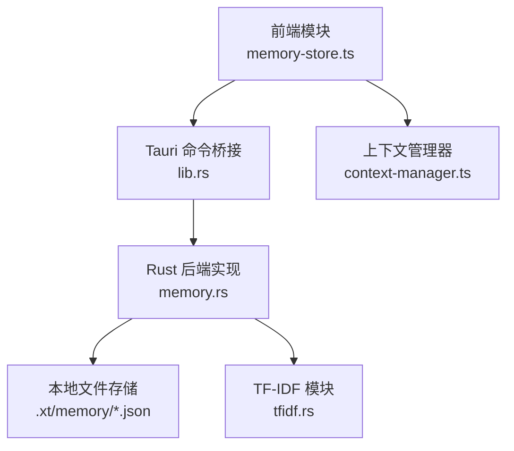
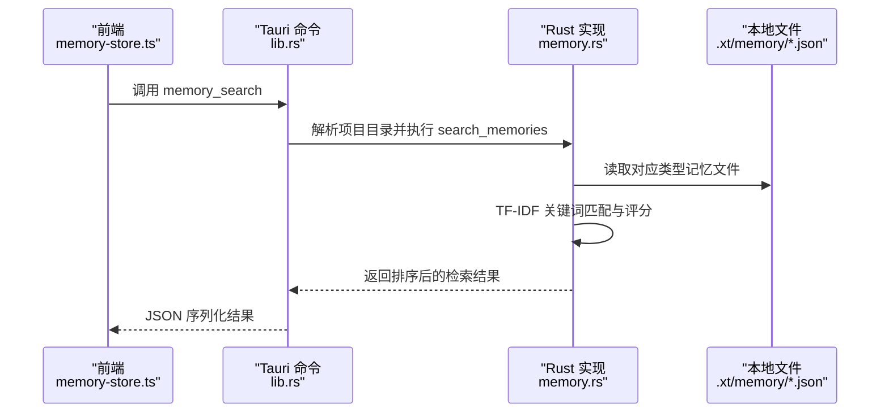
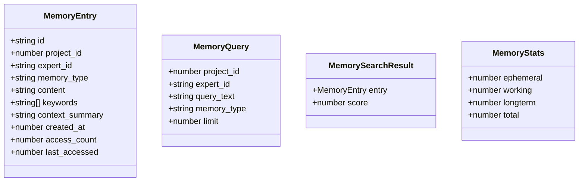
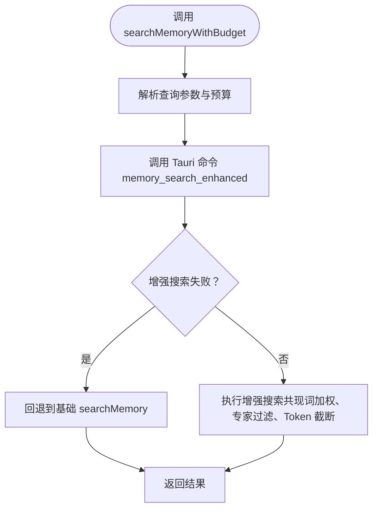
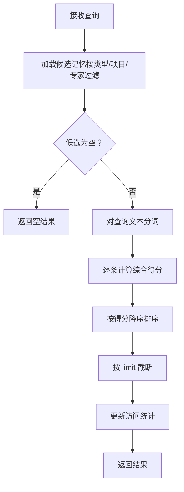
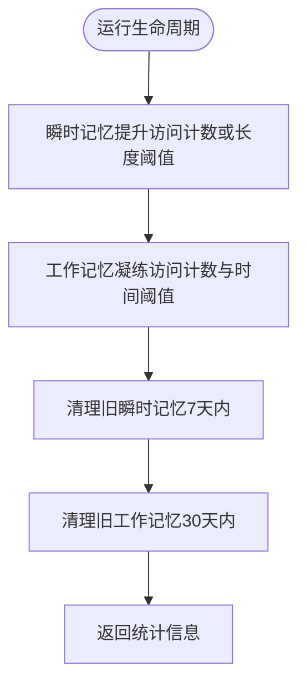
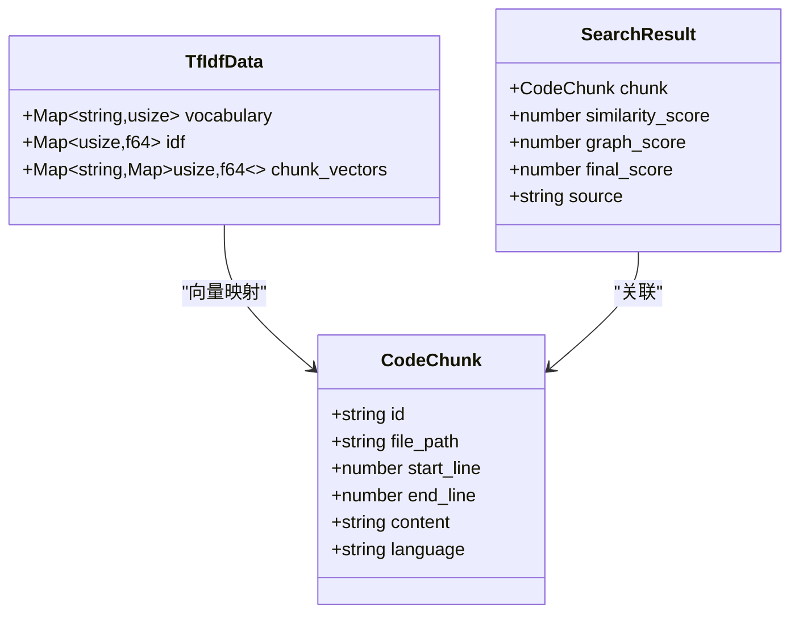
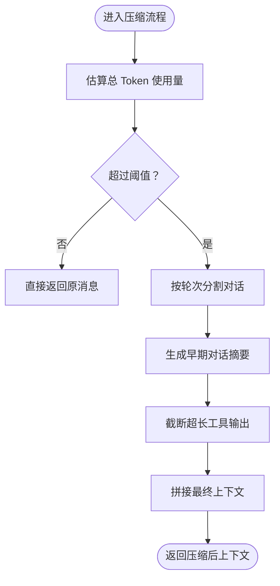
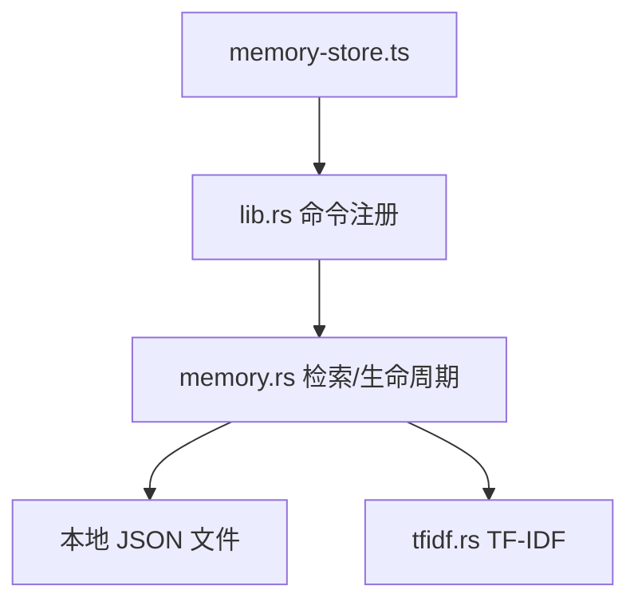

# 记忆存储系统

<cite>
**本文档引用的文件**
- [memory-store.ts](file://ai-experts/src/memory-store.ts)
- [memory.rs](file://ai-experts/src-tauri/src/memory.rs)
- [tfidf.rs](file://ai-experts/src-tauri/src/tfidf.rs)
- [lib.rs](file://ai-experts/src-tauri/src/lib.rs)
- [context-manager.ts](file://ai-experts/src/context-manager.ts)
</cite>

## 目录
1. [简介](#简介)
2. [项目结构](#项目结构)
3. [核心组件](#核心组件)
4. [架构概览](#架构概览)
5. [详细组件分析](#详细组件分析)
6. [依赖关系分析](#依赖关系分析)
7. [性能考虑](#性能考虑)
8. [故障排除指南](#故障排除指南)
9. [结论](#结论)
10. [附录](#附录)

## 简介
本文件为星图专家团工作台的记忆存储系统技术文档，围绕三级记忆架构（瞬时记忆、工作记忆、长期记忆）进行深入解析。系统采用前端 TypeScript API 与后端 Rust 实现相结合的方式，通过关键词匹配与 TF-IDF 相似度计算实现高效检索，并提供生命周期管理、清理回收、Token 预算控制等能力。文档涵盖设计理念、数据结构、处理流程、性能优化策略以及扩展接口。

## 项目结构
记忆系统主要分布在前端与后端两部分：
- 前端模块：提供记忆 API、便捷函数、关键词提取与 Token 预算感知检索
- 后端模块：基于 JSON 文件的本地存储、TF-IDF 关键词检索、生命周期管理与 Tauri 命令桥接

图表来源
- [memory-store.ts:1-337](file://ai-experts/src/memory-store.ts#L1-L337)
- [lib.rs:5523-5603](file://ai-experts/src-tauri/src/lib.rs#L5523-L5603)
- [memory.rs:115-139](file://ai-experts/src-tauri/src/memory.rs#L115-L139)
- [tfidf.rs:18-63](file://ai-experts/src-tauri/src/tfidf.rs#L18-L63)
- [context-manager.ts:37-276](file://ai-experts/src/context-manager.ts#L37-L276)

章节来源
- [memory-store.ts:1-337](file://ai-experts/src/memory-store.ts#L1-L337)
- [lib.rs:5523-5603](file://ai-experts/src-tauri/src/lib.rs#L5523-L5603)

## 核心组件
- 记忆条目模型：包含 id、项目标识、专家标识、记忆类型、内容、关键词、上下文摘要、创建时间、访问计数、最后访问时间等字段
- 记忆查询模型：支持项目过滤、专家过滤、查询文本、记忆类型过滤与结果上限
- 记忆搜索结果：返回记忆条目与相关性分数
- 记忆统计模型：统计各类别数量与总数

章节来源
- [memory-store.ts:5-36](file://ai-experts/src/memory-store.ts#L5-L36)

## 架构概览
记忆系统采用三层架构与前后端分离设计：
- 前端负责记忆的保存、检索、删除、清空、生命周期运行与统计查询，并提供便捷函数用于专家输出与用户意图的记忆保存
- 后端负责持久化存储、检索算法（TF-IDF 关键词匹配）、生命周期管理（Ephemeral→Working→LongTerm 的转换规则）与 Tauri 命令桥接
- TF-IDF 模块提供分词、词汇表构建、IDF 计算与余弦相似度比较，支撑检索相关性评分

图表来源
- [lib.rs:5535-5540](file://ai-experts/src-tauri/src/lib.rs#L5535-L5540)
- [memory.rs:168-305](file://ai-experts/src-tauri/src/memory.rs#L168-L305)

## 详细组件分析

### 数据模型与类型定义
- MemoryEntry：记忆条目的完整结构，包含元数据与统计字段
- MemoryQuery：检索请求参数，支持多维过滤
- MemorySearchResult：检索结果，包含条目与分数
- MemoryStats：统计信息，按类型汇总

图表来源
- [memory-store.ts:5-36](file://ai-experts/src/memory-store.ts#L5-L36)

章节来源
- [memory-store.ts:5-36](file://ai-experts/src/memory-store.ts#L5-L36)

### 前端 API 与便捷函数
- 核心 API：saveMemory、searchMemory、deleteMemory、clearMemoryType、runMemoryLifecycle、getMemoryStats
- 便捷函数：saveExpertMemory（专家输出记忆）、saveUserIntentMemory（用户意图记忆）、buildMemoryContext（专家上下文组装）、buildGeneralMemoryContext（通用上下文组装）
- Token 预算感知检索：searchMemoryWithBudget 支持按剩余 Token 预算截断结果

图表来源
- [memory-store.ts:310-335](file://ai-experts/src/memory-store.ts#L310-L335)
- [lib.rs:5587-5603](file://ai-experts/src-tauri/src/lib.rs#L5587-L5603)
- [memory.rs:622-681](file://ai-experts/src-tauri/src/memory.rs#L622-L681)

章节来源
- [memory-store.ts:40-100](file://ai-experts/src/memory-store.ts#L40-L100)
- [memory-store.ts:104-213](file://ai-experts/src/memory-store.ts#L104-L213)
- [memory-store.ts:310-335](file://ai-experts/src/memory-store.ts#L310-L335)

### 后端检索与评分算法
- TF-IDF 关键词匹配：对查询与候选记忆进行分词，计算关键词重叠度与内容匹配度
- 时间衰减因子：基于创建时间计算指数衰减权重
- 访问频率加成：根据 access_count 提升热门记忆权重
- 记忆类型权重：长期记忆最高、工作记忆居中、瞬时记忆最低
- 专家优先：若指定 expert_id，同专家记忆额外加权
- 共现词加权：当查询词在记忆内容中同时出现时，按共现次数提升分数

图表来源
- [memory.rs:168-305](file://ai-experts/src-tauri/src/memory.rs#L168-L305)

章节来源
- [memory.rs:168-305](file://ai-experts/src-tauri/src/memory.rs#L168-L305)

### 生命周期管理与清理回收
- Ephemeral→Working 转换规则：access_count≥2 或内容长度≥200 的瞬时记忆提升为工作记忆
- Working→LongTerm 转换规则：access_count≥5 且创建时间早于 14 天的条目凝练为长期记忆，内容压缩
- 清理策略：保留最近 7 天的瞬时记忆与最近 30 天的工作记忆，超出阈值自动清理
- 统一生命周期执行：run_memory_lifecycle 串联上述流程并返回统计信息

图表来源
- [memory.rs:309-392](file://ai-experts/src-tauri/src/memory.rs#L309-L392)

章节来源
- [memory.rs:309-392](file://ai-experts/src-tauri/src/memory.rs#L309-L392)

### TF-IDF 模块与相似度计算
- 分词器：支持中文与英文混合，保留代码标识符与特殊字符
- 词汇表：按文档频率选择高频词，限制词表规模
- TF-IDF 向量：对每个记忆段落构建向量并归一化
- 相似度：计算查询与候选的余弦相似度，按阈值筛选并排序

图表来源
- [tfidf.rs:8-16](file://ai-experts/src-tauri/src/tfidf.rs#L8-L16)
- [tfidf.rs:14-23](file://ai-experts/src-tauri/src/tfidf.rs#L14-L23)
- [tfidf.rs:34-41](file://ai-experts/src-tauri/src/tfidf.rs#L34-L41)

章节来源
- [tfidf.rs:18-122](file://ai-experts/src-tauri/src/tfidf.rs#L18-L122)

### 上下文管理与 Token 预算控制
- ContextManager：估算消息与片段的 Token 数，按预算阈值触发压缩
- 自动压缩策略：保留 system 消息与最近若干轮对话，早期对话压缩为摘要，工具输出超长时截断
- 片段管理：按优先级组织片段，超出预算时从低优先级开始移除

图表来源
- [context-manager.ts:115-156](file://ai-experts/src/context-manager.ts#L115-L156)

章节来源
- [context-manager.ts:37-276](file://ai-experts/src/context-manager.ts#L37-L276)

## 依赖关系分析
- 前端依赖 Tauri invoke 调用后端命令，后端通过 get_project_dir 解析项目路径并执行具体操作
- 检索流程依赖 TF-IDF 模块进行分词与相似度计算
- 生命周期管理依赖文件系统进行持久化与清理

图表来源
- [lib.rs:7135-7150](file://ai-experts/src-tauri/src/lib.rs#L7135-L7150)
- [memory.rs:53-73](file://ai-experts/src-tauri/src/memory.rs#L53-L73)
- [tfidf.rs:18-63](file://ai-experts/src-tauri/src/tfidf.rs#L18-L63)

章节来源
- [lib.rs:5523-5603](file://ai-experts/src-tauri/src/lib.rs#L5523-L5603)
- [memory.rs:53-73](file://ai-experts/src-tauri/src/memory.rs#L53-L73)

## 性能考虑
- 存储层：采用 JSON 文件按类型分片存储，上限保护与定期清理减少文件体积
- 检索层：TF-IDF 关键词匹配与评分，时间衰减与访问加成提升相关性；增强搜索引入共现词与专家过滤，进一步优化命中质量
- Token 控制：前端提供 Token 预算感知检索，后端估算函数按中英文比例与中文字符密度估算 Token 数
- 并发与异步：感知索引构建与查询采用异步任务避免阻塞主线程

## 故障排除指南
- 检索结果为空：检查查询文本是否为空、项目 ID 是否正确、记忆类型过滤条件是否过于严格
- 记忆未更新访问统计：确认检索流程中是否调用 touch_memory_entry 更新 access_count 与 last_accessed
- 生命周期未生效：检查阈值设置与时间窗口，确保 run_memory_lifecycle 被定时或手动触发
- Token 预算不足：调整 ContextManager 配置或减少上下文片段大小

章节来源
- [memory.rs:224-302](file://ai-experts/src-tauri/src/memory.rs#L224-L302)
- [memory-store.ts:310-335](file://ai-experts/src/memory-store.ts#L310-L335)

## 结论
记忆存储系统通过三级架构与 TF-IDF 相关性评分，实现了高效、可扩展的记忆检索与管理。前端提供简洁易用的 API 与 Token 预算控制，后端通过生命周期管理与清理回收保障长期稳定性。系统具备良好的扩展性，可通过自定义存储后端与查询优化技巧进一步提升性能与适用性。

## 附录
- 使用场景示例
  - 专家输出记忆：使用 saveExpertMemory 将专家结论保存为工作记忆，便于后续检索与上下文组装
  - 用户意图记忆：使用 saveUserIntentMemory 记录用户意图，作为瞬时记忆参与检索
  - 上下文组装：使用 buildMemoryContext/buildGeneralMemoryContext 将相关历史记忆注入提示词
  - Token 预算感知：使用 searchMemoryWithBudget 在受限 Token 下智能截断结果
- 性能基准建议
  - 合理设置 limit 与阈值，避免一次性加载过多记忆
  - 定期运行 run_memory_lifecycle，维持记忆库健康状态
  - 使用 ContextManager 的自动压缩功能，控制上下文长度