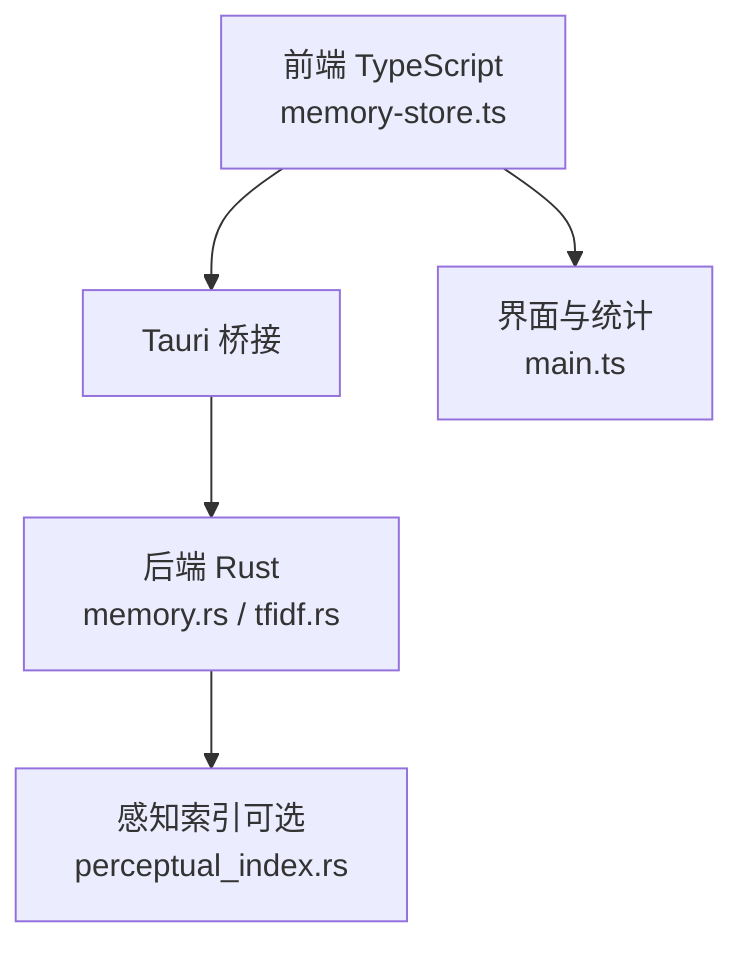
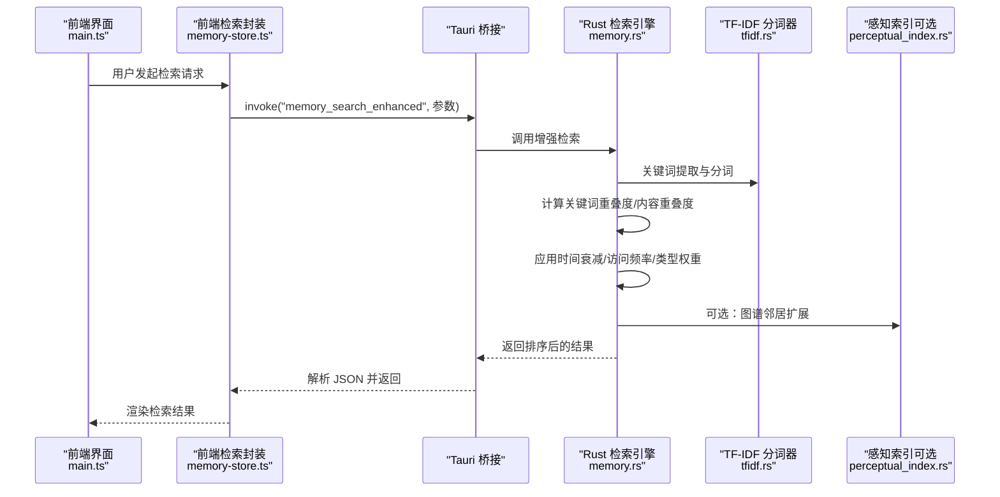
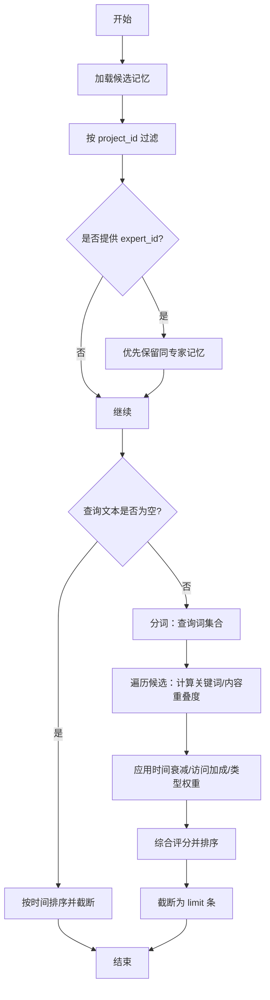
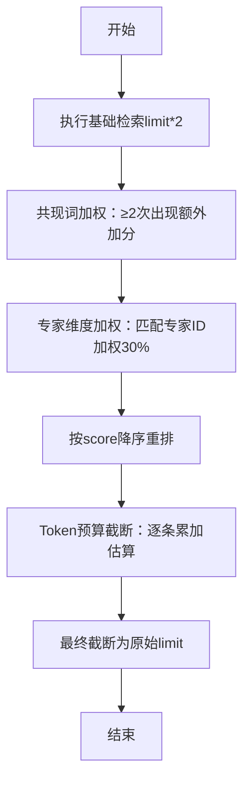
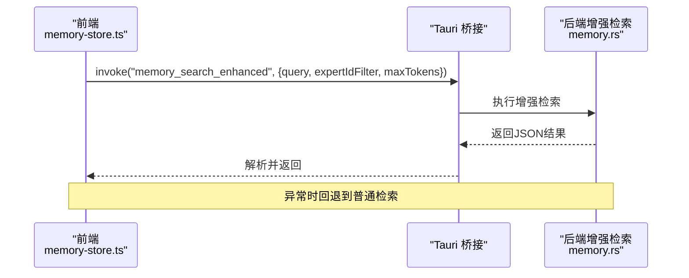
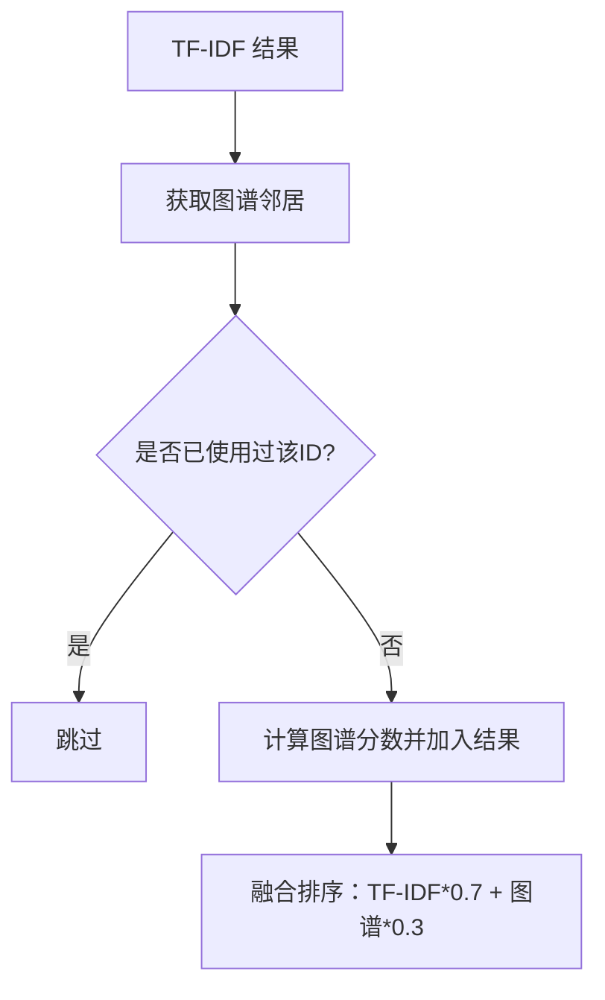
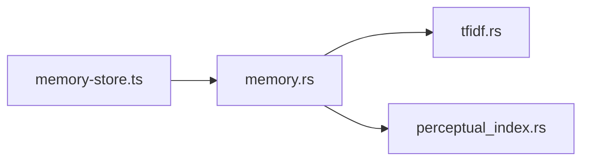

# 记忆查询与检索

<cite>
**本文引用的文件**
- [memory.rs](file://ai-experts/src-tauri/src/memory.rs)
- [tfidf.rs](file://ai-experts/src-tauri/src/tfidf.rs)
- [perceptual_index.rs](file://ai-experts/src-tauri/src/perceptual_index.rs)
- [memory-store.ts](file://ai-experts/src/memory-store.ts)
- [main.ts](file://ai-experts/src/main.ts)
</cite>

## 目录
1. [简介](#简介)
2. [项目结构](#项目结构)
3. [核心组件](#核心组件)
4. [架构总览](#架构总览)
5. [详细组件分析](#详细组件分析)
6. [依赖关系分析](#依赖关系分析)
7. [性能考量](#性能考量)
8. [故障排查指南](#故障排查指南)
9. [结论](#结论)
10. [附录](#附录)

## 简介
本文件面向“星图专家团工作台”的记忆查询与检索系统，聚焦以下目标：
- 深入解析记忆检索的实现原理：关键词提取、TF-IDF相似度计算、相关性排序与综合评分。
- 详解 searchMemory 查询参数、过滤条件与结果排序机制。
- 阐述 Token 感知检索（searchMemoryWithBudget）的实现原理与基于剩余 Token 预算的结果截断策略。
- 总结性能优化技术：索引机制、缓存策略与查询优化。
- 提供查询最佳实践、关键词提取规则与模糊匹配支持建议。
- 展示典型查询场景与性能基准测试思路（以路径与行号标注代替具体代码）。

## 项目结构
记忆检索系统由前端 TypeScript 接口层与后端 Rust 实现层组成，二者通过 Tauri 桥接调用。Rust 层负责：
- 记忆加载与过滤（按项目、专家、类型等）。
- 关键词提取与 TF-IDF 相关度计算。
- 多维评分（时间衰减、访问频率、记忆类型权重）。
- 可选增强：共现词加权、专家维度加权、Token 预算截断。
前端层提供统一的检索接口并封装 Token 预算控制。

图表来源
- [memory-store.ts:304-336](file://ai-experts/src/memory-store.ts#L304-L336)
- [memory.rs:168-280](file://ai-experts/src-tauri/src/memory.rs#L168-L280)
- [tfidf.rs](file://ai-experts/src-tauri/src/tfidf.rs)
- [perceptual_index.rs:368-404](file://ai-experts/src-tauri/src/perceptual_index.rs#L368-L404)
- [main.ts:6805-6830](file://ai-experts/src/main.ts#L6805-L6830)

章节来源
- [memory-store.ts:304-336](file://ai-experts/src/memory-store.ts#L304-L336)
- [memory.rs:168-280](file://ai-experts/src-tauri/src/memory.rs#L168-L280)
- [tfidf.rs](file://ai-experts/src-tauri/src/tfidf.rs)
- [perceptual_index.rs:368-404](file://ai-experts/src-tauri/src/perceptual_index.rs#L368-L404)
- [main.ts:6805-6830](file://ai-experts/src/main.ts#L6805-L6830)

## 核心组件
- 记忆检索主流程（search_memories）
  - 输入：项目目录、MemoryQuery（查询文本、项目ID、专家ID、记忆类型、limit）。
  - 流程：候选记忆加载 → 过滤（project_id、expert_id）→ 若查询为空则按时间排序返回 → 否则进行关键词提取与相似度计算 → 综合评分 → 排序 → 截断 → 触摸访问时间。
  - 输出：MemorySearchResult 列表（含条目与分数）。
- 增强检索（search_memories_enhanced）
  - 在基础检索基础上：共现词加权、专家维度加权、Token 预算截断、二次重排。
- Token 估算（estimate_tokens）
  - 基于中英文字符比例的简单估算，用于预算控制。
- 前端检索接口（searchMemoryWithBudget）
  - 通过 invoke 调用 memory_search_enhanced，失败时回退至 searchMemory。

章节来源
- [memory.rs:168-280](file://ai-experts/src-tauri/src/memory.rs#L168-L280)
- [memory.rs:621-694](file://ai-experts/src-tauri/src/memory.rs#L621-L694)
- [memory-store.ts:304-336](file://ai-experts/src/memory-store.ts#L304-L336)

## 架构总览
下图展示了从前端到后端的检索调用链路，以及可选的感知索引融合。

图表来源
- [memory-store.ts:304-336](file://ai-experts/src/memory-store.ts#L304-L336)
- [memory.rs:621-694](file://ai-experts/src-tauri/src/memory.rs#L621-L694)
- [tfidf.rs](file://ai-experts/src-tauri/src/tfidf.rs)
- [perceptual_index.rs:368-404](file://ai-experts/src-tauri/src/perceptual_index.rs#L368-L404)

## 详细组件分析

### 组件A：基础检索 search_memories
- 功能要点
  - 候选集加载：按记忆类型或全量加载。
  - 过滤条件：project_id 必须匹配；若提供 expert_id，则优先返回同一专家的记忆，否则保留所有专家但降低权重。
  - 查询为空处理：按 last_accessed 与 created_at 降序排序，返回前 limit 条。
  - 关键词提取与相似度
    - 使用 TF-IDF 分词器对查询文本与记忆内容进行分词。
    - 计算关键词重叠度与内容重叠度（重叠词数量/查询词数）。
  - 综合评分
    - 时间衰减：(-age/30)e^（30天半衰期）。
    - 访问频率加成：1.0 + min(access_count*0.05, 0.5)。
    - 记忆类型权重：longterm=1.2、working=1.0、ephemeral=0.7。
    - 最终 score = (关键词*0.5 + 内容*0.3) * 时间衰减 * 访问加成 * 类型权重。
  - 排序与截断：按 score 降序，取前 limit 条。
  - 访问记录更新：对返回结果调用触摸接口更新最近访问时间。

图表来源
- [memory.rs:168-280](file://ai-experts/src-tauri/src/memory.rs#L168-L280)

章节来源
- [memory.rs:168-280](file://ai-experts/src-tauri/src/memory.rs#L168-L280)

### 组件B：增强检索 search_memories_enhanced
- 功能要点
  - 基础检索扩展：limit 扩大为原值的两倍，保证重排序空间。
  - 共现词加权：若查询词在某记忆内容中同时出现≥2次，则按共现次数线性提升 score。
  - 专家维度加权：若指定 expert_id，命中该专家的记忆额外加权30%。
  - 重新排序：按 score 降序。
  - Token 预算截断：累计估算 token 数，超过预算即停止收集。
  - 最终截断：确保不超过原始 limit。
- Token 估算
  - 中文字符按更大概率计，英文单词按更小概率计，给出一个近似估算值。

图表来源
- [memory.rs:621-694](file://ai-experts/src-tauri/src/memory.rs#L621-L694)

章节来源
- [memory.rs:621-694](file://ai-experts/src-tauri/src/memory.rs#L621-L694)

### 组件C：前端检索接口 searchMemoryWithBudget
- 功能要点
  - 通过 invoke 调用后端增强检索接口，传入 project_id、expert_id、query_text、memory_type、limit、expertIdFilter、maxTokens。
  - 失败时回退到普通检索 searchMemory。
- 适用场景
  - 当需要在有限 Token 预算内最大化信息密度时，优先使用该接口。

图表来源
- [memory-store.ts:304-336](file://ai-experts/src/memory-store.ts#L304-L336)
- [memory.rs:621-694](file://ai-experts/src-tauri/src/memory.rs#L621-L694)

章节来源
- [memory-store.ts:304-336](file://ai-experts/src/memory-store.ts#L304-L336)

### 组件D：感知索引融合（可选）
- 功能要点
  - 对 TF-IDF 的每个结果，查找代码图谱邻居，生成图谱分数并参与融合排序。
  - TF-IDF 权重 0.7，图谱分数权重 0.3，形成最终排序。

图表来源
- [perceptual_index.rs:368-404](file://ai-experts/src-tauri/src/perceptual_index.rs#L368-L404)

章节来源
- [perceptual_index.rs:368-404](file://ai-experts/src-tauri/src/perceptual_index.rs#L368-L404)

## 依赖关系分析
- 前端依赖
  - memory-store.ts 依赖 Tauri invoke 与 searchMemory（回退）。
- 后端依赖
  - memory.rs 依赖 tfidf.rs 进行分词；可选依赖 perceptual_index.rs 进行图谱融合。
- 数据流
  - 查询参数 → 分词 → 相似度计算 → 多维评分 → 排序 → 截断 → 返回。

图表来源
- [memory-store.ts:304-336](file://ai-experts/src/memory-store.ts#L304-L336)
- [memory.rs:168-280](file://ai-experts/src-tauri/src/memory.rs#L168-L280)
- [tfidf.rs](file://ai-experts/src-tauri/src/tfidf.rs)
- [perceptual_index.rs:368-404](file://ai-experts/src-tauri/src/perceptual_index.rs#L368-L404)

章节来源
- [memory-store.ts:304-336](file://ai-experts/src/memory-store.ts#L304-L336)
- [memory.rs:168-280](file://ai-experts/src-tauri/src/memory.rs#L168-L280)
- [tfidf.rs](file://ai-experts/src-tauri/src/tfidf.rs)
- [perceptual_index.rs:368-404](file://ai-experts/src-tauri/src/perceptual_index.rs#L368-L404)

## 性能考量
- 索引与缓存
  - 候选集按 project_id 过滤，减少后续计算量。
  - expert_id 优先匹配可显著缩小候选范围。
  - 基础检索在查询为空时直接按时间排序，避免不必要的分词与评分。
- 查询优化
  - 将 limit 扩大为两倍再重排，确保高质量结果被充分评估。
  - 共现词加权与专家加权在重排阶段一次性完成，避免多次扫描。
  - Token 预算截断在重排后进行，保证高分结果优先保留。
- Token 估算
  - estimate_tokens 提供快速估算，便于预算控制；实际部署中可根据模型差异调整估算系数。

章节来源
- [memory.rs:168-280](file://ai-experts/src-tauri/src/memory.rs#L168-L280)
- [memory.rs:621-694](file://ai-experts/src-tauri/src/memory.rs#L621-L694)
- [memory-store.ts:304-336](file://ai-experts/src/memory-store.ts#L304-L336)

## 故障排查指南
- 常见问题
  - 增强检索失败：前端会回退到普通检索，检查后端日志定位异常。
  - 结果为空：确认 project_id、expert_id、memory_type 是否正确；检查候选记忆是否存在。
  - Token 预算不足：适当提高预算或降低 limit；关注 estimate_tokens 的估算偏差。
- 调试建议
  - 在前端捕获 invoke 异常并记录上下文参数。
  - 在后端打印候选数量、过滤后数量与最终返回数量，定位瓶颈。
  - 对高频查询开启缓存（如按查询指纹缓存基础检索结果）。

章节来源
- [memory-store.ts:304-336](file://ai-experts/src/memory-store.ts#L304-L336)

## 结论
记忆查询与检索系统通过“关键词+内容重叠度 + 时间衰减 + 访问频率 + 类型权重”的多维评分，结合可选的共现词加权、专家维度加权与 Token 预算截断，在保证相关性的前提下兼顾效率与成本。前端提供统一接口与回退机制，后端以模块化设计支撑扩展与优化。

## 附录

### 查询参数与过滤条件
- MemoryQuery 字段
  - project_id：必填，用于限定项目范围。
  - expert_id：可选，优先匹配同专家记忆。
  - memory_type：可选，限定记忆类型（longterm/working/ephemeral）。
  - query_text：可选，为空时按时间排序。
  - limit：限制返回数量（1~1000）。
- 过滤顺序
  - 先按 project_id 过滤，再按 expert_id 过滤，最后按查询文本与评分过滤。

章节来源
- [memory.rs:168-280](file://ai-experts/src-tauri/src/memory.rs#L168-L280)

### 关键词提取与相似度计算
- 关键词提取
  - 使用 tfidf.rs 的分词器对查询与记忆内容进行分词，构建词集合。
- 相似度指标
  - 关键词重叠度：overlap(query_tokens)/len(query_tokens)。
  - 内容重叠度：overlap(content_tokens)/len(query_tokens)。
- 综合评分
  - score = (关键词*0.5 + 内容*0.3) * 时间衰减 * 访问加成 * 类型权重。

章节来源
- [memory.rs:168-280](file://ai-experts/src-tauri/src/memory.rs#L168-L280)
- [tfidf.rs](file://ai-experts/src-tauri/src/tfidf.rs)

### Token 感知检索实现
- 实现原理
  - 前端调用 memory_search_enhanced，后端在重排后再按估算 token 数进行截断。
  - estimate_tokens 基于中英文字符比例估算，适合预算控制。
- 使用建议
  - 在对话或批量任务中，根据模型上下文长度设置合理预算上限。
  - 对长文本记忆，建议配合摘要或分段策略以提升吞吐。

章节来源
- [memory-store.ts:304-336](file://ai-experts/src/memory-store.ts#L304-L336)
- [memory.rs:621-694](file://ai-experts/src-tauri/src/memory.rs#L621-L694)
- [memory.rs:683-694](file://ai-experts/src-tauri/src/memory.rs#L683-L694)

### 查询最佳实践
- 明确过滤条件：优先提供 project_id 与 expert_id。
- 控制查询粒度：尽量使用具体关键词，避免过长或模糊查询。
- 合理设置 limit：结合业务需求与 Token 预算平衡。
- 使用增强检索：在需要更高相关性与专家偏好时启用。
- 性能基准测试建议
  - 场景：不同 limit、不同查询长度、不同专家偏好、不同预算上限。
  - 指标：响应时间、召回率、F1 分数、Token 使用量。
  - 方法：固定数据集上重复运行，统计均值与方差，绘制性能曲线。

章节来源
- [memory.rs:168-280](file://ai-experts/src-tauri/src/memory.rs#L168-L280)
- [memory.rs:621-694](file://ai-experts/src-tauri/src/memory.rs#L621-L694)
- [main.ts:6805-6830](file://ai-experts/src/main.ts#L6805-L6830)