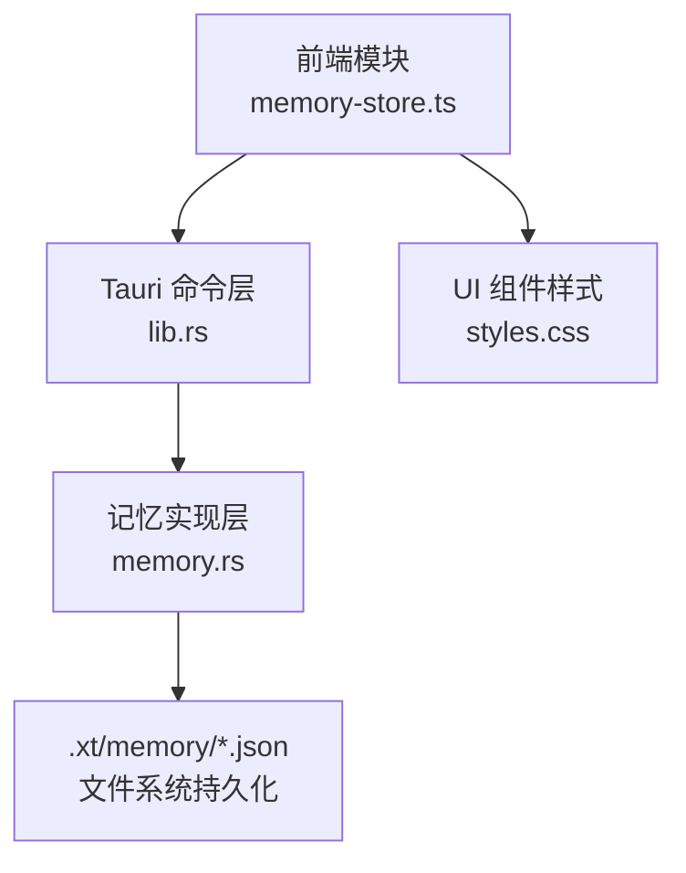
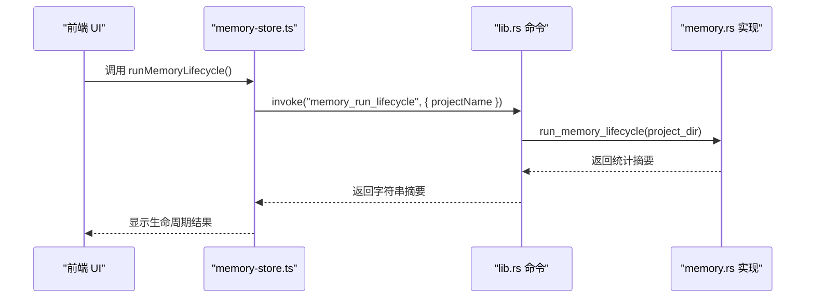
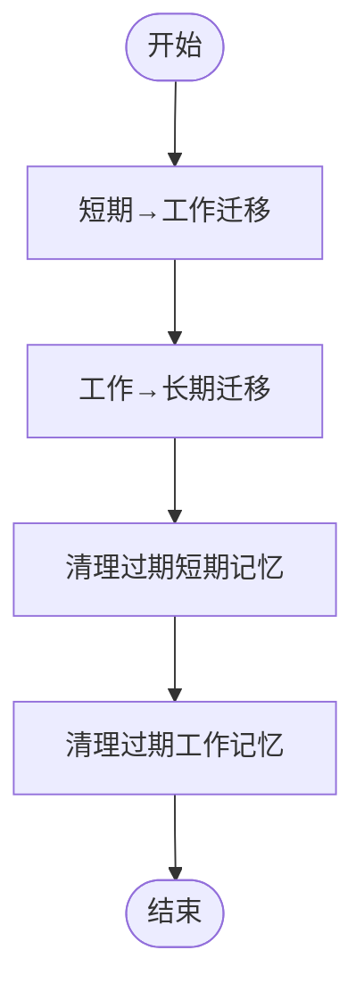
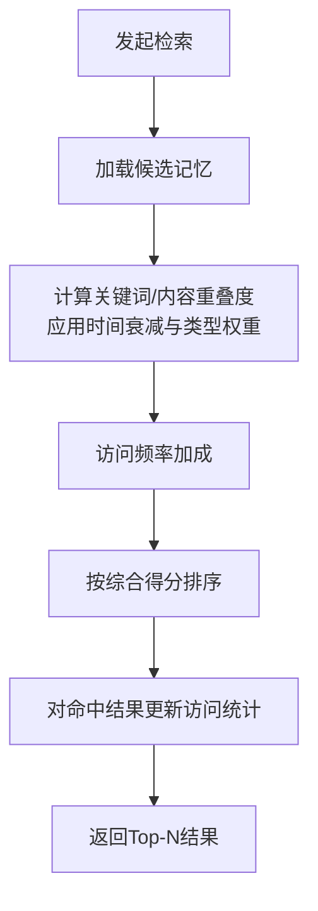
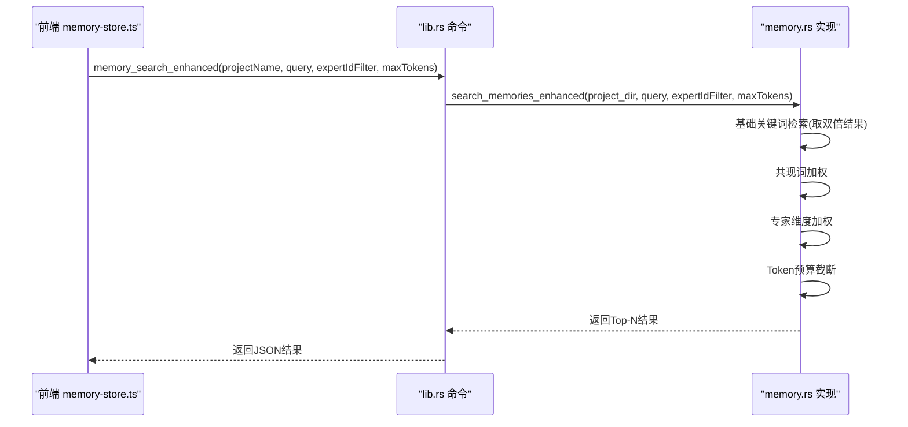
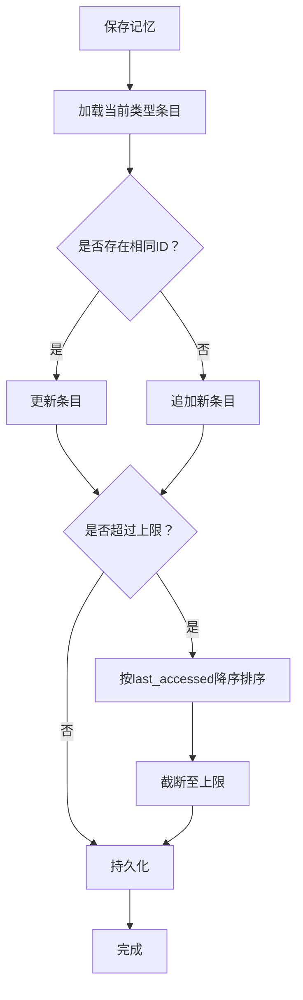

# 记忆生命周期管理

<cite>
**本文引用的文件**
- [memory-store.ts](file://ai-experts/src/memory-store.ts)
- [memory.rs](file://ai-experts/src-tauri/src/memory.rs)
- [lib.rs](file://ai-experts/src-tauri/src/lib.rs)
- [styles.css](file://ai-experts/src/styles.css)
</cite>

## 目录
1. [简介](#简介)
2. [项目结构](#项目结构)
3. [核心组件](#核心组件)
4. [架构总览](#架构总览)
5. [详细组件分析](#详细组件分析)
6. [依赖关系分析](#依赖关系分析)
7. [性能考量](#性能考量)
8. [故障排查指南](#故障排查指南)
9. [结论](#结论)
10. [附录](#附录)

## 简介
本文件面向“星图专家团工作台”的记忆生命周期管理子系统，系统性阐述记忆从创建、访问、更新到删除的完整流程；解释访问统计机制（访问次数、最后访问时间、访问频率）的计算方式；梳理基于时间、访问频率与内存压力的清理与回收策略；深入解析 runMemoryLifecycle 函数的工作原理与可配置项；并提供性能优化建议、内存管理与垃圾回收策略，以及典型使用场景与配置示例。

## 项目结构
记忆子系统由前端 TypeScript API 层与后端 Rust 实现层协同组成：
- 前端通过 Tauri invoke 调用后端命令，封装统一的 API（保存、检索、删除、清空、生命周期运行、统计）。
- 后端以 JSON 文件形式持久化三类记忆：ephemeral（短期）、working（工作）、longterm（长期），并提供检索、生命周期推进、增强检索与统计能力。

图表来源
- [memory-store.ts:1-100](file://ai-experts/src/memory-store.ts#L1-L100)
- [lib.rs:5563-5570](file://ai-experts/src-tauri/src/lib.rs#L5563-L5570)
- [memory.rs:45-51](file://ai-experts/src-tauri/src/memory.rs#L45-L51)

章节来源
- [memory-store.ts:1-100](file://ai-experts/src/memory-store.ts#L1-L100)
- [lib.rs:5563-5570](file://ai-experts/src-tauri/src/lib.rs#L5563-L5570)
- [memory.rs:45-51](file://ai-experts/src-tauri/src/memory.rs#L45-L51)

## 核心组件
- 记忆条目模型：包含 id、project_id、expert_id、memory_type、content、keywords、context_summary、created_at、access_count、last_accessed。
- 检索模型：支持按 project_id、expert_id、query_text、memory_type、limit 进行检索。
- 生命周期管理：将短期记忆提升为工作记忆，再将有价值的工作记忆凝练为长期记忆，并进行周期性清理。
- 增强检索：在 TF-IDF 关键词匹配基础上加入共现词加权、专家维度加权与 Token 预算截断。
- 统计接口：返回各类别记忆数量与总数。

章节来源
- [memory-store.ts:5-36](file://ai-experts/src/memory-store.ts#L5-L36)
- [memory.rs:12-41](file://ai-experts/src-tauri/src/memory.rs#L12-L41)
- [lib.rs:5573-5585](file://ai-experts/src-tauri/src/lib.rs#L5573-L5585)

## 架构总览
前端通过 Tauri 命令调用后端实现，后端负责：
- 记忆 CRUD：保存、加载、删除、清空。
- 检索：基础 TF-IDF 关键词检索与增强检索。
- 生命周期：短期→工作、工作→长期的迁移与清理。
- 统计：按类别统计记忆数量。

图表来源
- [memory-store.ts:91-94](file://ai-experts/src/memory-store.ts#L91-L94)
- [lib.rs:5563-5570](file://ai-experts/src-tauri/src/lib.rs#L5563-L5570)
- [memory.rs:384-392](file://ai-experts/src-tauri/src/memory.rs#L384-L392)

## 详细组件分析

### 记忆生命周期管理（runMemoryLifecycle）
- 功能概述：按规则将短期记忆提升为工作记忆，再将有价值的工作记忆提升为长期记忆，并清理过期条目。
- 执行顺序：
  1) 将满足条件的短期记忆迁移到工作记忆（同时重命名 id，避免冲突）。
  2) 将满足条件的工作记忆迁移到长期记忆（内容压缩，避免冗余）。
  3) 清理过期的短期与工作记忆（保留最近 N 天）。
- 返回值：包含迁移数量的字符串摘要，便于前端展示。

图表来源
- [memory.rs:309-343](file://ai-experts/src-tauri/src/memory.rs#L309-L343)
- [memory.rs:345-382](file://ai-experts/src-tauri/src/memory.rs#L345-L382)
- [memory.rs:384-392](file://ai-experts/src-tauri/src/memory.rs#L384-L392)

章节来源
- [memory.rs:309-392](file://ai-experts/src-tauri/src/memory.rs#L309-L392)

### 访问统计机制
- 访问次数（access_count）：每次检索命中后对该条目进行自增。
- 最后访问时间（last_accessed）：每次检索命中后更新为当前时间戳。
- 访问频率：通过 access_count 与时间衰减因子共同影响检索得分，高频访问的记忆在检索中具有更高权重。
- 检索时的统计更新：检索完成后对返回结果中的每个条目执行一次访问统计更新。

图表来源
- [memory.rs:240-304](file://ai-experts/src-tauri/src/memory.rs#L240-L304)
- [memory.rs:75-83](file://ai-experts/src-tauri/src/memory.rs#L75-L83)

章节来源
- [memory.rs:240-304](file://ai-experts/src-tauri/src/memory.rs#L240-L304)
- [memory.rs:75-83](file://ai-experts/src-tauri/src/memory.rs#L75-L83)

### 检索与增强检索
- 基础检索（TF-IDF）：按关键词重叠度、内容重叠度、时间衰减、访问频率与类型权重综合评分，支持按专家维度优先返回。
- 增强检索：在基础检索结果上，进一步对共现词≥2的记忆进行加权，若指定专家 ID 则对该专家记忆进行加权；随后根据 Token 预算进行截断，确保上下文不超过预算。

图表来源
- [memory-store.ts:310-335](file://ai-experts/src/memory-store.ts#L310-L335)
- [lib.rs:5588-5603](file://ai-experts/src-tauri/src/lib.rs#L5588-L5603)
- [memory.rs:622-681](file://ai-experts/src-tauri/src/memory.rs#L622-L681)

章节来源
- [memory-store.ts:310-335](file://ai-experts/src/memory-store.ts#L310-L335)
- [lib.rs:5588-5603](file://ai-experts/src-tauri/src/lib.rs#L5588-L5603)
- [memory.rs:622-681](file://ai-experts/src-tauri/src/memory.rs#L622-L681)

### 记忆 CRUD 与上限保护
- 保存：支持更新或新增；当某一类型记忆超过上限（默认 500 条）时，按最后访问时间保留高价值条目。
- 删除与清空：按类型或单条删除。
- 加载：支持按类型或全部加载。

图表来源
- [memory.rs:87-113](file://ai-experts/src-tauri/src/memory.rs#L87-L113)
- [memory.rs:141-163](file://ai-experts/src-tauri/src/memory.rs#L141-L163)
- [memory.rs:115-139](file://ai-experts/src-tauri/src/memory.rs#L115-L139)

章节来源
- [memory.rs:87-163](file://ai-experts/src-tauri/src/memory.rs#L87-L163)

### 清理与回收策略
- 基于时间的清理：
  - 短期记忆：仅保留最近 7 天。
  - 工作记忆：仅保留最近 30 天。
- 基于访问频率的清理：
  - 生命周期迁移时，工作记忆需满足“访问次数≥5 且创建时间早于 14 天”才迁移为长期记忆。
- 基于内存压力的回收：
  - 通过上限保护（每类最多 500 条）与时间窗口清理，避免无限增长导致的内存压力。

章节来源
- [memory.rs:326-342](file://ai-experts/src-tauri/src/memory.rs#L326-L342)
- [memory.rs:367-381](file://ai-experts/src-tauri/src/memory.rs#L367-L381)
- [memory.rs:102-108](file://ai-experts/src-tauri/src/memory.rs#L102-L108)

### runMemoryLifecycle 函数详解
- 输入：项目名称（用于定位项目目录）。
- 输出：字符串摘要，包含短期→工作与工作→长期的迁移数量。
- 执行步骤：先迁移短期→工作，再迁移工作→长期，最后清理过期条目。
- 可配置项：当前实现未暴露参数化阈值（如访问次数、时间窗口、内容长度阈值），这些值在源码中以常量形式固定，便于稳定性和一致性。

章节来源
- [memory-store.ts:91-94](file://ai-experts/src/memory-store.ts#L91-L94)
- [lib.rs:5563-5570](file://ai-experts/src-tauri/src/lib.rs#L5563-L5570)
- [memory.rs:384-392](file://ai-experts/src-tauri/src/memory.rs#L384-L392)

### 记忆访问统计与 UI 展示
- 前端提供 getMemoryStats 接口，后端统计三类记忆数量与总数。
- UI 样式中包含记忆统计与类型徽标的样式类，便于在界面中直观展示各类别数量与颜色区分。

章节来源
- [memory-store.ts:96-100](file://ai-experts/src/memory-store.ts#L96-L100)
- [lib.rs:5573-5585](file://ai-experts/src-tauri/src/lib.rs#L5573-L5585)
- [styles.css:5829-5843](file://ai-experts/src/styles.css#L5829-L5843)

## 依赖关系分析
- 前端依赖 Tauri invoke 与本地类型定义，封装统一 API。
- 命令层将前端请求映射到后端实现，负责项目目录解析与错误处理。
- 实现层负责具体的数据结构、文件持久化、检索算法与生命周期推进。

图表来源
- [memory-store.ts:1-100](file://ai-experts/src/memory-store.ts#L1-L100)
- [lib.rs:5563-5570](file://ai-experts/src-tauri/src/lib.rs#L5563-L5570)
- [memory.rs:45-51](file://ai-experts/src-tauri/src/memory.rs#L45-L51)

章节来源
- [memory-store.ts:1-100](file://ai-experts/src/memory-store.ts#L1-L100)
- [lib.rs:5563-5570](file://ai-experts/src-tauri/src/lib.rs#L5563-L5570)
- [memory.rs:45-51](file://ai-experts/src-tauri/src/memory.rs#L45-L51)

## 性能考量
- 检索性能
  - TF-IDF 关键词匹配与排序在小规模数据集上开销可控；建议限制查询词数量与结果上限，避免 O(n*m) 的重叠计算放大。
  - 增强检索先取双倍结果再重排，应结合 limit 参数控制成本。
- 访问统计更新
  - 每次检索命中都会更新访问统计，建议在高频检索场景下关注磁盘写入频率，必要时可考虑批量写入或去抖。
- 生命周期推进
  - 迁移与清理涉及多次文件读写与过滤，建议在空闲时段或批量任务中执行，避免阻塞主线程。
- 内存管理
  - 通过上限保护与时间窗口清理，避免无限增长；建议定期调用 runMemoryLifecycle 并监控统计结果。

[本节为通用性能建议，无需特定文件引用]

## 故障排查指南
- 检索无结果
  - 检查 query_text 是否为空；空查询会按最后访问时间与创建时间排序返回。
  - 检查 memory_type 与 expert_id 过滤条件是否过于严格。
- 访问统计异常
  - 确认检索流程中是否正确调用了访问统计更新逻辑。
- 生命周期未生效
  - 确认短期记忆是否满足“访问次数≥2 或内容长度≥200”。
  - 确认工作记忆是否满足“访问次数≥5 且创建时间早于14天”。
- 文件写入失败
  - 检查项目目录权限与磁盘空间；确认 .xt/memory 目录可读写。

章节来源
- [memory.rs:207-229](file://ai-experts/src-tauri/src/memory.rs#L207-L229)
- [memory.rs:309-343](file://ai-experts/src-tauri/src/memory.rs#L309-L343)
- [memory.rs:345-382](file://ai-experts/src-tauri/src/memory.rs#L345-L382)

## 结论
记忆生命周期管理通过“短期→工作→长期”的三级流转与时间窗口清理，实现了知识的自然沉淀与资源的有序回收。前端提供统一 API 与增强检索能力，后端以 JSON 文件持久化并保证稳定性。通过访问统计与类型权重，系统在检索中自动偏向前高频与高价值记忆，提升上下文质量。建议在生产环境中定期运行生命周期推进，并结合业务场景调整阈值与清理策略。

[本节为总结性内容，无需特定文件引用]

## 附录

### 使用场景与配置示例
- 保存专家结论为工作记忆
  - 调用保存接口，设置 memory_type 为 working，内容截断至合理长度，关键词提取由前端完成。
  - 参考路径：[memory-store.ts:104-135](file://ai-experts/src/memory-store.ts#L104-L135)
- 保存用户意图到短期记忆
  - 调用保存接口，设置 memory_type 为 ephemeral，便于后续生命周期推进。
  - 参考路径：[memory-store.ts:137-157](file://ai-experts/src/memory-store.ts#L137-L157)
- 组装记忆上下文
  - 使用检索接口获取 Top-N 历史记忆，拼接为提示词上下文。
  - 参考路径：[memory-store.ts:159-213](file://ai-experts/src/memory-store.ts#L159-L213)
- 运行生命周期推进
  - 定期调用 runMemoryLifecycle，观察迁移摘要。
  - 参考路径：[memory-store.ts:91-94](file://ai-experts/src/memory-store.ts#L91-L94)
- 获取统计信息
  - 调用 getMemoryStats，渲染 UI 统计面板。
  - 参考路径：[memory-store.ts:96-100](file://ai-experts/src/memory-store.ts#L96-L100)
- 增强检索（Token 预算）
  - 使用 searchMemoryWithBudget，在指定专家与 Token 预算下获取最优结果。
  - 参考路径：[memory-store.ts:310-335](file://ai-experts/src/memory-store.ts#L310-L335)