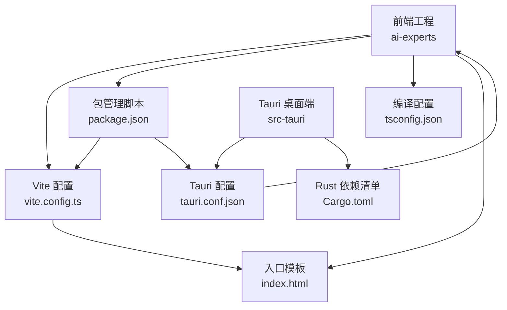
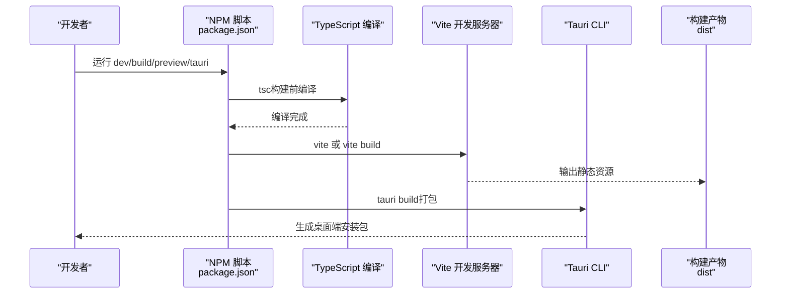
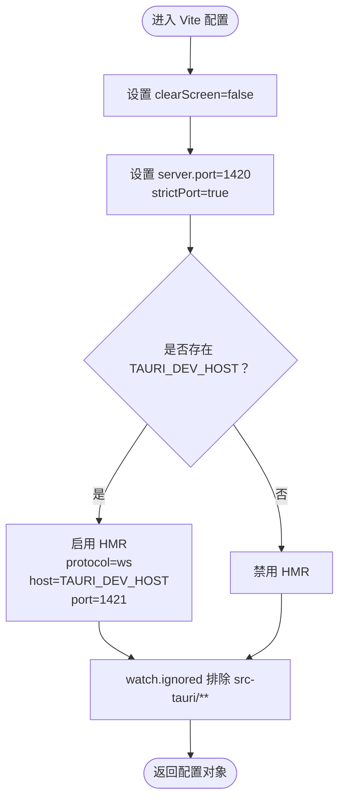
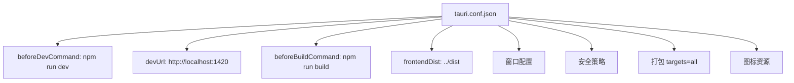
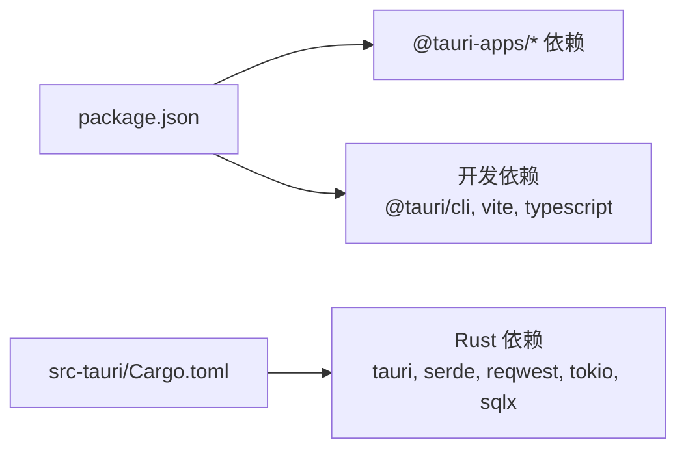

# 构建配置

<cite>
**本文引用的文件**
- [vite.config.ts](file://ai-experts/vite.config.ts)
- [package.json](file://ai-experts/package.json)
- [tauri.conf.json](file://ai-experts/src-tauri/tauri.conf.json)
- [Cargo.toml](file://ai-experts/src-tauri/Cargo.toml)
- [tsconfig.json](file://ai-experts/tsconfig.json)
- [index.html](file://ai-experts/index.html)
</cite>

## 目录
1. [简介](#简介)
2. [项目结构](#项目结构)
3. [核心组件](#核心组件)
4. [架构总览](#架构总览)
5. [详细组件分析](#详细组件分析)
6. [依赖分析](#依赖分析)
7. [性能考虑](#性能考虑)
8. [故障排查指南](#故障排查指南)
9. [结论](#结论)
10. [附录](#附录)

## 简介
本文件面向“星图专家团工作台”前端与桌面端一体化构建配置，系统性梳理 Vite 构建配置、Tauri 构建脚本与包管理配置，解释开发与生产环境差异，阐明关键参数作用（如 clearScreen、strictPort、host），并总结静态资源处理、代码分割与打包优化最佳实践。同时提供构建产物目录结构、命名规则与版本管理策略，以及构建失败排查、性能优化与缓存策略的实用指南。

## 项目结构
该项目采用“前端工程 + Tauri 桌面端”的混合架构：
- 前端工程位于 ai-experts 目录，使用 Vite 进行开发与构建，TypeScript 编译由 Vite 驱动。
- 桌面端配置位于 src-tauri，通过 Tauri CLI 与 Vite 协同，构建跨平台安装包。
- 包管理与脚本位于 package.json，统一管理前端依赖与构建命令。

图表来源
- [vite.config.ts:1-31](file://ai-experts/vite.config.ts#L1-L31)
- [package.json:1-28](file://ai-experts/package.json#L1-L28)
- [tauri.conf.json:1-38](file://ai-experts/src-tauri/tauri.conf.json#L1-L38)
- [Cargo.toml:1-46](file://ai-experts/src-tauri/Cargo.toml#L1-L46)
- [tsconfig.json:1-24](file://ai-experts/tsconfig.json#L1-L24)
- [index.html:1-10](file://ai-experts/index.html#L1-L10)

章节来源
- [vite.config.ts:1-31](file://ai-experts/vite.config.ts#L1-L31)
- [package.json:1-28](file://ai-experts/package.json#L1-L28)
- [tauri.conf.json:1-38](file://ai-experts/src-tauri/tauri.conf.json#L1-L38)
- [Cargo.toml:1-46](file://ai-experts/src-tauri/Cargo.toml#L1-L46)
- [tsconfig.json:1-24](file://ai-experts/tsconfig.json#L1-L24)
- [index.html:1-10](file://ai-experts/index.html#L1-L10)

## 核心组件
- Vite 构建配置：定义开发服务器端口、严格端口占用、热重载协议与主机、忽略监听 src-tauri 目录等，确保与 Tauri 开发体验一致。
- Tauri 构建配置：声明构建前后钩子、前端产物目录映射、窗口尺寸与安全策略、打包目标与图标资源等。
- 包管理脚本：统一暴露 dev/build/preview/tauri 等命令，串联 TypeScript 编译与 Vite 构建。
- TypeScript 编译配置：启用 bundler 模式与 ESNext 模块解析，提升打包兼容性。
- 入口模板：通过 index.html 注入样式与入口脚本，承载前端渲染与交互。

章节来源
- [vite.config.ts:1-31](file://ai-experts/vite.config.ts#L1-L31)
- [package.json:6-14](file://ai-experts/package.json#L6-L14)
- [tauri.conf.json:6-11](file://ai-experts/src-tauri/tauri.conf.json#L6-L11)
- [tsconfig.json:9-14](file://ai-experts/tsconfig.json#L9-L14)
- [index.html:5-9](file://ai-experts/index.html#L5-L9)

## 架构总览
下图展示从开发到构建的关键流程与组件协作关系：

图表来源
- [package.json:7-11](file://ai-experts/package.json#L7-L11)
- [vite.config.ts:7-30](file://ai-experts/vite.config.ts#L7-L30)
- [tauri.conf.json:6-11](file://ai-experts/src-tauri/tauri.conf.json#L6-L11)

## 详细组件分析

### Vite 构建配置
- 清屏控制（clearScreen=false）：防止 Vite 在启动时清屏，便于保留终端日志与错误信息，提升调试效率。
- 固定端口与严格端口（port=1420, strictPort=true）：确保 Tauri dev 场景下前端服务稳定运行，若端口被占用直接失败，避免端口漂移带来的联调问题。
- 主机与热重载（host/hmr）：当检测到 TAURI_DEV_HOST 环境变量时，启用 HMR 并指定 ws 协议、主机与 HMR 端口，支持远程设备联调。
- 监听排除（watch.ignored）：忽略 src-tauri 目录，避免 Vite 监听 Rust 源码导致不必要的重启。
- 仅在 Tauri 开发/构建场景生效：这些配置仅在 tauri dev 或 tauri build 期间由 Tauri 统一调用 Vite 时生效。

图表来源
- [vite.config.ts:12-29](file://ai-experts/vite.config.ts#L12-L29)

章节来源
- [vite.config.ts:7-30](file://ai-experts/vite.config.ts#L7-L30)

### Tauri 构建配置
- 构建钩子：beforeDevCommand 指向 npm run dev，beforeBuildCommand 指向 npm run build，确保开发与构建阶段自动编译前端。
- 前端地址：devUrl=http://localhost:1420，与 Vite 固定端口保持一致。
- 前端产物目录：frontendDist 指向 ../dist，与 Vite 默认输出目录一致。
- 应用窗口与安全：窗口尺寸、装饰、全局注入、CSP 等配置集中管理。
- 打包策略：targets=all，生成多平台安装包；图标资源按需配置。

图表来源
- [tauri.conf.json:6-11](file://ai-experts/src-tauri/tauri.conf.json#L6-L11)
- [tauri.conf.json:14-25](file://ai-experts/src-tauri/tauri.conf.json#L14-L25)
- [tauri.conf.json:26-36](file://ai-experts/src-tauri/tauri.conf.json#L26-L36)

章节来源
- [tauri.conf.json:1-38](file://ai-experts/src-tauri/tauri.conf.json#L1-L38)

### 包管理与脚本
- dev/build/preview/tauri：统一入口，串联 tsc 与 vite。
- prompt:check：类型检查与提示模块回放脚本。
- CLI 测试与基线恢复：辅助前端测试与回归验证。

章节来源
- [package.json:6-14](file://ai-experts/package.json#L6-L14)

### TypeScript 编译配置
- 模块解析：bundler 模式 + ESNext，适配现代打包器与浏览器生态。
- 严格模式：开启严格检查，减少潜在运行时风险。
- 仅引入 TS 扩展与 JSON 模块：提升构建兼容性与安全性。

章节来源
- [tsconfig.json:9-14](file://ai-experts/tsconfig.json#L9-L14)
- [tsconfig.json:17-20](file://ai-experts/tsconfig.json#L17-L20)

### 入口模板与静态资源
- index.html 注入样式与入口脚本，作为 Vite 构建后的 DOM 入口。
- 静态资源通过 Vite 处理，遵循模块化与打包策略。

章节来源
- [index.html:5-9](file://ai-experts/index.html#L5-L9)

## 依赖分析
- 前端依赖：@tauri-apps/api、@tauri-apps/plugin-* 等，提供桌面端能力与插件。
- 开发依赖：@tauri/cli、vite、typescript，支撑开发与构建。
- Rust 依赖：tauri、serde、reqwest、tokio、sqlx 等，构成桌面端运行时与功能模块。

图表来源
- [package.json:15-26](file://ai-experts/package.json#L15-L26)
- [Cargo.toml:20-46](file://ai-experts/src-tauri/Cargo.toml#L20-L46)

章节来源
- [package.json:15-26](file://ai-experts/package.json#L15-L26)
- [Cargo.toml:20-46](file://ai-experts/src-tauri/Cargo.toml#L20-L46)

## 性能考虑
- 代码分割与懒加载：利用动态导入与路由级分割，降低首屏体积。
- 资源压缩与去重：启用 Vite 的默认压缩与重复依赖消除策略。
- 静态资源指纹：生产构建默认生成带哈希的文件名，利于缓存与版本管理。
- 严格端口与固定主机：减少网络层不确定性，提升本地开发稳定性。
- 忽略无关目录监听：避免不必要的文件系统事件，缩短热重载时间。

## 故障排查指南
- 端口冲突
  - 现象：启动失败或端口占用。
  - 处理：确认 1420/1421 未被占用；若需远程联调，设置 TAURI_DEV_HOST 并确保防火墙允许访问。
  - 参考：[vite.config.ts:14-18](file://ai-experts/vite.config.ts#L14-L18)、[tauri.conf.json:8](file://ai-experts/src-tauri/tauri.conf.json#L8)
- HMR 不生效
  - 现象：修改代码后无热更新。
  - 处理：确认已设置 TAURI_DEV_HOST 且 HMR 配置启用；检查网络连通性与代理设置。
  - 参考：[vite.config.ts:18-24](file://ai-experts/vite.config.ts#L18-L24)
- 构建产物缺失
  - 现象：dist 目录为空或不完整。
  - 处理：先执行 tsc 再执行 vite build；确认 frontendDist 与实际输出目录一致。
  - 参考：[package.json:8](file://ai-experts/package.json#L8)、[tauri.conf.json:10](file://ai-experts/src-tauri/tauri.conf.json#L10)
- Tauri 打包失败
  - 现象：tauri build 报错。
  - 处理：确保前端已成功构建；检查图标与权限配置；确认 targets/all 权限与签名配置。
  - 参考：[tauri.conf.json:26-36](file://ai-experts/src-tauri/tauri.conf.json#L26-L36)
- 类型检查问题
  - 现象：提示类型错误或模块解析失败。
  - 处理：检查 tsconfig 的 bundler 模式与扩展解析；确保第三方库类型声明存在。
  - 参考：[tsconfig.json:9-14](file://ai-experts/tsconfig.json#L9-L14)

章节来源
- [vite.config.ts:14-24](file://ai-experts/vite.config.ts#L14-L24)
- [tauri.conf.json:8-11](file://ai-experts/src-tauri/tauri.conf.json#L8-L11)
- [package.json:8](file://ai-experts/package.json#L8)
- [tsconfig.json:9-14](file://ai-experts/tsconfig.json#L9-L14)

## 结论
本项目通过 Vite 与 Tauri 的紧密协作，实现了高效的前端开发与跨平台桌面端打包。Vite 的固定端口与严格端口策略、HMR 主机配置与监听排除，显著提升了开发体验；Tauri 的构建钩子与前端产物映射保证了构建一致性。配合 TypeScript 的严格模式与模块解析策略，整体构建流程清晰、可维护性强。建议在团队内统一端口与 HMR 主机规范，并持续关注依赖升级与打包优化策略。

## 附录

### 开发与生产环境差异
- 开发环境
  - 使用 Vite devServer，端口固定为 1420，strictPort=true。
  - 若设置 TAURI_DEV_HOST，则启用 HMR（ws 协议、1421 端口）。
  - 忽略 src-tauri 目录监听，避免误触发。
- 生产环境
  - 使用 vite build 输出静态资源至 dist，默认启用压缩与去重。
  - Tauri 通过 beforeBuildCommand 自动构建前端，再进行打包。

章节来源
- [vite.config.ts:14-29](file://ai-experts/vite.config.ts#L14-L29)
- [tauri.conf.json:7-11](file://ai-experts/src-tauri/tauri.conf.json#L7-L11)

### 关键参数说明
- clearScreen=false：保留终端日志，便于定位问题。
- strictPort=true：端口被占用直接失败，避免端口漂移。
- host：当存在 TAURI_DEV_HOST 时启用 HMR 并指定主机，支持远程联调。
- watch.ignored：排除 src-tauri，减少监听开销。

章节来源
- [vite.config.ts:12-29](file://ai-experts/vite.config.ts#L12-L29)

### 静态资源处理与打包优化
- 资源指纹：生产构建默认生成带哈希文件名，利于浏览器缓存与版本管理。
- 代码分割：按路由与模块动态导入，降低首屏体积。
- 依赖去重：Vite 默认去重策略减少重复依赖。
- 图标与权限：在 tauri.conf.json 中集中配置，确保打包一致性。

章节来源
- [tauri.conf.json:26-36](file://ai-experts/src-tauri/tauri.conf.json#L26-L36)

### 构建产物目录结构与命名规则
- dist：Vite 构建输出目录，包含 HTML、JS、CSS、资源文件等。
- 命名规则：生产构建默认对 JS/CSS 添加哈希后缀，静态资源按内容指纹命名。
- 版本管理：前端版本号与 Tauri 版本号保持一致，便于追踪。

章节来源
- [tauri.conf.json:3-4](file://ai-experts/src-tauri/tauri.conf.json#L3-L4)
- [package.json:4](file://ai-experts/package.json#L4)