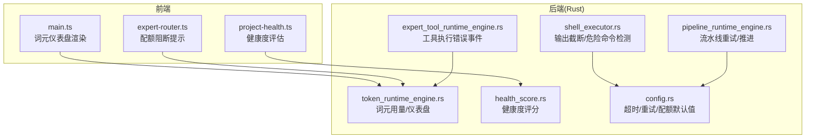
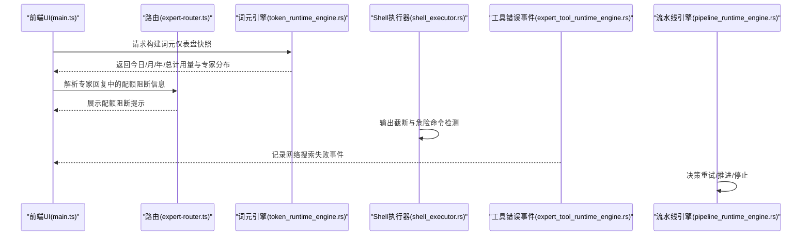
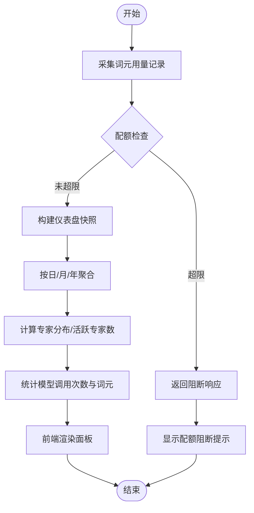
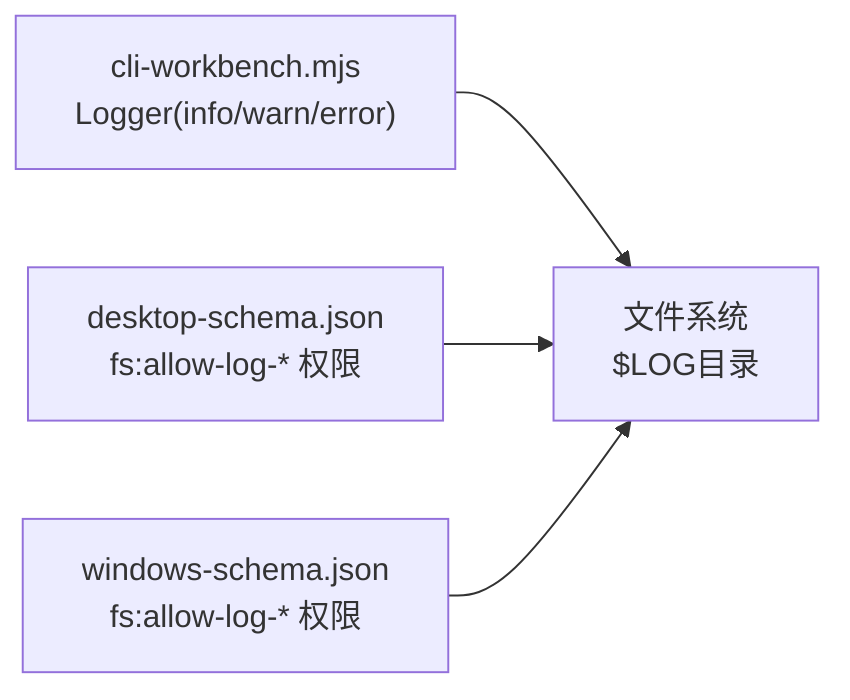
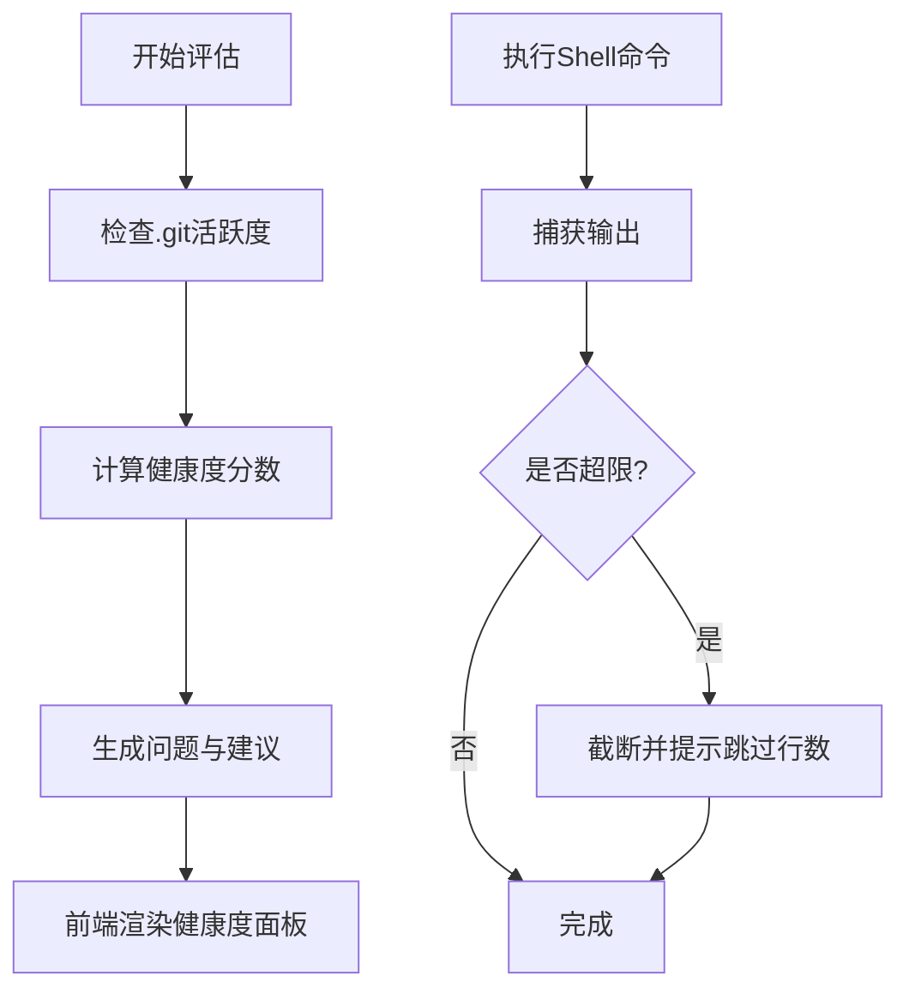
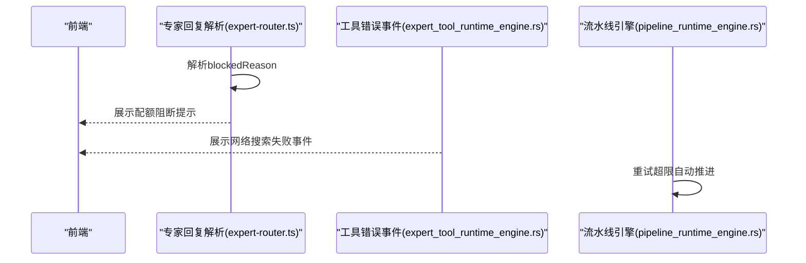
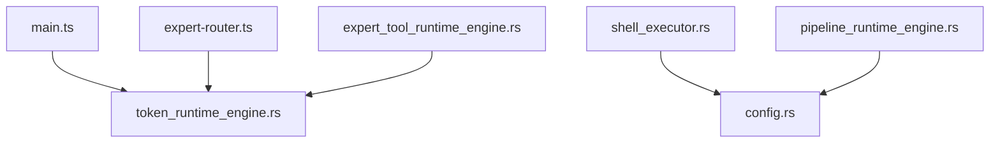

# 监控与日志

<cite>
**本文引用的文件**
- [token_runtime_engine.rs](file://ai-experts/src-tauri/src/token_runtime_engine.rs)
- [main.ts](file://ai-experts/src/main.ts)
- [cli-workbench.mjs](file://ai-experts/scripts/cli-workbench.mjs)
- [project-health.ts](file://ai-experts/src/project-health.ts)
- [health_score.rs](file://ai-experts/src-tauri/src/health_score.rs)
- [shell_executor.rs](file://ai-experts/src-tauri/src/shell_executor.rs)
- [desktop-schema.json](file://ai-experts/src-tauri/gen/schemas/desktop-schema.json)
- [windows-schema.json](file://ai-experts/src-tauri/gen/schemas/windows-schema.json)
- [config.rs](file://ai-experts/src-tauri/src/config.rs)
- [expert-tool-runtime-engine.rs](file://ai-experts/src-tauri/src/expert_tool_runtime_engine.rs)
- [expert-router.ts](file://ai-experts/src/expert-router.ts)
- [pipeline-runtime-engine.rs](file://ai-experts/src-tauri/src/pipeline_runtime_engine.rs)
</cite>

## 目录
1. [简介](#简介)
2. [项目结构](#项目结构)
3. [核心组件](#核心组件)
4. [架构总览](#架构总览)
5. [组件详解](#组件详解)
6. [依赖关系分析](#依赖关系分析)
7. [性能考量](#性能考量)
8. [故障排查指南](#故障排查指南)
9. [结论](#结论)
10. [附录](#附录)

## 简介
本文件面向“星图专家团工作台（社区版）”的监控与日志体系，系统性梳理前端与后端的性能监控指标、日志系统架构、错误报告机制与异常检测配置方法，并提供监控数据采集、存储与可视化的技术方案、告警规则与通知机制、以及故障自动恢复的实现细节。同时给出监控仪表板、性能基准测试与容量规划的实用指南，帮助运维与开发团队建立稳定可靠的运行保障体系。

## 项目结构
项目采用前端（TypeScript/Vue）与后端（Rust/Tauri）混合架构，监控与日志相关能力主要分布在以下模块：
- 前端：主界面渲染、词元仪表盘、项目健康度评估、路由与配额阻断提示
- 后端：词元用量记录与仪表盘快照、Shell 执行器与危险命令检测、健康度评分、配置与超时/重试策略、工具执行错误事件、流水线运行时决策

图表来源
- [main.ts:6626-6722](file://ai-experts/src/main.ts#L6626-L6722)
- [expert-router.ts:1496-1529](file://ai-experts/src/expert-router.ts#L1496-L1529)
- [project-health.ts:56-95](file://ai-experts/src/project-health.ts#L56-L95)
- [token_runtime_engine.rs:297-610](file://ai-experts/src-tauri/src/token_runtime_engine.rs#L297-L610)
- [shell_executor.rs:425-473](file://ai-experts/src-tauri/src/shell_executor.rs#L425-L473)
- [health_score.rs:293-333](file://ai-experts/src-tauri/src/health_score.rs#L293-L333)
- [config.rs:97-152](file://ai-experts/src-tauri/src/config.rs#L97-L152)
- [expert-tool-runtime-engine.rs:169-196](file://ai-experts/src-tauri/src/expert_tool_runtime_engine.rs#L169-L196)
- [pipeline-runtime-engine.rs:49-213](file://ai-experts/src-tauri/src/pipeline_runtime_engine.rs#L49-L213)

章节来源
- [main.ts:6626-6722](file://ai-experts/src/main.ts#L6626-L6722)
- [token_runtime_engine.rs:297-610](file://ai-experts/src-tauri/src/token_runtime_engine.rs#L297-L610)

## 核心组件
- 词元用量与仪表盘：记录专家模型调用的 prompt/completion/total 词元，支持按日/月/年/自定义周期聚合，生成专家分布、模型统计、配额状态等可视化数据。
- 日志系统：前端 CLI 工作台提供统一日志写入器，支持 INFO/WARN/ERROR 级别与额外上下文输出；Tauri 权限模型对 $LOG 目录提供细粒度读写与元数据访问权限。
- 健康度评估：基于 Git 活跃度、依赖与配置等维度计算健康度分数，输出维度详情与改进建议。
- 异常检测与安全：Shell 执行器对输出进行字节与行数限制并截断，危险命令检测识别高风险指令；工具执行错误事件记录网络搜索失败等异常。
- 流水线与配额：流水线运行时在重试超限时推进以避免空转；词元配额检查支持日/月/年级配额阻断并提示用户。

章节来源
- [token_runtime_engine.rs:226-267](file://ai-experts/src-tauri/src/token_runtime_engine.rs#L226-L267)
- [cli-workbench.mjs:44-91](file://ai-experts/scripts/cli-workbench.mjs#L44-L91)
- [desktop-schema.json:780-4908](file://ai-experts/src-tauri/gen/schemas/desktop-schema.json#L780-L4908)
- [windows-schema.json:780-4908](file://ai-experts/src-tauri/gen/schemas/windows-schema.json#L780-L4908)
- [health_score.rs:293-333](file://ai-experts/src-tauri/src/health_score.rs#L293-L333)
- [shell_executor.rs:425-473](file://ai-experts/src-tauri/src/shell_executor.rs#L425-L473)
- [expert-tool-runtime-engine.rs:169-196](file://ai-experts/src-tauri/src/expert_tool_runtime_engine.rs#L169-L196)
- [pipeline-runtime-engine.rs:49-213](file://ai-experts/src-tauri/src/pipeline_runtime_engine.rs#L49-L213)

## 架构总览
前端通过 Tauri 暴露的能力调用后端引擎，后端负责数据聚合、配额校验、异常检测与健康度评分，前端负责可视化展示与用户交互。

图表来源
- [main.ts:6626-6722](file://ai-experts/src/main.ts#L6626-L6722)
- [expert-router.ts:1496-1529](file://ai-experts/src/expert-router.ts#L1496-L1529)
- [token_runtime_engine.rs:297-610](file://ai-experts/src-tauri/src/token_runtime_engine.rs#L297-L610)
- [shell_executor.rs:425-473](file://ai-experts/src-tauri/src/shell_executor.rs#L425-L473)
- [expert-tool-runtime-engine.rs:169-196](file://ai-experts/src-tauri/src/expert_tool_runtime_engine.rs#L169-L196)
- [pipeline-runtime-engine.rs:49-213](file://ai-experts/src-tauri/src/pipeline_runtime_engine.rs#L49-L213)

## 组件详解

### 词元用量与仪表盘
- 数据采集：每次模型调用记录专家标识、模型名、密钥标识与 prompt/completion/total 词元。
- 配额检查：按日/月/年周期汇总用量并与分配限额比较，超限返回阻断响应。
- 快照生成：支持按日/月/年/自定义周期生成趋势序列与专家分布，计算活跃专家数量与模型统计。
- 前端渲染：根据快照生成专家分布、模型统计、配额状态等面板。

图表来源
- [token_runtime_engine.rs:226-267](file://ai-experts/src-tauri/src/token_runtime_engine.rs#L226-L267)
- [token_runtime_engine.rs:297-610](file://ai-experts/src-tauri/src/token_runtime_engine.rs#L297-L610)
- [main.ts:6626-6722](file://ai-experts/src/main.ts#L6626-L6722)
- [expert-router.ts:1496-1529](file://ai-experts/src/expert-router.ts#L1496-L1529)

章节来源
- [token_runtime_engine.rs:226-267](file://ai-experts/src-tauri/src/token_runtime_engine.rs#L226-L267)
- [token_runtime_engine.rs:297-610](file://ai-experts/src-tauri/src/token_runtime_engine.rs#L297-L610)
- [main.ts:6626-6722](file://ai-experts/src/main.ts#L6626-L6722)
- [expert-router.ts:1496-1529](file://ai-experts/src/expert-router.ts#L1496-L1529)

### 日志系统架构与权限
- 前端日志：CLI 工作台提供统一 Logger，支持 INFO/WARN/ERROR 级别，自动写入本地日志文件并打印到控制台，支持附加 JSON 或字符串上下文。
- Tauri 权限：桌面端与 Windows 平台的 schema 明确 $LOG 目录的读写与元数据访问权限，包括非递归与递归权限组合，便于精细化控制日志目录访问范围。

图表来源
- [cli-workbench.mjs:44-91](file://ai-experts/scripts/cli-workbench.mjs#L44-L91)
- [desktop-schema.json:780-4908](file://ai-experts/src-tauri/gen/schemas/desktop-schema.json#L780-L4908)
- [windows-schema.json:780-4908](file://ai-experts/src-tauri/gen/schemas/windows-schema.json#L780-L4908)

章节来源
- [cli-workbench.mjs:44-91](file://ai-experts/scripts/cli-workbench.mjs#L44-L91)
- [desktop-schema.json:780-4908](file://ai-experts/src-tauri/gen/schemas/desktop-schema.json#L780-L4908)
- [windows-schema.json:780-4908](file://ai-experts/src-tauri/gen/schemas/windows-schema.json#L780-L4908)

### 健康度评估与异常检测
- 健康度评分：基于 Git 活跃度、依赖与配置等维度计算分数，输出维度详情与改进建议；未检测到 Git 仓库会提示使用版本控制。
- 异常检测：Shell 执行器对输出进行字节与行数限制，超过阈值时截断并提示跳过行数；危险命令检测识别高风险指令，必要时要求提升权限或阻断。

图表来源
- [health_score.rs:293-333](file://ai-experts/src-tauri/src/health_score.rs#L293-L333)
- [project-health.ts:56-95](file://ai-experts/src/project-health.ts#L56-L95)
- [shell_executor.rs:425-473](file://ai-experts/src-tauri/src/shell_executor.rs#L425-L473)

章节来源
- [health_score.rs:293-333](file://ai-experts/src-tauri/src/health_score.rs#L293-L333)
- [project-health.ts:56-95](file://ai-experts/src/project-health.ts#L56-L95)
- [shell_executor.rs:425-473](file://ai-experts/src-tauri/src/shell_executor.rs#L425-L473)

### 错误报告机制与通知
- 工具执行错误事件：网络搜索失败时构造事件载荷，包含专家标识、查询内容、错误信息与状态，便于前端展示与审计。
- 配额阻断提示：专家回复中可能包含 blockedReason 字段，前端解析后展示阻断原因与建议。
- 流水线自动推进：当重试次数超过上限且处于“retry/artifact-missing”场景时，自动推进以避免原地空转。

图表来源
- [expert-router.ts:1496-1529](file://ai-experts/src/expert-router.ts#L1496-L1529)
- [expert-tool-runtime-engine.rs:169-196](file://ai-experts/src-tauri/src/expert_tool_runtime_engine.rs#L169-L196)
- [pipeline-runtime-engine.rs:49-213](file://ai-experts/src-tauri/src/pipeline_runtime_engine.rs#L49-L213)

章节来源
- [expert-router.ts:1496-1529](file://ai-experts/src/expert-router.ts#L1496-L1529)
- [expert-tool-runtime-engine.rs:169-196](file://ai-experts/src-tauri/src/expert_tool_runtime_engine.rs#L169-L196)
- [pipeline-runtime-engine.rs:49-213](file://ai-experts/src-tauri/src/pipeline_runtime_engine.rs#L49-L213)

## 依赖关系分析
- 前端依赖后端提供的词元快照与健康度评估接口；路由层解析配额阻断信息并反馈给 UI。
- 后端各引擎之间通过请求/响应结构解耦，词元引擎承担数据聚合与配额检查的核心职责。
- 配置模块为 Shell 执行器与代理运行提供默认超时、最大重试与输出限制参数，影响日志与安全策略的边界。

图表来源
- [main.ts:6626-6722](file://ai-experts/src/main.ts#L6626-L6722)
- [expert-router.ts:1496-1529](file://ai-experts/src/expert-router.ts#L1496-L1529)
- [token_runtime_engine.rs:297-610](file://ai-experts/src-tauri/src/token_runtime_engine.rs#L297-L610)
- [shell_executor.rs:425-473](file://ai-experts/src-tauri/src/shell_executor.rs#L425-L473)
- [config.rs:97-152](file://ai-experts/src-tauri/src/config.rs#L97-L152)
- [expert-tool-runtime-engine.rs:169-196](file://ai-experts/src-tauri/src/expert_tool_runtime_engine.rs#L169-L196)
- [pipeline-runtime-engine.rs:49-213](file://ai-experts/src-tauri/src/pipeline_runtime_engine.rs#L49-L213)

章节来源
- [config.rs:97-152](file://ai-experts/src-tauri/src/config.rs#L97-L152)

## 性能考量
- 词元聚合复杂度：按周期聚合与专家分布排序的时间复杂度与记录条数成正比；建议定期清理历史记录以控制 O(n) 聚合成本。
- Shell 输出截断：通过头缓冲与环形尾缓冲实现 O(n) 输出拼接，超过阈值时截断可有效防止内存膨胀。
- 重试与退避：配置模块提供指数退避与最大重试次数，避免对下游服务造成雪崩；结合流水线自动推进策略减少无效重试。
- 健康度评估：Git 元数据读取与文件系统访问为轻量操作，但应避免在热路径频繁调用，建议缓存评估结果。

[本节为通用性能指导，不直接分析具体文件]

## 故障排查指南
- 词元配额阻断：若出现“日/月/年”配额阻断提示，检查专家分配限额与当前用量，确认是否需要调整配额或等待周期重置。
- 网络搜索失败：查看工具执行错误事件中的错误信息，确认网络连通性与查询参数；必要时重试或切换网络环境。
- Shell 输出截断：若日志被截断，检查输出大小与行数限制配置，适当增大阈值或分段处理。
- 流水线停滞：当重试超限触发自动推进，检查当前步骤的交付物与专家协作状态，必要时手动干预。

章节来源
- [token_runtime_engine.rs:226-267](file://ai-experts/src-tauri/src/token_runtime_engine.rs#L226-L267)
- [expert-tool-runtime-engine.rs:169-196](file://ai-experts/src-tauri/src/expert_tool_runtime_engine.rs#L169-L196)
- [shell_executor.rs:425-473](file://ai-experts/src-tauri/src/shell_executor.rs#L425-L473)
- [pipeline-runtime-engine.rs:49-213](file://ai-experts/src-tauri/src/pipeline_runtime_engine.rs#L49-L213)

## 结论
本项目在前端与后端分别实现了词元监控、健康度评估、日志与安全策略，并通过 Tauri 权限模型保障日志目录的安全访问。通过配额检查、异常检测与流水线自动推进机制，系统具备一定的自愈能力。建议在生产环境中结合日志轮转、指标持久化与可视化看板，完善告警与通知机制，持续优化性能与容量规划。

[本节为总结性内容，不直接分析具体文件]

## 附录

### 监控仪表板与可视化
- 词元仪表盘：展示今日/月/年/总计用量、专家分布、模型统计与配额状态，前端根据快照动态渲染。
- 项目健康度：展示总体分数与各维度详情，辅助定位潜在问题与改进方向。

章节来源
- [main.ts:6626-6722](file://ai-experts/src/main.ts#L6626-L6722)
- [project-health.ts:56-95](file://ai-experts/src/project-health.ts#L56-L95)

### 日志级别、格式与轮转
- 日志级别：INFO/WARN/ERROR，支持附加 JSON 或字符串上下文。
- 日志格式：包含时间戳、级别与消息正文，便于统一解析与检索。
- 日志轮转：建议结合系统日志轮转工具（如 logrotate）对 $LOG 目录下的日志文件进行按大小/时间轮转，保留必要的历史周期以便审计。

章节来源
- [cli-workbench.mjs:44-91](file://ai-experts/scripts/cli-workbench.mjs#L44-L91)
- [desktop-schema.json:780-4908](file://ai-experts/src-tauri/gen/schemas/desktop-schema.json#L780-L4908)
- [windows-schema.json:780-4908](file://ai-experts/src-tauri/gen/schemas/windows-schema.json#L780-L4908)

### 告警规则与通知
- 告警规则示例：
  - 词元用量：日/月/年用量接近或超过限额时触发预警。
  - 健康度：活跃度长期下降或存在高风险问题时触发告警。
  - 异常事件：网络搜索失败率上升、Shell 执行超时或被截断比例过高。
- 通知机制：结合前端提示与外部告警平台（如邮件/SMS/IM），在关键阈值触发时及时通知运维与产品团队。

[本节为通用配置建议，不直接分析具体文件]

### 容量规划与基准测试
- 容量规划：基于词元用量趋势与专家分布，评估模型调用规模与峰值，预留配额与计算资源。
- 基准测试：在不同数据规模与并发条件下测量词元聚合、健康度评估与 Shell 执行的延迟与吞吐，形成性能基线。

[本节为通用实践建议，不直接分析具体文件]