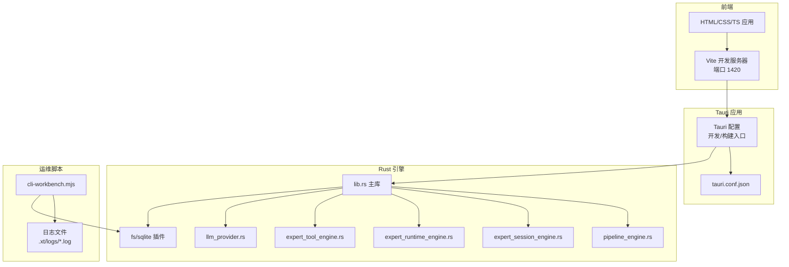
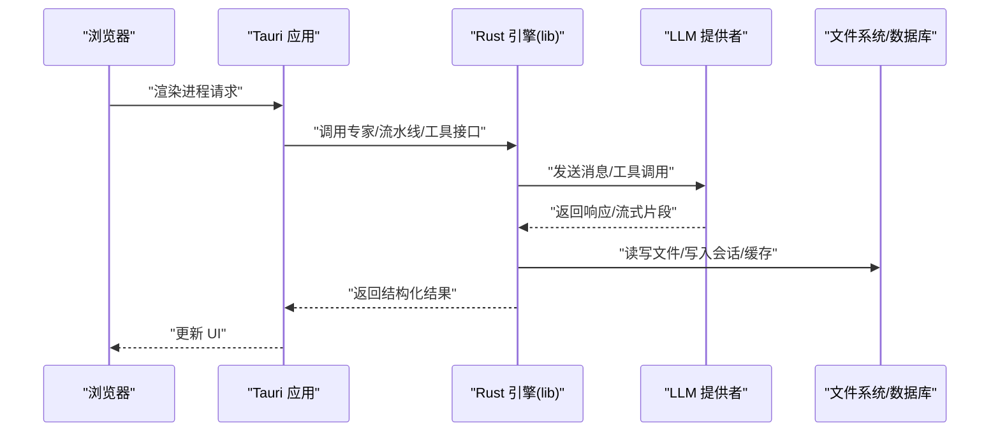
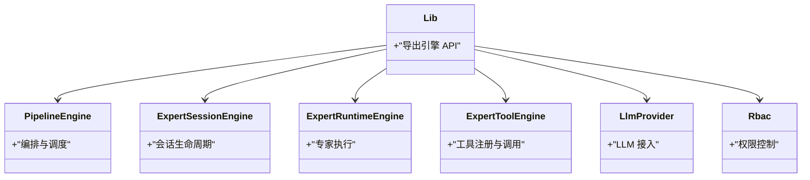
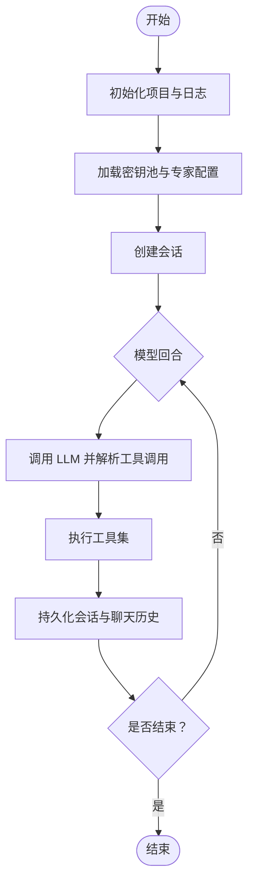
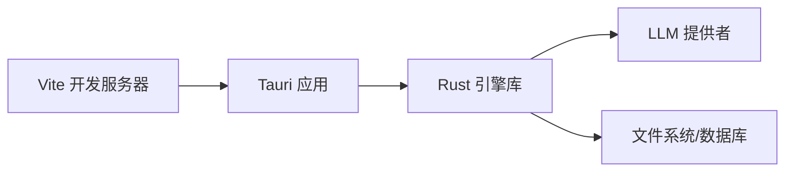

# 部署与运维

<cite>
**本文引用的文件**   
- [package.json](file://ai-experts/package.json)
- [vite.config.ts](file://ai-experts/vite.config.ts)
- [Cargo.toml](file://ai-experts/src-tauri/Cargo.toml)
- [tauri.conf.json](file://ai-experts/src-tauri/tauri.conf.json)
- [cli-workbench.mjs](file://ai-experts/scripts/cli-workbench.mjs)
- [main.rs](file://ai-experts/src-tauri/src/main.rs)
- [lib.rs](file://ai-experts/src-tauri/src/lib.rs)
- [hooks.rs](file://ai-experts/src-tauri/src/hooks.rs)
- [config.rs](file://ai-experts/src-tauri/src/config.rs)
- [memory.rs](file://ai-experts/src-tauri/src/memory.rs)
- [pipeline_engine.rs](file://ai-experts/src-tauri/src/pipeline_engine.rs)
- [expert_session_engine.rs](file://ai-experts/src-tauri/src/expert_session_engine.rs)
- [expert_runtime_engine.rs](file://ai-experts/src-tauri/src/expert_runtime_engine.rs)
- [expert_tool_engine.rs](file://ai-experts/src-tauri/src/expert_tool_engine.rs)
- [supervisor_engine.rs](file://ai-experts/src-tauri/src/supervisor_engine.rs)
- [llm_provider.rs](file://ai-experts/src-tauri/src/llm_provider.rs)
- [web_search.rs](file://ai-experts/src-tauri/src/web_search.rs)
- [shell_executor.rs](file://ai-experts/src-tauri/src/shell_executor.rs)
- [rbac.rs](file://ai-experts/src-tauri/src/rbac.rs)
- [workflow_engine.rs](file://ai-experts/src-tauri/src/workflow_engine.rs)
- [collaboration_engine.rs](file://ai-experts/src-tauri/src/collaboration_engine.rs)
- [deliverables.rs](file://ai-experts/src-tauri/src/deliverables.rs)
- [health_score.rs](file://ai-experts/src-tauri/src/health_score.rs)
- [perceptual_index.rs](file://ai-experts/src-tauri/src/perceptual_index.rs)
- [tfidf.rs](file://ai-experts/src-tauri/src/tfidf.rs)
- [code_chunker.rs](file://ai-experts/src-tauri/src/code_chunker.rs)
- [code_graph.rs](file://ai-experts/src-tauri/src/code_graph.rs)
- [code_retention.rs](file://ai-experts/src-tauri/src/code_retention.rs)
- [file_patch.rs](file://ai-experts/src-tauri/src/file_patch.rs)
- [repo_wiki.rs](file://ai-experts/src-tauri/src/repo_wiki.rs)
- [doc_processor.rs](file://ai-experts/src-tauri/src/doc_processor.rs)
- [experience.rs](file://ai-experts/src-tauri/src/experience.rs)
- [token_runtime_engine.rs](file://ai-experts/src-tauri/src/token_runtime_engine.rs)
- [approval_store.rs](file://ai-experts/src-tauri/src/approval_store.rs)
- [blackboard_engine.rs](file://ai-experts/src-tauri/src/blackboard_engine.rs)
- [llm_stream.rs](file://ai-experts/src-tauri/src/llm_stream.rs)
- [tool_system.rs](file://ai-experts/src-tauri/src/tool_system.rs)
- [provider-registry.ts](file://ai-experts/src/provider-registry.ts)
- [context-manager.ts](file://ai-experts/src/context-manager.ts)
- [task-tracker.ts](file://ai-experts/src/task-tracker.ts)
- [draft.ts](file://ai-experts/src/draft.ts)
- [sidebar.ts](file://ai-experts/src/sidebar.ts)
- [expert-catalog.ts](file://ai-experts/src/expert-catalog.ts)
- [expert-router.ts](file://ai-experts/src/expert-router.ts)
- [agent-loop.ts](file://ai-experts/src/agent-loop.ts)
- [main.ts](file://ai-experts/src/main.ts)
- [canvas.ts](file://ai-experts/src/canvas.ts)
</cite>

## 目录
1. [简介](#简介)
2. [项目结构](#项目结构)
3. [核心组件](#核心组件)
4. [架构总览](#架构总览)
5. [详细组件分析](#详细组件分析)
6. [依赖关系分析](#依赖关系分析)
7. [性能考量](#性能考量)
8. [故障排查指南](#故障排查指南)
9. [结论](#结论)
10. [附录](#附录)

## 简介
本文件面向运维与平台工程团队，提供“星图专家团工作台”的部署与运维全栈指南。内容涵盖构建配置、打包分发、配置管理、监控与日志、性能与安全、扩展与高可用、自动化与灾备、版本与回滚策略，以及可观测性与故障诊断方法。文档以仓库现有实现为依据，结合 Rust 引擎与 Tauri 框架特性，给出可落地的实践建议。

## 项目结构
项目采用“前端 + Tauri 应用引擎 + Rust 核心模块”的混合架构：
- 前端层：TypeScript/Vite 构建，Tauri 开发服务器与 HMR 配置。
- 应用层：Tauri 配置驱动开发与打包，统一产物目录与启动参数。
- 引擎层：Rust crate 提供 AI 专家编排、会话与工具链、数据处理、权限控制、流式推理等能力。
- 运维脚本：CLI 工作台脚本负责项目初始化、会话持久化、SQLite 同步、日志记录与验证。

图表来源
- [vite.config.ts:1-31](file://ai-experts/vite.config.ts#L1-L31)
- [tauri.conf.json:1-38](file://ai-experts/src-tauri/tauri.conf.json#L1-L38)
- [Cargo.toml:1-46](file://ai-experts/src-tauri/Cargo.toml#L1-L46)
- [cli-workbench.mjs:44-72](file://ai-experts/scripts/cli-workbench.mjs#L44-L72)

章节来源
- [package.json:1-28](file://ai-experts/package.json#L1-L28)
- [vite.config.ts:1-31](file://ai-experts/vite.config.ts#L1-L31)
- [tauri.conf.json:1-38](file://ai-experts/src-tauri/tauri.conf.json#L1-L38)
- [Cargo.toml:1-46](file://ai-experts/src-tauri/Cargo.toml#L1-L46)

## 核心组件
- 构建与开发
  - 前端使用 Vite，固定端口 1420，严格端口占用，支持 HMR；忽略 src-tauri 目录监听。
  - Tauri 配置定义开发/构建前置命令、前端产物目录、窗口尺寸与安全策略。
  - Rust 侧使用 Tauri 插件生态（fs、dialog、opener），数据库使用 SQLite（sqlx）。
- 引擎与业务
  - 引擎模块包括流水线、会话、运行时、工具、LLM 提供者、协作、交付物、健康度与感知指数等。
  - 权限与访问控制由 RBAC 模块支撑。
- 运维与 CLI
  - CLI 工作台负责项目目录初始化、会话持久化、SQLite 同步、日志记录与场景化验证。
  - 默认数据目录位于用户应用数据目录下的产品标识路径，包含项目清单、密钥池、专家配置与聊天历史数据库。

章节来源
- [vite.config.ts:7-30](file://ai-experts/vite.config.ts#L7-L30)
- [tauri.conf.json:6-11](file://ai-experts/src-tauri/tauri.conf.json#L6-L11)
- [Cargo.toml:20-46](file://ai-experts/src-tauri/Cargo.toml#L20-L46)
- [cli-workbench.mjs:9-16](file://ai-experts/scripts/cli-workbench.mjs#L9-L16)
- [cli-workbench.mjs:143-163](file://ai-experts/scripts/cli-workbench.mjs#L143-L163)

## 架构总览
下图展示从浏览器到 Rust 引擎的调用链路，以及 CLI 工具与本地文件系统的交互。

图表来源
- [tauri.conf.json:7-10](file://ai-experts/src-tauri/tauri.conf.json#L7-L10)
- [Cargo.toml:20-46](file://ai-experts/src-tauri/Cargo.toml#L20-L46)
- [llm_provider.rs](file://ai-experts/src-tauri/src/llm_provider.rs)
- [lib.rs](file://ai-experts/src-tauri/src/lib.rs)

## 详细组件分析

### 构建与打包配置
- 前端构建
  - 开发模式：Vite 固定端口 1420，严格端口占用；HMR 可远程连接（通过环境变量配置主机）。
  - 忽略 src-tauri 目录监听，避免误触发。
- 应用打包
  - 开发前命令：npm run dev
  - 构建前命令：npm run build
  - 前端产物目录：../dist
  - 打包目标：all（跨平台）
  - 图标资源：多分辨率与平台图标
- Rust 依赖
  - Tauri 2 核心、插件（fs、dialog、opener）、序列化、网络请求、Tokio 运行时、SQLx SQLite、正则、时间等。

章节来源
- [vite.config.ts:14-29](file://ai-experts/vite.config.ts#L14-L29)
- [tauri.conf.json:6-11](file://ai-experts/src-tauri/tauri.conf.json#L6-L11)
- [tauri.conf.json:26-36](file://ai-experts/src-tauri/tauri.conf.json#L26-L36)
- [Cargo.toml:20-46](file://ai-experts/src-tauri/Cargo.toml#L20-L46)

### 配置管理与安全
- 应用安全
  - Tauri 安全策略字段允许自定义 CSP；当前配置为禁用（null），需根据生产环境评估启用。
- 环境与密钥
  - CLI 工作台从用户应用数据目录读取密钥池与专家配置，支持多提供商（DeepSeek、OpenAI、阿里 DashScope）。
  - API 调用携带 Bearer Token，模型参数与温度等可按场景调整。
- 数据隔离
  - 项目数据目录包含 .xt 子目录（configs、logs、cache），会话与聊天历史持久化至本地 SQLite。

章节来源
- [tauri.conf.json:22-24](file://ai-experts/src-tauri/tauri.conf.json#L22-L24)
- [cli-workbench.mjs:201-218](file://ai-experts/scripts/cli-workbench.mjs#L201-L218)
- [cli-workbench.mjs:87-106](file://ai-experts/scripts/cli-workbench.mjs#L87-L106)
- [cli-workbench.mjs:143-163](file://ai-experts/scripts/cli-workbench.mjs#L143-L163)

### 日志系统与持久化
- 日志
  - CLI 工作台提供 Logger 类，输出到控制台并追加到文件；日志文件位于项目 .xt/logs 下。
- 会话与聊天历史
  - 会话持久化为 JSON 文件；同时尝试同步到 chat_history.db（SQLite）。
  - 项目记录与会话同步逻辑包含错误降级处理，避免阻塞主流程。

章节来源
- [cli-workbench.mjs:44-72](file://ai-experts/scripts/cli-workbench.mjs#L44-L72)
- [cli-workbench.mjs:195-199](file://ai-experts/scripts/cli-workbench.mjs#L195-L199)
- [cli-workbench.mjs:143-163](file://ai-experts/scripts/cli-workbench.mjs#L143-L163)

### 引擎模块与数据流
- 引擎模块概览
  - 流水线引擎、专家会话引擎、专家运行时引擎、专家工具引擎、监督引擎、工作流引擎、协作引擎、交付物、健康评分、感知指数、TF-IDF、代码切片与图谱、代码留存、文件补丁、仓库 Wiki、文档处理、经验与令牌运行时、审批存储、黑板引擎、LLM 流式处理、工具系统等。
- 数据与控制流
  - 引擎通过 Tauri 暴露 API，前端发起请求，Rust 引擎执行业务逻辑，必要时访问文件系统与数据库，最后返回结构化结果。

图表来源
- [lib.rs](file://ai-experts/src-tauri/src/lib.rs)
- [pipeline_engine.rs](file://ai-experts/src-tauri/src/pipeline_engine.rs)
- [expert_session_engine.rs](file://ai-experts/src-tauri/src/expert_session_engine.rs)
- [expert_runtime_engine.rs](file://ai-experts/src-tauri/src/expert_runtime_engine.rs)
- [expert_tool_engine.rs](file://ai-experts/src-tauri/src/expert_tool_engine.rs)
- [llm_provider.rs](file://ai-experts/src-tauri/src/llm_provider.rs)
- [rbac.rs](file://ai-experts/src-tauri/src/rbac.rs)

章节来源
- [Cargo.toml:20-46](file://ai-experts/src-tauri/Cargo.toml#L20-L46)
- [lib.rs](file://ai-experts/src-tauri/src/lib.rs)

### CLI 工作台与自动化
- 功能要点
  - 初始化项目目录与 .xt 结构，维护项目清单，同步到 SQLite。
  - 会话管理与持久化，支持多次尝试与自动修复提示。
  - 工具集：列出文件、搜索仓库、读取/写入/编辑文件、创建目录。
  - 场景化验证：确保生成文件、工具使用、回复包含上下文等。
- 执行流程

图表来源
- [cli-workbench.mjs:460-588](file://ai-experts/scripts/cli-workbench.mjs#L460-L588)
- [cli-workbench.mjs:626-654](file://ai-experts/scripts/cli-workbench.mjs#L626-L654)

章节来源
- [cli-workbench.mjs:656-777](file://ai-experts/scripts/cli-workbench.mjs#L656-L777)

## 依赖关系分析
- 前端到应用
  - Vite 开发服务器与 Tauri 配置绑定，前端产物目录与构建命令由 Tauri 统一管理。
- 应用到引擎
  - Tauri 通过 Rust 动态库暴露 API，前端通过 Tauri 命令调用 Rust 实现。
- 引擎到外部
  - LLM 提供者通过 HTTP 发送请求；文件系统与 SQLite 通过 Tauri 插件访问。

图表来源
- [vite.config.ts:7-30](file://ai-experts/vite.config.ts#L7-L30)
- [tauri.conf.json:6-11](file://ai-experts/src-tauri/tauri.conf.json#L6-L11)
- [Cargo.toml:20-46](file://ai-experts/src-tauri/Cargo.toml#L20-L46)

章节来源
- [vite.config.ts:7-30](file://ai-experts/vite.config.ts#L7-L30)
- [tauri.conf.json:6-11](file://ai-experts/src-tauri/tauri.conf.json#L6-L11)
- [Cargo.toml:20-46](file://ai-experts/src-tauri/Cargo.toml#L20-L46)

## 性能考量
- 构建与启动
  - 固定端口与严格端口占用可避免端口冲突；忽略 src-tauri 监听减少不必要的热更新开销。
- 运行时
  - Tokio 多线程运行时适合 I/O 密集型任务；SQLx SQLite 适配本地数据；正则与文本处理模块按需启用。
- LLM 调用
  - 控制温度与工具调用轮次，避免长对话导致的延迟；必要时启用流式处理（llm_stream）以提升感知性能。
- 资源优化
  - 仅在需要时加载大型模块；对高频路径进行缓存（如 .xt/cache）。

章节来源
- [vite.config.ts:12-29](file://ai-experts/vite.config.ts#L12-L29)
- [Cargo.toml:27-28](file://ai-experts/src-tauri/Cargo.toml#L27-L28)
- [Cargo.toml:39-41](file://ai-experts/src-tauri/Cargo.toml#L39-L41)
- [llm_stream.rs](file://ai-experts/src-tauri/src/llm_stream.rs)

## 故障排查指南
- 开发与构建
  - 端口占用：若 1420 不可用，Tauri 将失败；请释放端口或调整配置。
  - HMR 远程：如需远程 HMR，设置开发主机环境变量并确认协议与端口。
- 应用与打包
  - 前端产物缺失：确认构建命令与前端产物目录配置一致。
  - 打包目标：all 会生成多平台包，注意签名与沙箱策略。
- 引擎与数据
  - SQLite 同步失败：检查 chat_history.db 是否存在及权限；查看 CLI 日志定位错误。
  - 工具调用越界：确保路径解析在项目根目录之内。
- LLM 与密钥
  - 认证失败：核对密钥池中的 providerId 与 apiKey；确认模型名称与提供商兼容。
  - 请求异常：检查网络连通性与提供商服务状态。

章节来源
- [vite.config.ts:14-24](file://ai-experts/vite.config.ts#L14-L24)
- [tauri.conf.json:6-11](file://ai-experts/src-tauri/tauri.conf.json#L6-L11)
- [cli-workbench.mjs:136-141](file://ai-experts/scripts/cli-workbench.mjs#L136-L141)
- [cli-workbench.mjs:320-327](file://ai-experts/scripts/cli-workbench.mjs#L320-L327)
- [cli-workbench.mjs:417-441](file://ai-experts/scripts/cli-workbench.mjs#L417-L441)

## 结论
本项目以 Tauri 为载体，结合 Rust 引擎实现高性能、可扩展的本地 AI 专家工作台。通过统一的构建与打包配置、完善的日志与持久化机制、严谨的工具与路径安全策略，能够满足开发调试与生产部署的双重需求。建议在生产环境中启用更严格的 CSP、完善监控与告警、制定版本与回滚策略，并持续优化 LLM 调用与文件系统访问路径。

## 附录

### 生产构建流程
- 前端构建
  - 执行构建命令，生成静态资源到前端产物目录。
- 应用打包
  - 使用 Tauri CLI 触发打包，选择目标平台；校验图标与签名。
- 包装分发
  - 生成安装包后，进行完整性校验与签名验证。

章节来源
- [package.json:8](file://ai-experts/package.json#L8)
- [tauri.conf.json:9](file://ai-experts/src-tauri/tauri.conf.json#L9)
- [tauri.conf.json:28](file://ai-experts/src-tauri/tauri.conf.json#L28)

### 环境配置与安全策略
- 环境变量
  - 开发主机：用于启用远程 HMR。
- 安全配置
  - 建议在生产环境启用 CSP；对敏感数据（密钥）进行加密存储与最小权限访问。

章节来源
- [vite.config.ts:4](file://ai-experts/vite.config.ts#L4)
- [tauri.conf.json:22-24](file://ai-experts/src-tauri/tauri.conf.json#L22-L24)

### 监控与日志
- 日志
  - CLI 工作台日志文件位于项目 .xt/logs；建议集中采集与轮转。
- 监控
  - 建议接入应用指标（CPU/内存/IO）与 LLM 调用耗时、错误率等。

章节来源
- [cli-workbench.mjs:44-72](file://ai-experts/scripts/cli-workbench.mjs#L44-L72)

### 版本管理、更新与回滚
- 版本号
  - 应用与包版本在配置文件中定义，建议遵循语义化版本。
- 更新机制
  - 建议通过安装包升级；保留旧版本以便回滚。
- 回滚策略
  - 回滚到上一个稳定版本；必要时还原项目与会话数据。

章节来源
- [tauri.conf.json:3-5](file://ai-experts/src-tauri/tauri.conf.json#L3-L5)
- [package.json:4](file://ai-experts/package.json#L4)

### 运维自动化、备份与灾备
- 自动化
  - 使用 CLI 工作台进行场景化验证与回归测试；结合 CI/CD 自动化构建与打包。
- 备份
  - 定期备份用户数据目录（项目、专家、密钥池、聊天历史）。
- 灾备
  - 准备镜像与安装包；在灾难发生后快速恢复数据与应用。

章节来源
- [cli-workbench.mjs:656-777](file://ai-experts/scripts/cli-workbench.mjs#L656-L777)
- [cli-workbench.mjs:143-163](file://ai-experts/scripts/cli-workbench.mjs#L143-L163)

### 基础设施要求与扩展性
- 基础设施
  - 支持 Windows/macOS/Linux；打包目标为 all。
- 扩展性
  - 引擎模块化设计，可通过新增模块扩展能力；数据库与文件系统访问需考虑并发与锁策略。

章节来源
- [tauri.conf.json:28](file://ai-experts/src-tauri/tauri.conf.json#L28)
- [Cargo.toml:20-46](file://ai-experts/src-tauri/Cargo.toml#L20-L46)