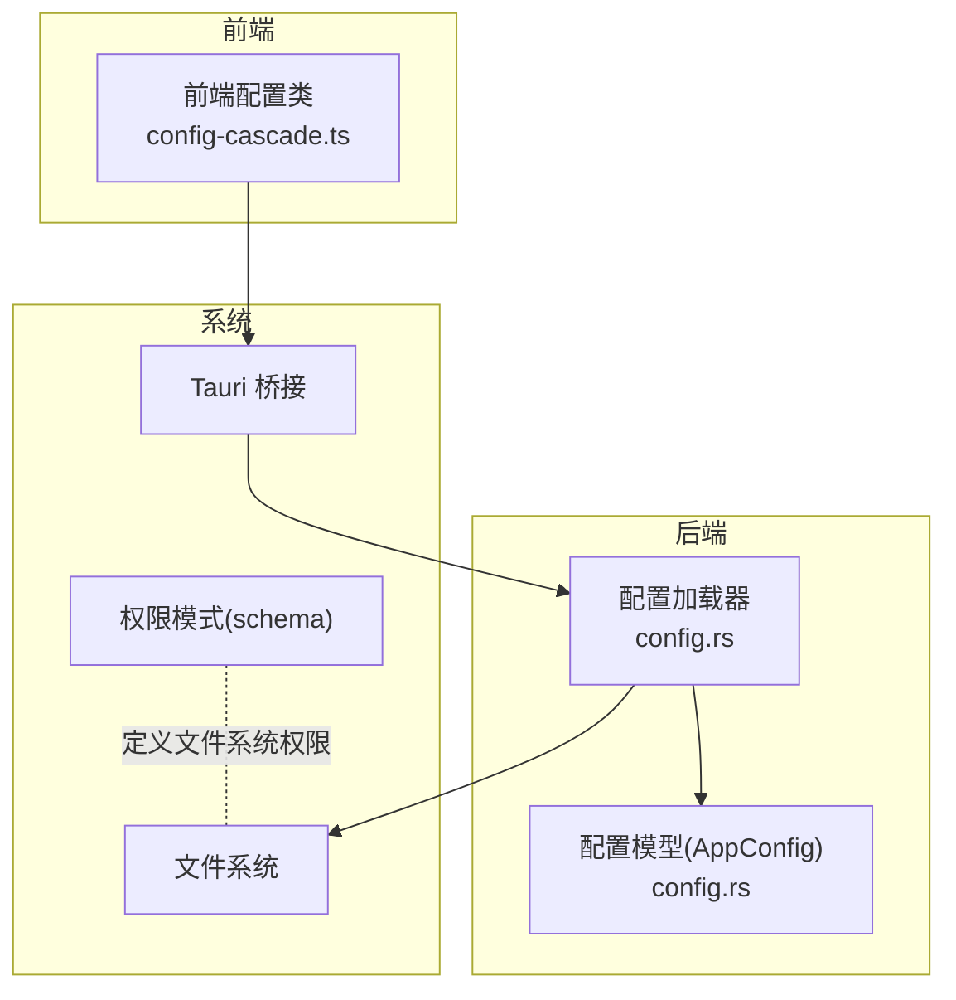
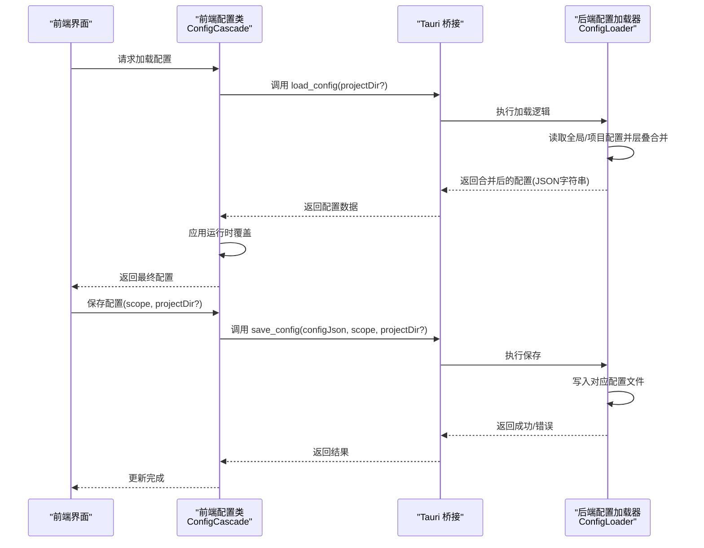
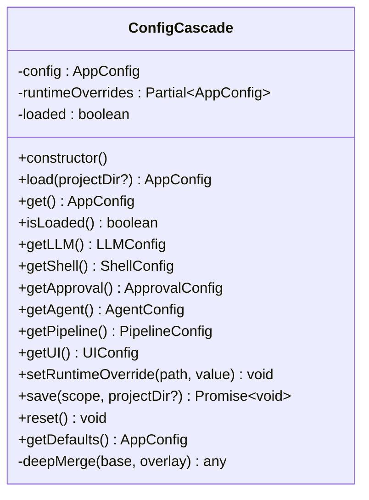
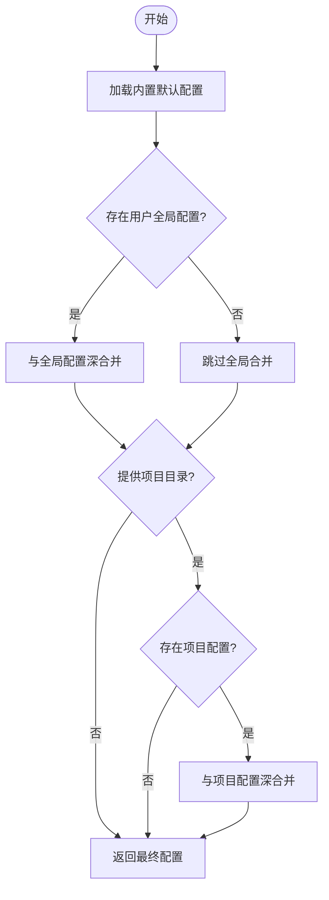
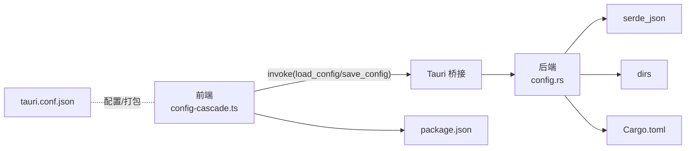

# 配置管理

<cite>
**本文引用的文件**
- [config-cascade.ts](file://ai-experts/src/config-cascade.ts)
- [config.rs](file://ai-experts/src-tauri/src/config.rs)
- [tauri.conf.json](file://ai-experts/src-tauri/tauri.conf.json)
- [Cargo.toml](file://ai-experts/src-tauri/Cargo.toml)
- [package.json](file://ai-experts/package.json)
- [desktop-schema.json](file://ai-experts/src-tauri/gen/schemas/desktop-schema.json)
- [windows-schema.json](file://ai-experts/src-tauri/gen/schemas/windows-schema.json)
</cite>

## 目录
1. [简介](#简介)
2. [项目结构](#项目结构)
3. [核心组件](#核心组件)
4. [架构总览](#架构总览)
5. [详细组件分析](#详细组件分析)
6. [依赖关系分析](#依赖关系分析)
7. [性能考量](#性能考量)
8. [故障排查指南](#故障排查指南)
9. [结论](#结论)
10. [附录](#附录)

## 简介
本文件面向“星图专家团工作台”的配置管理体系，系统性阐述前端与后端的配置层级、文件格式、配置项定义、优先级与默认值、持久化与加载流程、安全策略与访问控制，并给出配置模板、示例与最佳实践建议。目标是帮助开发者与运维人员在不同环境（本地开发、CI/CD、生产部署）下稳定地管理应用配置。

## 项目结构
配置相关的核心位置分布于前端与后端：
- 前端（TypeScript）：通过 Tauri 桥接调用后端能力，负责运行时覆盖与 UI 展示默认值。
- 后端（Rust）：负责配置文件的发现、层叠合并、持久化与默认值生成。
- 构建与打包：Tauri 配置定义了窗口、安全策略与打包图标等元信息；权限模式文件定义了文件系统访问范围。

**图表来源**
- [config-cascade.ts:108-195](file://ai-experts/src/config-cascade.ts#L108-L195)
- [config.rs:170-259](file://ai-experts/src-tauri/src/config.rs#L170-L259)
- [tauri.conf.json:1-38](file://ai-experts/src-tauri/tauri.conf.json#L1-L38)
- [desktop-schema.json:4342-4583](file://ai-experts/src-tauri/gen/schemas/desktop-schema.json#L4342-L4583)

**章节来源**
- [config-cascade.ts:1-239](file://ai-experts/src/config-cascade.ts#L1-L239)
- [config.rs:1-260](file://ai-experts/src-tauri/src/config.rs#L1-L260)
- [tauri.conf.json:1-38](file://ai-experts/src-tauri/tauri.conf.json#L1-L38)

## 核心组件
- 前端配置管理器（ConfigCascade）
  - 提供默认配置、层叠加载、运行时覆盖、持久化保存与重置能力。
  - 通过 Tauri 桥接调用后端命令，实现跨语言配置交互。
- 后端配置加载器（ConfigLoader）
  - 实现三层配置层叠：内置默认 < 用户全局 < 项目级。
  - 提供默认配置 JSON 生成、配置保存与路径解析。
- 权限与安全
  - Tauri 配置中定义安全策略（如 CSP），权限模式文件定义文件系统访问范围，避免敏感配置泄露。

**章节来源**
- [config-cascade.ts:108-239](file://ai-experts/src/config-cascade.ts#L108-L239)
- [config.rs:170-259](file://ai-experts/src-tauri/src/config.rs#L170-L259)
- [tauri.conf.json:22-24](file://ai-experts/src-tauri/tauri.conf.json#L22-L24)

## 架构总览
前端与后端的配置交互遵循“前端驱动、后端执行”的模式：前端发起加载/保存请求，后端完成文件读写与层叠合并，再将结果回传给前端。

**图表来源**
- [config-cascade.ts:120-195](file://ai-experts/src/config-cascade.ts#L120-L195)
- [config.rs:173-253](file://ai-experts/src-tauri/src/config.rs#L173-L253)

## 详细组件分析

### 前端配置类（ConfigCascade）
- 角色与职责
  - 维护默认配置与运行时覆盖，负责深合并与最终配置暴露。
  - 对外提供按段获取配置的方法，便于 UI 分模块渲染。
- 关键行为
  - 加载：调用后端命令，接收 JSON 字符串并进行深合并。
  - 运行时覆盖：支持点路径设置（如 “llm.temperature”），即时生效但不持久化。
  - 保存：将当前配置序列化后提交后端，按作用域（全局/项目）写入对应文件。
  - 重置：恢复到内置默认配置并清空运行时覆盖。
- 数据结构
  - AppConfig 及其子段（LLMConfig、RetrySettings、ShellConfig、ApprovalConfig、AgentConfig、PipelineConfig、UIConfig）均在前后端保持一致。

**图表来源**
- [config-cascade.ts:7-239](file://ai-experts/src/config-cascade.ts#L7-L239)

**章节来源**
- [config-cascade.ts:108-239](file://ai-experts/src/config-cascade.ts#L108-L239)

### 后端配置加载器（ConfigLoader）
- 角色与职责
  - 负责从文件系统加载配置并进行层叠合并，生成最终配置。
  - 提供默认配置 JSON 以供前端 UI 展示“可配置项”。
- 配置层叠顺序
  - 内置默认 < 用户全局 < 项目级。
- 文件路径
  - 全局配置：用户主目录下的 .xt/config.json。
  - 项目级配置：项目根目录下的 .xt/project-config.json。
- 深合并策略
  - 对象字段逐键递归合并，覆盖同名键；数组/基础类型直接覆盖。
- 默认值
  - Rust 结构体实现 Default，保证无配置时的最小可用状态。

**图表来源**
- [config.rs:173-192](file://ai-experts/src-tauri/src/config.rs#L173-L192)
- [config.rs:221-244](file://ai-experts/src-tauri/src/config.rs#L221-L244)

**章节来源**
- [config.rs:170-259](file://ai-experts/src-tauri/src/config.rs#L170-L259)

### 配置模型与默认值
- 前端与后端共享的配置模型保持一致，确保跨语言一致性。
- 默认值在后端（Rust）与前端（TypeScript）分别定义，形成“双保险”。

**章节来源**
- [config.rs:4-168](file://ai-experts/src-tauri/src/config.rs#L4-L168)
- [config-cascade.ts:64-103](file://ai-experts/src/config-cascade.ts#L64-L103)

### 权限与安全
- Tauri 安全策略
  - 在应用安全配置中未启用默认 CSP，需结合业务场景评估是否需要自定义 CSP。
- 文件系统权限
  - 权限模式文件提供了对 $CONFIG、$APPCONFIG 等目录的读写能力开关，可用于限制配置文件的访问范围，降低敏感信息泄露风险。
- 建议
  - 在 CI/CD 中限制对配置文件的写入权限；在生产环境禁用不必要的文件系统能力；必要时引入最小权限原则与访问控制。

**章节来源**
- [tauri.conf.json:22-24](file://ai-experts/src-tauri/tauri.conf.json#L22-L24)
- [desktop-schema.json:4342-4583](file://ai-experts/src-tauri/gen/schemas/desktop-schema.json#L4342-L4583)
- [windows-schema.json:1365-4583](file://ai-experts/src-tauri/gen/schemas/windows-schema.json#L1365-L4583)

## 依赖关系分析
- 前端依赖后端提供的命令（load_config/save_config），通过 Tauri 桥接通信。
- 后端依赖标准库与第三方库（如 serde_json、dirs）进行序列化与路径解析。
- 构建脚本与包管理器定义了开发与构建流程，间接影响配置加载时机。

**图表来源**
- [config-cascade.ts:5-195](file://ai-experts/src/config-cascade.ts#L5-L195)
- [config.rs:1-260](file://ai-experts/src-tauri/src/config.rs#L1-L260)
- [package.json:1-28](file://ai-experts/package.json#L1-L28)
- [Cargo.toml:1-46](file://ai-experts/src-tauri/Cargo.toml#L1-L46)
- [tauri.conf.json:1-38](file://ai-experts/src-tauri/tauri.conf.json#L1-L38)

**章节来源**
- [package.json:1-28](file://ai-experts/package.json#L1-L28)
- [Cargo.toml:1-46](file://ai-experts/src-tauri/Cargo.toml#L1-L46)

## 性能考量
- 配置加载
  - 采用 JSON 深合并，复杂度与配置体量成正比；建议控制配置层级与数组长度，避免过大配置导致合并开销。
- 文件 IO
  - 全局与项目配置文件读取为同步阻塞；建议在应用启动阶段一次性加载，避免频繁 IO。
- 运行时覆盖
  - 仅在内存中维护运行时覆盖，不涉及磁盘 IO，响应迅速。

[本节为通用指导，无需特定文件引用]

## 故障排查指南
- 加载失败
  - 现象：前端提示加载失败并回退到默认配置。
  - 排查：检查后端命令是否正确注册、文件是否存在且可读、JSON 格式是否合法。
- 保存失败
  - 现象：保存返回错误。
  - 排查：确认目标路径存在且具备写权限；检查权限模式是否允许写入对应目录。
- 权限不足
  - 现象：无法读取或写入配置文件。
  - 排查：核对权限模式文件中的 $CONFIG/$APPCONFIG 访问策略；在 CI/CD 中使用最小权限原则。
- 运行时覆盖未生效
  - 现象：修改后未立即反映。
  - 排查：确认覆盖路径是否正确（如 “llm.temperature”）；确认未被后续覆盖。

**章节来源**
- [config-cascade.ts:120-137](file://ai-experts/src/config-cascade.ts#L120-L137)
- [config.rs:246-253](file://ai-experts/src-tauri/src/config.rs#L246-L253)
- [desktop-schema.json:4342-4583](file://ai-experts/src-tauri/gen/schemas/desktop-schema.json#L4342-L4583)

## 结论
本配置体系通过“前端驱动 + 后端执行”的方式实现了清晰的层叠优先级与默认值保障，配合权限模式与安全策略，能够在多环境下稳定运行。建议在实际落地中结合 CI/CD 与生产环境需求，完善权限控制与审计日志，确保配置变更的可追溯与可回滚。

[本节为总结，无需特定文件引用]

## 附录

### 配置优先级与默认值
- 优先级顺序
  - 内置默认 < 用户全局 < 项目级 < 运行时覆盖
- 默认值来源
  - 前端：内置默认配置对象。
  - 后端：Rust 结构体的 Default 实现。
- 展示默认值
  - 后端提供默认配置 JSON，前端用于 UI 渲染“可配置项”。

**章节来源**
- [config-cascade.ts:64-103](file://ai-experts/src/config-cascade.ts#L64-L103)
- [config.rs:69-168](file://ai-experts/src-tauri/src/config.rs#L69-L168)
- [config.rs:255-258](file://ai-experts/src-tauri/src/config.rs#L255-L258)

### 配置文件格式与路径
- 文件格式
  - JSON（缩进格式化，便于人工编辑与版本控制）。
- 路径约定
  - 全局配置：用户主目录下的 .xt/config.json。
  - 项目级配置：项目根目录下的 .xt/project-config.json。
- 保存范围
  - 支持“全局”与“项目”两种作用域，分别写入对应路径。

**章节来源**
- [config.rs:194-207](file://ai-experts/src-tauri/src/config.rs#L194-L207)
- [config.rs:246-253](file://ai-experts/src-tauri/src/config.rs#L246-L253)

### 环境变量与应用设置
- 环境变量
  - 当前实现未显式使用环境变量读取配置；如需扩展，可在后端增加环境变量解析并在层叠前注入。
- 应用设置
  - Tauri 配置定义了窗口尺寸、产品名称、打包图标等应用元信息，与配置管理协同工作。

**章节来源**
- [tauri.conf.json:1-38](file://ai-experts/src-tauri/tauri.conf.json#L1-L38)

### 安全配置与访问控制
- 安全策略
  - CSP 未启用，可根据需要在 Tauri 安全配置中补充。
- 文件系统权限
  - 使用权限模式文件限制对 $CONFIG/$APPCONFIG 的读写范围，避免敏感配置泄露。
- 最佳实践
  - 生产环境禁用不必要的文件系统能力；对配置文件设置只读或受限写权限；在 CI/CD 中使用最小权限原则。

**章节来源**
- [tauri.conf.json:22-24](file://ai-experts/src-tauri/tauri.conf.json#L22-L24)
- [desktop-schema.json:4342-4583](file://ai-experts/src-tauri/gen/schemas/desktop-schema.json#L4342-L4583)
- [windows-schema.json:1365-4583](file://ai-experts/src-tauri/gen/schemas/windows-schema.json#L1365-L4583)

### 配置热更新与迁移
- 热更新
  - 运行时覆盖不持久化，适合临时调试；若需持久化热更新，可在保存后触发前端重新加载。
- 配置迁移
  - 建议在后端新增版本字段与迁移函数，在加载时检测并执行迁移逻辑，保证向后兼容。

[本小节为通用指导，无需特定文件引用]

### 配置模板与示例
- 全局配置模板
  - 位于用户主目录 .xt/config.json，建议保留默认注释与最小可用字段。
- 项目级配置模板
  - 位于项目根目录 .xt/project-config.json，建议仅包含差异化配置。
- 示例参考
  - 参考默认配置 JSON（后端提供），用于快速生成新配置。

**章节来源**
- [config.rs:255-258](file://ai-experts/src-tauri/src/config.rs#L255-L258)

### 配置验证机制
- 前端
  - 深合并时对 undefined/null 值进行过滤，避免覆盖默认值。
- 后端
  - JSON 解析失败时回退到默认配置；保存前进行路径创建与写入校验。
- 建议
  - 引入 JSON Schema 或结构体校验，提升配置合法性保障。

**章节来源**
- [config-cascade.ts:209-221](file://ai-experts/src/config-cascade.ts#L209-L221)
- [config.rs:209-219](file://ai-experts/src-tauri/src/config.rs#L209-L219)
- [config.rs:246-253](file://ai-experts/src-tauri/src/config.rs#L246-L253)

### 配置备份与恢复
- 备份
  - 建议定期复制全局与项目配置文件至受控位置。
- 恢复
  - 通过替换对应配置文件实现快速回滚；结合版本控制记录变更历史。

[本小节为通用指导，无需特定文件引用]

### 最佳实践清单
- 明确优先级：严格遵循“内置默认 < 用户全局 < 项目级 < 运行时覆盖”。
- 最小权限：仅授予必要的文件系统能力，避免敏感配置泄露。
- 版本化：为配置文件添加版本号，便于迁移与回滚。
- 审计与日志：记录配置变更事件，便于追踪问题与合规审计。
- 文档化：为每项配置添加简要说明，便于团队协作与知识沉淀。

[本小节为通用指导，无需特定文件引用]