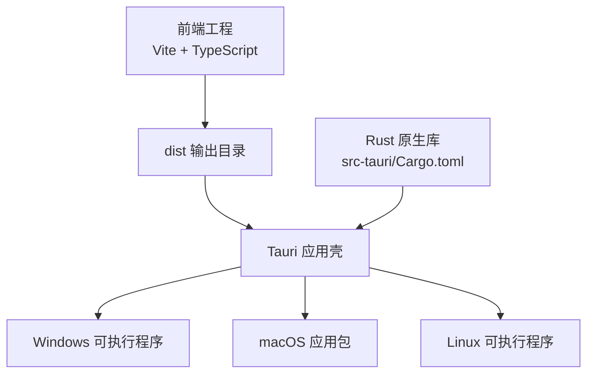
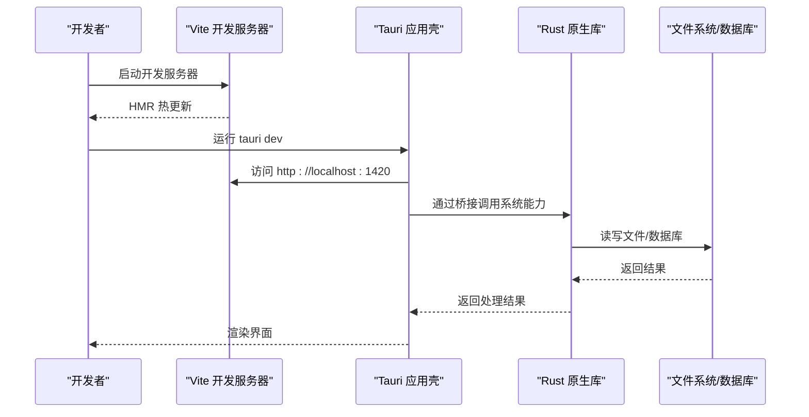
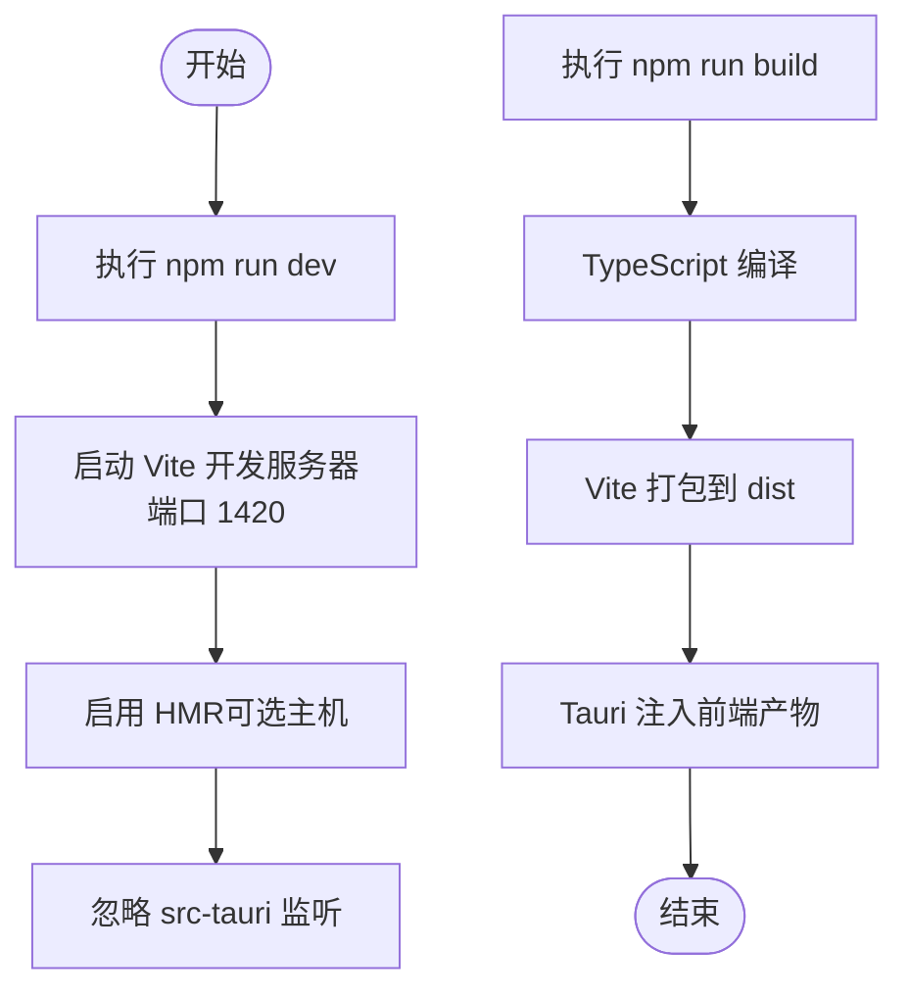
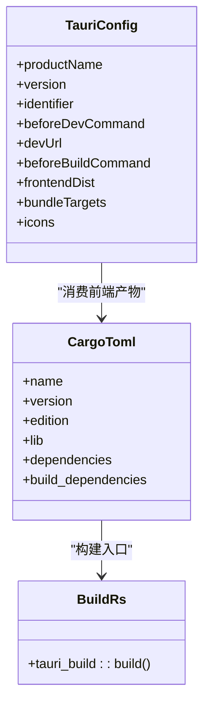
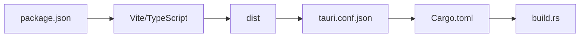

# 部署指南

<cite>
**本文引用的文件**
- [package.json](file://package.json)
- [vite.config.ts](file://vite.config.ts)
- [src-tauri/Cargo.toml](file://src-tauri/Cargo.toml)
- [src-tauri/tauri.conf.json](file://src-tauri/tauri.conf.json)
- [src-tauri/build.rs](file://src-tauri/build.rs)
- [src/main.ts](file://src/main.ts)
- [scripts/cli-workbench.md](file://scripts/cli-workbench.md)
</cite>

## 目录
1. [简介](#简介)
2. [项目结构](#项目结构)
3. [核心组件](#核心组件)
4. [架构总览](#架构总览)
5. [详细组件分析](#详细组件分析)
6. [依赖分析](#依赖分析)
7. [性能考虑](#性能考虑)
8. [故障排除指南](#故障排除指南)
9. [结论](#结论)
10. [附录](#附录)

## 简介
本指南面向AI专家工作台（社区版）项目，提供跨平台部署与运维的完整方案。项目采用前端+原生应用打包的架构：前端基于Vite与TypeScript，后端基于Rust（Tauri v2），通过Tauri统一打包为Windows、macOS与Linux的原生应用。本文覆盖不同平台的部署要求、构建流程、CI/CD建议、容器化与Kubernetes部署思路、云部署最佳实践、安全加固、性能优化与容量规划、以及故障排除与回滚策略。

## 项目结构
项目采用“前端工程 + Tauri 原生层”的双层结构：
- 前端工程位于根目录，使用Vite进行开发与构建，产物输出到dist目录。
- 原生层位于src-tauri，使用Rust语言与Tauri v2集成，负责系统能力、文件系统、网络请求、数据库等底层功能。
- 构建配置通过Tauri配置文件与Cargo配置文件协调，确保前后端联动。

图表来源
- [vite.config.ts:1-31](file://vite.config.ts#L1-L31)
- [src-tauri/tauri.conf.json:1-38](file://src-tauri/tauri.conf.json#L1-L38)
- [src-tauri/Cargo.toml:1-46](file://src-tauri/Cargo.toml#L1-L46)

章节来源
- [package.json:1-28](file://package.json#L1-L28)
- [vite.config.ts:1-31](file://vite.config.ts#L1-L31)
- [src-tauri/tauri.conf.json:1-38](file://src-tauri/tauri.conf.json#L1-L38)
- [src-tauri/Cargo.toml:1-46](file://src-tauri/Cargo.toml#L1-L46)

## 核心组件
- 前端开发与构建
  - 使用Vite进行开发服务器与生产构建，固定端口用于Tauri调试。
  - 构建脚本在package.json中定义，先执行TypeScript编译，再执行Vite打包。
- 原生应用壳与打包
  - Tauri v2配置文件定义了开发URL、构建前置命令、前端产物目录、窗口属性与打包目标。
  - Rust库通过Cargo管理依赖，支持SQLite、HTTP请求、并发与文件系统等能力。
- CLI工作台与测试
  - 提供CLI场景测试脚本，便于本地验证端到端流程。

章节来源
- [package.json:6-14](file://package.json#L6-L14)
- [vite.config.ts:7-30](file://vite.config.ts#L7-L30)
- [src-tauri/tauri.conf.json:6-11](file://src-tauri/tauri.conf.json#L6-L11)
- [src-tauri/Cargo.toml:20-46](file://src-tauri/Cargo.toml#L20-L46)
- [scripts/cli-workbench.md:1-15](file://scripts/cli-workbench.md#L1-L15)

## 架构总览
前端与原生层通过Tauri桥接通信，前端负责UI与交互，原生层负责系统能力与业务引擎。开发模式下，Vite提供热更新服务，Tauri指向固定开发URL；生产模式下，前端产物被注入到原生应用壳中，形成独立可分发的应用包。

图表来源
- [vite.config.ts:14-29](file://vite.config.ts#L14-L29)
- [src-tauri/tauri.conf.json:7-10](file://src-tauri/tauri.conf.json#L7-L10)
- [src/main.ts:1-50](file://src/main.ts#L1-L50)

## 详细组件分析

### 前端构建与开发流程
- 开发服务器
  - 固定端口与严格端口策略，确保Tauri能稳定连接。
  - HMR在指定主机上启用，支持远程设备联调。
  - 忽略对src-tauri的监听，避免不必要的重载。
- 生产构建
  - 先执行TypeScript编译，再执行Vite打包，产物输出至dist目录。
  - Tauri配置将dist作为前端产物目录，构建时由Tauri注入应用壳。

图表来源
- [vite.config.ts:14-29](file://vite.config.ts#L14-L29)
- [package.json:7-8](file://package.json#L7-L8)
- [src-tauri/tauri.conf.json:9-10](file://src-tauri/tauri.conf.json#L9-L10)

章节来源
- [vite.config.ts:7-30](file://vite.config.ts#L7-L30)
- [package.json:6-14](file://package.json#L6-L14)
- [src-tauri/tauri.conf.json:6-11](file://src-tauri/tauri.conf.json#L6-L11)

### 原生应用打包与平台目标
- 打包目标
  - Tauri配置启用全平台打包，图标资源已在配置中声明。
- Rust依赖与能力
  - 包含文件系统、对话框、网络请求、SQLite、并发与时间处理等能力。
  - 通过静态库、动态库与rlib形式导出，适配不同平台链接需求。
- 构建入口
  - Rust主入口调用原生库的运行函数，构建脚本委托给Tauri构建器。

图表来源
- [src-tauri/tauri.conf.json:1-38](file://src-tauri/tauri.conf.json#L1-L38)
- [src-tauri/Cargo.toml:1-46](file://src-tauri/Cargo.toml#L1-L46)
- [src-tauri/build.rs:1-4](file://src-tauri/build.rs#L1-L4)

章节来源
- [src-tauri/tauri.conf.json:26-36](file://src-tauri/tauri.conf.json#L26-L36)
- [src-tauri/Cargo.toml:10-15](file://src-tauri/Cargo.toml#L10-L15)
- [src-tauri/build.rs:1-4](file://src-tauri/build.rs#L1-L4)

### CLI工作台与端到端测试
- CLI场景
  - 通过Node脚本触发端到端流程，便于本地快速验证。
- 测试基线
  - 提供测试基线恢复脚本，便于回归测试与一致性校验。

章节来源
- [scripts/cli-workbench.md:1-15](file://scripts/cli-workbench.md#L1-L15)
- [package.json:12-13](file://package.json#L12-L13)

## 依赖分析
- 前端依赖
  - @tauri-apps/api：与原生层桥接。
  - highlight.js：代码高亮。
  - vite与typescript：开发与构建工具链。
- 原生依赖
  - tauri、reqwest、sqlx、tokio、dirs、scraper等：系统能力与业务支撑。
- 构建耦合
  - Tauri配置与Vite构建产物目录强关联，需保持一致。

图表来源
- [package.json:15-26](file://package.json#L15-L26)
- [src-tauri/Cargo.toml:20-46](file://src-tauri/Cargo.toml#L20-L46)
- [src-tauri/tauri.conf.json:6-11](file://src-tauri/tauri.conf.json#L6-L11)

章节来源
- [package.json:15-26](file://package.json#L15-L26)
- [src-tauri/Cargo.toml:20-46](file://src-tauri/Cargo.toml#L20-L46)
- [src-tauri/tauri.conf.json:6-11](file://src-tauri/tauri.conf.json#L6-L11)

## 性能考虑
- 前端性能
  - 合理拆分代码与懒加载，减少首屏体积。
  - 使用Vite的内置压缩与资源内联策略，平衡加载速度与缓存命中。
- 原生层性能
  - 并发与异步I/O：利用Tokio多线程运行时与异步特性提升吞吐。
  - 数据库访问：SQLite查询加索引与事务批处理，降低IO放大。
- 资源与内存
  - 控制大文件处理与内存驻留，避免长时间占用。
  - 合理使用缓存与增量更新，减少重复计算。

## 故障排除指南
- 端口冲突
  - Vite固定端口与严格端口策略，若端口被占用，需释放或调整。
- HMR不可用
  - 检查主机参数与网络连通性，确认HMR协议与端口配置。
- 构建失败
  - 确认TypeScript编译通过后再执行Vite打包。
  - 检查Tauri配置中的前端产物目录与构建命令。
- 原生层错误
  - 查看Rust日志与错误返回，定位文件系统、网络或数据库问题。
- CLI测试异常
  - 检查工作目录与测试场景脚本，必要时使用基线恢复脚本。

章节来源
- [vite.config.ts:12-29](file://vite.config.ts#L12-L29)
- [package.json:7-8](file://package.json#L7-L8)
- [src-tauri/tauri.conf.json:7-10](file://src-tauri/tauri.conf.json#L7-L10)
- [scripts/cli-workbench.md:1-15](file://scripts/cli-workbench.md#L1-L15)

## 结论
本指南提供了AI专家工作台在Windows、macOS与Linux上的部署与运维蓝图。通过明确的前端构建流程、原生应用打包配置与测试机制，结合云与容器化部署思路，可实现稳定高效的交付与运维。建议在生产环境中配套完善的CI/CD、监控与安全加固策略，持续优化性能与容量规划。

## 附录

### 平台部署要求与步骤
- Windows
  - 安装Node.js、Rust工具链与Tauri依赖。
  - 使用Tauri CLI进行开发与打包，生成.exe与安装包。
- macOS
  - 安装Xcode命令行工具与Rust工具链。
  - 使用Tauri CLI生成.app与.dmg包。
- Linux
  - 安装构建依赖与Rust工具链。
  - 使用Tauri CLI生成对应平台的可执行文件与打包格式。

章节来源
- [src-tauri/tauri.conf.json:26-36](file://src-tauri/tauri.conf.json#L26-L36)

### CI/CD流水线建议
- 触发条件
  - 推送分支、合并PR或打标签。
- 步骤建议
  - 安装依赖与工具链（Node、Rust、Tauri）。
  - 运行测试（含CLI工作台场景）。
  - 执行TypeScript编译与Vite构建。
  - 调用Tauri打包，产出多平台应用包。
  - 上传制品与生成发布说明。
- 缓存策略
  - 缓存Node模块与Rust依赖，加速流水线执行。

章节来源
- [package.json:6-14](file://package.json#L6-L14)
- [scripts/cli-workbench.md:1-15](file://scripts/cli-workbench.md#L1-L15)
- [src-tauri/tauri.conf.json:6-11](file://src-tauri/tauri.conf.json#L6-L11)

### 容器化与Kubernetes部署思路
- Docker镜像
  - 基于最小化Linux发行版，安装运行时依赖。
  - 将前端dist与原生应用壳复制进镜像，暴露必要端口（如用于调试的1420）。
- Kubernetes
  - 使用Deployment管理副本数，Service暴露应用。
  - 挂载持久卷用于用户数据与日志。
  - 配置健康检查与就绪探针，保障滚动更新稳定性。

[本节为概念性说明，不直接映射具体源码文件]

### 云部署最佳实践
- 负载均衡
  - 使用云厂商LB或Ingress，分发流量至多个实例。
- 自动扩缩容
  - 基于CPU、内存或自定义指标配置HPA。
- 监控与日志
  - 集成APM与日志收集，保留关键事件与错误堆栈。
- 存储与备份
  - 使用对象存储与数据库备份策略，定期验证恢复流程。

[本节为概念性说明，不直接映射具体源码文件]

### 安全加固
- 代码签名
  - 对Windows与macOS应用进行代码签名与公证，确保可信分发。
- 权限管理
  - 最小权限原则，限制文件系统与网络访问范围。
- 网络安全
  - 仅开放必要端口，启用TLS与认证，限制外部访问。
- 供应链安全
  - 固定依赖版本，启用依赖扫描与漏洞检测。

[本节为概念性说明，不直接映射具体源码文件]

### 容量规划与性能优化
- 前端
  - 分析首屏资源大小与加载时间，优化资源分片与缓存策略。
- 原生层
  - 评估并发与数据库负载，合理配置线程池与连接池。
- 运维
  - 建立容量基线与告警阈值，定期压测与容量评估。

[本节为概念性说明，不直接映射具体源码文件]