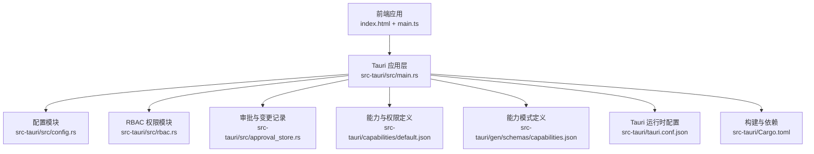
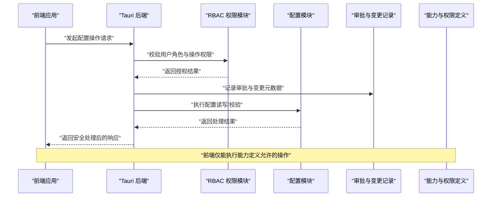
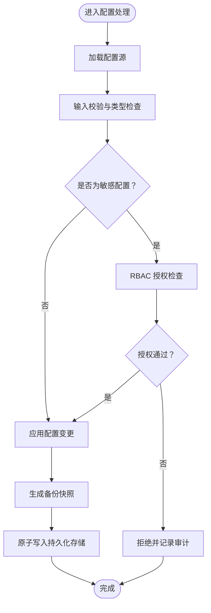
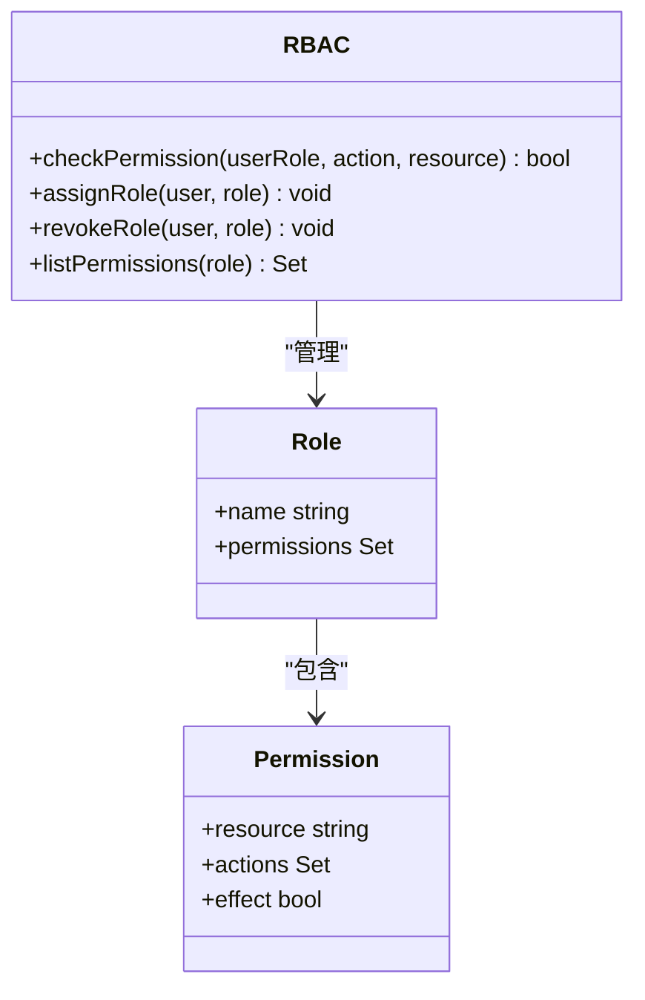
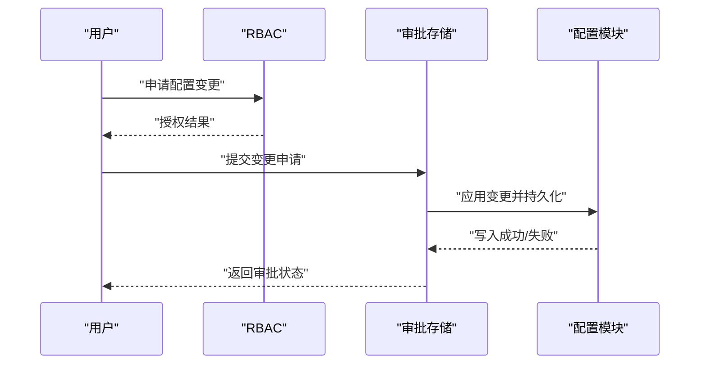
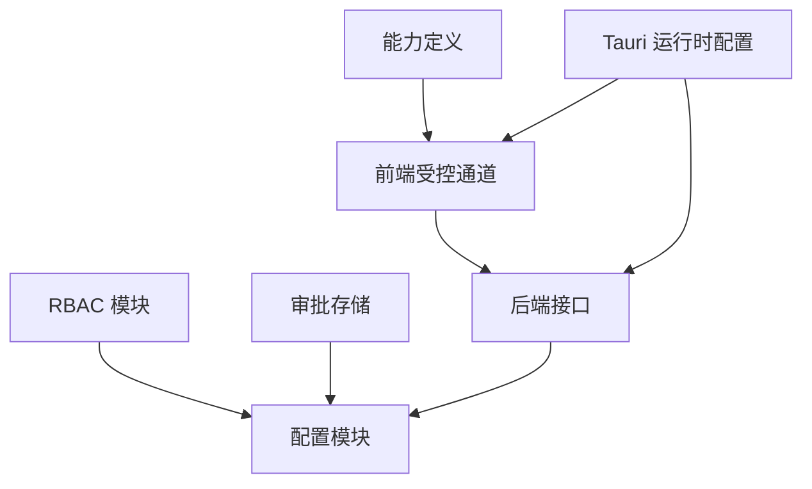

# 安全配置

<cite>
**本文引用的文件**
- [tauri.conf.json](file://src-tauri/tauri.conf.json)
- [default.json](file://src-tauri/capabilities/default.json)
- [capabilities.json](file://src-tauri/gen/schemas/capabilities.json)
- [config.rs](file://src-tauri/src/config.rs)
- [rbac.rs](file://src-tauri/src/rbac.rs)
- [approval_store.rs](file://src-tauri/src/approval_store.rs)
- [Cargo.toml](file://src-tauri/Cargo.toml)
- [main.rs](file://src-tauri/src/main.rs)
</cite>

## 目录
1. [引言](#引言)
2. [项目结构](#项目结构)
3. [核心组件](#核心组件)
4. [架构总览](#架构总览)
5. [详细组件分析](#详细组件分析)
6. [依赖关系分析](#依赖关系分析)
7. [性能考量](#性能考量)
8. [故障排查指南](#故障排查指南)
9. [结论](#结论)
10. [附录](#附录)

## 引言
本文件面向“安全配置系统”的技术文档目标，聚焦于配置级别的安全控制机制、权限模型与访问控制策略、敏感配置的加密存储与传输保护、Tauri 能力配置管理（文件系统访问、网络权限等）、RBAC 在配置管理中的应用、配置注入攻击的防护与输入验证、配置备份与恢复的安全考虑、安全审计与合规检查方法，以及配置泄露检测与应急响应流程。本文以仓库中现有的安全相关实现为依据进行系统化梳理，并通过可视化图表帮助读者理解整体架构与关键流程。

## 项目结构
本项目采用前端 + Tauri 后端的混合架构，安全配置相关的实现主要集中在 Tauri 后端模块中，同时通过 Tauri 配置文件与能力定义文件对前端运行时的权限边界进行约束。关键位置如下：
- 前端入口与主程序：index.html、src/main.ts 等（未在本文深入展开）
- Tauri 后端：src-tauri/src 下的各引擎与服务模块
- Tauri 配置与能力：src-tauri/tauri.conf.json、src-tauri/capabilities/default.json、src-tauri/gen/schemas/capabilities.json
- 构建与依赖：src-tauri/Cargo.toml、src-tauri/build.rs
- 主入口：src-tauri/src/main.rs

**图表来源**
- [main.rs](file://src-tauri/src/main.rs)
- [config.rs](file://src-tauri/src/config.rs)
- [rbac.rs](file://src-tauri/src/rbac.rs)
- [approval_store.rs](file://src-tauri/src/approval_store.rs)
- [default.json](file://src-tauri/capabilities/default.json)
- [capabilities.json](file://src-tauri/gen/schemas/capabilities.json)
- [tauri.conf.json](file://src-tauri/tauri.conf.json)
- [Cargo.toml](file://src-tauri/Cargo.toml)

**章节来源**
- [main.rs](file://src-tauri/src/main.rs)
- [tauri.conf.json](file://src-tauri/tauri.conf.json)
- [default.json](file://src-tauri/capabilities/default.json)
- [capabilities.json](file://src-tauri/gen/schemas/capabilities.json)
- [Cargo.toml](file://src-tauri/Cargo.toml)

## 核心组件
- 配置模块（config.rs）：负责配置加载、解析、校验与持久化，是安全配置体系的数据基础。
- RBAC 模块（rbac.rs）：提供基于角色的访问控制，用于限制对敏感配置项的操作权限。
- 审批与变更记录（approval_store.rs）：记录配置变更与审批信息，支撑审计与回溯。
- 能力与权限定义（capabilities/default.json 及生成的 capabilities.json）：定义前端运行时可执行的操作边界（如文件系统、网络等），防止越权行为。
- Tauri 运行时配置（tauri.conf.json）：集中声明窗口、菜单、协议、安全策略等运行时参数。
- 构建与依赖（Cargo.toml）：声明安全相关依赖与编译特性，确保构建链路安全。

**章节来源**
- [config.rs](file://src-tauri/src/config.rs)
- [rbac.rs](file://src-tauri/src/rbac.rs)
- [approval_store.rs](file://src-tauri/src/approval_store.rs)
- [default.json](file://src-tauri/capabilities/default.json)
- [capabilities.json](file://src-tauri/gen/schemas/capabilities.json)
- [tauri.conf.json](file://src-tauri/tauri.conf.json)
- [Cargo.toml](file://src-tauri/Cargo.toml)

## 架构总览
下图展示了安全配置系统在运行时的整体交互：前端通过受控通道请求配置操作；后端根据 RBAC 决策与审批记录进行授权与审计；能力定义文件限定前端可执行的操作范围；配置模块负责数据安全与一致性。

**图表来源**
- [main.rs](file://src-tauri/src/main.rs)
- [rbac.rs](file://src-tauri/src/rbac.rs)
- [config.rs](file://src-tauri/src/config.rs)
- [approval_store.rs](file://src-tauri/src/approval_store.rs)
- [default.json](file://src-tauri/capabilities/default.json)
- [capabilities.json](file://src-tauri/gen/schemas/capabilities.json)

## 详细组件分析

### 配置模块（config.rs）
职责与安全要点：
- 加载与解析配置：从安全路径或受控来源读取配置，避免路径遍历与非法文件读取。
- 输入校验：对配置键值进行白名单校验、类型校验与长度限制，阻断异常输入。
- 敏感项隔离：区分公开配置与敏感配置，敏感项仅在受控范围内可见与修改。
- 持久化与一致性：写入前进行原子性校验与备份，失败回滚，保证配置一致性。

**图表来源**
- [config.rs](file://src-tauri/src/config.rs)
- [rbac.rs](file://src-tauri/src/rbac.rs)

**章节来源**
- [config.rs](file://src-tauri/src/config.rs)

### RBAC 模块（rbac.rs）
职责与安全要点：
- 角色定义与权限映射：将用户角色与最小权限集合绑定，降低配置操作风险面。
- 动态授权决策：针对不同配置类别（如日志级别、网络代理、文件路径等）实施细粒度授权。
- 审计留痕：所有授权决策与拒绝均记录到审批存储，支持事后审计与追踪。

**图表来源**
- [rbac.rs](file://src-tauri/src/rbac.rs)

**章节来源**
- [rbac.rs](file://src-tauri/src/rbac.rs)

### 审批与变更记录（approval_store.rs）
职责与安全要点：
- 记录配置变更的申请人、时间戳、变更内容与授权人信息。
- 支持快速回滚与版本对比，便于在发现异常时及时恢复。
- 与 RBAC 协作，确保只有具备相应权限的用户才能提交或批准变更。

**图表来源**
- [approval_store.rs](file://src-tauri/src/approval_store.rs)
- [rbac.rs](file://src-tauri/src/rbac.rs)
- [config.rs](file://src-tauri/src/config.rs)

**章节来源**
- [approval_store.rs](file://src-tauri/src/approval_store.rs)

### Tauri 能力配置管理（capabilities/default.json 与 capabilities.json）
职责与安全要点：
- 能力定义：明确前端可执行的操作边界，例如文件系统访问路径白名单、网络请求域名白名单、系统托盘/菜单权限等。
- 模式校验：生成的能力模式文件用于构建期与运行期的合法性校验，防止越权配置生效。
- 与前端通信：前端通过受控通道调用后端接口，前端自身无法绕过能力定义直接执行受限操作。

**图表来源**
- [default.json](file://src-tauri/capabilities/default.json)
- [capabilities.json](file://src-tauri/gen/schemas/capabilities.json)

**章节来源**
- [default.json](file://src-tauri/capabilities/default.json)
- [capabilities.json](file://src-tauri/gen/schemas/capabilities.json)

### Tauri 运行时配置（tauri.conf.json）
职责与安全要点：
- 窗口与菜单：限制窗口功能与菜单项，减少潜在的 UI 交互攻击面。
- 自定义协议与权限：严格控制自定义协议的注册与调用范围，避免任意代码注入。
- 安全策略：启用内容安全策略（CSP）相关设置，限制脚本执行与外部资源加载。

**章节来源**
- [tauri.conf.json](file://src-tauri/tauri.conf.json)

### 构建与依赖（Cargo.toml）
职责与安全要点：
- 依赖版本锁定与漏洞扫描：通过 Cargo 生态的依赖管理与安全公告机制，降低供应链风险。
- 编译特性与安全开关：启用必要的安全编译选项，减少运行时攻击面。

**章节来源**
- [Cargo.toml](file://src-tauri/Cargo.toml)

## 依赖关系分析
- 组件耦合：RBAC 与审批存储共同决定授权与审计；配置模块依赖 RBAC 与审批存储以实现受控变更；能力定义文件与运行时配置共同约束前端行为。
- 外部依赖：Tauri 框架提供的能力系统与运行时安全机制，是前端权限控制的基础。
- 潜在风险：若能力定义缺失或运行时配置不当，可能导致前端越权；若 RBAC 或审批存储存在缺陷，可能导致越权变更。

**图表来源**
- [rbac.rs](file://src-tauri/src/rbac.rs)
- [config.rs](file://src-tauri/src/config.rs)
- [approval_store.rs](file://src-tauri/src/approval_store.rs)
- [default.json](file://src-tauri/capabilities/default.json)
- [tauri.conf.json](file://src-tauri/tauri.conf.json)

**章节来源**
- [rbac.rs](file://src-tauri/src/rbac.rs)
- [config.rs](file://src-tauri/src/config.rs)
- [approval_store.rs](file://src-tauri/src/approval_store.rs)
- [default.json](file://src-tauri/capabilities/default.json)
- [tauri.conf.json](file://src-tauri/tauri.conf.json)

## 性能考量
- 授权决策缓存：对频繁使用的角色与权限映射进行缓存，降低授权检查开销。
- 配置变更批处理：批量应用配置变更，减少磁盘写入次数与锁竞争。
- 审计日志异步化：将审计写入异步化，避免阻塞主业务流程。
- 能力定义热更新：在不重启应用的前提下，通过能力模式校验实现能力定义的动态更新。

## 故障排查指南
- 授权失败：检查用户角色与权限映射，确认 RBAC 模块的授权逻辑与审批存储的记录是否一致。
- 配置变更未生效：核对能力定义与运行时配置，确认前端受控通道与后端接口的交互是否符合预期。
- 审计缺失：检查审批存储的写入路径与权限，确保变更流程完整记录。
- 注入攻击迹象：关注异常输入导致的配置解析错误、越权访问尝试与异常日志。

**章节来源**
- [rbac.rs](file://src-tauri/src/rbac.rs)
- [config.rs](file://src-tauri/src/config.rs)
- [approval_store.rs](file://src-tauri/src/approval_store.rs)
- [default.json](file://src-tauri/capabilities/default.json)
- [tauri.conf.json](file://src-tauri/tauri.conf.json)

## 结论
本项目通过“能力定义 + RBAC + 审批存储 + 配置模块”的组合，构建了覆盖前端权限边界、后端授权控制与变更审计的闭环安全配置体系。建议在现有基础上进一步完善敏感配置的加密存储与传输保护、输入验证与注入防护、备份恢复与合规检查流程，以满足更严格的安全部署要求。

## 附录
- 配置注入防护清单
  - 对所有输入进行白名单与类型校验
  - 使用受控解析器处理配置文件
  - 限制配置文件的读写权限与访问路径
- 配置备份与恢复
  - 定期生成原子备份快照
  - 支持增量备份与版本对比
  - 恢复流程需经过审批与授权
- 安全审计与合规
  - 审计日志保留周期与归档策略
  - 定期合规性检查与漏洞扫描
- 泄露检测与应急响应
  - 异常登录与变更告警
  - 快速回滚与隔离措施
  - 事件调查与修复验证