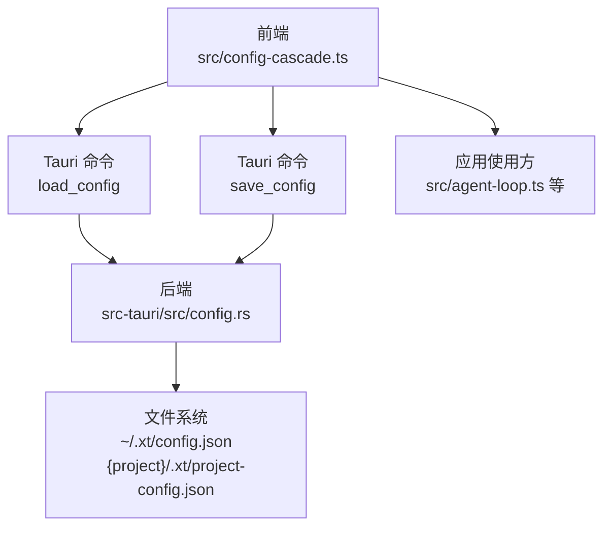
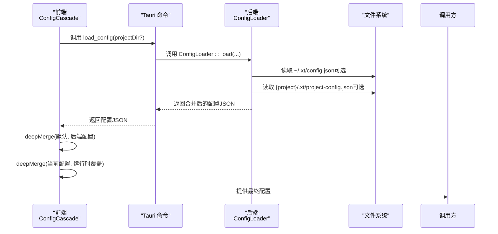
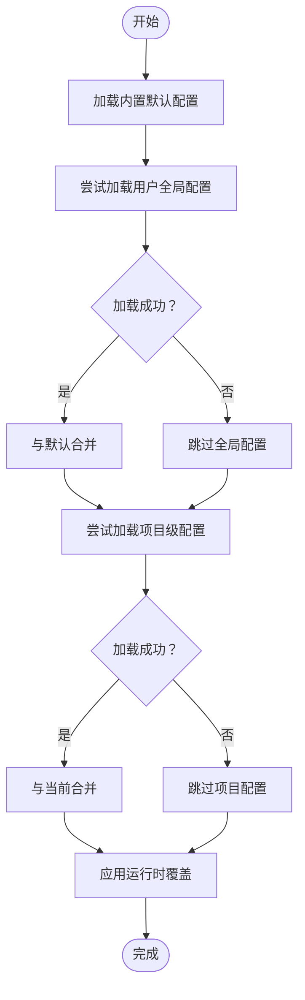
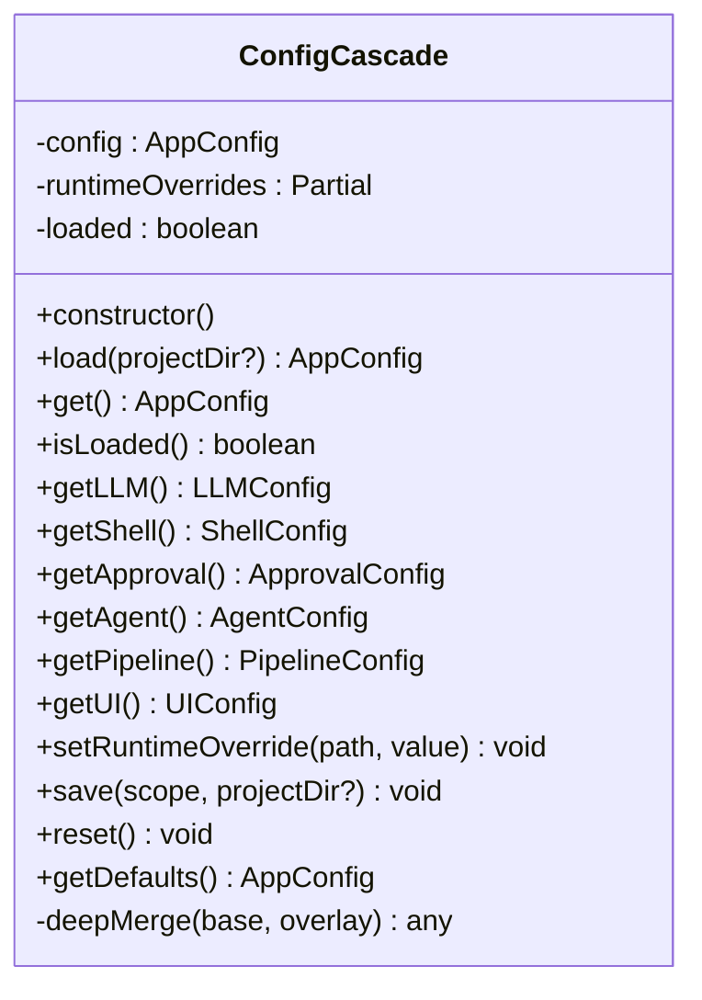
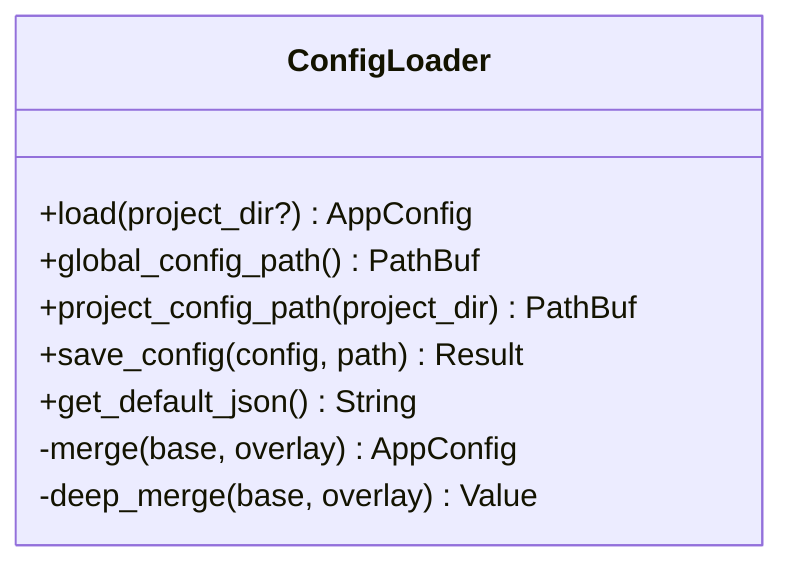
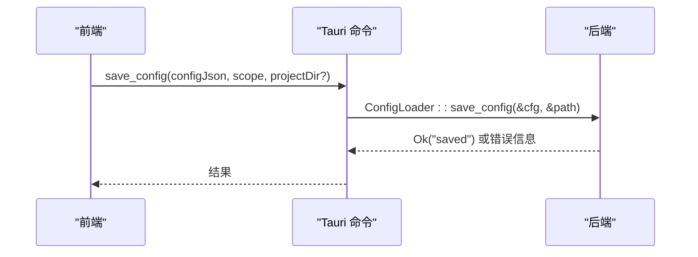
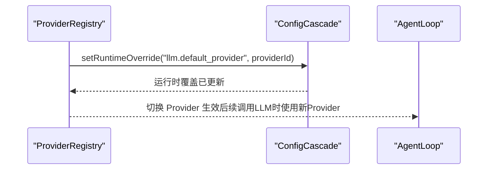
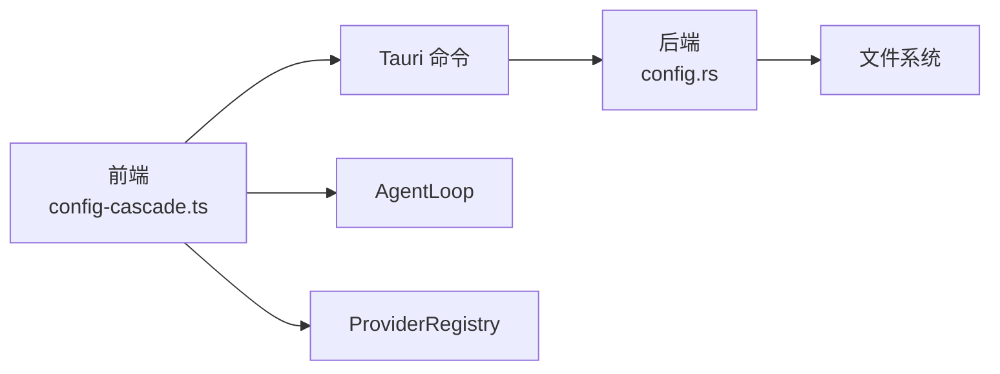

# 应用配置

<cite>
**本文引用的文件**
- [src/config-cascade.ts](file://src/config-cascade.ts)
- [src-tauri/src/config.rs](file://src-tauri/src/config.rs)
- [src-tauri/src/lib.rs](file://src-tauri/src/lib.rs)
- [src/main.ts](file://src/main.ts)
- [src/agent-loop.ts](file://src/agent-loop.ts)
- [src/provider-registry.ts](file://src/provider-registry.ts)
- [src-tauri/tauri.conf.json](file://src-tauri/tauri.conf.json)
</cite>

## 目录
1. [简介](#简介)
2. [项目结构](#项目结构)
3. [核心组件](#核心组件)
4. [架构总览](#架构总览)
5. [详细组件分析](#详细组件分析)
6. [依赖关系分析](#依赖关系分析)
7. [性能考量](#性能考量)
8. [故障排除指南](#故障排除指南)
9. [结论](#结论)
10. [附录](#附录)

## 简介
本文件面向“应用配置系统”的技术文档，围绕应用启动时的配置加载流程、配置级联与合并策略、数据类型与默认值、动态更新与热重载、错误处理与回退策略、调试与排障方法进行系统化说明。该系统采用前端 TypeScript 的配置管理器与后端 Rust 的配置加载器协同工作，形成“内置默认 < 用户全局 < 项目级 < 运行时覆盖”的四层级联模型。

## 项目结构
配置系统主要分布在前端与后端两部分：
- 前端：定义配置接口、默认值与合并逻辑，负责运行时覆盖与持久化调用。
- 后端：负责全局与项目级配置文件的发现、解析与层叠合并，提供默认配置与保存能力。
- Tauri 命令桥接：前后端通过命令互通，实现配置的加载与保存。

图表来源
- [src/config-cascade.ts:117-137](file://src/config-cascade.ts#L117-L137)
- [src-tauri/src/lib.rs:6905-6928](file://src-tauri/src/lib.rs#L6905-L6928)
- [src-tauri/src/config.rs:170-192](file://src-tauri/src/config.rs#L170-L192)

章节来源
- [src/config-cascade.ts:108-137](file://src/config-cascade.ts#L108-L137)
- [src-tauri/src/config.rs:170-192](file://src-tauri/src/config.rs#L170-L192)
- [src-tauri/src/lib.rs:6905-6928](file://src-tauri/src/lib.rs#L6905-L6928)

## 核心组件
- 配置接口与默认值：前端定义完整的 AppConfig 及各子段接口与默认值，作为 UI 展示与回退的基础。
- 配置管理器（ConfigCascade）：负责加载、合并、运行时覆盖、持久化与重置。
- 后端配置加载器（ConfigLoader）：负责全局与项目级配置的发现、解析与层叠合并。
- Tauri 命令：提供 load_config/save_config/get_default_config 等命令，供前端调用。
- 应用使用方：在运行期通过 getConfig() 获取配置，驱动 LLM、Agent、Pipeline 等模块行为。

章节来源
- [src/config-cascade.ts:7-103](file://src/config-cascade.ts#L7-L103)
- [src-tauri/src/config.rs:4-168](file://src-tauri/src/config.rs#L4-L168)
- [src-tauri/src/lib.rs:6905-6933](file://src-tauri/src/lib.rs#L6905-L6933)

## 架构总览
配置系统遵循“前端管理 + 后端合并 + 命令桥接”的分层设计。前端负责运行时覆盖与 UI 交互，后端负责文件系统级的层叠合并与持久化。

图表来源
- [src/config-cascade.ts:120-137](file://src/config-cascade.ts#L120-L137)
- [src-tauri/src/lib.rs:6905-6909](file://src-tauri/src/lib.rs#L6905-L6909)
- [src-tauri/src/config.rs:174-192](file://src-tauri/src/config.rs#L174-L192)

## 详细组件分析

### 配置接口与默认值
- 接口定义：AppConfig 包含 llm、shell、approval、agent、pipeline、ui 等子段，每个子段定义了字段名、类型与语义。
- 默认值：前端与后端均提供默认值，保证在无用户配置时系统可正常运行。
- 约束与范围：字段类型与默认值体现了合理的约束（如数值范围、布尔开关、数组模式），避免非法配置导致异常。

章节来源
- [src/config-cascade.ts:7-103](file://src/config-cascade.ts#L7-L103)
- [src-tauri/src/config.rs:4-168](file://src-tauri/src/config.rs#L4-L168)

### 配置级联与合并策略
- 级联顺序：内置默认 → 用户全局 → 项目级 → 运行时覆盖。
- 合并策略：
  - 后端：对 JSON 对象进行递归合并，overlay 覆盖 base 中同名键，数组按覆盖处理。
  - 前端：对结构化克隆后的对象进行深合并，保持类型安全与可序列化。
- 回退策略：当后端加载失败时，前端回退到内置默认配置并记录警告。

图表来源
- [src-tauri/src/config.rs:174-192](file://src-tauri/src/config.rs#L174-L192)
- [src/config-cascade.ts:120-137](file://src/config-cascade.ts#L120-L137)

章节来源
- [src-tauri/src/config.rs:221-244](file://src-tauri/src/config.rs#L221-L244)
- [src/config-cascade.ts:209-221](file://src/config-cascade.ts#L209-L221)

### 配置管理器（前端）
- 职责：加载、合并、查询、运行时覆盖、持久化、重置。
- 运行时覆盖：通过点号路径设置（如 llm.default_provider），同时更新当前配置与运行时覆盖表。
- 持久化：支持全局与项目级两种作用域，调用 save_config 命令写入对应文件。
- 单例：全局唯一实例，避免重复初始化。

图表来源
- [src/config-cascade.ts:108-229](file://src/config-cascade.ts#L108-L229)

章节来源
- [src/config-cascade.ts:108-229](file://src/config-cascade.ts#L108-L229)

### 后端配置加载器（Rust）
- 职责：发现并读取用户全局与项目级配置，进行层叠合并，提供默认配置 JSON。
- 文件位置：
  - 用户全局：~/.xt/config.json
  - 项目级：{project}/.xt/project-config.json
- 合并算法：递归深度合并 JSON，overlay 覆盖 base。
- 保存：将配置写入指定路径，自动创建目录。

图表来源
- [src-tauri/src/config.rs:170-259](file://src-tauri/src/config.rs#L170-L259)

章节来源
- [src-tauri/src/config.rs:170-259](file://src-tauri/src/config.rs#L170-L259)

### Tauri 命令桥接
- load_config：调用后端 ConfigLoader::load，返回合并后的配置 JSON。
- save_config：接收前端传入的 JSON，解析为 AppConfig，按 scope 写入全局或项目配置文件。
- get_default_config：返回默认配置 JSON，用于 UI 展示可配置项。

图表来源
- [src-tauri/src/lib.rs:6911-6928](file://src-tauri/src/lib.rs#L6911-L6928)
- [src-tauri/src/config.rs:246-253](file://src-tauri/src/config.rs#L246-L253)

章节来源
- [src-tauri/src/lib.rs:6905-6933](file://src-tauri/src/lib.rs#L6905-L6933)

### 应用使用方（示例：AgentLoop 与 ProviderRegistry）
- AgentLoop：在构造阶段读取 AppConfig，将 agent/pipeline/ui 等配置映射到运行参数。
- ProviderRegistry：在切换 Provider 时，通过 setRuntimeOverride 同步更新 llm.default_provider，并立即生效。

图表来源
- [src/provider-registry.ts:56-62](file://src/provider-registry.ts#L56-L62)
- [src/agent-loop.ts:58-67](file://src/agent-loop.ts#L58-L67)

章节来源
- [src/agent-loop.ts:58-67](file://src/agent-loop.ts#L58-L67)
- [src/provider-registry.ts:56-62](file://src/provider-registry.ts#L56-L62)

## 依赖关系分析
- 前端依赖后端命令：通过 invoke('load_config')、invoke('save_config') 与后端交互。
- 后端依赖文件系统：读取用户全局与项目级配置文件，进行层叠合并。
- 应用模块依赖配置：AgentLoop、ProviderRegistry 等在运行期读取配置，影响行为。

图表来源
- [src/config-cascade.ts:120-137](file://src/config-cascade.ts#L120-L137)
- [src-tauri/src/lib.rs:6905-6928](file://src-tauri/src/lib.rs#L6905-L6928)
- [src-tauri/src/config.rs:174-192](file://src-tauri/src/config.rs#L174-L192)

章节来源
- [src/config-cascade.ts:120-137](file://src/config-cascade.ts#L120-L137)
- [src-tauri/src/lib.rs:6905-6928](file://src-tauri/src/lib.rs#L6905-L6928)
- [src-tauri/src/config.rs:174-192](file://src-tauri/src/config.rs#L174-L192)

## 性能考量
- 合并复杂度：后端与前端均采用对象深合并，时间复杂度与配置层级与键数量线性相关。建议控制配置层级深度与数组长度，避免过大 JSON 影响首帧加载。
- I/O 成本：全局与项目级配置文件读取为磁盘 I/O，建议减少频繁读写，必要时批量保存。
- 运行时覆盖：仅在内存中维护覆盖表，成本较低；但需注意覆盖路径的合法性，避免深层嵌套导致的序列化问题。

## 故障排除指南
- 启动时无法加载配置
  - 现象：前端控制台出现警告，使用默认配置。
  - 排查：确认后端命令 load_config 是否可用；检查用户全局与项目级配置文件是否存在且可读。
  - 参考
    - [src/config-cascade.ts:125-128](file://src/config-cascade.ts#L125-L128)
    - [src-tauri/src/lib.rs:6905-6909](file://src-tauri/src/lib.rs#L6905-L6909)
- 保存配置失败
  - 现象：save_config 返回错误。
  - 排查：确认 scope 参数为 global 或 project；项目级保存需提供 project_dir；检查目标路径权限与父目录存在性。
  - 参考
    - [src-tauri/src/lib.rs:6918-6927](file://src-tauri/src/lib.rs#L6918-L6927)
    - [src-tauri/src/config.rs:246-253](file://src-tauri/src/config.rs#L246-L253)
- 运行时覆盖未生效
  - 现象：切换 Provider 后未立即生效。
  - 排查：确认 setRuntimeOverride 调用路径正确；后续调用 LLM 时是否读取了最新配置。
  - 参考
    - [src/provider-registry.ts:60-61](file://src/provider-registry.ts#L60-L61)
    - [src/agent-loop.ts:229-241](file://src/agent-loop.ts#L229-L241)
- 配置文件格式错误
  - 现象：后端解析失败，回退默认。
  - 排查：使用 get_default_config 输出的 JSON 结构校验自定义配置；避免非法字段与类型不匹配。
  - 参考
    - [src-tauri/src/lib.rs:6931-6933](file://src-tauri/src/lib.rs#L6931-L6933)
    - [src-tauri/src/config.rs:255-258](file://src-tauri/src/config.rs#L255-L258)

章节来源
- [src/config-cascade.ts:125-128](file://src/config-cascade.ts#L125-L128)
- [src-tauri/src/lib.rs:6918-6927](file://src-tauri/src/lib.rs#L6918-L6927)
- [src-tauri/src/config.rs:255-258](file://src-tauri/src/config.rs#L255-L258)
- [src/provider-registry.ts:60-61](file://src/provider-registry.ts#L60-L61)
- [src/agent-loop.ts:229-241](file://src/agent-loop.ts#L229-L241)

## 结论
该配置系统通过前后端协作实现了清晰的层叠与合并机制，具备良好的扩展性与稳定性。前端负责运行时覆盖与 UI 交互，后端负责文件系统级的持久化与默认值提供。通过命令桥接与统一的接口定义，应用模块可以稳定地读取与使用配置，满足从开发到生产的多样化需求。

## 附录

### 配置项数据类型、默认值与约束
- AppConfig
  - llm: LLMConfig
  - shell: ShellConfig
  - approval: ApprovalConfig
  - agent: AgentConfig
  - pipeline: PipelineConfig
  - ui: UIConfig
- LLMConfig
  - default_provider: 字符串（默认：deepseek）
  - default_model: 可选字符串
  - retry: RetrySettings
  - temperature: 数值（默认：0.7）
  - max_tokens: 整数（默认：4096）
- RetrySettings
  - max_retries: 整数（默认：5）
  - initial_backoff_ms: 整数（默认：1000）
  - max_backoff_ms: 整数（默认：32000）
  - backoff_multiplier: 数值（默认：2.0）
- ShellConfig
  - default_timeout_ms: 整数（默认：60000）
  - max_timeout_ms: 整数（默认：300000）
  - max_output_bytes: 整数（默认：1048576）
  - max_output_lines: 整数（默认：5000）
- ApprovalConfig
  - cache_enabled: 布尔（默认：true）
  - auto_patterns: 字符串数组（默认：若干常见命令）
  - block_patterns: 字符串数组（默认：若干危险命令）
- AgentConfig
  - max_turns: 整数（默认：20）
  - token_budget: 整数（默认：100000）
  - compact_threshold: 数值（默认：0.8）
  - dead_loop_detection: 整数（默认：3）
- PipelineConfig
  - expert_timeout_ms: 整数（默认：120000）
  - max_pipeline_steps: 整数（默认：10）
  - enable_parallel: 布尔（默认：true）
- UIConfig
  - streaming_enabled: 布尔（默认：true）
  - show_tool_calls: 布尔（默认：true）
  - show_progress_bar: 布尔（默认：true）

章节来源
- [src/config-cascade.ts:7-103](file://src/config-cascade.ts#L7-L103)
- [src-tauri/src/config.rs:4-168](file://src-tauri/src/config.rs#L4-L168)

### 配置模板与示例
- 全局配置模板（用户全局）：~/.xt/config.json
- 项目级配置模板（项目根目录）：{project}/.xt/project-config.json
- 使用建议：
  - 仅修改必要的字段，避免冗余覆盖。
  - 通过 get_default_config 输出的 JSON 作为参考，确保字段与类型一致。
  - 保存前先校验 JSON 结构，避免因格式错误导致解析失败。

章节来源
- [src-tauri/src/config.rs:194-207](file://src-tauri/src/config.rs#L194-L207)
- [src-tauri/src/lib.rs:6931-6933](file://src-tauri/src/lib.rs#L6931-L6933)

### 动态更新与热重载
- 运行时覆盖：通过 setRuntimeOverride(path, value) 实现即时生效，适用于临时调试与快速切换。
- 热重载：当前实现未提供自动监听文件变更的热重载机制。若需热重载，可在前端增加文件监控并在变更时重新调用 load() 并刷新 UI。

章节来源
- [src/config-cascade.ts:166-183](file://src/config-cascade.ts#L166-L183)
- [src/provider-registry.ts:56-62](file://src/provider-registry.ts#L56-L62)

### 配置调试与排障
- 获取默认配置：调用 get_default_config，比对自定义配置差异。
- 查看当前配置：在应用中打印 getConfig().get()，核对最终生效值。
- 检查命令可用性：确认 load_config/save_config 命令已在 Tauri 命令注册表中。
- 文件路径确认：核对用户全局与项目级配置文件路径是否正确。

章节来源
- [src-tauri/src/lib.rs:6931-6933](file://src-tauri/src/lib.rs#L6931-L6933)
- [src-tauri/src/lib.rs:7036-7178](file://src-tauri/src/lib.rs#L7036-L7178)
- [src-tauri/tauri.conf.json:1-38](file://src-tauri/tauri.conf.json#L1-L38)