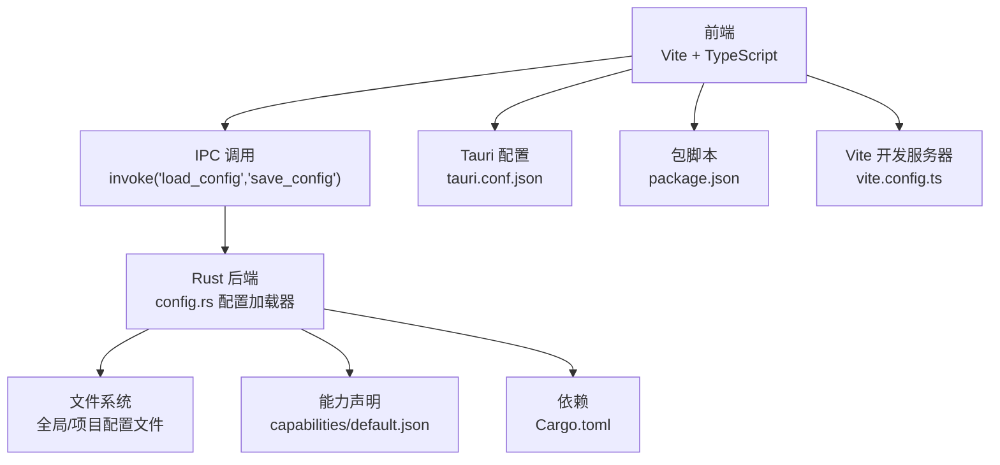
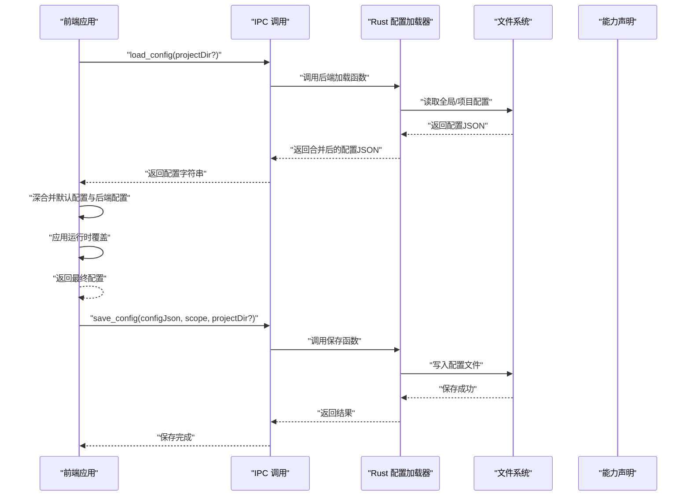
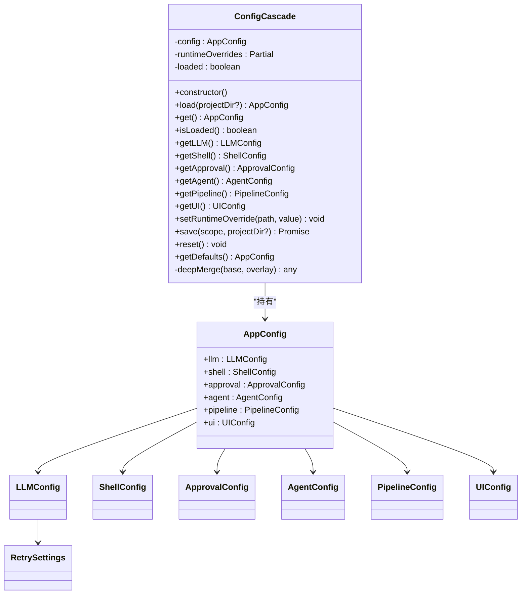
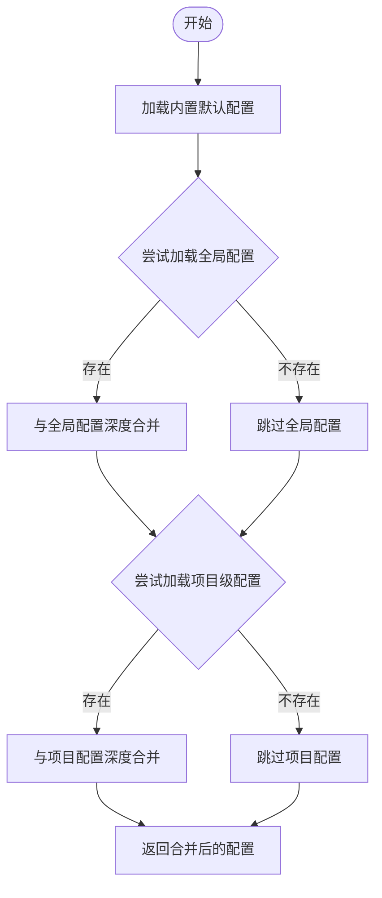
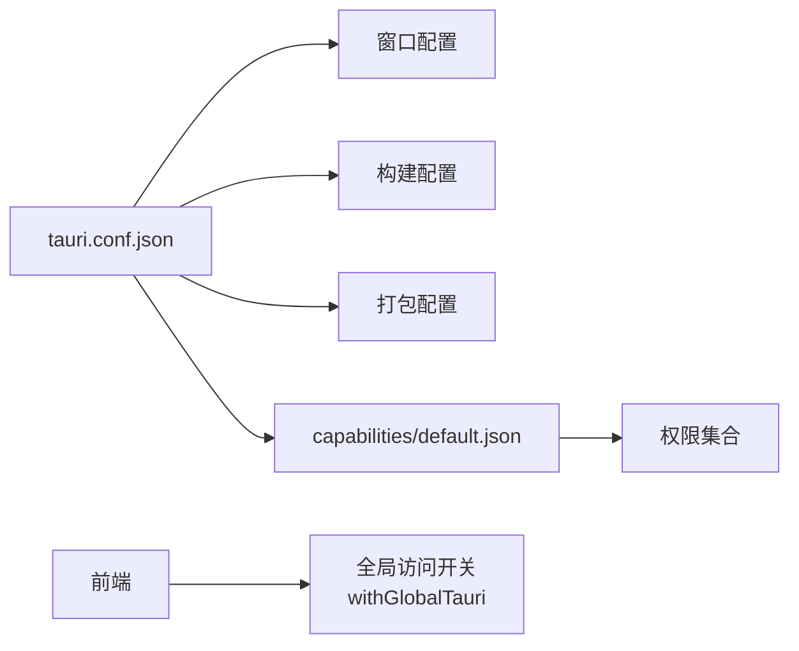
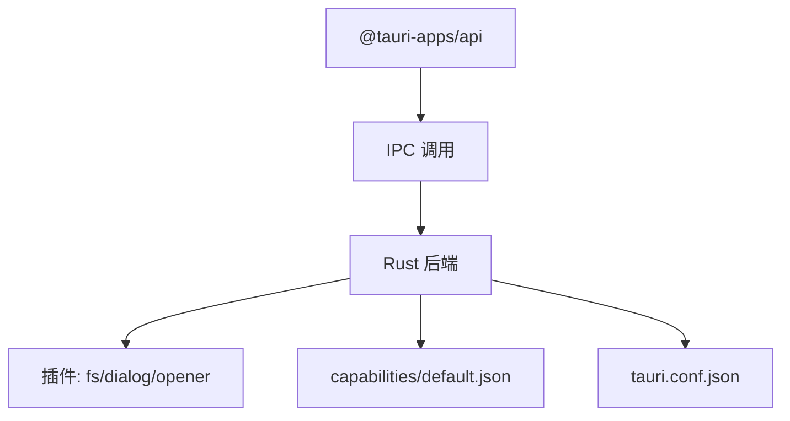

# 环境配置

<cite>
**本文引用的文件**
- [tauri.conf.json](file://src-tauri/tauri.conf.json)
- [package.json](file://package.json)
- [vite.config.ts](file://vite.config.ts)
- [Cargo.toml](file://src-tauri/Cargo.toml)
- [config-cascade.ts](file://src/config-cascade.ts)
- [config.rs](file://src-tauri/src/config.rs)
- [default.json](file://src-tauri/capabilities/default.json)
- [core.d.ts](file://node_modules/@tauri-apps/api/core.d.ts)
- [index.d.ts](file://node_modules/@tauri-apps/api/index.d.ts)
- [config.schema.json](file://node_modules/@tauri-apps/cli/config.schema.json)
</cite>

## 目录
1. [简介](#简介)
2. [项目结构](#项目结构)
3. [核心组件](#核心组件)
4. [架构总览](#架构总览)
5. [详细组件分析](#详细组件分析)
6. [依赖关系分析](#依赖关系分析)
7. [性能考量](#性能考量)
8. [故障排查指南](#故障排查指南)
9. [结论](#结论)
10. [附录](#附录)

## 简介
本文件面向“环境配置系统”的技术文档，围绕以下目标展开：  
- 解释不同环境（开发、测试、生产）的配置差异与管理策略  
- 文档化环境变量的定义、命名规范与作用域  
- 详解 Tauri 框架的配置选项（窗口、权限、构建等）  
- 提供环境切换最佳实践（配置文件管理与 CI/CD 集成）  
- 解释敏感信息的环境化管理（API 密钥、数据库连接等）  
- 多环境部署的配置同步与版本控制方法  
- 环境配置的验证与测试策略  

本项目采用前端（Vite + TypeScript）+ 后端（Rust + Tauri）的混合架构，并通过 IPC 调用在前端与后端之间传递配置与能力。

## 项目结构
本项目的关键配置与能力分布如下：
- 前端配置与脚本：package.json、vite.config.ts
- Tauri 应用配置：src-tauri/tauri.conf.json
- Rust 配置加载与能力声明：src-tauri/src/config.rs、src-tauri/capabilities/default.json
- Tauri API 与全局访问开关：node_modules/@tauri-apps/api/*、src-tauri/Cargo.toml

图表来源
- [tauri.conf.json:1-38](file://src-tauri/tauri.conf.json#L1-L38)
- [package.json:1-28](file://package.json#L1-L28)
- [vite.config.ts:1-31](file://vite.config.ts#L1-L31)
- [Cargo.toml:1-46](file://src-tauri/Cargo.toml#L1-L46)
- [config-cascade.ts:1-239](file://src/config-cascade.ts#L1-L239)
- [config.rs:1-260](file://src-tauri/src/config.rs#L1-L260)
- [default.json:1-22](file://src-tauri/capabilities/default.json#L1-L22)

章节来源
- [tauri.conf.json:1-38](file://src-tauri/tauri.conf.json#L1-L38)
- [package.json:1-28](file://package.json#L1-L28)
- [vite.config.ts:1-31](file://vite.config.ts#L1-L31)
- [Cargo.toml:1-46](file://src-tauri/Cargo.toml#L1-L46)

## 核心组件
- 层叠配置系统（前端）：提供默认配置、运行时覆盖、持久化保存与全局/项目级配置合并
- 配置加载器（后端）：按优先级加载全局与项目级配置，支持深度合并
- Tauri 能力与权限：通过 capabilities/default.json 声明窗口与文件系统等权限
- 构建与开发服务器：Vite 固定端口与热更新、Tauri 开发命令与前端构建命令
- 全局访问开关：Tauri 配置中启用全局变量访问，便于前端直接使用 window.__TAURI__

章节来源
- [config-cascade.ts:1-239](file://src/config-cascade.ts#L1-L239)
- [config.rs:170-259](file://src-tauri/src/config.rs#L170-L259)
- [default.json:1-22](file://src-tauri/capabilities/default.json#L1-L22)
- [tauri.conf.json:12-25](file://src-tauri/tauri.conf.json#L12-L25)
- [core.d.ts:1-60](file://node_modules/@tauri-apps/api/core.d.ts#L1-L60)
- [index.d.ts:1-20](file://node_modules/@tauri-apps/api/index.d.ts#L1-L20)

## 架构总览
下图展示了前端配置层叠、IPC 调用、后端配置加载与能力声明的整体交互：

图表来源
- [config-cascade.ts:120-137](file://src/config-cascade.ts#L120-L137)
- [config.rs:174-192](file://src-tauri/src/config.rs#L174-L192)
- [config.rs:247-253](file://src-tauri/src/config.rs#L247-L253)

## 详细组件分析

### 前端层叠配置系统（ConfigCascade）
- 设计要点
  - 默认配置：内置默认值，作为最基础的回退
  - 运行时覆盖：不持久化的临时覆盖，优先于后端配置
  - 后端合并：通过 IPC 从后端获取配置，再与默认配置进行深度合并
  - 持久化：支持以“全局/项目”范围保存配置
- 数据模型
  - AppConfig 及其子配置段（LLM、Shell、Approval、Agent、Pipeline、UI）
- 关键流程
  - load：调用后端接口获取配置，失败时回退默认值；随后应用运行时覆盖
  - save：将当前配置序列化后保存至后端指定路径
  - getDefaults：导出默认配置，用于 UI 展示可配置项

图表来源
- [config-cascade.ts:7-239](file://src/config-cascade.ts#L7-L239)

章节来源
- [config-cascade.ts:108-239](file://src/config-cascade.ts#L108-L239)

### 后端配置加载器（ConfigLoader）
- 设计要点
  - 优先级：内置默认 → 用户全局 → 项目级 → 运行时覆盖（前端）
  - 文件位置
    - 全局：用户主目录下的特定路径
    - 项目级：项目根目录下的特定路径
  - 深度合并：对 JSON 对象进行递归合并，覆盖同名字段
- 关键流程
  - load：按顺序尝试加载全局与项目级配置，最终得到合并后的 AppConfig
  - save_config：将配置写入指定路径，自动创建父目录
  - get_default_json：导出默认配置 JSON，供前端 UI 使用

图表来源
- [config.rs:170-244](file://src-tauri/src/config.rs#L170-L244)

章节来源
- [config.rs:170-259](file://src-tauri/src/config.rs#L170-L259)

### Tauri 配置与能力声明
- 窗口设置
  - 标题、宽高、是否带装饰等在 Tauri 配置中定义
- 权限配置
  - 通过 capabilities/default.json 声明窗口标签、权限集合（如窗口操作、文件系统、对话框等）
- 构建配置
  - 开发前命令、开发地址、构建前命令、前端产物目录等
- 全局访问开关
  - 启用后可在前端通过 window.__TAURI__ 访问 API

图表来源
- [tauri.conf.json:12-36](file://src-tauri/tauri.conf.json#L12-L36)
- [default.json:6-20](file://src-tauri/capabilities/default.json#L6-L20)
- [core.d.ts:1-60](file://node_modules/@tauri-apps/api/core.d.ts#L1-L60)
- [index.d.ts:1-20](file://node_modules/@tauri-apps/api/index.d.ts#L1-L20)

章节来源
- [tauri.conf.json:12-36](file://src-tauri/tauri.conf.json#L12-L36)
- [default.json:1-22](file://src-tauri/capabilities/default.json#L1-L22)
- [core.d.ts:1-60](file://node_modules/@tauri-apps/api/core.d.ts#L1-L60)
- [index.d.ts:1-20](file://node_modules/@tauri-apps/api/index.d.ts#L1-L20)

### 开发服务器与环境变量
- Vite 固定端口与严格端口模式，确保 Tauri 开发时前后端联调稳定
- 支持通过环境变量控制开发主机与热更新协议参数
- 通过 package.json 的脚本统一入口，便于在不同环境中切换

章节来源
- [vite.config.ts:4-29](file://vite.config.ts#L4-L29)
- [package.json:6-14](file://package.json#L6-L14)

## 依赖关系分析
- 前端依赖 Tauri API，通过 IPC 调用后端能力
- Rust 侧通过 Cargo.toml 引入 Tauri 与插件（如 fs、dialog、opener），并在 capabilities 中声明权限
- Tauri 配置决定窗口、安全策略与打包行为

图表来源
- [Cargo.toml:20-31](file://src-tauri/Cargo.toml#L20-L31)
- [default.json:6-20](file://src-tauri/capabilities/default.json#L6-L20)
- [tauri.conf.json:12-36](file://src-tauri/tauri.conf.json#L12-L36)

章节来源
- [Cargo.toml:1-46](file://src-tauri/Cargo.toml#L1-L46)
- [default.json:1-22](file://src-tauri/capabilities/default.json#L1-L22)
- [tauri.conf.json:1-38](file://src-tauri/tauri.conf.json#L1-L38)

## 性能考量
- 配置加载
  - 后端加载顺序为 O(N)（N 为配置层级数），文件读取与 JSON 解析成本低
  - 建议避免频繁保存配置，批量写入或节流处理
- 前端合并
  - 深度合并为对象遍历，建议控制配置体量，减少不必要的嵌套
- 开发体验
  - 固定端口与严格端口模式降低端口冲突风险，提升联调稳定性

## 故障排查指南
- 配置无法加载
  - 检查后端全局/项目配置文件是否存在且可读
  - 确认 IPC 接口调用是否成功，前端日志是否有异常
- 权限不足
  - 检查 capabilities/default.json 中是否声明了所需权限
  - 确认 Tauri 配置中的能力与窗口标签匹配
- 开发联调问题
  - 确认 Vite 端口与 Tauri devUrl 一致，严格端口模式下无其他进程占用
  - 若使用远程主机开发，检查热更新协议与 host 配置

章节来源
- [config.rs:209-219](file://src-tauri/src/config.rs#L209-L219)
- [config-cascade.ts:120-128](file://src/config-cascade.ts#L120-L128)
- [default.json:6-20](file://src-tauri/capabilities/default.json#L6-L20)
- [vite.config.ts:14-24](file://vite.config.ts#L14-L24)

## 结论
本项目通过“前端层叠配置 + 后端配置加载器 + Tauri 能力声明”的组合，实现了灵活可控的环境配置体系。结合固定端口的开发服务器与严格的权限管理，能够在多环境下保持一致性与安全性。建议在实际落地中完善 CI/CD 流水线中的环境变量注入与配置校验，确保配置变更的可追溯与可回滚。

## 附录

### 环境变量与命名规范
- 开发主机控制
  - 名称：TAURI_DEV_HOST
  - 作用域：Vite 开发服务器，用于控制热更新主机与协议
  - 示例：在不同网络环境下允许外部设备联调
- 其他建议
  - 建议统一使用前缀区分环境变量（如 APP_ENV、APP_FEATURE_*）
  - 在 CI/CD 中通过密钥管理服务注入敏感变量，避免硬编码

章节来源
- [vite.config.ts:4](file://vite.config.ts#L4)

### 不同环境的配置差异与管理策略
- 开发环境
  - 使用本地开发服务器与严格端口模式
  - 允许调试输出与最小权限集
- 测试环境
  - 使用隔离的配置文件与最小权限集
  - 通过 CI 注入测试专用的非敏感变量
- 生产环境
  - 仅保留必要权限与最小暴露面
  - 通过打包阶段注入只读配置，避免运行时修改

### Tauri 配置选项速览
- 应用与窗口
  - 标题、宽高、装饰、全屏等
- 安全
  - CSP 策略、透明背景等（按需启用）
- 构建与打包
  - 开发/构建前命令、前端产物目录、打包目标等

章节来源
- [tauri.conf.json:12-36](file://src-tauri/tauri.conf.json#L12-L36)
- [config.schema.json:164-225](file://node_modules/@tauri-apps/cli/config.schema.json#L164-L225)
- [config.schema.json:519-599](file://node_modules/@tauri-apps/cli/config.schema.json#L519-L599)

### 环境切换最佳实践
- 配置文件管理
  - 全局配置：用户主目录下的统一配置文件
  - 项目配置：项目根目录下的项目级配置文件
  - 运行时覆盖：前端临时覆盖，不持久化
- CI/CD 集成
  - 在流水线中按环境注入变量，生成对应配置文件
  - 构建阶段校验配置合法性，失败即阻断

### 敏感信息的环境化管理
- 建议
  - 将 API 密钥、数据库连接等放入受控的环境变量或密钥管理服务
  - 前端仅消费后端提供的安全接口，避免直接暴露敏感信息
- 权限最小化
  - 通过 capabilities/default.json 限制文件系统与网络访问范围

章节来源
- [default.json:6-20](file://src-tauri/capabilities/default.json#L6-L20)

### 多环境部署的配置同步与版本控制
- 版本控制
  - 将默认配置与模板纳入版本库，记录变更历史
  - 通过分支或标签区分不同环境的配置模板
- 同步策略
  - 使用 CI 工具在部署时自动生成环境专属配置文件
  - 通过后端配置加载器实现运行时合并，避免硬编码

### 环境配置的验证与测试策略
- 验证
  - 启动时读取并解析配置，失败回退默认值
  - 对关键配置项进行边界值与类型校验
- 测试
  - 单元测试：覆盖配置加载、合并与保存逻辑
  - 集成测试：模拟不同环境下的配置文件与权限场景