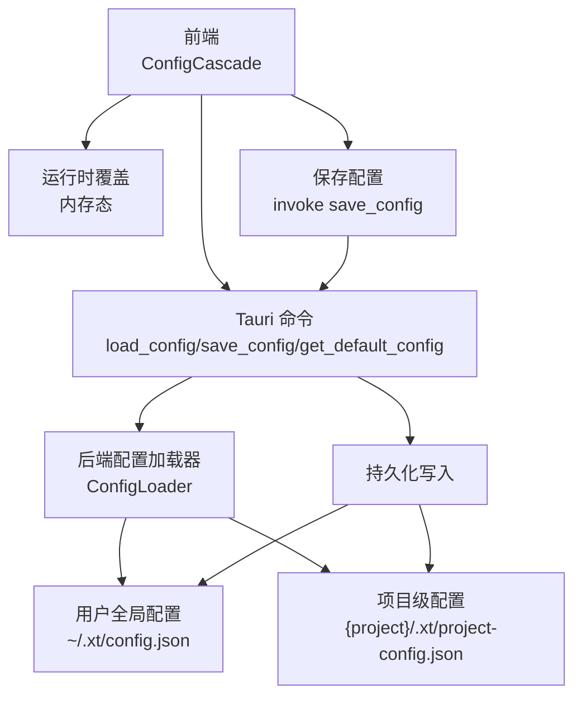
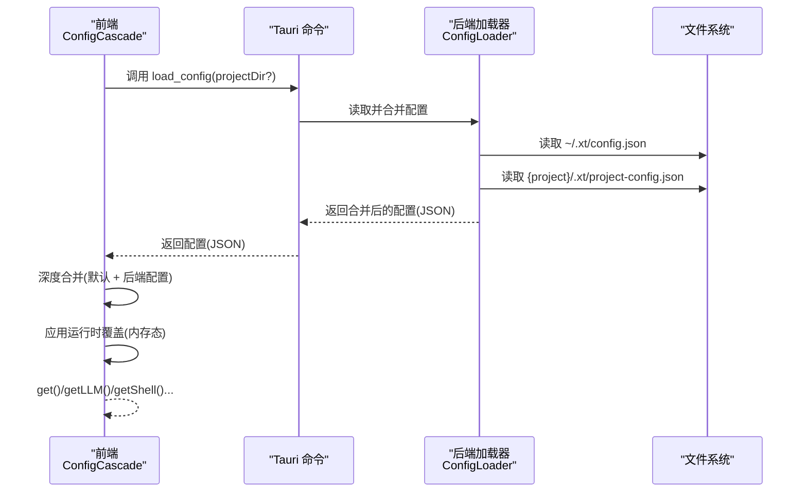
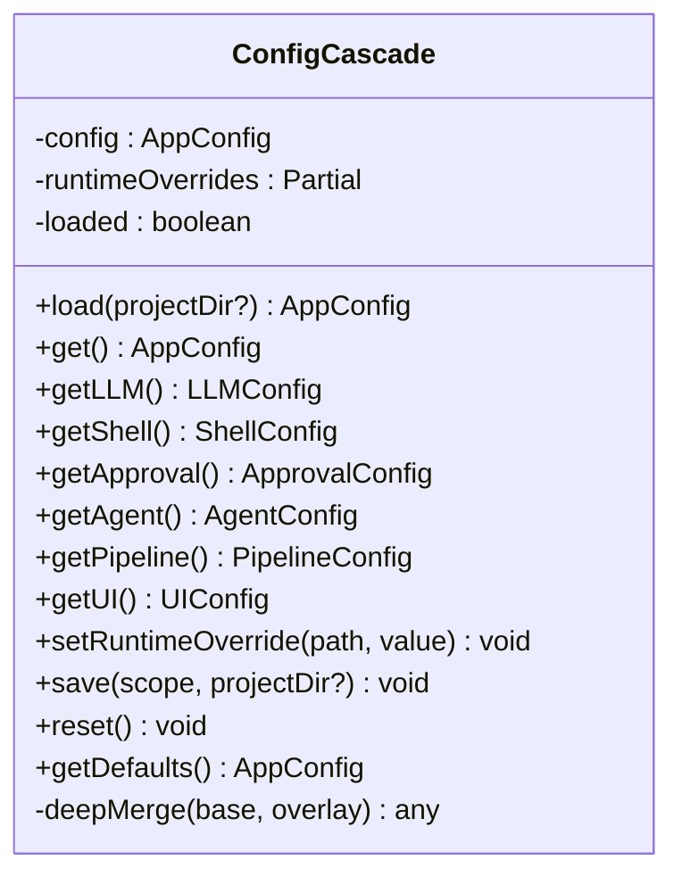
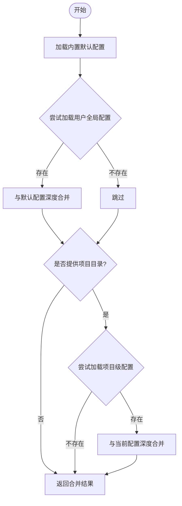
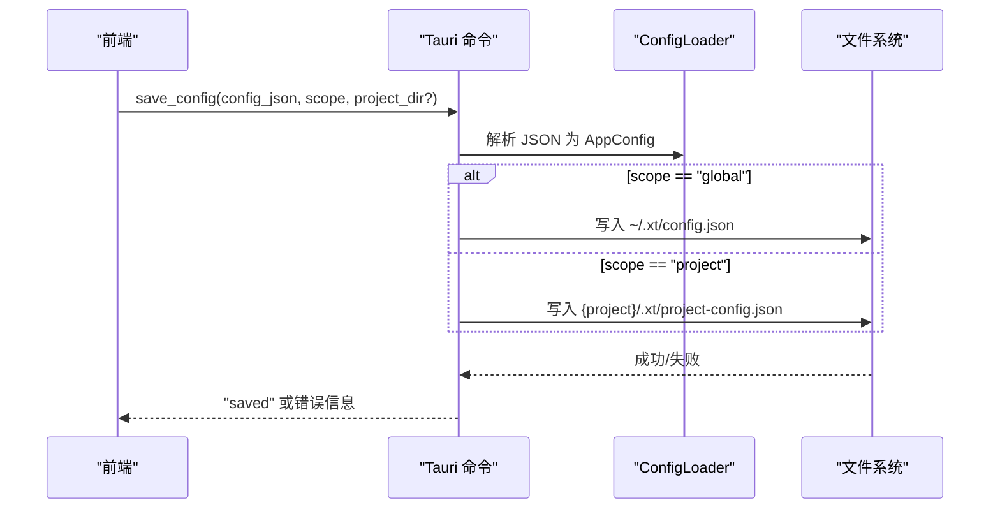
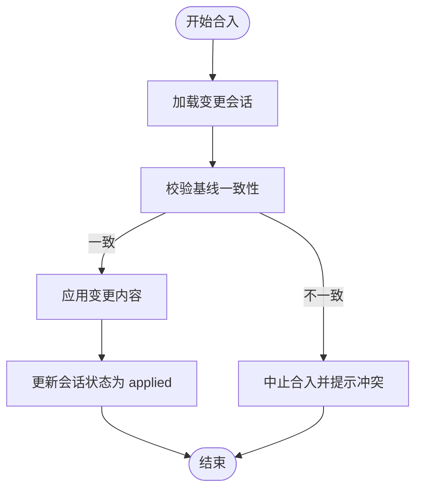
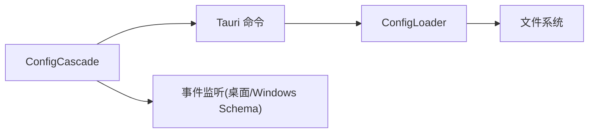

# 运行时配置

<cite>
**本文引用的文件**
- [src/config-cascade.ts](file://src/config-cascade.ts)
- [src-tauri/src/config.rs](file://src-tauri/src/config.rs)
- [src-tauri/src/lib.rs](file://src-tauri/src/lib.rs)
- [src/memory-store.ts](file://src/memory-store.ts)
- [src-tauri/gen/schemas/desktop-schema.json](file://src-tauri/gen/schemas/desktop-schema.json)
- [src-tauri/gen/schemas/windows-schema.json](file://src-tauri/gen/schemas/windows-schema.json)
- [src-tauri/src/workflow_engine.rs](file://src-tauri/src/workflow_engine.rs)
- [src-tauri/src/lib.rs](file://src-tauri/src/lib.rs)
</cite>

## 目录
1. [简介](#简介)
2. [项目结构](#项目结构)
3. [核心组件](#核心组件)
4. [架构总览](#架构总览)
5. [详细组件分析](#详细组件分析)
6. [依赖关系分析](#依赖关系分析)
7. [性能考虑](#性能考虑)
8. [故障排查指南](#故障排查指南)
9. [结论](#结论)
10. [附录](#附录)

## 简介
本技术文档围绕“运行时配置系统”展开，系统采用前端层叠配置与后端持久化相结合的架构，支持多层级配置来源（内置默认、用户全局、项目级、运行时覆盖），并提供配置的动态更新、变更通知、状态同步、缓存策略、验证与类型检查、持久化与同步、冲突解决与版本管理、监控与审计以及回滚与恢复能力。本文档既面向开发者也面向非技术读者，通过分层讲解与可视化图表帮助理解。

## 项目结构
运行时配置系统主要由以下部分组成：
- 前端配置管理器：负责加载、合并、应用运行时覆盖、保存配置，并暴露统一的配置访问接口。
- 后端配置加载器：负责从用户全局与项目级配置文件中加载并进行层叠合并，生成最终配置。
- Tauri 命令桥接：提供 load_config/save_config/get_default_config 等命令，供前端调用。
- 配置持久化与同步：通过全局与项目级配置文件实现持久化；变更会话与受保护变更会话用于冲突检测与回滚。
- 监控与审计：变更会话记录变更前后内容、差异与风险评估，便于审计与回滚。
- 冲突解决与版本管理：基于变更会话的基线一致性校验，避免覆盖用户修改。

**图表来源**
- [src/config-cascade.ts:108-238](file://src/config-cascade.ts#L108-L238)
- [src-tauri/src/lib.rs:6905-6933](file://src-tauri/src/lib.rs#L6905-L6933)
- [src-tauri/src/config.rs:170-259](file://src-tauri/src/config.rs#L170-L259)

**章节来源**
- [src/config-cascade.ts:1-239](file://src/config-cascade.ts#L1-L239)
- [src-tauri/src/config.rs:1-260](file://src-tauri/src/config.rs#L1-L260)
- [src-tauri/src/lib.rs:6905-6933](file://src-tauri/src/lib.rs#L6905-L6933)

## 核心组件
- 前端配置管理器（ConfigCascade）
  - 负责加载后端返回的配置并与默认配置进行层叠合并；支持运行时覆盖（内存态，不持久化）；提供按模块访问接口；提供保存配置到后端的能力。
- 后端配置加载器（ConfigLoader）
  - 实现三层级配置合并：内置默认 → 用户全局 → 项目级；提供保存配置到指定路径的能力；提供默认配置 JSON 的导出。
- Tauri 命令
  - 提供 load_config、save_config、get_default_config 等命令，供前端通过 invoke 调用。
- 变更会话与受保护变更会话
  - 用于记录变更前后内容、差异与风险评估，支持冲突检测与回滚。
- 监控与审计
  - 通过变更会话记录变更详情，支持审计与回滚。

**章节来源**
- [src/config-cascade.ts:108-238](file://src/config-cascade.ts#L108-L238)
- [src-tauri/src/config.rs:170-259](file://src-tauri/src/config.rs#L170-L259)
- [src-tauri/src/lib.rs:6905-6933](file://src-tauri/src/lib.rs#L6905-L6933)
- [src-tauri/src/lib.rs:4036-4059](file://src-tauri/src/lib.rs#L4036-L4059)

## 架构总览
运行时配置系统采用“前端层叠 + 后端持久化”的双层架构：
- 前端层叠：默认配置 + 用户全局配置 + 项目级配置 + 运行时覆盖，最终形成当前生效配置。
- 后端持久化：通过命令桥接，将配置保存到用户全局或项目级配置文件中。
- 变更会话：记录变更前后内容与差异，用于冲突检测与回滚。

**图表来源**
- [src/config-cascade.ts:120-137](file://src/config-cascade.ts#L120-L137)
- [src-tauri/src/lib.rs:6905-6909](file://src-tauri/src/lib.rs#L6905-L6909)
- [src-tauri/src/config.rs:170-192](file://src-tauri/src/config.rs#L170-L192)

## 详细组件分析

### 前端配置管理器（ConfigCascade）
- 数据结构与职责
  - 维护当前配置对象与运行时覆盖对象；提供加载、获取、保存、重置、深度合并等能力。
  - 支持按模块访问（LLM、Shell、Approval、Agent、Pipeline、UI）。
- 动态更新机制
  - 加载：调用后端命令获取配置 JSON，解析为 AppConfig 并与默认配置进行深度合并；随后应用运行时覆盖。
  - 运行时覆盖：通过点号路径设置（如 "llm.retry.max_retries"），同时更新当前配置与覆盖对象。
  - 保存：将当前配置序列化为 JSON，调用后端命令保存到指定作用域（全局或项目）。
- 缓存策略与性能
  - 仅在首次加载时触发后端 IO；后续通过内存态运行时覆盖快速生效，避免频繁 IO。
  - 深度合并采用结构化克隆，保证不可变性与可预测性。
- 验证与类型检查
  - 前端通过 TypeScript 接口约束配置结构；后端通过 serde 结构体与默认值确保类型安全。
- 状态同步
  - 通过运行时覆盖实现“内存态”即时生效；保存后端持久化，重启后仍可恢复。

**图表来源**
- [src/config-cascade.ts:108-238](file://src/config-cascade.ts#L108-L238)

**章节来源**
- [src/config-cascade.ts:108-238](file://src/config-cascade.ts#L108-L238)

### 后端配置加载器（ConfigLoader）
- 数据结构与职责
  - 定义各配置段结构体（LLMConfig、RetrySettings、ShellConfig、ApprovalConfig、AgentConfig、PipelineConfig、UIConfig）。
  - 提供默认实现，确保缺失字段的合理缺省值。
- 层叠合并逻辑
  - 顺序：内置默认 → 用户全局 → 项目级；使用深度合并策略，对象字段递归合并，其他类型直接覆盖。
- 持久化与导出
  - 提供保存配置到指定路径的能力；提供默认配置 JSON 导出，用于前端 UI 展示。

**图表来源**
- [src-tauri/src/config.rs:170-244](file://src-tauri/src/config.rs#L170-L244)

**章节来源**
- [src-tauri/src/config.rs:1-260](file://src-tauri/src/config.rs#L1-L260)

### Tauri 命令桥接
- 命令定义
  - load_config：加载并返回合并后的配置 JSON。
  - save_config：接收配置 JSON 与作用域（全局/项目），写入对应配置文件。
  - get_default_config：返回默认配置 JSON。
- 参数与返回
  - load_config(project_dir?: string) -> string
  - save_config(config_json: string, scope: "global"|"project", project_dir?: string) -> string
  - get_default_config() -> string

**图表来源**
- [src-tauri/src/lib.rs:6911-6928](file://src-tauri/src/lib.rs#L6911-L6928)
- [src-tauri/src/config.rs:246-253](file://src-tauri/src/config.rs#L246-L253)

**章节来源**
- [src-tauri/src/lib.rs:6905-6933](file://src-tauri/src/lib.rs#L6905-L6933)
- [src-tauri/src/config.rs:246-259](file://src-tauri/src/config.rs#L246-L259)

### 配置验证与类型检查
- 前端
  - 通过 TypeScript 接口定义配置结构，确保编译期类型安全；运行时通过 JSON.parse 与类型断言配合使用。
- 后端
  - 通过 serde 结构体与默认实现，确保字段类型与默认值正确；保存前进行 JSON 解析与错误转换。
- 建议
  - 前端可在保存前增加轻量校验（如数值范围、布尔值），后端严格校验 JSON 结构与字段类型。

**章节来源**
- [src/config-cascade.ts:7-103](file://src/config-cascade.ts#L7-L103)
- [src-tauri/src/config.rs:4-168](file://src-tauri/src/config.rs#L4-L168)
- [src-tauri/src/lib.rs:6911-6918](file://src-tauri/src/lib.rs#L6911-L6918)

### 配置持久化与同步策略
- 持久化位置
  - 全局：用户主目录下的 ~/.xt/config.json。
  - 项目：项目根目录下的 .xt/project-config.json。
- 同步策略
  - 保存时先解析 JSON，再写入文件；写入后进行存在性与内容长度校验，确保落盘成功。
- 作用域选择
  - 通过 save_config 的 scope 参数控制保存到全局或项目，project_dir 必填于项目作用域。

**章节来源**
- [src-tauri/src/config.rs:194-207](file://src-tauri/src/config.rs#L194-L207)
- [src-tauri/src/lib.rs:6911-6928](file://src-tauri/src/lib.rs#L6911-L6928)
- [src-tauri/src/lib.rs:4010-4034](file://src-tauri/src/lib.rs#L4010-L4034)

### 配置冲突解决与版本管理
- 变更会话
  - 记录每次变更的 ChangeSet 与 StoredChange，包含操作类型、路径、前后内容、差异与风险评估。
- 冲突检测
  - 合入前校验当前文件内容与会话基线是否一致，若不一致则中止合入并提示冲突原因。
- 版本管理
  - 通过变更会话 ID 与时间戳管理版本；支持回滚到指定会话状态。
- 回滚与恢复
  - 基于 StoredChange 的 before_content 或删除状态执行回滚；更新会话状态并记录审计指标。

**图表来源**
- [src-tauri/src/lib.rs:4036-4059](file://src-tauri/src/lib.rs#L4036-L4059)
- [src-tauri/src/lib.rs:4684-4697](file://src-tauri/src/lib.rs#L4684-L4697)
- [src-tauri/src/lib.rs:4761-4782](file://src-tauri/src/lib.rs#L4761-L4782)

**章节来源**
- [src-tauri/src/lib.rs:4036-4059](file://src-tauri/src/lib.rs#L4036-L4059)
- [src-tauri/src/lib.rs:4684-4697](file://src-tauri/src/lib.rs#L4684-L4697)
- [src-tauri/src/lib.rs:4761-4782](file://src-tauri/src/lib.rs#L4761-L4782)

### 监控与审计
- 变更会话记录
  - 记录变更前后内容、差异、风险评估与理由，便于审计与追溯。
- 会话状态
  - 支持 applied/rolled_back 等状态，记录操作时间与指标。
- 建议
  - 在前端 UI 中展示变更会话列表与状态，支持查看详情与回滚操作。

**章节来源**
- [src-tauri/src/lib.rs:4036-4059](file://src-tauri/src/lib.rs#L4036-L4059)
- [src-tauri/src/lib.rs:4761-4782](file://src-tauri/src/lib.rs#L4761-L4782)

### API 接口与使用示例
- 前端调用
  - 加载配置：调用 load_config，得到 AppConfig；随后可通过 get()/getLLM()/getShell() 等获取子配置。
  - 设置运行时覆盖：setRuntimeOverride("llm.retry.max_retries", 3) 即可立即生效。
  - 保存配置：save_config(configJson, "global"|"project", projectDir?)。
- 后端命令
  - load_config(project_dir?: string) -> string
  - save_config(config_json: string, scope: "global"|"project", project_dir?: string) -> string
  - get_default_config() -> string

**章节来源**
- [src/config-cascade.ts:120-195](file://src/config-cascade.ts#L120-L195)
- [src-tauri/src/lib.rs:6905-6933](file://src-tauri/src/lib.rs#L6905-L6933)

## 依赖关系分析
- 前端依赖后端命令：ConfigCascade 通过 invoke 调用 load_config/save_config。
- 后端依赖文件系统：ConfigLoader 读写配置文件；save_config 前进行目录创建与落盘校验。
- 权限与事件
  - 事件监听权限在桌面与 Windows Schema 中定义，前端可注册/移除监听器，用于接收后端事件。

**图表来源**
- [src/config-cascade.ts:120-195](file://src/config-cascade.ts#L120-L195)
- [src-tauri/src/lib.rs:6905-6933](file://src-tauri/src/lib.rs#L6905-L6933)
- [src-tauri/src/config.rs:194-207](file://src-tauri/src/config.rs#L194-L207)
- [src-tauri/gen/schemas/desktop-schema.json:2226-2332](file://src-tauri/gen/schemas/desktop-schema.json#L2226-L2332)
- [src-tauri/gen/schemas/windows-schema.json:2226-2332](file://src-tauri/gen/schemas/windows-schema.json#L2226-L2332)

**章节来源**
- [src-tauri/gen/schemas/desktop-schema.json:2226-2332](file://src-tauri/gen/schemas/desktop-schema.json#L2226-L2332)
- [src-tauri/gen/schemas/windows-schema.json:2226-2332](file://src-tauri/gen/schemas/windows-schema.json#L2226-L2332)

## 性能考虑
- 减少 IO 次数：前端仅在首次加载时发起后端请求；运行时覆盖在内存中即时生效，避免频繁保存。
- 深度合并优化：使用结构化克隆减少浅拷贝带来的副作用；合并逻辑仅处理对象字段，其他类型直接覆盖。
- 文件写入校验：保存后进行存在性与长度校验，避免无效写入导致的重复 IO。
- 建议
  - 对高频变更场景，可引入防抖/节流策略，批量保存配置；对大体量配置，可拆分为多个小配置文件以降低合并成本。

[本节为通用建议，无需特定文件引用]

## 故障排查指南
- 加载失败
  - 现象：前端加载配置报错，回退到默认配置。
  - 排查：检查后端命令返回值与 JSON 格式；确认用户全局与项目级配置文件是否存在且可读。
- 保存失败
  - 现象：保存后端返回错误。
  - 排查：检查作用域参数与 project_dir；确认目标目录可写；查看文件系统错误信息。
- 冲突中止
  - 现象：合入变更时提示冲突并中止。
  - 排查：对比当前文件内容与会话基线；若内容已被用户修改，需手动合并后再试。
- 回滚失败
  - 现象：回滚命令执行失败。
  - 排查：检查会话状态与 before_content；确认目标路径存在且具备写权限。

**章节来源**
- [src/config-cascade.ts:120-129](file://src/config-cascade.ts#L120-L129)
- [src-tauri/src/lib.rs:4010-4034](file://src-tauri/src/lib.rs#L4010-L4034)
- [src-tauri/src/lib.rs:4684-4697](file://src-tauri/src/lib.rs#L4684-L4697)
- [src-tauri/src/lib.rs:4761-4782](file://src-tauri/src/lib.rs#L4761-L4782)

## 结论
运行时配置系统通过前端层叠与后端持久化相结合的方式，实现了灵活、可扩展、可审计的配置管理。系统支持运行时覆盖、深度合并、持久化与同步、冲突检测与回滚，满足复杂场景下的配置需求。建议在实际使用中结合事件监听与 UI 展示，进一步增强用户体验与可观测性。

[本节为总结性内容，无需特定文件引用]

## 附录
- 变更会话数据模型
  - ChangeSet：包含操作类型、路径、搜索/替换文本、内容、理由、风险与覆盖允许标志。
  - StoredChange：包含变更详情、前后内容、哈希与差异字符串。
- 受保护变更会话
  - 用于记录受保护的变更提案，支持风险评估与冲突检测。

**章节来源**
- [src-tauri/src/lib.rs:4036-4059](file://src-tauri/src/lib.rs#L4036-L4059)
- [src-tauri/src/workflow_engine.rs:53-84](file://src-tauri/src/workflow_engine.rs#L53-L84)