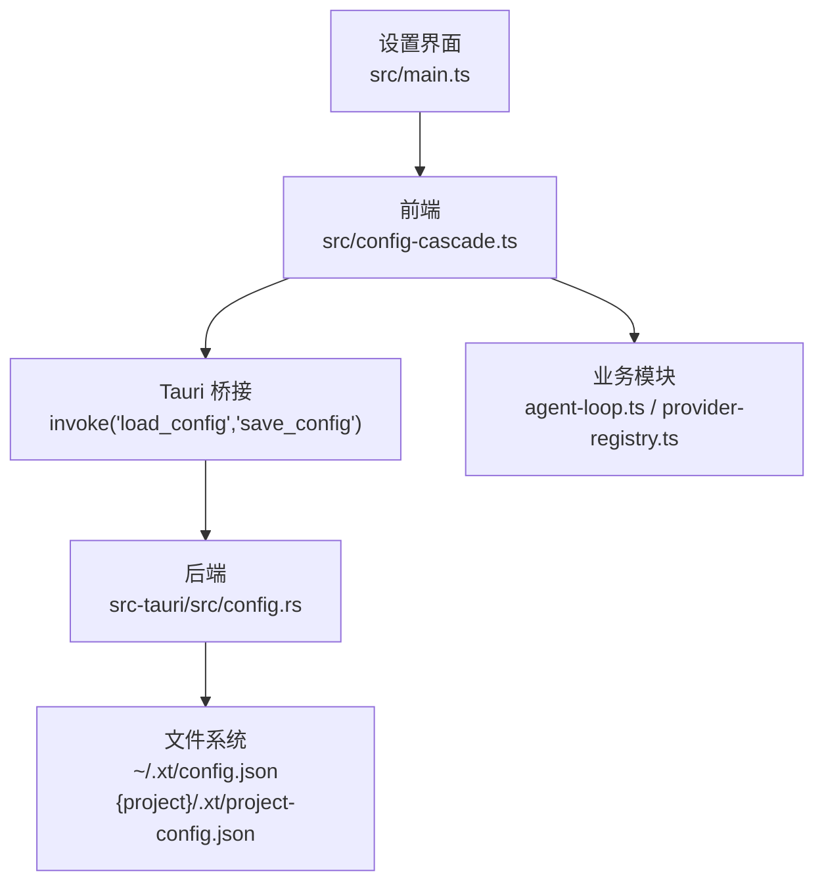
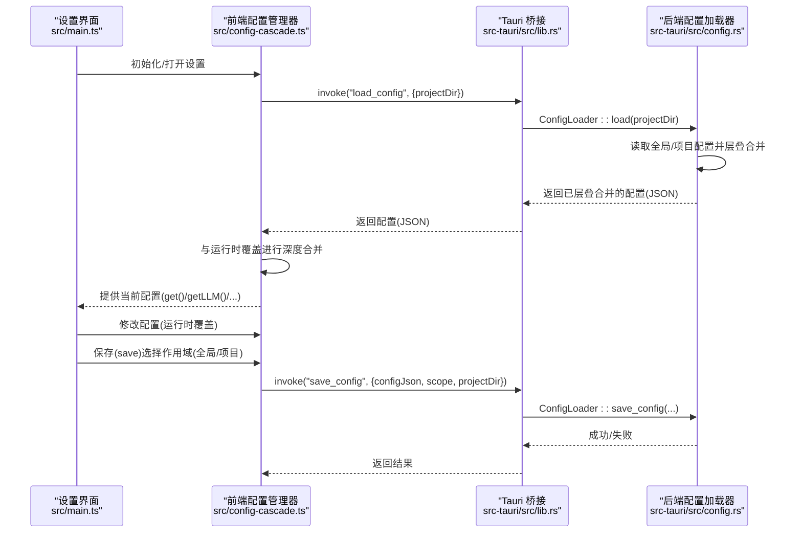
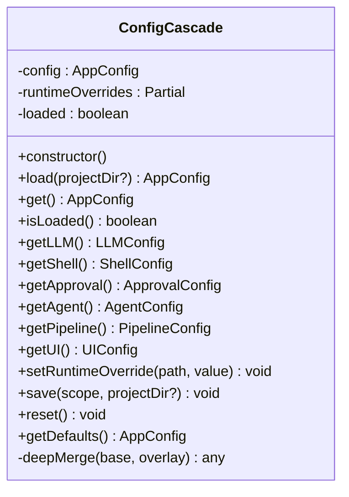
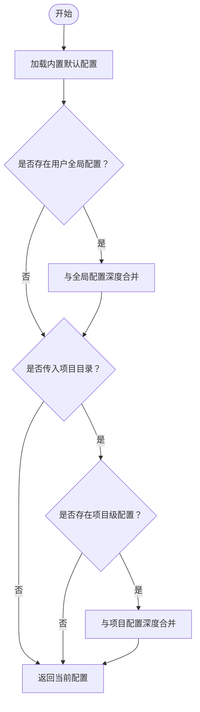
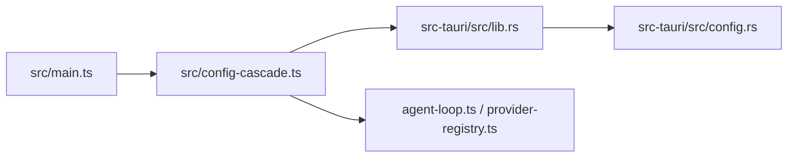

# 配置管理

<cite>
**本文引用的文件**
- [src\config-cascade.ts](file://src/config-cascade.ts)
- [src-tauri\src\config.rs](file://src-tauri/src/config.rs)
- [src-tauri\src\lib.rs](file://src-tauri/src/lib.rs)
- [src-tauri\tauri.conf.json](file://src-tauri/tauri.conf.json)
- [src\main.ts](file://src/main.ts)
</cite>

## 目录
1. [简介](#简介)
2. [项目结构](#项目结构)
3. [核心组件](#核心组件)
4. [架构总览](#架构总览)
5. [详细组件分析](#详细组件分析)
6. [依赖关系分析](#依赖关系分析)
7. [性能考量](#性能考量)
8. [故障排除指南](#故障排除指南)
9. [结论](#结论)
10. [附录](#附录)

## 简介
本文件面向“配置管理系统”的技术文档，围绕前端层叠配置与后端配置加载/保存机制展开，重点解释以下方面：
- 配置级联机制与优先级：内置默认 < 用户全局 < 项目级 < 运行时覆盖
- 配置文件结构、字段定义与验证规则
- 运行时配置更新机制：监听、热重载与变更传播
- 配置模板与最佳实践：开发/测试/生产环境差异
- 安全考虑：敏感信息保护与访问控制
- 配置迁移与版本管理方法
- 具体配置示例与故障排除指引

## 项目结构
本项目的配置体系由前端 TypeScript 的配置管理器与后端 Rust 的配置加载器协同实现，通过 Tauri 桥接函数完成跨语言通信。

图表来源
- [src\config-cascade.ts:117-137](file://src/config-cascade.ts#L117-L137)
- [src-tauri\src\config.rs:170-192](file://src-tauri/src/config.rs#L170-L192)
- [src-tauri\src\lib.rs:6905-6925](file://src-tauri/src/lib.rs#L6905-L6925)
- [src\main.ts:321-366](file://src/main.ts#L321-L366)

章节来源
- [src\config-cascade.ts:108-239](file://src/config-cascade.ts#L108-L239)
- [src-tauri\src\config.rs:170-259](file://src-tauri/src/config.rs#L170-L259)
- [src-tauri\src\lib.rs:6905-6925](file://src-tauri/src/lib.rs#L6905-L6925)
- [src-tauri\tauri.conf.json:1-38](file://src-tauri/tauri.conf.json#L1-L38)

## 核心组件
- 前端配置管理器（ConfigCascade）
  - 提供默认配置、加载、保存、重置、运行时覆盖、深度合并等能力
  - 通过 Tauri 桥接函数与后端交互
- 后端配置加载器（ConfigLoader）
  - 实现层叠合并：内置默认 → 用户全局 → 项目级
  - 提供全局与项目配置文件路径、深度合并、保存与默认配置导出
- Tauri 暴露命令
  - load_config：返回 JSON 字符串（已层叠合并后的配置）
  - save_config：保存配置至指定路径（全局或项目）

章节来源
- [src\config-cascade.ts:108-239](file://src/config-cascade.ts#L108-L239)
- [src-tauri\src\config.rs:170-259](file://src-tauri/src/config.rs#L170-L259)
- [src-tauri\src\lib.rs:6905-6925](file://src-tauri/src/lib.rs#L6905-L6925)

## 架构总览
前端在应用启动时调用 load_config，后端按优先级层叠合并配置并返回 JSON；前端再与运行时覆盖进行二次合并，最终形成当前生效配置。保存时通过 save_config 将配置写回相应位置。

图表来源
- [src\config-cascade.ts:120-137](file://src/config-cascade.ts#L120-L137)
- [src-tauri\src\config.rs:170-192](file://src-tauri/src/config.rs#L170-L192)
- [src-tauri\src\lib.rs:6905-6925](file://src-tauri/src/lib.rs#L6905-L6925)

## 详细组件分析

### 前端配置管理器（ConfigCascade）
- 数据结构与字段
  - AppConfig 包含 llm、shell、approval、agent、pipeline、ui 等子配置段
  - 各子配置段包含具体参数，如温度、最大令牌数、重试策略、超时限制、UI 开关等
- 默认配置
  - 使用结构化克隆初始化，确保每次重置/实例化均基于稳定默认值
- 加载流程
  - 调用 load_config，解析后端返回的 JSON 并与内置默认进行深度合并
  - 若加载失败，回退到默认配置
- 运行时覆盖
  - 支持通过点号路径设置运行时覆盖（不持久化），随后与当前配置再次深度合并
- 保存与重置
  - save(scope, projectDir) 将当前配置序列化后交由后端保存
  - reset() 恢复默认配置并清空运行时覆盖

图表来源
- [src\config-cascade.ts:108-239](file://src/config-cascade.ts#L108-L239)

章节来源
- [src\config-cascade.ts:7-103](file://src/config-cascade.ts#L7-L103)
- [src\config-cascade.ts:108-239](file://src/config-cascade.ts#L108-L239)

### 后端配置加载器（ConfigLoader）
- 层叠顺序
  - 内置默认 → 用户全局配置 → 项目级配置
- 文件路径
  - 全局：~/.xt/config.json
  - 项目：{project}/.xt/project-config.json
- 深度合并
  - 对象键逐层递归合并，覆盖同名键值
- 保存与默认导出
  - 保存时确保父目录存在并写入格式化 JSON
  - 提供默认配置的格式化 JSON，用于 UI 展示可配置项

图表来源
- [src-tauri\src\config.rs:170-192](file://src-tauri/src/config.rs#L170-L192)
- [src-tauri\src\config.rs:221-244](file://src-tauri/src/config.rs#L221-L244)

章节来源
- [src-tauri\src\config.rs:170-259](file://src-tauri/src/config.rs#L170-L259)

### Tauri 桥接命令
- load_config
  - 输入：projectDir（可选）
  - 输出：JSON 字符串（已层叠合并的 AppConfig）
- save_config
  - 输入：configJson、scope（global 或 project）、projectDir（可选）
  - 行为：将配置保存到对应路径

章节来源
- [src-tauri\src\lib.rs:6905-6925](file://src-tauri/src/lib.rs#L6905-L6925)

### 运行时配置更新与传播
- 运行时覆盖
  - 通过 setRuntimeOverride(path, value) 设置，路径采用点号分隔（如 llm.retry.max_retries）
  - 同步更新当前配置，无需持久化
- 变更传播
  - 业务模块通过 getConfig().get() 或细分段接口（如 getLLM()）读取最新配置
  - 示例：provider-registry.ts 读取默认提供商并支持运行时覆盖

章节来源
- [src\config-cascade.ts:166-183](file://src/config-cascade.ts#L166-L183)
- [src\config-cascade.ts:156-161](file://src/config-cascade.ts#L156-L161)
- [src\provider-registry.ts:34](file://src/provider-registry.ts#L34)

### 配置文件结构与字段定义
- AppConfig
  - llm: 默认提供商、默认模型、重试设置、温度、最大令牌数
  - shell: 默认超时、最大超时、最大输出字节、最大输出行数
  - approval: 缓存开关、自动放行模式列表、拦截模式列表
  - agent: 最大轮次、令牌预算、紧凑阈值、死循环检测轮次
  - pipeline: 专家超时、最大步骤数、是否启用并行
  - ui: 流式输出开关、显示工具调用、显示进度条
- 验证规则
  - 类型约束：数值字段为整数/浮点/布尔；数组字段为字符串数组
  - 语义约束：超时上限、最大令牌数、重试次数与退避参数需满足合理范围
  - 合并策略：对象字段按键深度合并，数组字段整体覆盖

章节来源
- [src\config-cascade.ts:7-103](file://src/config-cascade.ts#L7-L103)
- [src-tauri\src\config.rs:5-67](file://src-tauri/src/config.rs#L5-L67)

## 依赖关系分析
- 前端对后端的依赖
  - 通过 invoke('load_config'/'save_config') 与后端交互
  - 依赖后端提供的层叠合并与文件读写能力
- 业务模块对配置的依赖
  - agent-loop.ts、provider-registry.ts 等模块通过 getConfig() 读取配置
- UI 对配置的依赖
  - 设置页面在打开时加载配置，保存时调用保存接口

图表来源
- [src\config-cascade.ts:120-137](file://src/config-cascade.ts#L120-L137)
- [src-tauri\src\lib.rs:6905-6925](file://src-tauri/src/lib.rs#L6905-L6925)
- [src-tauri\src\config.rs:170-192](file://src-tauri/src/config.rs#L170-L192)

章节来源
- [src\config-cascade.ts:108-239](file://src/config-cascade.ts#L108-L239)
- [src-tauri\src\config.rs:170-259](file://src-tauri/src/config.rs#L170-L259)
- [src-tauri\src\lib.rs:6905-6925](file://src-tauri/src/lib.rs#L6905-L6925)

## 性能考量
- 深度合并复杂度
  - 合并算法为对象键遍历与递归合并，时间复杂度近似 O(N+M)，其中 N、M 为两份配置对象的键数量
- I/O 开销
  - 全局与项目配置文件读取为本地磁盘操作，建议避免频繁保存
- 建议
  - 合理控制配置层级与嵌套深度，减少不必要的深层对象合并
  - 在 UI 中批量保存配置，降低 save_config 调用频率

## 故障排除指南
- 加载失败回退
  - 当后端 load_config 抛错或返回异常时，前端会回退到默认配置并记录警告
- 保存失败排查
  - 检查目标路径权限与父目录是否存在；后端会在保存前确保父目录存在
- 运行时覆盖未生效
  - 确认路径格式（点号分隔）与键名一致；确认覆盖发生在加载之后
- 配置未持久化
  - 确认调用 save(scope, projectDir) 且 scope 正确（global 或 project）

章节来源
- [src\config-cascade.ts:120-128](file://src/config-cascade.ts#L120-L128)
- [src-tauri\src\config.rs:246-253](file://src-tauri/src/config.rs#L246-L253)
- [src\config-cascade.ts:166-183](file://src/config-cascade.ts#L166-L183)

## 结论
该配置系统通过前后端协作实现了清晰的层叠优先级与灵活的运行时覆盖能力。前端负责运行时合并与业务读取，后端负责文件系统读写与层叠合并。通过统一的桥接命令与严格的字段定义，系统在易用性与一致性之间取得平衡。建议在实际使用中遵循最佳实践，关注安全与性能，并建立完善的迁移与版本管理流程。

## 附录

### 配置级联优先级与规则
- 优先级顺序：内置默认 < 用户全局 < 项目级 < 运行时覆盖
- 合并策略：对象键深度合并，数组整体覆盖
- 回退策略：加载失败时使用默认配置

章节来源
- [src\config-cascade.ts:117-137](file://src/config-cascade.ts#L117-L137)
- [src-tauri\src\config.rs:170-192](file://src-tauri/src/config.rs#L170-L192)

### 配置文件路径
- 全局配置：~/.xt/config.json
- 项目配置：{project}/.xt/project-config.json

章节来源
- [src-tauri\src\config.rs:194-207](file://src-tauri/src/config.rs#L194-L207)

### 运行时配置更新流程
- 设置运行时覆盖：setRuntimeOverride(path, value)
- 应用覆盖：在 load 后自动合并
- 保存：save(scope, projectDir)

章节来源
- [src\config-cascade.ts:166-195](file://src/config-cascade.ts#L166-L195)

### 安全考虑与访问控制
- 敏感信息保护
  - 配置文件中不应包含密钥；密钥应通过独立的密钥池或安全存储管理
  - 保存配置时注意文件权限，避免被非预期用户读取
- 访问控制
  - 仅授权用户可修改全局或项目配置
  - UI 中对敏感字段提供只读或受限编辑入口

### 配置模板与最佳实践
- 开发环境
  - 使用较宽松的超时与日志级别，便于调试
  - 项目级配置用于团队共享常用参数
- 测试环境
  - 严格控制超时与并发，避免资源争用
  - 使用最小化配置集，确保可重复性
- 生产环境
  - 明确超时上限与令牌预算，启用并行时需评估资源
  - 仅在必要时开启流式输出，避免影响吞吐

### 配置迁移与版本管理
- 版本标识
  - 在配置根对象中增加版本字段，用于识别配置格式版本
- 迁移策略
  - 新增字段：向后兼容，使用默认值
  - 删除字段：在加载阶段清理，避免报错
  - 字段重命名：提供映射与迁移脚本
- 自动化
  - 后端在加载时执行迁移逻辑，前端在保存时写入新版本

### 具体配置示例与参考路径
- 默认配置导出：后端提供默认配置 JSON，用于 UI 展示可配置项
- 设置页面打开与保存：UI 通过 openSettings/closeSettings 与保存接口交互

章节来源
- [src-tauri\src\config.rs:255-258](file://src-tauri/src/config.rs#L255-L258)
- [src\main.ts:321-366](file://src/main.ts#L321-L366)