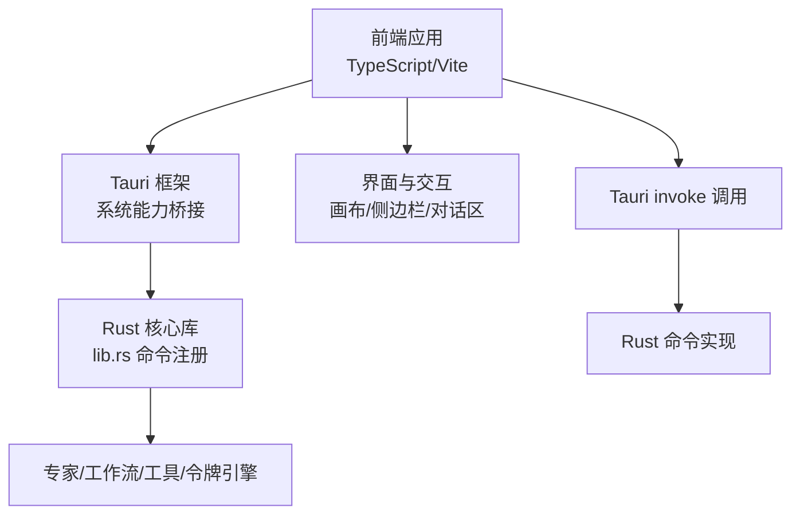
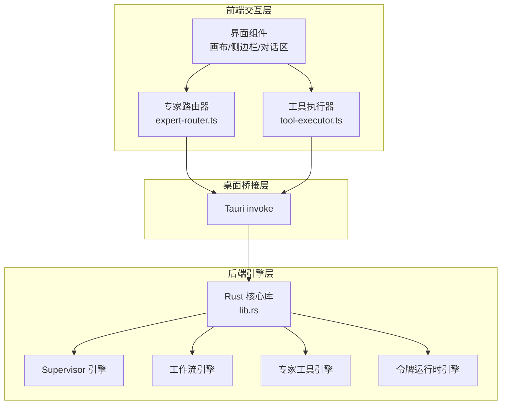
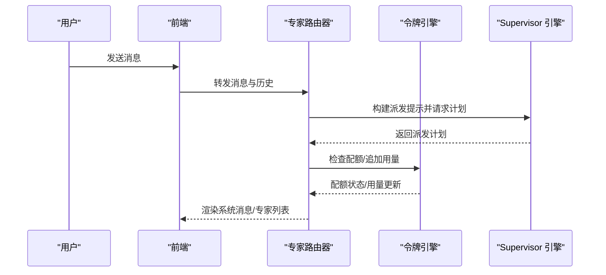
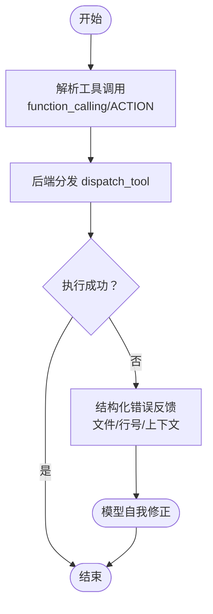
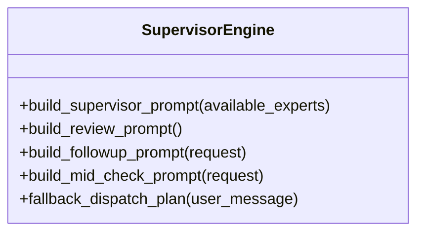
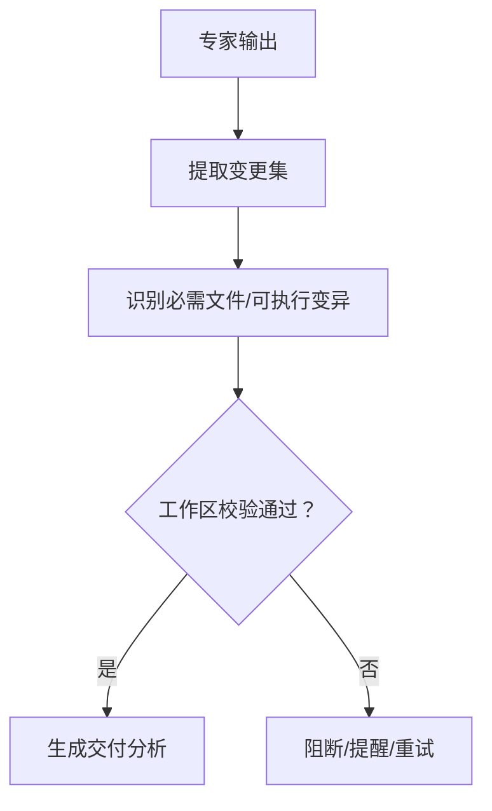
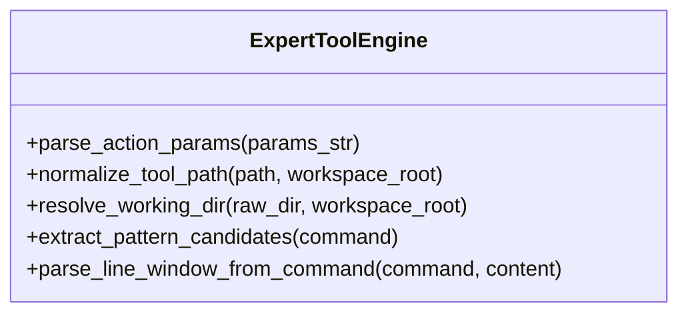
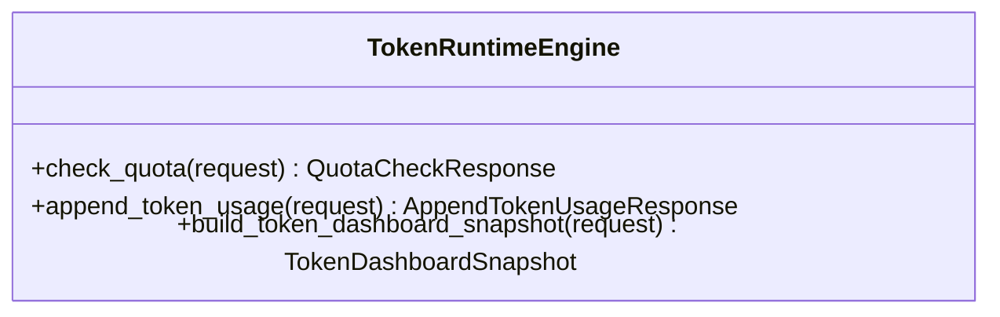
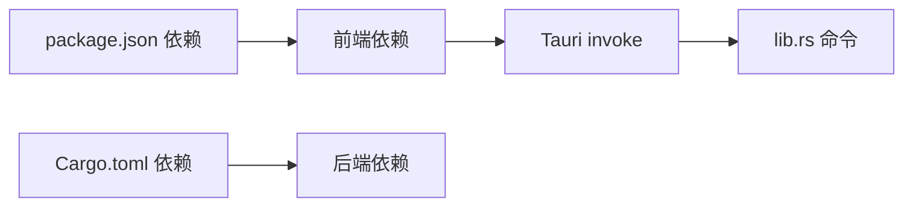

# 项目概述

<cite>
**本文档引用的文件**
- [package.json](file://package.json)
- [index.html](file://index.html)
- [src/main.ts](file://src/main.ts)
- [src/expert-router.ts](file://src/expert-router.ts)
- [src/tool-executor.ts](file://src/tool-executor.ts)
- [src-tauri/Cargo.toml](file://src-tauri/Cargo.toml)
- [src-tauri/src/main.rs](file://src-tauri/src/main.rs)
- [src-tauri/src/lib.rs](file://src-tauri/src/lib.rs)
- [src-tauri/src/supervisor_engine.rs](file://src-tauri/src/supervisor_engine.rs)
- [src-tauri/src/workflow_engine.rs](file://src-tauri/src/workflow_engine.rs)
- [src-tauri/src/expert_tool_engine.rs](file://src-tauri/src/expert_tool_engine.rs)
- [src-tauri/src/token_runtime_engine.rs](file://src-tauri/src/token_runtime_engine.rs)
</cite>

## 目录
1. [引言](#引言)
2. [项目结构](#项目结构)
3. [核心组件](#核心组件)
4. [架构总览](#架构总览)
5. [详细组件分析](#详细组件分析)
6. [依赖关系分析](#依赖关系分析)
7. [性能考量](#性能考量)
8. [故障排查指南](#故障排查指南)
9. [结论](#结论)
10. [附录](#附录)

## 引言
AI专家工作台是一个面向项目协作与智能体编排的桌面应用，旨在通过“专家代理 + 工具执行 + 工作流编排”的体系，将多学科专家角色与真实工程环境（文件系统、命令行、网络搜索）打通，形成“理解需求—专家派发—工具执行—产物交付—复核验收”的闭环。项目采用前端（TypeScript/Vite）+ 桌面运行时（Tauri）+ 后端（Rust）的混合架构，既保证了交互体验与扩展性，又能在本地安全地执行工具与访问资源。

## 项目结构
项目采用前后端分离与桌面集成的组织方式：
- 前端层：TypeScript/Vite 构建，负责 UI、交互、事件与后端桥接（Tauri invoke）。
- 桌面运行时：Tauri 提供窗口、文件系统、对话框、剪贴板等系统能力。
- 后端层：Rust 实现专家调度、工作流编排、工具执行、令牌配额、持久化与内存检索等核心引擎。

图表来源
- [index.html:1-100](file://index.html#L1-L100)
- [src/main.ts:1-120](file://src/main.ts#L1-L120)
- [src-tauri/src/lib.rs:1-120](file://src-tauri/src/lib.rs#L1-L120)
- [src-tauri/src/main.rs:1-6](file://src-tauri/src/main.rs#L1-L6)

章节来源
- [package.json:1-28](file://package.json#L1-L28)
- [index.html:1-120](file://index.html#L1-L120)
- [src-tauri/Cargo.toml:1-46](file://src-tauri/Cargo.toml#L1-L46)

## 核心组件
- 专家路由器（expert-router）：负责将用户意图转化为专家派发计划，协调令牌配额与运行时上下文，驱动工作流与后续评审。
- 工具执行器（tool-executor）：统一抽象工具调用，封装后端分发与错误结构化反馈，支持文件补丁、命令执行、网络搜索等。
- Rust 核心库（lib.rs）：注册 Tauri 命令，串联 Supervisor、Workflow、ExpertTool、TokenRuntime 等引擎，提供上下文拼装与结果汇总。
- Supervisor 引擎：构建专家派发策略与评审提示，解析用户意图并输出最小专家集合与场景标签。
- 工作流引擎：解析专家输出，生成变更集与可执行变异，校验工作区交付可行性，保障产物落地质量。
- 专家工具引擎：解析专家输出中的工具调用指令，标准化为统一的工具请求计划，支持路径归一化与工作目录推导。
- 令牌运行时引擎：维护项目级与用户级令牌使用记录与限额，提供配额检查、用量追加与仪表盘快照。

章节来源
- [src/expert-router.ts:1-200](file://src/expert-router.ts#L1-L200)
- [src/tool-executor.ts:1-200](file://src/tool-executor.ts#L1-L200)
- [src-tauri/src/lib.rs:1-280](file://src-tauri/src/lib.rs#L1-L280)
- [src-tauri/src/supervisor_engine.rs:1-200](file://src-tauri/src/supervisor_engine.rs#L1-L200)
- [src-tauri/src/workflow_engine.rs:1-200](file://src-tauri/src/workflow_engine.rs#L1-L200)
- [src-tauri/src/expert_tool_engine.rs:1-200](file://src-tauri/src/expert_tool_engine.rs#L1-L200)
- [src-tauri/src/token_runtime_engine.rs:1-200](file://src-tauri/src/token_runtime_engine.rs#L1-L200)

## 架构总览
整体架构分为三层：前端交互层、桌面桥接层、后端引擎层。前端通过 Tauri invoke 调用后端命令，后端命令将业务请求委派给相应引擎模块，引擎模块完成计算、IO 与状态持久化，最终将结果以结构化 JSON 返回前端渲染。

图表来源
- [src/main.ts:1-120](file://src/main.ts#L1-L120)
- [src/expert-router.ts:1-120](file://src/expert-router.ts#L1-L120)
- [src/tool-executor.ts:1-120](file://src/tool-executor.ts#L1-L120)
- [src-tauri/src/lib.rs:1-120](file://src-tauri/src/lib.rs#L1-L120)

## 详细组件分析

### 专家路由器（expert-router）
- 职责：接收用户消息与历史，结合可用专家与令牌上下文，生成派发计划；在运行时动态检查配额并阻断；构建令牌仪表盘快照。
- 关键流程：解析用户意图 → 评估专家 → 生成计划 → 追加令牌用量 → 渲染系统消息。
- 令牌配额：区分主管豁免与普通专家限额，支持项目级与用户级用量聚合与重置周期管理。

图表来源
- [src/expert-router.ts:1-200](file://src/expert-router.ts#L1-L200)
- [src-tauri/src/token_runtime_engine.rs:180-220](file://src-tauri/src/token_runtime_engine.rs#L180-L220)
- [src-tauri/src/supervisor_engine.rs:118-175](file://src-tauri/src/supervisor_engine.rs#L118-L175)

章节来源
- [src/expert-router.ts:1-200](file://src/expert-router.ts#L1-L200)
- [src-tauri/src/token_runtime_engine.rs:180-220](file://src-tauri/src/token_runtime_engine.rs#L180-L220)
- [src-tauri/src/supervisor_engine.rs:118-175](file://src-tauri/src/supervisor_engine.rs#L118-L175)

### 工具执行器（tool-executor）
- 职责：统一工具调用入口，封装后端分发与错误结构化反馈；对文件补丁失败进行二次解析与提示，提升模型自我修复能力。
- 支持格式：OpenAI function calling 与 ACTION 标记双轨协议；自动提取工具调用并路由至后端执行。
- 错误处理：从 metadata 或字符串中提取失败文件、行号、上下文片段，构造可读的修复建议。

图表来源
- [src/tool-executor.ts:140-200](file://src/tool-executor.ts#L140-L200)

章节来源
- [src/tool-executor.ts:1-200](file://src/tool-executor.ts#L1-L200)

### Supervisor 引擎
- 职责：构建专家派发提示词，解析专家输出中的派发计划，提供评审与中途意图判断提示词模板。
- 特性：支持场景标签（如 code-development、disciplinary-analysis、design 等），限定专家数量与模块提示，确保最小可行专家集合。

图表来源
- [src-tauri/src/supervisor_engine.rs:118-200](file://src-tauri/src/supervisor_engine.rs#L118-L200)

章节来源
- [src-tauri/src/supervisor_engine.rs:1-200](file://src-tauri/src/supervisor_engine.rs#L1-L200)

### 工作流引擎
- 职责：解析专家输出为结构化变更集，识别可执行变异与必需文件，校验工作区交付可行性，生成交付分析报告。
- 关键结构：WorkflowChangeSet、DeliveryAnalysis、StepDeliverableGuardDecision 等，支撑从“专家输出”到“真实产物”的闭环。

图表来源
- [src-tauri/src/workflow_engine.rs:60-120](file://src-tauri/src/workflow_engine.rs#L60-L120)

章节来源
- [src-tauri/src/workflow_engine.rs:1-200](file://src-tauri/src/workflow_engine.rs#L1-L200)

### 专家工具引擎
- 职责：解析专家输出中的工具调用指令，标准化为统一的 ExpertToolRequest（WebSearch、Command、FileRead、FileList），并进行路径与工作目录规范化。
- 安全与健壮性：支持绝对/相对路径归一化、工作目录别名解析、命令模式候选提取与行窗定位。

图表来源
- [src-tauri/src/expert_tool_engine.rs:40-200](file://src-tauri/src/expert_tool_engine.rs#L40-L200)

章节来源
- [src-tauri/src/expert_tool_engine.rs:1-200](file://src-tauri/src/expert_tool_engine.rs#L1-L200)

### 令牌运行时引擎
- 职责：维护专家令牌使用记录与限额，提供配额检查、用量追加与仪表盘快照；支持日/月/年维度重置与豁免专家。
- 数据结构：TokenUsageRecord、TokenAllocation、TokenData、TokenDashboardSnapshot 等。

图表来源
- [src-tauri/src/token_runtime_engine.rs:180-220](file://src-tauri/src/token_runtime_engine.rs#L180-L220)
- [src-tauri/src/token_runtime_engine.rs:200-260](file://src-tauri/src/token_runtime_engine.rs#L200-L260)

章节来源
- [src-tauri/src/token_runtime_engine.rs:1-200](file://src-tauri/src/token_runtime_engine.rs#L1-L200)

## 依赖关系分析
- 前端依赖：@tauri-apps/api、@tauri-apps/cli、highlight.js、typescript、vite 等，提供窗口控制、对话框、文件系统访问与语法高亮。
- 后端依赖：tauri、serde、serde_json、sqlx、reqwest、tokio、regex、scraper、docx-rs、lopdf、csv 等，支撑命令注册、SQLite、HTTP、并发与文档处理。
- 命令注册：lib.rs 中集中注册 Supervisor、Workflow、ExpertTool、TokenRuntime 等命令，前端通过 invoke 调用。

图表来源
- [package.json:15-26](file://package.json#L15-L26)
- [src-tauri/Cargo.toml:20-46](file://src-tauri/Cargo.toml#L20-L46)
- [src-tauri/src/lib.rs:1-120](file://src-tauri/src/lib.rs#L1-L120)

章节来源
- [package.json:1-28](file://package.json#L1-L28)
- [src-tauri/Cargo.toml:1-46](file://src-tauri/Cargo.toml#L1-L46)
- [src-tauri/src/lib.rs:1-120](file://src-tauri/src/lib.rs#L1-L120)

## 性能考量
- 前端渲染与交互：通过虚拟滚动、懒加载与状态缓存减少 DOM 压力；对话区与画布按需渲染，避免全量刷新。
- 后端并发：Tokio 运行时提供异步 IO 与任务调度，适合文件扫描、网络请求与文档解析等 I/O 密集型场景。
- 数据库：SQLite 作为轻量存储，配合 sqlx 连接池，适合本地项目级数据持久化与查询。
- 令牌配额：在关键路径前置检查，避免无效调用导致的资源浪费；仪表盘快照按需生成，降低计算成本。

## 故障排查指南
- 工具执行失败：检查工具调用解析与后端分发日志；关注文件补丁的失败文件、行号与上下文片段，指导模型修正。
- 专家派发异常：确认可用专家列表与职责触发概率；检查 Supervisor 提示词是否正确注入专家画像。
- 工作区交付阻断：查看工作流引擎的校验结果与阻断消息，确认必需文件与可执行变异是否满足。
- 令牌配额告警：检查配额检查与用量追加逻辑，确认专家限额与豁免 ID 是否正确配置。

章节来源
- [src/tool-executor.ts:55-140](file://src/tool-executor.ts#L55-L140)
- [src-tauri/src/supervisor_engine.rs:118-175](file://src-tauri/src/supervisor_engine.rs#L118-L175)
- [src-tauri/src/workflow_engine.rs:100-160](file://src-tauri/src/workflow_engine.rs#L100-L160)
- [src-tauri/src/token_runtime_engine.rs:180-220](file://src-tauri/src/token_runtime_engine.rs#L180-L220)

## 结论
AI专家工作台通过“专家代理 + 工具执行 + 工作流编排”的组合，实现了从需求理解到产物交付的自动化与半自动化协同。前端提供直观的交互与可视化，后端以 Rust 引擎为核心，保障稳定性与性能。项目具备良好的扩展性与安全性，适合在本地工程环境中进行复杂任务的协作与交付。

## 附录
- 技术栈概览
  - 前端：TypeScript、Vite、@tauri-apps/api、highlight.js
  - 后端：Rust、Tauri、serde、sqlx、reqwest、tokio
  - 数据库：SQLite
- 版本信息：0.1.1
- 开发者：江仕玺
- 官网与交流群：见设置页面关于软件板块
- 开源协议：MIT（个人非商用/非营利）、GPL-3.0（个人商用/盈利）、企业版需授权