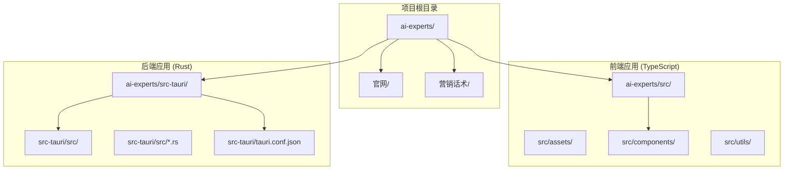
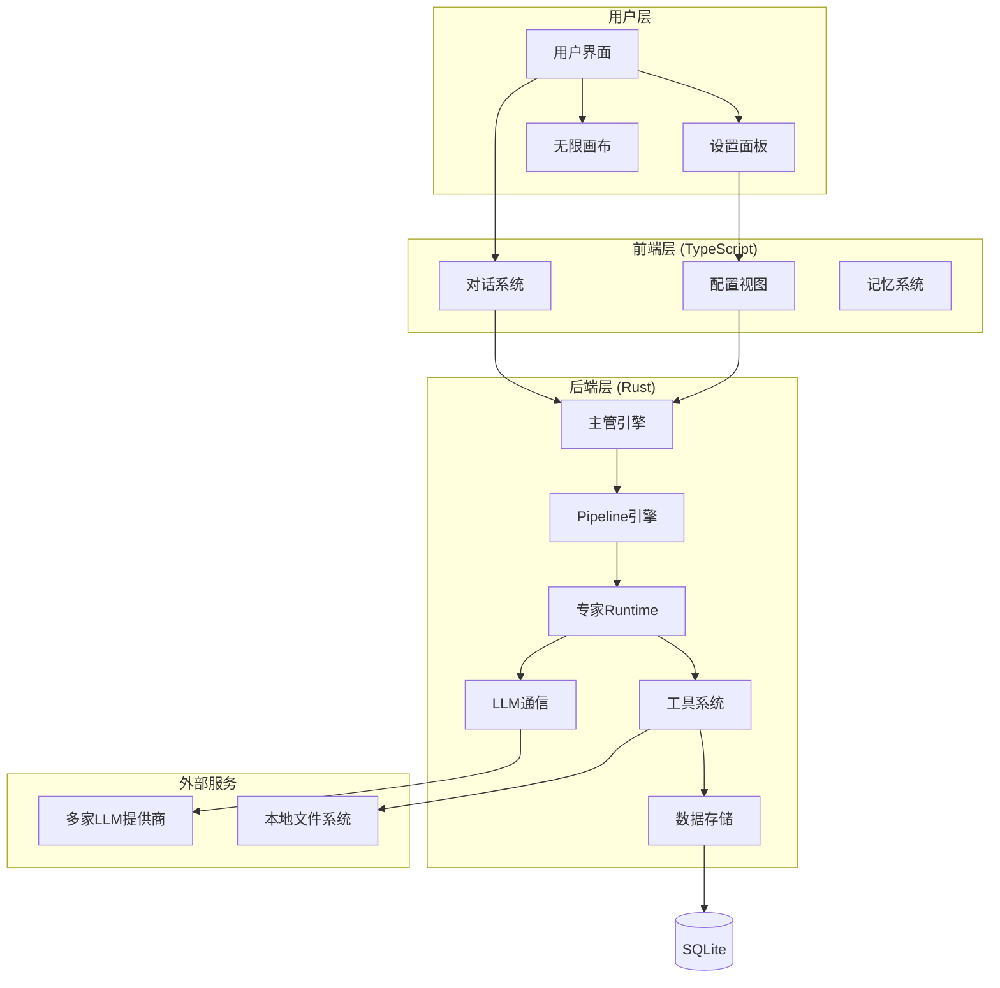
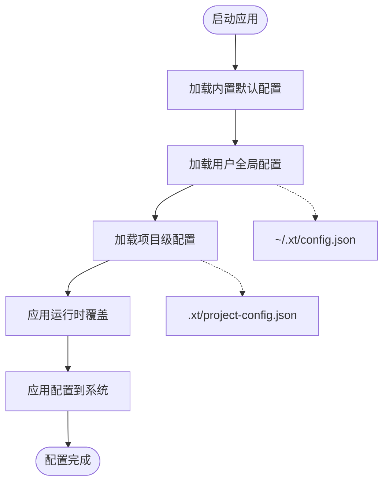
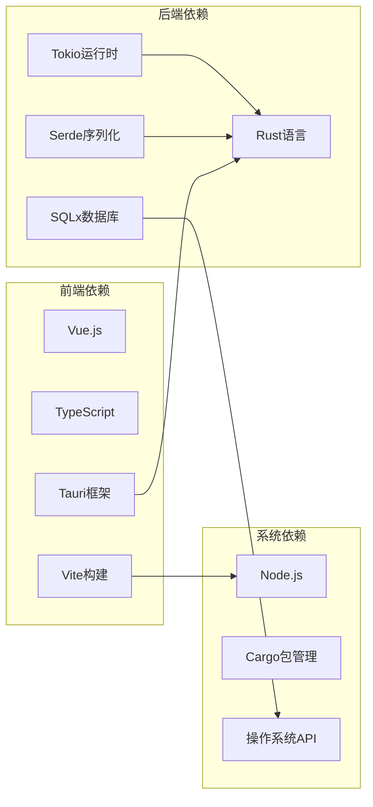

# 快速开始指南

<cite>
**本文引用的文件**
- [README.md](file://ai-experts/README.md)
- [package.json](file://ai-experts/package.json)
- [Cargo.toml](file://ai-experts/src-tauri/Cargo.toml)
- [tauri.conf.json](file://ai-experts/src-tauri/tauri.conf.json)
- [main.ts](file://ai-experts/src/main.ts)
- [config-cascade.ts](file://ai-experts/src/config-cascade.ts)
- [main.rs](file://ai-experts/src-tauri/src/main.rs)
- [lib.rs](file://ai-experts/src-tauri/src/lib.rs)
- [build.rs](file://ai-experts/src-tauri/build.rs)
</cite>

## 目录
1. [简介](#简介)
2. [项目结构](#项目结构)
3. [核心组件](#核心组件)
4. [架构概览](#架构概览)
5. [详细组件分析](#详细组件分析)
6. [依赖分析](#依赖分析)
7. [性能考虑](#性能考虑)
8. [故障排除指南](#故障排除指南)
9. [结论](#结论)
10. [附录](#附录)

## 简介
星图专家团工作台是一个本地运行的AI万能工作台，融合了「AI专家团协作 + 无限可视化画布 + 智能仓库Wiki」三大能力。它采用Tauri + Rust + TypeScript的技术栈，提供纯本地化的解决方案，支持多模态对话、专家流水线调度、词元配额管控等高级特性。

## 项目结构
项目采用前后端分离的架构设计，主要包含以下核心目录：



**图表来源**
- [package.json:1-28](file://ai-experts/package.json#L1-L28)
- [Cargo.toml:1-46](file://ai-experts/src-tauri/Cargo.toml#L1-L46)
- [tauri.conf.json:1-38](file://ai-experts/src-tauri/tauri.conf.json#L1-L38)

**章节来源**
- [package.json:1-28](file://ai-experts/package.json#L1-L28)
- [Cargo.toml:1-46](file://ai-experts/src-tauri/Cargo.toml#L1-L46)
- [tauri.conf.json:1-38](file://ai-experts/src-tauri/tauri.conf.json#L1-L38)

## 核心组件
项目的核心组件包括前端界面、后端引擎、配置管理系统和工具系统。

### 前端核心组件
- **无限画布引擎**: 基于SVG的可视化画布，支持缩放、拖拽和视口变换
- **对话系统**: 支持多模态输入和执行模式切换
- **设置面板**: 密钥池管理、专家配置和主题切换
- **配置管理**: 层叠配置系统，支持全局和项目级配置

### 后端核心组件
- **主管引擎**: 调度分析、跟进分析、中途检查和最终审核
- **Pipeline引擎**: 布局计算、round/followup规划和session runtime
- **专家Runtime**: 会话启动、上下文装配、工具轮次和收尾
- **工具系统**: 统一的8个内置工具和权限映射

**章节来源**
- [main.ts:1-8673](file://ai-experts/src/main.ts#L1-L8673)
- [config-cascade.ts:1-239](file://ai-experts/src/config-cascade.ts#L1-L239)
- [lib.rs:1-800](file://ai-experts/src-tauri/src/lib.rs#L1-L800)

## 架构概览
系统采用前后端分离的双栈架构，前端负责用户交互和展示，后端负责业务逻辑和数据处理。



**图表来源**
- [README.md:214-327](file://ai-experts/README.md#L214-L327)
- [lib.rs:1-800](file://ai-experts/src-tauri/src/lib.rs#L1-L800)

## 详细组件分析

### 安装与环境配置

#### 系统要求
- **Node.js**: 版本18及以上
- **Rust**: 最新稳定版本
- **操作系统**: Windows、macOS、Linux均支持

#### 依赖安装步骤
1. **克隆项目**
```bash
git clone <repository-url>
cd 星图专家团工作台（社区版）
```

2. **安装Node.js依赖**
```bash
cd ai-experts
npm install
```

3. **安装Rust工具链**
```bash
# 使用rustup安装
curl --proto '=https' --tlsv1.2 -sSf https://sh.rustup.rs | sh
source "$HOME/.cargo/env"
```

4. **验证安装**
```bash
node --version
npm --version
rustc --version
```

**章节来源**
- [README.md:361-402](file://ai-experts/README.md#L361-L402)
- [package.json:15-26](file://ai-experts/package.json#L15-L26)
- [Cargo.toml:20-46](file://ai-experts/src-tauri/Cargo.toml#L20-L46)

### 开发环境配置

#### 环境变量设置
项目使用层叠配置系统，支持多层级配置管理：



**图表来源**
- [config-cascade.ts:63-137](file://ai-experts/src/config-cascade.ts#L63-L137)

#### API密钥配置
支持多种类型的API密钥配置：

1. **预设提供商密钥**
   - DeepSeek、OpenAI、Anthropic、阿里云、腾讯云
   - 自动填充默认模型和模态能力

2. **中转密钥**
   - 支持自定义终端点和模型
   - 灵活的模态能力配置

3. **自定义代码密钥**
   - 支持自定义认证逻辑
   - 高度灵活的集成方式

**章节来源**
- [main.ts:501-606](file://ai-experts/src/main.ts#L501-L606)
- [main.ts:765-790](file://ai-experts/src/main.ts#L765-L790)

### 首次启动指南

#### 创建第一个项目
1. **启动开发服务器**
```bash
cd ai-experts
npm run tauri dev
```

2. **创建新项目**
   - 点击菜单栏的"新建项目"
   - 选择项目根目录
   - 配置项目基本信息

3. **配置专家团队**
   - 进入设置面板
   - 添加API密钥
   - 配置专家角色权限

#### 基础功能测试
1. **AI对话测试**
   - 在聊天框输入测试消息
   - 选择执行模式（普通/按计划/按目标）
   - 上传测试文件进行多模态测试

2. **画布功能测试**
   - 拖拽文件到画布进行分析
   - 使用草稿工具绘制思维导图
   - 查看专家协作进度

**章节来源**
- [main.ts:214-258](file://ai-experts/src/main.ts#L214-L258)
- [main.ts:378-431](file://ai-experts/src/main.ts#L378-L431)

## 依赖分析

### 技术栈依赖关系



**图表来源**
- [package.json:15-26](file://ai-experts/package.json#L15-L26)
- [Cargo.toml:20-46](file://ai-experts/src-tauri/Cargo.toml#L20-L46)

### 关键依赖说明

#### 前端关键依赖
- **@tauri-apps/api**: Tauri原生API调用
- **@tauri-apps/cli**: Tauri命令行工具
- **typescript**: 类型安全的开发体验
- **vite**: 快速的构建工具

#### 后端关键依赖
- **tauri**: 跨平台桌面应用框架
- **tokio**: 异步运行时
- **sqlx**: 类型安全的数据库查询
- **serde**: 高效的数据序列化

**章节来源**
- [package.json:15-26](file://ai-experts/package.json#L15-L26)
- [Cargo.toml:20-46](file://ai-experts/src-tauri/Cargo.toml#L20-L46)

## 性能考虑
项目在性能方面采用了多项优化策略：

### 前端性能优化
- **懒加载组件**: 按需加载画布和工具组件
- **虚拟滚动**: 处理大量历史消息的高效渲染
- **内存管理**: 及时清理未使用的画布元素

### 后端性能优化
- **异步处理**: 使用Tokio实现非阻塞I/O
- **连接池**: 数据库连接复用
- **缓存机制**: 专家结果和上下文缓存

## 故障排除指南

### 常见安装问题

#### Node.js相关问题
**问题**: npm install失败
**解决方案**:
1. 清理npm缓存
```bash
npm cache clean --force
```
2. 删除node_modules重新安装
```bash
rm -rf node_modules
npm install
```

#### Rust相关问题
**问题**: cargo build失败
**解决方案**:
1. 更新Rust工具链
```bash
rustup update
```
2. 清理构建缓存
```bash
cargo clean
cargo build
```

### 运行时问题

#### 应用启动失败
**问题**: Tauri应用无法启动
**排查步骤**:
1. 检查前端构建状态
```bash
npm run build
```
2. 验证Tauri配置
```bash
npm run tauri info
```

#### API密钥问题
**问题**: 专家调用失败
**排查步骤**:
1. 检查密钥池配置
2. 验证模型可用性
3. 查看网络连接状态

**章节来源**
- [README.md:361-402](file://ai-experts/README.md#L361-L402)
- [main.ts:608-617](file://ai-experts/src/main.ts#L608-L617)

## 结论
星图专家团工作台提供了完整的本地AI工作台解决方案，具有以下优势：

1. **纯本地化**: 所有数据和处理都在本地进行，确保隐私安全
2. **多模态支持**: 支持文本、图片、文件等多种输入形式
3. **专家协作**: 通过主管-专家双层架构实现高效的AI团队协作
4. **可视化设计**: 无限画布和草稿功能提升创意表达效率
5. **开源生态**: MIT/GPL双重许可，适合个人和企业使用

## 附录

### 快速参考命令

#### 开发相关
```bash
# 启动开发服务器
npm run tauri dev

# 构建生产版本
npm run tauri build

# 运行前端预览
npm run preview

# 执行CLI测试
npm run cli:test
```

#### 项目管理
```bash
# 安装依赖
npm install

# 清理构建缓存
npm run restore:test-baseline

# 提示模块检查
npm run prompt:check
```

### 支持的LLM提供商
- **DeepSeek**: deepseek-chat, deepseek-coder
- **OpenAI**: gpt-4o, gpt-4o-mini, gpt-3.5-turbo
- **Anthropic**: claude-3-5-sonnet, claude-3-opus
- **阿里云**: qwen-max, qwen-plus, qwen-turbo
- **腾讯云**: hunyuan-pro, hunyuan-standard, hunyuan-lite

### 系统要求对照表

| 组件 | 最低要求 | 推荐配置 |
|------|----------|----------|
| CPU | Intel i5/AMD Ryzen 5 | Intel i7/AMD Ryzen 7 |
| 内存 | 8GB | 16GB |
| 存储 | 50GB可用空间 | 100GB+ |
| 网络 | 稳定互联网连接 | 有线连接 |