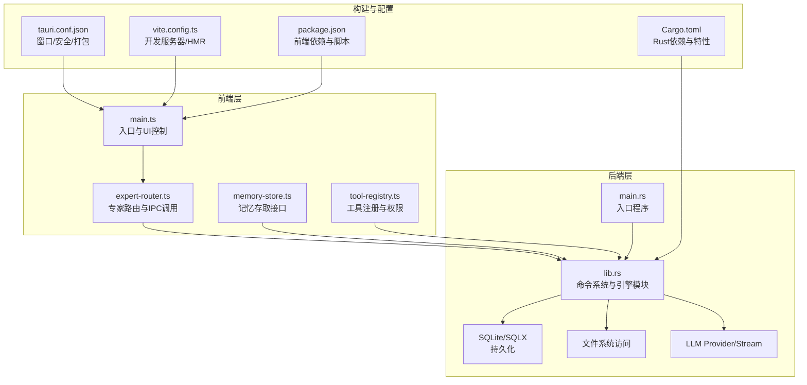
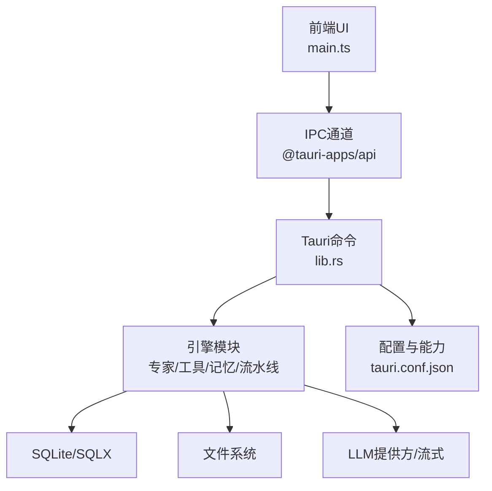
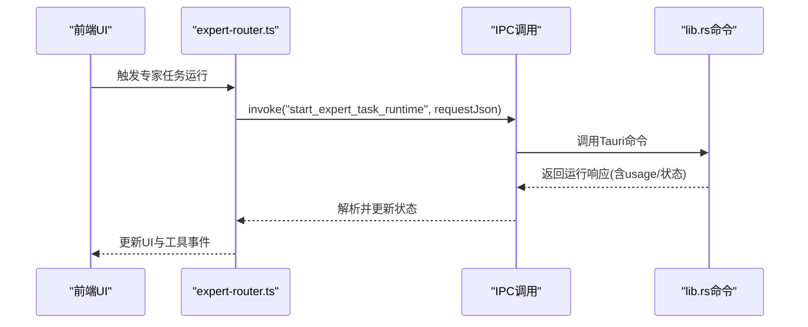
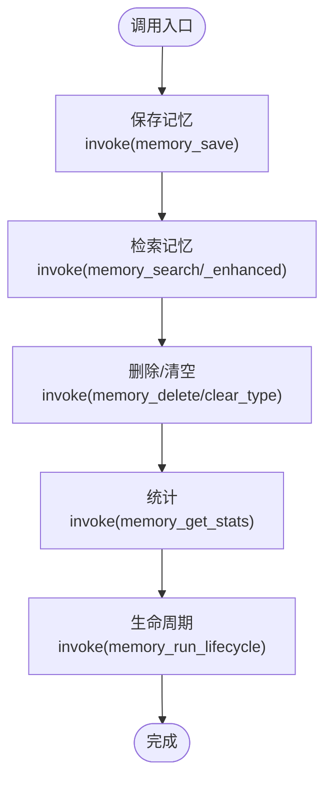
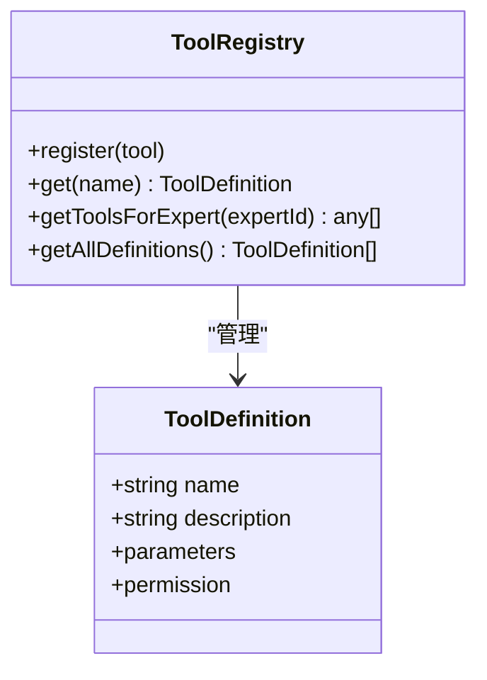
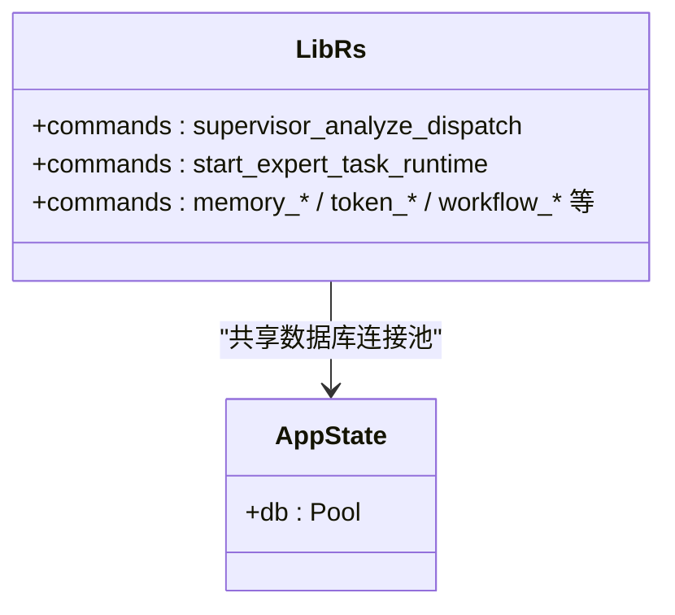
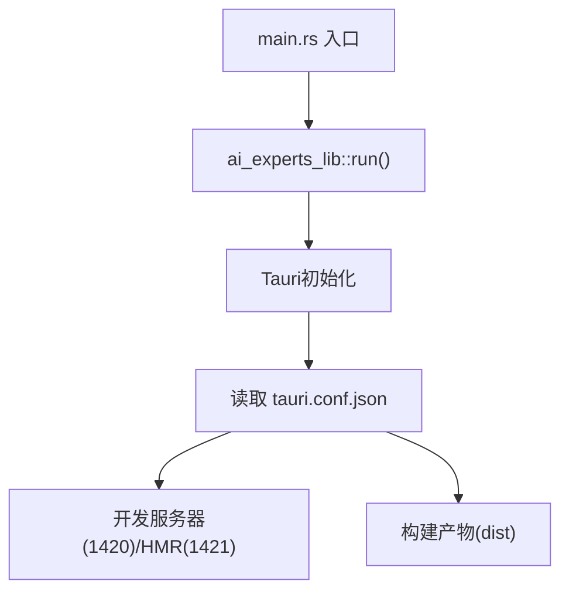
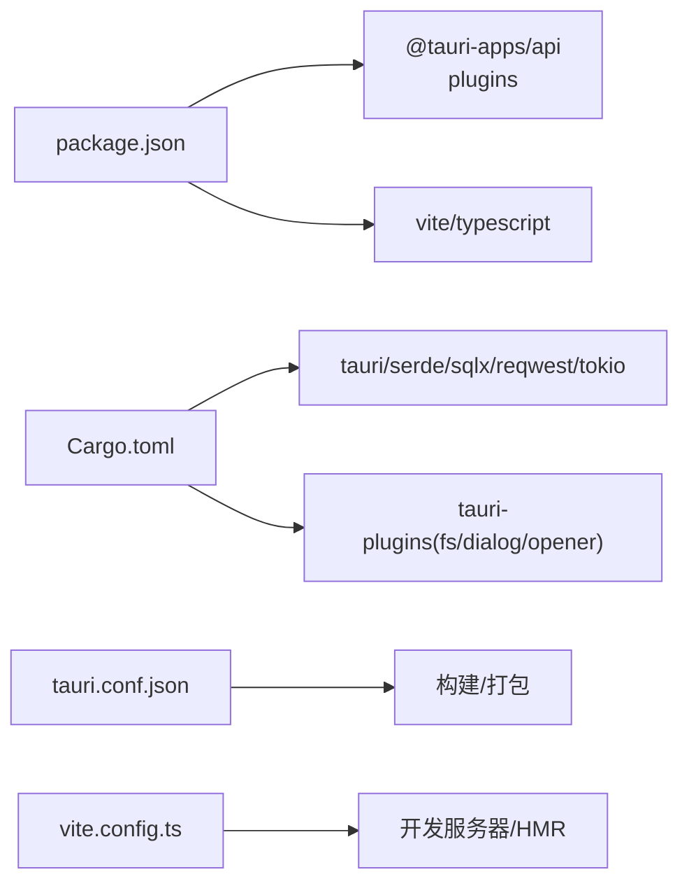

# 技术架构概览

<cite>
**本文档引用的文件**
- [Cargo.toml](file://ai-experts/src-tauri/Cargo.toml)
- [package.json](file://ai-experts/package.json)
- [vite.config.ts](file://ai-experts/vite.config.ts)
- [tauri.conf.json](file://ai-experts/src-tauri/tauri.conf.json)
- [main.rs](file://ai-experts/src-tauri/src/main.rs)
- [lib.rs](file://ai-experts/src-tauri/src/lib.rs)
- [main.ts](file://ai-experts/src/main.ts)
- [expert-router.ts](file://ai-experts/src/expert-router.ts)
- [memory-store.ts](file://ai-experts/src/memory-store.ts)
- [tool-registry.ts](file://ai-experts/src/tool-registry.ts)
</cite>

## 目录
1. [简介](#简介)
2. [项目结构](#项目结构)
3. [核心组件](#核心组件)
4. [架构总览](#架构总览)
5. [详细组件分析](#详细组件分析)
6. [依赖关系分析](#依赖关系分析)
7. [性能考量](#性能考量)
8. [故障排查指南](#故障排查指南)
9. [结论](#结论)

## 简介
本项目为“星图专家团工作台（社区版）”，采用 Tauri 框架构建跨平台桌面应用，前端使用 TypeScript/JavaScript 与 Vite 开发，后端以 Rust 实现高性能引擎。系统通过 IPC（进程间通信）机制实现前端与后端的紧密协作，围绕专家系统、工具系统、记忆存储、项目管理、协作引擎等模块形成模块化的混合架构。

## 项目结构
项目采用“前端 + 后端引擎”的分层组织方式：
- 前端层（ai-experts/src）：负责用户界面、交互逻辑、专家路由、记忆与工具接口等。
- 后端层（ai-experts/src-tauri）：负责命令系统、数据库、文件系统、LLM 对接、流水线与协作引擎等。
- 构建与打包（ai-experts/src-tauri/tauri.conf.json）：定义窗口、安全策略、资源图标、开发/构建流程等。
- 开发工具链（package.json、vite.config.ts、Cargo.toml）：前端脚手架与 Rust 依赖管理。

图表来源
- [main.ts:1-258](file://ai-experts/src/main.ts#L1-L258)
- [expert-router.ts:1-800](file://ai-experts/src/expert-router.ts#L1-L800)
- [memory-store.ts:1-337](file://ai-experts/src/memory-store.ts#L1-L337)
- [tool-registry.ts:1-192](file://ai-experts/src/tool-registry.ts#L1-L192)
- [main.rs:1-6](file://ai-experts/src-tauri/src/main.rs#L1-L6)
- [lib.rs:1-52](file://ai-experts/src-tauri/src/lib.rs#L1-L52)
- [tauri.conf.json:1-38](file://ai-experts/src-tauri/tauri.conf.json#L1-L38)
- [vite.config.ts:1-31](file://ai-experts/vite.config.ts#L1-L31)
- [package.json:1-28](file://ai-experts/package.json#L1-L28)
- [Cargo.toml:1-46](file://ai-experts/src-tauri/Cargo.toml#L1-L46)

章节来源
- [tauri.conf.json:1-38](file://ai-experts/src-tauri/tauri.conf.json#L1-L38)
- [vite.config.ts:1-31](file://ai-experts/vite.config.ts#L1-L31)
- [package.json:1-28](file://ai-experts/package.json#L1-L28)
- [Cargo.toml:1-46](file://ai-experts/src-tauri/Cargo.toml#L1-L46)

## 核心组件
- 前端入口与窗口控制：负责窗口最小化/最大化/关闭、拖拽、主题切换、设置页等基础 UI 行为。
- 专家路由与IPC：封装专家系统调用、令牌配额、流水线推进、工具事件等前后端交互。
- 记忆存储：提供记忆的增删查、生命周期管理、Token 预算感知检索等能力。
- 工具注册：定义工具 Schema、权限控制、专家工具映射，支撑专家执行 Shell/文件/搜索等操作。
- 后端命令系统：暴露大量 Tauri 命令，涵盖工作区校验、专家任务运行、流水线推进、记忆与令牌管理等。

章节来源
- [main.ts:1-258](file://ai-experts/src/main.ts#L1-L258)
- [expert-router.ts:1-800](file://ai-experts/src/expert-router.ts#L1-L800)
- [memory-store.ts:1-337](file://ai-experts/src/memory-store.ts#L1-L337)
- [tool-registry.ts:1-192](file://ai-experts/src/tool-registry.ts#L1-L192)
- [lib.rs:707-800](file://ai-experts/src-tauri/src/lib.rs#L707-L800)

## 架构总览
系统采用“前端 Web 技术 + Rust 后端引擎”的混合架构，通过 Tauri 的 IPC 通道实现强隔离的安全边界与高性能的数据交换。前端负责用户交互与可视化，后端负责复杂业务逻辑、数据持久化与系统级能力。

图表来源
- [main.ts:1-258](file://ai-experts/src/main.ts#L1-L258)
- [expert-router.ts:505-558](file://ai-experts/src/expert-router.ts#L505-L558)
- [lib.rs:707-800](file://ai-experts/src-tauri/src/lib.rs#L707-L800)
- [tauri.conf.json:1-38](file://ai-experts/src-tauri/tauri.conf.json#L1-L38)

## 详细组件分析

### 前端组件：专家路由与IPC
- 专家任务运行：封装 start/continue 专家任务运行，携带令牌上下文与密钥信息，返回专家后处理状态与工具事件。
- 流水线推进：提供构建进度快照、当前轮次计划、跟进任务计划、回合结算等接口。
- 令牌配额：维护项目级与用户级 Token 数据，支持持久化与仪表盘快照生成。

图表来源
- [expert-router.ts:505-558](file://ai-experts/src/expert-router.ts#L505-L558)
- [lib.rs:732-788](file://ai-experts/src-tauri/src/lib.rs#L732-L788)

章节来源
- [expert-router.ts:505-800](file://ai-experts/src/expert-router.ts#L505-L800)

### 前端组件：记忆存储
- 提供记忆的保存、检索、删除、清空、统计与生命周期管理。
- 支持 Token 预算感知检索，自动根据剩余预算截断结果，保证上下文长度可控。

图表来源
- [memory-store.ts:40-100](file://ai-experts/src/memory-store.ts#L40-L100)
- [memory-store.ts:310-335](file://ai-experts/src/memory-store.ts#L310-L335)

章节来源
- [memory-store.ts:1-337](file://ai-experts/src/memory-store.ts#L1-L337)

### 前端组件：工具注册与权限
- 定义工具 Schema（shell_exec、file_*、web_search、memory_query、index_search 等），并按专家角色映射权限。
- 提供 OpenAI Function Calling 格式的工具注入，支持自动/确认/阻断三种授权模式。

图表来源
- [tool-registry.ts:20-192](file://ai-experts/src/tool-registry.ts#L20-L192)

章节来源
- [tool-registry.ts:1-192](file://ai-experts/src/tool-registry.ts#L1-L192)

### 后端组件：命令系统与引擎
- 命令系统：暴露大量 Tauri 命令，如 supervisor 分析调度、专家任务运行、流水线推进、记忆与令牌管理、工作区校验等。
- 引擎模块：包含专家上下文、专家运行时、专家工具、流水线、协作、令牌运行时、提示模块等子模块，通过 lib.rs 统一导出。

图表来源
- [lib.rs:54-57](file://ai-experts/src-tauri/src/lib.rs#L54-L57)
- [lib.rs:707-800](file://ai-experts/src-tauri/src/lib.rs#L707-L800)

章节来源
- [lib.rs:1-52](file://ai-experts/src-tauri/src/lib.rs#L1-L52)
- [lib.rs:707-800](file://ai-experts/src-tauri/src/lib.rs#L707-L800)

### 后端组件：入口与配置
- main.rs：Windows 子系统入口，调用 ai_experts_lib::run。
- tauri.conf.json：定义产品名称、窗口尺寸、开发/构建流程、安全策略（CSP）、打包图标等。

图表来源
- [main.rs:1-6](file://ai-experts/src-tauri/src/main.rs#L1-L6)
- [tauri.conf.json:6-11](file://ai-experts/src-tauri/tauri.conf.json#L6-L11)
- [vite.config.ts:14-24](file://ai-experts/vite.config.ts#L14-L24)

章节来源
- [main.rs:1-6](file://ai-experts/src-tauri/src/main.rs#L1-L6)
- [tauri.conf.json:1-38](file://ai-experts/src-tauri/tauri.conf.json#L1-L38)
- [vite.config.ts:1-31](file://ai-experts/vite.config.ts#L1-L31)

## 依赖关系分析
- 前端依赖：@tauri-apps/api、@tauri-apps/plugins（dialog/opener）、highlight.js。
- 后端依赖：tauri、serde、serde_json、sqlx（SQLite）、reqwest、tokio、futures-util、uuid、dirs、scraper、calamine/docx-rs/lopdf/csv 等。
- 构建依赖：tauri-build、vite、typescript。

图表来源
- [package.json:15-26](file://ai-experts/package.json#L15-L26)
- [Cargo.toml:20-46](file://ai-experts/src-tauri/Cargo.toml#L20-L46)
- [tauri.conf.json:6-11](file://ai-experts/src-tauri/tauri.conf.json#L6-L11)
- [vite.config.ts:14-24](file://ai-experts/vite.config.ts#L14-L24)

章节来源
- [package.json:1-28](file://ai-experts/package.json#L1-L28)
- [Cargo.toml:1-46](file://ai-experts/src-tauri/Cargo.toml#L1-L46)

## 性能考量
- 前端性能：Vite 提供快速热更新与生产构建优化；HMR 仅在开发环境启用，避免影响 Rust 错误输出。
- 后端性能：Tokio 异步运行时、SQLX 连接池、Rust 高效内存与并发模型，适合 CPU/IO 密集型任务。
- IPC 效率：Tauri 命令调用采用序列化参数与返回值，减少不必要的跨进程拷贝；建议批量请求与合并响应以降低往返次数。
- 记忆检索：Token 预算感知检索可有效控制上下文长度，避免超出模型限制导致的失败与重试。

## 故障排查指南
- 开发环境无法启动：检查 tauri.conf.json 中 devUrl 与 vite.config.ts 中固定端口（1420/1421）是否被占用。
- IPC 调用失败：确认命令名称与参数结构与后端声明一致；查看前端 invoke 调用与后端 #[tauri::command] 映射。
- 记忆检索异常：检查 projectName 与查询参数；若增强检索失败，回退到普通检索。
- 权限问题：工具权限分为 auto/confirm/block，确保专家工具映射与授权模式匹配。

章节来源
- [tauri.conf.json:6-11](file://ai-experts/src-tauri/tauri.conf.json#L6-L11)
- [vite.config.ts:14-24](file://ai-experts/vite.config.ts#L14-L24)
- [memory-store.ts:310-335](file://ai-experts/src/memory-store.ts#L310-L335)
- [tool-registry.ts:155-174](file://ai-experts/src/tool-registry.ts#L155-L174)

## 结论
本项目通过 Tauri 将前端 Web 技术与 Rust 后端引擎有机结合，既保证了跨平台桌面应用的原生体验，又充分发挥了 Rust 在性能与安全性方面的优势。模块化设计使专家系统、工具系统、记忆存储、项目管理与协作引擎各司其职、耦合度低，便于扩展与维护。建议在后续迭代中持续完善 IPC 接口契约、增强日志与监控体系，并探索更细粒度的权限与能力控制。