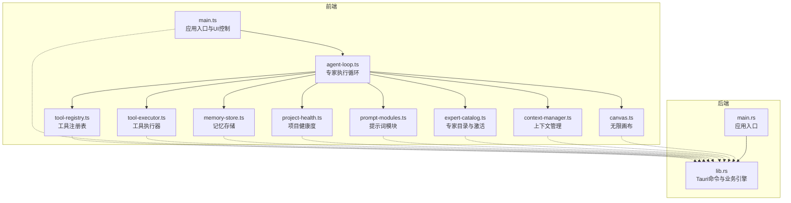
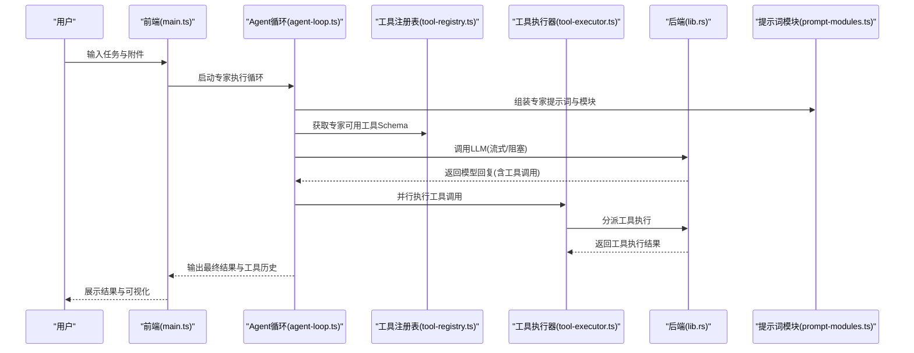
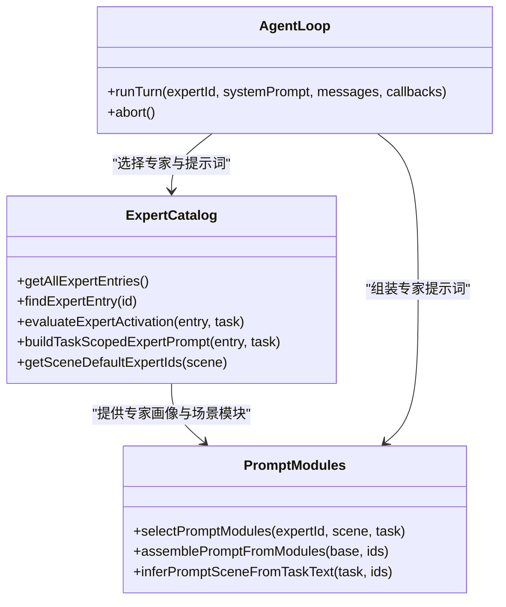
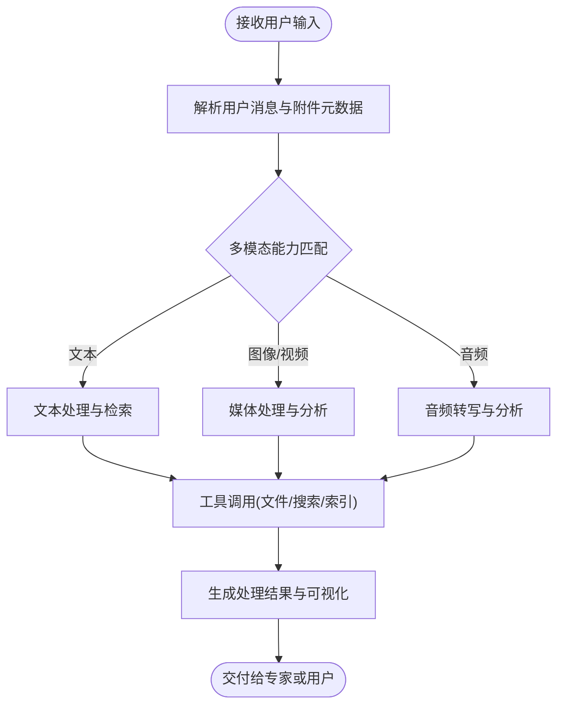
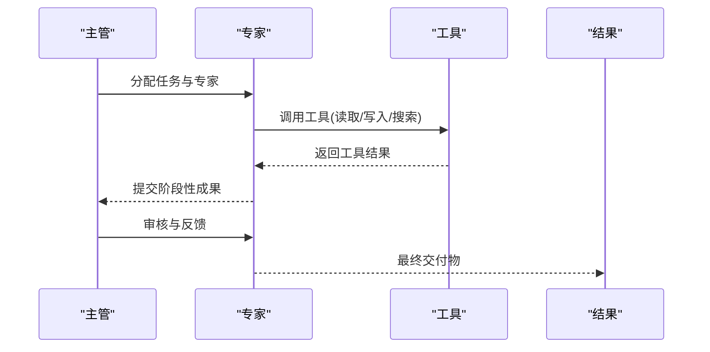
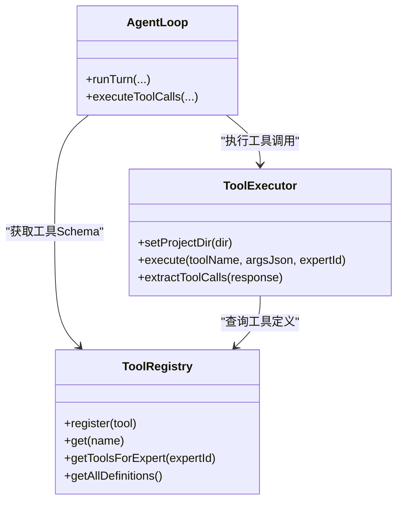
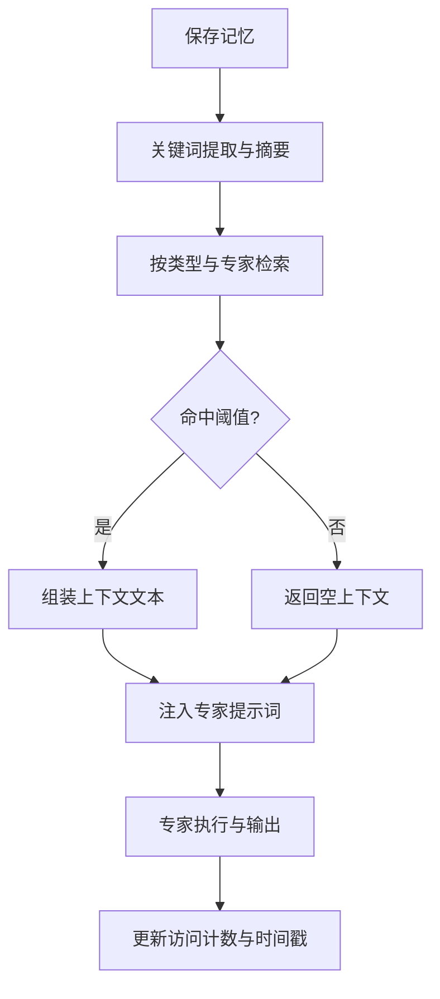
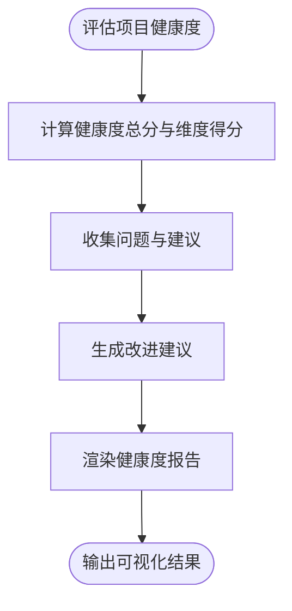
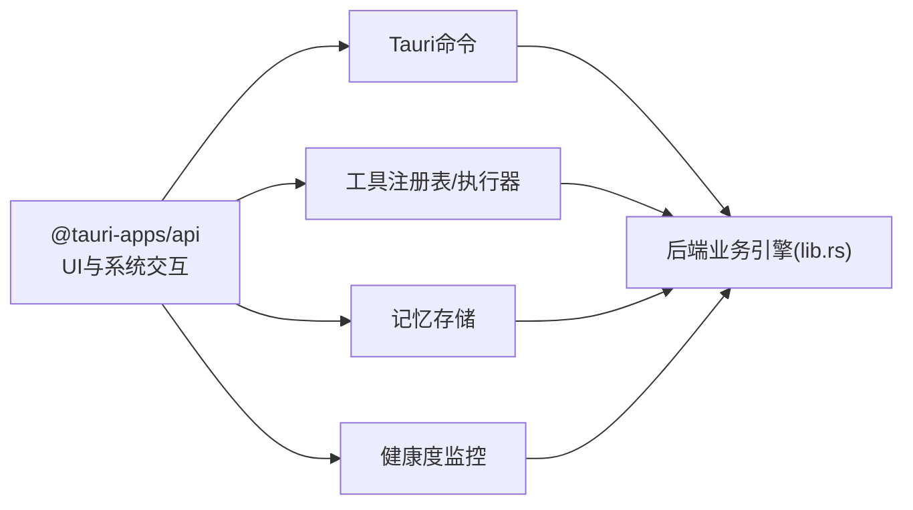

# 核心功能总览

<cite>
**本文档引用的文件**
- [main.ts](file://ai-experts/src/main.ts)
- [agent-loop.ts](file://ai-experts/src/agent-loop.ts)
- [memory-store.ts](file://ai-experts/src/memory-store.ts)
- [tool-registry.ts](file://ai-experts/src/tool-registry.ts)
- [project-health.ts](file://ai-experts/src/project-health.ts)
- [expert-catalog.ts](file://ai-experts/src/expert-catalog.ts)
- [context-manager.ts](file://ai-experts/src/context-manager.ts)
- [tool-executor.ts](file://ai-experts/src/tool-executor.ts)
- [canvas.ts](file://ai-experts/src/canvas.ts)
- [prompt-modules.ts](file://ai-experts/src/prompt-modules.ts)
- [lib.rs](file://ai-experts/src-tauri/src/lib.rs)
- [main.rs](file://ai-experts/src-tauri/src/main.rs)
- [package.json](file://ai-experts/package.json)
</cite>

## 目录
1. [简介](#简介)
2. [项目结构](#项目结构)
3. [核心组件](#核心组件)
4. [架构总览](#架构总览)
5. [详细组件分析](#详细组件分析)
6. [依赖关系分析](#依赖关系分析)
7. [性能考量](#性能考量)
8. [故障排除指南](#故障排除指南)
9. [结论](#结论)
10. [附录](#附录)

## 简介
星图专家团工作台是一个面向复杂项目协作与智能执行的桌面应用，融合了多模态专家系统、可扩展工具系统、三级记忆存储、项目健康监控与可视化画布等能力。系统通过“主管-专家-工具”的分层协作机制，实现从任务理解、专家调度、工具执行到交付复核的全链路自动化与半自动化工作流。本文档旨在帮助不同角色（决策者、开发者、最终用户）快速建立对系统功能的整体认知，并理解各模块间的协作关系与数据流转。

## 项目结构
项目采用前端 TypeScript + Tauri 后端的混合架构：
- 前端（ai-experts/src）：负责用户界面、交互逻辑、专家调度、工具注册与执行、上下文管理、记忆管理、画布渲染等。
- 后端（ai-experts/src-tauri/src）：通过 Tauri 命令桥接前后端，提供 LLM 调用、工具执行、内存与健康度计算、令牌用量统计、工作流编排等能力。
- 构建与脚本：Vite + TypeScript，支持开发、构建与提示词校验。

**图表来源**
- [main.ts:1-800](file://ai-experts/src/main.ts#L1-L800)
- [agent-loop.ts:1-404](file://ai-experts/src/agent-loop.ts#L1-L404)
- [tool-registry.ts:1-192](file://ai-experts/src/tool-registry.ts#L1-L192)
- [tool-executor.ts:1-231](file://ai-experts/src/tool-executor.ts#L1-L231)
- [memory-store.ts:1-337](file://ai-experts/src/memory-store.ts#L1-L337)
- [context-manager.ts:1-276](file://ai-experts/src/context-manager.ts#L1-L276)
- [canvas.ts:1-664](file://ai-experts/src/canvas.ts#L1-L664)
- [prompt-modules.ts:1-775](file://ai-experts/src/prompt-modules.ts#L1-L775)
- [expert-catalog.ts:1-657](file://ai-experts/src/expert-catalog.ts#L1-L657)
- [project-health.ts:1-220](file://ai-experts/src/project-health.ts#L1-L220)
- [lib.rs:1-800](file://ai-experts/src-tauri/src/lib.rs#L1-L800)
- [main.rs:1-6](file://ai-experts/src-tauri/src/main.rs#L1-L6)

**章节来源**
- [package.json:1-28](file://ai-experts/package.json#L1-L28)

## 核心组件
- 智能专家系统：基于专家目录与激活机制，结合任务场景与关键词匹配，智能选择与调度专家，支持职责触发概率与方法论引导。
- 多模态数据处理：支持文本、图像、视频、音频等多种输入，结合工具执行与画布渲染，实现从数据到产物的全流程处理。
- 协作工作流：通过主管分析、专家执行、工具调用、交付复核的分层协作，形成可追踪、可审计的工作流闭环。
- 可扩展工具系统：统一的工具注册表与执行器，支持新增工具与权限控制，确保执行安全与可追溯。
- 三级记忆存储：Ephemeral/Working/Longterm 三层记忆，支持关键词提取、检索与生命周期管理，提升上下文复用与决策质量。
- 项目健康监控：提供健康度评分、维度分析、问题清单与代码保留率评估，帮助团队持续改进项目质量。

**章节来源**
- [expert-catalog.ts:1-657](file://ai-experts/src/expert-catalog.ts#L1-L657)
- [agent-loop.ts:1-404](file://ai-experts/src/agent-loop.ts#L1-L404)
- [tool-registry.ts:1-192](file://ai-experts/src/tool-registry.ts#L1-L192)
- [tool-executor.ts:1-231](file://ai-experts/src/tool-executor.ts#L1-L231)
- [memory-store.ts:1-337](file://ai-experts/src/memory-store.ts#L1-L337)
- [project-health.ts:1-220](file://ai-experts/src/project-health.ts#L1-L220)

## 架构总览
系统采用“前端智能调度 + 后端能力执行”的分层架构。前端负责用户交互、专家调度、工具注册与执行、上下文压缩与记忆管理；后端通过 Tauri 命令桥接，提供 LLM 调用、工具执行、内存与健康度计算、令牌用量统计等能力。

**图表来源**
- [main.ts:1-800](file://ai-experts/src/main.ts#L1-L800)
- [agent-loop.ts:1-404](file://ai-experts/src/agent-loop.ts#L1-L404)
- [tool-registry.ts:1-192](file://ai-experts/src/tool-registry.ts#L1-L192)
- [tool-executor.ts:1-231](file://ai-experts/src/tool-executor.ts#L1-L231)
- [prompt-modules.ts:1-775](file://ai-experts/src/prompt-modules.ts#L1-L775)
- [lib.rs:707-800](file://ai-experts/src-tauri/src/lib.rs#L707-L800)

## 详细组件分析

### 智能专家系统
- 专家目录与激活：系统内置多学科专家，支持基于任务关键词与工具画像的职责触发概率评估，提供“高/中/低”触发等级与概率值，指导专家选择与权限分配。
- 方法论与提示词：每个专家拥有专属知识库、方法论与关注焦点，结合场景化提示词模块，确保输出结构化、可复核、便于后续协作压缩。
- 系统角色：包含主管与助手等系统角色，负责目标拆解、上下文压缩与系统级辅助分析。

**图表来源**
- [expert-catalog.ts:1-657](file://ai-experts/src/expert-catalog.ts#L1-L657)
- [prompt-modules.ts:1-775](file://ai-experts/src/prompt-modules.ts#L1-L775)
- [agent-loop.ts:1-404](file://ai-experts/src/agent-loop.ts#L1-L404)

**章节来源**
- [expert-catalog.ts:1-657](file://ai-experts/src/expert-catalog.ts#L1-L657)
- [prompt-modules.ts:1-775](file://ai-experts/src/prompt-modules.ts#L1-L775)

### 多模态数据处理
- 输入模态：系统支持文本、图像、视频、音频等多模态输入，结合专家能力与工具执行，实现从数据到产物的全流程处理。
- 附件处理：支持将附件元数据注入用户消息，指导专家在提示词中组合多模态上下文。
- 画布渲染：提供无限画布与文件预览画布，支持节点拖拽、缩放与布局，直观展示项目结构与文档关系。

**图表来源**
- [main.ts:608-757](file://ai-experts/src/main.ts#L608-L757)
- [canvas.ts:1-664](file://ai-experts/src/canvas.ts#L1-L664)

**章节来源**
- [main.ts:608-757](file://ai-experts/src/main.ts#L608-L757)
- [canvas.ts:1-664](file://ai-experts/src/canvas.ts#L1-L664)

### 协作工作流
- 主管分析：根据对话历史与可用专家，生成专家调度计划，支持任务拆解与阶段协调。
- 专家执行：每个专家在自己的职责范围内进行分析、判断与实现，工具调用遵循“最小动作格式”与“落盘硬约束”。
- 交付复核：系统支持交付物落盘硬约束与审核流程，确保输出可验证、可追溯。

**图表来源**
- [lib.rs:733-800](file://ai-experts/src-tauri/src/lib.rs#L733-L800)
- [agent-loop.ts:1-404](file://ai-experts/src/agent-loop.ts#L1-L404)
- [tool-executor.ts:1-231](file://ai-experts/src/tool-executor.ts#L1-L231)

**章节来源**
- [lib.rs:733-800](file://ai-experts/src-tauri/src/lib.rs#L733-L800)

### 可扩展工具系统
- 工具注册表：集中管理工具Schema与权限，支持按专家角色动态注入可用工具。
- 工具执行器：统一的工具执行入口，支持并行执行与错误结构化反馈，确保执行安全与可追溯。
- 审批与拦截：对危险或高风险命令进行拦截与审批，保障系统安全。

**图表来源**
- [tool-registry.ts:1-192](file://ai-experts/src/tool-registry.ts#L1-L192)
- [tool-executor.ts:1-231](file://ai-experts/src/tool-executor.ts#L1-L231)
- [agent-loop.ts:1-404](file://ai-experts/src/agent-loop.ts#L1-L404)

**章节来源**
- [tool-registry.ts:1-192](file://ai-experts/src/tool-registry.ts#L1-L192)
- [tool-executor.ts:1-231](file://ai-experts/src/tool-executor.ts#L1-L231)

### 三级记忆存储
- 记忆类型：Ephemeral（瞬时）、Working（工作）、Longterm（长期），分别用于用户意图、专家输出与历史经验。
- 检索与压缩：支持关键词提取、检索与Token感知的检索，结合上下文压缩策略，提升检索效率与准确性。
- 生命周期：提供记忆生命周期管理与统计，支持清理与统计分析。

**图表来源**
- [memory-store.ts:1-337](file://ai-experts/src/memory-store.ts#L1-L337)
- [context-manager.ts:1-276](file://ai-experts/src/context-manager.ts#L1-L276)

**章节来源**
- [memory-store.ts:1-337](file://ai-experts/src/memory-store.ts#L1-L337)
- [context-manager.ts:1-276](file://ai-experts/src/context-manager.ts#L1-L276)

### 项目健康监控
- 健康度评分：从多个维度评估项目健康状况，提供总分与明细，支持问题清单与改进建议。
- 代码保留率：评估代码片段的保留情况，分析专家贡献与留存率，帮助团队持续改进。
- 报告渲染：提供HTML渲染能力，支持可视化展示与导出。

**图表来源**
- [project-health.ts:1-220](file://ai-experts/src/project-health.ts#L1-L220)

**章节来源**
- [project-health.ts:1-220](file://ai-experts/src/project-health.ts#L1-L220)

## 依赖关系分析
- 前端依赖：@tauri-apps/api、@tauri-apps/cli、highlight.js、typescript、vite 等，支持桌面应用开发与构建。
- 前后端桥接：通过 Tauri 命令（如 supervisor_analyze_dispatch、llm_call_streaming、dispatch_tool 等）实现前后端通信。
- 工具与权限：工具注册表与执行器共同确保工具调用的安全与可追溯，结合审批与拦截机制。

**图表来源**
- [package.json:15-26](file://ai-experts/package.json#L15-L26)
- [lib.rs:707-800](file://ai-experts/src-tauri/src/lib.rs#L707-L800)

**章节来源**
- [package.json:1-28](file://ai-experts/package.json#L1-L28)
- [lib.rs:707-800](file://ai-experts/src-tauri/src/lib.rs#L707-L800)

## 性能考量
- 上下文压缩：通过对话轮次分割、工具输出截断与摘要生成，降低Token占用，提升大模型推理效率。
- Token预算：提供Token预算与保留比例配置，结合自动压缩策略，避免超预算导致的中断。
- 工具并行：Agent循环支持并行执行多个工具调用，缩短整体执行时间。
- 缓存与检索：记忆检索支持Token感知与限制，减少无效检索带来的性能损耗。

[本节为通用指导，无需特定文件引用]

## 故障排除指南
- 工具执行失败：工具执行器会将后端返回的结构化错误信息反馈给模型，指导专家修正补丁或参数。
- 死循环检测：Agent循环检测连续相同工具调用，注入提示终止循环，避免资源浪费。
- 审批与拦截：对危险命令进行拦截与审批，防止误操作；若被拦截，需根据提示修正或联系管理员。
- 记忆检索异常：提供增强检索与降级回退机制，确保在异常情况下仍能返回合理结果。

**章节来源**
- [tool-executor.ts:1-231](file://ai-experts/src/tool-executor.ts#L1-L231)
- [agent-loop.ts:1-404](file://ai-experts/src/agent-loop.ts#L1-L404)
- [memory-store.ts:310-335](file://ai-experts/src/memory-store.ts#L310-L335)

## 结论
星图专家团工作台通过“智能专家 + 可扩展工具 + 三级记忆 + 健康监控”的综合能力，构建了面向复杂项目协作的智能化工作台。系统在专家激活机制、工具扩展能力、记忆管理与工作流编排等方面具有显著优势，能够满足不同角色用户的多样化需求，并为持续改进与规模化应用奠定坚实基础。

## 附录
- 使用场景建议
  - 决策者：关注项目健康度与专家协作快照，基于健康度报告制定改进策略。
  - 开发者：利用工具注册表与执行器进行安全高效的代码修改与验证，遵循交付物落盘硬约束。
  - 最终用户：通过多模态输入与画布可视化，直观表达需求并跟踪项目进展。

[本节为概念性内容，无需特定文件引用]