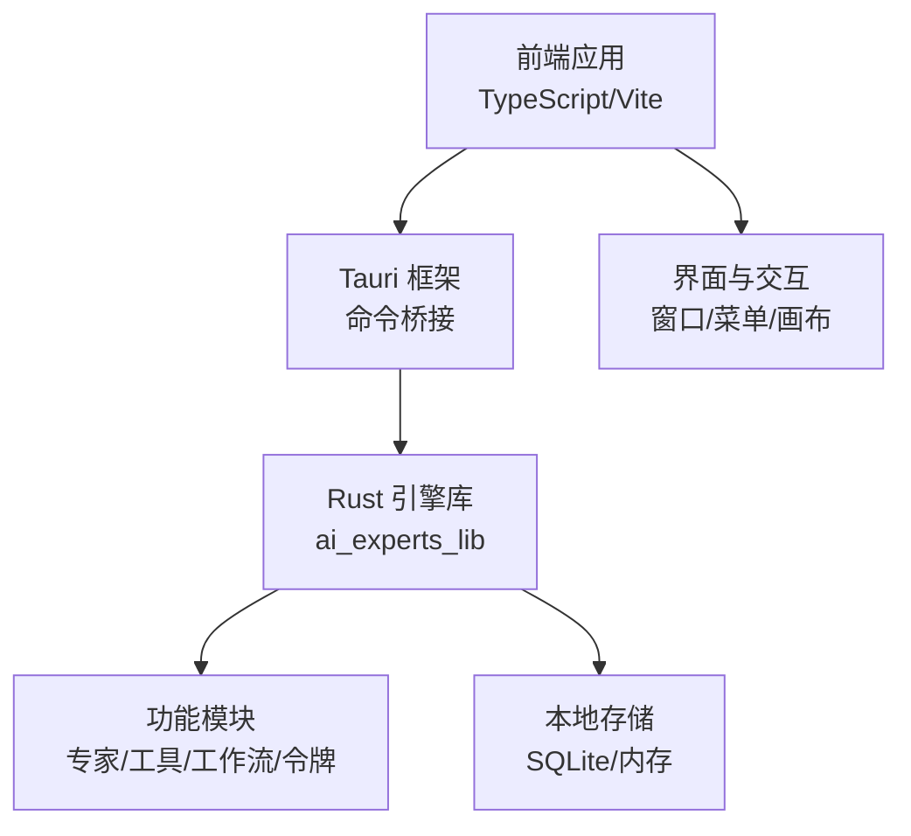
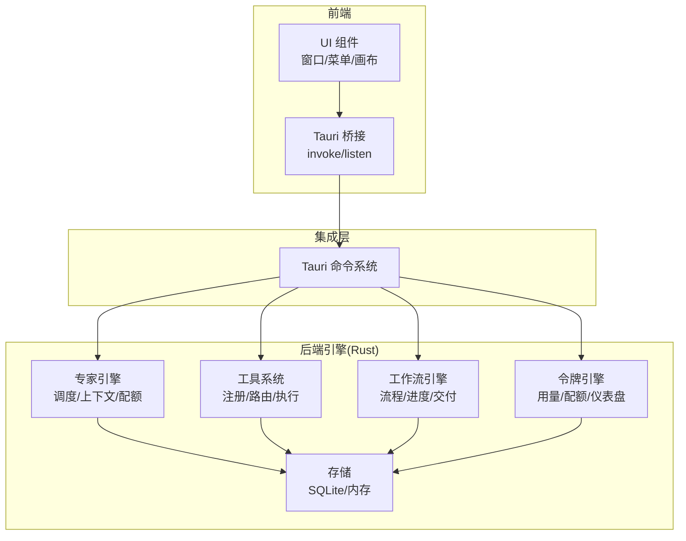
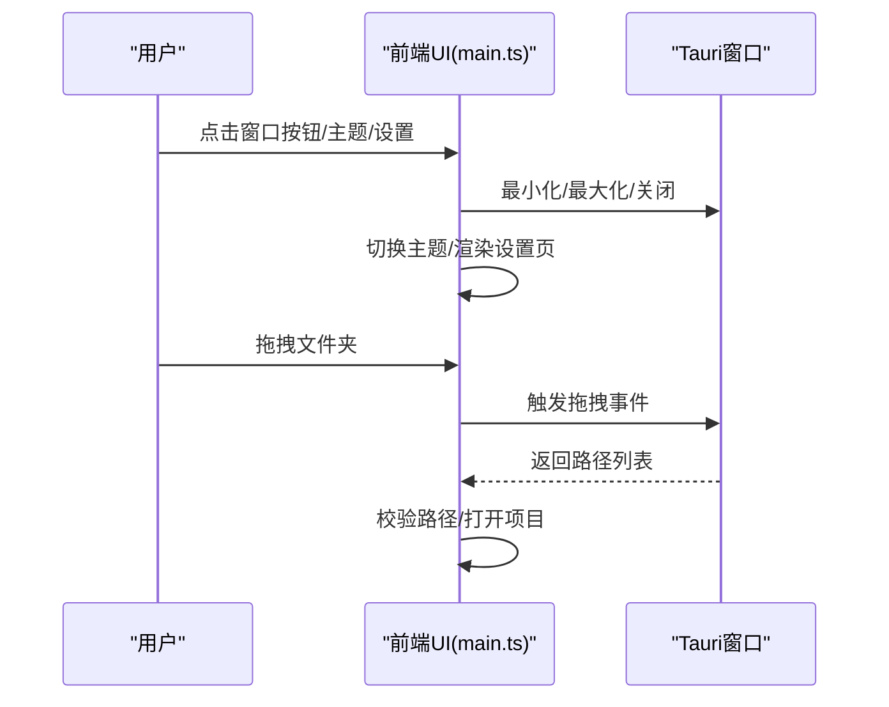
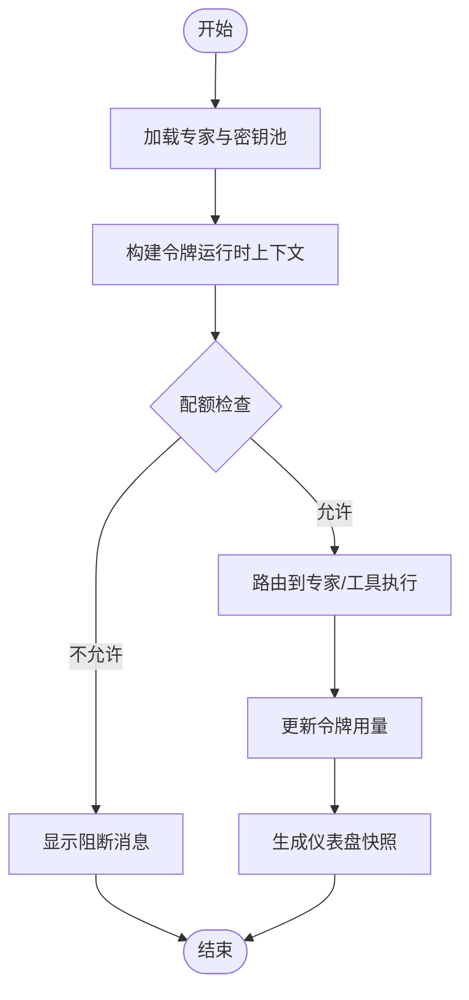
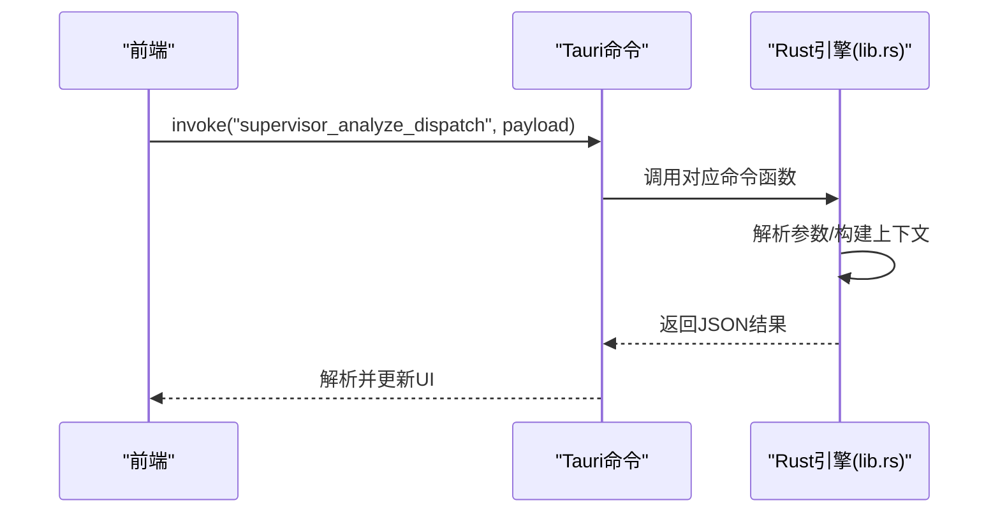
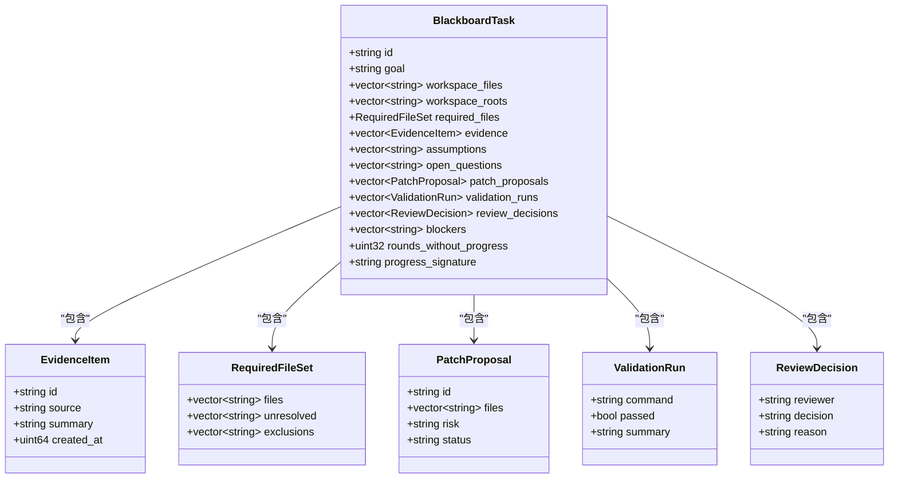
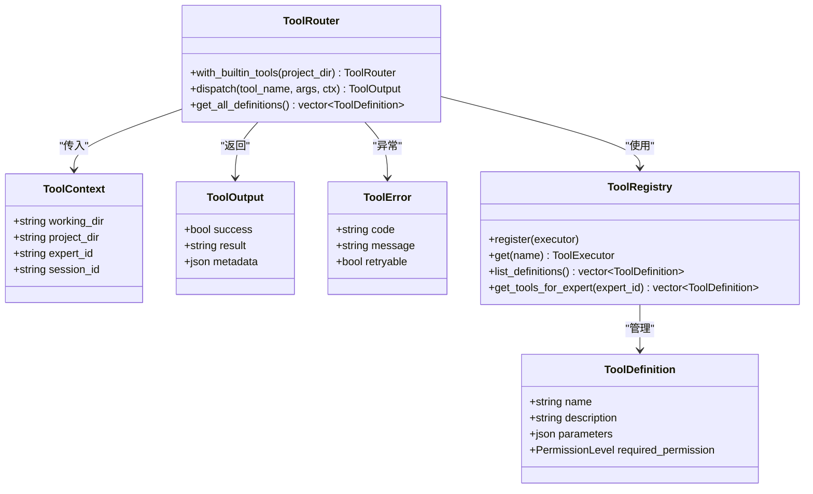
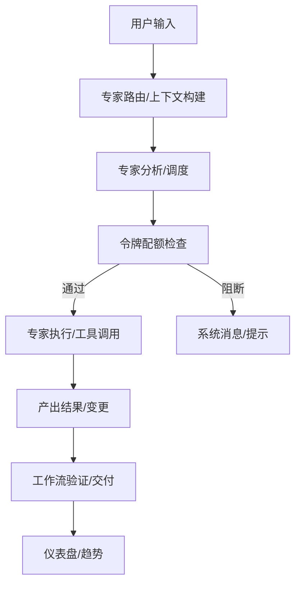
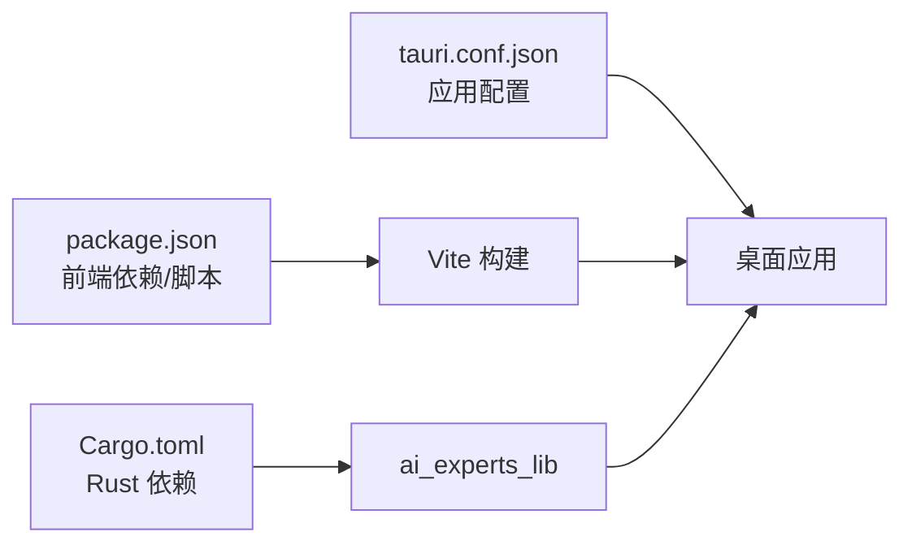

# 项目介绍

<cite>
**本文档引用的文件**
- [package.json](file://ai-experts/package.json)
- [Cargo.toml](file://ai-experts/src-tauri/Cargo.toml)
- [tauri.conf.json](file://ai-experts/src-tauri/tauri.conf.json)
- [main.ts](file://ai-experts/src/main.ts)
- [expert-router.ts](file://ai-experts/src/expert-router.ts)
- [lib.rs](file://ai-experts/src-tauri/src/lib.rs)
- [main.rs](file://ai-experts/src-tauri/src/main.rs)
- [blackboard_engine.rs](file://ai-experts/src-tauri/src/blackboard_engine.rs)
- [tool_system.rs](file://ai-experts/src-tauri/src/tool_system.rs)
</cite>

## 目录
1. [引言](#引言)
2. [项目结构](#项目结构)
3. [核心组件](#核心组件)
4. [架构总览](#架构总览)
5. [详细组件分析](#详细组件分析)
6. [依赖关系分析](#依赖关系分析)
7. [性能考量](#性能考量)
8. [故障排查指南](#故障排查指南)
9. [结论](#结论)
10. [附录](#附录)

## 引言
星图专家团工作台（社区版）是一个面向企业与个人用户的跨平台桌面应用，采用 Tauri 框架构建，结合前端 Web 技术与 Rust 后端引擎，形成“前端 UI + Rust 引擎”的混合架构。项目围绕 AI 专家系统、多模态数据处理、协作工作流与可扩展工具系统，提供智能化、可组合、可治理的工程交付能力。

本项目的核心价值主张包括：
- 跨平台原生体验：基于 Tauri 的桌面应用，兼顾性能与安全。
- AI 专家系统：通过“主管-专家-工具”的分层协同，实现复杂任务的智能调度与执行。
- 多模态数据处理：支持文本、图像、视频、音频及多种文档格式的输入与处理。
- 协作工作流：提供黑板式任务追踪、进度决策与阻塞管理，确保复杂工程有序推进。
- 可扩展工具系统：内置工具集与权限体系，支持安全可控的自动化执行。
- 开源与社区驱动：社区版开源发布，鼓励贡献与生态共建；与商业版本在功能覆盖与服务层面存在差异。

目标用户群体：
- 产品/技术负责人：需要统一的工程交付视图与专家协作机制。
- 工程师与研发团队：需要可编排的多模态处理与自动化工具链。
- 项目经理与运营人员：需要可视化的工作流与进度监控。
- 开发者与高级用户：希望深度定制与扩展工具系统。

## 项目结构
项目采用“前端 + Rust 引擎 + Tauri 集成”的分层组织方式：
- 前端层（TypeScript/Vite）：负责 UI、交互、事件与与 Rust 引擎的桥接调用。
- 引擎层（Rust）：提供 AI 专家调度、多模态处理、工具系统、工作流引擎、令牌与配额管理等核心能力。
- 集成层（Tauri）：将前端与 Rust 引擎整合为跨平台桌面应用，暴露命令接口与窗口控制能力。

图表来源
- [main.ts:1-258](file://ai-experts/src/main.ts#L1-L258)
- [lib.rs:1-52](file://ai-experts/src-tauri/src/lib.rs#L1-L52)
- [tauri.conf.json:1-38](file://ai-experts/src-tauri/tauri.conf.json#L1-L38)

章节来源
- [package.json:1-28](file://ai-experts/package.json#L1-L28)
- [Cargo.toml:1-46](file://ai-experts/src-tauri/Cargo.toml#L1-L46)
- [tauri.conf.json:1-38](file://ai-experts/src-tauri/tauri.conf.json#L1-L38)

## 核心组件
- 前端主入口与窗口控制：负责窗口最小化/最大化/关闭、主题切换、菜单与设置页、拖拽打开项目等。
- 专家路由与令牌管理：负责专家选择、令牌配额检查、运行时上下文构建与仪表盘快照生成。
- Rust 引擎命令：提供专家分析、工作流验证、工具执行、令牌统计等底层能力。
- 黑板引擎：承载复杂任务的证据、补丁提案、评审与阻塞管理。
- 工具系统：定义工具抽象、权限级别、注册表与路由，内置 Shell 执行、文件读写、网络搜索等工具。

章节来源
- [main.ts:1-258](file://ai-experts/src/main.ts#L1-L258)
- [expert-router.ts:1-200](file://ai-experts/src/expert-router.ts#L1-L200)
- [lib.rs:707-800](file://ai-experts/src-tauri/src/lib.rs#L707-L800)
- [blackboard_engine.rs:1-200](file://ai-experts/src-tauri/src/blackboard_engine.rs#L1-L200)
- [tool_system.rs:1-200](file://ai-experts/src-tauri/src/tool_system.rs#L1-L200)

## 架构总览
整体架构由前端 UI、Tauri 命令桥接与 Rust 引擎三部分组成。前端通过 Tauri API 调用 Rust 命令，Rust 引擎内部按需调用各功能模块（专家、工具、工作流、令牌等），并通过 SQLite 进行本地持久化。

图表来源
- [main.ts:1-258](file://ai-experts/src/main.ts#L1-L258)
- [lib.rs:1-52](file://ai-experts/src-tauri/src/lib.rs#L1-L52)
- [tauri.conf.json:1-38](file://ai-experts/src-tauri/tauri.conf.json#L1-L38)

## 详细组件分析

### 前端主入口与窗口控制
- 窗口控制：最小化、最大化、关闭按钮与拖拽区域。
- 主题切换：深色/浅色主题动态切换与样式同步。
- 设置页：主题开关、密钥池与专家数据加载。
- 项目打开：拖拽文件夹打开项目，初始化无限画布。

图表来源
- [main.ts:149-258](file://ai-experts/src/main.ts#L149-L258)

章节来源
- [main.ts:149-258](file://ai-experts/src/main.ts#L149-L258)

### 专家路由与令牌管理
- 专家选择与上下文：根据专家能力与任务需求构建专家系统提示与任务作用域提示。
- 令牌配额：支持项目级与用户级令牌用量记录与配额检查，提供豁免专家与运行时上下文。
- 仪表盘快照：聚合专家分布、模型统计、趋势与配额状态，辅助运营与成本治理。

图表来源
- [expert-router.ts:34-200](file://ai-experts/src/expert-router.ts#L34-L200)
- [lib.rs:321-338](file://ai-experts/src-tauri/src/lib.rs#L321-L338)

章节来源
- [expert-router.ts:34-200](file://ai-experts/src/expert-router.ts#L34-L200)

### Rust 引擎命令与功能模块
- 命令桥接：前端通过 invoke 调用 Rust 命令，如专家分析、工作流验证、令牌统计等。
- 功能模块：专家引擎、工具系统、工作流引擎、令牌引擎、存储等模块协同工作。
- 数据结构：统一的消息体、令牌用量、进度快照、工具执行结果等。

图表来源
- [lib.rs:732-788](file://ai-experts/src-tauri/src/lib.rs#L732-L788)
- [main.ts:1-30](file://ai-experts/src/main.ts#L1-L30)

章节来源
- [lib.rs:732-788](file://ai-experts/src-tauri/src/lib.rs#L732-L788)

### 黑板引擎与协作工作流
- 黑板任务：承载目标、证据、补丁提案、评审与阻塞信息，支持多轮迭代与进度判定。
- 专家任务摘要：从专家输出中提取变更文件、风险等级与状态，推动任务向前推进。
- 进度决策：基于证据与补丁提案判断是否取得进展或需要停止。

图表来源
- [blackboard_engine.rs:6-85](file://ai-experts/src-tauri/src/blackboard_engine.rs#L6-L85)

章节来源
- [blackboard_engine.rs:87-200](file://ai-experts/src-tauri/src/blackboard_engine.rs#L87-L200)

### 工具系统与权限控制
- 工具抽象：定义工具定义、执行上下文、执行结果与错误类型。
- 注册表与路由：集中管理工具注册与分发执行。
- 权限级别：自动、确认、拦截，保障安全可控的自动化执行。
- 内置工具：Shell 执行、文件读写、补丁、列出、网络搜索、内存查询、索引搜索等。

图表来源
- [tool_system.rs:18-142](file://ai-experts/src-tauri/src/tool_system.rs#L18-L142)

章节来源
- [tool_system.rs:1-200](file://ai-experts/src-tauri/src/tool_system.rs#L1-L200)

### 概念性总览
以下为概念性工作流，展示从用户输入到专家执行再到工具落地的整体过程：

（此图为概念性流程，不直接映射具体源文件）

## 依赖关系分析
- 前端依赖：@tauri-apps/api、@tauri-apps/cli、Vite、TypeScript 等。
- Rust 依赖：tauri、serde、serde_json、sqlx、reqwest、tokio、futures-util、dirs、regex、calamine、docx-rs、lopdf、csv、scraper 等。
- 配置：Tauri 配置定义窗口、安全策略、打包图标与构建脚本。

图表来源
- [package.json:15-26](file://ai-experts/package.json#L15-L26)
- [Cargo.toml:20-46](file://ai-experts/src-tauri/Cargo.toml#L20-L46)
- [tauri.conf.json:6-11](file://ai-experts/src-tauri/tauri.conf.json#L6-L11)

章节来源
- [package.json:15-26](file://ai-experts/package.json#L15-L26)
- [Cargo.toml:20-46](file://ai-experts/src-tauri/Cargo.toml#L20-L46)
- [tauri.conf.json:6-11](file://ai-experts/src-tauri/tauri.conf.json#L6-L11)

## 性能考量
- 跨平台原生性能：Tauri 将前端与 Rust 引擎结合，减少虚拟机开销，提升启动与运行效率。
- 并发与异步：Rust 层使用 tokio 与 futures-util 实现并发与异步 IO，适合多模态与工具执行场景。
- 本地存储：SQLite 提供轻量高效的数据持久化，降低网络依赖。
- 前端优化：Vite 构建与按需加载，配合主题与资源缓存，改善交互流畅度。

（本节为通用性能讨论，不直接分析具体文件）

## 故障排查指南
- 窗口控制问题：检查窗口事件监听与 Tauri API 调用是否正确绑定。
- 主题切换异常：确认 CSS 变量与 DOM 更新逻辑，避免样式冲突。
- 专家路由报错：核对专家列表与密钥池加载顺序，避免竞态导致的空引用。
- 令牌配额阻断：查看配额检查返回原因，确认专家限额与豁免 ID 配置。
- 工具执行失败：检查工具定义、权限级别与执行上下文，关注 ToolError 的 retryable 字段。

章节来源
- [main.ts:149-258](file://ai-experts/src/main.ts#L149-L258)
- [expert-router.ts:84-104](file://ai-experts/src/expert-router.ts#L84-L104)
- [tool_system.rs:43-49](file://ai-experts/src-tauri/src/tool_system.rs#L43-L49)

## 结论
星图专家团工作台（社区版）通过“前端 + Rust 引擎 + Tauri 集成”的架构，实现了跨平台桌面应用的高性能与强扩展性。项目以 AI 专家系统为核心，结合多模态处理、协作工作流与工具系统，为企业与个人用户提供从任务规划到执行落地的一体化智能化解决方案。社区版强调开源与社区驱动，与商业版本在功能覆盖与服务层面存在差异，适合不同规模与需求的用户选择。

（本节为总结性内容，不直接分析具体文件）

## 附录
- 项目启动与构建：前端使用 Vite，Rust 使用 Tauri CLI；开发与生产构建脚本在 package.json 中定义。
- 应用配置：窗口尺寸、标题、图标与打包目标在 tauri.conf.json 中配置。
- 引擎入口：Rust 入口调用 ai_experts_lib::run，统一初始化与命令注册。

章节来源
- [package.json:6-13](file://ai-experts/package.json#L6-L13)
- [tauri.conf.json:14-21](file://ai-experts/src-tauri/tauri.conf.json#L14-L21)
- [main.rs:3-5](file://ai-experts/src-tauri/src/main.rs#L3-L5)