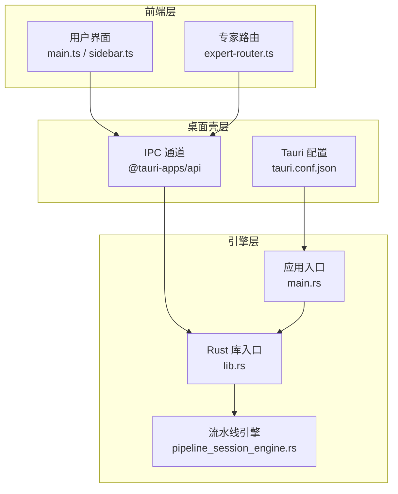
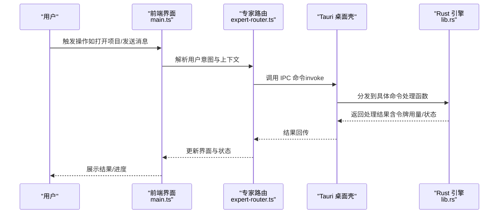
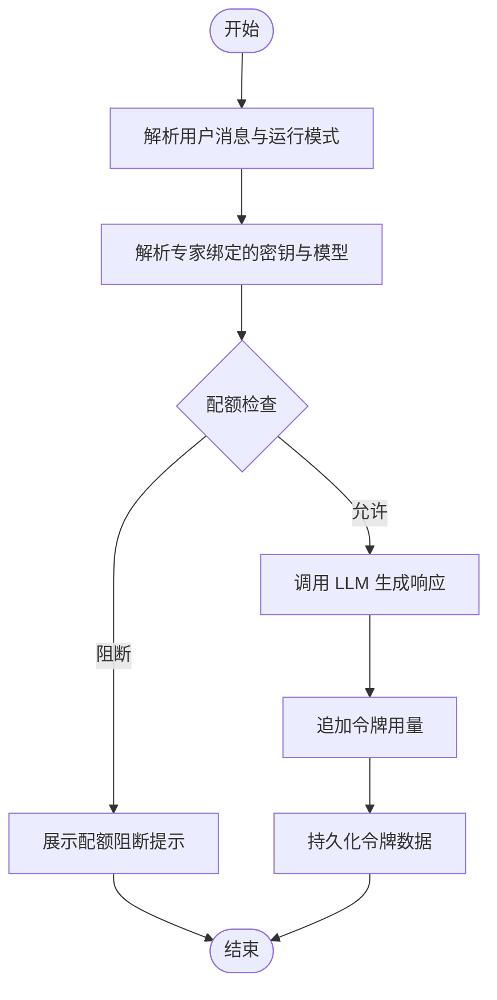
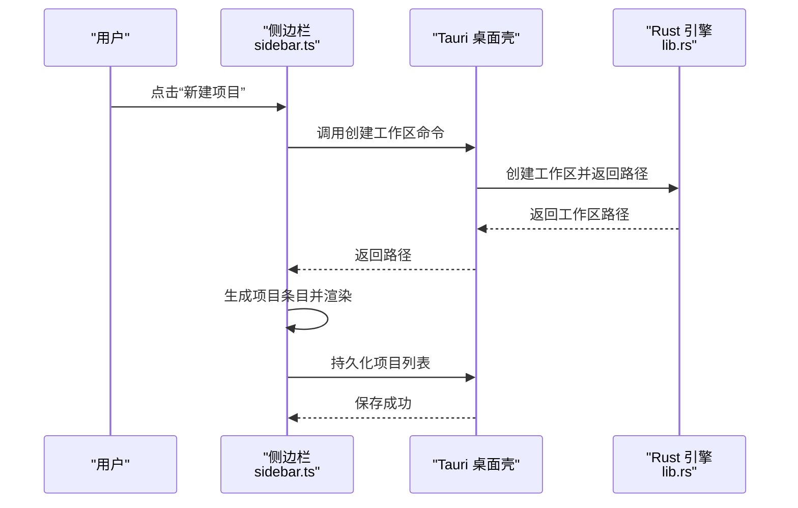
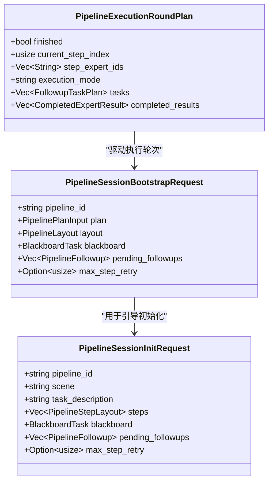
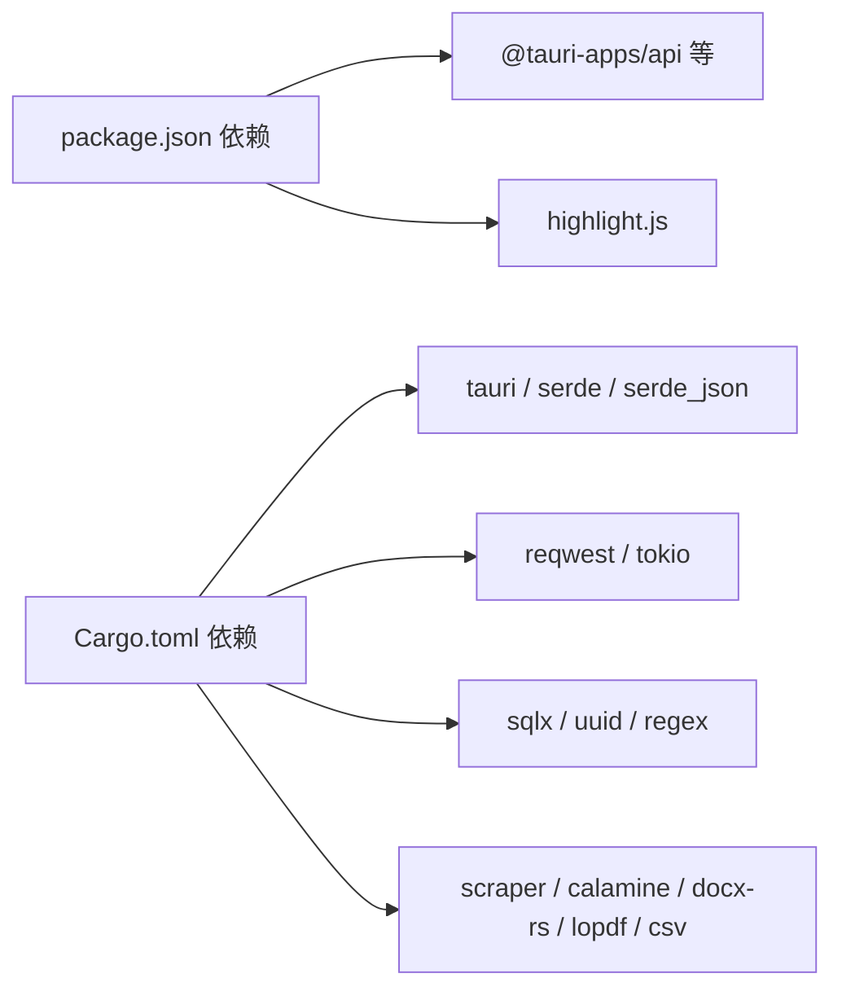

# 项目概述

<cite>
**本文档引用的文件**
- [package.json](file://ai-experts/package.json)
- [Cargo.toml](file://ai-experts/src-tauri/Cargo.toml)
- [tauri.conf.json](file://ai-experts/src-tauri/tauri.conf.json)
- [main.ts](file://ai-experts/src/main.ts)
- [expert-router.ts](file://ai-experts/src/expert-router.ts)
- [sidebar.ts](file://ai-experts/src/sidebar.ts)
- [lib.rs](file://ai-experts/src-tauri/src/lib.rs)
- [main.rs](file://ai-experts/src-tauri/src/main.rs)
- [pipeline_session_engine.rs](file://ai-experts/src-tauri/src/pipeline_session_engine.rs)
</cite>

## 目录
1. [引言](#引言)
2. [项目结构](#项目结构)
3. [核心组件](#核心组件)
4. [架构总览](#架构总览)
5. [详细组件分析](#详细组件分析)
6. [依赖关系分析](#依赖关系分析)
7. [性能考量](#性能考量)
8. [故障排查指南](#故障排查指南)
9. [结论](#结论)
10. [附录](#附录)

## 引言
星图专家团工作台（社区版）是一个面向开发者的跨平台桌面应用，采用 Tauri 框架构建，结合前端 Web 技术与 Rust 后端引擎，形成“前端 UI + 桌面原生能力 + AI 专家系统”的混合架构。项目围绕“AI 专家系统、多模态数据处理、协作工作流、可扩展工具系统”四大核心能力展开，旨在为个人开发者与小团队提供一体化的知识型工作台，支持从需求分析、专家调度、工具执行到交付物产出的全流程协同。

本项目既适合初学者快速上手，也为有经验的开发者提供了清晰的技术架构与扩展点，便于二次开发与功能增强。

## 项目结构
项目采用“前端 + 桌面壳 + Rust 引擎”的分层组织方式：
- 前端层（Web 技术栈）：负责用户界面、交互逻辑、事件绑定与与后端的 IPC 通信。
- 桌面壳层（Tauri）：提供窗口管理、系统集成、文件系统访问、对话框等原生能力。
- 引擎层（Rust）：实现 AI 专家系统、工作流编排、令牌配额、工具执行、知识检索等核心业务逻辑。

图表来源
- [main.ts:1-280](file://ai-experts/src/main.ts#L1-L280)
- [expert-router.ts:1-200](file://ai-experts/src/expert-router.ts#L1-L200)
- [tauri.conf.json:1-38](file://ai-experts/src-tauri/tauri.conf.json#L1-L38)
- [lib.rs:1-120](file://ai-experts/src-tauri/src/lib.rs#L1-L120)
- [main.rs:1-6](file://ai-experts/src-tauri/src/main.rs#L1-L6)
- [pipeline_session_engine.rs:29-111](file://ai-experts/src-tauri/src/pipeline_session_engine.rs#L29-L111)

章节来源
- [package.json:1-28](file://ai-experts/package.json#L1-L28)
- [Cargo.toml:1-46](file://ai-experts/src-tauri/Cargo.toml#L1-L46)
- [tauri.conf.json:1-38](file://ai-experts/src-tauri/tauri.conf.json#L1-L38)

## 核心组件
- 专家路由与调度：负责将用户意图转化为专家任务，进行专家选择、令牌配额检查、运行时上下文构建与结果汇总。
- 项目与工作区管理：提供项目创建、工作区初始化、项目列表持久化与最后打开项目恢复。
- 多模态密钥池：统一管理文本/图像/视频等多模态输入输出能力的 API 密钥与模型配置。
- 流水线引擎：支撑多专家协作的流程编排、步骤执行、回退与跟进任务的生命周期管理。
- 令牌配额与用量统计：对项目级与用户级的令牌使用进行追踪、配额校验与可视化仪表盘。

章节来源
- [expert-router.ts:1-200](file://ai-experts/src/expert-router.ts#L1-L200)
- [sidebar.ts:1-200](file://ai-experts/src/sidebar.ts#L1-L200)
- [main.ts:529-790](file://ai-experts/src/main.ts#L529-L790)
- [lib.rs:1-120](file://ai-experts/src-tauri/src/lib.rs#L1-L120)

## 架构总览
整体架构遵循“前端 UI + Tauri 桌面壳 + Rust 引擎”的分层设计。前端通过 @tauri-apps/api 与 Rust 模块建立 IPC 通信，调用后端命令完成复杂业务处理；Rust 层通过 sqlite 连接池、HTTP 客户端、文件系统等能力实现数据持久化、外部服务调用与本地资源管理。

图表来源
- [main.ts:226-258](file://ai-experts/src/main.ts#L226-L258)
- [expert-router.ts:1-200](file://ai-experts/src/expert-router.ts#L1-L200)
- [lib.rs:707-800](file://ai-experts/src-tauri/src/lib.rs#L707-L800)

## 详细组件分析

### 专家路由与令牌配额
- 专家路由模块负责：
  - 专家选择与激活评估
  - 令牌配额上下文构建与实时校验
  - 项目级/用户级令牌数据的持久化与仪表盘快照生成
- 关键流程包括：用户消息预处理、专家模型与密钥解析、运行时配额检查、用量追加与阻断提示。

图表来源
- [expert-router.ts:34-200](file://ai-experts/src/expert-router.ts#L34-L200)
- [lib.rs:321-338](file://ai-experts/src-tauri/src/lib.rs#L321-L338)
- [lib.rs:633-684](file://ai-experts/src-tauri/src/lib.rs#L633-L684)

章节来源
- [expert-router.ts:1-200](file://ai-experts/src/expert-router.ts#L1-L200)
- [lib.rs:321-338](file://ai-experts/src-tauri/src/lib.rs#L321-L338)
- [lib.rs:633-684](file://ai-experts/src-tauri/src/lib.rs#L633-L684)

### 项目与工作区管理
- 侧边栏模块负责：
  - 项目列表的加载、创建、持久化与最后打开项目恢复
  - 工作区文件夹创建与 .xt 配置文件补全
  - 与后端 IPC 通信以完成数据库存取与文件系统操作
- 关键流程包括：项目名称去重、工作区创建、图标颜色分配、延迟保存与重试加载。

图表来源
- [sidebar.ts:155-182](file://ai-experts/src/sidebar.ts#L155-L182)
- [sidebar.ts:63-99](file://ai-experts/src/sidebar.ts#L63-L99)
- [lib.rs:707-714](file://ai-experts/src-tauri/src/lib.rs#L707-L714)

章节来源
- [sidebar.ts:1-200](file://ai-experts/src/sidebar.ts#L1-L200)
- [lib.rs:707-714](file://ai-experts/src-tauri/src/lib.rs#L707-L714)

### 多模态密钥池与模型能力
- 密钥池支持三类条目：预设提供商、中继密钥、自定义代码密钥
- 提供默认的多模态能力映射（输入/输出模态），并支持按模态筛选密钥
- 支持根据专家 ID 解析绑定的密钥与模型，以及当前激活密钥的模型名称

章节来源
- [main.ts:529-790](file://ai-experts/src/main.ts#L529-L790)
- [main.ts:598-605](file://ai-experts/src/main.ts#L598-L605)

### 流水线引擎与协作工作流
- 流水线会话包含初始化、引导、执行轮次、跟进任务等阶段
- 支持步骤级任务派发、完成结果聚合与回退任务生成
- 通过 Rust 引擎实现强类型的数据结构与稳定的执行语义

图表来源
- [pipeline_session_engine.rs:29-111](file://ai-experts/src-tauri/src/pipeline_session_engine.rs#L29-L111)

章节来源
- [pipeline_session_engine.rs:29-111](file://ai-experts/src-tauri/src/pipeline_session_engine.rs#L29-L111)

### 前端主入口与窗口控制
- 主入口负责窗口最小化/最大化/关闭、拖拽移动、主题切换、设置页打开/关闭、拖拽打开项目等
- 与后端 IPC 通信以实现项目打开、密钥池加载与保存等功能

章节来源
- [main.ts:147-258](file://ai-experts/src/main.ts#L147-L258)
- [main.ts:378-434](file://ai-experts/src/main.ts#L378-L434)

## 依赖关系分析
- 前端依赖
  - @tauri-apps/api：提供窗口、事件、IPC 能力
  - @tauri-apps 插件：dialog、opener 等
  - highlight.js：代码高亮
- Rust 依赖
  - tauri、serde、serde_json：桌面壳与序列化
  - reqwest、tokio：HTTP 与异步运行时
  - sqlx、uuid、regex：数据库、唯一标识与正则
  - scraper、calamine、docx-rs、lopdf、csv：多模态文档处理
  - 其他：mime_guess、chrono、dirs 等

图表来源
- [package.json:15-26](file://ai-experts/package.json#L15-L26)
- [Cargo.toml:20-46](file://ai-experts/src-tauri/Cargo.toml#L20-L46)

章节来源
- [package.json:1-28](file://ai-experts/package.json#L1-L28)
- [Cargo.toml:1-46](file://ai-experts/src-tauri/Cargo.toml#L1-L46)

## 性能考量
- 前端层面
  - 使用 @tauri-apps/api 的 invoke 与事件监听，避免频繁 DOM 操作
  - 主题切换与设置页采用延迟保存与状态缓存，减少不必要的 IPC 调用
- 后端层面
  - 全局数据库连接池（AppState）降低连接开销
  - 异步运行时（tokio）与流式处理（futures-util）提升并发与吞吐
  - 对大文件/多模态内容采用分块与流式读取策略，降低内存峰值

## 故障排查指南
- 无法打开项目/工作区创建失败
  - 检查后端创建工作区命令返回值与权限
  - 确认项目列表持久化与 projects.json 同步写入
- 专家调用被阻断
  - 查看配额阻断提示与令牌用量记录
  - 核对专家绑定密钥与模型是否匹配
- UI 交互异常
  - 检查窗口事件监听与拖拽启动逻辑
  - 确认设置页打开/关闭时的显示状态恢复

章节来源
- [sidebar.ts:155-182](file://ai-experts/src/sidebar.ts#L155-L182)
- [expert-router.ts:84-104](file://ai-experts/src/expert-router.ts#L84-L104)
- [main.ts:174-185](file://ai-experts/src/main.ts#L174-L185)

## 结论
星图专家团工作台（社区版）通过“前端 + 桌面壳 + Rust 引擎”的混合架构，实现了跨平台桌面应用的高性能与可扩展性。其核心价值在于：
- 将 AI 专家系统与桌面原生能力融合，提供一体化工作台体验
- 支持多模态数据处理与专家协作流水线，覆盖从分析到交付的完整生命周期
- 提供可扩展的工具系统与密钥池，满足多样化场景需求

对于初学者，建议从项目创建与专家路由的基本流程入手；对于有经验的开发者，可深入流水线引擎与工具系统，按需扩展业务能力。

## 附录
- 实际使用场景举例
  - 需求分析：通过专家路由解析用户意图，生成专家调度计划
  - 文档处理：利用多模态密钥池与文档处理器，完成 PDF/Word/CSV 等格式解析
  - 协作交付：通过流水线引擎编排多专家任务，自动推进与跟进
  - 可视化与监控：基于令牌仪表盘快照，实时掌握用量与配额状态