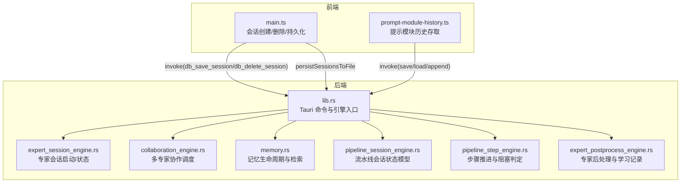
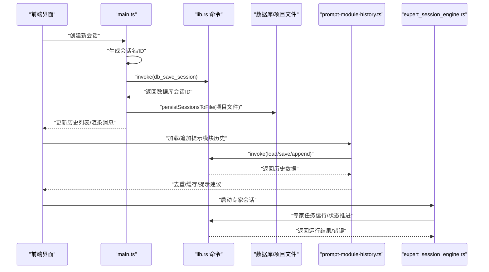
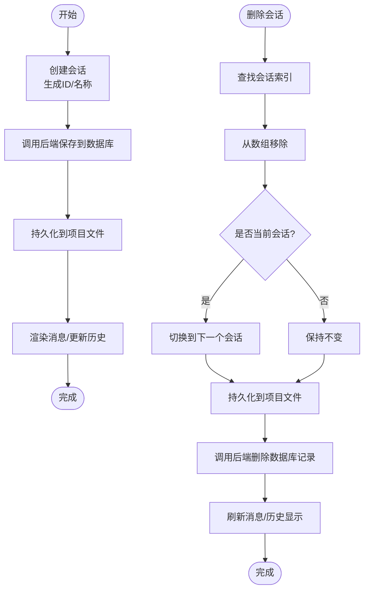
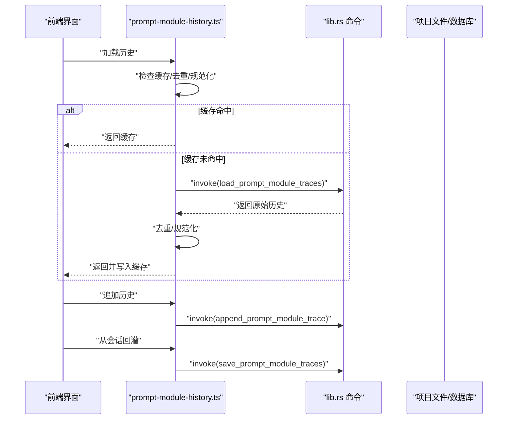
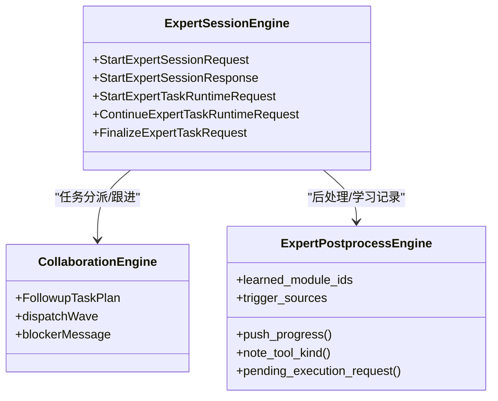
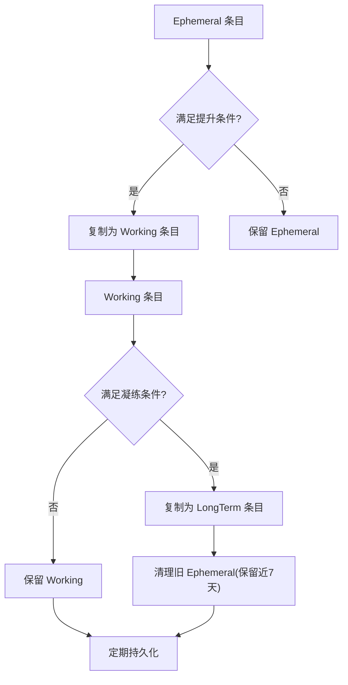
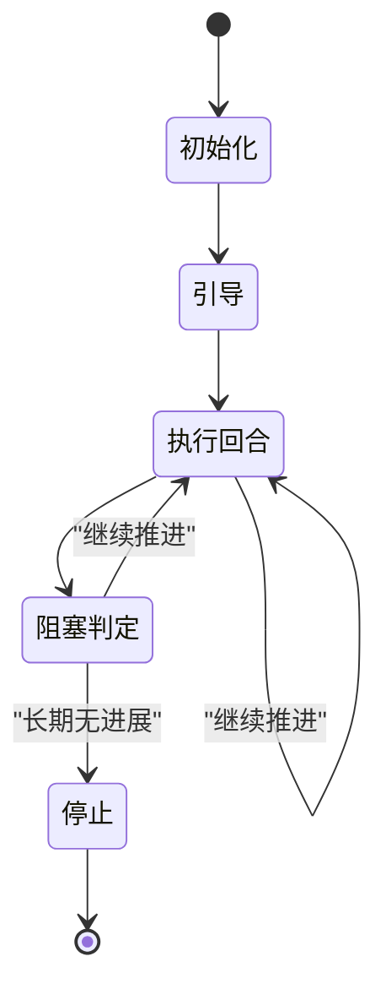
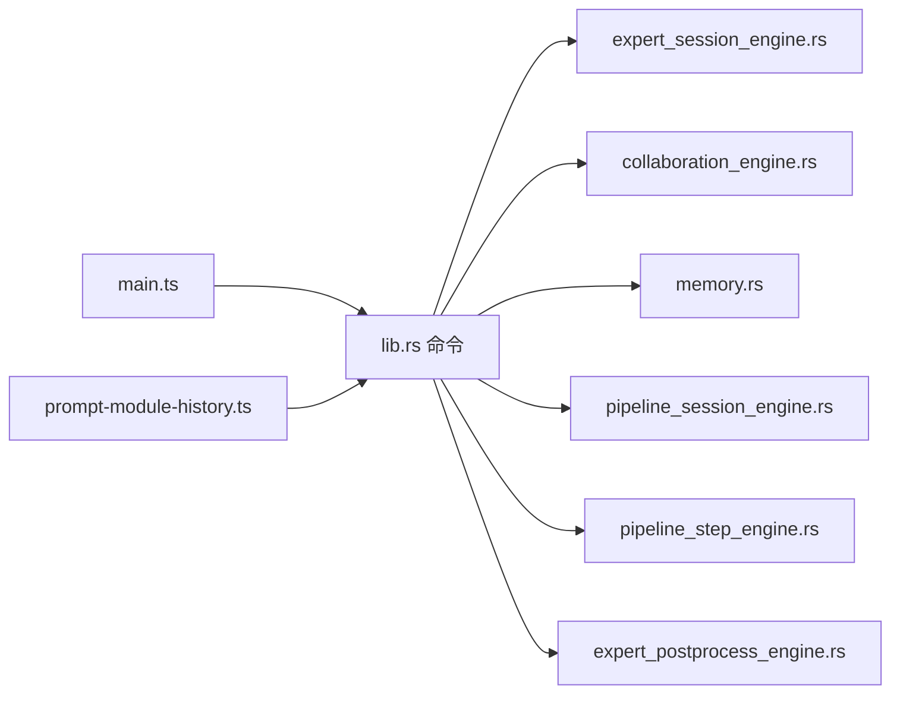

# 会话管理

<cite>
**本文引用的文件**
- [main.ts](file://ai-experts/src/main.ts)
- [prompt-module-history.ts](file://ai-experts/src/prompt-module-history.ts)
- [lib.rs](file://ai-experts/src-tauri/src/lib.rs)
- [expert_session_engine.rs](file://ai-experts/src-tauri/src/expert_session_engine.rs)
- [collaboration_engine.rs](file://ai-experts/src-tauri/src/collaboration_engine.rs)
- [memory.rs](file://ai-experts/src-tauri/src/memory.rs)
- [pipeline_session_engine.rs](file://ai-experts/src-tauri/src/pipeline_session_engine.rs)
- [pipeline_step_engine.rs](file://ai-experts/src-tauri/src/pipeline_step_engine.rs)
- [expert_postprocess_engine.rs](file://ai-experts/src-tauri/src/expert_postprocess_engine.rs)
</cite>

## 目录
1. [简介](#简介)
2. [项目结构](#项目结构)
3. [核心组件](#核心组件)
4. [架构总览](#架构总览)
5. [详细组件分析](#详细组件分析)
6. [依赖关系分析](#依赖关系分析)
7. [性能考虑](#性能考虑)
8. [故障排除指南](#故障排除指南)
9. [结论](#结论)
10. [附录](#附录)

## 简介
本技术文档围绕“星图专家团工作台”的会话管理模块展开，系统性阐述会话的创建、维护与销毁流程，覆盖会话状态生命周期、会话历史记录的存储与检索、版本控制思路、多专家协作下的状态同步与一致性保障、会话数据持久化与备份恢复策略、性能优化手段、配置与权限控制、安全机制、监控与诊断工具以及典型使用场景与实践建议。

## 项目结构
会话管理涉及前端 TypeScript 逻辑与后端 Rust 引擎两大部分：
- 前端负责会话 UI 生命周期、消息渲染、会话持久化到项目文件、与后端命令交互等。
- 后端 Rust 引擎负责专家会话启动、协作调度、记忆与提示模块历史的持久化与检索、管道式会话状态机等。

**图表来源**
- [main.ts:1869-1951](file://ai-experts/src/main.ts#L1869-L1951)
- [prompt-module-history.ts:1-120](file://ai-experts/src/prompt-module-history.ts#L1-L120)
- [lib.rs:1361-2310](file://ai-experts/src-tauri/src/lib.rs#L1361-L2310)
- [expert_session_engine.rs:1-200](file://ai-experts/src-tauri/src/expert_session_engine.rs#L1-L200)
- [collaboration_engine.rs:1-200](file://ai-experts/src-tauri/src/collaboration_engine.rs#L1-L200)
- [memory.rs:53-133](file://ai-experts/src-tauri/src/memory.rs#L53-L133)
- [pipeline_session_engine.rs:29-111](file://ai-experts/src-tauri/src/pipeline_session_engine.rs#L29-L111)
- [pipeline_step_engine.rs:120-144](file://ai-experts/src-tauri/src/pipeline_step_engine.rs#L120-L144)
- [expert_postprocess_engine.rs:84-133](file://ai-experts/src-tauri/src/expert_postprocess_engine.rs#L84-L133)

**章节来源**
- [main.ts:1695-1951](file://ai-experts/src/main.ts#L1695-L1951)
- [prompt-module-history.ts:1-120](file://ai-experts/src/prompt-module-history.ts#L1-L120)
- [lib.rs:1361-2310](file://ai-experts/src-tauri/src/lib.rs#L1361-L2310)

## 核心组件
- 会话生命周期管理（前端）：负责会话创建、命名、删除、当前会话切换、与项目文件持久化。
- 提示模块历史（前端）：基于会话历史推导提示模块使用痕迹，去重与缓存，支持回灌与增量导入。
- 专家会话引擎（后端）：封装专家任务启动、运行时状态、后处理与学习记录。
- 协作引擎（后端）：多专家任务分派、跟进任务计划、阻塞与监督决策。
- 记忆与提示模块历史（后端）：记忆条目的生命周期（Ephemeral → Working → LongTerm）、检索与上限保护；提示模块历史的持久化与回灌。
- 流水线会话状态机（后端）：定义流水线会话初始化、引导、回合计划、结果聚合等状态与请求结构。

**章节来源**
- [main.ts:1869-1951](file://ai-experts/src/main.ts#L1869-L1951)
- [prompt-module-history.ts:1-120](file://ai-experts/src/prompt-module-history.ts#L1-L120)
- [expert_session_engine.rs:1-200](file://ai-experts/src-tauri/src/expert_session_engine.rs#L1-L200)
- [collaboration_engine.rs:1-200](file://ai-experts/src-tauri/src/collaboration_engine.rs#L1-L200)
- [memory.rs:53-133](file://ai-experts/src-tauri/src/memory.rs#L53-L133)
- [pipeline_session_engine.rs:29-111](file://ai-experts/src-tauri/src/pipeline_session_engine.rs#L29-L111)

## 架构总览
下图展示了从前端到后端的关键调用链与数据流，体现会话创建、持久化、历史回灌与专家会话启动的整体流程。

**图表来源**
- [main.ts:1869-1951](file://ai-experts/src/main.ts#L1869-L1951)
- [prompt-module-history.ts:1-120](file://ai-experts/src/prompt-module-history.ts#L1-L120)
- [lib.rs:1361-2310](file://ai-experts/src-tauri/src/lib.rs#L1361-L2310)
- [expert_session_engine.rs:1-200](file://ai-experts/src-tauri/src/expert_session_engine.rs#L1-L200)

## 详细组件分析

### 会话创建、维护与销毁（前端）
- 创建会话：生成自增 ID 与默认名称，写入内存会话数组，调用后端命令保存至数据库，随后持久化到项目文件。
- 删除会话：定位当前项目会话数组中的目标会话，移除并切换当前会话（若删除的是当前会话），持久化到项目文件，调用后端命令删除数据库记录。
- 当前会话切换：删除当前会话时自动切换到下一个会话，避免无会话状态。
- 项目启动恢复：优先从项目文件加载会话，若为空则尝试从数据库加载并回灌提示模块历史。

**图表来源**
- [main.ts:1869-1951](file://ai-experts/src/main.ts#L1869-L1951)

**章节来源**
- [main.ts:1869-1951](file://ai-experts/src/main.ts#L1869-L1951)

### 会话历史记录存储与检索（前后端协同）
- 去重与规范化：对提示模块历史进行签名去重、时间顺序归一化，限制缓存大小。
- 存储接口：通过 Tauri 命令保存、加载、追加提示模块历史。
- 回灌机制：从旧会话提取历史，与现有历史合并，去重后写回，统计导入数量。

**图表来源**
- [prompt-module-history.ts:1-120](file://ai-experts/src/prompt-module-history.ts#L1-L120)
- [lib.rs:1361-2310](file://ai-experts/src-tauri/src/lib.rs#L1361-L2310)

**章节来源**
- [prompt-module-history.ts:1-120](file://ai-experts/src/prompt-module-history.ts#L1-L120)

### 专家会话引擎与状态同步（后端）
- 专家会话启动：根据场景与任务描述解析提示计划，准备专家会话请求，进入运行时状态。
- 运行时状态：封装专家任务运行环境、令牌上下文、审批决策等，支持继续运行与最终收尾。
- 后处理与学习记录：记录专家使用的工具类型、触发源、学习模块 ID，形成后续提示模块推荐依据。
- 多专家协作：协作引擎负责任务分派、跟进任务计划、阻塞与监督决策，确保状态一致性与可追踪性。

**图表来源**
- [expert_session_engine.rs:1-200](file://ai-experts/src-tauri/src/expert_session_engine.rs#L1-L200)
- [collaboration_engine.rs:1-200](file://ai-experts/src-tauri/src/collaboration_engine.rs#L1-L200)
- [expert_postprocess_engine.rs:84-133](file://ai-experts/src-tauri/src/expert_postprocess_engine.rs#L84-L133)

**章节来源**
- [expert_session_engine.rs:1-200](file://ai-experts/src-tauri/src/expert_session_engine.rs#L1-L200)
- [collaboration_engine.rs:1-200](file://ai-experts/src-tauri/src/collaboration_engine.rs#L1-L200)
- [expert_postprocess_engine.rs:84-133](file://ai-experts/src-tauri/src/expert_postprocess_engine.rs#L84-L133)

### 记忆与提示模块历史（后端）
- 记忆生命周期：Ephemeral → Working → LongTerm，按访问次数、内容长度、时间衰减等规则提升与凝练，上限保护与定期清理。
- 检索与评分：基于关键词、内容相似度、时间衰减、访问增强、类型权重综合评分，返回 Top-N 结果并触达记录。
- 提示模块历史：与记忆系统配合，从会话中抽取模块使用轨迹，去重后写入持久化存储，供后续提示模块选择使用。

**图表来源**
- [memory.rs:307-343](file://ai-experts/src-tauri/src/memory.rs#L307-L343)
- [memory.rs:53-133](file://ai-experts/src-tauri/src/memory.rs#L53-L133)

**章节来源**
- [memory.rs:53-133](file://ai-experts/src-tauri/src/memory.rs#L53-L133)
- [memory.rs:307-343](file://ai-experts/src-tauri/src/memory.rs#L307-L343)

### 流水线会话状态机（后端）
- 初始化与引导：定义流水线会话初始化请求、引导请求与响应，包含场景、任务描述、步骤布局、黑板任务等。
- 执行回合计划：计算当前步骤、专家分派、执行模式、已完成结果与待跟进任务。
- 步骤推进与阻塞：在特定场景下检测长期无进展，生成阻塞任务快照并决定是否停止。

**图表来源**
- [pipeline_session_engine.rs:29-111](file://ai-experts/src-tauri/src/pipeline_session_engine.rs#L29-L111)
- [pipeline_step_engine.rs:120-144](file://ai-experts/src-tauri/src/pipeline_step_engine.rs#L120-L144)

**章节来源**
- [pipeline_session_engine.rs:29-111](file://ai-experts/src-tauri/src/pipeline_session_engine.rs#L29-L111)
- [pipeline_step_engine.rs:120-144](file://ai-experts/src-tauri/src/pipeline_step_engine.rs#L120-L144)

## 依赖关系分析
- 前端依赖后端命令以完成数据库与项目文件的读写，同时通过提示模块历史接口实现会话回灌与推荐。
- 后端各引擎之间存在清晰的职责边界：专家会话引擎负责专家任务生命周期，协作引擎负责任务分派与阻塞，记忆与提示模块历史负责知识沉淀与检索，流水线引擎负责复杂任务编排。
- 数据一致性：前端在本地内存维护会话状态，通过持久化与数据库命令保证落盘；后端通过状态机与协作机制保证多专家场景的一致性。

**图表来源**
- [main.ts:1695-1951](file://ai-experts/src/main.ts#L1695-L1951)
- [prompt-module-history.ts:1-120](file://ai-experts/src/prompt-module-history.ts#L1-L120)
- [lib.rs:1361-2310](file://ai-experts/src-tauri/src/lib.rs#L1361-L2310)
- [expert_session_engine.rs:1-200](file://ai-experts/src-tauri/src/expert_session_engine.rs#L1-L200)
- [collaboration_engine.rs:1-200](file://ai-experts/src-tauri/src/collaboration_engine.rs#L1-L200)
- [memory.rs:53-133](file://ai-experts/src-tauri/src/memory.rs#L53-L133)
- [pipeline_session_engine.rs:29-111](file://ai-experts/src-tauri/src/pipeline_session_engine.rs#L29-L111)
- [pipeline_step_engine.rs:120-144](file://ai-experts/src-tauri/src/pipeline_step_engine.rs#L120-L144)
- [expert_postprocess_engine.rs:84-133](file://ai-experts/src-tauri/src/expert_postprocess_engine.rs#L84-L133)

**章节来源**
- [lib.rs:1361-2310](file://ai-experts/src-tauri/src/lib.rs#L1361-L2310)

## 性能考虑
- 前端
  - 会话数组与提示模块历史采用内存缓存，减少重复 IO；对历史进行去重与截断，控制缓存规模。
  - 会话持久化采用批量写入项目文件，避免频繁磁盘 IO。
- 后端
  - 记忆条目上限保护与定期清理，防止无限增长；检索阶段对结果集进行 Top-N 截断，降低排序与返回开销。
  - 专家会话运行时状态与协作计划采用结构化数据传输，减少不必要的序列化成本。
- 并发与一致性
  - 多专家协作通过回合计划与阻塞判定避免资源竞争；状态机推进严格区分场景与步骤，降低冲突概率。

[本节为通用性能指导，无需列出具体文件来源]

## 故障排除指南
- 会话创建失败
  - 检查后端命令 db_save_session 是否抛出异常；确认项目文件持久化路径是否存在；查看日志输出。
  - 参考路径：[main.ts:1885-1897](file://ai-experts/src/main.ts#L1885-L1897)
- 会话删除异常
  - 确认当前项目是否存在；检查数据库删除命令是否成功；验证当前会话切换逻辑。
  - 参考路径：[main.ts:1905-1928](file://ai-experts/src/main.ts#L1905-L1928)
- 历史回灌无效
  - 检查提示模块历史缓存是否命中；确认去重签名是否一致；核对后端命令 load/save/append 的返回值。
  - 参考路径：[prompt-module-history.ts:41-77](file://ai-experts/src/prompt-module-history.ts#L41-L77)
- 记忆生命周期异常
  - 检查提升与凝练条件是否满足；确认清理逻辑是否正确执行；核对持久化文件是否存在。
  - 参考路径：[memory.rs:307-343](file://ai-experts/src-tauri/src/memory.rs#L307-L343)
- 专家会话阻塞
  - 查看协作引擎的阻塞判定逻辑；确认黑板进度推进与超时阈值；检查专家任务输出与错误信息。
  - 参考路径：[collaboration_engine.rs:1-200](file://ai-experts/src-tauri/src/collaboration_engine.rs#L1-L200)，[pipeline_step_engine.rs:120-144](file://ai-experts/src-tauri/src/pipeline_step_engine.rs#L120-L144)

**章节来源**
- [main.ts:1885-1928](file://ai-experts/src/main.ts#L1885-L1928)
- [prompt-module-history.ts:41-77](file://ai-experts/src/prompt-module-history.ts#L41-L77)
- [memory.rs:307-343](file://ai-experts/src-tauri/src/memory.rs#L307-L343)
- [collaboration_engine.rs:1-200](file://ai-experts/src-tauri/src/collaboration_engine.rs#L1-L200)
- [pipeline_step_engine.rs:120-144](file://ai-experts/src-tauri/src/pipeline_step_engine.rs#L120-L144)

## 结论
会话管理模块通过前后端协同实现了从创建、维护到销毁的完整生命周期管理，结合记忆与提示模块历史的沉淀与检索，为多专家协作提供了可追踪、可复用的知识基础。流水线状态机与协作引擎进一步保障了复杂任务场景下的状态一致性与执行效率。建议在生产环境中强化日志与监控，完善异常告警与自动恢复机制，持续优化缓存与 IO 策略以提升整体性能。

[本节为总结性内容，无需列出具体文件来源]

## 附录
- 使用场景示例
  - 新建项目后首次启动：前端从项目文件加载会话并回灌提示模块历史，确保专家推荐可用。
  - 多专家协作：协作引擎根据步骤与专家能力生成回合计划，阻塞判定避免无效等待。
  - 记忆沉淀：专家输出被归档为 Working/LongTerm 记忆，供后续任务复用。
- 最佳实践
  - 控制提示模块历史缓存大小与去重策略，避免重复与膨胀。
  - 在高并发场景下，合理设置流水线步骤的超时与阻塞阈值。
  - 对关键命令增加重试与降级策略，确保会话持久化与历史回灌的可靠性。

[本节为概念性内容，无需列出具体文件来源]