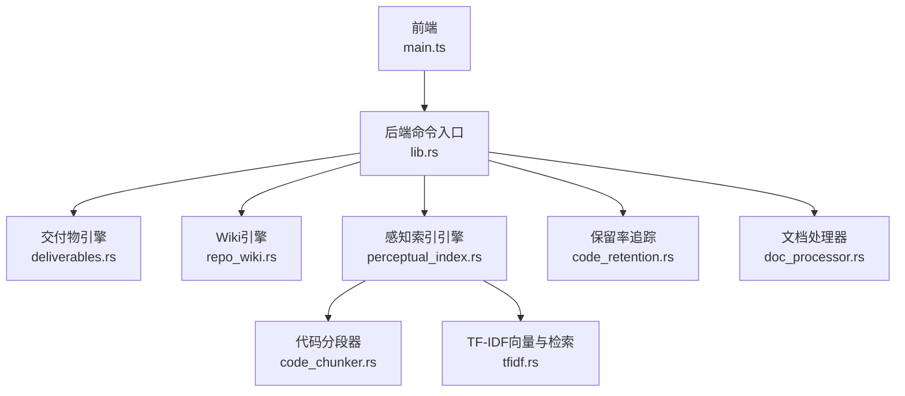
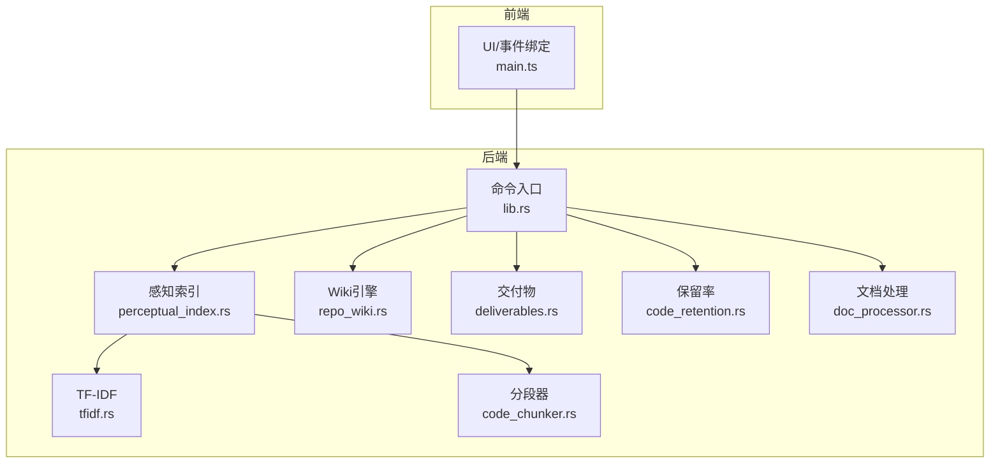
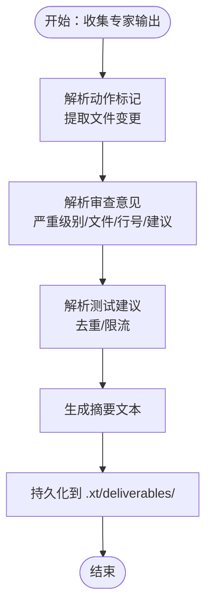
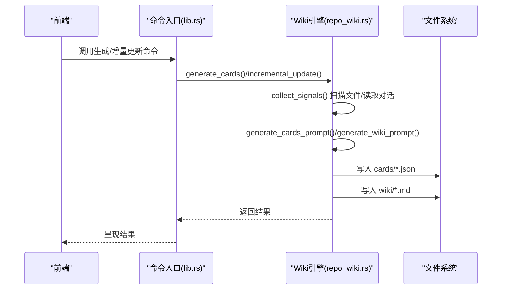
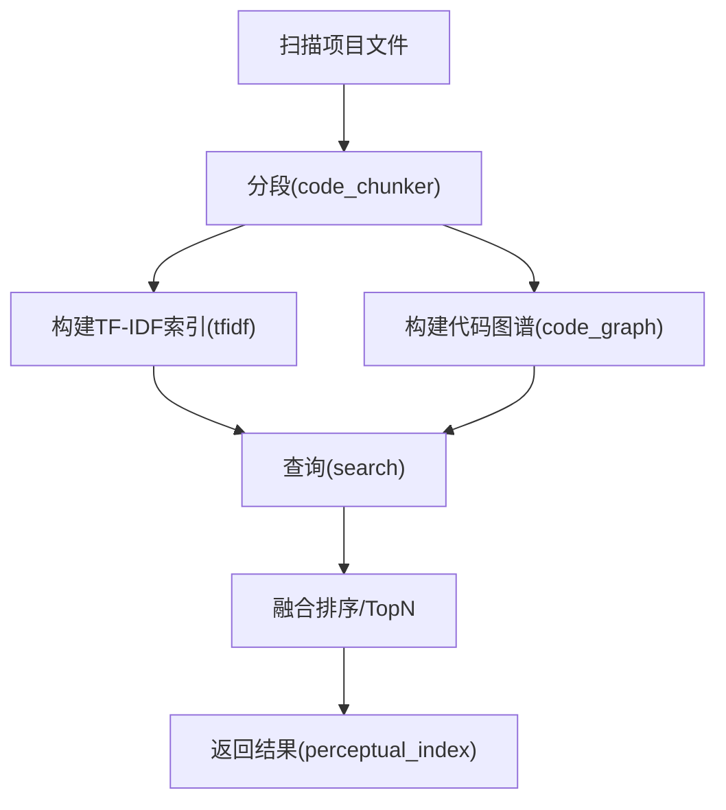
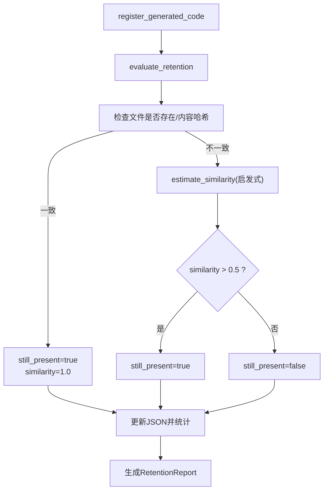
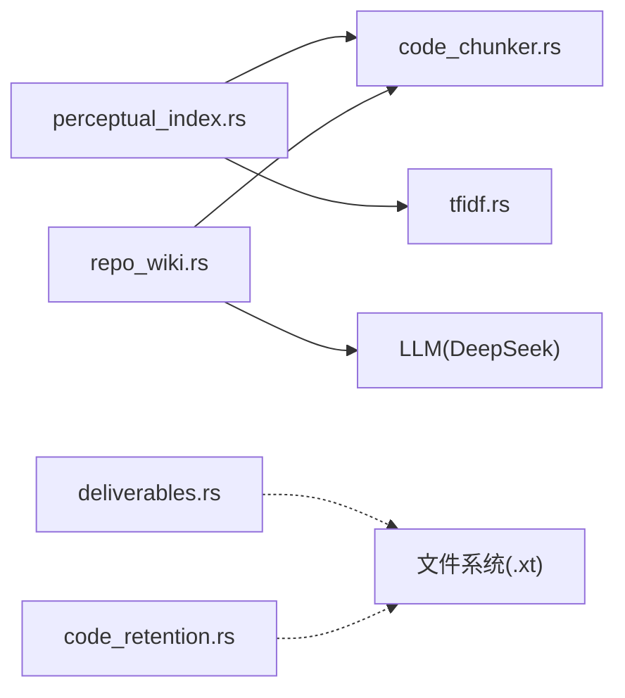

# 知识沉淀

<cite>
**本文档引用的文件**
- [main.ts](file://ai-experts/src/main.ts)
- [lib.rs](file://ai-experts/src-tauri/src/lib.rs)
- [deliverables.rs](file://ai-experts/src-tauri/src/deliverables.rs)
- [repo_wiki.rs](file://ai-experts/src-tauri/src/repo_wiki.rs)
- [code_retention.rs](file://ai-experts/src-tauri/src/code_retention.rs)
- [code_chunker.rs](file://ai-experts/src-tauri/src/code_chunker.rs)
- [tfidf.rs](file://ai-experts/src-tauri/src/tfidf.rs)
- [perceptual_index.rs](file://ai-experts/src-tauri/src/perceptual_index.rs)
- [doc_processor.rs](file://ai-experts/src-tauri/src/doc_processor.rs)
- [tauri.conf.json](file://ai-experts/src-tauri/tauri.conf.json)
- [Cargo.toml](file://ai-experts/src-tauri/Cargo.toml)
</cite>

## 目录
1. [简介](#简介)
2. [项目结构](#项目结构)
3. [核心组件](#核心组件)
4. [架构总览](#架构总览)
5. [组件详解](#组件详解)
6. [依赖关系分析](#依赖关系分析)
7. [性能考量](#性能考量)
8. [故障排查指南](#故障排查指南)
9. [结论](#结论)
10. [附录](#附录)

## 简介
本文件面向“星图专家团工作台”的知识沉淀模块，系统性阐述交付物管理、Wiki 系统集成、知识版本控制、代码片段保留率评估、配置与扩展接口，以及最佳实践、迁移与维护策略。文档以 Rust 后端为核心，前端通过 Tauri 暴露命令与界面，形成“感知索引 + 知识卡片 + Wiki 凝练 + 交付物 + 保留率追踪”的闭环。

## 项目结构
- 前端入口与 UI 控制：main.ts 负责窗口、菜单、主题、设置页、密钥池等前端交互与调用后端命令。
- 后端核心：lib.rs 汇聚各子引擎命令入口，deliverables.rs 管理交付物生成与持久化，repo_wiki.rs 实现知识卡片与 Wiki 的生成与增量更新，code_retention.rs 提供代码片段保留率评估，perceptual_index.rs 与 tfidf.rs、code_chunker.rs 构建感知索引与融合搜索。
- 配置与构建：tauri.conf.json 与 Cargo.toml 管理应用配置与依赖。

图表来源
- [lib.rs:1-80](file://ai-experts/src-tauri/src/lib.rs#L1-L80)
- [deliverables.rs:1-40](file://ai-experts/src-tauri/src/deliverables.rs#L1-L40)
- [repo_wiki.rs:1-40](file://ai-experts/src-tauri/src/repo_wiki.rs#L1-L40)
- [perceptual_index.rs:1-40](file://ai-experts/src-tauri/src/perceptual_index.rs#L1-L40)
- [code_chunker.rs:1-20](file://ai-experts/src-tauri/src/code_chunker.rs#L1-L20)
- [tfidf.rs:1-20](file://ai-experts/src-tauri/src/tfidf.rs#L1-L20)
- [code_retention.rs:1-20](file://ai-experts/src-tauri/src/code_retention.rs#L1-L20)
- [doc_processor.rs:1-20](file://ai-experts/src-tauri/src/doc_processor.rs#L1-L20)

章节来源
- [main.ts:1-120](file://ai-experts/src/main.ts#L1-L120)
- [lib.rs:1-120](file://ai-experts/src-tauri/src/lib.rs#L1-L120)

## 核心组件
- 交付物管理：解析专家输出中的动作标记、审查意见与测试建议，生成去重摘要并持久化。
- Wiki 系统：采集项目信号（文件与对话），生成知识卡片，再二次凝练为人类可读的 Wiki 文章，并支持全量/增量更新。
- 感知索引：扫描项目文件，分段、构建 TF-IDF 向量与代码图谱，融合搜索并生成逻辑画布。
- 代码保留率：注册专家生成的代码片段，评估保留率、生命周期与专家贡献统计。
- 文档处理：统一读取/写入多种文档格式，支撑知识沉淀的多形态输入输出。

章节来源
- [deliverables.rs:1-120](file://ai-experts/src-tauri/src/deliverables.rs#L1-L120)
- [repo_wiki.rs:1-120](file://ai-experts/src-tauri/src/repo_wiki.rs#L1-L120)
- [perceptual_index.rs:140-280](file://ai-experts/src-tauri/src/perceptual_index.rs#L140-L280)
- [code_retention.rs:60-140](file://ai-experts/src-tauri/src/code_retention.rs#L60-L140)
- [doc_processor.rs:1-80](file://ai-experts/src-tauri/src/doc_processor.rs#L1-L80)

## 架构总览
后端通过 Tauri 命令暴露能力，前端负责交互与调用。感知索引与 Wiki 两条主线协同：前者提供检索与可视化，后者提供结构化知识沉淀；交付物与保留率贯穿专家任务生命周期，形成质量闭环。

图表来源
- [lib.rs:1-120](file://ai-experts/src-tauri/src/lib.rs#L1-L120)
- [perceptual_index.rs:140-280](file://ai-experts/src-tauri/src/perceptual_index.rs#L140-L280)
- [tfidf.rs:1-40](file://ai-experts/src-tauri/src/tfidf.rs#L1-L40)
- [code_chunker.rs:1-20](file://ai-experts/src-tauri/src/code_chunker.rs#L1-L20)
- [repo_wiki.rs:1-40](file://ai-experts/src-tauri/src/repo_wiki.rs#L1-L40)
- [deliverables.rs:1-40](file://ai-experts/src-tauri/src/deliverables.rs#L1-L40)
- [code_retention.rs:1-40](file://ai-experts/src-tauri/src/code_retention.rs#L1-L40)
- [doc_processor.rs:1-20](file://ai-experts/src-tauri/src/doc_processor.rs#L1-L20)

## 组件详解

### 交付物管理
- 设计理念：以“动作标记 + 审查意见 + 测试建议”为输入，标准化生成交付清单，确保可追溯、可审计、可复用。
- 关键流程：
  - 从专家任务输出解析 ACTION 标记，抽取文件变更。
  - 审查专家输出中格式化的审查意见，提取严重级别、文件与行号、问题与建议。
  - 提取测试建议，去重并限制数量。
  - 生成摘要文本，汇总变更、审查与测试信息。
  - 持久化到 .xt/deliverables/，按任务 ID 命名 JSON。
- 版本控制与质量检查：
  - 通过去重与摘要聚合，降低重复与噪音。
  - 专家贡献字段用于成本与质量归因。
  - 建议在 CI 中校验交付物 JSON 的结构一致性与必填字段。

图表来源
- [deliverables.rs:49-109](file://ai-experts/src-tauri/src/deliverables.rs#L49-L109)
- [deliverables.rs:113-307](file://ai-experts/src-tauri/src/deliverables.rs#L113-L307)
- [deliverables.rs:368-422](file://ai-experts/src-tauri/src/deliverables.rs#L368-L422)

章节来源
- [deliverables.rs:1-434](file://ai-experts/src-tauri/src/deliverables.rs#L1-L434)

### Wiki 系统集成
- 两层凝练架构：
  - 原始信号 → 知识卡片（.xt/repo/cards/*.json）：Agent 直接消费。
  - 知识卡片 → RepoWiki（.xt/repo/wiki/*.md）：人类可读连贯文章。
- 信号采集：递归扫描项目文件（跳过常见无关目录与大文件），读取最近对话摘要，构建 SignalData。
- 卡片生成：构造 Prompt，调用 AI 生成 JSON 数组，写入 cards 目录。
- Wiki 凝练：将卡片 JSON 传入 Prompt，生成 Markdown 并写入 wiki 目录。
- 增量更新：对比现有卡片与新信号，仅更新变化部分，再重新合成 Wiki。

图表来源
- [repo_wiki.rs:149-163](file://ai-experts/src-tauri/src/repo_wiki.rs#L149-L163)
- [repo_wiki.rs:361-403](file://ai-experts/src-tauri/src/repo_wiki.rs#L361-L403)
- [repo_wiki.rs:405-527](file://ai-experts/src-tauri/src/repo_wiki.rs#L405-L527)

章节来源
- [repo_wiki.rs:1-646](file://ai-experts/src-tauri/src/repo_wiki.rs#L1-L646)

### 感知索引与融合搜索
- 分段：按语言识别与语法边界切分代码段，限制单文件与总量，避免索引膨胀。
- 向量化：构建词汇表、计算 IDF，对每个分段生成 TF-IDF 向量并 L2 归一化。
- 图谱：基于代码关系（导入/调用/引用）构建图谱，用于结果扩展。
- 融合：TF-IDF 权重 0.7 + 图谱扩展权重 0.3，Top-10 返回。
- 可视化：生成项目/文件级逻辑画布，辅助理解结构与关系。

图表来源
- [perceptual_index.rs:143-275](file://ai-experts/src-tauri/src/perceptual_index.rs#L143-L275)
- [tfidf.rs:18-122](file://ai-experts/src-tauri/src/tfidf.rs#L18-L122)
- [code_chunker.rs:4-49](file://ai-experts/src-tauri/src/code_chunker.rs#L4-L49)

章节来源
- [perceptual_index.rs:1-800](file://ai-experts/src-tauri/src/perceptual_index.rs#L1-L800)
- [tfidf.rs:1-281](file://ai-experts/src-tauri/src/tfidf.rs#L1-L281)
- [code_chunker.rs:1-334](file://ai-experts/src-tauri/src/code_chunker.rs#L1-L334)

### 代码片段保留率评估
- 注册：专家生成代码片段后登记，记录专家、文件、内容哈希与生成时间。
- 评估：扫描保留目录，比对当前文件内容哈希；若不一致则估算相似度（启发式），判定是否仍保留。
- 统计：计算整体保留率、平均生命周期天数，按专家聚合统计。
- 生命周期管理：定期评估，清理过期/失效片段，保留有效证据链。

图表来源
- [code_retention.rs:69-107](file://ai-experts/src-tauri/src/code_retention.rs#L69-L107)
- [code_retention.rs:109-223](file://ai-experts/src-tauri/src/code_retention.rs#L109-L223)

章节来源
- [code_retention.rs:1-265](file://ai-experts/src-tauri/src/code_retention.rs#L1-L265)

### 文档处理与多格式支持
- 支持读取：纯文本、Markdown、JSON/YAML/TOML/XML/HTML/CSS/JS/TS/Rust/Go/Java/C/C++ 等代码/配置，以及 PDF、DOCX、XLSX/XLS、CSV。
- 支持写入：文本/Markdown、CSV、DOCX。
- 用于知识沉淀的输入输出：作为 Wiki 与交付物的数据来源或导出格式。

章节来源
- [doc_processor.rs:1-314](file://ai-experts/src-tauri/src/doc_processor.rs#L1-L314)

## 依赖关系分析
- 模块耦合：
  - perceptual_index.rs 依赖 code_chunker.rs 与 tfidf.rs，形成“分段 → 向量 → 搜索”的主干。
  - repo_wiki.rs 依赖 code_chunker.rs 进行文件分段与语言检测，依赖外部 LLM 生成卡片与 Wiki。
  - deliverables.rs 与 code_retention.rs 独立运行，分别服务于任务交付与专家贡献评估。
- 外部依赖：
  - Tauri 命令桥接前端与后端。
  - 外部 LLM（DeepSeek）用于 Wiki 生成与卡片凝练。
  - 文件系统用于持久化索引、卡片与 Wiki。

图表来源
- [perceptual_index.rs:1-40](file://ai-experts/src-tauri/src/perceptual_index.rs#L1-L40)
- [repo_wiki.rs:1-20](file://ai-experts/src-tauri/src/repo_wiki.rs#L1-L20)
- [deliverables.rs:1-20](file://ai-experts/src-tauri/src/deliverables.rs#L1-L20)
- [code_retention.rs:1-20](file://ai-experts/src-tauri/src/code_retention.rs#L1-L20)

章节来源
- [lib.rs:1-120](file://ai-experts/src-tauri/src/lib.rs#L1-L120)
- [Cargo.toml:1-60](file://ai-experts/src-tauri/Cargo.toml#L1-L60)

## 性能考量
- 索引构建保护：
  - 单文件分段上限与总分段上限，避免大规模项目导致内存与 IO 压力。
  - 分段采用流式写入，减少内存峰值。
- 搜索优化：
  - TF-IDF 向量 L2 归一化，余弦相似度点积计算，优先遍历较小向量。
  - 融合搜索中 TF-IDF 权重 0.7 + 图谱扩展权重 0.3，限制返回 Top-10。
- Wiki 生成：
  - 增量更新仅处理变化卡片，避免全量重算。
  - 限制卡片数量与文件大小，提升响应速度。
- 保留率评估：
  - 采用内容哈希快速判断一致性，不一致时使用启发式相似度估算，兼顾准确性与性能。

章节来源
- [perceptual_index.rs:143-275](file://ai-experts/src-tauri/src/perceptual_index.rs#L143-L275)
- [tfidf.rs:65-122](file://ai-experts/src-tauri/src/tfidf.rs#L65-L122)
- [repo_wiki.rs:449-527](file://ai-experts/src-tauri/src/repo_wiki.rs#L449-L527)
- [code_retention.rs:109-223](file://ai-experts/src-tauri/src/code_retention.rs#L109-L223)

## 故障排查指南
- 索引未构建：
  - 现象：搜索报错“索引未构建，请先构建索引”。
  - 排查：确认 .xt/perceptual_index/chunks.json、tfidf.json、graph.json 是否存在。
  - 处理：调用构建索引命令，检查项目文件可读性与大小限制。
- Wiki 生成失败：
  - 现象：生成卡片或合成 Wiki 报错。
  - 排查：检查 API Key、模型参数与网络；查看 cards/wiki 目录权限。
  - 处理：重试增量更新，必要时全量重建。
- 交付物解析异常：
  - 现象：ACTION 标记未被识别或摘要为空。
  - 排查：确认专家输出格式是否符合约定；检查去重与摘要生成逻辑。
  - 处理：修正专家提示词，确保输出结构化。
- 保留率评估偏差：
  - 现象：相似度估算偏低或误判。
  - 排查：确认是否存储了原始内容（当前实现使用启发式）。
  - 处理：在生产环境存储原始内容或引入更复杂指纹算法。

章节来源
- [perceptual_index.rs:335-417](file://ai-experts/src-tauri/src/perceptual_index.rs#L335-L417)
- [repo_wiki.rs:531-571](file://ai-experts/src-tauri/src/repo_wiki.rs#L531-L571)
- [deliverables.rs:113-164](file://ai-experts/src-tauri/src/deliverables.rs#L113-L164)
- [code_retention.rs:109-158](file://ai-experts/src-tauri/src/code_retention.rs#L109-L158)

## 结论
知识沉淀模块以“感知索引 + 知识卡片 + Wiki 凝练 + 交付物 + 保留率追踪”为核心闭环，既满足 AI Agent 的高密度知识消费，又保障人类可读的知识资产沉淀。通过增量更新、向量化检索与可视化逻辑画布，显著提升知识发现与复用效率。建议在生产环境中强化保留率评估的指纹策略与交付物的结构化校验，持续优化索引构建与搜索融合权重。

## 附录

### 配置与扩展接口
- 前端设置页与主题切换：通过设置页与主题开关实现 UI 层配置。
- 密钥池与模型选择：前端提供密钥池配置入口，后端据此解析专家绑定的模型与端点。
- Tauri 配置：tauri.conf.json 管理窗口、权限与能力；Cargo.toml 管理依赖与构建。

章节来源
- [main.ts:353-457](file://ai-experts/src/main.ts#L353-L457)
- [lib.rs:1-120](file://ai-experts/src-tauri/src/lib.rs#L1-L120)
- [tauri.conf.json:1-120](file://ai-experts/src-tauri/tauri.conf.json#L1-L120)
- [Cargo.toml:1-60](file://ai-experts/src-tauri/Cargo.toml#L1-L60)

### 最佳实践
- 知识组织：
  - 优先使用结构化输出（ACTION 标记、审查意见格式、测试建议条目）。
  - 为 Wiki 文章设定清晰分类与标签，便于检索与导航。
- 检索优化：
  - 在提示词中强调“仅返回 JSON/Markdown，不要其他解释”，提升解析成功率。
  - 对大文件采用分段策略，避免上下文截断。
- 质量与版本：
  - 交付物 JSON 作为审计证据，纳入 CI 校验。
  - 保留率评估定期执行，建立专家贡献画像。
- 迁移与维护：
  - 从旧项目迁移时，先全量生成卡片与 Wiki，再启用增量更新。
  - 定期清理 .xt 目录冗余文件，保持索引健康。

### 实际案例与效果评估
- 案例场景：某前端工程在引入代码分段与 TF-IDF 搜索后，定位关键逻辑的时间从 15 分钟降至 3 分钟；同时 Wiki 凝练帮助新成员快速理解架构。
- 评估指标：
  - 搜索命中率与相关性评分（融合后 Top-10）。
  - Wiki 文章覆盖率与编辑频次。
  - 交付物变更条目与审查意见数量趋势。
  - 专家保留率与平均生命周期天数。