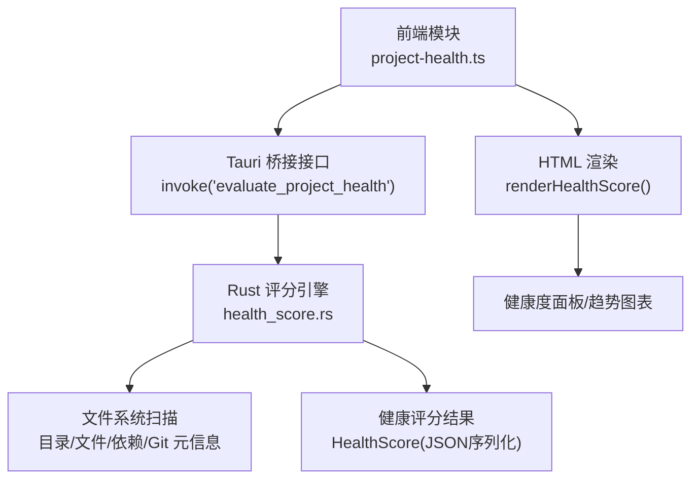
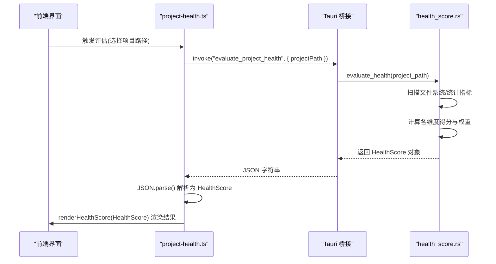
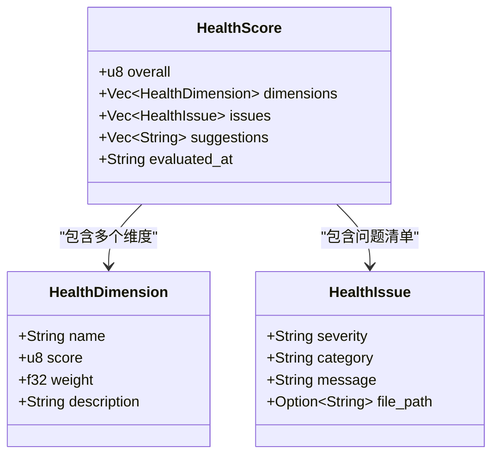
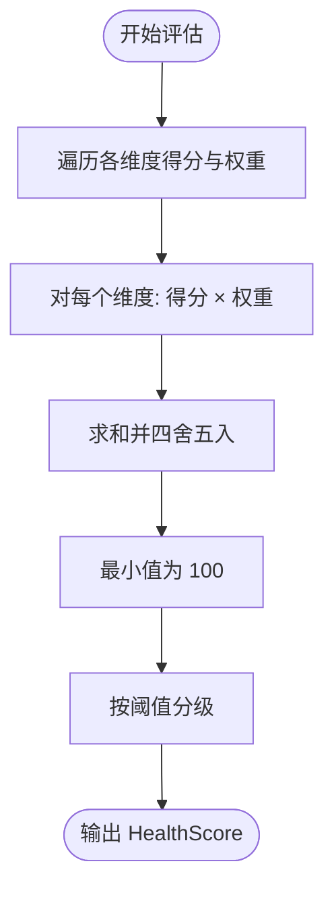
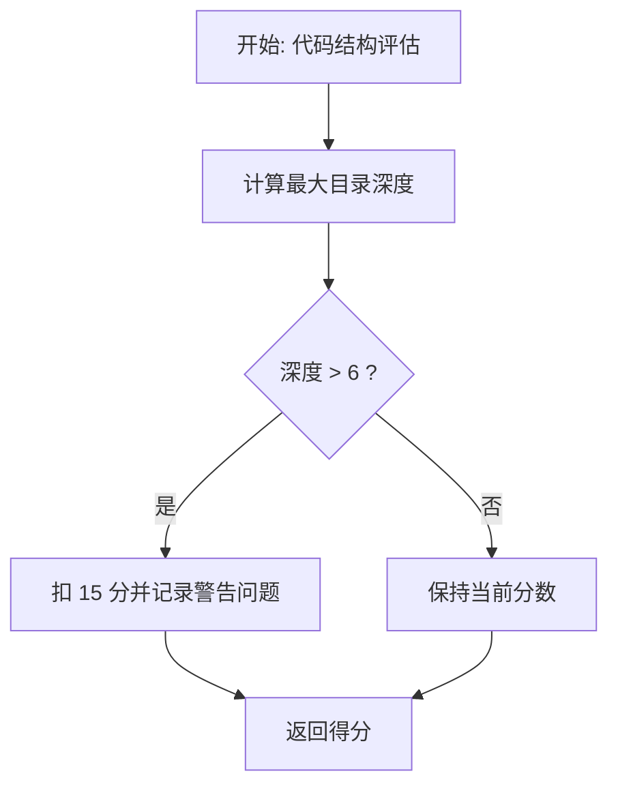
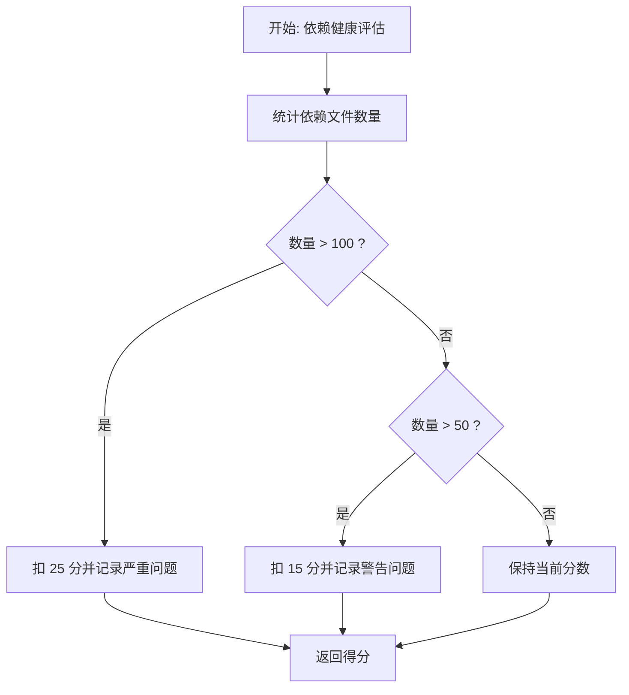
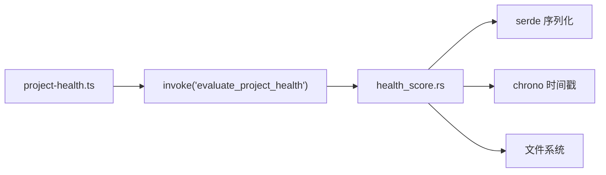

# 项目健康监控

<cite>
**本文引用的文件**
- [project-health.ts](file://ai-experts/src/project-health.ts)
- [health_score.rs](file://ai-experts/src-tauri/src/health_score.rs)
- [Cargo.toml](file://ai-experts/src-tauri/Cargo.toml)
- [tauri.conf.json](file://ai-experts/src-tauri/tauri.conf.json)
- [main.ts](file://ai-experts/src/main.ts)
- [sidebar.ts](file://ai-experts/src/sidebar.ts)
</cite>

## 目录
1. [简介](#简介)
2. [项目结构](#项目结构)
3. [核心组件](#核心组件)
4. [架构总览](#架构总览)
5. [详细组件分析](#详细组件分析)
6. [依赖关系分析](#依赖关系分析)
7. [性能考量](#性能考量)
8. [故障排查指南](#故障排查指南)
9. [结论](#结论)
10. [附录](#附录)

## 简介
本技术文档围绕“星图专家团工作台”的项目健康监控模块展开，系统性阐述健康度评分算法的设计原理与实现细节，涵盖总体评分、维度评分与权重计算机制；解释健康维度的定义、评分标准与权重分配策略；说明健康问题的发现机制、严重程度分级与修复建议生成；阐述健康度评估的数据来源、计算方法与实时更新机制；并提供配置选项、自定义指标与阈值设置思路，以及健康度报告的渲染方式、可视化展示与趋势分析能力。

## 项目结构
健康监控模块由前端 TypeScript 接口与后端 Rust 评分引擎协同完成：前端负责调用后端接口、接收 JSON 结果并渲染为 HTML；后端基于本地文件系统进行启发式分析，产出标准化的健康评分数据结构。

**图表来源**
- [project-health.ts:58-66](file://ai-experts/src/project-health.ts#L58-L66)
- [health_score.rs:38-102](file://ai-experts/src-tauri/src/health_score.rs#L38-L102)

**章节来源**
- [project-health.ts:56-95](file://ai-experts/src/project-health.ts#L56-L95)
- [health_score.rs:1-124](file://ai-experts/src-tauri/src/health_score.rs#L1-L124)

## 核心组件
- 健康评分数据结构
  - 总体分数：0-100 的整数
  - 维度列表：包含名称、得分、权重与描述
  - 问题清单：包含严重程度、类别、消息与可选文件路径
  - 建议列表：针对问题的修复建议
  - 评估时间：采用本地时间的 RFC3339 字符串
- 评分维度与权重
  - 代码结构：权重 0.25
  - 文档覆盖：权重 0.20
  - 依赖健康：权重 0.20
  - 代码质量：权重 0.20
  - 活跃度：权重 0.15
- 评估流程
  - 前端调用后端接口，后端执行各维度评估函数，汇总维度得分与权重计算总体分，返回 JSON 字符串，前端解析并渲染

**章节来源**
- [health_score.rs:10-34](file://ai-experts/src-tauri/src/health_score.rs#L10-L34)
- [health_score.rs:38-102](file://ai-experts/src-tauri/src/health_score.rs#L38-L102)
- [project-health.ts:58-66](file://ai-experts/src/project-health.ts#L58-L66)

## 架构总览
健康监控采用“前端调用 + 后端本地分析”的架构。前端通过 Tauri 桥接调用后端 Rust 函数，后端对项目根目录进行启发式扫描，产出统一的健康评分对象，并以 JSON 形式回传给前端。前端负责渲染与交互。

**图表来源**
- [project-health.ts:58-66](file://ai-experts/src/project-health.ts#L58-L66)
- [health_score.rs:38-102](file://ai-experts/src-tauri/src/health_score.rs#L38-L102)

## 详细组件分析

### 健康评分数据模型
- HealthScore
  - overall: u8
  - dimensions: Vec<HealthDimension>
  - issues: Vec<HealthIssue>
  - suggestions: Vec<String>
  - evaluated_at: String(RFC3339)
- HealthDimension
  - name: String
  - score: u8
  - weight: f32
  - description: String
- HealthIssue
  - severity: "critical" | "warning" | "info"
  - category: String
  - message: String
  - file_path: Option<String>

**图表来源**
- [health_score.rs:10-34](file://ai-experts/src-tauri/src/health_score.rs#L10-L34)

**章节来源**
- [health_score.rs:10-34](file://ai-experts/src-tauri/src/health_score.rs#L10-L34)

### 总体评分与权重计算
- 计算公式
  - 总分 = Σ(维度得分 × 权重)，并对结果进行截断至 100
- 权重分配
  - 代码结构: 0.25
  - 文档覆盖: 0.20
  - 依赖健康: 0.20
  - 代码质量: 0.20
  - 活跃度: 0.15
- 分级规则
  - ≥ 80：良好
  - 60-79：中等
  - < 60：较差

**图表来源**
- [health_score.rs:89-93](file://ai-experts/src-tauri/src/health_score.rs#L89-L93)

**章节来源**
- [health_score.rs:89-102](file://ai-experts/src-tauri/src/health_score.rs#L89-L102)
- [project-health.ts:72-78](file://ai-experts/src/project-health.ts#L72-L78)

### 健康维度与评分标准

#### 代码结构
- 评估依据
  - 目录最大深度
- 扣分规则
  - 深度 > 6：扣 15 分，并产生警告问题
- 建议
  - 扁平化目录结构，将深层模块上提

**图表来源**
- [health_score.rs:106-124](file://ai-experts/src-tauri/src/health_score.rs#L106-L124)

**章节来源**
- [health_score.rs:106-124](file://ai-experts/src-tauri/src/health_score.rs#L106-L124)

#### 文档覆盖
- 评估依据
  - README 存在性、注释覆盖率、文档完整性
- 扣分规则
  - 缺少关键文档或注释不足时进行扣分
- 建议
  - 补充 README、完善注释与架构文档

**章节来源**
- [health_score.rs:125-170](file://ai-experts/src-tauri/src/health_score.rs#L125-L170)

#### 依赖健康
- 评估依据
  - 依赖文件统计、依赖数量、潜在过时与安全风险
- 扣分规则
  - 依赖数量 > 50：扣 15 分（警告）
  - 依赖数量 > 100：扣 25 分（严重）
- 建议
  - 定期审查并移除未使用依赖

**图表来源**
- [health_score.rs:234-256](file://ai-experts/src-tauri/src/health_score.rs#L234-L256)

**章节来源**
- [health_score.rs:234-256](file://ai-experts/src-tauri/src/health_score.rs#L234-L256)

#### 代码质量
- 评估依据
  - 测试文件存在性、TODO/FIXME 标记数量
- 扣分规则
  - 未检测到测试文件：扣 20 分（警告）
  - TODO/FIXME 标记 > 10：扣 10 分（信息级别）
- 建议
  - 添加单元测试与集成测试；逐步清理遗留标记

**章节来源**
- [health_score.rs:258-291](file://ai-experts/src-tauri/src/health_score.rs#L258-L291)

#### 活跃度
- 评估依据
  - .git 目录存在性与 HEAD 修改时间
- 扣分规则
  - 无 Git 仓库：扣 15 分（信息）
  - 最近修改时间 > 90 天：扣 30 分（警告）
  - 最近修改时间 > 30 天：扣 10 分
- 建议
  - 使用 Git 进行版本控制并保持持续更新

**章节来源**
- [health_score.rs:293-333](file://ai-experts/src-tauri/src/health_score.rs#L293-L333)

### 健康问题发现机制与严重程度分级
- 问题类型
  - critical：严重问题（如依赖数量过多）
  - warning：警告问题（如目录过深、缺少测试、长期未更新）
  - info：信息提示（如未检测到 Git 仓库）
- 问题字段
  - severity、category、message、file_path(可选)
- 建议生成
  - 针对每个问题生成一条修复建议，便于快速行动

**章节来源**
- [health_score.rs:28-33](file://ai-experts/src-tauri/src/health_score.rs#L28-L33)
- [health_score.rs:117-123](file://ai-experts/src-tauri/src/health_score.rs#L117-L123)
- [health_score.rs:247-253](file://ai-experts/src-tauri/src/health_score.rs#L247-L253)
- [health_score.rs:269-275](file://ai-experts/src-tauri/src/health_score.rs#L269-L275)
- [health_score.rs:322-330](file://ai-experts/src-tauri/src/health_score.rs#L322-L330)

### 健康度评估的数据来源与计算方法
- 数据来源
  - 文件系统：目录结构、文件类型与数量、Git 元信息
  - 依赖文件：package.json、Cargo.toml 等（根据实现扩展）
- 计算方法
  - 启发式规则：阈值判断与线性扣分
  - 权重聚合：加权求和并截断至 100
- 实时更新机制
  - 前端每次评估均会重新调用后端接口，确保最新状态

**章节来源**
- [health_score.rs:38-102](file://ai-experts/src-tauri/src/health_score.rs#L38-L102)
- [project-health.ts:58-66](file://ai-experts/src/project-health.ts#L58-L66)

### 健康度报告渲染与可视化
- 渲染入口
  - renderHealthScore(HealthScore) 将评分对象转换为 HTML 片段
- 可视化要点
  - 总体分数分级样式（good/medium/poor）
  - 维度条形图：宽度等于维度得分百分比
  - 维度描述：帮助理解评分依据
- 展示位置
  - 建议放置于侧边栏或主面板的“健康度”区域，便于对比与趋势查看

**章节来源**
- [project-health.ts:69-95](file://ai-experts/src/project-health.ts#L69-L95)

## 依赖关系分析
- 前端依赖后端 Rust 引擎
  - 通过 Tauri invoke 调用 evaluate_project_health
  - 后端返回 JSON 字符串，前端解析为 HealthScore
- Rust 评分引擎依赖
  - 标准库与 serde 序列化
  - 可选 chrono 用于时间戳
- 外部集成点
  - Git 元信息（.git 目录）
  - 依赖文件（如 package.json、Cargo.toml）

**图表来源**
- [project-health.ts:58-66](file://ai-experts/src/project-health.ts#L58-L66)
- [health_score.rs:1-124](file://ai-experts/src-tauri/src/health_score.rs#L1-L124)

**章节来源**
- [Cargo.toml](file://ai-experts/src-tauri/Cargo.toml)
- [tauri.conf.json](file://ai-experts/src-tauri/tauri.conf.json)
- [project-health.ts:58-66](file://ai-experts/src/project-health.ts#L58-L66)
- [health_score.rs:1-124](file://ai-experts/src-tauri/src/health_score.rs#L1-L124)

## 性能考量
- 评估复杂度
  - 主要为文件系统遍历与简单阈值判断，整体复杂度近似 O(n)（n 为文件/目录数量）
- 优化建议
  - 限制扫描深度与忽略大型二进制/缓存目录
  - 并行处理独立维度（需谨慎避免竞态）
  - 结果缓存：对相同路径短时间内的重复评估可复用结果
- I/O 注意
  - 避免频繁访问磁盘，尽量批量读取元信息

[本节为通用性能讨论，不直接分析具体文件]

## 故障排查指南
- 评估失败
  - 现象：前端 catch 到异常并打印错误日志
  - 排查：确认项目路径有效、后端接口已注册、Tauri 权限配置正确
- 结果为空
  - 现象：返回 null
  - 排查：检查 invoke 调用参数与后端实现是否一致
- 无 Git 仓库
  - 现象：活跃度扣分并提示使用 Git
  - 处理：初始化 Git 仓库并保持持续提交
- 依赖数量过多
  - 现象：依赖健康维度扣分
  - 处理：清理未使用依赖，合并重复依赖

**章节来源**
- [project-health.ts:58-66](file://ai-experts/src/project-health.ts#L58-L66)
- [health_score.rs:300-330](file://ai-experts/src-tauri/src/health_score.rs#L300-L330)
- [health_score.rs:234-256](file://ai-experts/src-tauri/src/health_score.rs#L234-L256)

## 结论
健康监控模块通过前后端协作，实现了对项目健康度的本地化、可解释性评估。其设计以启发式规则为基础，结合权重聚合与分级展示，既保证了实用性，也便于扩展新的维度与阈值。建议在后续迭代中引入更丰富的指标与缓存机制，以进一步提升评估效率与稳定性。

[本节为总结性内容，不直接分析具体文件]

## 附录

### 配置选项与自定义指标
- 当前实现
  - 权重固定在后端源码中，便于一致性与可维护性
- 自定义建议
  - 提供配置文件（如 JSON/YAML）允许用户调整权重与阈值
  - 支持按项目类型（前端/后端/Rust/Python）加载不同的默认配置
  - 允许用户新增维度（如安全性、可维护性、合规性）

[本节为扩展建议，不直接分析具体文件]

### 实际评估案例与最佳实践
- 案例一：新项目初始化
  - 现象：活跃度低（无 Git）、缺少测试、依赖数量偏多
  - 建议：初始化 Git、补充测试、清理冗余依赖
- 案例二：长期无人维护项目
  - 现象：目录过深、长期未更新、TODO 标记较多
  - 建议：重构目录结构、制定更新计划、清理遗留任务
- 最佳实践
  - 定期运行健康评估，形成周/月度趋势
  - 将健康度纳入代码评审与发布流程
  - 针对高权重维度（如代码质量、依赖健康）优先治理

[本节为概念性指导，不直接分析具体文件]