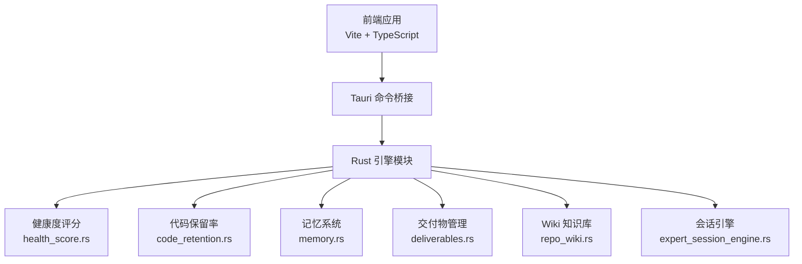
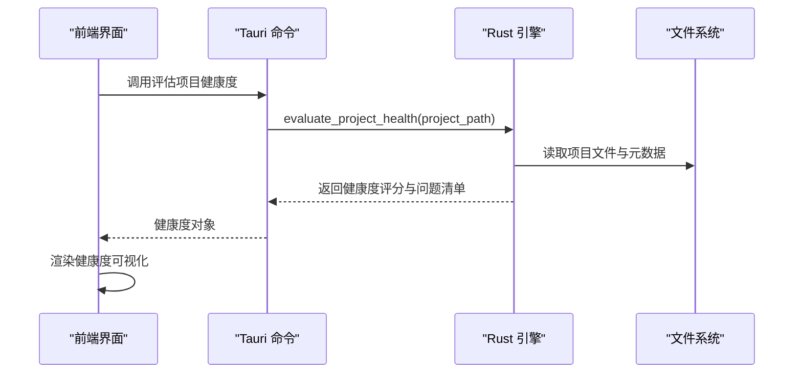
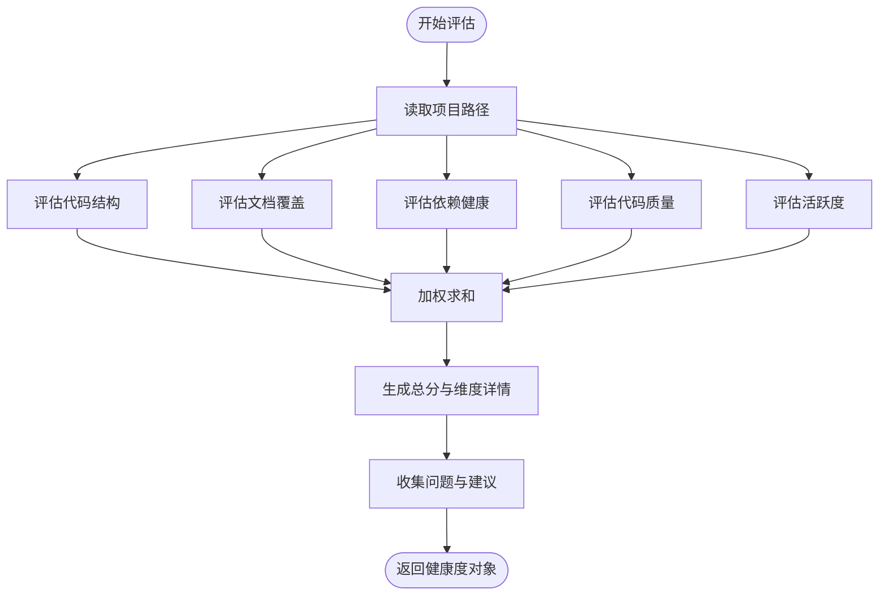
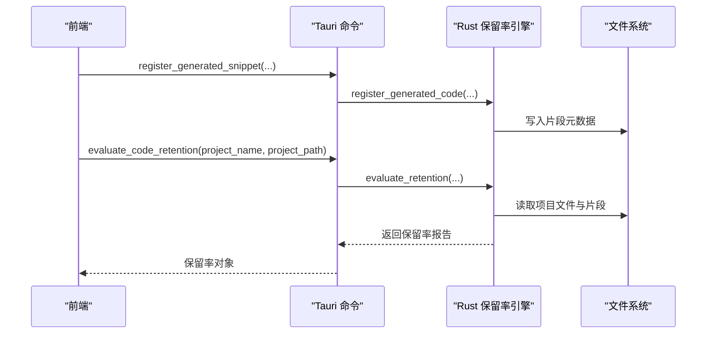
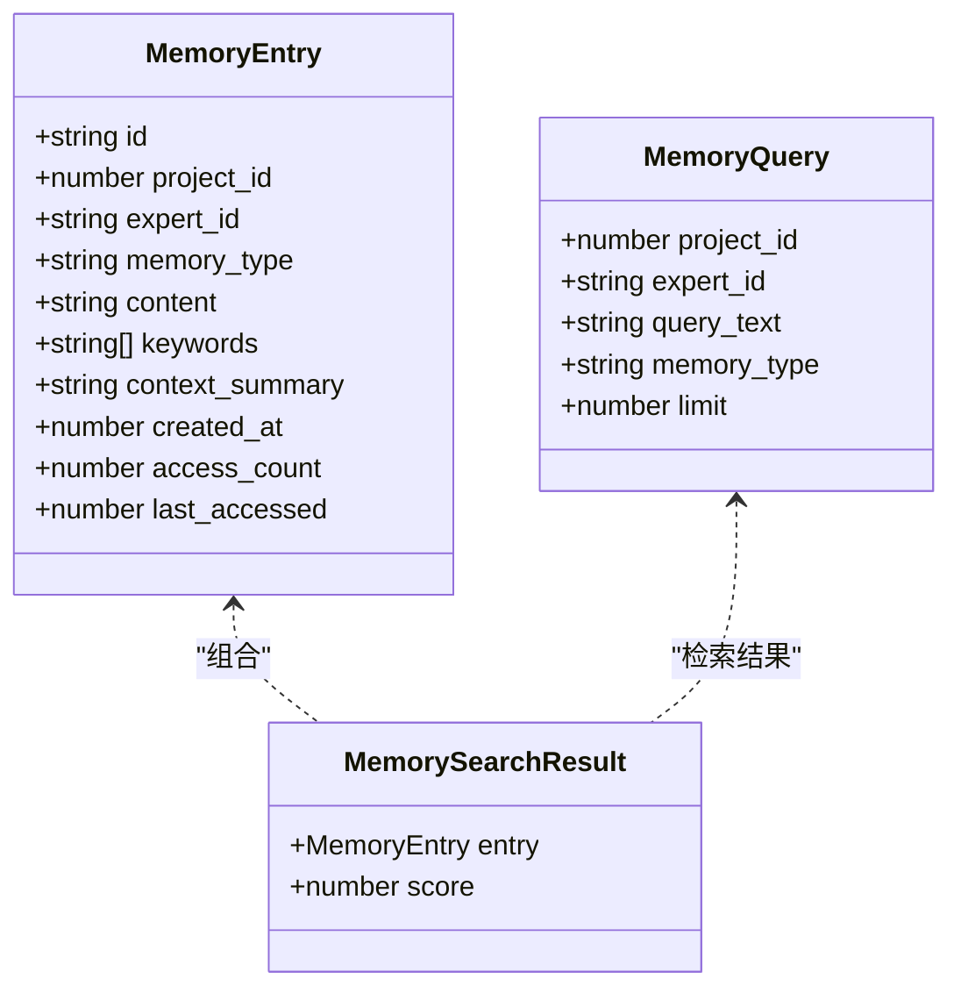
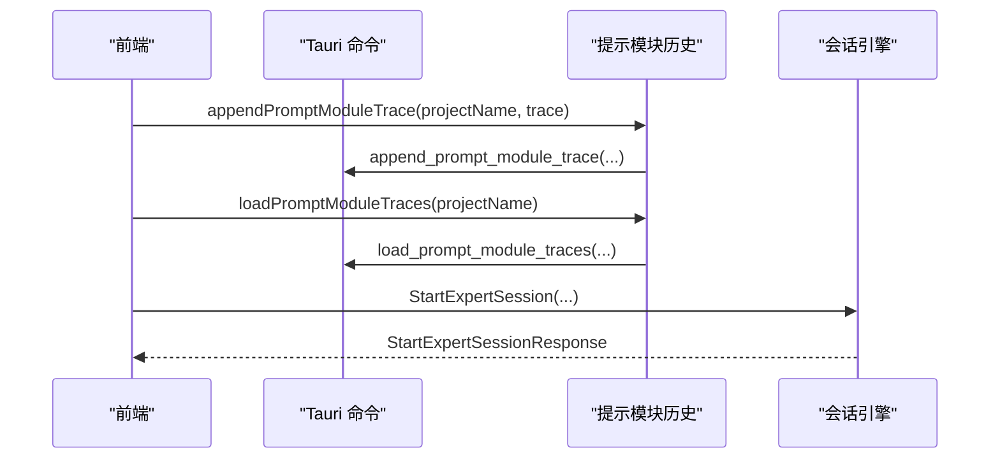
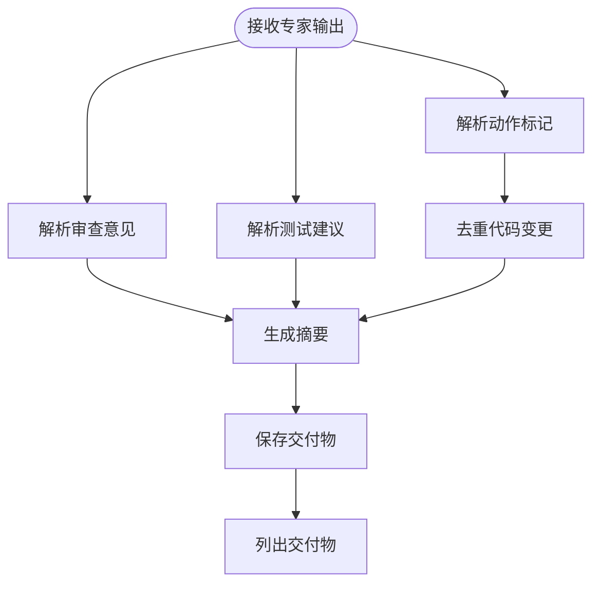
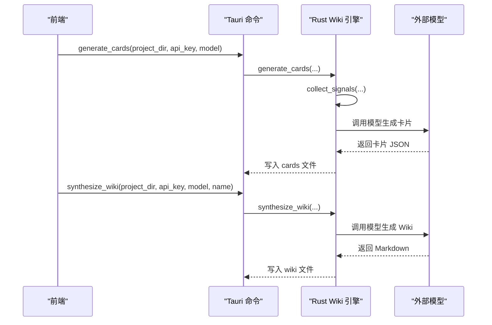
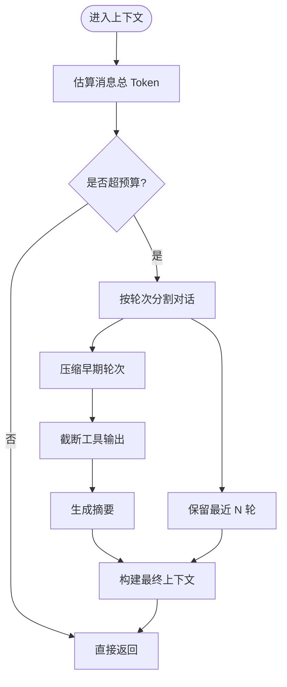
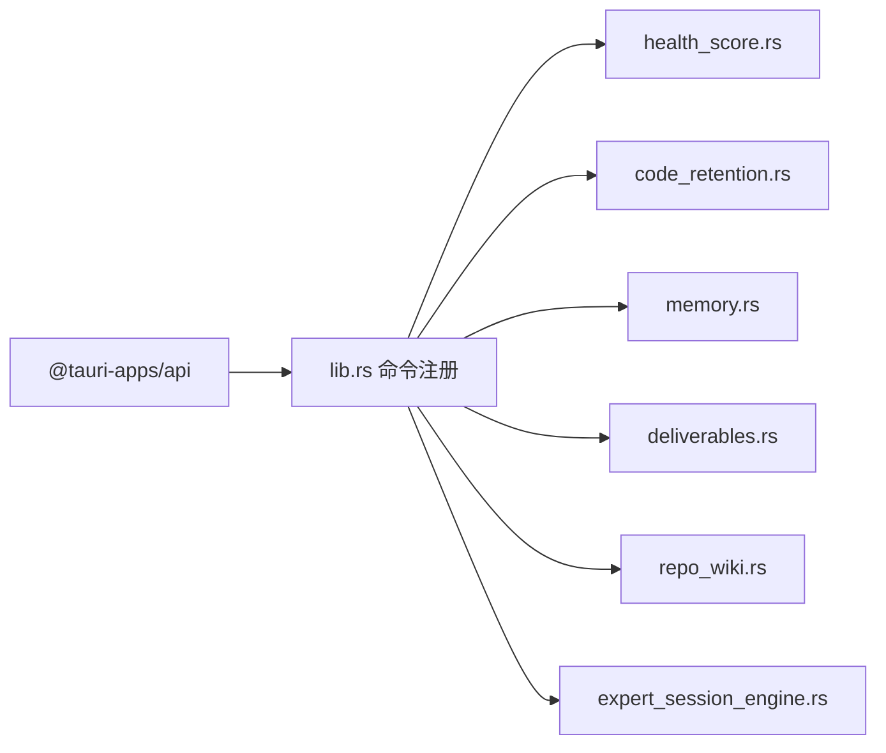

# 项目管理系统

<cite>
**本文引用的文件**
- [project-health.ts](file://ai-experts/src/project-health.ts)
- [memory-store.ts](file://ai-experts/src/memory-store.ts)
- [context-manager.ts](file://ai-experts/src/context-manager.ts)
- [prompt-module-history.ts](file://ai-experts/src/prompt-module-history.ts)
- [health_score.rs](file://ai-experts/src-tauri/src/health_score.rs)
- [deliverables.rs](file://ai-experts/src-tauri/src/deliverables.rs)
- [repo_wiki.rs](file://ai-experts/src-tauri/src/repo_wiki.rs)
- [expert_session_engine.rs](file://ai-experts/src-tauri/src/expert_session_engine.rs)
- [code_retention.rs](file://ai-experts/src-tauri/src/code_retention.rs)
- [memory.rs](file://ai-experts/src-tauri/src/memory.rs)
- [lib.rs](file://ai-experts/src-tauri/src/lib.rs)
- [main.rs](file://ai-experts/src-tauri/src/main.rs)
- [package.json](file://ai-experts/package.json)
</cite>

## 目录
1. [简介](#简介)
2. [项目结构](#项目结构)
3. [核心组件](#核心组件)
4. [架构总览](#架构总览)
5. [详细组件分析](#详细组件分析)
6. [依赖关系分析](#依赖关系分析)
7. [性能考量](#性能考量)
8. [故障排查指南](#故障排查指南)
9. [结论](#结论)
10. [附录](#附录)

## 简介
本技术文档面向“星图专家团工作台”的项目管理系统，围绕项目健康监控、会话管理与知识沉淀三大主题，系统性阐述健康度评分算法、风险评估机制、质量指标体系、会话创建与维护、历史记录管理与状态同步、交付物管理、Wiki 系统集成与知识版本控制等能力的设计原理与实现细节，并提供最佳实践、性能监控策略、扩展接口与配置项说明，辅以实际案例帮助快速落地。

## 项目结构
前端采用 Vite + TypeScript，后端基于 Tauri 调用 Rust 模块，形成“前端 JS/TS + Tauri 命令 + Rust 引擎”的分层架构。核心模块包括：
- 健康度评分与代码保留率：Rust 模块负责静态分析与评分，前端封装调用与渲染。
- 记忆系统：Rust SQLite 存储 + TF-IDF 关键词检索，前端提供便捷 API。
- 会话与提示模块历史：前后端协同，支持会话痕迹抽取与历史提示建议。
- 交付物与 Wiki：Rust 负责解析与持久化，前端负责展示与交互。
- 上下文管理：前端 Token 预算与自动压缩，保障长对话稳定性。

**图表来源**
- [lib.rs:1-800](file://ai-experts/src-tauri/src/lib.rs#L1-L800)
- [main.rs:1-6](file://ai-experts/src-tauri/src/main.rs#L1-L6)

**章节来源**
- [package.json:1-28](file://ai-experts/package.json#L1-L28)
- [lib.rs:1-800](file://ai-experts/src-tauri/src/lib.rs#L1-L800)

## 核心组件
- 项目健康监控：前端调用 Rust 命令进行本地健康度评估，返回多维度评分与问题清单，前端负责可视化渲染。
- 会话与提示模块历史：前端封装提示模块调用痕迹的保存、加载与去重，支持从会话中派生历史提示建议。
- 记忆系统：前端提供记忆保存、检索、删除、清空、生命周期管理与 Token 预算增强检索的 API；Rust 负责持久化与 TF-IDF 检索。
- 交付物管理：Rust 解析专家输出中的动作标记、审查意见与测试建议，生成标准化交付物并持久化。
- Wiki 知识库：Rust 扫描项目信号、生成知识卡片、二次凝练为人类可读 Wiki 文章，并支持增量更新。
- 代码保留率：Rust 追踪专家生成代码片段在项目中的留存情况，计算保留率与平均存活天数。

**章节来源**
- [project-health.ts:1-220](file://ai-experts/src/project-health.ts#L1-L220)
- [prompt-module-history.ts:1-121](file://ai-experts/src/prompt-module-history.ts#L1-L121)
- [memory-store.ts:1-337](file://ai-experts/src/memory-store.ts#L1-L337)
- [deliverables.rs:1-434](file://ai-experts/src-tauri/src/deliverables.rs#L1-L434)
- [repo_wiki.rs:1-646](file://ai-experts/src-tauri/src/repo_wiki.rs#L1-L646)
- [code_retention.rs:1-265](file://ai-experts/src-tauri/src/code_retention.rs#L1-L265)

## 架构总览
系统通过 Tauri 命令桥接前端与 Rust 引擎，前端负责用户交互与上下文组装，Rust 负责高性能计算与持久化。上下文管理在前端进行 Token 预算估算与自动压缩，避免超限；记忆系统在 Rust 层实现结构化存储与检索；健康度与保留率在 Rust 层进行静态分析；交付物与 Wiki 在 Rust 层进行解析与生成。

**图表来源**
- [lib.rs:5918-5924](file://ai-experts/src-tauri/src/lib.rs#L5918-L5924)
- [health_score.rs:37-102](file://ai-experts/src-tauri/src/health_score.rs#L37-L102)
- [project-health.ts:56-115](file://ai-experts/src/project-health.ts#L56-L115)

## 详细组件分析

### 项目健康度评分系统
- 设计目标：基于本地代码静态分析，提供可解释的健康度评分与改进建议，避免云端依赖。
- 评分维度与权重：
  - 代码结构（权重 0.25）：目录深度、文件数量、超大文件、模块划分。
  - 文档覆盖（权重 0.20）：README、CHANGELOG、LICENSE、注释率。
  - 依赖健康（权重 0.20）：依赖文件检测、依赖数量。
  - 代码质量（权重 0.20）：测试文件存在性、TODO/FIXME 标记。
  - 活跃度（权重 0.15）：Git 最近提交时间。
- 风险评估机制：针对每个维度给出严重级别（严重/警告/建议），并附带具体问题与建议。
- 前端渲染：根据总分与各维度分数生成可视化卡片，支持问题列表与建议展示。

**图表来源**
- [health_score.rs:37-102](file://ai-experts/src-tauri/src/health_score.rs#L37-L102)
- [health_score.rs:106-333](file://ai-experts/src-tauri/src/health_score.rs#L106-L333)
- [project-health.ts:56-115](file://ai-experts/src/project-health.ts#L56-L115)

**章节来源**
- [health_score.rs:1-542](file://ai-experts/src-tauri/src/health_score.rs#L1-L542)
- [project-health.ts:1-220](file://ai-experts/src/project-health.ts#L1-L220)

### 代码保留率追踪系统
- 设计目标：追踪专家生成代码在后续迭代中的留存情况，量化知识沉淀效果。
- 核心流程：
  - 注册：记录专家、文件路径、内容哈希与生成时间。
  - 评估：遍历注册片段，检查文件是否存在、内容哈希是否一致，若不一致则估算相似度；统计保留率、平均存活天数与专家维度统计。
  - 列表：列出所有已注册片段，便于审计与再评估。
- 前端 API：提供注册、评估、列表等调用与 HTML 渲染辅助函数。

**图表来源**
- [lib.rs:5926-5950](file://ai-experts/src-tauri/src/lib.rs#L5926-L5950)
- [code_retention.rs:69-223](file://ai-experts/src-tauri/src/code_retention.rs#L69-L223)
- [project-health.ts:119-200](file://ai-experts/src/project-health.ts#L119-L200)

**章节来源**
- [code_retention.rs:1-265](file://ai-experts/src-tauri/src/code_retention.rs#L1-L265)
- [project-health.ts:1-220](file://ai-experts/src/project-health.ts#L1-L220)

### 记忆系统与上下文管理
- 记忆类型：
  - 短期（Ephemeral）：临时意图与对话片段，自动清理。
  - 工作（Working）：有价值的历史，支持提升与凝练。
  - 长期（Longterm）：经过提炼的关键知识，压缩存储。
- 前端 API：
  - 保存、检索、删除、清空、生命周期管理、统计查询。
  - 便捷函数：从专家输出提取关键结论保存为记忆、保存用户意图、构建记忆上下文文本。
  - Token 预算增强检索：基于关键词重叠、专家维度过滤与内容长度估算进行截断。
- Rust 后端：
  - 基于 JSON 文件的 SQLite 替代存储，TF-IDF 关键词匹配，时间衰减与访问频率加成，类型权重综合评分。
  - 生命周期管理：Ephemeral → Working → Longterm 的自动迁移与清理。

**图表来源**
- [memory.rs:11-41](file://ai-experts/src-tauri/src/memory.rs#L11-L41)
- [memory-store.ts:5-29](file://ai-experts/src/memory-store.ts#L5-L29)

**章节来源**
- [memory-store.ts:1-337](file://ai-experts/src/memory-store.ts#L1-L337)
- [memory.rs:1-800](file://ai-experts/src-tauri/src/memory.rs#L1-L800)

### 会话管理与提示模块历史
- 会话启动请求：包含专家身份、基础提示、场景、任务描述、历史结果、API 密钥与模型、项目上下文与提示模块 ID 列表。
- 前端历史管理：
  - 保存/加载提示模块调用痕迹，去重与签名，支持从会话中抽取轨迹并建议历史提示模块 ID。
  - 缓存命中优先，减少重复 IO。

**图表来源**
- [prompt-module-history.ts:29-77](file://ai-experts/src/prompt-module-history.ts#L29-L77)
- [expert_session_engine.rs:12-37](file://ai-experts/src-tauri/src/expert_session_engine.rs#L12-L37)

**章节来源**
- [prompt-module-history.ts:1-121](file://ai-experts/src/prompt-module-history.ts#L1-L121)
- [expert_session_engine.rs:1-38](file://ai-experts/src-tauri/src/expert_session_engine.rs#L1-L38)

### 交付物管理
- 输入：任务 ID、任务描述与专家输出列表（包含专家 ID、名称、状态与输出）。
- 解析规则：
  - 动作标记：创建/修改/删除文件与文件夹。
  - 审查意见：严重程度、文件路径、行号、问题与建议。
  - 测试建议：提取测试相关建议并去重。
- 输出：标准化交付物对象，包含摘要、代码变更、审查发现、测试建议与专家贡献统计。
- 持久化：按任务 ID 写入 .xt/deliverables 目录，支持加载与列表。

**图表来源**
- [deliverables.rs:49-109](file://ai-experts/src-tauri/src/deliverables.rs#L49-L109)
- [deliverables.rs:113-307](file://ai-experts/src-tauri/src/deliverables.rs#L113-L307)
- [deliverables.rs:368-422](file://ai-experts/src-tauri/src/deliverables.rs#L368-L422)

**章节来源**
- [deliverables.rs:1-434](file://ai-experts/src-tauri/src/deliverables.rs#L1-L434)

### Wiki 知识库与知识卡片
- 两层凝练架构：
  - 原始信号 → Knowledge Card（.xt/repo/cards/*.json）：Agent 直接消费。
  - Knowledge Card → RepoWiki（.xt/repo/wiki/*.md）：人类可读连贯文章。
- 信号采集：扫描项目文件（跳过无关目录）、读取对话摘要、统计语言与块数。
- 卡片生成：构造 AI Prompt，调用外部模型生成 JSON 数组卡片，写入 cards 目录。
- Wiki 凝练：将卡片二次加工为 Markdown 文章，写入 wiki 目录。
- 增量更新：对比信号变化，仅更新变化卡片，保持一致性并降低开销。

**图表来源**
- [repo_wiki.rs:362-403](file://ai-experts/src-tauri/src/repo_wiki.rs#L362-L403)
- [repo_wiki.rs:405-447](file://ai-experts/src-tauri/src/repo_wiki.rs#L405-L447)
- [repo_wiki.rs:449-527](file://ai-experts/src-tauri/src/repo_wiki.rs#L449-L527)

**章节来源**
- [repo_wiki.rs:1-646](file://ai-experts/src-tauri/src/repo_wiki.rs#L1-L646)

### 上下文管理与 Token 预算
- 目标：在长对话中控制上下文长度，避免超出模型 Token 限制。
- 估算策略：中文约 2.5 token/字，英文/代码约 1.5 token/词，消息头与工具调用额外开销。
- 压缩策略：保留 system 消息与最近 N 轮完整对话；工具输出超长时截断；早期 assistant 消息压缩为要点；生成摘要替代早期对话。
- Fragment 管理：按优先级与单片段最大 Token 限制动态拼接，超出预算时从低优先级开始剔除。

**图表来源**
- [context-manager.ts:51-105](file://ai-experts/src/context-manager.ts#L51-L105)
- [context-manager.ts:107-156](file://ai-experts/src/context-manager.ts#L107-L156)
- [context-manager.ts:207-244](file://ai-experts/src/context-manager.ts#L207-L244)

**章节来源**
- [context-manager.ts:1-276](file://ai-experts/src/context-manager.ts#L1-L276)

## 依赖关系分析
- 前端依赖：
  - @tauri-apps/api：调用 Rust 命令。
  - highlight.js：代码高亮。
- Rust 引擎模块：
  - serde：结构化序列化。
  - reqwest：外部模型调用。
  - dirs：用户数据目录定位。
  - chrono：时间戳处理。
  - tfidf：关键词分词与相似度计算。
- 命令桥接：
  - lib.rs 中集中注册命令，前端通过 invoke 调用对应命令名。

**图表来源**
- [lib.rs:14-52](file://ai-experts/src-tauri/src/lib.rs#L14-L52)
- [package.json:15-26](file://ai-experts/package.json#L15-L26)

**章节来源**
- [lib.rs:1-800](file://ai-experts/src-tauri/src/lib.rs#L1-L800)
- [package.json:1-28](file://ai-experts/package.json#L1-L28)

## 性能考量
- 健康度评分：文件扫描与正则匹配，建议在项目根目录缓存上次评估结果，按文件变更触发增量评估。
- 记忆检索：TF-IDF 关键词匹配与时间衰减，建议限制查询词数量与结果上限，必要时启用专家维度过滤与 Token 截断。
- Wiki 生成：外部模型调用耗时较长，建议异步执行并在 UI 层显示进度；增量更新可显著降低成本。
- 交付物解析：动作标记与审查意见解析为纯文本处理，性能开销较小；建议批量解析并缓存中间结果。
- 上下文管理：估算与压缩策略需平衡准确性与性能，建议根据模型参数动态调整阈值与保留轮次。

[本节为通用指导，无需特定文件引用]

## 故障排查指南
- 健康度评估失败：检查项目路径是否存在、权限是否足够；查看前端日志与 Rust 命令返回的错误信息。
- 记忆检索无结果：确认查询词是否为空、关键词提取是否有效；检查记忆类型过滤与项目 ID 是否匹配。
- Wiki 生成失败：检查 API 密钥有效性、网络连通性与模型可用性；查看 Rust 层错误信息与 JSON 提取逻辑。
- 交付物解析异常：检查专家输出格式是否符合约定的动作标记与审查意见格式；确认任务 ID 与项目路径正确。
- 代码保留率评估异常：检查片段元数据文件是否损坏、项目路径是否正确；确认文件存在性与内容哈希比对逻辑。

**章节来源**
- [project-health.ts:58-66](file://ai-experts/src/project-health.ts#L58-L66)
- [repo_wiki.rs:531-571](file://ai-experts/src-tauri/src/repo_wiki.rs#L531-L571)
- [deliverables.rs:368-396](file://ai-experts/src-tauri/src/deliverables.rs#L368-L396)

## 结论
本项目管理系统通过“前端交互 + Tauri 命令 + Rust 引擎”的架构，实现了项目健康监控、会话与提示模块历史、记忆系统、交付物管理、Wiki 知识库与代码保留率追踪等核心能力。健康度评分与风险评估机制强调本地化与可解释性，记忆系统兼顾检索效率与知识沉淀，Wiki 系统支持从原始信号到人类可读文章的两层凝练，配合上下文管理与 Token 预算策略，确保长对话的稳定性与性能。建议结合实际业务场景优化缓存策略、增量更新与异步处理，持续提升用户体验与系统吞吐。

[本节为总结性内容，无需特定文件引用]

## 附录

### 最佳实践
- 健康度评估：定期运行，结合 CI/CD 在构建阶段输出报告；对高风险维度制定改进计划。
- 记忆系统：为关键结论与用户意图设置合适的记忆类型与生命周期；利用专家维度过滤提升检索相关性。
- 会话与提示模块历史：建立统一的提示模块规范，确保轨迹可追溯；定期从会话中抽取历史提示建议。
- 交付物管理：规范专家输出格式，确保动作标记与审查意见清晰；建立交付物审核流程。
- Wiki 知识库：在项目初期即启动全量生成，后续采用增量更新；鼓励团队成员参与知识卡片校验。

[本节为通用指导，无需特定文件引用]

### 性能监控策略
- 健康度评估：记录评估耗时与文件扫描数量，识别大型项目优化点。
- 记忆检索：统计查询耗时、命中率与 Top-N 准确性，调整关键词提取与权重。
- Wiki 生成：监控外部模型调用耗时与成功率，设置超时与重试策略。
- 交付物解析：统计解析耗时与失败率，优化正则表达式与解析逻辑。
- 上下文管理：监控 Token 估算误差与压缩效果，动态调整阈值与保留策略。

[本节为通用指导，无需特定文件引用]

### 扩展接口与配置项
- 健康度评分：可扩展新的维度与权重，增加更多静态规则与启发式检查。
- 记忆系统：支持更多记忆类型与检索策略，如语义向量检索；提供批量导入导出接口。
- 会话与提示模块历史：支持多场景提示模块模板，提供历史轨迹的可视化编辑。
- 交付物管理：支持多种输出格式与模板，扩展审查意见与测试建议的解析规则。
- Wiki 知识库：支持多模型切换与自定义 Prompt，提供卡片与 Wiki 的版本管理。
- 上下文管理：支持更多压缩策略与 Fragment 类型，提供更精细的 Token 控制。

[本节为通用指导，无需特定文件引用]

### 实际案例与使用场景
- 案例一：新项目初始化
  - 步骤：运行健康度评估，查看维度与问题清单；根据建议完善 README、LICENSE 与依赖管理；生成初始 Wiki。
  - 结果：获得可解释的健康度报告与知识卡片，为后续开发奠定基础。
- 案例二：代码重构与知识沉淀
  - 步骤：在重构过程中注册生成的代码片段；定期评估保留率，识别未被保留的知识点；将有价值片段迁移到长期记忆。
  - 结果：量化知识沉淀效果，提升团队复用效率。
- 案例三：专家协作交付
  - 步骤：专家输出规范化，动作标记与审查意见清晰；系统自动生成交付物；交付物经审核后归档。
  - 结果：标准化交付流程，降低沟通成本，提高交付质量。

[本节为概念性内容，无需特定文件引用]