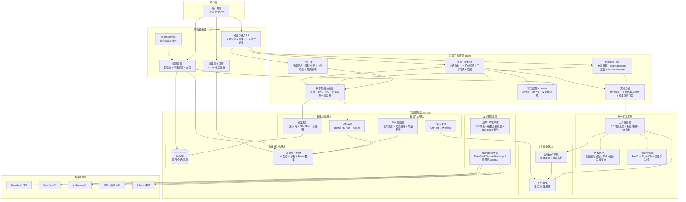

# 星图专家团工作台（社区版）

> **你的 AI 万能工作台，能力没有上限。业内首创：首个将「AI 专家团协作 + 无限可视化画布 + 智能仓库 Wiki」融为一体的本地桌面级工作台。编程只是它的能力之一。**

---

## 一、我们解决了什么行业难题？

### 1.1 工具太分散，效率被严重割裂

写代码用 IDE，翻译用网页，分析数据用 Excel，写文档用 Word，画图用 PS——**AI 能力被分散在十几个工具里**，每次切换都意味着上下文丢失、重复操作、效率断崖式下降。

### 1.2 现有工具只能干一件事

Copilot 只会写代码，ChatGPT 只能对话，Midjourney 只能画图——**没有一个工具能同时处理编程、翻译、写作、数据分析、文档处理、图像视频编辑等多种工作场景**。你需要的是一个工作台，不是一个又一个单点工具。

### 1.3 数据必须上传云端，隐私无从保障

当前 AI 工具（Qoder 专家团、CodeBuddy、GitHub Copilot 等）普遍是云端 SaaS，**你的数据必须上传到别人的服务器**：

- 企业核心代码与商业文档存在泄露风险
- 内网环境无法使用
- 敏感项目（金融、政务、军工）直接被排除在外

**星图专家团工作台是业内首款纯本地运行的 AI 万能工作台**，代码、文档、数据——所有工作内容永远不出你的电脑。一个工作台覆盖编程、翻译、写作、数据分析、文档处理等全场景，能力没有上限。

---

## 二、四大首创技术（友商做不到）

### 首创 1：主管-专家双层调度架构（非简单多轮对话）

**友商怎么做**：多个 AI 轮流说话，没有真正的分工协作，经常重复劳动或互相矛盾。

**我们怎么做**：

```
用户请求 → 主管（江星图）分析意图 → 制定调度计划 → 派遣专家 → 专家执行 → 主管审核 → 输出结果
```

- **主管层**：专职理解需求、自动识别 12 种场景、派遣专家、中途审核纠错、最终总结，绝不亲自写代码
- **专家层**：调研员、设计师、前端/后端/通用工程师、审查员、翻译官、写作家、数据分析师等，各司其职
- **流水线执行**：根据任务复杂度按最少必要阶段动态派发，简单改动可直接单专家完成，复杂任务再自动扩展为调研/设计/开发/审查协作链
- **动态替换**：根据任务类型自动选择前端/后端/通用工程师
- **对话式收尾**：主管会先开场说明处理方向，完成后再用正常聊天段落向用户总结结果，而不是只吐一条状态语

**技术实现**：
- **后端工作流引擎**：主管调度、步骤布局、执行轮次、followup 规划、步骤收尾、最终交付校验已经统一下沉到 Rust，不再由前端各处手搓状态机
- **专家执行 Runtime**：专家会话启动、提示模块计划、上下文装配、工具轮次推进、命令授权暂停/恢复、补交流程、专家收尾全部由后端 Runtime 驱动
- **双轨工具协议**：同时支持 OpenAI function calling 风格和 ACTION 标记格式（向后兼容），文件动作会被统一解析、校验并通过后端 patch / change session 合入
- **真实交付门禁**：实现类专家必须提交可执行源码变更；测试、审查、主管收尾都会基于真实工作区和动作来源做事实对账，阻止“口头完成”
- **增量落盘稳态**：针对已有项目里的短 `html/css/md` 文件，系统会优先走更稳定的整文件写回策略，并在 Rust 执行层提供注释清洗、唯一规则替换等兜底，降低“找不到段落/改不到文件”的概率

---

### 首创 2：感知索引 + 记忆系统双引擎上下文增强（非简单 RAG）

**友商怎么做**：把代码文件一股脑塞进上下文窗口，Token 爆炸，且找不到真正相关的代码。

**我们怎么做**：

**感知索引（Rust 实现）**：
- **代码分段**：按语义将代码文件切分为 chunk（函数、类、模块级别）
- **TF-IDF 检索**：基于词频-逆文档频率计算相关性
- **代码图谱**：分析 import/call/reference 关系，构建代码依赖图
- **融合排序**：TF-IDF 分数 + 图谱关联分数综合排序，返回最相关的代码段

**记忆系统（三级记忆模型）**：
- **瞬时记忆**（ephemeral）：当前对话的短期上下文
- **工作记忆**（working）：本次会话中专家的重要输出
- **长期记忆**（longterm）：跨会话沉淀的项目知识

**上下文管理器（新增）**：
- **Token 预算管控**：基于中英文混合估算算法，实时追踪消息 Token 用量
- **自动压缩**：超出阈值时自动将早期对话压缩为摘要，保留最近 N 轮完整上下文
- **Fragment 系统**：按优先级管理多种上下文片段（System/RAG/Memory/Blackboard/ToolSchema），低优先级片段在预算紧张时自动剔除

**自动检索**：每次调用专家前，系统自动从感知索引和记忆系统中检索相关上下文，注入到专家 prompt 中，实现"越用越懂你"。

---

### 首创 3：无限画布与专家团深度融合（业内唯一）

**友商怎么做**：纯文本对话，或者单独的画布工具（如 Excalidraw），与 AI 完全割裂。

**我们怎么做**：

- **项目结构可视化**：自动扫描代码仓库，生成可交互的拓扑图（文件夹=橙色节点，文件=绿色节点），点击即可查看文件内容
- **草稿白板**：手绘、便签、流程图、箭头连线，专家讨论过程中的思路全程可视化
- **架构设计模式**：拖拽式组件设计，从需求分析到系统架构一站式完成
- **画布与对话联动**：在画布上的操作可以触发专家分析，专家分析结果可以呈现在画布上
- **结构快照联动刷新**：专家真实新增或修改项目文件后，`.xt/config.json` 中的 structure / logic 快照会同步更新，不再出现“文件落盘了但可视化目录没刷新”的割裂状态

**技术实现**：基于 SVG 的无限画布引擎，支持缩放、拖拽、视口变换，所有图形数据持久化到本地 `.xt/config.json`。

---

### 首创 4：基于管控的动态规划词元分配系统（业内唯一）

**友商的问题**：没有 Token 管控，一个月烧掉几千元，效果还不好——因为 AI 在盲目调用，重复劳动、上下文爆炸、无效请求，钱花了，事没办成。

**我们的解决方案**：

**核心理念：给什么样的钱，就达到什么样的效果**

我们不是简单地"限制花钱"，而是通过精准管控实现**动态规划式资源分配**：

**双维度配额框架**：
- **项目级配额**：为每个项目设置日/月/年 Token 上限，确保重点项目优先获得资源
- **用户级配额**：个人用户跨项目的总配额池，防止个人滥用导致团队资源枯竭

**智能配额调度（动态规划）**：
- **配额前置校验**：每次调用专家前检查配额，不足时直接阻断，避免无效请求浪费 Token
- **核心角色豁免**：主管、星图等核心角色不受配额限制，确保关键决策不受影响
- **弹性分配**：复杂任务自动分配更多配额，简单任务消耗更少，实现资源最优配置

**RBAC 权限系统（精准授权）**：
- 每个专家拥有独立权限（读文件、写文件、执行代码、调用 API 等），只给必要的权限
- 路径级访问控制：限制专家只能访问指定目录，防止越权操作
- **效果**：同样的预算，我们的系统能让专家做更多有效工作，而不是把钱浪费在重复请求和无效探索上

**通俗理解**：
- 友商 = 给员工一张无限额信用卡，月底发现花了 5 万但项目没完成
- 我们 = 给每个员工精准的差旅预算 + 审批流程，确保每一分钱都花在刀刃上，项目按时交付

---

### 首创 5：多模态对话输入 + 双执行模式（计划 / 目标）

现在的聊天框不是单纯文本框，而是一个带动作菜单的任务入口：

- **文件附件**：用户可直接把图片、文本类文件等外部资料和文本一起发送给 AI
- **按计划进行**：主管先产出计划，再沿着计划逐步推进
- **按目标进行**：把目标作为停止条件，AI 自主拆解、持续推进并判断是否完成

**技术实现**：
- 输入区左下角内嵌动作菜单，支持文件选择、执行模式切换、附件状态可视化
- 图片附件会走多模态直读链路，先由主管模型提炼关键信息，再回灌给专家流水线
- 文本类附件会自动抽取摘要并注入任务上下文
- 音视频等尚未完全接通的模态会给出明确错误提示，而不是静默失败或假装成功
- 用户消息会保留模式和附件元信息，前端展示与后端调度使用同一份事实源
- 协作记录与命令输出默认以轻量卡片呈现，项目内命令默认免审核，减少对正常对话流的打断

---

## 三、不止编程 — 一个工作台，12 种场景覆盖

星图工作台不是又一个 IDE。同一个 Pipeline 引擎调度的不只是工程师，还有翻译官（江灵语）、写作家（江墨弦）、数据分析师（江数衍）、文档专员（江纸澜）、媒体专家（江画影）等 12 位专家，覆盖以下场景：

| 场景 | 对应专家 | 流水线 |
|------|----------|--------|
| **编程开发** | 调研员 → 设计师(可选) → 通用/前端/后端工程师 → 审查员 | 完整开发流程 |
| **代码审查** | 审查员 | 独立审查 |
| **技术调研** | 调研员 | 独立调研 |
| **翻译** | 翻译官 | 多语言互译 |
| **写作** | 调研员 → 写作家 | 调研后创作 |
| **数据分析** | 调研员 → 数据分析师 | 调研后分析 |
| **文档处理** | 文档专员 | 格式转换/内容提取 |
| **媒体创作** | 媒体专家 | 图像/视频/音频处理 |

> 你不是在十几个工具之间切换，而是在一个工作台上与一支 AI 专家团队协作。12 种场景，同一套架构，同一套工作流。

---

## 四、企业赞助价值（为什么值得投资）

### 1. 填补市场空白

当前市场没有**纯本地 + 全场景覆盖 + 专家团协作 + 可视化画布**的产品，这是一个完全空白的细分市场。企业客户（尤其是金融、政务、军工）对数据隐私有极高要求，但现有工具要么是云端 SaaS，要么只能处理单一场景——没有任何产品能做到"一个工作台，全场景覆盖，纯本地运行"。

### 2. 技术壁垒高

- **Rust + TypeScript 双栈**：后端 Rust 保证性能和安全，前端 TS 保证灵活性
- **自研感知索引**：非简单调用向量数据库，而是自研 TF-IDF + 代码图谱融合检索
- **自研记忆系统**：三级记忆模型 + 生命周期管理，非简单缓存
- **Pipeline 引擎**：完整的工作流编排系统，支持条件分支、并行执行

### 3. 商业模式清晰

- **社区版（开源）**：个人用户免费使用，形成用户基础和品牌认知
- **企业版（收费）**：
  - 私有化部署（企业内部服务器）
  - 团队协作功能（共享专家配置、共享 Wiki、共享画布）
  - 高级安全功能（LDAP/SSO 集成、审计日志、数据加密）
  - 定制开发（根据企业需求定制专家角色和工作流）

### 4. 可扩展性强

- **专家市场**：未来可以开放专家角色市场，第三方开发者可以售卖自定义专家
- **插件系统**：支持插件扩展，对接企业内部的 CI/CD、项目管理工具
- **多模态**：未来可以扩展支持图片、视频、音频的分析

### 首创 6：统一工具系统 + 层叠配置（Codex 级架构规范）

**友商的问题**：工具调用硬编码在 prompt 里，没有统一管理；配置散落在各处，无法针对不同项目定制行为。

**我们的解决方案**：

**统一工具系统（前后端双注册表）**：
- **8 个内置工具**：shell_exec、file_read、file_write、file_patch、file_list、web_search、memory_query、index_search
- **专家-工具权限映射**：每个专家只能调用其角色允许的工具（工程师可写文件，调研员只读+搜索）
- **Trait 抽象**：Rust 端通过 `ToolExecutor` Trait 实现可扩展的工具架构，新增工具只需实现 Trait 并注册
- **file_patch 结构化补丁**：支持 Add/Delete/Update/Move 四种操作，四级容错匹配（精确→右trim→双侧trim→Unicode归一化），Delta 跟踪确保部分失败时反馈精确
- **Hook 管控**：PreTool/PostTool/PreExpert/PostExpert 四个拦截点，可注入上下文、跳过、重试
- **后端统一落盘**：前端不再直接充当半个文件执行器，文件提案、补丁合入、交付分析都由 Rust 统一处理

**层叠配置系统（四级优先级）**：
- 内置默认 < 用户全局（~/.xt/config.json）< 项目级（.xt/project-config.json）< 运行时覆盖
- 涵盖 LLM（Provider/模型/温度/重试）、Shell（超时/输出上限）、Agent（最大轮数/Token预算/死循环检测）、Pipeline（专家超时/最大步骤/并行开关）、UI（流式输出/工具调用可见/进度条）六大配置域
- Rust 端 JSON 深度合并，TypeScript 端同步单例，前后端一致

---

## 五、技术架构



### 当前实现边界

- **前端主要职责**：展示消息、渲染进度、处理授权弹窗、承载附件入口和模式切换
- **后端主要职责**：主管调度、流水线执行、专家 runtime、工具解析/执行、文件变更合入、交付真实性校验
- **测试链**：除了命令行回归脚本 `npm run cli:test`，当前也以真实前端 E2E 作为主验收链，按用户点击路径、模糊提示词和真实项目磁盘结果做最终确认

---

## 六、开发者

**江仕玺**

---

## 七、联系我们

欢迎加入星图专家团交流群，获取技术支持、分享使用心得：

| 交流群 | 群号 |
|--------|------|
| 专家团技术交流群 | 454431953 |
| 专家团用户交流群 | 453515362 |

**官网地址**：[http://38.175.195.228:5000/](http://38.175.195.228:5000/)

---

## 八、开源协议

本软件采用双许可证模式，开源仅针对于个人用户：

| 许可证 | 适用场景 |
|--------|----------|
| MIT | 个人非商用非营利目的 |
| GPL-3.0 | 个人商用、盈利目的 |

> **企业版声明**：开源仅针对于个人，企业、组织或机构如需部署、使用或二次开发本软件，需购买企业版授权。

---

## 九、快速开始

### 环境要求

- [Node.js](https://nodejs.org/) 18+
- [Rust](https://www.rust-lang.org/tools/install) 最新稳定版

### 安装依赖

```bash
npm install
```

### 开发模式

```bash
npm run tauri dev
```

### 构建发布版

```bash
npm run tauri build
```

### 回归测试

```bash
npm run build
npm run cli:test
```

如果需要把前端真实测试项目恢复到干净基线，可使用：

```bash
npm run restore:test-baseline
```

## 推荐开发环境

- [VS Code](https://code.visualstudio.com/) + [Tauri](https://marketplace.visualstudio.com/items?itemName=tauri-apps.tauri-vscode) + [rust-analyzer](https://marketplace.visualstudio.com/items?itemName=rust-lang.rust-analyzer)
